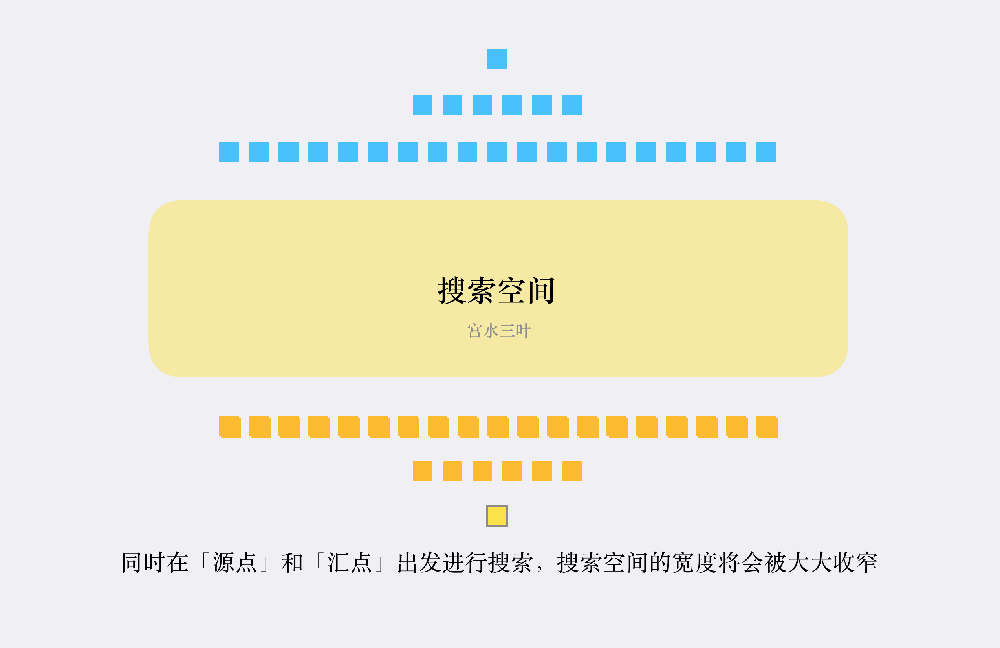

## 雙向 BFS 介紹

在一般的 BFS 實作中，空間的瓶頸主要取決於搜尋空間中的最大寬度。 那麼有沒有辦法讓我們不使用這麼寬的搜尋空間，同時又能確保搜尋到目標結果呢？ 「雙向 BFS」 可以很好的解決這個問題： 同時從兩個方向開始搜索，一旦搜索到相同的值，意味著找到了一條聯通起點和終點的最短路徑。 對於「有解」、「有一定數據範圍」同時「層級節點數量以倍數或指數級成長」的情況，「雙向BFS」的搜尋空間通常只有「一般 BFS」的空間消耗的幾百分之一，甚至幾千分之一。

<figure markdown>
  { width="400" }
</figure>

「雙向 BFS」的基本實作想法如下： 

1. 創建“兩個隊列”分別用於兩個方向的搜尋；
2. 建立“兩個哈希表”用於“解決相同節點重複搜尋”和“記錄轉換次數”；
3. 為了盡可能讓兩個搜尋方向“平均”，每次從佇列中取值進行擴展時，先判斷哪個佇列容量較少；
4. 如果在搜尋過程中「搜尋到對方搜尋過的節點」，表示找到了最短路徑。

「雙向 BFS」基本想法對應的偽代碼大致如下：

```cpp linenums="1" title="pseudocode"
// q1、q2 分別為從 s, t 做為起點的 queue
// mp1、mp2 分別為從 s, t 做為起點紀錄最短距離用的

// 只有兩個 queue 都不是空的，才能繼續做
// 如果其中一個 queue 空了，表示從某個方向搜到底都搜不到該方向的目標節點
while (q1.size() && q2.size()) {
    if (q1.size() < q2.size()) {
        update(q1, m1, m2);
    } else {
        update(q2, m2, m1);
    }
}

// update 為將目前 queue 中包含的元素取出，進行一層的 bfs
void update(queue d, map cur, map other) {}
```

## 時間複雜度

- 普通 BFS : (degree-1)^t

- 雙向 BFS : (degree-1)^(t/2) + 合併

## 例題

???+note "[Leetcode 752. Open the Lock](https://leetcode.com/problems/open-the-lock/)"
	有一個滾輪式四位密碼圈，初始的密碼為 0000，每次可以轉其中一位一格。給定一些不合法的密碼，和目標密碼，問最少轉幾次可達到目標密碼，且途中不出現不合法密碼
	
	不合法密碼數量 $\le 500$
	
	??? note "code"
		```cpp linenums="1"
		class Solution {
	       public:
	        string s, t;
	        unordered_set<string> st;
	        int openLock(vector<string>& deadends, string target) {
	            s = "0000";
	            t = target;
	            if (s == t) return 0;
	            for (const auto& d : deadends) st.insert(d);
	            if (st.count(s)) return -1;
	            int ans = bfs();
	            return ans;
	        }
	        int bfs() {
	            queue<string> d1, d2;
	            unordered_map<string, int> m1, m2;
	            d1.push(s);
	            m1[s] = 0;
	            d2.push(t);
	            m2[t] = 0;
	            while (d1.size() and d2.size()) {
	                int t = -1;
	                if (d1.size() <= d2.size()) {
	                    t = update(d1, m1, m2);
	                } else {
	                    t = update(d2, m2, m1);
	                }
	                if (t != -1) return t;
	            }
	            return -1;
	        }
	        int update(queue<string>& q, unordered_map<string, int>& cur, unordered_map<string, int>& other) {
	            int m = q.size();
	            while (m-- > 0) {
	                string t = q.front();
	                q.pop();
	                int step = cur[t];
	                for (int i = 0; i < 4; i++) {
	                    for (int j = -1; j <= 1; j++) {
	                        if (j == 0) continue;
	                        int origin = t[i] - '0';
	                        int next = (origin + j) % 10;
	                        if (next == -1) next = 9;
	                        string copy = t;
	                        copy[i] = '0' + next;
	                        if (st.count(copy) or cur.count(copy)) continue;
	                        if (other.count(copy))
	                            return step + 1 + other[copy];
	                        else {
	                            q.push(copy);
	                            cur[copy] = step + 1;
	                        }
	                    }
	                }
	            }
	            return -1;
	        }
	    };
	    ```

???+note "八位數碼類似題 [CSES - Swap Game](https://cses.fi/problemset/task/1670)"
	給一個 3 * 3 的 grid，裡面的數自恰為 1, 2, ..., 9，問每次 swap 相鄰的兩項最少幾次可變成下面的 grid
	
	```
	1 2 3
	4 5 6
	7 8 9
	```
	
	??? note "思路"
		最多也才 9! 種狀態，可以暴力 bfs，至於要怎麼將一個 grid 壓成 int 呢，可以套用 hash 的方法:
		
		$$
		S=\sum_{i=0}^{8}a_i\times 9^{i}
		$$
		
		其中 a[i] = 0...8。若要詢問第 i 項的數字，可以直接回傳 (S / 9^i) % 9
	
	??? note "code(普通 BFS)"
		```cpp linenums="1"
		#include <bits/stdc++.h>
	    #define int long long
	
	    using namespace std;
	
	    int h[11];
	    bitset<387420489> vis;
	
	    int swap(int i, int j, int state) {
	        int a = (state / h[i]) % 9;
	        int b = (state / h[j]) % 9;
	        state += (b - a) * h[i];
	        state += (a - b) * h[j];
	        return state;
	    }
	
	    int solve(int s, int t) {
	        queue<pair<int, int>> q;
	        q.push({s, 0});  
	        vis[s] = 1;
	        while (q.size()) {
	            auto [state, step] = q.front();
	            q.pop();
	            if (state == t) return step;
	
	            for (int i = 0; i < 9; i++) {
	                if (i % 3 != 2) {
	                    int nxt = swap(i, i + 1, state);
	                    if (!vis[nxt]) {
	                        q.push({nxt, step + 1});
	                        vis[nxt] = 1;
	                    }
	                }
	                if (i < 6) {
	                    int nxt = swap(i, i + 3, state);
	                    if (!vis[nxt]) {
	                        q.push({nxt, step + 1});
	                        vis[nxt] = 1;
	                    }
	                }
	            }
	        }
	    }
	
	    signed main() {
	        h[0] = 1;
	        for (int i = 1; i <= 9; i++) {
	            h[i] = h[i - 1] * 9;
	        }
	        int s = 0, t = 0;
	        for (int i = 0; i < 9; i++) {
	            t += i * h[i];
	        }
	        for (int i = 0; i < 9; i++) {
	            int x;
	            cin >> x;
	            x--;
	            s += x * h[i];
	        }
	        if (s == t) {
	            cout << 0 << '\n';
	        } else {
	            cout << solve(s, t) << '\n';
	        }
	    }
		```
		
	??? note "code(雙向 BFS)"
		```cpp linenums="1"
		#include <bits/stdc++.h>
	    #define int long long
	
	    using namespace std;
	
	    int h[11];
	
	    int swap(int i, int j, int state) {
	        int a = (state / h[i]) % 9;
	        int b = (state / h[j]) % 9;
	        state += (b - a) * h[i];
	        state += (a - b) * h[j];
	        return state;
	    }
	
	    int bfs(queue<int> &q, unordered_map<int, int> &mp1, unordered_map<int, int> &mp2) {
	        int m = q.size();
	        while (m--) {
	            int state = q.front();
	            q.pop();
	
	            function<int(int)> update = [&](int nxt) {
	                if (mp1.count(nxt)) {
	                    return -1LL;
	                }
	                if (mp2.count(nxt)) {
	                    return mp1[state] + 1 + mp2[nxt];
	                }
	                mp1[nxt] = mp1[state] + 1;
	                q.push(nxt);
	                return -1LL;
	            };
	
	            for (int i = 0; i < 9; i++) {
	                if (i % 3 != 2) {
	                    int nxt = swap(i, i + 1, state);
	                    int ret = update(nxt);
	                    if (ret != -1) {
	                        return ret;
	                    }
	                }
	                if (i < 6) {
	                    int nxt = swap(i, i + 3, state);
	                    int ret = update(nxt);
	                    if (ret != -1) {
	                        return ret;
	                    }
	                }
	            }
	        }
	        return -1;
	    }
	
	    int solve(int s, int t) {
	        queue<int> q1, q2;
	        unordered_map<int, int> mp1, mp2;
	        q1.push(s);
	        mp1[s] = 0;
	        q2.push(t);
	        mp2[t] = 0;
	        while (q1.size() && q2.size()) {
	            int t = -1;
	            if (q1.size() > q2.size()) {
	                t = bfs(q1, mp1, mp2);
	            } else {
	                t = bfs(q2, mp2, mp1);
	            }
	            if (t != -1) return t;
	        }
	        return -1;
	    }
	
	    signed main() {
	        h[0] = 1;
	        for (int i = 1; i <= 9; i++) {
	            h[i] = h[i - 1] * 9;
	        }
	        int s = 0, t = 0;
	        for (int i = 0; i < 9; i++) {
	            t += i * h[i];
	        }
	        for (int i = 0; i < 9; i++) {
	            int x;
	            cin >> x;
	            x--;
	            s += x * h[i];
	        }
	        if (s == t) {
	            cout << 0 << '\n';
	        } else {
	            cout << solve(s, t) << '\n';
	        }
	    }
		```

???+note "[2023 全國賽 pE. 迷宮鑰匙圈 (Maze)](https://sorahisa-rank.github.io/nhspc-fin/2023/problems.pdf#page=19)"
	有一個 n * m 的二維迷宮，給定若干顆彈珠的起始位置，問至少需要將迷宮整個向左或向右旋轉幾次才能讓每顆彈珠都掉出迷宮
	
	$n, m\le 15,$ 彈珠數量介於 1 ~ 3 顆
	
	??? note "思路"
		因為迷宮大小 15 * 15，所以最多 $(15\times 15 + 1)^3 \simeq 10^7$ 種不同狀態。我們可以利用狀態搜索，也就是像八位數碼問題，建圖後 BFS 求最短路徑。
	
		至於如何快速判斷左轉右轉後鋼珠會移動到哪我們可以用預處理的方式得到。記得在狀態紀錄時也要處理只剩下一顆或兩顆球的狀況，屬於較為麻煩的實作題。

???+note "[CF 1070 A. Find a Number](https://codeforces.com/problemset/problem/1070/A)"
    給定兩個數 $d,s$，找出最小數 $n$ 使 $d\mid n$ 且 $n$ 的各位數和為 $s$，若無解輸出 -1

    $d\le 500, s\le 5000$
    
    ??? note "思路"
		最暴力的思路肯定就是枚舉 d 的所有倍數，但我們發現又有無解的情況，答案又可能很長，所以我們試試看「搜索」。因為這個題要求最小數 n ，所以不能用 dfs，應該用 bfs + 記憶化搜索，這樣是可以保證最小的。狀態自然就是題目給定的兩個：n 模 d 下的餘數 rem，還有各位數和 sum，但最後我們要 backtracking 輸出答案，所以還要記錄每個狀態先前是從哪裡轉移過來的。從高位填到低位，枚舉每個數字要填什麼，轉移的話就是：

        <center>
            (rem, sum) &rarr; ((10 * rem + i) % d, sum + i)
        </center>

        注意到如果一個狀態被轉移到第二次不用理他，因為一定是更劣的。
	
	??? note "code"
		```cpp linenums="1"
		#include <bits/stdc++.h>
        using namespace std;

        typedef pair<int, int> pii;

        const int N = 5e2 + 5;
        const int M = 5e3 + 5;
        int d, s;
        pii pre[N][M];  // pre[i][j]表示狀態{i, j}是由哪個狀態擴展來的
        queue<pii> que;

        void bfs() {
            que.push({0, 0});
            while (que.size()) {
                int rem = que.front().first, sum = que.front().second;
                que.pop();
                for (int i = 0; i <= 9; i++) {
                    int rem1 = (rem * 10 + i) % d, sum1 = sum + i;
                    if (sum1 <= s && pre[rem1][sum1] == (pii){-1, -1}) {  // 只要第一次擴展
                        pre[rem1][sum1] = {rem, sum};
                        que.push({rem1, sum1});
                    }
                }
            }
        }

        void print(int rem, int sum) {  // backtracking
            if (rem || sum) {
                print(pre[rem][sum].first, pre[rem][sum].second);
                printf("%d", sum - pre[rem][sum].second);
            }
        }

        int main() {
            scanf("%d%d", &d, &s);
            for (int i = 0; i < d; i++) {
                for (int j = 0; j <= s; j++) {
                    pre[i][j] = {-1, -1};  // 初始化
                }
            }
            bfs();
            if (pre[0][s] == (pii){-1, -1}) {  // 如果BFS結束後，答案沒有擴展到，則無解
                printf("-1");
            } else {
                print(0, s);
            }
            return 0;
        }
		```
	
## 參考資料

- <https://leetcode.cn/problems/open-the-lock/solutions/843986/gong-shui-san-xie-yi-ti-shuang-jie-shuan-wyr9/>