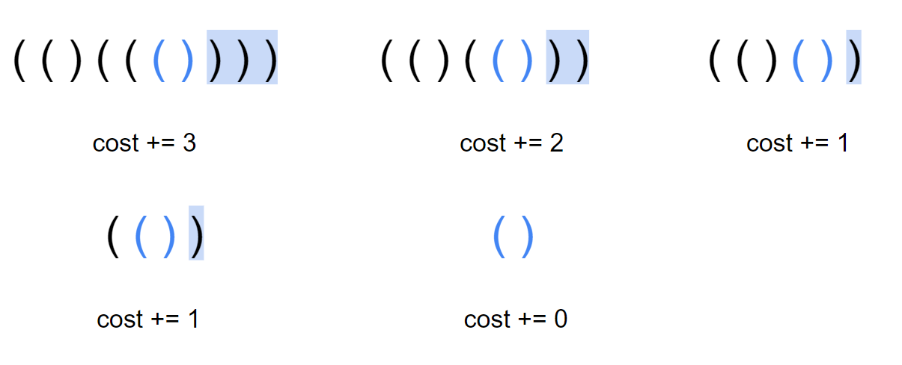

## 反悔貪心

通常是利用某個條件達到一定的值時，我們再進去貪心，例如排程的時間總和已經大於我們限制的時間，或是當先前所做的決策比目前的決策更劣，我們就會將進行反悔。

??? info "貪心與動態規劃的使用時機"
	貪心與動態規劃相同點是要求原問題必須有最優子結構。而不同點在於貪心法的計算方式為 Top down，並不等待子問題求解完畢後再選擇使用哪一個，而是通過一種策略直接選擇一個子問題去求解，沒被選擇的子問題直接拋棄。這種所謂「最優選擇」的正確性需要用歸納法證明。而動態規劃不管是採用自 top down 或 bottom up 的計算方式，都是從邊界開始向上得到目標問題的解（即考慮所有子問題）。
	
	至於怎樣判斷是貪心還是 dp? 就看能否判斷貪心是否會壞掉，如果能證明貪心不可行，可能就是 dp 求解了。
	
	通常在 n 比較大的題目時，dp 能做的轉移式會花的時間比較高，這時就可以考慮貪心，一般貪心都能在 O(n) 或 O(n log n) 的時間求解，而 dp 則是要看狀態與轉移的時間。

### 反悔自動機

即設計一種反悔策略，使得隨便一種貪心策略都可以得到正解。基本的設計思路是：每次選擇直觀上最接近全局最優解的貪心策略，若發現最優解不對，就想辦法**自動**支持反悔策略。 （這就是自動機的意思）

具體題目具體分析。一般需要反悔自動機的題都是通過差值巧妙達到反悔的目的。

???+note "[CF865D Buy Low Sell High](https://codeforces.com/problemset/problem/865/D)"
    已知接下來 $n$ 天的股票價格，每天你可以做其中一件事
    
    1. 買進一股股票
    
    2. 賣出一股股票
    
    3. 什麼也不做
    
    $n$ 天之後你手上不能有多餘的股票，求利潤最大多少
    
    $2\le n\le 3\times 10^5$
    
    ??? note "思路"
    	我們將每天的價格視為一個個"選項"， 壓入小根堆中，為了確保買入操作在賣出操作之前，我們從前往後掃描 p，對於現在的價格 p[i]，如果堆頂元素 p[j] 滿足 p[j] < p[i]，那麼，我們取出堆頂，在第 j 天買入股票，在第 i 天賣出股票，此時，我們就可以獲得 p[i] - p[j] 的收益。
    
        然而，如果之後有 p[k] 滿足 p[k] > p[i]，那麼，我們目前所做的決策可能不是最優的，如何反悔？
    
        於是，當我們進行上述操作時，我們將 p[i] 也壓入堆中，增加一個 p[i] 的選項，彈出時，我們相當於將 p[j]  按照 p[i] 的價格又買了回來
        
        > 這個跟[期權](https://zh.wikipedia.org/wiki/%E6%9C%9F%E6%AC%8A)的概念相關
    
    ??? note "code"
        ```cpp linenums="1"
        void solve() {
            priority_queue<int, vector<int>, greater<int>> pq;
            cin >> n;
    
            for (int i = 1; i <= n; ++i) {
                cin >> x;
    
                pq.push(x);
                if (pq.size() && pq.top() < x) {
                    ans += x - pq.top(); 
                    pq.pop();
                    pq.push(x);
                }
            }
            cout << ans << "\n";
        }
        ```

???+ note "[洛谷 P1792 [国家集训队]种树](https://www.luogu.com.cn/problem/P1792)"
	給定長度為 $n$ 的環形陣列，第 $i$ 個位置有權值 $a_i$，求相鄰的不能同時選的情況下選 $m$ 個位置的權值總和最大能多少
	
	$n,m\le 2\times 10^5$
	
	??? note "思路"
		考慮這個問題的簡化版本：我們去掉「不能選相鄰的土地」的條件，那麼問題就變成了一個非常顯而易見的貪心：排序，選最大的 $m$ 個
		
		只是我們必須要能支援反悔動作，我們選定 $a[i]$ 之後，有什麼情況是跟這個情況互相對立的嗎 ? 答案就是 $a[i - 1] + a[i + 1]$，因為當前既然選了 $a[i]$ 代表他是當前最大的，那如果只選擇 $a[i-1]$ 或只選擇 $a[i+1]$ 顯然直接選 $a[i]$ 還會更好
		
		所以我們貪心的策略就是支援選了 $a[i]$ 之後，將 $a[i-1]$ 和 $a[i+1]$ 從環上刪掉，將 $a[i]$ 改成 $(a[i-1] + a[i+1]) - a[i]$
		
	??? note "code"
		```cpp linenums="1"
		priority_queue<pii> pq;
	    void init() {
	        cin >> n >> m;
	        if (m * 2 > n) {
	            cout << "Error\n";
	            exit(0);
	        }
	        for (int i = 1; i <= n; i++) cin >> a[i];
	        for (int i = 1; i <= n; i++) {
	            next[i] = i + 1;
	            pre[i] = i - 1;
	            pq.push(make_pair(a[i], i));
	        }
	        pre[1] = n;
	        next[n] = 1;
	    }
	
	    void del(int x) {
	        next[pre[x]] = next[x];
	        pre[next[x]] = pre[x];
	        deleted[x] = true;
	    }
	
	    void greed() {
	        while (deleted[pq.top().id]) pq.pop();
	        int x = pq.top().id;
	        pq.pop();
	        ans += a[x];
	        a[x] = a[pre[x]] + a[next[x]] - a[x];
	        del(pre[x]);
	        del(next[x]);
	        pq.push(make_pair(a[x], x));
	    }
	
	    void work() {
	        for (int i = 1; i <= m; i++) greed();
	        cout << ans << "\n";
	    }
		```

???+note "[USACO 2012 FEB Cow Coupons](https://www.luogu.com.cn/problem/P3045)"
    有 $n$ 頭牛，目前有 $m$ 元，還有 $k$ 張優惠券。第 $i$ 頭牛的價格為 $p_i$，如果使用優惠券則為 $c_i$。問最多能買到多少頭牛
    
    $k\le n\le 5\times 10^4, c_i\le p_i\le 10^9, 1\le m\le 10^{14}$
    
    ??? note "思路"
    	一個直覺的想法就是維護最小堆，將每個物品的 p[i], c[i] 都加入裡面，每次 pop 最小的出來，若沒取過就直接取。但這樣若優惠券都被用完了，後面的 i 就只能以 p[i] 來取，但說不定將一個優惠券移過來用在 i 上總花費比用 p[i] 買來的更便宜，所以我們需要一個反悔的操作，維護的是 (p[j] - c[j])，若對於 i 來說 c[i] + (p[j] - c[j]) < p[i]，代表可將優惠券移過來用在 i 上。
    	
    	實作上來說，我們可以開三個 min heap，一個存每一頭牛的原價 P，一個存每一頭奶牛使用優惠卷後的價格 C，一個存放原價和使用優惠卷後的價格的差 delta。一開始先把所有的 c[i] 放入 C，p[i] 放入 P，然後在存放差值的隊列中放入 k 個 0，表示目前有 k 張優惠卷可以使用，即不用補差價。
    
    	接著便是調整優惠卷的使用。在剩下的錢還沒用完的情況下，我們每一次取出存放 C 和 P 的 top，根據貪心，如果 P.top() < C.top() + delta.top()，就用原價 p[i] 買入，否則，我們就使用優惠卷，進行反悔貪心。最後，我們把這頭乳牛打上標記，防止之後再被取出。
    	
    	> 註 : 有些博客只有維護未購買的牛的 $p_i$ 的 min heap，這是錯誤的，要同時維護 $c_i$ 和 $p_i$ 才有最優解，因為「對於剩下的無非兩種選擇，$p$ 買，$c$ 買」兩種都要同時考慮
    
    ??? note "code"
    	```cpp linenums="1"
    	#include <bits/stdc++.h>
        #define int long long
    
        using namespace std;
        using pii = pair<int, int>;
    
        const int MAXN = 50010;
    
        int n, k, m;
        int p[MAXN], c[MAXN];
        bool buy[MAXN];  // buy[i] 表示第 i 個物品是否被買過
        int ans = 0;
        priority_queue<pii, vector<pii>, greater<pii>> P, C;
        priority_queue<int, vector<int>, greater<int>> delta;
    
        signed main() {
            cin >> n >> k >> m;
            for (int i = 1; i <= n; ++i) {
                cin >> p[i] >> c[i];
                P.push(make_pair(p[i], i));
                C.push(make_pair(c[i], i));
            }
            for (int i = 1; i <= k; ++i) {
                delta.push(0);
            }
            while (!P.empty()) {
                auto [pval, pid] = P.top();
                auto [cval, cid] = C.top();
                if (buy[pid]) {  // 如果被買過了，就跳過
                    P.pop();
                    continue;
                }
                if (buy[cid]) {
                    C.pop();
                    continue;
                }
                if (delta.top() + cval > pval) {  // 用原價買 i 比較划算
                    m -= pval;
                    P.pop();
                    buy[pid] = true;
                } else {  // 否則的話，就是用優惠券買 i 比較划算
                    m -= cval + delta.top();
                    delta.pop();
                    C.pop();
                    buy[cid] = true;
                    delta.push(p[cid] - c[cid]);
                }
                if (m >= 0) {
                    ans++;
                } else {
                    break;
                }
            }
            cout << ans << endl;
            return 0;
        }
    	```

### 反悔堆

即通過堆（大根堆、小根堆）來維護當前貪心策略的最優解，若發現最優解不對，就退回上一步，更新最優解。

由於堆的性質，使得堆的首數據一定是最優的，這就可以實現快速更新最優解。

???+note "區間調度問題 - 最大總權重 [[USACO09OPEN] Work Scheduling G](https://www.luogu.com.cn/problem/P2949)"
    有 $n$ 項工作，每項工作有一個截止時間 $t_i$，完成每項工作可以得到利潤 $w_i$，求最大可以得到多少利潤。
    
    ??? note "code"
    	```cpp linenums="1"
    	void solve() {
            cin >> n;
            for (int i = 1; i <= n; i++) cin >> a[i].time >> a[i].w;
            sort(a + 1, a + 1 + n);
    
            for (int i = 1; i <= n; i++) {
                if (a[i].time <= pq.size()) {
                    if (a[i].w > pq.top()) {
                        ans += a[i].w - pq.top();
                        pq.pop();
                        pq.push(a[i].w);
                    }
                } else {
                    ans += a[i].w;
                    pq.push(a[i].w);
                }
            }
    
            cout << ans << "\n";
        }
        ```
        > full code : <http://codepad.org/pMPsRor9>

???+note "洛谷 P4053 [JSOI2007] 建筑抢修"
	參見[此處](/wiki/basic/greedy/scheduling/#_1)

???+note "[CF 1271D Portals](https://codeforces.com/problemset/problem/1271/D)"
	你需要依照 $1,2,...,n$ 的順序依次征服城堡。你一開始有 $k$ 個士兵，第 $i$ 個城堡有 $a_i$ 代表征服它所需的最少士兵數量，征服城堡後可以獲得 $b_i$ 個士兵，城堡有一個權重 $c_i$
	
	如果你在城堡中留下至少一名士兵進行防守，該城堡就會被視為防守成功。征服城堡後可以留下士兵進行防守，也可以使用城堡之間的傳送門，傳送一個士兵過去。如果你沒有足夠的士兵來征服下一個城堡，則遊戲失敗
	
	你的目標是在征服所有城堡的前提下最大化所有防守成功城堡的權重之和
	
	??? note "思路"
		一路掃過去，每次都假定留守所有可留守的點，發現當前的士兵不夠則從已留守的點中選取權重最小的放棄留守
		對於每個 $u_i \rightarrow v$ 我們只留編號最大的 $\max(u_i) \rightarrow v$ 這條邊，因為越後面你的軍隊會越大，也越容易成功留守
		
		基於以上的策略，預處理出每個點可留守的集合，遍歷到該點直接將可留守的全部 push 到已留守集合中，再遍歷下一個點。在遍歷點過程中發現士兵不夠，pop 已留守集合，如果 pop 空了還不夠，說明遊戲失敗。
		
		詳細見代碼
		
	??? note "code"
		```cpp linenums="1"
		void init() {
	        cin >> n >> m >> k;
	        for (int i = 1; i <= m; i++) {
	            cin >> a[i] >> b[i] >> c[i];
	            last[i] = i;
	        }
	        for (int i = 1; i <= m; i++) {
	            cin >> u >> v;
	            last[v] = max(last[v], u);
	        }
	        for (int i = 1; i <= n; i++) {
	            add_edge(last[i], i);
	            // edge (last[i] -> i)
	        }
	    }
	    void solve() {
	        priority_queue<int, vector<int>, greater<int>> pq;
	        int ans = 0;
	        for (int i = 1; i <= n; i++) {
	            while (k < a[i] && !pq.empty()) k++, pq.pop();
	            if (k < a[i]) {
	                cout << "-1\n";
	                return;
	            }
	            k += b[i];
	            for (auto v : G[u]) {
	                pq.push(c[v]);
	                k--;
	            }
	        }
	        while (k < 0 && !pq.empty()) pq.pop();
	        if (k < 0) {
	            cout << "-1\n";
	            return;
	        }
	        while (!pq.empty()) ans += pq.top(), pq.pop();
	        cout << ans << "\n";
	    }
		```

## 題目

???+ note "[2023 成大初賽 pC. 大富翁](https://codeforces.com/gym/437848/problem/C)"
	給 $a_1\sim a_n$，$a_i$ 表示第 $i$ 天的收入，給 $b_1\sim b_n$，$b_i$ 表示第 $i$ 天的花費上限，另外每天花完錢後餘額不能是負數。給指定的 $k$ 天，這 $k$ 天結束的時候，身上剩下的錢要剛好是 0 元。目標是有花錢的天數要愈少愈好。
	
	??? note "思路"
		- $a_n$ 的收入，只能在 $b_n$ 花掉
		
		- $a_{n-1}$ 的收入，只能是 $b_{n-1}$ or $b_n$ 花掉
		
		- $a_{n-2}$ 的收入，只能是 $b_{n-2}$ or $b_{n-1}$ or $b_n$ 花掉
	
	    - 觀察最後一天，如果 $a_n > 0$，那 $b_n$ 就一定要使用
	
	    - $b_{n}$ 一定要使用的前提下，$b_{n}-a_{n}$ 是多來還能花費的，這個時候會優先花 $a_{n-1}$ 的收入
		
		- 如果還有剩，再拿去花 $a_{n-2}, a_{n-3}, a_{n-4},..$ 的收入
	
	    - 從後往前維護大的 $b_i$
	
	??? note "code"
		```cpp linenums="1"
		int solve(vector<int> a, vector<int> b) {
	        int n = a.size();
	        priority_queue<int> pq;
	        int rest = 0;
	        for (int i = n - 1; i >= 0; i--) {
	            pq.push(b[i]);
	            rest += a[i];
	            while (pq.size() && rest > 0) {
	                int x = pq.top();
	                pq.pop();
	                rest -= x;
	            }
	            if (rest > 0) return -1;
	        }
	        return n - (int)pq.size();
	    }
		```
	??? note "[rahlin](https://codeforces.com/profile/rahlin1004)'s code"
	    ```cpp linenums="1"
	    #include <bits/stdc++.h>
	    #define int long long
	    #define pii pair<int, int>
	    #define pb push_back
	    #define mk make_pair
	    #define F first
	    #define S second
	    using namespace std;
	
	    const int INF = 2e18, MAXN = 1e6 + 5, M = 1e9 + 7;
	    int n, k, a[MAXN], b[MAXN], t[MAXN], ans = 0;
	
	    signed main() {
	        ios::sync_with_stdio(0);
	        cin.tie(0);
	        cin >> n >> k;
	        for (int i = 0; i < n; i++) cin >> a[i];
	        for (int i = 0; i < n; i++) cin >> b[i];
	        for (int i = 0; i < k; i++) cin >> t[i];
	        sort(t, t + k);
	
	        int lb = -1;
	        for (int i = 0; i < k; i++) {
	            priority_queue<int> pq;
	            int rb = t[i] - 1, l = t[i] - 1;
	            pq.push(b[rb]);
	            while (l > lb && pq.size()) {
	                int f = pq.top();
	                pq.pop();
	                ans++;
	                while (l > lb && f >= 0) {
	                    if (f >= a[l]) {
	                        f -= a[l];
	                        a[l] = 0;
	                        l--;
	                        if (l > lb) pq.push(b[l]);
	                    } else {
	                        a[l] -= f;
	                        f = 0;
	                        break;
	                    }
	                }
	            }
	            if (l != lb) {
	                cout << -1 << "\n";
	                exit(0);
	            }
	            lb = rb;
	        }
	        cout << ans << "\n";
	    }
	
	    /*
	    5 2
	    1 2 3 4 5
	    1 1 1 1 1
	    2
	    4
	
	    5 3
	    5 4 3 2 1
	    4 8 7 6 3
	    1
	    3
	    5
	    */
	    ```

???+ note "[d053: Q-4-8. 先到先服務 (*)](https://judge.tcfsh.tc.edu.tw/ShowProblem?problemid=d053)"
	有 $n$ 個人要依次分配到 $m$ 個櫃台被服務，第 $i$ 個人占用 $t_i$ 的時間。求最短時間完成所有人的服務
	
	??? note "code"
	    ```cpp linenums="1"
	    #include <iostream>
	    #include <queue>
	    using namespace std;
	
	    signed main() {
	        long long int N, M, t, ot, ans;
	        priority_queue<long long int, vector<long long int>, greater<long long int>> pq;
	        cin >> N >> M;
	        for(int i = 0; i < M; i++) pq.push(0);
	        for(int i = 0; i < N; i++){
	            cin >> t;
	            ot = pq.top();
	            pq.pop();
	            pq.push(ot + t);
	            // 加入目前最空的櫃台
	        }
	        while(pq.size()){
	            ans = pq.top();
	            pq.pop();
	        }
	        // 取最大的
	        cout << ans << endl;
	    }
	    ```

???+note "[洛谷 P3419 [POI2005]SAM-Toy Cars](https://www.luogu.com.cn/problem/P3419)"
	Jasio 有 $n$ 個不同的玩具，而地上只能放最多 $k$ 個玩具。如果玩具不在地上，則他媽媽要幫他從架子上拿，如果此時地板上的玩具已經達到了 $k$ 個，則還要拿一個玩具放回架子。Jasio 依次想玩編號為 $p_1,\ldots,p_n$ 的玩具，求一種安排方式使得媽媽從架子上拿玩具的次數最少。
	
	??? note "思路"
		貪心的用 pq 去維護下次出現的 index，越後面才出現的 toy 可以先放上去
	
		注意到實作的部分若當前的 toy 已經在地板上了那他永遠也出不去 pq (因為每一輪都會有一個東西被 push 進來，而該東西一定比較大)
		
		參考博客的小技巧，我們直接將 `k++` 即可解決
	
	??? note "code"
		```cpp linenums="1"
		void solve () {
	        cin >> n >> k >> p;
	        for (int i = 1; i <= p; ++i)
	            cin >> req[i];
	        for (int i = p; i; --i) {
	            nxt[i] = ((pos[req[i]]) ? pos[req[i]] : (p + 1));
	            pos[req[i]] = i;
	        }
	
	        priority_queue<pii> pq;
	
	        for (int i = 1; i <= p; i++) {
	            if (!inq[req[i]]) {
	                if (pq.size() == k) {
	                    inq[pq.top().id] = false;
	                    pq.pop();
	                }
	                pq.push(pii (nxt[i], req[i]));
	                inq[req[i]] = true;
	                ans++;
	            } else {
	                k++;
	                pq.push(pii (nxt[i], req[i]));
	            }
	        }
	
	        cout << ans << "\n";
	    }
	    ```

???+note "[2021 TOI pB. 掃地機器人 30%](https://tioj.ck.tp.edu.tw/problems/2194)"
	$n$ 間教室，一開始你在第一間，給你 $T$ 分鐘的打掃時間每間教室第一分鐘可以吸到 $s[i]$ 的灰塵，每分鐘遞減 $d[i]$ 個灰塵，從第 $i$ 間教室移動到第 $i+1$ 間教室花 $t[i]$ 的時間，問這 $T$ 分鐘最多可以掃到多少灰塵
	
	$n\le 1000, m\le 1000,0\le t[i], d[i] \le 10^9, 1\le s[i] \le 10^9$
	
	??? note "思路 1 (from APCSC)"
		反悔法，時間如果夠就都掃，再靠反悔堆把之前的決策反悔掉
		??? note "code"
	        ```cpp linenums="1"
	        #include <iostream>
	        #include <queue>
	        #define MAXN 100000
	        using namespace std;
	
	        int s[MAXN], d[MAXN], t[MAXN];
	
	        int main() {
	            long long T, n;
	
	            cin >> n >> T;
	
	            for (int i = 1; i < n; i++) cin >> t[i];
	            for (int i = 0; i < n; i++) cin >> s[i];
	            for (int i = 0; i < n; i++) cin >> d[i];


                long long ans = 0, cur = 0;
                priority_queue<int, vector<int>, greater<int> > pq;
                for (int i = 0; i < n; i++) {
                    T -= t[i];
                    while (T < 0 && !pq.empty()) {
                        cur -= pq.top();
                        pq.pop();
                        T++;
                    }
                    while (t > 0 && s[i] > 0) {
                        cur += s[i];
                        pq.push(s[i]);
                        s[i] -= d[i];
                        T--;
                    }
                    while (!pq.empty() && s[i] > pq.top()) {
                        cur += s[i] - pq.top();
                        pq.pop();
                        pq.push(s[i]);
                        s[i] -= d[i];
                    }
                    ans = max(ans, cur);
                }
                cout << ans << '\n';
            }
            ```
    ??? note "思路 2 (from twpca)"
    	將每一分鐘貪心地分給目前蒐集得到灰塵量最大的教室就好
    	
    	??? note "code"
            ```cpp linenums="1"
            // 扣掉移動時間後，有 k 分鐘打掃前 e 個教室最大蒐集灰塵量
            long long collect_dust(int e, int k) {
                priority_queue<pair<int, int>> pq;  // 維護 (目前蒐集得到的灰塵量, 教室id)
                long long result = 0;
    
                for (int i = 1; i <= e; i++) {
                    pq.emplace(s[i], i);
                }
                for (int t = 1; t <= k; t++) {
                    if (pq.empty()) break;  // 所有 >= 0 的灰塵都被掃完了
    
                    auto [dust, classroom] = pq.top();
                    pq.pop();
    
                    result += dust;
                    if (dust - d[classroom] > 0) {  // 下一次掃除的灰塵量 > 0 的話
                        pq.emplace(dust - d[classroom], classroom);
                    }
                }
                return result;
            }
            ```

???+ note "[Zerojudge c835. 背包問題](https://zerojudge.tw/ShowProblem?problemid=c835)"
	給你 $n$ 個物品，背包重量限制為 $2^W$，每個物品的重量是 $2^{w_i}$，價值是 $v_i$，求能放到背包內的最大價值和
	
	??? note "思路"
	    - 想法 $2^{n-1}+2^{n-1} \le 2^n$
	    - 把大的倆倆合併
	
	??? note "code"
	    ```cpp linenums="1"
	    void solve() {
	    	cin >> n >> m;
	        for (int i = 0; i < n; ++i) {
	            int w, v;
	            cin >> w >> v;
	            if (w <= m) {
	            	pq[w].push(v);
	            }
	        }
	        for (int i = 0; i < m; ++i) {
	            while(!pq[i].empty()) {
	                if(pq[i].size() == 1) {
	                    pq[i + 1].push(pq[i].top());
	                    break;
	                }
	                ll a = pq[i].top();
	                pq[i].pop();
	                ll b = pq[i].top();
	                pq[i].pop();
	                pq[i + 1].push(a + b);
	            }
	        }
	        cout << pq[m].top() << "\n";
	    }
	    ```

???+note "[CF 3 D. Least Cost Bracket Sequence](https://codeforces.com/problemset/problem/3/D)"
	給一個長度為 $n$，由 `(`，`)` 以及 `?` 構成的字串，將第 $i$ 個 '?' 變左括號花費 $a_i$ ，變成右括號花費 $b_i$。將字串中的 `?` 都替換掉，問使字串是合法括號的最少花費
	
	$n\le 5\times 10^4,1\le a_i, b_i\le 10^6$
	
	??? note "思路"
		默認所有問號為右括號，當前的左括號數小於右括號時，則從之前找到代價最小的問號變成的右括號代替即可
	
	??? note "code"
		```cpp linenums="1"
		#include <bits/stdc++.h>
	    #define F first
	    #define S second
	    #define int long long
	
	    using namespace std;
	    using pii = pair<int, int>;
	
	    signed main() {
	        string s;
	        cin >> s;
	        int n = s.size();
	
	        priority_queue<pii, vector<pii>, greater<pii>> pq; 
	        int l = 0, ans = 0;
	        for (int i = 0; i < n; i++) {
	            if (s[i] == '(') {
	                l++;
	                continue;
	            } else {
	                if (s[i] == '?') {
	                    int a, b;
	                    cin >> a >> b;
	                    pq.push({a - b, i});
	                    s[i] = ')';
	                    ans += b;
	                }
	                if (--l < 0) {
	                    if (pq.empty()) {
	                        cout << "-1" << '\n';
	                        exit(0);
	                    }
	                    ans += pq.top().F;
	                    s[pq.top().S] = '(';
	                    l += 2;
	                    pq.pop();
	                }
	            }
	        }
	        if (l) {
	            cout << "-1" << '\n';
	            exit(0);
	        }
	        cout << ans << '\n' << s << '\n';
	    } 
	    ```

???+note "[TOI 2021 二模 pC. 配對問題（Pairing）](https://drive.google.com/file/d/1aKGdK6ZjvXVAiXB5iH2eOiLdtC4w31j5/view)"
	給定一個序列 $a_1, a_2, ..., a_n$，一個點只能被匹配最多一次，當兩個點 $i$ 與 $j$ 配對時，就會獲得 $a_i + a_{i+1} + \cdots + a_j$ 的分數。任何配對都不能出現部份相交的情形。匹配結束後，所有沒有被匹配到的點 $i$ ，如果 $a_i > 0$，可以獲得 $a_i$ 分。問分數最大是多少

	$1 \leq n \leq 10^5, -10^9 \leq a_i \leq 10^9$
	
	??? note "思路"
		【**區間 dp : O(n^3)**】
	
	    dp(l, r) : l ~ r 的最多 cost
	
	    - dp(l+1, r) + a[l]
	
	    - dp(l, r-1) + a[r]
	
	    - 切兩半 dp(l, k) + dp(k+1, r)
	
	    - l 和 r 配對 dp(l+1, r-1) + (a[l]+...+a[r])
	
		---
	
	    【**前綴 dp : O(n^2)**】
	
	    dp(i, k) : 1~i 的 (#左括號 - #右括號) = k
	
	    ans = dp(n, 0)
	
	    轉移
	
	    - i 是 "(" : dp(i-1, k-1) - pre[i-1]
	
	    - i 是 ")" : dp(i-1, k+1) + pre[i]
	
	    - i 是 "X" : dp(i-1, k) + pre[i] - pre[i-1]
	
		---
		
		【**Greedy 觀察性質, 後悔法: O(n log n)**】
		
		如果有辦法匹配（與 pq.top 的貢獻是正的），就將目前這項選為右括弧，並 push 到 heap 中。若沒辦法匹配，也 push 到 heap 中。
		
		1. 將前面配對的右括號反悔掉，改成目前這一項去做配對
		2. 與前面未配對的節點做配對
		
		那麼要如何處理「不選」的貢獻呢，我們其實可以將有選的貢獻中加入 -a[i]，這樣就可以用扣得算了
		
		這邊提供一組範例
		
	    ```
	            i         1   2   3  4  5  6  7  8
	            a[i]:     3  -1  -5  3  8  4 -3  4
	            pre[i]:   3   2  -3  0  8 12  9 13
	    ```
		
		> 參考自 : [TOI 2021 Solutions - p3 pairing](https://omeletwithoutegg.github.io/2021/09/22/toi-2021-sols/)

???+note "[CF 1821 E. Rearrange Brackets](https://codeforces.com/contest/1821/problem/E)"
	對於一個合法的括號序列，定義它的「cost」為進行若干次以下操作，將它清空的最小總代價: 選取兩個相鄰的左右括號刪除，並將代價加上原右括號右邊的括號數量。
	
	你可以進行不超過 k 次以下操作，將給定的匹配括號序列 s 變為另一個匹配括號序列: 選取一個括號，將它移動到序列的任意位置。求最終括號字串的「cost」的最小值
	
	$|s| \le 2\times 10^5, 0\le k\le 5$
	
	??? note "思路"
		當注意到最優決策時，是從右邊開始進行括號匹配，而每對括號的貢獻是括號內的括號數量 / 2
		
		<figure markdown>
	      { width="400" }
	    </figure>
	    
	    而 k 次的操作就可以視為將 k 個貢獻最大的括號的貢獻給移除，因為這些括號貢獻會最大就代表我們一定能把它照貢獻大到小看，對於每組移動到不會影響別人的位置（不會對別人造成貢獻），所以就用 prioirty queue 維護每組的貢獻即可
	    
	??? note "code"
		```cpp linenums="1"
		#include <bits/stdc++.h>
	    #define int long long
	
	    using namespace std;
	
	    void solve() {
	        int k;
	        cin >> k;
	        string s;
	        cin >> s;
	
	        int n = s.size();
	        priority_queue<int> pq;
	        vector<int> stk;
	        int cost = 0;
	        for (int i = n - 1; i >= 0; i--) {
	            if (s[i] == '(') {
	                cost += stk.back() - i - 1;
	                pq.push(stk.back() - i - 1);
	                stk.pop_back();
	            } else {
	                stk.push_back(i);
	            }
	        }
	        while (pq.size()) {
	            if (k == 0) break;
	            k--;
	            cost -= pq.top();
	            pq.pop();
	        }
	        cout << cost / 2 << '\n';
	    }
	
	    signed main() {
	        int t;
	        cin >> t;
	        while (t--) {
	            solve();
	        }
	    } 
	    ```

???+note "[2020 全國賽 D. 水果包裝](https://tioj.ck.tp.edu.tw/problems/2226)"
	有 $n$ 個水果，第 $i$ 個的重量是 $w_i$，然後機器會按照 $p_1, \ldots ,p_n$ 的順序將水果裝袋。有 $m$ 個袋子，機器在裝某個水果時，會把它放到總重最小的那個袋子裡，如果有等重的會放到編號最小的那個裡面。
	
	已知全部裝完後，第 $i$ 個袋子裡的水果有哪些，求 $p_1, \ldots ,p_n$，或者說無解。
	
	$n\le 2\times 10^5, 1\le w_i\le 10^9$
	
	??? note "思路"
		第一個選的一定是從最輕的且編號最小的，也就是從第一個袋子裡面的選。而要讓第一個袋子的其他水果之後有辦法被選到，先把最小的選出來最合適，把它移除掉後，再來就是子問題。所以我們可以用 priority queue 維護每個袋子的 (剩餘重量, 編號)，對於每個袋子也用 priority queue 維護剩下的物品的重量，越小的越先被 pop 出來，如果沒東西可 pop 就代表無解
		
		> 更詳細可參考 : [twpca editorial](https://github.com/twpca/nhspc-2020/blob/main/editorial/editorial.md#d---%E6%B0%B4%E6%9E%9C%E5%8C%85%E8%A3%9D) [twpca code](https://github.com/twpca/nhspc-2020/blob/main/solution/tester2/fruit.cpp)

???+note "[CF 1821 D. Black Cells](https://codeforces.com/problemset/problem/1821/D)"
	有一個數線，給 n 個不相交的 interval，代表只能在這些 interval 內的點塗色，目標是將 k 個點塗色。每次可做以下操作:
	
	- 往右移一格
	
	- 將 shift 按住（在一個點上若 shift 被按住即塗色）
	
	- 將 shift 鬆開
	
	問最少幾次操作可至少將 k 個點塗色
	
	$n\le 2\times 10^5, 1\le k\le 10^9, 1\le l_i, r_i\le 10^9$
	
	??? note "思路"
		考慮觀察性質可知答案只和**右端點大小**以及**所選的區間數量**有關。甚至可以直接寫出計算式:
		
		ans = 覆蓋的區間數量 * 2 + end
		
		其中 end = 最後塗色的點，例如說 interval 有 [1, 1], [3, 5] 而 k = 3，那我們只需要塗 [1, 1], [3, 4] 就好，end = 4。但我們不確定要覆蓋哪些區間，我們可以使用反悔貪心，枚舉當 end 的 interval，將 interval 用長度加入至 min heap 內，若當前 heap 內的被 interval 覆蓋到的點數量 >= k 則 pop 最小長度的 interval，並順便計算當前的答案，跟真正的答案取 min
		
	??? note "code"
		```cpp linenums="1"
		#include <bits/stdc++.h>
	    #define int long long
	    using namespace std;
	
	    const int N = 2e5 + 5;
	    int l[N], r[N], n, k;
	
	    void solve() {
	        priority_queue<int, vector<int>, greater<int>> q;
	        cin >> n >> k;
	        for (int i = 1; i <= n; i++) {
	            cin >> l[i];
	        }
	        for (int i = 1; i <= n; i++) {
	            cin >> r[i];
	        }
	        int num = 0, sum = 0, ans = INT_MAX;
	        for (int i = 1; i <= n; i++) {
	            q.push(r[i] - l[i] + 1);
	            num++;
	            sum += r[i] - l[i] + 1;
	            while (q.size() && sum >= k) {
	                ans = min(ans, r[i] - (sum - k) + num * 2);
	                sum -= q.top();
	                q.pop();
	                num--;
	            }
	        }
	        if (ans == INT_MAX) {
	            cout << "-1\n";
	            return;
	        } else {
	            cout << ans << '\n';
	        }
	    }
	
	    signed main() {
	        int t; 
	        cin >> t;
	        while (t--) {
	            solve();
	        }
	    }
		```

???+note "[CSES Room Allocation](https://cses.fi/problemset/task/1164)"
	有 $n$ 人，給每個人的入住時間與離開時間 $[l_i, r_i]$，問至少要幾間房間才夠，並輸出每個人的房間編號
	
	$n\le 2\times 10^5, 1\le l_i \le r_i\le 10^9$
	
	??? note "思路"
		用 min heap 維護每個人的 $r_i$，有人要住進來時就住進當前 $r_i$ 最小的房間，若那個人還沒離開就再開一間新的即可
		
	??? note "code"
		```cpp linenums="1"
		#include <bits/stdc++.h>
	    #define int long long
	
	    using namespace std;
	    using pii = pair<int, int>;
	
	    struct Interval {
	        int l, r, id;
	
	        bool operator<(const Interval &rhs) const {
	            return l < rhs.l;
	        }
	    };
	
	    const int INF = 9e18;
	    const int MAXN = 2e5 + 5;
	    int n, k, ans[MAXN];
	
	    signed main() {
	        cin >> n;
	        vector<Interval> a(n);
	        for (int i = 0; i < n; i++) {
	            cin >> a[i].l >> a[i].r;
	            a[i].id = i;
	        }
	        sort(a.begin(), a.end());
	
	        priority_queue<pii, vector<pii>, greater<pii>> pq;
	        pq.push({a[0].r, 1});
	        ans[a[0].id] = 1;
	        int cnt = 1;
	        for (int i = 1; i < n; i++) {
	            auto [t, room] = pq.top();
	            if (t < a[i].l) {
	                pq.pop();
	                pq.push({a[i].r, room});
	                ans[a[i].id] = room;
	            } else {
	                pq.push({a[i].r, ++cnt});
	                ans[a[i].id] = cnt;
	            }
	        }
	        cout << cnt << '\n';
	        for (int i = 0; i < n; i++) {
	            cout << ans[i] << " ";
	        }
	    }
	    ```

