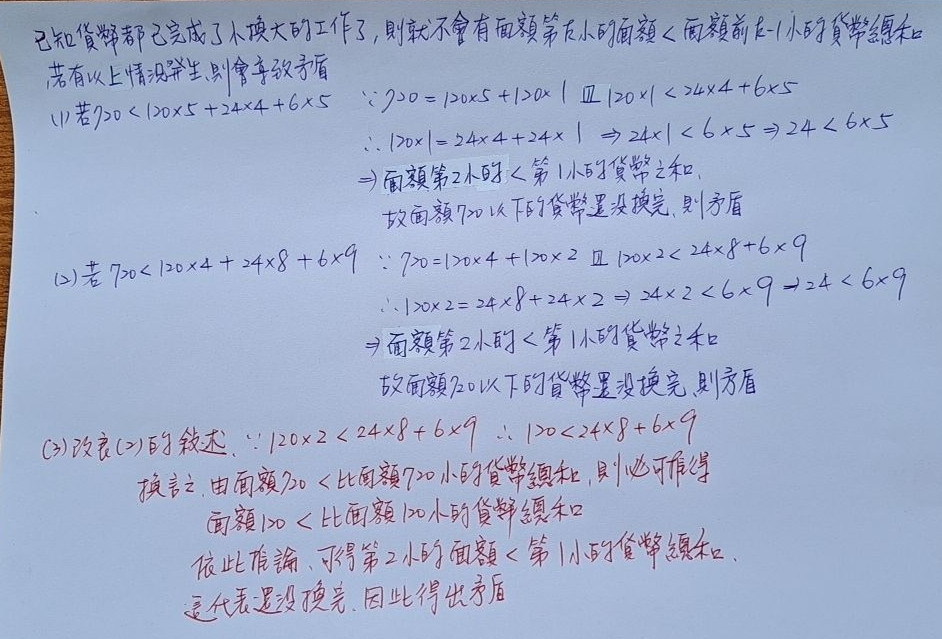

# 換零錢 引理 證明

## 引理

在面額互相整除的情況下，若存在面額 x 的貨幣，且面額在 x 之下的總和超過 x，則必定能夠透過換錢使得面額在 x 以下的貨幣總和不到 x 且使貨幣數量更少

## 感性理解

因為是「因數關係」，所以上面的錢一定可以用下面的湊出來（500 = 10 個 50，也能用 2 * 100 + 5 * 50 + 4 * 10 + 2 * 5 之類的），例如說 500，而下面加起來比 500 大，下面可能是先補 3 * 100，這樣還差 2 * 100，只不過因為下面加起來比 500 大，所以 100 下面肯定超過 2 * 100，這樣一直持續下去如果還是湊不出來會發現 5 下面（也就是 1 元的總合）肯定超過 k * 5，也就是至少超過 1 * 5，這樣一定可以換，所以得到 x 之下的總和一定比 x 少 

## 詳細證明

【claim】: 若以從小換到大，則第 k 小的面額 > 前 k - 1 小的貨幣總和

反證法，假設第 k 小的面額 < 前 k - 1 小的貨幣總和。但因為

第 k 小的面額 = 第 k - 1 小的貨幣和 + 要補上的第 k - 1 小的貨幣差額（想從前 k - 2 小補上來的） < 前 k - 1 的貨幣總和

所以要補上的第 k - 1 小的貨幣差額 < 前 k - 1 小的貨幣總和 - 第 k - 1 小的貨幣和 = 前 k - 2 小的貨幣和

又要補上的第 k - 1 小的貨幣差額 = 第 k - 2 小的貨幣和 + 要補上的第 k - 2 小的貨幣差額 < 前 k - 2 小的貨幣和

⇒ 要補上的第 k - 2 小的貨幣差額 < 前 k - 2 小的貨幣總和 - 第 k - 2 小的貨幣和 = 剩下的前 k - 3 小的貨幣總和

同理，往下推，可得要補上的第 2 小的貨幣差額 < 第 1 小的貨幣和 ⇒  第 2 小的貨幣**面額** < 第 1 小的貨幣和（差額可能要補好幾個第 2 小的貨幣，面額的話就是只有一個），代表還沒有換完，故產生矛盾，因此從小換到大後，只會發生第 k 小的面額 > 前 k - 1 小的貨幣總和

## 參考資料

