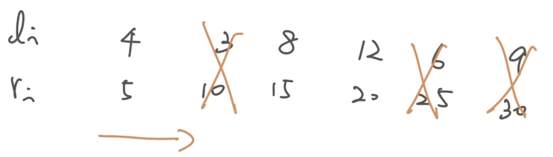

## 技巧

### 掃描線角度思考

???+note "最大交集數量"
	給 $n$ 個 interval，兩兩間若有 overlap 則建邊，問 max clique[^1] 大小
	
	??? note "hint"
		找最大 interval 交集的數量，也就是 band width
		
	??? note "思路"
		- 想成掃描線從左掃到右
			- 遇到 $l_i$ 就 +1
			- 遇到 $r_i$ 就 -1
		
		<figure markdown>
	        { width="300" }
	    </figure>

### 刪除 overlap

???+note "刪除 overlap"
	Q1: 給 n 個 interval，若 A ⊆ B[^2] 則刪掉 B

	Q2: 給 n 個 interval，若 A ⊆ B 則刪掉 A
	
	??? note "Q1 思路"
	    - 按照 $r_i$ 排序
	
	    - 每次跟合法的最後一個 (back) 比較，若 $l_j \le l_i, i<j$ 則 $j$ 不合法
	
	    <figure markdown>
	        { width="300" }
	    </figure>
	    
	    ??? note "code"
	    	```cpp linenums="1"
	        vector<pii> solve () {
	            int n = a.size ();
	            auto cmp = [&] (pii f, pii s) {
	                if (f.r == s.r) return f.l > s.l;
	                return f.r < s.r;
	            };
	            sort (ALL (a), cmp);
	            vector<pii> b;
	
	            b.pb (a[0]);
	            for (int i = 1; i < n; i++) {
	                if (b.back ().l < a[i].l) b.pb (a[i]); 
	            }
	
	            return b;
	        }
	        ```
	    
	??? note "Q2 思路"
	    - 同理，按照 $r_i$ 排序
	
	    - 從後往前掃，每次跟合法的最前面那個 (front) 比較，若 $l_j \le l_i, i<j$ 則 $i$ 不合法
	
	    <figure markdown>
	        { width="300" }
	    </figure>
	    
	    ??? note "code"
	    	```cpp linenums="1"
	        vector<pii> solve () {
	            int n = a.size ();
	            auto cmp = [&] (pii f, pii s) {
	                if (f.r == s.r) return f.l < s.l;
	                return f.r < s.r;
	            };
	            sort (ALL (a), cmp);
	            vector<pii> b;
	
	            b.pb (a[n - 1]);
	            for (int i = n - 2; i >= 0; i--) {
	                if (b.back ().l > a[i].l) b.pb (a[i]); 
	            }
	            reverse (ALL (b));
	
	            return b;
	    	}
	        ```

## 例題

### 區間選點

???+note "區間選點"
	給 $n$ 個 $[l_i,r_i]$ 問至少選幾個 point 使得每個 $[l_i, r_i]$ 都有被覆蓋到

	$n \le 2×10^5, l < r \le 10^9$
	
	??? note "思路1"
		- 我們觀察到**第一個**要選的 point 一定要至少在一個 $r_i$ 之前
			- 那最前面的 $r_i$ 肯定是最小的 $r_i$
			- 那在這個 $[l_i, r_i]$ 上，我應該要選哪個 point 呢?
			- 大家的右界都在我的右邊，如果我跟某個區段沒有 overlap 那怎麼選都不可能覆蓋到，若有 overlap 的話選 $r_i$ 最能 benefit，所以選最右邊 ($r_i$) 最好
	
		- 接著我們把 overlap 的 interval 刪掉 
	
		- 接下來我們一樣要選至少在一個 $r_i$ 之前的 point
			- 假設我們第一次選了第 $i$ 個區段的 $r_i$ 再來再選第 $j$ 個區段的 $r_j$
			- 那 $j$ 這個區段
				- 一定沒有跟先前的 $r_i$ overlap
				- 是目前右界最小的
				- 也就是按照右界排序，第一個沒有 $[l_i, r_i]$ overlap 的
	
		- 再來就是子問題
	
	??? note "思路2"
		- 先刪除一定不重要的
	
		- 再來 sort 左界或右界都可以
	
		- 再來題目就滿足 $l_i<l_{i+1},r_i<r_{i+1}$
	
		- 再來就跟思路1一樣 greedy 的挑就好
		
	??? note "code"
	    ```cpp linenums="1"
	    int solve() {
	        sort(ALL(a), [](node x, node y) { return x.r < y.r; });
	        int last = 0, ans = 0;
	        for (int i = 0; i < n; i++) {
	            if (a[i].l > last) {  // 沒有 overlap
	                ans++, last = a[i].r;
	            }
	        }
	
	        return ans;
	    }
	    ```

???+note "全國賽模擬賽 2019 pC"
	見<a href="/wiki/other/bitwise/#maximum-and" target="_blank">此處</a>
	
???+note "[TIOJ 1408. 我很忙](https://tioj.ck.tp.edu.tw/problems/1408)"
	給 $n$ 個 interval，有 weight $w_i$，問至少選幾個 point 使得每個 interval 中至少有 $k$ 個點被選到

	$n \le 10^5, 0\le l,r,w\le 10^5$
	
	??? note "思路"
		先將 interval 用 $r_i$ 小到大 sort，線段樹 0/1 維護有選的點，這樣我們從前往後看時，若這個 interval 中間有選的點還沒有 $k$ 個的話就二分搜當前的 interval 的最短的 suffix 滿足是 0 的個數 >= k - interval 內是 1 的個數，然後將這個 suffix 上的數字通通改成 1，然後一直做下去就可以了，複雜度 $O(n \log^2 n)$。
		
	??? note "code"
		```cpp linenums="1"
		#include <bits/stdc++.h>
	    #define pb push_back
	    #define mk make_pair
	    #define F first
	    #define S second
	    #define ALL(x) x.begin(), x.end()
	
	    using namespace std;
	    using pii = pair<int, int>;
	
	    const int INF = 2e18;
	    const int MAXN = 1e5 + 5;
	
	    struct Node {
	        Node* lc = nullptr;
	        Node* rc = nullptr;
	        int l, r;
	        int chg, sum;
	
	        Node() {
	
	        }
	        Node(int l, int r) : l(l), r(r) {
	            chg = INF;
	            sum = 0;
	        }
	        void pull() {
	            sum = lc->sum + rc->sum;
	        }
	        void push() {
	            if (chg != INF) {
	                lc->chg = chg;
	                lc->sum = (lc->r - lc->l + 1) * chg;
	                rc->chg = chg;
	                rc->sum = (rc->r - rc->l + 1) * chg;
	                chg = INF;
	            }
	        }
	    };
	
	    Node pool[50000000 / sizeof(Node)];
	    int pool_cnt = 0;
	
	    Node* build(int l, int r) {
	        Node* root = new (&pool[pool_cnt++]) Node(l, r);
	        if (l == r) {
	            return root;
	        }
	        int mid = (l + r) / 2;
	        root->lc = build(l, mid);
	        root->rc = build(mid + 1, r);
	        return root;
	    }
	
	    void update(Node* root, int ml, int mr, int val) {
	        if (mr < root->l || root->r < ml) {
	            return;
	        }
	        if (ml <= root->l && root->r <= mr) {
	            root->chg = val;
	            root->sum = (root->r - root->l + 1) * val;
	            return;
	        }
	        root->push();
	        update(root->lc, ml, mr, val);
	        update(root->rc, ml, mr, val);
	        root->pull();
	    }
	
	    int query(Node* root, int ql, int qr) {
	        if (qr < root->l || root->r < ql) {
	            return 0;
	        }
	        if (ql <= root->l && root->r <= qr) {
	            return root->sum;
	        }
	        root->push();
	        return query(root->lc, ql, qr) + query(root->rc, ql, qr);
	    }
	
	    struct Intervals {
	        int l, r, k;
	        bool operator<(const Intervals &rhs) const {
	            return r < rhs.r;
	        }
	    };
	
	    int n;
	
	    void solve() {
	        vector<Intervals> v;
	        for (int i = 0; i < n; i++) {
	            int l, r, k;
	            cin >> l >> r >> k;
	            r--;
	            v.push_back({l, r, k});
	        }
	        sort(v.begin(), v.end());
	        Node* root = build(0, MAXN - 1);
	        for (int i = 0; i < n; i++) {
	            int ret = query(root, v[i].l, v[i].r);
	            if (ret >= v[i].k) {
	                continue;
	            } 
	            int l = v[i].l, r = v[i].r;
	            while (l != r) {
	                int mid = (l + r) / 2;
	                int cnt = (v[i].r - mid + 1) - query(root, mid, v[i].r);
	                if (cnt > v[i].k - ret) {
	                    l = mid + 1;
	                } else {
	                    r = mid;
	                }
	            }
	            update(root, l, v[i].r, 1);
	        }
	        cout << query(root, 0, MAXN - 1) << '\n';
	    }
	
	    signed main() {
	        while (cin >> n) {
	            if (n == 0) break;
	            pool_cnt = 0;
	            solve();
	        }
	    }  
		```

### 區間覆蓋

???+note "區間覆蓋"
	給 $n$ 個 $[l_i,r_i]$ 問至少選幾個 $[l_i, r_i]$ 使得每個 point 都有被覆蓋到，若不行輸出 $-1$

	$n \le 2×10^5, l < r \le 10^9$
	
	??? note "思路"
		- 先刪掉不重要的
	
		- 第一個一定要挑
	
		- 再來繼續從左往右看跟第一個有交集的，選右界最大的
	
		- 直到跑到左界跟第一個沒交集，把選到右界最大的當成第一個，子問題
	
		- IMPOSSIBLE 的話就是跟第一個沒交集且跟目前右界最大的也沒交集
	
		<figure markdown>
	        { width="600" }
	    </figure>
	    
	    ---
	    
	    或是先考慮第一個要挑什麼，我們一定是挑選 $l_i$ 最小，若還是有很多則挑選 $r_i$ 最大的，所以可以把前面刪除 overlap 改成用這種方法 sort。 
	
	??? note "code"
	    ```cpp linenums="1"
	    void solve() {
	        vector<pii> a = del();  // 刪除不重要的
	        int n = a.size();
	        int ans = 1, fg = 0, R = a[0].r, newR = a[0].r;
	
	        auto overlap = [&](int r, pii it) {
	            if (it.l > r + 1) return false;
	            return true;
	        };
	
	        for (int i = 1; i < n; i++) {
	            if (overlap(R, a[i]) == 0) {
	                if (overlap(newR, a[i]) == 0) {
	                    cout << "-1\n", exit(0);
	                }
	                R = newR;
	                fg = 0;
	            }
	            if (fg == 0 && a[i].r > R) {
	                ans++;
	                fg = 1;
	            }
	            newR = max(a[i].r, newR);
	        }
	
	        cout << ans << "\n";
	    }
	    ```
	    > full code : <http://codepad.org/BnyJUIwV>

### 區間分組

???+ note "區間分組"
	給定 $n$ 個 interval，分組使得每組內部兩兩之間沒有交集，並使得組數盡可能小。
	
	$n\le 2\times 10^5, l_i<r_i\le 10^9$
	
	??? quote "實際應用"
		公司今天有 20 場會議，問最少用幾個會議室可以安排下
	
	??? note "思路1"
	    1. 將所有區間按照左端點從小到大排序
	
	    2. 從前往後處理每個區間，判斷能否將其放到某個現有的組中（小頂堆維護右端點（最早結束的區間））
	
	??? note "思路2"
		對於有重疊的部分，我們肯定要將他們分成不同的組，因此我們只要找最大的重疊區間數即可

### 區間最大獨立集

???+ note "max independent set on interval graph / activity selection problem"
	給 $n$ 個 intervals，選一些 intervals，兩兩不 overlap，求最大化選的數量

	??? note "思路"
		- 刪除不重要的
	
		- 第一個一定要選，因為他的右界是所有右界裡面最小的
	
		- 刪除跟第一個 overlap 的
	
		- 再挑刪完後的第一個 (子問題)
	
		---
		
		可證明按照 $r_i$ 小到大排序，greedy 的取是好的。因為對於後面來說要盡量挑最不會 overlap 的，也就是右界最小的，所以我們將 $r_i$ 最小的取掉之後，刪除與他 overlap 的 intervals，也就跟我們 greedy 在做的事情一樣了
		
		```cpp linenums="1"
		sort(ALL(a), [](node x, node y) { return x.r < y.r;  });
	    int last = 0, ans = 0;
	    for (int i = 0; i < n; i++) {
	        if (a[i].l > last) {
	            ans++;
	            last = a[i].r;
	        }
	    }
	    ```
	
	??? note "code"
		```cpp linenums="1"
		void solve() {
	        vector<pii> a = del();  // 刪除不重要的
	        int n = a.size();
	
	        auto overlap = [&](int r, pii it) {
	            if (it.l < r) return true;
	            return false;
	        };
	
	        int R = a[0].r, ans = 1;
	        for (int i = 1; i < n; i++) {
	            if (overlap(R, a[i]) == 0) {
	                ans++;
	                R = a[i].r;
	            }
	        }
	
	        cout << ans << "\n";
	    }
	    ```
	    
		> full code : <http://codepad.org/Gcm2Azt6>
	
	??? note "延伸 (加上權重) : [job scheduling problem](/wiki/greedy/scheduling/#job-scheduling-problem)"

???+note "[CF 1841 D. Pairs of Segments](https://codeforces.com/problemset/problem/1841/D)"
	給 n 個 interval，問最少刪掉幾個 interval 可以滿足
	
	- 有辦法兩兩 pair
	
	- 一個 pair 中的兩個 interval 必須 overlap
	
	- 任意不同 pair 中的 interval 不能 overlap
	
	$n\le 2000$
	
	??? note "思路"
		直接將 interval 用 n^2 兩兩 union，就變成「最大不相交区间数量」的題目了 
		
		---
		
		> 另解 : dp（見 [CF comment](https://codeforces.com/blog/entry/117262?#comment-1037114)）

### 最小刪除

???+ note "例題"
	刪除最少個 interval，使得 max band width 變小
	
	??? note "思路"
		- 我們把存在 max band width 的區段給找出來，我叫他 target
	
		- 將跟這些 target 沒 overlap 的 interval 給刪掉
	
		- 剩下 sort $l_i$
		
		- target 會有一個指針 j 代表目前在 target[j]
	
		- interval 會有一個指針 i 代表目前在 interval[i]
		
		- 第一段要選的 interval 須滿足
			- 有包含 target[1] 
			- 右界越大越好
	
		- 我們找到這個 interval 後，看他的 $r_i$ 可以延伸到第幾個 target
	
		- 在這幾個 target 中，我們都可以去找有跟這些 target overlap 的 interval，存他們之中的最大右界
	
		- 等到 target[j] 已經無法跟第一個選的 interval overlap 後，我們就把當前找到的最大右界當成第一個選的，變成子問題 (有點類似[保母問題](/wiki/greedy/interval/#_5)的維護方式)
	
		<figure markdown>
	        { width="600" }
	    </figure>

[^1]: [max clique](https://en.wikipedia.org/wiki/Clique_(graph_theory)) 最大完全子圖
[^2]:$A \subseteq B$，$A$ 是 $B$ 的子集