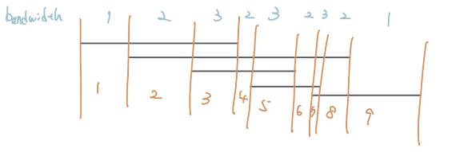

## 技巧
### 掃描線角度思考
???+note "最大交集數量"
	給 $n$ 個 interval，兩兩間若有 overlap 則建邊，問 max clique[^1] 大小
	??? note "hint"
		找最大 interval 交集的數量，也就是 band width
	??? note "思路"
		- 想成掃描線從左掃到右
			- 遇到 $l_i$ 就 +1
			- 遇到 $r_i$ 就 -1
		
		<figure markdown>
	        { width="300" }
	    </figure>
		
		

### 刪除 overlap
???+note "刪除 overlap"
	- Q1: 給 n 個 interval，若 A ⊆ B[^2] 則刪掉 B

	- Q2: 給 n 個 interval，若 A ⊆ B 則刪掉 A
	
	??? note "Q1 思路"
	    - 按照 $r_i$ 排序
	
	    - 每次跟合法的最後一個 (back) 比較，若 $l_j \le l_i, i<j$ 則 $j$ 不合法
	
	    <figure markdown>
	        { width="300" }
	    </figure>
	    
	    ??? note "code"
	    	```cpp linenums="1"
	        vector<pii> solve () {
	            int n = a.size ();
	            auto cmp = [&] (pii f, pii s) {
	                if (f.r == s.r) return f.l > s.l;
	                return f.r < s.r;
	            };
	            sort (ALL (a), cmp);
	            vector<pii> b;
	
	            b.pb (a[0]);
	            for (int i = 1; i < n; i++) {
	                if (b.back ().l < a[i].l) b.pb (a[i]); 
	            }
	
	            return b;
	        }
	        ```
	    
	??? note "Q2 思路"
	    - 同理，按照 $r_i$ 排序
	
	    - 從後往前掃，每次跟合法的最前面那個 (front) 比較，若 $l_j \le l_i, i<j$ 則 $i$ 不合法
	
	    <figure markdown>
	        { width="300" }
	    </figure>
	    
	    ??? note "code"
	    	```cpp linenums="1"
	        vector<pii> solve () {
	            int n = a.size ();
	            auto cmp = [&] (pii f, pii s) {
	                if (f.r == s.r) return f.l < s.l;
	                return f.r < s.r;
	            };
	            sort (ALL (a), cmp);
	            vector<pii> b;
	
	            b.pb (a[n - 1]);
	            for (int i = n - 2; i >= 0; i--) {
	                if (b.back ().l > a[i].l) b.pb (a[i]); 
	            }
	            reverse (ALL (b));
	
	            return b;
	    	}
	        ```

## 例題
### 區間選點
???+note "區間選點"
	- 給 $n$ 個 $[l_i,r_i]$ 問至少選幾個 point 使得每個 $[l_i, r_i]$ 都有被覆蓋到

	- $n = 2×10^5, l < r \le 10^9$
	
	??? note "思路1"
		- 我們觀察到**第一個**要選的 point 一定要至少在一個 $r_i$ 之前
			- 那最前面的 $r_i$ 肯定是最小的 $r_i$
			- 那在這個 $[l_i, r_i]$ 上，我應該要選哪個 point 呢?
			- 大家的右界都在我的右邊，如果我跟某個區段沒有 overlap 那怎麼選都不可能覆蓋到，若有 overlap 的話選 $r_i$ 最能 benefit，所以選最右邊 ($r_i$) 最好
	
		- 接著我們把 overlap 的 interval 刪掉 
	
		- 接下來我們一樣要選至少在一個 $r_i$ 之前的 point
			- 假設我們第一次選了第 $i$ 個區段的 $r_i$ 再來再選第 $j$ 個區段的 $r_j$
			- 那 $j$ 這個區段
				- 一定沒有跟先前的 $r_i$ overlap
				- 是目前右界最小的
				- 也就是按照右界排序，第一個沒有 $[l_i, r_i]$ overlap 的
	
		- 再來就是子問題
	??? note "思路2"
		- 先刪除一定不重要的
	
		- 再來 sort 左界或右界都可以
	
		- 再來題目就滿足 $l_i<l_{i+1},r_i<r_{i+1}$
	
		- 再來就跟思路1一樣 greedy 的挑就好
		
	??? note "code"
	    ```cpp linenums="1"
	    int solve () {
	        sort (ALL(a), [](node x, node y) { return x.r < y.r;  });
	        int last = 0, ans = 0;
	        for (int i = 0; i < n; i++) {
	            if (a[i].l > last) { // 沒有 overlap
	                ans++, last = a[i].r;
	            }
	        }
	
	        return ans;
	    }
	    ```


### 區間覆蓋

???+note "APCSC 保母問題"
	- 給 $n$ 個 $[l_i,r_i]$ 問至少選幾個 $[l_i, r_i]$ 使得每個 point 都有被覆蓋到，若不行輸出 $-1$

	- $n = 2×10^5, l < r \le 10^9$
	
	??? note "思路"
		- 先刪掉不重要的
	
		- 第一個一定要挑
	
		- 再來繼續從左往右看跟第一個有交集的，選右界最大的
	
		- 直到跑到左界跟第一個沒交集，把選到右界最大的當成第一個，子問題
	
		- $\texttt{IMPOSSIBLE}$ 的話就是跟第一個沒交集且跟目前右界最大的也沒交集
	
		<figure markdown>
	        { width="600" }
	    </figure>
	
	??? note "code"
	    ```cpp linenums="1"
	    void solve () {
	        vector<pii> a = del (); // 刪除不重要的
	        int n = a.size ();
	        int ans = 1, fg = 0, R = a[0].r, newR = a[0].r;
	
	        auto overlap = [&] (int r, pii it) {
	            if (it.l > r + 1) return false;
	            return true;
	        };
	
	        for (int i = 1; i < n; i++) {
	            if (overlap (R, a[i]) == 0) {
	                if (overlap (newR, a[i]) == 0) {
	                    cout << "-1\n", exit (0);
	                }
	                R = newR;
	                fg = 0;
	            }
	            if (fg == 0 && a[i].r > R) {
	                ans++;
	                fg = 1;
	            }
	            newR = max (a[i].r, newR);
	        }
	
	        cout << ans << "\n";
	    } 
	    ```
	    > full code : <http://codepad.org/BnyJUIwV>

### 區間分組

???+ note "區間分組"
	給定 $n$ 個 interval，分組使得每組內部兩兩之間沒有交集，並使得組數盡可能小。
	
	- $n=2\times 10^5, l_i<r_i\le 10^9$
	
	??? quote "實際應用"
		公司今天有 20 場會議，問最少用幾個會議室可以安排下
	
	??? note "思路1"
	    1. 將所有區間按照左端點從小到大排序
	
	    2. 從前往後處理每個區間，判斷能否將其放到某個現有的組中（小頂堆維護右端點（最早結束的區間））
	
	??? note "思路2"
		對於有重疊的部分，我們肯定要將他們分成不同的組，因此我們只要找最大的重疊區間數即可

### 區間最大獨立集

???+ note "APCSC 胖達在做foodpanda"
	- $n$ 個 intervals
	
	- 選一些 intervals，兩兩不 overlap，求最大化選的數量
	??? note "思路"
		- 刪除不重要的
	
		- 第一個一定要選，因為他的右界是所有右界裡面最小的
	
		- 刪除跟第一個 overlap 的
	
		- 再挑刪完後的第一個 (子問題)
	
	??? note "code"
		```cpp linenums="1"
		void solve () {
	        vector<pii> a = del (); // 刪除不重要的
	        int n = a.size ();
	
	        auto overlap = [&] (int r, pii it) {
	            if (it.l < r) return true;
	            return false;
	        };
	
	        int R = a[0].r, ans = 1;
	        for (int i = 1; i < n; i++) {
	            if (overlap (R, a[i]) == 0) {
	                ans++;
	                R = a[i].r;
	            }
	        }
	
	        cout << ans << "\n";
	    } 
	    ```
		> full code : <http://codepad.org/Gcm2Azt6>

- 延伸 (加上權重) : [job scheduling problem](/wiki/greedy/interval_scheduling/#job-scheduling-problem)

### 最小刪除
???+ note "例題"
	刪除最少個 interval，使得 max band width 變小
	
	??? note "思路"
		- 我們把存在 max band width 的區段給找出來，我叫他 target

		- 將跟這些 target 沒 overlap 的 interval 給刪掉

		- 剩下 sort $l_i$
		
		- target 會有一個指針 j 代表目前在 target[j]

		- interval 會有一個指針 i 代表目前在 interval[i]
		
		- 第一段要選的 interval 須滿足
			- 有包含 target[1] 
			- 右界越大越好

		- 我們找到這個 interval 後，看他的 $r_i$ 可以延伸到第幾個 target

		- 在這幾個 target 中，我們都可以去找有跟這些 target overlap 的 interval，存他們之中的最大右界

		- 等到 target[j] 已經無法跟第一個選的 interval overlap 後，我們就把當前找到的最大右界當成第一個選的，變成子問題 (有點類似[保母問題](/wiki/greedy/interval/#_5)的維護方式)

		<figure markdown>
	        { width="600" }
	    </figure>

[^1]: [max clique](https://en.wikipedia.org/wiki/Clique_(graph_theory)) 最大完全子圖
[^2]:$A \subseteq B$，$A$ 是 $B$ 的子集