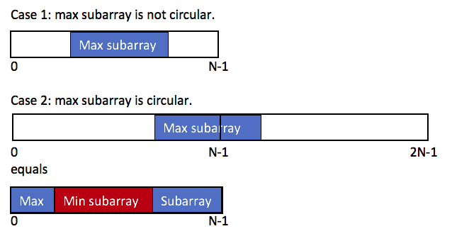

??? question "若不能選到空的子序列 ?"
	有些題目可以直接在轉移式維護，但令一個 general 的作法是: 一樣在過程中將答案跟 0 取 max，當答案為 0 時，直接回傳陣列中最大的元素（因為此時陣列一定全是負的）

## 環狀最大連續子序列

???+note "[LeetCode 918. Maximum Sum Circular Subarray](https://leetcode.com/problems/maximum-sum-circular-subarray/)"
	給一個長度為 $n$ 的環形陣列 $a_1, \ldots ,a_n$，問最大連續子陣列，不能到選空的
	
	$n\le 3\times 10^4, -3\times 10^4\le a_i\le 3\times 10^4$

我們分成兩種 case 討論:

1. Maximum Subarray 不是環狀的
2. Maximum Subarray 是環狀的

Case 1. 就是我們一般陣列上的問題，那 Case 2. 的話，我們其實就是 sum(a[i]) - min subarray sum，我們將兩種取 max 即可，也就是 ans = max{max_subarray, total_sum - min_subarray}

<figure markdown>
  { width="400" }
</figure>

??? info "簡易證明"
	$$\begin{align} \max(\texttt{pre} + \texttt{suf}) &= \max(\texttt{total sum} - \texttt{subarray}) \\ &= \texttt{total sum} + \max(-\texttt{subarray})  \\ &= \texttt{total sum} - \min(\texttt{subarray}) \end{align}$$

## 練習題

???+note "[全國賽模擬賽 2022 pB. 更加 Trivial 的題目 (Quadrivial)](https://www.csie.ntu.edu.tw/~b11902109/PreNHSPC2022/IqwxCSqc_Pre_NHSPC_zh_TW.pdf#page=5)"
	給 n 個陣列 $a_1, \ldots ,a_n$，問這些陣列以任意順序組合起來 Maximum Subarray Sum 最大是多少
	
	$n\le 10^5, \sum |a_i| \le 10^6, |a_{i, j}| \le 10^9$
	
	??? note "思路"
		先想 O(n^2) 怎麼做，我們可以預處理每個陣列的前綴最大值 pre[i]，後綴最大值 suf[i]，然後枚舉左右，但這時，我們要怎麼計算中間的貢獻 ? 我們令 sum[i] = max(陣列 i 的總和, 0)，當左為 l, 右為 r 時，答案就是 
		
		

		suf[l] + (全部的總和 - sum[l] - sum[r]) + pre[r]
		

		
		那我們要怎麼做得更快呢 ? 我們考慮只枚舉當左右的其中一個，另一個看能不能快速的找出來。可以發現，若我們枚舉 l，那麼我們就只要找到 (pre[r] - sum[r]) 最大的即可（將上面的試子整理一下可推得）。所以我們將所有陣列的 (pre[i] - sum[i]) sort 好後，對一個 l 只要去看最大與次大（因為最大的可能就是 l）的 (pre[i] - sum[i]) 即可
		
		最後要記得跟單純找一個陣列的最大連續和取 max
		
???+note "[zerojudge i402. 4. 內積](https://zerojudge.tw/ShowProblem?problemid=i402)"
	給一個長度為 n 的陣列 a，與長度為 m 的陣列 b，可以自由決定 a, b 是否 reverse，目標是在 a, b 分別找一個長度一樣的 subarray，使內積最大化
	
	$n, m\le 1000$
	
	??? note "思路"
		> 法 1: Maximum Subarray Sum 
		
		枚舉 a 開頭的項，假設是 t，與 b 的第一項作配對，依序將兩個陣列的對應項相加，變成 c[i] = a[i + t] * b[i] 做 Maximum Subarray Sum
		
		---
		
		> 法 2: dp
		
		令 dp(i, j) = 目前配對的最後一項是第一個陣列第 i 項，配第二個陣列第 j 項的最大值，轉移式就是 dp(i, j) = max{0, dp(i - 1, j - 1)} + a[i] * b[j]

	
