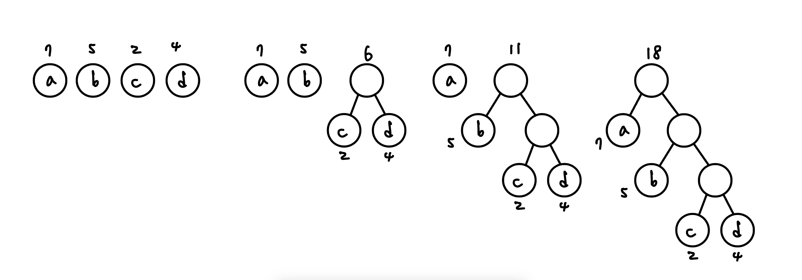

## 金錢問題

???+note "換零錢（互相整除）"
	給一個長度為 $n$ 的遞增序列 $a_1, \ldots ,a_n$，代表每種硬幣的面額，每種硬幣的數量都有無限個，問最少選幾個硬幣恰能湊出 $k$ 元
	
	$n\le 10^6,a_{i+1}$ % $a_i=0$
	
	??? note "思路"
		例如說 k = 1384，a 是新台幣，那我們就可以附 1 個 1000、3 個 100、1 個 50、3 個 10、4 個 1，但為什麼這樣一定是好的 ?
		
		【引理】: 在面額互相整除的情況下，若存在面額 x 的貨幣，且面額在 x 之下的總和超過 x，則必定能夠透過換錢使得面額在 x 以下的貨幣總和不到 x 且使貨幣數量更少
		
	??? note "code"
		```cpp linenums="1"
		#include <bits/stdc++.h>
	    #define int long long
	    #define ALL(x) x.begin(),x.end()
	    using namespace std;
	
	    const int MAXN = 1e6 + 5;
	    int n, k, a[MAXN];
	
	    signed main() {
	        cin >> n >> k;
	        for (int i = 0; i < n; i++) {
	            cin >> a[i];
	        }
	        int ans = 0;
	        for (int i = n - 1; i >= 0; i--) {
	            ans += k / a[i];
	            k %= a[i];
	        }
	        cout << ans << '\n';
	    }
		```

???+note "[TIOJ 1579.來自未來的新台幣](https://tioj.ck.tp.edu.tw/problems/1579)"
	給長度為 $n$，⾯額分別為 $1,5,10,50,100,500,1000,\ldots$ 的錢幣，第 $i$ 個錢幣的數量為 $c_i$，能湊出的金額共有多少種

	$1\le n\le 19$
	
	??? note "思路"
		若小的足以表達大的，就將大的都換成小的。例如 1 元有 5 個，5 元有 2 個，那麼因為 1 * 5 > 5，所以可將 5 都換成 1 元，變成 1 元有 15 個，若 1 元只有 3 個，那麼湊不出來 4，也就不能換了，兩者變成獨立的。
		
		所以我們就依序看大的能不能換成當前最小的即可，最後的答案為 $(c_1 + 1)\cdot (c_2 + 1) \ldots (c_k+1) - 1$
		
		> 參考自 : [PTT](https://www.ptt.cc/bbs/tutor/M.1304705220.A.35E.html)
		
	??? note "code"
		```cpp linenums="1"
		#include <bits/stdc++.h>
	    #define int long long
	    #define pb push_back
	    #define mk make_pair
	    #define F first
	    #define S second
	    #define ALL(x) x.begin(), x.end()
	
	    using namespace std;
	    using pii = pair<int, int>;
	
	    const int INF = 2e18;
	    const int maxn = 3e5 + 5;
	    const int M = 1e9 + 7;
	
	    int a[maxn], cnt[maxn];
	
	    signed main() {
	        int n;
	        cin >> n;
	
	        a[0] = 1;
	        for (int i = 1; i < n; i++) {
	            if (i & 1) {
	                a[i] = a[i - 1] * 5;
	            } else {
	                a[i] = a[i - 1] * 2;
	            }
	        }
	
	        int cur = 0;
	        for (int i = 0; i < n; i++) {
	            cin >> cnt[i];
	            if (i == 0) {
	                continue;
	            }
	            if (a[cur] * cnt[cur] >= a[i]) {
	                cnt[cur] += (a[i] / a[cur]) * cnt[i];
	                cnt[i] = 0;
	            } else {
	                cur = i;
	            }
	        }
	        int ans = 1;
	        for (int i = 0; i < n; i++) {
	            if (cnt[i]) {
	                ans = (ans * ((cnt[i] + 1) % M)) % M;
	            }
	        }
	        cout << (ans - 1 + M) % M << '\n';
	    }  
	    ```

???+note "[CSES - Missing Coin Sum](https://cses.fi/problemset/task/2183)"
	給 $n$ 個錢幣，面額是 $a_1, \ldots ,a_n$，問最小湊不出來的面額是多少
	
	$n\le 2\times 10^5, 1\le a_i \le 10^9$
	
	??? note "思路"
		若小的足換大，則大**必定**要換小，跟上一題一樣，重複直到小不足以換大為止
		
		這邊要注意，跟上一題不同的是，若小的金額跟大的只差一，也是可以將大換小的，例如說 1 元有 4 個，5 元有 1 個，這樣其實 [0, 9] 都湊得出來，所以也是可以把這個 5 元換成 5 個 1 元
		
	??? note "code"
		```cpp linenums="1"
		#include <bits/stdc++.h>
	    #define int long long
	    using namespace std;
	
	    const int INF = 9e18;
	    const int MAXN = 2e5 + 5;
	    int n, m;
	    int a[MAXN];
	
	    signed main() {
	        cin >> n;
	        for (int i = 1; i <= n; i++) {
	            cin >> a[i];
	        }
	        sort(a + 1, a + n + 1);
	        int mx = 0;
	        for (int i = 1; i <= n; i++) {
	            if (a[i] > mx + 1) {
	                cout << mx + 1 << "\n";
	                exit(0);
	            }
	            mx = max(mx, mx + a[i]);
	        }
	        cout << mx + 1 << "\n";
	    }
		```

???+note "[CSES - Missing Coin Sum Queries](https://cses.fi/problemset/task/2184)"
	給 $n$ 個錢幣，面額是 $a_1, \ldots ,a_n$，有 $q$ 筆詢問:
	
	- $\text{query}(l,r):$ 問只能使用 $a_l, \ldots ,a_r$，最小湊不出來的面額是多少
	
	$n,q\le 2\times 10^5, 1\le a_i \le 10^9$

???+note "[CF 1303 D. Fill The Bag](https://codeforces.com/contest/1303/problem/D)"
	給一個長度為 $m$ 的序列 $a_1, \ldots ,a_m$，$a_i$ 都是 2 的冪次。每次操作可將一個 $a_i$ 拆兩半，問最少幾次操作才能挑一些 $a$ 裡面的元素來組成 $n$
	
	$m\le 10^5, 1\le n\le 10^{18}, 1\le a_i \le 10^9$
	
	??? note "思路"
		以二進制的角度來考慮此題，將 $m$ 以二進制表示，我們的目標就是要讓 $m$ 的二進制裡的每一個 1 都有被貢獻，有兩個觀察:
		
		- 可將高位分解成低位（在 $a_i$）
	
		- 高位能由低位組成
	
		從大到小考慮的話，若高位不夠借，那我就必須從低位借，這樣又要處理左邊又要處理右邊很麻煩。不如我們從小到大考慮，若低位不夠用則需要跟最近的高位借，將高位分解成低位使用，在過程中將低位換成高位，這樣實作起來就很順了
		
	??? note "code"
		```cpp linenums="1"
		#include <iostream>
	    #include <map>
	    #include <cstring>
	    using namespace std;
	
	    int t, m, cnt[65];
	    long long n, a, total, ans;
	    map <int, int> mp;
	
	    int main() {
	        cin >> t;
	        for (int i = 0; i < 60; i++) {
	            mp[(1LL << i)] = i;
	        }
	        while (t--) {
	            cin >> n >> m;
	            total = 0;
	            memset(cnt, 0, sizeof(cnt));
	            for (int i = 0; i < m; i++) {
	                cin >> a;
	                total += a;
	                cnt[mp[a]]++;
	            }
	            if (total < n){
	                cout << -1 << "\n";
	                continue;
	            }
	            ans = 0;
	            for (int i = 0; i < 61; i++) {
	                if (n & (1LL<<i)) {
	                    for (int j = i; j <= 60; j++) {
	                        if (cnt[j]) {
	                            ans += j-i;
	                            cnt[j]--;
	                            for (int k = j-1; k >= i; k--) {
	                                cnt[k]++;
	                            }
	                            break;
	                        }
	                    }
	                }
	                cnt[i+1] += cnt[i]/2;
	            }
	            cout << ans << "\n";
	        }
	    }
	    ```

## 交換法

???+note "[APCS 物品堆疊](https://zerojudge.tw/ShowProblem?problemid=c471)"
	給 $n$ 個物品，第 $i$ 個物品有權重 $w_i$ 與頻率 $f_i$。你要把 n 個物品堆成一疊，對於每個物品所需要花的能量是 $f_i\times$ 在這個箱子上方的箱子重量總和。計算在最好的疊法的情況下，最少需要花多少能量
	
	$n\le 10^5, 1\le w_i, f_i \le 1000$
	
	??? note "思路"
		如何判斷最底下的兩個是否需要交換？ 對於兩個物品 i, j，假設 (w[i], f[i]) 放在最底下是最好情況，w[i] * f[j] 和 w[j] * f[i] 必然有其一會被計算答案中，greedy 選擇小的可得到最佳解。代表 
		
		w[j] * f[i] < w[i] * f[j]
		
		⇒ w[j] / f[j] < w[i] / f[i]
		
		若 w[j] / f[j] < w[i] / f[i]，則 i 放在底下比較好

???+note "[CF 559 B. Equivalent Strings](https://codeforces.com/problemset/problem/559/B)"
	給兩個長度相同的字串 a, b，兩個次串「相等」若且唯若符合以下條件之一
	
	- a 與 b 相同
	
	- 將 a, b 各自分成兩半，兩半對應「相等」
	
	$|a|=|b|\le 2\times 10^5$
	
	??? note "思路"
		我們對於兩個字串 a, b 分別進行 reorder，利用分治，每次都 Greedy 的使字典序比較小的那一半在前面，最後看 a, b reorder 出來有沒有長的一樣
		
	??? note "code"
		```cpp linenums="1"
		#include <bits/stdc++.h>
	    #define int long long
	    using namespace std;
	
	    string s1, s2;
	
	    string dc(string s) {
	        if (s.size() & 1) return s;
	        string a = dc(s.substr(0, s.size() / 2));
	        string b = dc(s.substr(s.size() / 2));
	        return a < b ? a + b : b + a;
	    }
	
	    signed main() {
	        ios::sync_with_stdio(0);
	        cin.tie(0);
	        cin >> s1 >> s2;
	        string ra = dc(s1);
	        string rb = dc(s2);
	        if (ra == rb) {
	             cout << "YES\n";
	        } else {
	            cout << "NO\n";
	        }
	    }
	    ```

## 霍夫曼編碼

???+note "問題"
    給定每種字元的出現頻率 $freq_i$，目標是找到一種 Prefix Code 讓 
    
    $$WPL=\sum |s_i| \times freq_i$$
    
    最小化。Prefix Code: 每種字元用一個 0/1 字串 $s_i$ 表達，互相不是 prefix

作法: 每次合併兩個頻率最小的字元

例如說有 4 個點（字元）a、b、c、d，他們的 freq 分別為 7、5、2、4

構樹過程: 

<figure markdown>
  { width="400" }
</figure>

若需要構造的話，從 root 開始，往左分配 0 的編碼，往右分配 1 的編碼，每個 leaf 的編碼就是從 root 到自己的編碼串起來。
		
???+note "k 叉哈夫曼樹 [洛谷 P2168  [NOI2015]荷马史诗](https://www.luogu.com.cn/problem/P2168)"
	有 $n$ 種字元，第 $i$ 種出現次數為 $w_i$。要用 $k$ 進制的字串 $s_i$ 來代替第 $i$ 種字元，使得:

    - 對於任意的 $1 \le i, j \le n$，$i\neq j$，$s_i$ 都不是 $s_j$ 的前綴
    
    問重新編碼後的字串最短長度，與最長的 $s_i$ 最短可以是多少
    
    $n \le 10^5, k \le 9$
    
    ??? note "思路"
    	當 $k=2$ 時，就是 Huffman Code 裸題。$k>2$ 的 case，若直接 Greedy 的合併，在最後一次的循環時，Heap 的大小在 $2\ldots k-1$（不足以取出 $k$ 個），那麼整個 Huffman Tree 的 root 的節點個數就會小於 $k$，此時若將一些深度最大的 leaf 拔掉，接到 root 的下方，會使答案變小（若不取深度最大的，則將深度最大的拔起來接到空出來的位置更優）。所以最後的 Huffman Tree 就長成: 所有點的小孩都是滿的，除了最深的一個 internal node 會空出一些位置。具體做法有兩種
    
        1. 我們可以先將 $2+(n-2)\% (k-1)$ 個節點合併（即形成最深的 internal node），剩下的每次合併 $k$ 個節點即可
        2. 我們補一些額外 $w_i=0$ 的點，這樣這些點就會填滿空出的位置，而且又不影響答案。
    
        那麼第二個答案其實就直接看樹的高度即可。如果有一個點可以移動到比較小的深度（也就是讓樹的高度變小），那麼字串長度總和也會跟著變小，跟最佳解條件矛盾。
        
    ??? note "code"
    	```cpp linenums="1"
    	// Code by KSkun, 2018/7
        #include <cstdio>
        #include <cctype>
        #include <cstring>
    
        #include <algorithm>
        #include <vector>
        #include <queue>
    
        typedef long long LL;
    
        inline char fgc() {
            static char buf[100000], *p1 = buf, *p2 = buf;
            return p1 == p2 && (p2 = (p1 = buf) + fread(buf, 1, 100000, stdin), p1 == p2)
                ? EOF : *p1++;
        }
    
        inline LL readint() {
            register LL res = 0, neg = 1; register char c = fgc();
            for(; !isdigit(c); c = fgc()) if(c == '-') neg = -1;
            for(; isdigit(c); c = fgc()) res = (res << 1) + (res << 3) + c - '0';
            return res * neg;
        }
    
        const int MAXN = 100005;
    
        int n, k;
    
        typedef std::pair<LL, LL> PII64;
        std::priority_queue<PII64, std::vector<PII64>, std::greater<PII64> > pq;
    
        int main() {
            n = readint(); k = readint();
            for(int i = 1; i <= n; i++) {
                LL w = readint();
                pq.push(PII64(w, 0));
            }
            while(k > 2 && n % (k - 1) != 1) {
                pq.push(PII64(0, 0)); n++;
            }
            LL ans1 = 0, ans2 = 0;
            while(pq.size() > 1) {
                PII64 res(0, 0);
                for(int i = 1; i <= k; i++) {
                    res.first += pq.top().first;
                    res.second = std::max(res.second, pq.top().second + 1);
                    pq.pop();
                }
                ans1 += res.first;
                ans2 = std::max(ans2, res.second);
                pq.push(res);
            }
            printf("%lld\n%lld", ans1, ans2);
            return 0;
        }
    	```


???+note "[CF 1882 C. Card Game](https://codeforces.com/contest/1882/problem/C)"
	給一個長度為 $n$ 的陣列 $a_1, \ldots ,a_n$，每次操作可以 :
	
	- 移除一個奇數項，得分加上 $a_i$
	
	- 移除一個偶數項
	
	每次操作完後陣列都會 reindexed。可以做任意次操作，問最大得分
	
	$n\le 2\times 10^5, -10^9 \le a_i \le 10^9$
	
	??? note "思路"
		令 a 為要取的 odd 項，b 為要取的 even 項。例如陣列是 a..b.bab...b..a..b，我們可以先取最後的 a，這樣後面的 b 就會變 odd，再由後往前取，然後重複這個步驟，就可以取完。但可能會有一個 case 例如 .b.b.bab...b，這樣最前面的三個 b 無論如何都是沒辦法取的，必須捨棄，我們必須在前面再取一個才能讓這三個 b 取到。
		
		所以我們得到了一個 greedy 的結論，將 $i$-th 移除，我們可以得到 $\sum\limits_{j>i} \max (0, a_j)$，所以枚舉第一個選的，然後將 ans 與他的答案取 max
		
	??? note "code"
		```cpp linenums="1"
		scanf("%d",&n);
		for(int i = 1; i <= n; i++) {
			scanf("%d",&a[i]);
		}
		long long s=0;
		for (int i = n; i >= 1; i--) {
			if(i&1) {
				ans = max(ans, s + a[i]);
			} else {
				ans = max(ans, s);
			}
			s += max(a[i], 0);
		}
		printf("%lld\n", ans);
		```

???+note "[CSES - Programmers and Artists](https://cses.fi/problemset/task/2426)"
	給你 $n$ 個 pair$(x_i,y_i)$，要你選這些 pair 裡面的 $a$ 個 $x$ 跟 $b$ 個 $y$，且同一個 pair 中的 $x$ 和 $y$ 不能同時挑
	
	$n\le 2\times 10^5$
	
	??? note "思路"	
		<https://github.com/yozen0405/c-projects/blob/main/markdown/2426.md>

???+note "[JOI Final 2022 選舉](https://loj.ac/p/3664)"
	有 $n$ 個州，若在第 $i$ 個州演講 $a_i$ 小時可獲得一張選票，若演講 $b_i$ 小時可獲得一位協作者。多一個協作者就可讓時間加速兩倍，問要獲得 $k$ 張選票的最小耗時
	
	$k\le n\le 500, 1\le a_i\le 1000, a_i\le b_i\le 1000$ 或 $b_i=-1$
	
	??? note "思路"
		容易想到一個錯誤的貪心: 
		
		- 按照 $b_i$ 小到大排序
		
		- 枚舉分界線
			- 前面都選 $b_i$
	
			- 後面選最小的幾個 $a_i$
		
		但會發現，可能一些選中的 $b_i$ 對應的 $a_i$ 很小，這時，我們挑選這些 $a_i$，可能會更好。舉例來說:
		
		```
		a   b
		------
		1   99
		99  100
		100 101
		```
		
		這時若我們以 b, b, a 的方式挑，耗時 $99+100/2+100/4=174$ 小時，但若我們以 a, b, a 的方式挑耗時 $1/2+100/2+100=150.5$，更優。
		
		所以就變成: 
		
		- 按 $b_i$ 小到大排序
	
		- 枚舉分界線: 
			- 分界線前，對於每一個要馬選 $a_i$，要馬選 $b_i$ → dp
	
			- 對於後面，選 $a_i$ 最小的 $k-i$ 個 → 預處理

## 其他題目

???+note "2023 TOI 1模 pB. 最佳劇照 (stills)"
    在一維數線上有 $n$ 個 interval $[l_i, r_i]$，要求選擇最少的 point，使得每個 interval 都至少包含一個 point，且所選點的 cost 總和最小。
    
    其中點的 cost 計算方式為：
    
    $$\text{cost}(t) = 有包含 \texttt{ point } t \text{ } 的 \text{ } \texttt{interval} \text{ } 的\text{ } |(r_i - t) - (t - l_i)| \text{ }的總和$$
    
    ??? note "題解"
        > 步驟一，離散化:
        
        利用線段的開頭 $l_i$ 和結尾 $r_i$ 可以把數線切出 $2n-1$ 個 blocks。
        
        這樣一來，每個 interval 可以當成是某個 block 的左界開始到某個 block 的右界結束。
    
        每個 block 只會有一個最好的 $t$，先計算出一個陣列 $w[0], ..., w[2n-2]$ 表示每個 block 裡面最好的位置的 cost
    
        > 步驟二，計算 $w[i]$：
        
        每個 block 的 $w[i]$ 計算方式 $|(r_i - t) - (t - l_i) |$ 也可以寫成 $2|(l_i+r_i)/2 - t|$ 也就是 $t$ 到 $[l_i, r_i]$ 中間點的距離的兩倍。
        
        也就是說，一個 block 裡面位置 $t$ 的 cost 就是 $t$ 到所有有包含這個 block 的區間的中間點的距離總和的兩倍。
        
        令 $m_i = (l_i+r_i)/2$，
        
        $$|m_1-t| + |m_2-t| + \cdots |m_k-t|$$
        
        這個函數的最小值發生於 $t$ 等於 $m_i$ 的中位數
        
        不過 $t$ 需要被限制在 block 的範圍內，所以需要分幾個 case 討論
    
        - $m_i$ 的中位數在在 block 內，直接讓 $t = m_i$ 的中位數
    
        - $m_i$ 的中位數在在 block 左邊，直接讓 $t =$ block 左界
    
        - $m_i$ 的中位數在在 block 右邊，直接讓 $t =$ block 右界
    
        掃描線的過程需要對每個 block 維護目前有哪些 $m_i$ 可以用，並且維護這些 $m_i$ 的中位數。決定好 $t$ 之後，需要透過一些資料結構在 $O(\log n)$ 時間計算出 $|m_1-t| + |m_2-t| + ... |m_k-t|$，這個部分可以使用線段樹達成。
    
        > 步驟三， dp 算答案：
        
        $dp(i)$ 表示最後一個點選在 block $i$ ，且左界在 block $i$ 以前的所有 interval 都有包含到至少一個點的最好答案。
        
        $dp(i) = \max dp(j) + w[i]$, $j$ 可以選的條件是沒有 interval 開頭結尾都在 block ($j+1$) ~ block ($i - 1$)
        
        這些的可以用來轉移的 $j$ 會是連續的一段，所以可以用套用資料結構快速計算出 $dp(i)$，計算 dp 的總時間是 $O(n) \times$ 查詢時間。資料結構的部分可以用單調隊列 $O(1)$ 查詢，或是用線段樹 $O(\log n)$ 查詢
        
        > ref : <https://hackmd.io/@algoseacow/rJw_DISe3>

???+ note "Parallel Scheduling Problem [TIOJ 1072. 誰先晚餐](https://tioj.ck.tp.edu.tw/problems/1072)"
	有 $n$ 個人要吃飯，第 $i$ 個人想吃的食物需要 $C_i$ 時間才能煮好，而他吃掉食物所花的時間為 $E_i$ ，且廚師同一時間只能煮一個食物，最小化所有人都吃完飯的時間。
	
	$n\le 10^4, 1\le C_i, E_i\le 1000$
	
	??? note "思路"
		不管哪道食物先煮，總共需要煮的時間都一樣。想要縮短總工時，最好先煮吃飯時間較長的食物。
		<figure markdown>
	    	{ width="500"}
	    	  <figcaption><font color="#4472C4">藍色</font>代表煮的時間，<font color="#ED7D31">橘色</font>代表吃的時間</figcaption>
	    </figure>
	    
		??? note "證明"
			假設由演算法得到的吃飯的順序為 $a_1, a_2,\ldots, a_n$ ，則此序列一定滿足特性 $E_{a_i} \ge E_{a_{i+1}}$ 。假設有另外一組吃飯順序為 $b_1, b_2, · · · , b_n$，且不滿足該特性，則一定存在兩個相鄰的人 $b_i , b_i+1$ 滿足 $E_{b_i} < E_{b_{i+1}}$ 。如果將這兩個人的吃飯順序對調， 則考慮第 $j$ 個人吃飯結束的時間 (對調前為 $t_1(j)$ ，對調後為 $t_2(j)$ )，可以以下四種人的情況： 
	
	        1. $j < i$： <br>
	           對調前，結束的時間為 $t_1(j) = \sum \limits_{k=1}^j C_{b_k} + E_{b_j}$；<br>
	           對調後，結束的時間為 $t_2(j) = \sum \limits_{k=1}^j C_{b_k} + E_{b_j}$。  
	        2. $j = i$： <br>
	           對調前，結束的時間為 $t_1(j) = t_1(i)= \sum \limits_{k=1}^{i-1} C_{b_k} + C_{b_i}+E_{b_i}$ <br>
	           對調後，結束的時間為 $t_2(j) = t_2(i)= \sum \limits_{k=1}^{i-1} C_{b_k} + C_{b_{i+1}}+C_{b_i}+E_{b_i}$ 。
	
	        3. $j = i + 1$： <br>
	           對調前，結束的時間為 $t_1(j) = t_1(i+1)= \sum \limits_{k=1}^{i-1} C_{b_k} + C_{b_i}+C_{b_{i+1}}+E_{b_{i+1}}$ ； <br>
	           對調後，結束的時間為 $t_2(j) = t_2(i+1)= \sum \limits_{k=1}^{i-1} C_{b_k} + C_{b_{i+1}}+E_{b_{i+1}}$。 
	
	        4. $j > i + 1$： <br>
	           對調前，結束的時間為 $t_1(j) = \sum \limits_{k=1}^j C_{b_k} + E_{b_j}$； <br>
	           對調後，結束的時間為 $t_2(j) = \sum \limits_{k=1}^j C_{b_k} + E_{b_j}$。  
	
	        我們要比較的是 $\max\{t_1(j)\}$ 和 $\max\{t_2(j)\}$ $(1 \le j \le n)$ ，可以發現會讓 $t_1(j)$ 和 $t_2(j)$ 不同值的只有 $j = i$ 和 $j = i + 1$ ，而且 
	
	        $$\begin{cases}t_1(i + 1) \ge t_2(i) \\ t_1(i + 1) \ge t_2(i + 1)\end{cases}$$
	
	        所以 $\max\{t_1(j)\} \ge \max\{t_2(j)\}$，也就是對調之後，最後吃完的時間一定不會比對調前差。 最後，經過不斷的兩兩對調，一定可以將序列 $b$ 變成序列 $a$ 。最後吃完的時間必為非嚴格遞減，得證序列 $a$ 是這個問題的最優解。
	        
	        > ref : <https://www.csie.ntu.edu.tw/~sprout/algo2021/homework/hand05.pdf>

---

## 參考資料

- <https://slides.com/fhvirus/1/fullscreen#/3/7>