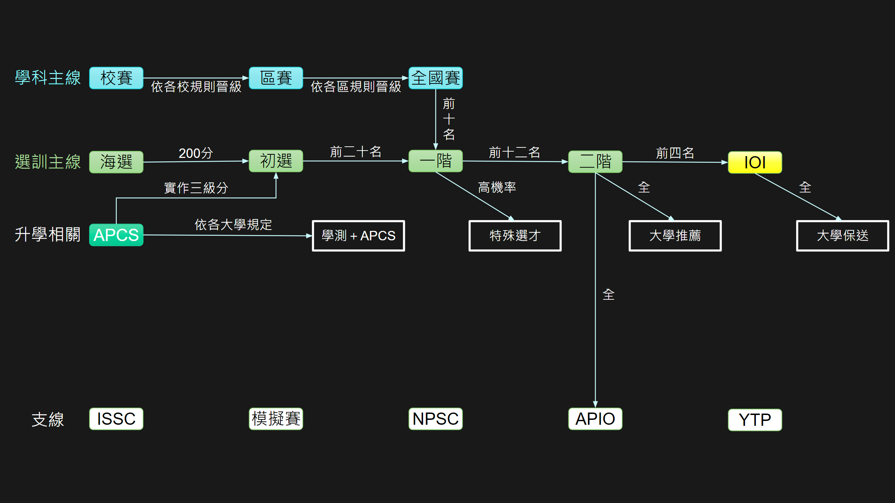

<figure markdown>
  { width="600" }
  <figcaption><a href="/wiki/cp/images/1.png" target="_blank">比賽路線圖</a> by 何達睿</figcaption>
</figure>

備註 :

- 有**額外** 5 個名額是女性保障 (不管二十名 + 全國有多少女生，都是再增額錄取 5 個)

- 高一保 4 個名額 (若前二十名 + 全國 + 女保**高一以下**不到 4 個，則增額錄取到 4 個)

- 二階線成績過近會考慮增額錄取