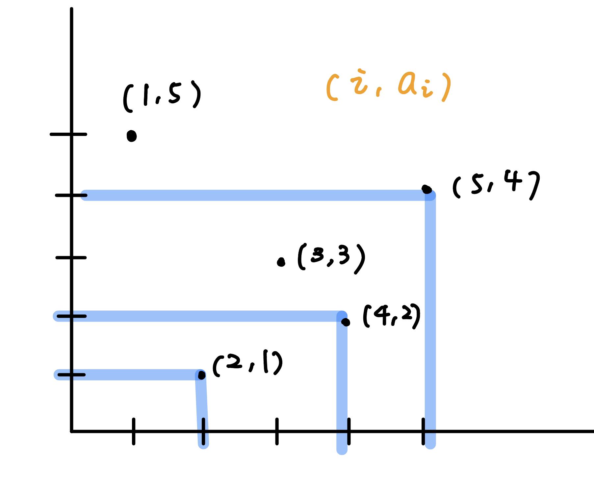
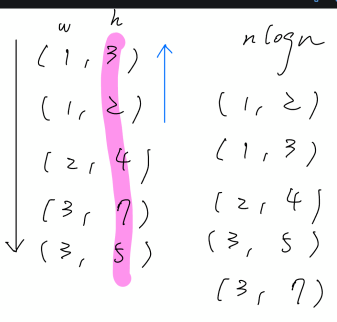
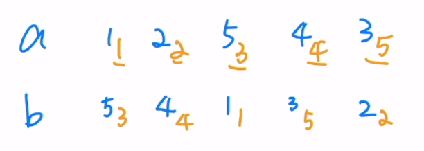
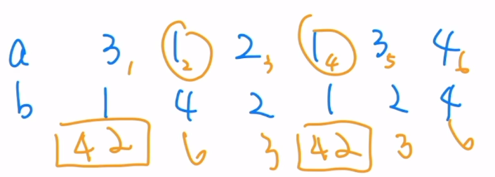
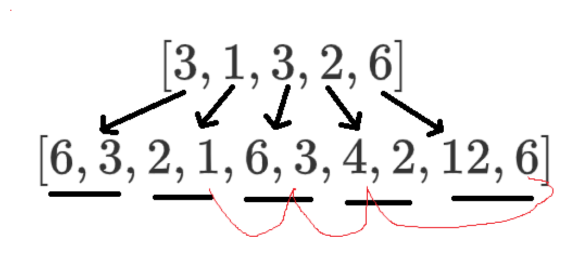
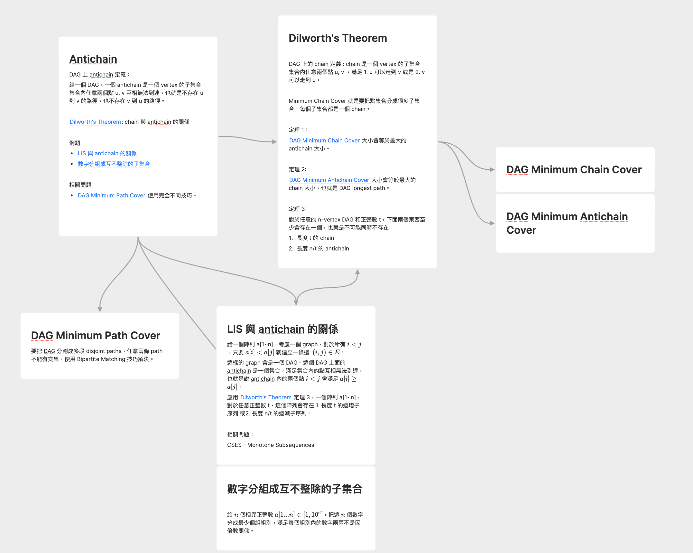
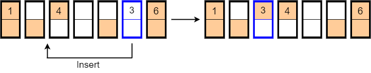
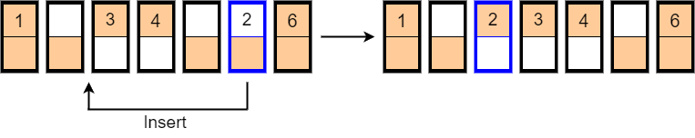

## 介紹

???+note "[CSES - Increasing Subsequence](https://cses.fi/problemset/task/1145)"
	給一個長度為 $n$ 的陣列 $a_1, a_2 ,\ldots ,a_n$，找出一個最長的子序列，裡面的值是嚴格遞增的
	
	$n\le 2\times 10^5,a_i\le 10^9$

考慮最後一個東西一定要選，$dp[i]$ 表示只看 $a_1, \ldots ,a_i$，第 $i$ 項一定要選的最好答案，我們可以列出轉移式

$$dp[i]=\max \limits_{j< i \texttt{ and }a_j<a_i} \{ dp[j] + 1 \}$$

最後的答案就是 $\max \{ dp[1], dp[2], \ldots ,dp[n]\}$

### 解法一 — 二分搜

考慮刪除沒有用的子問題，每一種可能的長度只會有一個點被留下來，lis 長度為 $L$ 而被留下來的就是「長度 L 的最小可能結尾」。如果我們將這個資料存放在一個陣列 $v$，這個陣列的元素是單調遞增的，在第 $i$ 個回合計算 lis$(i)$ 時，我們搜尋找到 $L=\max \limits_{v[j] < a[i]}\{ j \}$，於是我們得到 lis$(i) = L+1$，最後我們要記得將 lis$(i)$ 的算到 $v$ 裡面。

??? note "code"
	```cpp linenums="1"
	vector<int> FindLIS(vector<int> &a) {
        int n = a.size();
        vector<int> dp(n);
        vector<int> v;
        for (int i = 0; i < n; i++) {
            if (v.empty() || v.back() < a[i]) {
                v.push_back(a[i]);
                dp[i] = v.size();
            } else {
                dp[i] = lower_bound(ALL(v), a[i]) - v.begin() + 1;
                *lower_bound(ALL(v), a[i]) = a[i];
            }
        }
        return dp;
    }
    ```

### 解法二 — 二維座標

觀察轉移式 

$$dp[i]=\max \limits_{j< i \texttt{ and }a_j<a_i} \{ dp[j] + 1 \}$$

我們將 $(i,a_i)$ 打在二維座標上看

<figure markdown>
  { width="400" }
</figure>

也就是我們需要一個 DS 去「回傳 $a_i < x$」的最大值

這利用值域線段樹或 BIT，v$[x]$ 維護以 $x$ 結尾的最大 LIS 長度

## 變化

### 帶權 LIS

???+note "[Atcoder dp contest Q. Flowers](https://atcoder.jp/contests/dp/tasks/dp_q)"
	給一個長度為 $n$ 的陣列 $a_1, a_2 ,\ldots ,a_n$，每個 $i$ 有一個權重 $w_i$，找出一個權重和最大的子序列，裡面的值是嚴格遞增的

	??? note "思路"
		$$dp[i]=\max \limits_{j< i \texttt{ and }a_j<a_i} \{ dp[j] + w_i \}$$
	
		一樣用用值域線段樹即可

### 字典序

???+note "問題"
	給一個長度為 $n$ 的陣列 $a_1, a_2 ,\ldots ,a_n$，輸出字典序最小的 LIS
	
	??? note "思路"
		字典序是從序列的頭開始比較，所以要把 LIS 變化一下改成「從第 i 項到第 n 項的 LIS 長度」
		
		$$
	    \begin{array}{c|cccccc}
	    陣列&3&1&4&2&5&9\\
	    \hline
	    往後的 \space \texttt{LIS} \space 長度& 4 & 4 & 3 & 3 & 2 & 1\\
	    \end{array}
	    $$
	
	??? note "code"
	    ```cpp linenums="1"
	    vector<int> v[N]; // v[x] : 存 LIS(i) = x 的 i
	
	    void solve() {
	        vector<int> ans;
	        int pos = 0, last = 0;
	        for (int i = len; i >= 1; i--) {
	            int mn = 1e9;
	            int nxt_pos = 0;
	            for (auto j : v[i]) {
	                if (a[j] > last && j > pos && a[j] < mn) {
	                    nxt_pos = j;
	                    mn = a[j];
	                }
	            }
	            ans.push_back(mn);
	            pos = nxt_pos;
	            last = mn;
	        }
	    }
	    ```

### LIS 數量

???+note "問題"
	給一個長度為 $n$ 的陣列 $a_1, a_2 ,\ldots ,a_n$，輸出有幾個 LIS
    
	??? note "思路"
		一樣是從後往前做，線段樹 v[x] 維護 (max length, cnt) 分別代表目前以 x 當開頭，lis 長度最大的，與有幾個

### 必經 LIS

???+note "[CF 486 E. LIS of Sequence](https://codeforces.com/problemset/problem/486/E)"
	給一個長度為 $n$ 的陣列 $a_1, a_2 ,\ldots ,a_n$，問對於每一項 $a_i$ 是屬於哪個 type
	
    - $\text{type 1: }$ 在每一個 LIS 都一定包含 $a_i$
    
    - $\text{type 2: }$ 在至少一個 LIS 包含 $a_i$
    
    - $\text{type 3: }$ $a_i$ 完全不在任何 LIS 之中
    
    $n\le 10^5$
    
    ??? note "思路"
    	令 $L[i],R[i]$ 分別代表以 $a_i$ 結尾，以 $a_i$ 開頭的 LIS 長度
    
    	如果 $a_i$ 在 LIS 中就代表 : LIS 長度 $= L[i]+R[i]-1$
    	
    	這樣就可以判斷是不是 type 3 了。若為 type 1，代表 $L[i]$ 唯一，否則如果有人 $L[i]=L[j]$ 那後面的 $R[i]$ 兩個都可以接
    	
    ??? note "code"
    	```cpp linenums="1"
    	int getPos (vector<int> &lis, int x) {
            return lower_bound(lis.begin(), lis.end(), x) - lis.begin();
        }
    
        void solve () {
            cin >> n;
            a.resize(n);
            for (int i = 0; i < n; i++) {
                cin >> a[i];
            }     
    
            // 結尾的 LIS
            vector<int> lis;
            int len = 0, cur = 0;
            for (int i = 0; i < n; i++) {
                l[i] = getPos(lis, a[i]) + 1;
                if (l[i] - 1 < lis.size()) lis[l[i] - 1] = a[i];
                else lis.pb(a[i]);
                len = max(len, l[i]);
            }
    
            // 開頭的 LIS
            // 從後面看過來遞減, 加了負號相當於遞增
            lis.clear();
            cur = m - 1;
            for (int i = n - 1; i >= 0; i--) {
                r[i] = getPos(lis, -a[i]) + 1;
                if (r[i] - 1 < lis.size()) lis[r[i] - 1] = -a[i];
                else lis.pb(-a[i]);
            }
    
            for (int i = 0; i < n; i++) {
                if (l[i] + r[i] - 1 == len) {
                    cnt[l[i]]++;
                }
                else // type 3
            }
            for (int i = 0; i < n; i ++) {
                if (l[i] + r[i] - 1 == len) {
                    if (cnt[l[i]] == 1) // type 1
                    else // type 2
                }
            }
        }
        ```

???+note "[CS Academy Critical Cells](https://csacademy.com/contest/archive/task/critical-cells)"
	給一個 $n\times m$ 的 grid，其中有 $k$ 格是特殊格，從 $(1,1)$ 開始要走到 $(n,m)$，每次可向右，或向下移動一格，目標是走過越多格特殊越好。問有幾個特殊格是移除之後能走過的最大特殊格數量會減少
	
	$1\le n, m\le 10^9, 1\le k\le 10^5$
	
	??? note "思路"
		直接把 $k$ 個特殊格的座標 $(x,y)$ 當成上面那個問題做就好

### 切 k 段 LIS

???+note "問題"
    給一個長度為 $n$ 的陣列 $a_1, a_2 ,\ldots ,a_n$，和 $k$，將陣列 a 分成 k 段，每段各自求 LIS，目標是讓 k 段 LIS 長度總和最大
    
    $n\times k \le 10^5$
    
    ??? note "思路"
    	$dp(k, i)=$ $a_1 , \ldots ,a_n$ 分成 $k$ 段的最好答案，$a_i$ 一定要選
    
        轉移式
    
        $$
        dp(k, i) = \max \begin{cases} dp(k, j) + 1 \\ dp(k - 1, j) + 1 \text{ if } a_j \ge a_i\end{cases}
        $$
    
        複雜度 $O(n\times k)\times O(\log n)$
    
    ??? note "code"
        ```cpp linenums="1"
        #include <algorithm>
        #include <iostream>
        #include <vector>
    
        using namespace std;
    
        struct BIT {
            int len;
            vector<int> bit;
            // b[x] : 某個需要快速處理的陣列
            // bit[x] = min(b[x - lowbit(x) + 1] ~ b[x])
    
            BIT(int n) {
                len = n;
                bit.resize(n + 1);
            }
            inline int lowbit(int x) {
                return x & (-x);
            }
            void update(int pos, int val) {  // 把 b[pos] 跟 val 取 max
                for (; pos <= len; pos += lowbit(pos)) {
                    bit[pos] = max(bit[pos], val);
                }
            }
            int prefix_max(int pos) {  // 找 b[1] ~ b[pos] 最大值
                int ans = 0;
                for (; pos > 0; pos -= lowbit(pos)) {
                    ans = max(ans, bit[pos]);
                }
                return ans;
            }
        };
    
        int solve(int n, int K, const vector<int> &a) {
            vector<vector<int>> dp(K + 1, vector<int>(n, 0));
    
            for (int k = 1; k <= K; k++) {
                // 考慮開新的一段
                int mx = 0;
                for (int i = 0; i < n; i++) {
                    dp[k][i] = max(mx + 1, dp[k - 1][i]);
                    mx = max(mx, dp[k - 1][i]);
                }
    
                // 考慮前一個選的東西在同段
                BIT DS(n);  // b[i] = 用了 k 段，且結尾數值為 b[i] 的答案
                for (int i = 0; i < n; i++) {
                    // 快的做法
                    dp[k][i] = max(dp[k][i], DS.prefix_max(a[i] - 1) + 1);
                    DS.update(a[i], dp[k][i]);
    
                    // 慢的做法
                    /*
                    for (int j = 0; j < i; j++) {
                        if (a[j] < a[i]) {
                            dp[k][i] = max(dp[k][i], dp[k][j] + 1);
                        }
                    }
                    */
                }
            }
            return *max_element(dp[K].begin(), dp[K].end());
        }
    
        int main() {
            int n, K;
            vector<int> a;
    
            cin >> n >> K;
            a = vector<int>(n);
            for (int i = 0; i < n; i++) cin >> a[i];
    
            // 離散化：把 a[i] 數值範圍轉為 0~(n-1)
            vector<int> t = a;
            sort(t.begin(), t.end());
            for (int &x : a) {
                x = 1 + lower_bound(t.begin(), t.end(), x) - t.begin();
            }
    
            int ans = solve(n, K, a);
            cout << ans << '\n';
        }
        ```

???+note "[CF 650 D. Zip-line](https://codeforces.com/problemset/problem/650/D)"
	給一個長度為 $n$ 的序列 $a_1, \ldots ,a_n$，有 $q$ 筆詢問 :
	
	- $\text{query}(i,x):$ 若將 $a_i$ 改成 $x$，LIS$(a)$ 是多少
	
	$n,m\le 4\times 10^5, 1\le a_i, x\le 10^9$
	
	??? note "思路"
		將以下兩種情況取 max 就是改變後的 LIS 長度
		
		- $a_i$ 是必經的，答案變成 lis - 1
	
		- 包含 $a_i = x$ 的 lis 長度
	
		其中，包含 $a_i = x$ 的 lis 可以在建 l[ ], r[ ] 的時候順便做好，詳見代碼
		
		小心這題會卡時間
		
	??? note "code"
		```cpp linenums="1"
		#include <bits/stdc++.h>
	    #define int long long
	    #define pb push_back
	    #define mk make_pair
	    #define F first
	    #define S second
	    #define pii pair<int, int>
	    using namespace std;
	
	    struct qry {
	        int idx, val, id, ans;
	    };
	
	    const int INF = 9e18;
	    const int maxn = 4e6 + 5;
	    int n, m;
	    vector<int> a;
	    vector<qry> q;
	    int l[maxn], r[maxn], all[maxn], cnt[maxn];
	
	    int getPos(vector<int> &lis, int x) {
	        return lower_bound(lis.begin(), lis.end(), x) - lis.begin();
	    }
	
	    void solve() {
	        scanf("%lld%lld", &n, &m);
	        a.resize(n);
	        q.resize(m);
	        for (int i = 0; i < n; i++) {
	            scanf("%lld", &a[i]);
	        }
	        for (int i = 0; i < m; i++) {
	            scanf("%lld%lld", &q[i].idx, &q[i].val);
	            q[i].idx--;
	            q[i].id = i;
	        }
	
	        sort(q.begin(), q.end(), [](qry a, qry b)
	             { return a.idx < b.idx; });
	        vector<int> lis;
	        int len = 0, cur = 0;
	        for (int i = 0; i < n; i++) {
	            while (cur < m && q[cur].idx == i) {
	                q[cur++].ans += getPos(lis, q[cur].val);
	            }
	            l[i] = getPos(lis, a[i]) + 1;
	            if (l[i] - 1 < lis.size()) {
	                lis[l[i] - 1] = a[i];
	            } else {
	                lis.pb(a[i]);
	            }
	            len = max(len, l[i]);
	        }
	
	        lis.clear();
	        cur = m - 1;
	        for (int i = n - 1; i >= 0; i--) {
	            while (cur >= 0 && q[cur].idx == i) {
	                q[cur--].ans += getPos(lis, -q[cur].val);
	            }
	            r[i] = getPos(lis, -a[i]) + 1;
	            if (r[i] - 1 < lis.size()) {
	                lis[r[i] - 1] = -a[i];
	            } else {
	                lis.pb(-a[i]);
	            }
	        }
	
	        for (int i = 0; i < n; i++) {
	            if (l[i] + r[i] - 1 == len) {
	                cnt[l[i]]++;
	            }
	        }
	        for (int i = 0; i < n; i++) {
	            if (l[i] + r[i] - 1 == len) {
	                all[i] = (cnt[l[i]] == 1);
	            }
	        }
	
	        sort(q.begin(), q.end(), [](qry a, qry b)
	             { return a.id < b.id; });
	        for (int i = 0; i < m; i++) {
	            printf("%lld\n", max(q[i].ans + 1, len - all[q[i].idx]));
	        }
	    }
	
	    signed main() {
	        solve();
	    }
		```

## 二維偏序

### 嚴格

???+note "問題（Box Stacking Problem）"
	給你 $n$ 個 $(x,y)$，問你最多可以選幾個，滿足 $x_i<x_j$ 且 $y_i < y_j$
	
	??? note "思路"
		將 $(x,y)$ 先按照 $x$ 小到大排序，對於 $x$ 相同的，將 $y$ 大到小排序（這樣才不會選到兩個 $x$ 一樣的，如圖）
		
		<figure markdown>
	      { width="400" }
	    </figure>
		
		這樣就可以將問題變成由 $y$ 組成的 LIS 長度

???+note "[CF 4 D. Mysterious Present](https://codeforces.com/problemset/problem/4/D/)"
	給你 $n$ 個 $(x,y)$，問你最多可以選幾個，滿足 $x_i<x_j$ 且 $y_i < y_j$，輸出選的編號
	
	$1\le n\le 5000,1\le w,h\le 10^6$

### 非嚴格

???+note "[APCS 2021 1 月 p4. 飛黃騰達](https://zerojudge.tw/ShowProblem?problemid=f608)"
	給你 $n$ 個 $(x,y)$，問你最多可以選幾個，滿足 $x_i\le x_j$ 且 $y_i \le y_j$
	
	??? note "思路"
		將 $(x,y)$ 先按照 $x$ 小到大排序，對於 $x$ 相同的，將 $y$ 小到大排序（可以選到兩個 $x$ 一樣的）。在選 $y$ 的時候，要使用 upper bound，因為 $y$ 相同的是可以一起選的

## LCS 轉 LIS

???+note "LCS - 出現一次"
	給兩個長度為 $n$ 的序列 $a,b$，求 LCS 長度
	
	$n\le 5\times 10^5,1\le a_i, b_i\le n,$ 同種數字出現在陣列 1 次
	
	??? note "思路"
		將陣列 $a$ 從左到右編號 $1\sim n$，將 $b_i$ 編號為 $b_i$ 這個數值在 $a$ 內的編號，如圖
	
		<figure markdown>
	      { width="400" }
	    </figure>
	    
	    這樣就可以用編號組成的新陣列求 LIS

???+note "LCS - 出現兩次"
	給兩個長度為 $n$ 的序列 $a,b$，求 LCS 長度
	
	$n\le 5\times 10^5,1\le a_i, b_i\le n,$ 同種數字出現在陣列 1 或 2 次
	
	??? note "思路"
		將同一種數值出現的編號反著放，這樣可以保證小的一定會被先選
	
		<figure markdown>
	      { width="400" }
	    </figure>

???+note "[Sprout OJ 421](https://neoj.sprout.tw/problem/421/)"
	給長度 $n$ 的序列 $a_1, \ldots ,a_n$，可以將任一個數字變兩倍，輸出每個數字均大於 $m$ 的最長非嚴格遞增序列長度
	
	$1\le n\le 5\times 10^5, 1\le m, a_i \le 10^9$
	
	??? note "思路"
		將 $2\times a_i, a_i$ 依序放到新陣列裡面，在新陣列做
		
		<figure markdown>
	      { width="400" }
	    </figure>
	    
	    然後再用 upper bound 求 LIS 就好了

???+note "[TOI 初選 2021 pC. 粉刷護欄](https://tioj.ck.tp.edu.tw/problems/2195)"
	給兩個長度為 $n$ 的陣列 $a,b$，數字恰好都出現在 $a,b$ 各一次，你可以在 $a,b$ 之間對同種數字連線，問線不能交叉下最多能連幾條，輸出字典序最小的方案
	
	$n\le 2\times 10^5,0\le a_i, b_i\le 10^9$
	
	??? note "思路"
		不交叉 iff $i_a < i_b$ 且 $j_a < j_b$，就變成 LCS 出現一次的問題了
		
		在加上上面提到的判字典序就可以了
		
	??? note "code"
		```cpp linenums="1"
		#include <iostream>
	    #include <vector>
	    #include <algorithm>
	    #include <queue>
	    #include <map>
	    using namespace std; 
	    int a[200005], b[200005];
	    int dp[200005];
	    map<int,int>mp;
	    vector<int>s[200005];
	    int main() {
	        int n;
	        cin >> n;
	        for (int i = 1 ; i <= n ; i++) {
	            cin >> a[i];
	        }
	        for (int i = 1 ; i <= n ; i++) {
	            cin >> b[i];
	            mp[b[i]] = i;
	        }
	        vector<int>v;
	        vector<int>arr;
	        int mx = 0;
	        for (int i = n ; i >= 1 ; i--) {
	            int pos = mp[a[i]];
	            arr.push_back(pos);
	            pos = n - 1 - pos;
	            if (!v.size() || pos > v.back()) {
	                v.push_back(pos);
	                dp[i] = v.size();
	            }
	            else {
	                dp[i] = lower_bound(v.begin(), v.end(), pos) - v.begin() + 1;
	                *lower_bound(v.begin(), v.end(), pos) = pos;
	            }
	            s[dp[i]].push_back(i);
	            mx = max(mx, dp[i]);
	        }
	        int pos1 = 0, pos2 = 0;
	        for (int i = mx ; i >= 1 ; i--) {
	            int ans = 0, pos = 0;
	            for (auto &j : s[i]) {
	                if (a[j] > ans && j > pos1 && mp[a[j]] > pos2) {
	                    pos = j;
	                    ans = a[j];
	                }
	            }
	            cout << ans <<' ';
	            pos1 = pos;
	            pos2 = mp[a[pos]];
	        }
	    }
		```

## Dilworth's theorom

<figure markdown>
  { width="600" }
  <figcaption>Dilworth's theorom</figcaption>
</figure>

## 題目

???+note "[CSES - Increasing Subsequence II](https://cses.fi/problemset/task/1748)"
	給一個長度為 $n$ 的陣列 $a_1, \ldots ,a_n$，問有幾個遞增數列
	
	$n\le 2\times 10^5, a_i\le 10^9$
	
	??? note "思路"
		dp[i] = 看 1 ~ i，以 a[i] 為結尾的遞增數列有幾個
		
		轉移 dp[i] = sum(dp[j] | j < i && a[j] < a[i] )

???+note "[Atcoder arc149 B. Two LIS Sum](https://atcoder.jp/contests/arc149/tasks/arc149_b)"
	給你兩個 $1\ldots n$ 的 permutation $a, b$，你可以做以下操作任意次
	
	- 選一個 $i$，swap$(a_i, a_{i + 1})$ 並 swap$(b_i, b_{i + 1})$
	
	輸出 LIS$(a)+$ LIS$(b)$ 最大可以是多少
	
	$2\le n\le 3\times 10^5$
	
	??? note "思路"
		我們考慮最後的答案 LIS 選擇的東西會是什麼，如果有沒選的，讓 a 把他選起來一定更好
		<figure markdown>
	      { width="500" }
	    </figure>
		
		如果 b 有選 a 沒選的，讓 a 選答案一定不會變差
		
		<figure markdown>
	      { width="500" }
	    </figure>
	    
	    所以我們可以得出一個結論 : 先將 a sort 好（b 也跟著 a 的順序變），答案就是 |a| + LIS(b)

???+note "Sloane's Box Stacking Problem [Atcoder dp contest X. Tower](https://atcoder.jp/contests/dp/tasks/dp_x)"
	有 $n$ 個箱子，每個箱子有 $(w,s,v)$ 代表重量、抗壓量、高度。一個箱子上方的重量總和，不能超過這個箱子的抗壓力量。問最多能疊多高 ?
	
	$1\le n\le 10^3,1\le w_i, s_i\le 10^4,1\le v_i\le 10^9$
	
	??? note "思路"
		考慮 Exchange Arguements，我們拿兩個箱子 $i$ 跟 $j$ 來比較。$j$ 可以放比較下面 iff $s_i - w_j < s_j - w_i$。
		
		當我們將陣列用上面的 Exchange Arguements sort 好後，我們做類似背包問題，$dp(i,j)=$ 考慮 $1\ldots i$，重量總和 $\le j$ 能取到的最大高度。轉移的話一樣考慮取 $i$ 或不取 $i$，取 $i$ 的話剩下的重量就必須 $\le s_i$
		
		$$dp(i, j)=\max \begin{cases} dp(i - 1, j - w_i)+v_i \space \text{if}\space 0 \le j - w_i \le s_i \\ dp(i - 1, j)\end{cases}$$
		
	??? note "code"
		```cpp linenums="1"
		#include <bits/stdc++.h>
	
	    using namespace std;
	    using ll = long long;
	
	    const int N = 1010,M = 20010;
	    struct faner {
	        int w, s, v;
	    } a[N];
	    ll f[M], ans;
	
	    bool cmp(faner a, faner b) {
	        return a.s + a.w < b.s + b.w;
	    }
	
	    int main() {
	        int n; 
	        cin >> n;
	        for (int i = 1; i <= n; i++) {
	            cin >> a[i].w >> a[i].s >> a[i].v;
	        }
	        sort(a + 1, a + n + 1, cmp);
	        for (int i = 1; i <= n; i++) {
	            for (int j = M - 1; j >= a[i].w; j--) {
	                if (a[i].s + a[i].w >= j) {
	                    f[j] = max(f[j], f[j - a[i].w] + a[i].v);
	                }
	            }
	        }       
	        for (int i = 1; i < M; i++) {
	            ans = max(ans, f[i]);
	        }
	        cout << ans << '\n';
	    }
	    ```

???+note "[竹科實中 2023 校內賽 pB. 構造 LIS](https://nehshcedutw-my.sharepoint.com/:o:/g/personal/h091160_nehs_hc_edu_tw/EuSmByedqi1Ljj-ZoafGIaoBB136-UXC91YIIAR8PRZcYQ?rtime=zn2YHSW520g)"
	給一顆 $n$ 個點的樹，每個點上有一個未定的數 $p_i$，構造 $p=1\ldots n$ 的 permutation 使得 :
    
    - 從 root 到 $i$，以 $p_i$ 結尾的 LIS 長度為 $b_i$
    
    $n\le 2\times 10^5$
    
    ??? note "思路"
    	先分析 :
    	
    	- 對於 $j<i$ 且 $b_j=b_i$ ，要滿足 $p_j>p_i$
    
    	- 對於 $j<i$ 且 $b_j=b_i-1$，至少存在一個 $p_j<p_i$
    
    	考慮建圖，我們從小的連到大的。可以觀察到對於同樣 $b_i$ 的 $i$，越後面的 $p_i$ 越小，所以上面兩個限制其實都只要連到最後面滿足條件的即可。
    	
    	- $i\to j$
    
    	- $j\to i$
    
    	這樣會形成一個 DAG，所以答案就是 topo order

???+note "[CS Academy - Strictly Increasing Array](https://csacademy.com/contest/archive/task/strictly-increasing-array)"
	給一個長度為 $n$ 的陣列 $a_1, \ldots ,a_n$，每次操作可以將某項變成任意整數，問最少幾次操作可使陣列嚴格遞增
	
	$n\le 10^5, 1\le a_i\le 10^9$
	
	??? note "思路"
		將問題轉換成「最多可以不改動幾個數」。若不動的相鄰兩項為 $i,j$ 其中 $(i<j)$，那必須滿足 $j-i \le a_j-a_i$，這樣中間才有辦法塞值域進去。
		
		我們將式子整理一下變成 $a_i - i \le a_j-j$，也就是在 $a_i'=a_i-i$ 上找最長非嚴格遞增子序列

???+note "LIS deletion"
	給一長度為 $n$ 的陣列 $a$，每次可以從 $a$ 刪掉一個嚴格遞增的子序列，求最少幾次才能刪完
	
	$n\le 2\times 10^5, 1\le a_i \le 10^9$
	
???+note "[CSES - Collecting Numbers II](https://cses.fi/problemset/task/2217)"
	給一個 $1\ldots n$ permutation $a$，每輪可以從 $a$ 刪掉一個遞增的子序列，一一定要從 $1$ 取到 $n$。有 $q$ 筆操作如下 :
	
	- $\text{swap}(i,j):$ 將 $a_i$ 與 $a_j$ swap，然後輸出當前 $a$ 最少要幾輪才能取完
	
	$n\le 2\times 10^5, 1\le a_i \le 10^9$
	
	??? note "思路"
		2 如果再 1 後面就可以跟 1 一起取，否則必須再跑一輪，所以再沒 swap 的情況下只要計算 pos[a[i]] > pos[a[i + 1]] 的數量即可。有 swap 的話再好好維護一下 i, j 跟他們前後的貢獻即可
		
	??? note "code"
		```cpp linenums="1"
		#include <bits/stdc++.h>
        #define int long long
        #define pb push_back
        #define mk make_pair
        #define F first
        #define S second
        #define pii pair<int, int>
        using namespace std;

        const int INF = 9e18;
        const int maxn = 2e5 + 5;
        int n, m, cnt;
        int a[maxn], pos[maxn];
        int up[maxn], down[maxn];

        void update(int u, int v) {
            vector<pii> st;
            if (a[u] < n) st.pb({a[u], a[u] + 1});
            if (a[v] > 1) st.pb({a[v] - 1, a[v]});
            if (a[u] > 1) st.pb({a[u] - 1, a[u]});
            if (a[v] < n) st.pb({a[v], a[v] + 1});

            pos[a[u]] = v;
            pos[a[v]] = u;
            swap(a[u], a[v]);
            for (auto p = st.begin(); p != st.end(); p++) {
                cnt -= up[p -> F];
                if (pos[p -> F] > pos[p -> S])  cnt++;
                up[p -> F] = pos[p -> F] > pos[p -> S];
            }                                                           
        }
        
        void solve() {
            cin >> n >> m;
            for (int i = 1; i <= n; i++) {
                cin >> a[i];
                pos[a[i]] = i;
            }
            for (int i = 1; i <= n - 1; i++) {
                up[i] = pos[i] > pos[i + 1];
                if (up[i]) cnt++;
            }
            int u, v;
            while (m--) {
                cin >> u >> v;
                update(u, v);
                cout << cnt + 1 << "\n";
            }
        }

        signed main() {
            solve();
        }
		```

---

## 參考資料

- AP325

- <https://drive.google.com/file/d/1HaGN0aFsFLbgT6XkmZ-R7NS-LkWrobRt/view>

- <https://www.luogu.com.cn/training/215>