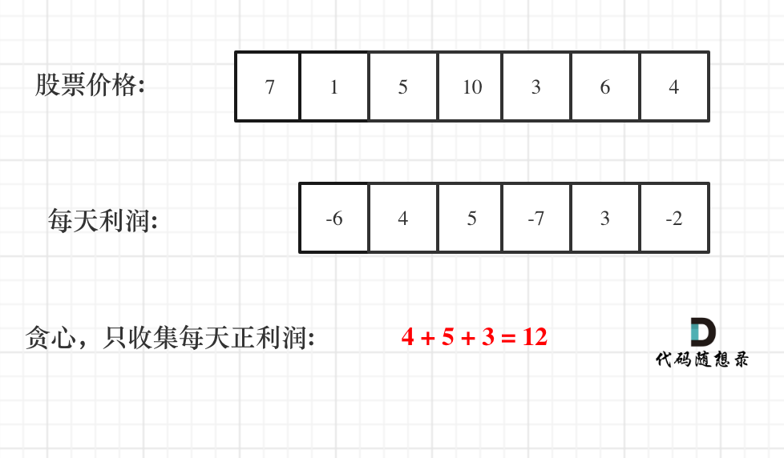
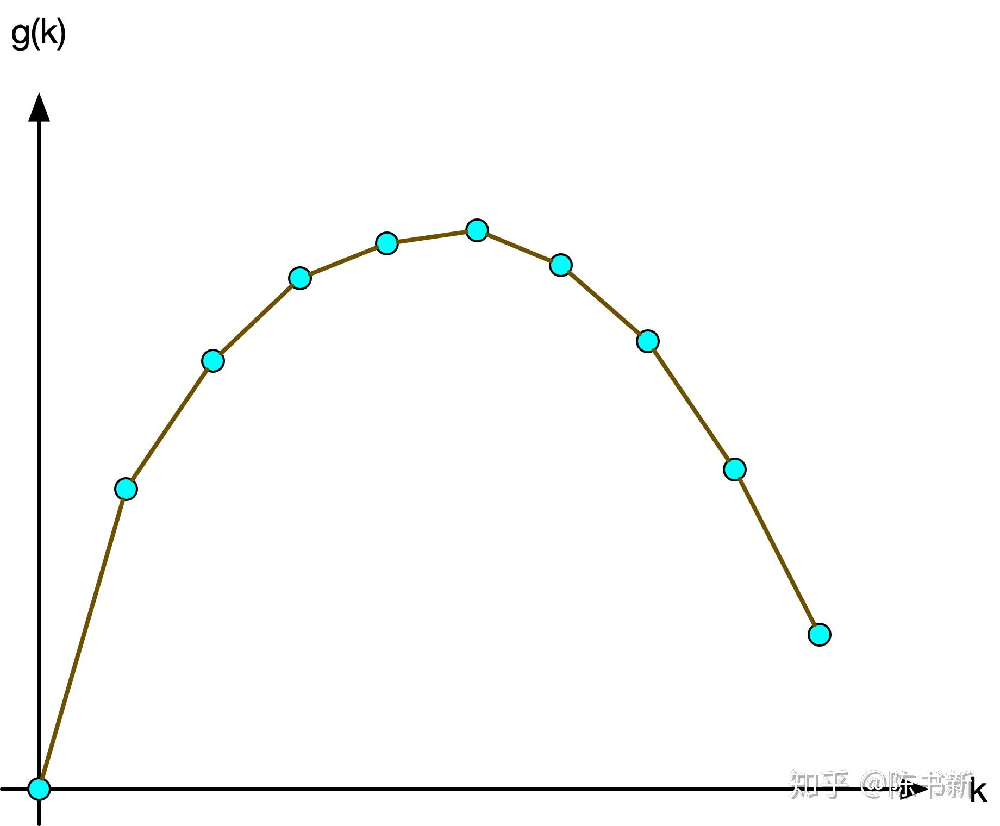

Aliens 優化，利用手續費 w 來限制選的次數，慢慢去逼近選 k 次的 w（可能不存在，但就是去嘗試逼近，因為選的次數還是具有單調性）

##  AI-666 賺多少

### Best Time to Buy and Sell Stock

???+note "[LeetCode 122. Best Time to Buy and Sell Stock II](https://leetcode.com/problems/best-time-to-buy-and-sell-stock-ii/)"
	給你 $n$ 個股價 $a_1,\ldots ,a_n$，你可以做最多一次買跟賣，且買跟賣可以在同一天，獲利最大是多少
	
	$n\le 3\times 10^4,a_i\le 10^4$
	
	??? note "思路"
		因為可以當天賣又當天買，利潤變成可以拆解的，那我們就 Greedy 的選即可
	
		<figure markdown>
	      { width="300" }
	      <figcaption>Image caption</figcaption>
	    </figure>
	    
	??? note "code"
		```cpp linenums="1"
		class Solution {
	    public:
	        int maxProfit(vector<int>& prices) {
	            int result = 0;
	            for (int i = 1; i < prices.size(); i++) {
	                result += max(prices[i] - prices[i - 1], 0);
	            }
	            return result;
	        }
	    };
		```

???+note "[LeetCode 714. Best Time to Buy and Sell Stock with Transaction Fee](https://leetcode.com/problems/best-time-to-buy-and-sell-stock-with-transaction-fee/)"
	給你 $n$ 個股價 $a_1,\ldots ,a_n$，買跟賣不能在同一天，且一次買賣會扣 w 元的手續費，獲利最大是多少
	
	$k\le n\le 2\times 10^6,a_i\le 10^7$
	
	??? note "思路"
		dp[i][0/1]: i 之前的最後一張是賣出/還是買進
	
		dp[i][0] = max(dp[i - 1][0], dp[i - 1][1] + a[i])
		
		dp[i][1] = max(dp[i - 1][0] - a[i] - w, dp[i - 1][1])

### AI-666 賺多少

???+note "[2017 全國賽 AI-666 賺多少](https://tioj.ck.tp.edu.tw/problems/2039)"
	給你 $n$ 個股價 $a_1,\ldots ,a_n$，你可以做最多 k 買跟賣，且買跟賣不能在同一天，獲利最大是多少
	
	$k\le n\le 2\times 10^6,a_i\le 10^7$
	
	??? note "思路"
		Aliens 優化。在計算的部分，我們可以套入上面手續費的概念，手續費越多，能拿的次數就越小，注意同個手續費能拿的次數可能不只一種，我們這邊一律取最小的次數。
		
		若無 k 的限制，意即我們拿幾次都可以，令此時恰好買賣 t 次，其實意義等同於手續費為 0，同時也是手續費的下限。我們可以將圖畫出來，g(k) 為買 k 次的最大獲利。 
		
		<figure markdown>
	      { width="250" }
	    </figure>
		
		所以我們可以寫出 :
		
		- 若 k < t，那一定是 k 次最好。
		
		- 若 k > t，最佳解即是 t 次。
		
		因為在這邊同樣手續費可能對應多種買賣次數，在我們都一律取最小的情況下，我們就是要二分搜第一個「最佳買賣次數」 <= k 的 w。例如 k = 4，那我就會選到 w = 2。
		
		$$
		\begin{array}{c|cccccc}
        w&0&1&2&3&4&5\\
        \hline
        最佳買賣次數 & 5 & 5 & 3 & 3 & 3 & 1\\
        \end{array}
        $$
	    
	    我們令「在手續費為 w 的最小買賣次數」為 x。實作上最後要加回去的手續費會是 k * w，不能寫成 x * w，因為你同時可以選擇買賣 k 次或 x 次，那若 x < k（如上圖的 k = 4, x = 3），ans + k*w 顯然是比較大的。
	    
	    下面的寫法有點不太正統(並未使用小數點二分搜去逼近)

	??? note "code"
		```cpp linenums="1"
		#pragma GCC optimize("O3,unroll-loops")
	    #include <bits/stdc++.h>
	    #define int long long
	    #define pii pair<int, int>
	    #define pb push_back
	    #define mk make_pair
	    #define F first
	    #define S second
	    #define ALL(x) x.begin(), x.end()
	
	    using namespace std;
	
	    const int INF = 9e18;
	    const int maxn = 3e6 + 5;
	    const int M = 1e9 + 7;
	
	    int n, k;
	    int a[maxn];
	    int dp[maxn][2];
	    int cnt[maxn][2];
	
	    pii cal(int w) {
	        dp[0][1] = -INF;
	        cnt[0][1] = 0;
	        for (int i = 1; i <= n; i++) {
	            dp[i][0] = max(dp[i - 1][0], dp[i - 1][1] + a[i]);
	            int mn = INF;
	            if (dp[i][0] == dp[i - 1][0]) {
	                mn = min(cnt[i - 1][0], mn);
	            }
	            if (dp[i][0] == dp[i - 1][1] + a[i]) {
	                mn = min(cnt[i - 1][1], mn);
	            }
	            cnt[i][0] = mn;
	
	            dp[i][1] = max(dp[i - 1][0] - a[i] - w, dp[i - 1][1]);
	            mn = INF;
	            if (dp[i][1] == dp[i - 1][0] - a[i] - w) {
	                mn = min(cnt[i - 1][0] + 1, mn);
	            } 
	            if (dp[i][1] == dp[i - 1][1]) {
	                mn = min(cnt[i - 1][1], mn);
	            }
	            cnt[i][1] = mn;
	        }
	        // total profit, transiction time
	        return {dp[n][0], cnt[n][0]};
	    }
	
	    signed main() {
	        ios::sync_with_stdio(0);
	        cin.tie(0);
	        cin >> n >> k;
	
	        for (int i = 1; i <= n; i++) {
	            cin >> a[i];
	        }
	        auto [p, t] = cal(0);
	        if (k > (n / 2) || k >= t) {
	            cout << p << '\n';
	            return 0;
	        }
	        int l = 0, r = 100000000;
	        while (l < r) {
	            int mid = (l + r) / 2;
	            if (cal(mid).S <= k) {
	                r = mid;
	            } else {
	                l = mid + 1;
	            }
	        }
	
	        cout << cal(l).F + k * l << '\n';
	    } 
	    ```

## CF 125E

???+note "K 度限制生成樹 [CF 125 E. MST Company](https://codeforces.com/problemset/problem/125/E)"
	給 $n$ 點 $m$ 邊連通圖，找最小生成樹滿足與點 $1$ 的度數要恰為 $k$，印出樹上的邊，或無解
	
	$n,k\le 5000,m\le 10^5,w_i\le 10^5$
	
	??? note "思路"
	    根據 Aliens 優化，我們將跟點 $1$ 連接的邊的邊權都加上一個權值 $w$，二分搜去逼近這個 $w$，其中 $w$ 可以正或負且可為小數
	    
	    二分搜出來的 w，要如何選才能選恰好 k 條邊呢 ? 選滿了與 1 相連的邊到 k 條以後，就不在把與 1 相連的邊加入。
	    
	??? note "code"
		```cpp linenums="1"
		#include<bits/stdc++.h>
        #define maxn 5500
        #define maxm 100100
        #define INF (1<<30)
        #define PI acos(-1.0)
        #define mem(a, b) memset(a, b, sizeof(a))
        #define For(i, n) for (int i = 0; i < n; i++)
        typedef long long ll;
        using namespace std;
        int n, m, k, x[maxm], y[maxm], w[maxm], p[maxm], f[maxn];
        int cnt, ans[maxn], inx;
        double l, r, mid;
        bool inline cmp(int i, int j) {
            return (x[i] == 1) * mid + w[i] < (x[j] == 1) * mid + w[j];
        }
        int findroot(int x) {
            return f[x] = (f[x] == x ? f[x] : findroot(f[x]));
        }
        void work(bool flag) {
            cnt = inx = 0;
            for (int i = 1; i <= n; i++) f[i] = i;
            sort(p + 1, p + m + 1, cmp);
            for (int i = 1; i <= m; i++) {
                int j = p[i];
                int u = findroot(x[j]), v = findroot(y[j]);
                if (u != v && (cnt + (x[j] == 1) <= k || flag)) {
                    f[u] = v;
                    ans[inx++] = j;
                    if (x[j] == 1) cnt++;
                }
            }
        }
        int main () {
            scanf("%d%d%d", &n, &m, &k);
            int tot = 0;
            for (int i = 1; i <= m; i++) {
                scanf("%d%d%d", x + i, y + i, w + i);
                p[i] = i;
                if (x[i] > y[i]) swap(x[i], y[i]);
                if (x[i] == 1) tot++;
            }
            //如果根节点的度数小于k，或者结点数大于1，而k == 0 一定不行
            if (tot < k || (n > 1 && k == 0)) {
                puts("-1");
                return 0;
            }
            //看能否生成一棵树
            mid = 0;
            work(1);
            if (inx + 1 < n) {
                puts("-1");
                return 0;
            }
            l = -1e5, r = 1e5;
            while(l + 1e-5 < r && cnt != k) {
                mid = (l + r) / 2;
                work(1);
                if (cnt < k) r = mid;
                else l = mid;
            }
            work(0);
            printf("%d\n", inx);
            for (int i = 0; i < inx - 1; i++) printf("%d ", ans[i]);
            if (inx) printf("%d\n", ans[inx - 1]);
        }

        /*
        5 6 3
        3 2 5
        4 5 5
        1 3 5
        1 2 5
        1 4 5
        1 5 5

        */
		```

## 相關

- <https://www.luogu.com.cn/problem/P1484>
	

