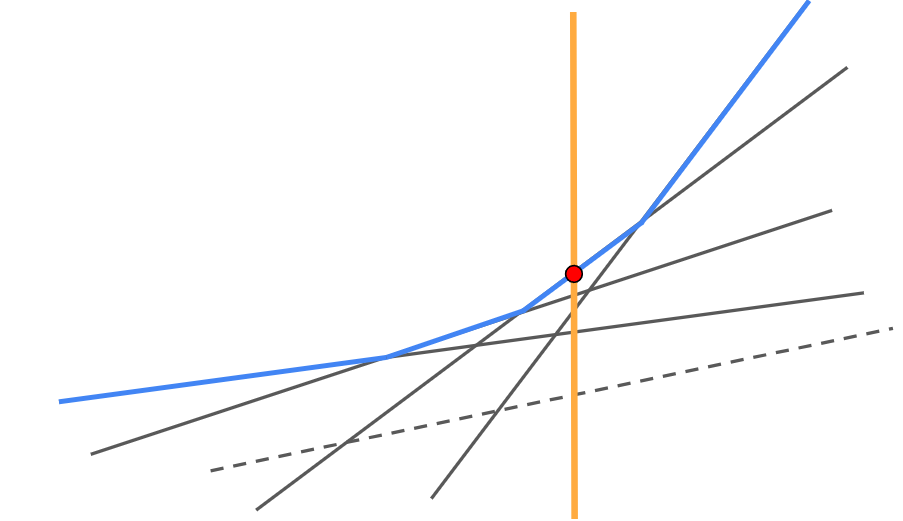
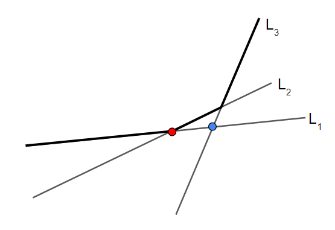
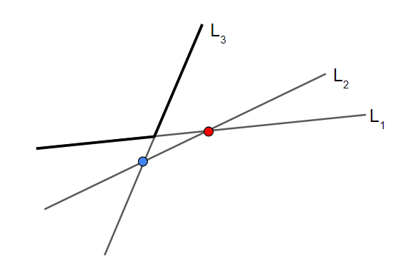

## 介紹

$$\large dp(i)=\max\limits_{0\le j < i} \{ a(j) \times f(i) + b(j) \}$$

轉移 $dp(i)$ 時想像成二維平面上有一堆直線 $y = a(j) \times x + b(j)$。要找到這些直線和 $x = f(i)$ 的所有交點中，$y$ 座標最大的數值。
	
<figure markdown>
  { width="400" }
</figure>

觀察這些直線可以發現，這些直線所形成的下凸包，會是轉移答案的位置。有些線段(虛線) 不在下凸包的上，可以從轉移名單上淘汰。

<figure markdown>
  { width="400" }
</figure>

維護這個凸包，就可以直接查詢在 $x = f(i)$，最大的值是多少。所以我們要解決的問題就是

1. 如何快速查詢凸包

2. 加入新直線後如何維護這個凸包

## 斜率與查詢單調

- 性質 1 : 函數 $a$ 單調遞增

- 性質 2 : 詢問的 $x = f(i)$ 會越來越大

### 加入新直線

$L_1$ 表示當前斜率次大的直線，$L_2$ 表示當前斜率次大的直線，$L_3$ 表示當前要加入的直線

<figure markdown>
  { width="500" }
  <figcaption>加入的直線沒有淘汰任何直線</figcaption>
</figure>

<figure markdown>
  { width="500" }
  <figcaption>加入的直線使得原本存在的直線被淘汰</figcaption>
</figure>

可以觀察到若 $L_2,L_3$ 的交點（紅色）在  $L_1,L_2$ 的交點（藍色）的左側，$L_2$ 將會被刪掉。實作上使用一個 deque 按照斜率小到大儲存在凸包上的直線，加入新直線時查看 deque 尾端直線是否會被淘汰。

<figure markdown>
  { width="500" }
</figure>

將式子列出來後，我們就可以寫出 check$(L_1,L_2,L_3)$ 的代碼 :

???+note "code"
	```cpp linenums="1"
    bool check(Line l1, Line l2, Line l3) {
		return (l2.b - l3.b) * (l1.a - l2.a) <= (l2.b - l1.b) * (l3.a - l2.a);
    }
    ```	

### 查詢 x = f(i)

我們從 deque 的 front 每次看最前面的兩條線，若發現代入斜率大（藍色）的會比代入斜率小（紅色）的還大代表要往右，否則左邊的就是答案

<figure markdown>
  { width="600" }
</figure>

因為詢問的位置 $x$ 只會越來越大，因此被淘汰的直線必不會是後面的詢問的答案，所以我們可以 pop_front 直到屬於找到當前代入 $x=f(i)$ 最大的那條線

### 總結

維護一個 `deque<pair<int, int>>` 代表直線 $a(j)$ 和 $b(j)$。先找 $x=f(i)$ 的答案 $dp(i)$，所以我們一直去判斷最前面的值是否為最大值 （和第二個比較），若不是則持續 pop_front。然後即可求出當前新直線的 $a(j),b(j)$。然後我們就要加入這條新直線，用  check$(L_1,L_2,L_3)$ 一直去判斷尾端直線是否要被 pop_back。架構等價於單調隊列，轉移總複雜度均攤為 $O(n)$。實作見下面 CSES Monster Game I 的 code。

### 題目

???+note "[CSES - Monster Game I](https://cses.fi/problemset/task/2084)"
	給 $n$ 個怪獸，你必須打敗第 $n$ 隻怪獸才能贏。打敗第 $i$ 隻怪獸會花 $s_i\times f_j$ 的時間，其中 $j$ 為你上次打敗的怪獸的編號，如果沒有上一隻，則 $f_j=x$。最少花多少時間可以贏
	
	$n\le 2\times 10^5,1\le x\le 10^6,1 \le s_1 \le \dots \le s_n \le 10^6,x \ge f_1 \ge \dots \ge f_n \ge 1$
	
	??? note "思路"
		$$dp(i)=\min \limits_{0\le j < i} \{f_j\times s_i + dp(j) \}$$
		
		我們可以將式子改成 :
		
		$$dp(i)=\max \limits_{0\le j < i} \{(-f_j)\times s_i + dp(j) \}$$
		
		這樣就變成上面標準斜率優化的轉移式了，$a=-f_j,b=dp(j)$，最後的答案記得是 $-dp[n]$
		
	??? note "code"
		```cpp linenums="1"
		#include <bits/stdc++.h>
	    #define int long long
	    #define pii pair<int, int>
	    #define pb push_back
	    using namespace std;
	
	    int n;
	    int dp[200005], f[200005], s[200005];
	
	    struct Line {
	        int a, b;
	
	        int get_value(int x) {
	            return a * x + b;
	        }
	    };
	
	    bool check(Line l1, Line l2, Line l3) {
	        return (l2.b - l3.b) * (l1.a - l2.a) <= (l2.b - l1.b) * (l3.a - l2.a);
	    }
	
	    void solve() {
	        deque<Line> dq;
	        dq.pb({f[0], dp[0]});
	        for (int i = 1; i <= n; i++) {
	            // 刪掉過期的直線
	            while (dq.size() >= 2 && dq[0].get_value(s[i]) < dq[1].get_value(s[i])) {
	                dq.pop_front();
	            }
	
	            dp[i] = dq[0].get_value(s[i]);
	            Line l = {f[i], dp[i]};
	            // 加入新的直線, 並且檢查會不會把舊的直線給蓋住
	            while (dq.size() >= 2 && check(dq[dq.size() - 2], dq.back(), l)) {
	                dq.pop_back();
	            }
	            dq.push_back(l);
	        }
	    }
	
	    signed main() {
	        ios::sync_with_stdio(0);
	        cin.tie(0);
	        cin >> n >> f[0];
	        for (int i = 1; i <= n; i++)
	            cin >> s[i];
	        for (int i = 1; i <= n; i++)
	            cin >> f[i];
	        for (int i = 0; i <= n; i++)
	            f[i] = -f[i];
	        solve();
	        cout << -dp[n] << '\n';
	    }
		```	

???+note "[TOI 2022 二模 pD. rectangle](https://drive.google.com/file/d/12fLPeJdcvPC_QideD_Ux12SudCYz0t_V/view)"
	給你 $N$ 個矩形，第 $i$ 個個矩形有參數高 $H_i$、寬 $W_i$、亮度 $D_i$、成本參數 $C_i ,F_i$。  
	
	其中 $H$ 是單調遞增的，覆蓋 $[L ,R]$ 的矩形需要成本
	
	$$C_R \frac{\sum_{i = L}^{R}D_iW_i}{\sum_{i = L}^{R}W_i}\sum_{i = L}^{R}W_i + F_R$$  
	
	問最小覆蓋成本。  
	
	$1 \leq N \leq 2 \times 10^5, 1 \leq W_i, H_i \leq 10^6, -16 \leq D_i \leq 16 , -10^6 \leq C_i , F_i \leq 10^6$  

???+note "[吐鈔機 2](https://tioj.ck.tp.edu.tw/problems/1921)"
	有 $N$ 台機器，其中第 $i$ 台會在時間 $D_i$ 拍賣，價格為 $P_i$，此機器每天會生產 $G_i$ 元，且將這台機器轉賣可得 $R_i$ 元，一個時間只能擁有一台機器，你一開始有 $C_i$ 元，求在第 $D$ 天後你最多可以賺進多少錢

	$N\le 10^5,D\le 10^9$

### 變化 : 斜率會過期

若 $L_2,L_3$ 的交點在 $L_1,L_2$ 的交點的左側，且 $L_1$ 過期右界在 $L_2,L_3$ 的右側，$L_2$ 將會被刪掉

### 變化 : 缺少查詢單調

- 性質 1 : 函數 a 單調遞增

- ~~性質 2 : 詢問的 x = f(i) 會越來越大~~

二分搜 $x=f(i)$

??? note "code"
	```cpp linenums="1"
	struct Line {  // ax+b;
        int a;
        int b;

        int get_value(int x) const {
            return a * x + b;
        }
    };
    
    long double intersection_x(Line f, Line g) {
        // a1 x + b1 = a2 x + b2
        // x = (b2-b1) / (a1-a2)
        return 1.0 * (g.b - f.b) / (f.a - g.a);
    }
    
    struct LineContainer {
        vector<Line> lines;
    
        bool ok(Line f, Line g, Line h) {
            // 判斷 f, g 的交點是否在 f,h 的交點左邊
            return intersection_x(f, g) < intersection_x(g, h);
        }
    
        void insert(Line l) {
            // 假設 insert 的斜率遞增
            int m = lines.size();
            if (m >= 1 && lines[m - 1].a == l.a) {
                if (lines[m - 1].b >= l.b) return;
                lines.pop_back();
                m--;
            }
    
            while (m >= 2 && !ok(lines[m - 2], lines[m - 1], l)) {
                lines.pop_back();
                m--;
            }
            lines.push_back(l);
        }
        int get_max(int x) {
            // 找到第一條直線 lines[i]
            // lines[i] 和 lines[i+1] 的交點大於等於 x
            int m = lines.size();
            if (m == 1) {
                return lines[0].get_value(x);
            }
            int l = 0, r = m - 2;
            while (l != r) {
                int mid = (l + r) / 2;
                int p = intersection_x(lines[mid], lines[mid + 1]);
                if (p >= x) {
                    r = mid;
                } else {
                    l = mid + 1;
                }
            }
            return max(lines[r].get_value(x), lines[m - 1].get_value(x));
        }
    };
    ```

## 不具單調性

- ~~性質 1 : 函數 a 單調遞增~~

- ~~性質 2 : 詢問的 x = f(i) 會越來越大~~

### 動態凸包

#### 加入新直線

用一個 set 維護當前在凸包上的直線，按照斜率由小到大儲存，當要新增一條新的直線時，先直接放入 set 內，和位於該直線前後的直線用 check 判斷需不需要被 pop 掉。每條直線最多進去和出來 set 一次，每次花費 $O(\log n)$ 的時間維護，轉移總複雜度為 $O(n\log n)$。

#### 查詢 x = f(i)

直接二分搜 $x=f(i)$

??? note "code"
	```cpp linenums="1"
	struct Line {  // ax+b;
        int a;
        int b;

        int get_value(int x) const {
            return a * x + b;
        }
    };
    
    long double intersection_x(Line f, Line g) {
        // a1 x + b1 = a2 x + b2
        // x = (b2-b1) / (a1-a2)
        return 1.0 * (g.b - f.b) / (f.a - g.a);
    }
    
    struct LineContainer {
        vector<Line> lines;
    
        bool ok(Line f, Line g, Line h) {
            // 判斷 f, g 的交點是否在 f,h 的交點左邊
            return intersection_x(f, g) < intersection_x(g, h);
        }
    
        void insert(Line l) {
            // 假設 insert 的斜率遞增
            int m = lines.size();
            if (m >= 1 && lines[m - 1].a == l.a) {
                if (lines[m - 1].b >= l.b) return;
                lines.pop_back();
                m--;
            }
    
            while (m >= 2 && !ok(lines[m - 2], lines[m - 1], l)) {
                lines.pop_back();
                m--;
            }
            lines.push_back(l);
        }
        int get_max(int x) {
            // 找到第一條直線 lines[i]
            // lines[i] 和 lines[i+1] 的交點大於等於 x
            int m = lines.size();
            if (m == 1) {
                return lines[0].get_value(x);
            }
            int l = 0, r = m - 2;
            while (l != r) {
                int mid = (l + r) / 2;
                int p = intersection_x(lines[mid], lines[mid + 1]);
                if (p >= x) {
                    r = mid;
                } else {
                    l = mid + 1;
                }
            }
            return max(lines[r].get_value(x), lines[m - 1].get_value(x));
        }
    };
    ```

### 題目

???+note "[CSES - Monster Game II](https://cses.fi/problemset/task/2085)"
	給 $n$ 個怪獸，你必須打敗第 $n$ 隻怪獸才能贏。打敗第 $i$ 隻怪獸會花 $s_i\times f_j$ 的時間，其中 $j$ 為你上次打敗的怪獸的編號，如果沒有上一隻，則 $f_j=x$。最少花多少時間可以贏
	
	$n\le 2\times 10^5,1\le x\le 10^6,1\le s_i,f_i\le 10^6$

	??? note "code"
		```cpp linenums="1"
		#include <algorithm>
        #include <iostream>
        #include <vector>

        using namespace std;

        #define int long long

        struct Line {
            int a, b;
            int operator()(int x) const {
                return a * x + b;
            }
        };

        struct LineContainer {
            static constexpr int LIMIT = 1e6;
            static constexpr int SIZE = LIMIT * 4;
            static const int INF = 1e18;

            vector<int> lo = vector<int>(SIZE);
            vector<int> hi = vector<int>(SIZE);
            vector<Line> seg = vector<Line>(SIZE, {0, INF});

            void build(int i = 1, int l = 1, int r = LIMIT) {
                lo[i] = l;
                hi[i] = r;
                if (l == r) return;
                int mid = (l + r) / 2;
                build(2 * i, l, mid);
                build(2 * i + 1, mid + 1, r);
            }
            void insert(Line L, int i = 1) {
                int l = lo[i], r = hi[i];
                if (l == r) {
                    if (L(l) < seg[i](l)) seg[i] = L;
                    return;
                }

                int mid = (l + r) / 2;
                if (seg[i].a < L.a) swap(seg[i], L);
                if (seg[i](mid) > L(mid)) {
                    swap(seg[i], L);
                    insert(L, 2 * i);
                } else {
                    insert(L, 2 * i + 1);
                }
            }
            int query(int x, int i = 1) {
                int l = lo[i], r = hi[i];
                if (l == r) return seg[i](x);

                int mid = (l + r) / 2;
                if (x <= mid) {
                    return min(seg[i](x), query(x, 2 * i));
                } else {
                    return min(seg[i](x), query(x, 2 * i + 1));
                }
            }
        };

        int solve(int n, int x, const vector<int> &s, const vector<int> &f) {
            LineContainer ds;
            ds.build();
            ds.insert({x, 0});
            for (int i = 0; i < n - 1; i++) {
                int v = ds.query(s[i]);
                ds.insert({f[i], v});
            }
            return ds.query(s[n - 1]);
        }

        signed main() {
            cin.tie(0);
            cin.sync_with_stdio(0);

            int n, X;
            cin >> n >> X;

            vector<int> s(n), f(n);
            for (int i = 0; i < n; i++) cin >> s[i];
            for (int i = 0; i < n; i++) cin >> f[i];

            int ans = solve(n, X, s, f);
            cout << ans << '\n';
        }
        ```
