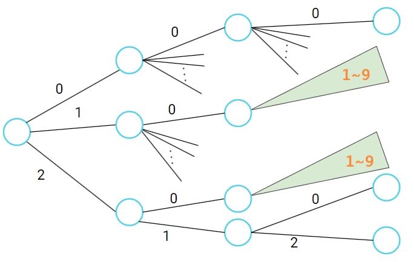

???+note "[CSES - Counting Numbers](https://cses.fi/problemset/task/2220)"
	求出 [a, b] 中相鄰兩位沒有相同 digit 的數字個數
	
	$0\le a \le b \le 10^{18}$
	
先觀察，答案其實就是 [0, b] 合法的數量減掉 [0, a - 1] 合法的數量，所以其實我們可以將問題簡化為算 [0, n] 合法的數量。

dfs 從高位「固定」到低位，若發現不合法就停下來，好處是可以記憶化。例如 n = 324，目前填到 `0 _ _` ，若之後要填到 `1 _ _` 的時候我們不必重新 dfs，因為 `1 _ _` 後面兩個空格其實跟 `0 _ _` 後面兩個空格能填的一模一樣。

為了更清楚的了解，下圖是 dfs 的樹狀圖，可以發現像是兩塊綠色所枚舉的狀態是一模一樣的

<figure markdown>
  { width="400" }
</figure>

??? note "code"
	```cpp linenums="1"
	int dfs(int d, int last, bool tight, bool zero) {
        // d: 目前所考慮的位數
        // last: 上一個跑完的數字
        // tight: 上一個是否在極限狀態
        // zero: 前面是否都是0
        if (d == -1) return 1;
        if (dp[d][last][tight][zero] != -1) return dp[d][last][tight][zero];
        int ans = 0;
        for (int i = 0; i < 10; i++) {
            if (i == last && zero == false) {
                // 跟上一位的數字一樣(不符合題目)
                // 如果說前面都是0的話那例外(減少位數)
                continue;
            }
            if (tight == true && i > digits[d]) {
                // 超過數字上界
                continue;
            }
            bool is_tight = tight && i == digits[d];
            bool is_zero = zero && i == 0;
            ans += dfs(d - 1, i, is_tight, is_zero);
        }
        return dp[d][last][tight][zero] = ans;
    }
    ```

複雜度就是狀態數量 * 轉移時間

## 習題

???+note "[Atcoder abc154 E - Almost Everywhere Zero](https://atcoder.jp/contests/abc154/tasks/abc154_e)"
	問 $[1, n]$ 內有幾個數字恰有 $k$ 個非 0 的位數
	
	$n\le 10^{100}, 1\le k\le 3$
	
	??? note "思路"
		只要記錄當前 dfs 到有幾個非 0 的位數即可
		
	??? note "code"
		```cpp linenums="1"
		#include <bits/stdc++.h>
        #define int long long
        using namespace std;

        const int INF = 0x3f3f3f3f;
        const int M = 1e9 + 7;
        vector<int> num;
        int n, k;
        int dp[101][5][2];

        int dfs(int pos, int cnt, bool tight) {
            if (cnt > k) return 0;
            if (dp[pos][cnt][tight]) return dp[pos][cnt][tight];
            if (pos == n) return (cnt == k);
            int up = (tight ? num[pos] : 9);
            int ans = 0;
            for (int i = 0; i <= up; i++) {
                ans += dfs(pos + 1, cnt + (i != 0), tight && (i == num[pos]));
            } 
            return dp[pos][cnt][tight] = ans;
        }

        signed main() {
            string s;
            cin >> s;
            cin >> k;
            for (int i = 0; i < s.size(); i++) {
                num.push_back(s[i] - '0');
            }
            n = s.size();
            cout << dfs(0, 0, 1);
        }
        ```
        
???+note "[Atcoder DP Contest - Digit Sum ](https://atcoder.jp/contests/dp/tasks/dp_s)"
	問 $[1, n]$ 內有多少個數字每一位相加恰好是 $d$ 的倍數
	
	$1\le n\le 10^{10000}, 1\le d\le 100$
	
	??? note "思路"
		維護目前前綴總和 mod d 的結果
		
	??? note "code"
		```cpp linenums="1"
		#include <bits/stdc++.h>
        #define int long long
        using namespace std;

        const int INF = 1e18;
        const int MOD = 1e9 + 7;
        const int N = 1e4 + 5;
        int m;
        vector<int> num;
        int dp[N][105][2];

        int dfs(int pos, int val, bool tight) {
            if (pos == num.size()) return (val == 0);
            if (dp[pos][val][tight] != -1) return dp[pos][val][tight];
            int up = (tight ? num[pos] : 9);
            int ans = 0;
            for (int i = 0; i <= up; i++) {
                ans += dfs(pos + 1, (val + i) % m, (i == up && tight));
                if (ans >= MOD) ans %= MOD;
            }
            return dp[pos][val][tight] = ans;
        }

        signed main() {
            string s;
            cin >> s;
            cin >> m;
            for (int i = 0; i < s.size(); i++) num.push_back(s[i] - '0');
            memset(dp, -1, sizeof(dp));
            cout << (dfs(0, 0, true) - 1 + MOD) % MOD;
        }
		```