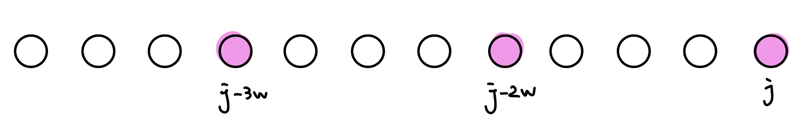

## 01 背包

???+note "[Atcoder DP Contest - Knapsack 1](https://atcoder.jp/contests/dp/tasks/dp_d)"
	給 $n$ 種物品的重量 $w_i$ 與價值 $v_i$，背包容量上限是 $W$。每種物品只有一個。選擇一些物品，使得重量總和不超過容量，請問最大價值總和為何 ?
	
	$n\le 100, 1\le w_i \le W\le 10^5, 1\le v_i \le 10^9$

$dp(i, j)$ 表示前 $i$ 個物品中，重量總和為 $j$ 的最大價值。轉移的話考慮拿不拿第 $i$ 種物品

$$
dp(i, j) = \max \{dp(i - 1, j - w_i) + v_i, dp(i-1, j) \}
$$

初始狀態則將 $dp(0, 0) = 0, dp(0, j) = -\infty$。最後，答案就是 $\max\{ dp(n, 0), dp(n, 1), \ldots , dp(n, W) \}$

??? note "code"
	```cpp linenums="1"
	#include <bits/stdc++.h>

    using namespace std;
    
    const int MAXN = 105;
    const int MAXW = 1e5 + 5;
    const int INF = 1e9;
    int v[MAXN], w[MAXN];
    int dp[MAXN][MAXW];
    
    int main() {
        int n, W;
        cin >> n >> W;
        for (int i = 1; i <= n; i++) {
            cin >> v[i] >> w[i];
        }
        dp[0][0] = 0;
        for (int j = 1; j <= W; j++) {
            dp[0][j] = -INF;
        }
        for (int i = 1; i <= n; i++) {
            for (int j = 0; j <= W; j++) {
                dp[i][j] = dp[i - 1][j];
                if (j >= w[i]) {
                    dp[i][j] = max(dp[i][j], dp[i - 1][j - w[i]] + v[i]);
                }
            }
        }
        int ans = 0;
        for (int j = 0; j <= W; j++) {
            ans = max(ans, dp[n][j]);
        }
        cout << ans << endl;
    }
    ```

注意到 $dp(i, j)$ 只會從 $dp(i-1, *)$ 轉移，所以我們可以使用滾動陣列，紀錄 $dp(j)$ 即可。在轉移的時候要從大枚舉到小，這樣在轉移的時候才不會轉移到新的狀態

??? note "code(滾動陣列)"
	```cpp linenums="1"
	#include <bits/stdc++.h>

    using namespace std;
    
    const int MAXN = 105;
    const int MAXW = 1e5 + 5;
    const int INF = 1e9;
    int v[MAXN], w[MAXN];
    
    int main() {
        int n, W;
        cin >> n >> W;
        for (int i = 1; i <= n; i++) {
            cin >> w[i] >> v[i];
        }
        vector<int> dp(W + 1, -INF);
        dp[0] = 0;
        for (int i = 1; i <= n; i++) {
            for (int j = W; j >= w[i]; j--) {
                dp[j] = max(dp[j], dp[j - w[i]] + v[i]);
            }
        }
        int ans = 0;
        for (int j = 0; j <= W; j++) {
            ans = max(ans, dp[j]);
        }
        cout << ans << endl;
    }
    ```

### 方法數

??? note "code"
	```cpp linenums="1"
	vector<int> cnt(W + 1);
    vector<int> dp(W + 1, -INF);
    dp[0] = 0;
    cnt[0] = 1;
    for (int i = 1; i <= n; i++) {
        for (int j = W; j >= w[i]; j--) {
            if (dp[j] == dp[j - w[i]] + v[i]) {
                cnt[j] += cnt[j - w[i]];
                cnt[j] %= M;
            } else if (dp[j - w[i]] + v[i] > dp[j]) {
                dp[j] = dp[j - w[i]] + v[i];
                cnt[j] = cnt[j - w[i]];
                cnt[j] %= M;
            }
        }
    }
    ```

???+note "算方法數 [CSES - Two Sets II](https://cses.fi/problemset/task/1093/)"
	給 $n$，問將 $\{1, 2, \ldots ,n \}$ 分成兩個總和相同的集合，有幾種分法
	
	$n\le 500$
	
	??? note "code"
		```cpp linenums="1"
		#include <bits/stdc++.h>
	    #define int long long
	    using namespace std;
	
	    const int INF = 0x3f3f3f3f;
	    const int M = 1e9 + 7;
	
	    signed main() {
	        int n;
	        cin >> n;
	        vector<int> w(n + 1);
	        vector<int> v(n + 1);
	        int W = 0;
	        for (int i = 1; i <= n; i++) {
	            W += i;
	            w[i] = i;
	            v[i] = i;
	        }
	        if (W & 1) {
	            cout << 0;
	            exit(0);
	        }
	        W /= 2;
	        vector<int> cnt(W + 1);
	        vector<int> dp(W + 1, -INF);
	        dp[0] = 0;
	        cnt[0] = 1;
	        for (int i = 1; i <= n; i++) {
	            for (int j = W; j >= w[i]; j--) {
	                if (dp[j] == dp[j - w[i]] + v[i]) {
	                    cnt[j] += cnt[j - w[i]];
	                    cnt[j] %= M;
	                } else if (dp[j - w[i]] + v[i] > dp[j]) {
	                    dp[j] = dp[j - w[i]] + v[i];
	                    cnt[j] = cnt[j - w[i]];
	                    cnt[j] %= M;
	                }
	            }
	        }
	        int mx = -INF;
	        cnt[W] *= 500000004;
	        cnt[W] %= M;
	        cout << cnt[W];
	    }
	    ```

### 字典序

???+note "字典序"
	給 $n$ 種物品的重量 $w_i$ 與價值 $v_i$，背包容量上限是 $W$。每種物品只有一個。選擇一些物品，使得重量總和不超過容量，請問最大價值總和為何，輸出編號字典序最小的解
	
	$n\le 100, 1\le w_i \le W\le 10^5, 1\le v_i \le 10^9$
	
	??? note "思路"
		因為字典序需要從頭開始考慮反過來建 dp 表格就好
		
	??? note "code"
		```cpp linenums="1"
		#include <bits/stdc++.h>
	    #define int long long
	    using namespace std;
	
	    const int INF = 0x3f3f3f3f;
	    const int MAXN = 1e3 + 5;
	
	    int dp[MAXN][MAXN];
	    int w[MAXN], v[MAXN];
	    int n, W;
	
	    signed main() {
	        cin >> n >> W;
	        for (int i = 1; i <= n; i++) {
	            cin >> w[i] >> v[i];
	        }
	        memset(dp, -INF, sizeof dp);
	        dp[n + 1][0] = 0;
	        int total_w, mx = 0;
	        for (int i = n; i > 0; i--) {
	            for (int j = 0; j <= W; j++) {
	                if (w[i] > j) {
	                    dp[i][j] = dp[i + 1][j];
	                } else {
	                    dp[i][j] = max(dp[i + 1][j], dp[i + 1][j - w[i]] + v[i]);
	                }
	                if (mx < dp[i][j]) {
	                    mx = dp[i][j];
	                    total_w = j;
	                }
	            }
	        }
	
	        cout << dp[1][total_w] << "\n";
	        for (int i = 1; i <= n; ++i) {
	            if (total_w >= w[i] && dp[i][total_w] == dp[i + 1][total_w - w[i]] + v[i]) {
	                cout << i << ' ';
	                total_w -= w[i];
	            }
	        }
	    }
		```

### 習題

???+note "超大背包 [Atcoder DP Contest - Knapsack 2](https://atcoder.jp/contests/dp/tasks/dp_e)"
	給 $n$ 種物品的重量 $w_i$ 與價值 $v_i$，背包容量上限是 $W$。每種物品只有一個。選擇一些物品，使得重量總和不超過容量，請問最大價值總和為何 ?
	
	$n\le 100, 1\le w_i \le W\le 10^9, 1\le v_i \le 10^3$
	
	??? note "思路"
		dp(i, j) = 取到價值 j 的最小重量
		
		dp(i, j) = min{dp(i - 1, j), dp(i - 1, j - v_i) + w_i}
		
		最後答案就是 min{dp(n, 0), dp(n, 1), ... , dp(n, W)}
		
	??? note "code"
		```cpp linenums="1"
		#include <bits/stdc++.h>
	    #define int long long
	    using namespace std;
	
	    const int MAXN = 1e2 + 5;
	    const int MAXV = 2e5;
	    const int INF = (1LL << 60);
	    int n, m;
	    int w[MAXN], v[MAXN];
	
	    signed main() {
	        cin >> n >> m;
	        for (int i = 1; i <= n; i++) {
	            cin >> w[i] >> v[i];
	        }
	        vector<int> dp(MAXV + 1, INF);
	        dp[0] = 0;
	        for (int i = 1; i <= n; i++) {
	            for (int j = MAXV; j >= v[i]; j--) {
	                dp[j] = min(dp[j], dp[j - v[i]] + w[i]);
	            }
	        }
	        for (int j = MAXV; j >= 0; j--) {
	            if (dp[j] <= m) {
	                cout << j << '\n';
	                exit(0);
	            }
	        }
	    }
	    ```

???+note "變化: n = 40"
	給 $n$ 種物品的重量 $w_i$ 與價值 $v_i$，背包容量上限是 $W$。每種物品只有一個。選擇一些物品，使得重量總和不超過容量，請問最大價值總和為何 ?
	
	$n\le 40, 1\le w_i \le W\le 10^9, 1\le v_i \le 10^9$
	
	??? note "思路"
		使用折半枚舉，枚舉第一個集合內的元素，用二分搜或雙指針看第二個集合內合法的元素
		
	??? note "code"
		```cpp linenums="1"
		#include <algorithm>
	    #include <iostream>
	    #include <utility>
	    #include <vector>
	
	    using namespace std;
	
	    using pii = pair<int, int>;  // (重量, 價值)
	
	    // A 的長度是 2^|a|，存放 a 所有子集合總和
	    vector<pii> allSubsetSum(vector<pii> a) {
	        int n = a.size();
	        vector<pii> A = {{0, 0}};
	        for (int i = 0; i < n; i++) {
	            for (int j = A.size() - 1; j >= 0; j--) {
	                A.push_back({A[j].first + a[i].first, A[j].second + a[i].second});
	            }
	        }
	
	        sort(A.begin(), A.end());
	        for (int i = 1; i < A.size(); i++) {
	            A[i].second = max(A[i].second, A[i - 1].second);
	            //他如果放得下那也一定有辦法改成能比他重量小的價值
	        }
	        return A;
	    }
	
	    int main() {
	        cin.tie(0);
	        cin.sync_with_stdio(0);
	
	        int n, W;
	        vector<pii> a, b;
	
	        cin >> n >> W;
	        for (int i = 0; i < n; i++) {
	            int w, v;
	            cin >> w >> v;
	            if (i < n / 2) {
	                a.push_back({w, v});
	            } else {
	                b.push_back({w, v});
	            }
	        }
	
	        int ans = 0;  // w 總和小於等於 W 的最大 v 總和
	        vector<pii> A = allSubsetSum(a);
	        vector<pii> B = allSubsetSum(b);
	        for (pii x : B) {
	            auto it = upper_bound(A.begin(), A.end(), pii{W - x.first, INT_MAX});
	            if (it != A.begin()) {
	                it = prev(it);
	                ans = max(ans, x.second + it->second);
	            }
	        }
	        cout << ans << '\n';
	
	        return 0;
	    }
	    ```

???+note "第 k 大"
	給 $n$ 種物品的重量 $w_i$ 與價值 $v_i$，背包容量上限是 $W$。每種物品只有一個。選擇一些物品，問能湊出第 $k$ 大的價值為何
	
	$n\le 40, 1\le w_i \le W\le 10^9, 1\le v_i \le 10^3$
	
	??? note "思路"
		一樣利用折半枚舉，用二分搜最大的 t，使價值 >= t 的恰有 k 個。至於要怎麼計算價值 >= t 有幾個呢 ? 枚舉第一個集合內的元素 (w1[i], v1[i])，用雙指針的方式找到在第二個元素合法的部分，利用 DS 詢問價值 >= t - v1[i] 有幾個，可以用 BIT 做到
		
	??? note "code"
		```cpp linenums="1"
		#include <bits/stdc++.h>
	    using namespace std;
	
	    vector<long long> d;
	    long long bit[1 << 21];
	
	    vector<pair<long long, long long>> gen_subset(vector<pair<int, int>> v) {
	        vector<pair<long long, long long>> ret;
	        for (int i = 0; i < (1 << v.size()); i++) {
	            long long sum_w = 0, sum_v = 0;
	            for (int j = 0; j < v.size(); j++) {
	                if (i & (1 << j)) {
	                    sum_w += v[j].first;
	                    sum_v += v[j].second;
	                }
	            }
	            ret.push_back({sum_w, sum_v});
	        }
	        return ret;
	    }
	
	    int bit_query(int x) {
	        int ret = 0;
	        while (x) {
	            ret += bit[x];
	            x -= x & (-x);
	        }
	        return ret;
	    }
	
	    void bit_update(int x) {
	        while (x <= d.size()) {
	            bit[x]++;
	            x += x & (-x);
	        }
	    }
	
	    int main() {
	        int n;
	        long long k, lim;
	        cin >> n >> k >> lim;
	        vector<pair<int, int>> p1, p2;
	        for (int i = 0; i < n / 2; i++) {
	            long long a, b;
	            cin >> a >> b;  // weight, value
	            p1.push_back({a, b});
	        }
	        for (int i = n / 2; i < n; i++) {
	            long long a, b;
	            cin >> a >> b;
	            p2.push_back({a, b});
	        }
	        vector<pair<long long, long long>> v1, v2;
	        v1 = gen_subset(p1);
	        v2 = gen_subset(p2);
	        sort(v1.begin(), v1.end()); 
	        sort(v2.rbegin(), v2.rend()); 
	        for (auto &i : v1) {
	            d.push_back(i.second);
	        }
	        sort(d.begin(), d.end());
	        d.erase(unique(d.begin(), d.end()), d.end());
	        long long l = 0, r = 1e12;
	        while (r - l > 1) {
	            long long mid = (l + r) / 2;
	            int ptr = 0;
	            long long cnt = 0;
	            memset(bit, 0, sizeof(bit));
	            for (auto &i : v2) {
	                while (ptr < v1.size() && v1[ptr].first + i.first <= lim) {
	                    int idx = lower_bound(d.begin(), d.end(), v1[ptr].second) - d.begin() + 1;
	                    bit_update(idx);
	                    ptr++;
	                }
	                int idx = lower_bound(d.begin(), d.end(), mid - i.second) - d.begin() + 1;
	                cnt += ptr - bit_query(idx - 1);  
	            }
	            if (cnt < k) {  // 價值 >= x 的方法數
	                r = mid;
	            } else {
	                l = mid;
	            }
	        }
	        cout << l << endl;
	    }
	
	    /*
	    Input
	    4 3 3
	    1 2
	    1 3
	    1 7
	    1 12
	    Output
	    19
	    */
	    ```

???+ note "[Zerojudge c835. 背包問題](https://zerojudge.tw/ShowProblem?problemid=c835)"
	給你 $n$ 個物品，背包重量限制為 $2^W$，每個物品的重量是 $2^{w_i}$，價值是 $v_i$，求能放到背包內的最大價值和
	
	??? note "思路"
		採用 Greedy，我們可以從小的次方做到大的次方，對於每一位，我們開一個 Max Heap 來記錄當前物品的價值，然後我們要想辦法從小的變化到大的，注意到 $2^{n-1}+2^{n-1} \le 2^n$，我們可以讓 Max Heap 內價值最高的兩個合併成一個東西，放到更高一位的 Heap 內，若最後還剩下一個，則單獨放到 Heap 內。最後答案就是第 $W$ 位 Max Heap 價值最高的東西
	
	??? note "code"
	    ```cpp linenums="1"
	    void solve() {
	    	cin >> n >> m;
	        for (int i = 0; i < n; ++i) {
	            int w, v;
	            cin >> w >> v;
	            if (w <= m) {
	            	pq[w].push(v);
	            }
	        }
	        for (int i = 0; i < m; ++i) {
	            while(!pq[i].empty()) {
	                if(pq[i].size() == 1) {
	                    pq[i + 1].push(pq[i].top());
	                    break;
	                }
	                ll a = pq[i].top();
	                pq[i].pop();
	                ll b = pq[i].top();
	                pq[i].pop();
	                pq[i + 1].push(a + b);
	            }
	        }
	        cout << pq[m].top() << "\n";
	    }
	    ```

???+note "[TOI 2008 p3. 加減問題](https://tioj.ck.tp.edu.tw/contests/70/problems/1508)"
	有 $n$ 個正整數 $a_1, \ldots ,a_n$，對於每個數賦予 $\texttt{+}$ 或 $\texttt{-}$ 使得他們總合為 $0$，問是否做得到
	
	有 $t$ 筆輸入，$t\le 10, n\le 100, 1\le a_i\le 1000$
	
	??? note "思路"
		令 $\sum a_i = s$，就只是問能不能選出 $s/2$ 

???+note "分組背包 "
	給定 $n$ 個物品，背包容量 $W$，第 $i$ 個物品重量 $w_i$ ，價值 $v_i$，組別是 $k_i$。選擇一些物品，每組最多選 $1$ 個，共有 $k$ 組，使得重量總和不超過容量，請問最大價值總和為何 ?
	
	$n, k\le 100, w\le 10^5$
	
	??? note "思路"
		令 dp(i, j) = 前 i **組**重量是 j 可以選到的最大價值總和
		
		轉移的話就枚舉第 i 組裡面的物品，假設目前枚舉到 u
		
		dp(i, j) = max{dp(i - 1, j), dp(i - 1, j - w[u]) + v[u]}
		
		因為 $\sum \limits_{i=1}^k a_i=n$，所以複雜度為 O(nW)
		
	??? note "code"
		```cpp linenums="1"
		for (int i = 1; i <= k; i++) {
	        for (int j = W; j >= 0; j--) {
	            for (auto u : a[i]) {
	                if (j - w[u] >= 0) {
	                    dp[i][j] = max(dp[i - 1][j], dp[i - 1][j - w[u]] + v[u]);
	                }
	            }
	        }
	    }
		```

## 無限背包

???+note "[洛谷 P1616 疯狂的采药](https://www.luogu.com.cn/problem/P1616)"
	給 $n$ 種物品的重量 $w_i$ 與價值 $v_i$，背包容量上限是 $W$。每種物品只有一個。選擇一些物品，使得重量總和不超過容量，請問最大價值總和為何 ?
	
	$n\le 10^4, 1\le n\times W\le 10^7, 1\le w_i, v_i \le 10^4$

跟 01 背包差不多，但要注意在轉移的時候，對於 $dp(i, j)$ 取完物品 $i$ 後狀態依然會停留在 $dp(i,j-w_i)$ 而非 $dp(i-1,j-w_i)$

$$
dp(i, j) = \max \{dp(i, j - w_i) + v_i, dp(i-1, j) \}
$$

最後，答案就是 $\max\{ dp(n, 0), dp(n, 1), \ldots , dp(n, W) \}$。

實作上也可以使用滾動陣列，但需要從前往後轉移，因為後面的 dp(i, j) 會用到前面新的狀態。複雜度 $O(nW)$

??? note "code"
	```cpp linenums="1"
	#include <bits/stdc++.h>
    #define int long long
    using namespace std;

    const int MAXN = 1e4 + 5;
    const int INF = 1e9;
    int n, m;
    int w[MAXN], v[MAXN];
    
    signed main() {
        cin >> m >> n;
        for (int i = 1; i <= n; i++) {
            cin >> w[i] >> v[i];
        }
        vector<int> dp(m + 1, -INF);
        dp[0] = 0;
        for (int i = 1; i <= n; i++) {
            for (int j = w[i]; j <= m; j++) {
                dp[j] = max(dp[j], dp[j - w[i]] + v[i]);
            }
        }
        cout << *max_element(dp.begin(), dp.end()) << '\n';
    }
    ```

## 有限背包

???+note "[CSES - Book Shop II](https://cses.fi/problemset/task/1159/)"
	給 $n$ 種物品的重量 $w_i$，價值 $v_i$，數量 $c_i$，背包容量上限是 $W$。選擇一些物品，使得重量總和不超過容量，請問最大價值總和為何 ?
	
	$n\le 100, 1\le W \le 10^5, 1\le w_i,v_i,c_i \le 1000$

每個物品的 $c_i$ 個都當成一個物品，套用 01 背包。複雜度 $O(nW\max \{ c_i \})$

### 二進制拆解優化

把 c 個一樣的物品拆成 log c 個不同的物品，執行 0/1 背包。例如有一種東西有 13 個，13 = 1 + 2 + 4 + 6，我們就按照 1 個、2 個、4 個、6 個把東西打包，變成 01 背包，這樣我們就可以組出在 [1, 13] 內任意的數字了。複雜度 $O(nW\log  c_i)$

??? info "正確性證明"
	我們都知道，若我們有 $2^0, 2^1, 2^2, \ldots ,2^n$ 幾個數字，那我們可以表示 $[1, 2^{(n + 1)} - 1]$ 內的所有數字。相似的，若我們想要湊出一個 $c$ 以內所有的數字，我們可以將 $c$ 拆解為 $k$ 與 $2^{n+1} - 1$ 兩個部分，並使 $n$ 盡量大，接著 $2^{n+1} - 1$ 便可以拆解為 $2^0, 2^1, 2^2, \ldots ,2^n$。如此一來我們就可以湊出 $[1, 2^{(n + 1)} - 1]$ 的所有數字以及 $[1+k, 2^{(n + 1)}-1+k]$ 的所有數字，聯集起來，就是可以表示 $[1, c]$ 的所有數字。例如 $c=10$，$10=(1+2+4)+3$，代表我們可以湊出 $[1, 7] \cup [3, 10]$ 的所有數字。若需背包一種數量有 $c$ 個的物品，就可以依照上法將之拆為 $\log(c) + 1$ 團，我們只需要將每團各自視為一個新的物體拿去背包即可。
	
	> 相關議題: [砝碼問題](https://blog.csdn.net/songchuwang1868/article/details/86535150)

??? note "code"
	```cpp linenums="1"
	#include <bits/stdc++.h>
    #define int long long
    using namespace std;

    const int MAXN = 1e2 + 5;
    const int MAXW = 1e5 + 5;
    const int INF = 1e9;
    int n, m;
    int w[MAXN], v[MAXN], c[MAXN];
    
    int solve(vector<pair<int, int>> items) {
        vector<int> dp(m + 1, -INF);
        dp[0] = 0;
        for (auto [w, v] : items) {
            for (int j = m; j >= w; j--) {
                dp[j] = max(dp[j], dp[j - w] + v);
            }
        }
        return *max_element(dp.begin(), dp.end());
    }
    
    signed main() {
        cin >> n >> m;
        for (int i = 1; i <= n; i++) {
            cin >> w[i];
        }
        for (int i = 1; i <= n; i++) {
            cin >> v[i];
        }
        for (int i = 1; i <= n; i++) {
            cin >> c[i];
        }
    
        vector<pair<int, int>> vec;
        for (int i = 1; i <= n; i++) {
            int k = 1;
            while (k <= c[i]) {
                vec.push_back({w[i] * k, v[i] * k});
                c[i] -= k;
                k *= 2;
            }
            if (c[i] > 0) {
                vec.push_back({w[i] * c[i], v[i] * c[i]});
            }
        }
    
        cout << solve(vec) << '\n';
    }
    ```

### 單調對列優化

我們先列出轉移式

$$
dp(i,j)=\max \begin{cases} dp(i-1, j) \\ dp(i-1, j- w) + v \\ dp(i-1, j-2w) + v \\ \vdots \\ dp(i-1,j-kw)+kv\end{cases}
$$

可以發現，對於 dp(i, j)，他能轉移的點可能是 j - 2w, j - w, j，對於 dp(i, j - w)，他能轉移的點可能是 j - 3w, j - 2w, j - w，注意到這個區間的左界、右界會隨著 j 的增長持續遞增，可以使用類似用單調隊列維護 Sliding Window 的技巧來解決

<figure markdown>
  { width="400" }
</figure>

所以對於 dp(i, *) 中 j % w 相同的狀態，我們都用一個單調隊列來維護答案[^1]

<figure markdown>
  { width="400" }
</figure>

複雜度每個狀態都只會進, 出單調隊列各一次，所以複雜度是 O(nW)

??? note "code"
	```cpp linenums="1"
	#include <bits/stdc++.h>
    #define int long long
    #define ALL(x) x.begin(),x.end()
    using namespace std;

    const int MAXN = 1e2 + 5;
    const int MAXW = 1e5 + 5;
    int n, m;
    int w[MAXN], v[MAXN], c[MAXN];
    int g[MAXW], dp[MAXW];
    
    signed main() {
        cin >> n >> m;
        for (int i = 1; i <= n; i++) {
            cin >> w[i];
        }
        for (int i = 1; i <= n; i++) {
            cin >> v[i];
        }
        for (int i = 1; i <= n; i++) {
            cin >> c[i];
        }
        for (int i = 1; i <= n; i++) {
            memcpy(g, dp, sizeof(g));
            for (int r = 0; r < w[i]; r++) {
                deque<int> dq;
                for (int j = r; j <= m; j += w[i]) {
                    while (!dq.empty() && g[dq.back()] + ((j - dq.back()) / w[i]) * v[i] <= g[j]) {
                        dq.pop_back();
                    }
                    dq.push_back(j);
                    dp[j] = g[dq.front()] + ((j - dq.front()) / w[i]) * v[i];
                    if (dq.front() == j - c[i] * w[i]) {
                        dq.pop_front();
                    }
                }
            }
        }
        cout << dp[m] << '\n';
    }
    ```

## 其他

### 分數背包

??? info "貪心法錯誤"
	$n=3,W=6$

    - $v_1=4,w_1=5$
    
    - $v_2=3,w_2=3$
    
    - $v_3=3,w_3=3$
    
    按照 Greedy，就只能放入第 1 個物品，總價值為 $5$，但是最優解，應該放入第 2, 3 個物品，總價值為 $6$
    
    之所以貪心法會失效，原因在於背包的體積，優先選 CP 值高的物品，可能會導致一些空間被浪費，以前面的例子來說，就是浪費 2 單位的空間
    
    反過來說，下面的題目「2021 全國賽 pA. 礦砂採集」就可以使用貪心法:
    
    物品可以切割，換句話說就是可以取 0.5 個、0.7 個物品，這樣一來，就沒有浪費空間的問題，而可以使用攤新法了
    
    $n=3,W=6$
    
    - $v_1=4,w_1=5$
    
    - $v_2=3,w_2=3$
    
    - $v_3=3,w_3=3$
    
    取 1 個第一件物品，2/3 個第二件物品，總價值為 7

???+note "[2021 全國賽 pA. 礦砂採集](https://tioj.ck.tp.edu.tw/problems/2223)"
	給 $n$ 種物品的重量 $w_i$ 與價值 $v_i$，背包容量上限是 $W$。每種物品只有一個，**物品可以切割**，選擇一些物品，使得重量總和不超過容量，請問最大價值總和為何 ?
	
	$n\le 1000, 1\le W\le 10^5, 1\le w_i\le 100, 1\le v_i \le 1000$
	
	??? note "思路"
		這個題目在 wiki 上叫[連續背包問題](https://en.wikipedia.org/wiki/Continuous_knapsack_problem)
	
		【結論】: 只要不斷 Greedy 地將單位重量價值最大的物品放進背包，直到背包已滿或所有物品均已被放入，就能最大化總價值。
	
		一個簡單的做法是將所有物品依照單位重量價值由大到小排序，依序放入背包直到滿即可。複雜度是 $O(n \log n)$。
		
		---
		
	    > 線性做法
	
	    以下為了方便說明，假定所有的 $x_i$ 均相異，其中 $x_i=v_i/w_i$。
	
	    1. 隨機選擇一個礦砂 $i$，並將所有的物品分為單位價值 $\ge x_i$ 與 $< x_i$ 兩堆。
	    2. 分歧判斷：
	       - 若單位價值 $\ge x_i$ 的物品可以塞滿背包，則將 $< x_i$ 的礦砂全刪除，並往大的 $x$ 找答案。
	       - 反之則將價值 $\ge x_i$ 的礦砂全刪除，往小的 $x$ 找答案。
	    3. 搜尋完後得到的值代表「總價值最大時，背包中單位重量價值最小的物品」，再用這個價值去反求答案。
	
	    實作上可以使用 nth_element 做到，演算法與 [quickselect](https://en.wikipedia.org/wiki/Quickselect) 和 <a href="/wiki/graph/mst/#3" target="_blank">這個技巧</a> 非常相似，期望時間複雜度為 $O(n)$。

### bitset 

## 補充: 退背包

???+note "帶刪除背包 - 問方法數"
	給一些物品，第 i 個物品的重量為 w[i]，分別輸出若刪除第 i 個物品，能湊到重量為 m 的**方案數**是多少
	
退背包就是從選購物品中刪除其中一個物品，問滿足所取能湊到重量為 j 的**方案數**。像一般背包一樣，退背包先普通 dp 以下，然後退去所選物品。設 f(i, j) 為只用前 i 件物品，不考慮刪除任何物品時，恰好裝滿容量為 j 的方法數，設 g(i, j) 為不考慮物品 i，恰好裝滿容量為 j 的方法數。f(i, j) 就用普通的 01 背包轉移即可，而 g(i, j) 在轉移時就要從 f(i, j) 扣掉「有選 i 個方法數」，如下:

<center>
g(i, j) = f(i, j) - g(i, j - w[i])
</center>

???+note "[CF 1442 D. sum](https://codeforces.com/contest/1442/problem/D)"
	給定 $n$ 個單調不降的序列，可以從這些序列的最左端依次往右取，問取 $k$ 個數的最大值
	
	$n,k\le 3000, 0\le a_{i,j}\le 10^8, \sum |a_i| \le 10^6$
	
	??? note "思路"
		有一個序列的取部分元素，其他序列要馬全取，要馬全不取。因為若部分取兩個序列，一定可以專注取其中一個一定會更好。所以問題就轉換成 01 背包了，我們可以去枚舉哪個序列要取一部分，剩下做 01 背包（枚舉 i 代表從這個序列取 i 個，其他序列就是取 k - i 個，可以從 01 背包的 dp(k - i) 查表）。我們想辦法優化這個過程，考慮分治，當遞迴到每個 leaf 就是不包含該項的 01 背包，複雜度 $O(nk \log n)$。 
		
	??? note "code"
		```cpp linenums="1"
		#include <bits/stdc++.h>
        #define int long long
        #define pii pair<int, int>
        #define mk make_pair
        #define pb push_back
        using namespace std;

        const int MAXN = 3e3 + 5;
        const long long mod = 1e9 + 7;
        int n, k, ans;
        int a[MAXN][MAXN];
        int t[MAXN];
        int tot[MAXN];
        int dp[MAXN];

        void solve(int l, int r) {
            if (l > r) return;
            if (l == r) {
                int cur = 0;
                for (int i = 0; i <= t[l]; i++) {
                    cur += a[l][i];
                    ans = max(dp[k - i] + cur, ans);
                }
                return;
            }
            int mid = (l + r) >> 1;
            vector<int> tmp(k + 1);
            for (int i = 1; i <= k; i++) {
                tmp[i] = dp[i];
            }
            for (int i = mid + 1; i <= r; i++) {
                for (int j = k; j >= t[i]; j--) {
                    dp[j] = max(dp[j], dp[j - t[i]] + tot[i]);
                }
            }
            solve(l, mid);
            for (int i = 1; i <= k; i++) dp[i] = tmp[i];
            for (int i = l; i <= mid; i++) {
                for (int j = k; j >= t[i]; j--) {
                    dp[j] = max(dp[j], dp[j - t[i]] + tot[i]);
                }
            }
            solve(mid + 1, r);
        }

        signed main() {
            ios::sync_with_stdio(0);
            cin.tie(0);
            cin >> n >> k;
            for (int i = 1; i <= n; i++) {
                cin >> t[i];
                int x;
                for (int j = 1; j <= t[i]; j++) {
                    if (j <= k) {
                        cin >> a[i][j];
                    } else {
                        cin >> x;
                    }   
                    if (j <= k) tot[i] += a[i][j];
                }
                if (t[i] > k) t[i] = k;
            }
            solve(1, n);
            cout << ans;
        }
	    ```

???+note "[洛谷 P4141 消失之物](https://www.luogu.com.cn/problem/P4141)"
    有 $n$ 個物品，體積分別是 $w_1,w_2,\dots,w_n$。第 $i$ 個物品丟失了。

    「要使用剩下的 $n-1$ 物品裝滿容積為 $x$ 的背包，有幾種方法呢 ?」
    
    把答案記為 $\text{cnt}(i,x)$ ，輸出所有 $i \in [1,n], x \in [1,m]$ 的 $\text{cnt}(i, x)$。
    
    $n,m\le 2\times 10^3$
    
    ??? note "思路"
    	設 f[i][j] 為只用前 i 件物品，不考慮刪除任何物品時，恰好裝滿容量為 j 的方法數，設 g[i][j] 為不考慮物品 i 的貢獻恰好裝滿容量為 j 的方法數。我們列出轉移式 :
    	
    	g[i][j] = f[n][j] - g[i][j - w[i]]
    	
    	此時的 g[i][j - w[i]] 恰好刪除了物品 i 的貢獻
    	
    	參考自 : <https://blog.csdn.net/qq_50332374/article/details/124864380>

???+note "[Atcoder abc321 F - #(subset sum = K) with Add and Erase](https://atcoder.jp/contests/abc321/tasks/abc321_f)"
	有 q 筆操作，第 i 次會新增一個物品或移除一個物品，體積為 w[i]，並回答:
	
	「用目前所剩的物品裝滿容量為 x 的背包，有幾種方法呢 ?」
	
	$1\le q, x, w_i \le 5000$
	
	??? note "思路"
		新增物品 w: 也就是普通的背包 dp，我們枚舉 i 從大到小，然後將 dp(i) += dp(i - w)
		
		刪除物品 w: 也就是上面提到的退背包，我們枚舉 i 從小到大，然後將 dp(i) -= dp(i - w)
		
	??? note "code"
		```cpp linenums="1"
		#include <bits/stdc++.h>
        #define int long long

        using namespace std;

        const int MAXN = 5005;
        const int M = 998244353;
        int n, m;
        int dp[MAXN];

        signed main() {
            cin >> n >> m;
            dp[0] = 1;
            char op;
            int w;
            for (int i = 0; i < n; i++) {
                cin >> op >> w;
                if (op == '+') {
                    for (int i = m; i >= w; i--) {
                        dp[i] += dp[i - w];
                        dp[i] %= M;
                    }
                } else {
                    for (int i = w; i <= m; i++) {
                        dp[i] -= dp[i - w];
                        dp[i] = (dp[i] % M + M) % M;
                    }
                }
                cout << dp[m] << endl;
            }
        }
        ```

## 題目

???+note "[CF 19 B. Checkout Assistant](https://codeforces.com/contest/19/problem/B)"
	有 $n$ 件物品，每件物品有價格 $c_i$ 和收銀員掃描時間 $t_i$，當收銀員掃描物品時，可以偷物品，偷一件物品只需一秒，求最少需要花費多少錢（物品順序可以隨意決定）
	
	$n\le 2000,\le 0\le t_i\le 2000,1\le c_i\le 10^9$
	
	??? note "思路"
		掃描一件物品需要 $t_i$ 時間，言外之意就是在此期間，我們可以偷走 $t_i$ 件物品，也就是對於第 $i$ 件物品，我們可以得到 $t_i+1$ 件物品。問題就轉化為 : 
		
		給 $n$ 件物品，第 $i$ 件物品重量是 $t_i+1$，花費是 $c_i$，求**至少**得到 $n$ 個重量所需的最小花費。
		
		$dp[i][j]=$ 考慮前 $i$ 個物品，得到重量總合為 $j$ 最小花費
		
		$dp[i][j]=\min \begin{cases} dp[i - 1][j] \\ dp[i - 1][j - (t_i + 1)] + c_i\end{cases}$
		
		重量總和最大有可能到 $2n$（前面的 $\sum (t_i+1)=n-1$，最後來了一個 $t_i+1=n+1$ 的），所以複雜度 $O(n\times 2n)$
		
	??? note "code"
		```cpp linenums="1"
		#include <bits/stdc++.h>
	    #define int long long
	    #define pii pair<int, int>
	    #define pb push_back
	    #define mk make_pair
	    #define F first
	    #define S second
	    #define ALL(x) x.begin(), x.end()
	
	    using namespace std;
	
	    const int INF = 2e18;
	    const int maxn = 3e5 + 5;
	    const int M = 1e9 + 7;
	
	    struct Item {
	        int t, c;
	    };
	
	    int n, W;
	    vector<Item> items; 
	
	    void init() {
	        cin >> n;
	        for (int i = 0; i < n; i++) {
	            int t, c;
	            cin >> t >> c;
	            W = max(W, t);
	            items.pb({t, c});
	        }
	        W += n;
	    }
	
	    void solve() {
	        vector<int> dp(W + 1, INF);
	        dp[0] = 0;
	        for (int i = 0; i < n; i++) {
	            int t = items[i].t, c = items[i].c;
	            for (int j = W; j >= (t + 1); j--) {
	                dp[j] = min(dp[j], dp[j - (t + 1)] + c);
	            }
	        }
	        int mn = INF;
	        for (int j = n; j <= W; j++) {
	            mn = min(mn, dp[j]);
	        }
	        cout << mn << '\n';
	    }
	
	    signed main() {
	        init();
	        solve();
	    } 
		```

???+note "Sloane's Box Stacking Problem [Atcoder dp contest X. Tower](https://atcoder.jp/contests/dp/tasks/dp_x)"
	有 $n$ 個箱子，每個箱子有 $(w,s,v)$ 代表重量、抗壓量、高度。一個箱子上方的重量總和，不能超過這個箱子的抗壓力量。問最多能疊多高 ?
	
	$1\le n\le 10^3,1\le w_i, s_i\le 10^4,1\le v_i\le 10^9$
	
	??? note "思路"
		考慮 Exchange Arguements，我們拿兩個箱子 $i$ 跟 $j$ 來比較。$j$ 可以放比較下面 iff $s_i - w_j < s_j - w_i$。
		
		當我們將陣列用上面的 Exchange Arguements sort 好後，我們做類似背包問題，$dp(i,j)=$ 考慮 $1\ldots i$，重量總和 $\le j$ 能取到的最大高度。轉移的話一樣考慮取 $i$ 或不取 $i$，取 $i$ 的話剩下的重量就必須 $\le s_i$
		
		$$dp(i, j)=\max \begin{cases} dp(i - 1, j - w_i)+v_i \space \text{if}\space 0 \le j - w_i \le s_i \\ dp(i - 1, j)\end{cases}$$
		
	??? note "code"
		```cpp linenums="1"
		#include <bits/stdc++.h>
	
	    using namespace std;
	    using ll = long long;
	
	    const int N = 1010,M = 20010;
	    struct faner {
	        int w, s, v;
	    } a[N];
	    ll f[M], ans;
	
	    bool cmp(faner a, faner b) {
	        return a.s + a.w < b.s + b.w;
	    }
	
	    int main() {
	        int n; 
	        cin >> n;
	        for (int i = 1; i <= n; i++) {
	            cin >> a[i].w >> a[i].s >> a[i].v;
	        }
	        sort(a + 1, a + n + 1, cmp);
	        for (int i = 1; i <= n; i++) {
	            for (int j = M - 1; j >= a[i].w; j--) {
	                if (a[i].s + a[i].w >= j) {
	                    f[j] = max(f[j], f[j - a[i].w] + a[i].v);
	                }
	            }
	        }       
	        for (int i = 1; i < M; i++) {
	            ans = max(ans, f[i]);
	        }
	        cout << ans << '\n';
	    }
	    ```

---

- APCSC

- <https://hackmd.io/@Ccucumber12/Bk6lLyuxF#/>

- <https://sprout.tw/algo2023/ppt_pdf/week09/dp2_inclass_tp.pdf>

- <http://pisces.ck.tp.edu.tw/~peng/index.php?action=showfile&file=fcaa846ddcba22c1c63777723152ba9492a9f2218>

- <https://blog.csdn.net/windfriendc/article/details/123892024>

- <https://hackmd.io/-EB3-tLaSbOcNb9yn1XCyg>

- <https://koyingtw.github.io/2023/10/03/%E5%B8%B6%E5%88%AA%E9%99%A4%E8%83%8C%E5%8C%85%E5%95%8F%E9%A1%8C/>

[^1]: 上述的方法是直接判斷，<a href="/wiki/dp/images/有限背包 - 單調隊列優化.html" target="_blank">此處</a>有對於網路上另一種方法的解釋