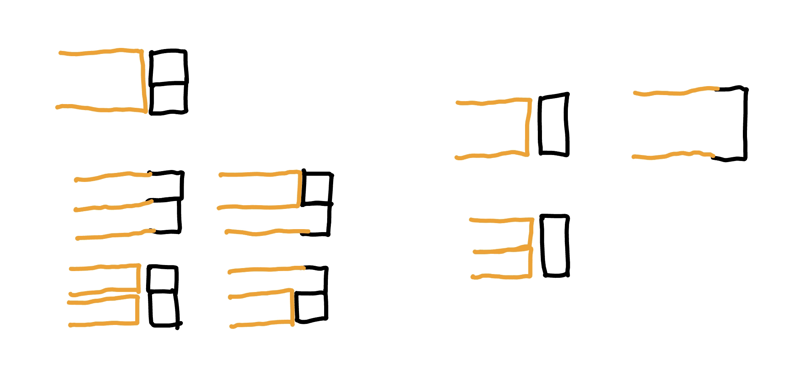

???+note "[2023 TOI 4 模 p2. 整除序列 (Divide)](https://drive.google.com/file/d/1CvB1-JyGmFaKq1Ir8VJ5avx7NUFT2Hl9/view)"
	有一個長度為 $n$ 的陣列 $a_1,\ldots, a_n$，你只知道每個數字的其中一個 character，要構造出陣列，使得相鄰的兩個數字互為因數或倍數關係，且補上的 character 數量要越少越好
	
	$2\le n\le 10^5$
	
	??? note "思路"
		可以觀察到每一項的數字都不會太大，所以可以先猜一個 threshold T
		
		然後去 dp(i, x) : 0~i 要讓 a[i] = x 最少要填的 character 數量
		
		f(i, k) : 0~i 要讓 a[i]|k 或 k|a[i] 最少要填的 character 數量
		
		f(i, k) = min{dp(i, x)} 其中 x|k or k|x 且 dp(i, x) 有解
		
		dp(i + 1, k) = 
		
		- k 有 b[i + 1]: f(i, k) + size(k) - 1
	
		- otherwise: -1
	
		可以先預處理 0~T 每個數字會不會出現某個 character exist[x][0~9]。這樣對於每個 i 都要做一次篩法從 dp(i, x) 轉移到 f(i, k)，複雜度 O(n * T * log(T))。

???+note "[CF 1860 D. Balanced String](https://codeforces.com/contest/1860/problem/D)"
	給你一個由 01 組成的字串 s，在一次操作下，你可以 swap 任意兩項。問最少幾次操作可讓 s 的逆序數對數量（10） = 正序數對數量（01）
	
	$3\le |s| \le 100$
	
	??? note "思路"
		先想考慮將這個字串 ramdom shuffle 後，怎麼計算最少要 swap 幾次 ? 其實只要看 a[i] != b[i] 的數量除以 2 即可（因為每次 swap 一定可以換好兩個）
	
		dp[i][j][k] : 代表到第 i 個位置為止共放了 j 個 1，10 數量為 k，跟原本的 a[i] != b[i] 的數量最少有幾個
		
		dp[i][j][k] 轉移到 :
	    
	    - 放 0 : dp[i+1][j+1][k + j]
	
	    - 放 1 : dp[i+1][j][k]
		
		這樣可能會 MLE，考慮到 dp[i + 1][ ][ ] 只用到 dp[i][ ][ ]，所以可以滾動。
		
	??? note "code"
		```cpp linenums="1"
		#include <bits/stdc++.h>
	    using namespace std;
	    #define ll long long
	    #define pb push_back
	    #define all(x) (x).begin(), (x).end()
	    #define pii pair<int, int>
	    const int mod = 998244353, N = 105;
	
	    int dp[2][N][N * N];
	
	    void solve() {
	        string s; cin >> s;
	        int n = s.length();
	        int tot = 0, cnt0 = 0, cnt1 = 0;
	        for (char c : s) {
	            (c == '0' ? cnt0 : cnt1)++;
	        }
	        tot = n * (n - 1) / 2;
	        tot -= cnt0 * (cnt0 - 1) / 2;
	        tot -= cnt1 * (cnt1 - 1) / 2;
	        assert(tot % 2 == 0);
	
	        for (int i = 0; i < 2; ++i) {
	            for (int j = 0; j < N; ++j) {
	                for (int k = 0; k < N * N; ++k) {
	                    dp[i][j][k] = 1 << 30;
	                }
	            }
	        }
	
	        int now = 0;
	        dp[1][0][0] = 0;
	        for (int i = 0; i < n; ++i) {
	            for (int j = 0; j < N; ++j) {
	                for (int k = 0; k < N * N; ++k) {
	                    dp[now][j][k] = 1 << 30;
	                }
	            }
	            for (int j = 0; j <= n; ++j) {
	                for (int k = 0; k <= n * (n - 1) / 2; ++k) {
	                    if (dp[now ^ 1][j][k] <= n) {
	                        int c0 = (s[i] == '1'), c1 = c0 ^ 1;
	                        // 0
	                        dp[now][j][k + j] = min(dp[now][j][k + j], dp[now ^ 1][j][k] + c0);
	                        // 1
	                        dp[now][j + 1][k] = min(dp[now][j + 1][k], dp[now ^ 1][j][k] + c1);
	                    }
	                }
	            }
	            now ^= 1;
	        }
	        cout << dp[now ^ 1][cnt1][tot / 2] / 2 << '\n';
	    }
	
	    int main() {
	        ios::sync_with_stdio(false), cin.tie(0);
	        int t = 1;
	        // cin >> t;
	        while (t--) {
	            solve();
	        }
	    }
	    ```

???+note "[CF 1861 E. Non-Intersecting Subpermutations](https://codeforces.com/contest/1861/problem/E)"
	給 $n,k$，對於一個長度為 $n$，每個元素皆在 $1\ldots k$ 的 array，cost 的計算方式為「最多可切出幾段 $1\ldots k$ 的 permutation」，輸出所有可能的 array 的 cost 總合為多少
	
	$2\le k\le n\le 4000$
	
	??? note "思路"
		想法 : 對於一個 subarray，貢獻了幾個 array
	
	    dp[i] = 有幾個長度為 i 的 array 滿足 subarray(i - k + 1, i) 是有貢獻到的
	
	    [i - k + 1, i] 一定要是一個 1~k 的 permutation，而之前的每一格我們擺 1~k 都可以，所以 initially dp[i] = k! * exp(k, i - k)
	
	    考慮要從 dp[i] 中扣掉不合法的 case，也就是有幾個 permutation 的結尾在 [i - k + 1, i) 就已形成。設 j $\in$ [i- k + 1, i)，我們需要將 dp[i] -= dp[j] * (i - j)!
	
	    最後，對於每個 i，因為後面可以隨便擺，對答案的貢獻就是 dp[i] * exp(k, n - i)
	    
	    > 參考自 : <https://codeforces.com/blog/entry/119891?#comment-1064151>
	
	??? note "code"
		```cpp linenums="1"
		#include <bits/stdc++.h>
	    #define int long long
	
	    using namespace std;
	
	    const int N = 4005;
	    const int M = 998244353;
	
	    int n, k;
	    int dp[N], fac[N], powK[N];
	
	    void init() {
	        powK[0] = 1;
	        fac[0] = 1;
	        for (int i = 1; i <= n; i++) {
	            powK[i] = (powK[i - 1] * k) % M;
	            fac[i] = (fac[i - 1] * i) % M;
	        }
	    }
	
	    signed main() {
	        cin >> n >> k;
	        init();
	
	        for (int i = k; i <= n; i++) {
	            dp[i] = (fac[k] * powK[i - k]) % M;
	            for (int j = i - k + 1; j < i; j++) {
	                dp[i] = (dp[i] - (dp[j] * fac[i - j]) % M + M) % M;
	            }
	        }
	
	        int ans = 0;
	        for (int i = k; i <= n; i++) {
	            ans = (ans + dp[i] * powK[n - i]) % M;
	        }
	        cout << ans << '\n';
	    }
	    ```

???+note "<a href="/wiki/dp/images/ionc_307.html" target="_blank">2022 IONC Day3 G. TypeRacer 2 (typeracer2)</a>"
	給一個長度為 $n$ 的陣列 $a_1,\ldots ,a_n$，鍵盤左到右是 $1, 2, \ldots, k$，兩隻手指頭一開始可放任意位置。手指從 $i$ 到 $j$ 會花 $|i-j|$，輸出將陣列 $a$ 打完的最少時間
	
	$1\le n, k\le 2\times 10^5$
	
	??? note "思路"
		dp(i, j) = 每次只動一隻手的條件下，打完第 i 個鍵，另隻手在 j 的最小 cost
	
	    $dp(i,j) \to \begin{cases}dp(i+1, j) ,\space \text{cost}(a_{i}, a_{i+1}) \\ dp(i + 1, a_{i}) ,\space \text{cost}(j, a_{i+1}) \end{cases}$
	    
	    basecase: dp(1, 1~k) = 0, 其他 = INF
	    
	    ---
	    
	    > 實作: 資料結構優化
	    
	    我們把 $dp(i + 1, a_{i})$ 單獨拉出來看
	
	    $dp(i+1, a_i)=\min \limits_{j=1\ldots k} \{dp(i, j) + |a_{i+1} - j| \}$
	
	    $dp(i + 1, a_i) = \min \begin{cases} dp(i, j) + a_{i+1} - j \space \forall j \le a_{i+1} \\  dp(i, j) +j - a_{i+1} \space \forall j > a_{i+1} \end{cases}$
	
	    所以我們只需要去維護兩顆線段樹 $dp(i,j)+j, dp(i, j) - j$ 即可
	    
	??? note "code"
		```cpp linenums="1"
		#include <bits/stdc++.h>
	    #define int long long
	    #define pb push_back
	    using namespace std;
	
	    const int INF = 2e18;
	
	    struct Node {
	        Node *lc = nullptr;
	        Node *rc = nullptr;
	        int l, r;
	        int add = 0, mn = 0;
	
	        Node(int l, int r) : l(l), r(r) {} 
	
	        void pull() {
	            mn = min(lc->mn, rc->mn);
	        }
	        void push() {
	            if (add) {
	                lc->add += add;
	                lc->mn += add;
	                rc->add += add;
	                rc->mn += add;
	                add = 0;
	            }
	        }
	    };
	
	    Node* build(int l, int r) {
	        Node *root = new Node(l, r);
	        if (l == r) {
	            return root;
	        }
	        int mid = (l + r) / 2;
	        root->lc = build(l, mid);
	        root->rc = build(mid + 1, r);
	        root->pull();
	        return root;
	    }
	
	    void add(Node *root, int ml, int mr, int val) {
	        if (ml > mr) return;
	        if (ml <= root->l && root->r <= mr) {
	            root->add += val;
	            root->mn += val;
	            return;
	        } 
	        root->push();
	        if (ml <= root->lc->r) {
	            add(root->lc, ml, mr, val);
	        }
	        if (root->rc->l <= mr) {
	            add(root->rc, ml, mr, val);
	        }
	        root->pull();
	    }
	
	    int query(Node *root, int ql, int qr) {
	        if (ql > qr) return INF;
	        if (ql <= root->l && root->r <= qr) {
	            return root->mn;
	        }
	        root->push();
	        int ret = INF;
	        if (ql <= root->lc->r) {
	            ret = min(query(root->lc, ql, qr), ret);
	        }
	        if (root->rc->l <= qr) {
	            ret = min(query(root->rc, ql, qr), ret);
	        }
	        root->pull();
	        return ret;
	    }
	
	    const int N = 2e5 + 5;
	    int n, k;
	    int a[N];
	    signed main () {
	        cin >> n >> k;
	        for (int i = 1; i <= n; i++) {
	            cin >> a[i];
	        }
	        Node *root_del = build(1, k);
	        Node *root_add = build(1, k);
	        for (int i = 1; i <= k; i++) {
	            add(root_del, i, i, -i);
	            add(root_add, i, i, +i);
	        }
	        for (int i = 1; i < n; i++) {
	            // calculate dp(i + 1, a[i])
	            int dp = min(query(root_del, 1, a[i + 1]) + a[i + 1], 
	                         query(root_add, a[i + 1] + 1, k) - a[i + 1]);
	
	            // update dp(i + 1, *)
	            add(root_del, 1, k, abs(a[i + 1] - a[i]));
	            add(root_add, 1, k, abs(a[i + 1] - a[i]));
	            // update dp(i + 1, a[i])
	            int now = query(root_del, a[i], a[i]) + a[i];
	            if (dp < now) {
	                add(root_del, a[i], a[i], -now+dp);
	                add(root_add, a[i], a[i], -now+dp);
	            }
	        }
	        int ans = INF;
	        for (int i = 1; i <= k; i++) {
	            ans = min(ans, query(root_del, i, i) + i);
	        }
	        cout << ans << '\n';
	    }
	    ```

???+note "[TOI 2022 B. 打鍵盤 (keyboard)](https://tioj.ck.tp.edu.tw/problems/2247)"
	給一個長度為 $n$ 的字串 $S$，一開始左手指在 F，右手指在 J，每次可將一隻手指移動一單位，輸出將字串 $S$ 打完的最少次數
	
	$1\le n\le 10^4,S$ 僅由英文大寫字母構成
	
	??? note "思路"
		先利用 Floyd Warshall 建好 dis(A-Z, A-Z)
		
		dp(i, j) = 每次只動一隻手的條件下，打完第 i 個鍵，另隻手在 j 的最小 cost
	
	    $dp(i,j) \to \begin{cases}dp(i+1, j) ,\space \text{cost}(a_{i}, a_{i+1}) \\ dp(i + 1, a_{i}) ,\space \text{cost}(j, a_{i+1}) \end{cases}$
		
		轉移從 dp(i, * ) 推到 dp(i + 1, * )，時間複雜度 O(26n)

### CF 484D

???+note "[CF 484 D. Kindergarten](https://codeforces.com/problemset/problem/484/D)"
	給一個長度為 $n$ 的陣列 $a_1, \ldots ,a_n$，能將陣列切成好幾段，問每段的 max - min 加起來最大是多少
	
	$1\le n\le 10^6, -10^9 \le a_i \le 10^9$
	
	??? note "思路"
		我們可以發現，將陣列分成好幾段，若遇到轉折就切，一定是最好的。感性理解的話，就是將每個能用差值都用上
		
		<figure markdown>
	      { width="300" }
	    </figure>
	    
	    但在轉折處，會有一段貢獻不會選到，我們就要用 dp 到底計算選哪個比較好
	    
	    <figure markdown>
	      { width="300" }
	    </figure>
	
	??? note "code"
		```cpp linenums="1"
		#include <bits/stdc++.h>
	    #define int long long
	    using namespace std;
	
	    const int maxn = 1e6 + 5;
	    int n;
	    int a[maxn], dp[maxn];
	
	    void init () {
	        cin >> n;
	        for (int i = 1; i <= n; i++) {
	            cin >> a[i];
	        }
	    }
	
	    void solve () {
	        int j = 1; 
	        for (int i = 2; i <= n; i++) {
	            dp[i] = max(dp[j] + abs(a[i] - a[j + 1]), dp[j - 1] + abs(a[i] - a[j]));
	            if (a[i - 1] <= a[i] && a[i] >= a[i + 1]) j = i;
	            else if (a[i - 1] >= a[i] && a[i] <= a[i + 1]) j = i;
	        }
	        cout << dp[n] << "\n";
	    }
	
	    signed main () {
	        init();
	        solve();
	    }
		```

???+note "[CS Academy - Distinct Neighbours](https://csacademy.com/contest/archive/task/distinct_neighbours)"
	給你一個長度為 $n$ 的陣列 $a_1, a_2, \ldots ,a_n$，問有幾種 $a$ 的 permutation 滿足相同數字不相鄰
	
	$1\le n\le 750,1\le a_i \le n$
	
	??? note "思路"
		首先，將相同的數字分為一類
	
		先考慮只有兩組數字的 case，例如說是 4 個 a，3 個 b，會發現我們可以插入 b 使一些相鄰的 a 斷掉，也就是當只使用前面的字元不合法時，我們依然能在他們之間 insert 新的字元，使其變合法
	
		所以我們定義 dp(i, j) = 前 i 組數字恰好有 j 對相鄰數字相同的方案數
		
		考慮從 dp(i, j) 轉移到 dp(i + 1, ?)，先令前 i 組組成的是一個長度為 S 的序列，也就是可以在 S + 1 的 gaps 中插入 i + 1（第一項之前、中間、最後一項之後）
	
		我們先枚舉 k，假設有 k 個 gaps 至少有放一個第 i + 1 組的數字，要將 cnt[i + 1] 個物品填入，也就是將 cnt[i + 1] 顆球放入 k 個箱子，利用[隔板法](https://zh.wikipedia.org/zh-tw/%E9%9A%94%E6%9D%BF%E6%B3%95)得知方法數為 C(cnt[i + 1] - 1, k - 1)
		
		我會怎麼選這 k 個 gaps 呢 ? 這也需要考慮 gaps 的「種類」會是什麼
		
		- 枚舉 L，代表選 L 個同 pair gaps，方法數 : C(j, L)
		
		- 也就會有 k - L 個異 pair gaps，方法數 : C(S + 1 - j, k - L)
		
		所以會被扣掉 L 個同 pair gaps，將 cnt[i + 1] 個物品放入 k 個 gaps 會產生 cnt[i + 1] - k 個同 pair（例如說 5 個物品放入 3 個 gap，不管怎麼放一定會有 2 個物品相鄰），我們發現 dp(i, j) 就是要轉移到 dp(i + 1, j - L + cnt[i + 1] - k)
		
		現在要正式的來列轉移式，我們把剛剛所說的方法數都乘起來:
		
		dp(i + 1, j - L + cnt[i + 1] - k) = dp(i, j) * C(cnt[i + 1] - 1, k - 1) * C(j, L) * C(S + 1 - j, k - L)
		
		> 參考自 : <https://www.cnblogs.com/jiachinzhao/p/7410938.html>
	
	??? note "code"
		```cpp linenums="1"
		#include <bits/stdc++.h>
	    #define LL long long
	    using namespace std;
	    const int N = 800;
	    const int mod = 1e9 + 7;
	    int C[N][N];
	    void init() {
	        for (int i = 0; i < N; i++) C[i][0] = C[i][i] = 1;
	        for (int i = 2; i < N; i++) {
	            for (int j = 1; j <= i; j++) {
	                C[i][j] = (C[i - 1][j] + C[i - 1][j - 1]) % mod;
	            }
	        }
	    }
	    int dp[N][N], cnt[N], total[N];
	    vector<int> v;
	    int main() {
	        init();
	        int n, x, mx = 1;
	        cin >> n;
	        v.push_back(0);
	        for (int i = 1; i <= n; i++) {
	            cin >> x;
	            if (!cnt[x]) v.push_back(x);
	            cnt[x]++;
	        }
	        for (int i = 1; i < v.size(); i++) total[i] = total[i - 1] + cnt[v[i]];
	        dp[0][0] = 1;
	        for (int i = 0; i < v.size() - 1; i++) {
	            int num = cnt[v[i + 1]], S = total[i] + 1;
	            for (int j = S - 1; j >= 0; j--) {  
	                int kk = min(num, S);        
	                for (int k = 1; k <= kk; k++) {
	                    int L = min(j, k);
	                    for (int l = L; S - j >= k - l; l--) {
	                        int &res = dp[i + 1][j - l + num - k];
	                        res = (res + 1LL * C[num - 1][k - 1] * C[j][l] % mod * C[S - j][k - l] % mod * dp[i][j] % mod) % mod;
	                    }
	                }
	            }
	        }
	        cout << dp[v.size() - 1][0] << endl;
	        return 0;
	    }
	    ```

???+note "[2021 全國賽 pF. 挑水果](https://tioj.ck.tp.edu.tw/problems/2258)"
	一開始船上有 $c$ 個種類的水果，第 $i$ 種類有 $n_i$ 顆，依序經過 $c$ 個城市，每經過一個城市可以決定要不要把船上所有前 $i$ 種類的水果給當地盤商賣，積載每顆水果經過都市 $i$ 需要積載成本 $p_i$，把每顆水果給都市 $i$ 的盤商賣需要成本 $s_i$，在都市 $i$ 賣種類 $j$ 的水果最後只會賣出 $r_{i,j}$ 顆，問若積載成本和銷售成本總和不超過 $T$ 的前提下，最多能賣幾顆水果 ?
	
	$1\le c,n_i\le 40,1\le p_i, s_i\le 1000,T \le 10^7$
	
	??? note "思路"
		類似超大背包的想法，令 dp(i, j, v): 到了第 i 個城市，上一部賣完第 j 種水果，利潤為 v 的最小成本
		
		轉移式如下，從 dp(i, j, v) 轉移過去
		
		- dp(i + 1, i + 1, v + rsum(j + 1, i + 1)) = min(dp(i, j, v) + p_sum(j + 1, n) + s_sum(j + 1, i + 1) )
	
		- dp(i + 1, j, v) = min(dp(i, j, v) + p_sum(j + 1, n))
	
		複雜度 : 狀態 O(40 * 40 * (40 * 40))，轉移 O(1)

???+note "[CS Academy - Count Arrays](https://csacademy.com/contest/archive/task/count-arrays)"
	有一個 01 序列 $a$，給 $q$ 筆限制，每筆限制 $[l_i,r_i]$ 代表在這個區間內至少要有一個 0，問 $a$ 有幾種
	
	$n,q\le 10^5$
	
	??? note "思路"
		令 dp[i] = 只考慮 1~i，$a_i$ 放 0 的合法序列有幾種，轉移的話我們就需要去枚舉放 1 的區間 $[j+1, i-1]$，所以可列出轉移式 $dp[i] = \sum dp[j]$。我們可以按照題目給的限制來預處理出 i 之前至少到哪裡都可以放 1（也就是我們 j 最小能多小），對於轉移當 i 遞增的時候，j 的最小值是單調不降的，所以可以通過這個單調性做到 $O(n)$。
		
	??? note "code"
		```cpp linenums="1"
		#include <bits/stdc++.h>
	    #define int long long
	
	    using namespace std;
	
	    const int N = 1e5 + 5;
	    const int M = 1e9 + 7;
	
	    int n, m;
	    int mx[N], dp[N];
	
	    signed main() {
	        cin >> n >> m;
	        for (int i = 1; i <= m; i++) {
	            int l, r;
	            cin >> l >> r;
	            mx[r + 1] = max(mx[r + 1], l);
	        }
	        dp[0] = 1;
	        int now = 0, cnt = 1;
	        for (int i = 1; i <= n + 1; i++) {
	            while(now < mx[i]) {
	                cnt = (cnt - dp[now] + M) % M;
	                now++;
	            }
	            dp[i] = cnt;
	            cnt = (cnt + dp[i]) % M;
	        }
	        cout << dp[n + 1] << '\n';
	    } 
	    ```

???+note "[Zerojudge e900. 交換紙牌遊戲](https://zerojudge.tw/ShowProblem?problemid=e900)"
	共有 $n$ 個 pair，可以交換同個 pair 的兩項，目標使第一項總和與第二項總和的差值最小，問最少交換次數。
	
	$n\le 1000,1\le$ pair 中的元素 $\le 13$
	
	??? note "code"
		```cpp linenums="1"
		#include <bits/stdc++.h>
	    #define int long long
	    using namespace std;
	
	    int n,a[100000],b[100000],sum,times,mi,dp[1001][13001];
	    const int INF=0x3f3f3f3f;
	
	    signed main(){
	        while(cin>>n){
	            times=INF;
	            mi=INF;
	            sum=0;
	            memset(dp,INF,sizeof(dp));
	            dp[0][0]=0;
	            //dp(i, j) 表示前 i 項，陣列 A 的總和是 j，最少要換幾次
	            for(int i=1;i<=n;i++){
	                cin>>a[i]>>b[i];
	                sum+=a[i]+b[i];
	                for(int j=1*i;j<=13*i;j++){
	                    if(j-a[i]>=0) dp[i][j]=dp[i-1][j-a[i]];
	                    if(j-b[i]>=0) dp[i][j]=min(dp[i][j],dp[i-1][j-b[i]]+1);
	                }
	            }
	            //找AB最小差值
	            for(int j=1*n;j<=13*n;j++){
	                if(dp[n][j]<INF){
	                    //abs(B的卡牌總和-A的卡牌總和)=abs((全-A)-A)=abs(sum-j-j)
	                    if(abs(sum-j-j)<mi){
	                        mi=abs(sum-j-j);
	                        times=dp[n][j];
	                    }
	                    else if(abs(sum-j-j)==mi){
	                        if(times>dp[n][j]){
	                            times=dp[n][j];
	                        }
	                    }
	                }
	
	            }   
	            cout<<times<<"\n";
	
	        }
	    }
		```

???+note "[CF 510 D. Fox And Jumping](https://codeforces.com/problemset/problem/510/D)"
	給你 $n$ 張卡片，初始坐標為 0，每張卡片都有一個 $l_i,c_i$，代表買了之後可以跳 $-l_i$ 或 $+l_i$。問可以跳到任意格子的最小花費。
	
	$n\le 300, 1\le l_i \le 10^9, 1\le c_i \le 10^5$
	
	??? note "思路"
		根據貝祖定理，$ax+by=m$ 有解 iff $m$ 為 $\gcd (a,b)$ 的倍數，反過來看，$a,b$ 的 $\gcd$ 要是 $m$ 的因數才有解
	
		同理，設當前選取卡片能跳的距離為 $a_1, \ldots ,a_k$，我們可以列出
		
		$$
		b_1 \times a_1 + b_2 \times a_2 + \ldots + b_k \times a_k = 1
		$$
		
		也就是 $\gcd(a_1, \ldots ,a_k)$ 要等於 $1$。令 $dp[i]$ 為當前能得到的gcd 等於 $i$ 的最小花費，每次用一張卡片的值去更新這些 gcd 即可。
		
	??? note "code"
		```cpp linenums="1"
		#include <bits/stdc++.h>
	    using namespace std;
	    #define ll long long
	
	    struct node {
	        int l, c;
	        friend bool operator<(node a, node b) {
	            return a.c > b.c;
	        }
	    } a[310];
	    map<int, int> dp;
	
	    int main() {
	        map<int, int>::iterator iter;
	        int n;
	        cin >> n;
	        for (int i = 1; i <= n; i++) {
	            cin >> a[i].l;
	        }
	        for (int i = 1; i <= n; i++) {
	            cin >> a[i].c;
	        }
	        ll ans = 1e18;
	        sort(a + 1, a + 1 + n);
	        int gcd = a[1].l;
	        for (int i = 1; i <= n; i++) {
	            gcd = __gcd(gcd, a[i].l);
	        }
	        if (gcd > 1) {
	            cout << -1 << endl;
	            return 0;
	        }
	        for (int i = 1; i <= n; i++) {
	            dp[a[i].l] = a[i].c;
	        }
	        for (int i = 1; i <= n; i++) {
	            for (iter = dp.begin(); iter != dp.end(); iter++) {
	                if (dp[__gcd(a[i].l, iter->first)] == 0) {
	                    dp[__gcd(a[i].l, iter->first)] = a[i].c + iter->second;
	                } else {
	                    dp[__gcd(a[i].l, iter->first)] = min(dp[__gcd(a[i].l, iter->first)], a[i].c + iter->second);
	                }
	
	            }
	        }
	        cout << dp[1] << endl;
	    }
	    ```

???+note "[CF 1483 C. Skyline Photo](https://codeforces.com/problemset/problem/1483/C)"
	給 $n$ 個建築，每個建築有高度 $a_i$ 和美麗值 $b_i$。劃分成若干個連續段，使得所有區間的貢獻之和最大。其中每個區間的貢獻值為，區間中高度最低的建築物的美麗值。輸出最大貢獻和。
	
	$n\le 3\times 10^5, 0\le |b_i| \le 10^9$
	
	??? note "思路"
		$$dp(i)=\max \{dp(j) + \text{cost}(j + 1, i) \}$$
		
		我們想辦法利用線段樹來快速查詢最大值，但瓶頸在於後面的 cost 沒辦法很快地計算。不過可以觀察到實際上在 cost(l, r) 就是 l, ..., r 裡面 a[i] 最小的那一項，若故固定 r，則 l = 1...r 會發現貢獻 cost(l, r) 的 a[i] 只會單調遞增（下圖就是一個例子），所以我們可以用一個單調隊列維護，複雜度 $O(n \log n)$
		
		<figure markdown>
	      { width="400" }
	    </figure>
		
	??? note "code"
		```cpp linenums="1"
		#include <bits/stdc++.h>
	    #define int long long
	    #define pb push_back
	    #define mk make_pair
	    #define pii pair<int, int>
	    using namespace std;
	
	    const int INF = 9e18;
	    const int maxn = 3e5 + 5;
	    int a[maxn], w[maxn], stk[maxn], dp[maxn];
	    int n;
	
	    struct seg {
	        int mx, tag;
	        seg *lch, *rch;
	        seg() {
	            tag = 0;
	            mx = 0;
	            lch = rch = nullptr;
	        }
	        void push() {
	            if (tag) {
	                lch->mx += tag;
	                rch->mx += tag;
	                lch->tag = tag;
	                rch->tag = tag;
	                tag = 0;
	            }
	        }
	        void modify(int l, int r, int mL, int mR, int val) {
	            if (mL <= l && r <= mR) {
	                mx += val, tag += val;
	                return;
	            }
	            int mid = (l + r) >> 1;
	            if (!lch) lch = new seg();
	            if (!rch) rch = new seg();
	            push();
	            if (mL <= mid) {
	                lch->modify(l, mid, mL, mR, val);
	            }
	            if (mid + 1 <= mR) {
	                rch->modify(mid + 1, r, mL, mR, val);
	            }
	            mx = max(lch->mx, rch->mx);
	        }
	        int query(int l, int r, int qL, int qR) {
	            if (qL <= l && r <= qR) {
	                return mx;
	            }
	            int mid = (l + r) >> 1;
	            if (!lch) lch = new seg();
	            if (!rch) rch = new seg();
	            push();
	            int ret = -INF;
	            if (qL <= mid) {
	                ret = max(ret, lch->query(l, mid, qL, qR));
	            }
	            if (mid + 1 <= qR) {
	                ret = max(ret, rch->query(mid + 1, r, qL, qR));
	            }
	            return ret;
	        }
	    };
	
	    void init() {
	        cin >> n;
	        for (int i = 1; i <= n; i++) {
	            cin >> a[i];
	        }
	        for (int i = 1; i <= n; i++) {
	            cin >> w[i];
	        }
	    }
	
	    void solve() {
	        seg *rt = new seg();
	        a[0] = -INF;
	        int top = 1;
	        for (int i = 1; i <= n; i++) {
	            while (top && a[stk[top - 1]] >= a[i]) {
	                rt->modify(0, n, stk[top - 2], stk[top - 1] - 1, -w[stk[top - 1]]);
	                top--;
	            }
	            rt->modify(0, n, stk[top - 1], i - 1, w[i]);
	            dp[i] = rt->query(0, n, 0, i - 1);
	            rt->modify(0, n, i, i, dp[i]);
	            stk[top++] = i;
	        }
	        cout << dp[n] << "\n";
	    }
	
	    signed main() {
	        init();
	        solve();
	    }
	    ```

???+note "[2019 全國賽 pG. 隔離採礦](https://judge.tcirc.tw/ShowProblem?problemid=d088)"	
	有 $n$ 個礦井，每個礦井有高度 $h_i$ 與價值 $v_i$，挑一些礦井，使得相鄰兩個礦井間都存在一個更高的礦井
	
	$n\le 10^6, h_i\le 10^9, v_i\le 10^5$
	
	??? note "思路"
		$$dp[i]=\max \{ dp[j]+v[i] \}$$
		
		可以發現能轉移的 $j$ 會長這樣 :
		
		<figure markdown>
	      { width="300" }
	      <figcaption>綠色有辦法轉移，紅色沒辦法</figcaption>
	    </figure>
	    
	    所以我們可以用單調 stack 維護無法轉移的 $j$，利用 BIT 儲存能「合法」轉移的 $j$ 的 dp 值。我們必須在 stack 內二分出比 $h_i$ 大且最靠近 $i$ 的 $j$，用 BIT 去 query_max$(1, j)$ 來轉移即可
	    
	??? note "code"
		```cpp linenums="1"
		#include <bits/stdc++.h>
	    #define int long long
	
	    using namespace std;
	
	    const int N = 1e6 + 5;
	    int n;
	    int h[N], v[N], dp[N];
	
	    struct BIT {
	        #define lowbit(x) (x & (-x))
	        int n;
	        vector<int> bit;
	
	        BIT(int _n) {
	            n = _n;
	            bit = vector<int>(n + 1, 0);
	        }
	        int query(int x) {
	            int ret = 0;
	            while (x > 0) {
	                ret = max(ret, bit[x]);
	                x -= lowbit(x);
	            }
	            return ret;
	        }
	        void update(int x, int d) {
	            while (x <= n) {
	                bit[x] = max(bit[x], d);
	                x += lowbit(x);
	            }
	        }
	    }; 
	
	    signed main() {
	        cin >> n;
	        for (int i = 1; i <= n; i++) {
	            cin >> h[i];
	        }
	        for (int i = 1; i <= n; i++) {
	            cin >> v[i];
	        }
	        BIT bit(n);
	        vector<int> stk;
	        for (int i = 1; i <= n; i++) {
	            while (stk.size() && h[stk.back()] < h[i]) {
	                bit.update(stk.back(), dp[stk.back()]);
	                stk.pop_back();
	            }
	            int l = 0, r = stk.size();
	            while (r - l > 1) {
	                int mid = (l + r) / 2;
	                if (h[stk[mid]] <= h[i]) {
	                    r = mid;
	                } else {
	                    l = mid;
	                }
	            }
	
	            if (stk.size() && h[stk[l]] > h[i]) {
	                dp[i] = bit.query(stk[l]) + v[i];
	            } else {
	                dp[i] = v[i];
	            }
	            stk.push_back(i);
	        }
	        cout << *max_element(dp + 1, dp + n + 1) << '\n';
	    }
		```


???+note "[CF 730 J. Bottles](https://codeforces.com/problemset/problem/730/J)"
	有 $n$ 個瓶子，各有水量 $a_i$ 和容量 $b_i$。現在要將這寫瓶子裡的水存入最少的瓶子裡。問最少需要的瓶子數，與在保證瓶子數最少的情況下，轉移的水量最少是多少。

	$n\le 100, 1\le a_i,b_i\le 100$
	
	??? note "思路"
		首先，最少瓶子數可以透過貪心的枚舉前幾大的 $b_i$，看枚舉到哪時可以裝得下 $\sum a_i$。
		
		在來，我們來整理一下「最少轉移的水量」所需符合的條件 :
		
		- 需要 ans1 個來儲存（第一個答案）
	
		- 容量和要足夠讓剩下的水量倒進去
	
		- 轉移的水量越少越好 ⇒ 已固定的水量要越大越好
	
		考慮 dp(i, j, k) = 考慮 1...i，我們已經選了 j 個來儲存，容量能湊到 k 的，水量最多可以是多少
	    
	    最後的答案就是 dp(n, ans1, $\sum a_i \ldots \sum b_i$) 取 max
		
	??? note "code"
		```cpp linenums="1"
		#include <bits/stdc++.h>
	    #define int long long
	    #define pb push_back
	    #define mk make_pair
	    #define a first
	    #define b second
	    #define pii pair<int, int>
	    using namespace std;
	
	    const int INF = 9e18;
	    const int maxn = 105;
	    int n, m;
	    int sumA, sumB, dp[maxn][maxn * maxn];
	    vector<pii> v;
	
	    void solve () {
	         cin >> n;
	         v.resize(n + 1);
	         for (int i = 1; i <= n; i++) {
	              cin >> v[i].a;
	              sumA += v[i].a;
	         }
	         for (int i = 1; i <= n; i++) {
	              cin >> v[i].b;
	              sumB += v[i].b;
	         }
	
	         sort (v.begin() + 1, v.end(), [](pii x, pii y) { return x.b > y.b; });
	         int N;
	         for (int i = 1, s = 0; i <= n; i++) {
	              s += v[i].b;
	              if (s >= sumA) {
	                   N = i;
	                   break;
	              }
	         }
	
	         // dp[i][j] = 容量為 j 的最大水量
	         memset (dp, -1, sizeof dp);
	         dp[0][0] = 0;
	         for (int i = 1; i <= n; i++) {
	              for (int j = sumB; j >= v[i].b; j--) {
	                   for (int k = i; k >= 1; k--) {
	                        if (dp[k - 1][j - v[i].b] != -1)
	                             dp[k][j] = max(dp[k - 1][j - v[i].b] + v[i].a, dp[k][j]);
	                   }
	              }
	         }
	
	         int ans = 0;
	         for (int j = sumA; j <= sumB; j++) {
	              ans = max(ans, dp[N][j]);
	         }
	         cout << N << " " << sumA - ans << "\n";
	    }
	
	    signed main () {
	        solve();
	    }
	    ```

???+note "[CF 366 C. Dima and Salad](https://codeforces.com/problemset/problem/366/C)"
	有 $n$ 個物品，每個物品有權值 $a_i$ 與 $b_i$，選一些物品，使得
	
	$$
	\frac{\sum \limits_{j=1}^m a_j}{\sum \limits_{j=1}^m b_j} =k
	$$
	
	滿足上面條件的這一些物品 $a_i$ 和最大可以是多少
	
	$n\le 100, 1\le k\le 10, 1\le a_i, b_i\le 100$
	
	??? note "思路"
		類似 01 分數規劃的形式，問題就變成 :
		
		有 $n$ 個物品重量 $a_i - k\times b_i$ 與價值 $a_i$，求重量為 $0$ 最大的 $a_i$ 總和
		
		實作上不能狀態壓縮，因為 $a_i - k\times b_i$ 有可能是正的也有可能是負的，可以用滾動陣列代替。本來重量和的 range 會在 [-1e5, 1e5]，但陣列 index 不能用負的，所以要改成 [0, 2e5]，最後的答案就是 dp(n, 1e5)
		
	??? note "code"
		```cpp linenums="1"
		#include <bits/stdc++.h>
	
	    using namespace std;
	
	    const int N = 105;
	    const int M = 1e5;
	    int n, k;
	    int a[N], b[N], dp[2][200005];
	
	    signed main() {
	        cin >> n >> k;
	        for (int i = 1; i <= n; i++) {
	            cin >> a[i];
	        }
	        for (int i = 1; i <= n; i++) {
	            cin >> b[i];
	        }
	        memset(dp, -0x3f, sizeof(dp));
	        dp[0][M] = 0;
	        for (int i = 1; i <= n; i++) {
	            int w = a[i] - k * b[i];
	            for (int j = 2e5; j >= 0; j--) {
	                if (j - w >= 0 && j - w <= 2e5) {
	                    dp[i % 2][j] = max(dp[(i - 1) % 2][j], dp[(i - 1) % 2][j - w] + a[i]);
	                }
	            }
	        }
	        if (dp[n % 2][M] == 0) {
	            cout << "-1\n";
	        } else {
	            cout << dp[n % 2][M] << '\n';
	        }
	    } 
	    ```

???+note "[延平中學 2022 校內賽 p8. 大樓拆除 (building)](/wiki/dp/images/building_TWN.pdf)"
	有 $n$ 棟建築高度為 $h_1, \ldots, h_n$，在第一棟不能炸的情況下，最少需要炸幾棟才能從左往右看恰看到 $k$ 棟
	
	$1\le n\le 10^5, 1\le k\le 10, 1\le h_i\le 10^9$
	
	??? note "思路"
		考慮 dp，因為第一棟不能炸，所以要從後往前做，最後的答案就是第一項的 dp 值。令 dp(i, k) = 從 n 往 i 考慮，第 i 棟是第 k 個被看見的最小 cost
		
		dp(i, k) = dp(j, k - 1) + cost(i + 1, j - 1) | h[i] < h[j]，其中 cost 為 h[i + 1, j - 1] 有幾個比 h[i] 大
		
		我們轉移都是先枚舉 k。考慮優化，我們開一顆線段樹，每隔紀錄 dp(i, k - 1)，初始化都將其設為 dp(i, k - 1) + INF，讓待會的區間最小值不會挑到 h[j] 比 h[i] 小的。還有一個問題，就是我們要怎麼計算 cost，我們可以想辦法先算好（預處理） h[i + 1, n] 比 h[i] 的數量，然後讓線段樹每隔裡面都扣掉我們多選的貢獻。我們從 h[i] 的數值大到小做，dp(i, k) 就直接等於「線段樹 [i + 1, n] 的 min」+「h[i + 1, n] 比 h[i] 大的數量」，再來，要將自己會被之後的 i 計算「h[i + 1, n] 比 h[i] 大的數量」多算的貢獻給扣掉，因為之後的 h[i] 肯定比目前的 h[i] 還來的小，所以對於前面所有的轉移點，也就是線段樹的 [1, i - 1] 都 -1。
		
		可以將 (i, h[i]) 打在二維座標平面上理解會更清楚。
		
		> 參考自 : <https://hackmd.io/@HNO2/HysqfODG3#pH-%E5%A4%A7%E6%A8%93%E6%8B%86%E9%99%A4>

???+note "[EOJ 2799. 区间覆盖](https://acm.ecnu.edu.cn/problem/2799/)"
	給 $n$ 個 interval $[l, r]$，每個 interval 有一個權重 $w$，問至少覆蓋 $k$ 個 point 的最小權重和
	
	$n\le 10^5, 1\le w_i\le 10^9,$ point 數量 $\le 300$
	
	??? note "思路"
		觀察到可以將有覆蓋到的 point 分成好幾段，每一段 point 都只會被一個 interval 覆蓋
	
		cost(l, r) : 用一個 interval 覆蓋 point[l ~ r] 的最小權重
		
		dp(i, k) = 在 point 1 ~ i 內恰好覆蓋 k 個 point 的 min cost
		
		$$dp(i, k) = \min \begin{cases}dp(i - 1, k) \\ dp(i - j, k - j) +  \text{cost}(i - j + 1, i) \space\space \text{for} \space   \text{all}\space j=1 \ldots k\end{cases}$$
		
	??? note "code"
		```cpp linenums="1"
		#include <stdio.h>
	    #include <iostream>
	    #define MAX_N 307
	    #define INFINITY 0x3F3F3F3F
	
	    using namespace std;
	
	    int costs[MAX_N][MAX_N];  // costs[i][j]表示从i放到j的花费
	    int dp[MAX_N][MAX_N];     // dp[i][j]表示在总共i个里面放k个的最小花费
	
	    int main() {
	        int caseNumber;
	        scanf("%d", &caseNumber);
	        for (int caseIndex = 0; caseIndex < caseNumber; ++caseIndex) {
	            for (int i = 0; i < MAX_N; ++i) {
	                for (int j = 0; j < MAX_N; ++j) {
	                    costs[i][j] = INFINITY;
	                }
	            }
	            for (int i = 0; i < MAX_N; ++i) {
	                for (int j = 0; j < MAX_N; ++j) {
	                    dp[i][j] = INFINITY;
	                }
	            }
	            int n, m, k;
	            scanf("%d%d%d", &n, &m, &k);
	            while (m--) {
	                int left, right, cost;
	                scanf("%d%d%d", &left, &right, &cost);
	                costs[left][right] = min(costs[left][right], cost);
	
	                for (int i = left; i <= right; ++i) {
	                    for (int j = i; j <= right; ++j) {
	                        costs[i][j] = min(costs[i][j], cost);
	                    }
	                }
	            }
	            for (int i = 1; i <= n; ++i) {
	                for (int j = i; j <= n; ++j) {
	                    for (int t = i; t < j; ++t) {
	                        costs[i][j] = min(costs[i][j], costs[i][t] + costs[t + 1][j]);
	                    }
	                }
	            }
	
	            for (int i = 0; i <= n; ++i) dp[i][0] = 0;
	
	            for (int i = 1; i <= n; ++i)
	                for (int j = 1; j <= i; ++j) {
	                    dp[i][j] = dp[i - 1][j];
	                    for (int t = 1; t <= j; ++t)
	                        if (costs[i - t + 1][i] != INFINITY)
	                            dp[i][j] = min(dp[i][j], dp[i - t][j - t] + costs[i - t + 1][i]);
	                }
	            printf("case #%d:\n%d\n", caseIndex, dp[n][k] == INFINITY ? -1 : dp[n][k]);
	        }
	
	        return 0;
	    }
	    ```

???+note "[洛谷 P1077 [NOIP2012 普及组] 摆花](https://www.luogu.com.cn/problem/P1077)"
	有 $n$ 種花，依序編號為 $1$ 到 $n$，第 $i$ 種有 $a_i$ 個。問依編號小到大放 $m$ 朵花有幾種方法
	
	$n\le 100, m\le 100, a_i\le 100$
	
	??? note "思路"
		$dp(i,k)=$ 看前 $k$ 種花，目前已經放了 $i$ 個
		
		$dp(i,k)=\sum \limits_{i-a_i\le j}dp(j,k-1)$
		
	??? note "code"
		```cpp linenums="1"
		cin >> n >> m;
		for (int i = 1; i <= n; i++) {
			cin >> a[i];
		}
		for (int k = 0; k <= n; k++) {
			dp[0][k] = 1;
		}
		for (int k = 1; k <= n; k++) {
			for (int i = 1; i <= m; i++)  {
				for (int j = i; j >= max(i - a[k]); j--) {
					dp[i][k] = (dp[i][k] + dp[i - 1][k]) % M;
				}
			}
		}
		cout << dp[m][n] << '\n';
		```

???+note "[CSES - Permutation Inversions](https://cses.fi/problemset/task/2229)"
	問有多少個 $1\ldots n$ 的 permutation 的逆序數對數量為 $k$
	
	$n\le 500, k\le \frac{n(n-1)}{2}$
	
	??? note "思路"
		dp(i, j) = 1 ... i 組成的 permutation 內，逆序數對數量為 j 的有幾個
		
		$dp(i, j) = \sum \limits_{j-(i-1)\le k\le j} dp(i - 1, k)$
		
	??? note "code"
		```cpp linenums="1"
		#include <bits/stdc++.h>
	    #define int long long
	
	    using namespace std;
	
	    const int maxn = 505;
	    const int M = 1e9 + 7;
	    int n, k;
	    int dp[maxn][maxn * maxn];
	
	    signed main() {
	        cin >> n >> k;
	
	        dp[1][0] = 1;
	        for(int i = 2; i <= n; i++){
	            int sum = 0, p = 0; 
	            for(int j = 0; j <= k; j++){
	                if(j - (i - 1) > p) {
	                    sum -= dp[i - 1][p];
	                    p++;
	                }
	                sum += dp[i - 1][j];
	                dp[i][j] = sum % M;
	            }
	        }
	        cout << dp[n][k] << "\n";
	    } 
	    ```

???+note "[CSES - Coding Company](https://cses.fi/problemset/task/1665/)"
	給一個長度為 $n$ 的陣列 $a_1, \ldots ,a_n$，問有幾種分組方式使每組的最大最小差之和 $\le x$
	
	$n\le 100, 0\le x\le 5000, 0\le t_i \le 100$
	
	??? note "思路"
		先將陣列 $a$ 小到大 sort，我們在算 max - min 就可以一段一段的算
	
		dp(i, j, x): 1~i，有 j 組已經開始，但還沒結束，最大最小差之和是 x 的方法數
		
		dp(i, j, x) +=
		
		- 將 i 加入其中一組 (j + 1) * dp(i - 1, j, x - (a[i] - a[i - 1]) * j)
	
			- i 自己開新的一組, 然後立刻結束
	
			- i 加入 j 組裡面的其中一組
	
		- 再開一組 dp(i - 1, j - 1, x - (a[i] - a[i - 1]) * (j - 1))
	
		- 結束一組 (j + 1) * dp(i - 1, j + 1, x - (a[i] - a[i - 1]) * (j + 1))
	
	??? note "code"
		```cpp linenums="1"
		#include <algorithm>
	    #include <cstring>
	    #include <iostream>
	
	    #define int long long
	    using namespace std;
	
	    const int maxn = 1e2 + 5;
	    const int maxm = 5e3 + 5;
	    const int M = 1e9 + 7;
	    int n, m;
	    int a[maxn], dp[2][maxn][maxm];
	
	    signed main() {
	        cin >> n >> m;
	        for (int i = 1; i <= n; i++) {
	            cin >> a[i];
	        }
	        sort(a + 1, a + n + 1);
	
	        dp[1][0][0] = 1;
	        dp[1][1][0] = 1;
	
	        for (int i = 2; i <= n; i++) {
	            int now = (i % 2), pre = ((i - 1) % 2);
	            memset(dp[now], 0, sizeof(dp[now]));
	
	            int d = a[i] - a[i - 1];
	
	            for (int j = 0; j <= i; j++) {
	                for (int k = 0; k <= m; k++) {
	                    if (0 <= k - d * j && k - d * j <= m)
	                        dp[now][j][k] += dp[pre][j][k - d * j] * (j + 1);
	                    dp[now][j][k] %= M;
	
	                    if (j + 1 <= n && 0 <= k - d * (j + 1) && k - d * (j + 1) <= m)
	                        dp[now][j][k] += dp[pre][j + 1][k - d * (j + 1)] * (j + 1);
	                    dp[now][j][k] %= M;
	
	                    if (j >= 1 && 0 <= k - d * (j - 1) && k - d * (j - 1) <= m)
	                        dp[now][j][k] += dp[pre][j - 1][k - d * (j - 1)];
	                    dp[now][j][k] %= M;
	                }
	            }
	        }
	
	        int sum = 0;
	        for (int k = 0; k <= m; k++) {
	            int now = (n % 2);
	            sum += dp[now][0][k];
	            sum %= M;
	        }
	
	        cout << sum << "\n";
	    }
		```

???+note "[全國賽 2021 pI. 鐵路鋪設(rail)](https://tioj.ck.tp.edu.tw/problems/2259)"
	給 $L$，現在有一個 $2\times L$ 的方格，問有幾種放法。以 $2\times 4$ 為例，有 $6$ 放法
	
	<figure markdown>
	  { width="400" }
	</figure>
	
	$1\le L \le 10^{10}$
	
	??? note "思路"
		先考慮最後一個連續段[^1]放什麼，我們將最後一段長度為 2, 3, 4 的畫出來看看
		
		<figure markdown>
	      { width="400" }
	    </figure>
	    
	    可以觀察到，若最後一段
	    
	    - 長度為 2 ⇒ 1 種可能
	    
	    - 長度為 3 ⇒ 3 種可能
	
		- 長度為 4 ⇒ 5 種可能
	
		- 長度為 5 ⇒ 7 種可能
	
		所以我們可以列出 
		
		$$f(n)=f(n-2) + 3\times f(n-3) + 5\times f(n - 4)+\ldots + (2n-3)\times f(n-n)$$
		
		只是這個不好轉移，我們想要將後面係數為 3, 5, 7, ... 給弄掉
		
		<figure markdown>
	      { width="600" }
	    </figure>
	    
	    <figure markdown>
	      { width="400" }
	    </figure>
	    
	    最後使用矩陣快速冪加速即可

[^1]: 為什麼要這樣考慮呢? 例如費式數列 f(n) 只要從 f(n - 1) 與 f(n - 2) 轉移就好，如 f(n - 3) 就可以用 1 + 2 來代替，所以我們只要考慮無法被替代的即可

???+note "[Hackerrank - Equal](https://www.hackerrank.com/challenges/equal/problem)"
	給一個長度為 $n$ 的陣列 $a_1, \ldots ,a_n$，每次可選一個 $i$，將「除了 $a_i$ 以外」都加上 $\{ 1, 2, 5\}$ 其中一個（只能選一個，然後都加同樣的），問最少操作次數使陣列的每一項都一樣
	
	有 $t$ 筆測資 $,t\le 100, n\le 10^4$
	
	??? note "思路"
		其他人都 +x，可以想成自己被 -x。所以問題就變成要做幾次 -1, -2, -5，才能使每一項都相同，觀察到一樣至少要減少到最小的那一項，至多就是最小的那一項再 -5，所以我們可以枚舉這個範圍，然後先預處理 dp[x] 代表 x 至少需要減 -1, -2, -5 幾次才會變成 0，對於陣列的每一項直接查表即可
		
	??? note "code"
		```cpp linenums="1"
		const int MAXN = 1e3 + 5;
	    int dp[MAXN];
	
	    void table() {
	        for (int i = 1; i < MAXN; i++) {
	            dp[i] = dp[i - 1] + 1;
	            if (i >= 2) dp[i] = min(dp[i], dp[i - 2] + 1);
	            if (i >= 5) dp[i] = min(dp[i], dp[i - 5] + 1);
	        }
	    }
	
	    int equal(vector<int> arr) {
	        int n = arr.size();
	        int ans = 0x3f3f3f3f;
	        int mn = *min_element(arr.begin(), arr.end());
	        for (int val = mn - 5; val <= mn; val++) {
	            int cnt = 0;
	            for (int i = 0; i < n; i++) {
	                cnt += dp[arr[i] - val];
	            }
	            ans = min(ans, cnt);
	        }
	        return ans;
	    }
		```

???+note "自創題 by Whale"
	給一個 $n\times m$ 的 Grid，每隔需填入 $\{0, 1, 2\}$ 其中一個數字，滿足:

    1. 不能有一個 row 全部都是 $0$
    2. 不能有一個 col 同時存在 $1$ 和 $2$
    
    求放法數
    
    $1\le n,m \le 100$
    
    ??? note "思路"
    	先思考 $1$ 或是 $2$ 是否重要 ? 可以發現其實我們可以先填 $0,1$，再將 $1$ 換成 $2$ 即可，所以我們可以令 
    	
    	<center>
    	$f(n, m, t)=n\times m$ 的 grid 恰有 $t$ 個 col 至少有 1 個 $1$ 的合法方法數
    	</center>
    	
    	那麼這 $t$ 個 col 裡面的 $1$ 就可以是 $1$ 或者是 $2$，所以答案為 $\sum \limits_{t=1}^m f(n, m, t) \times 2^t$ ，接下來我們就只需要想如何轉移 $f(n,m,t)$
    	
        <figure markdown>
          { width="300" }
        </figure>
        
        我們考慮從 $f(n-1,m,t)$ 與 $f(n,m,t)$ 的關係，因為沒有額外再選要放 $1$ 的 col，所以貢獻就是 $f(n-1,m,t)\times (2^t-1)$ 也就是每個有選 $1$ 的 col 可以決定要新增 $1$ 或 $0$，但不能全部放 $0$ 所以要減 $1$。那如果要額外再選要放 $1$ 的 col，貢獻會試 $f(n-1,m,t-1)\times 2^{t-1}\times \tbinom{m-(t-1)}{1}$，就是額外選一個 col 放 $1$，其他原本有放 $1$ 的 col 放 $0,1$ 都可。所以最後我們整理一下:
        
        $$\begin{align} f(n,m,t) &= f(n-1,m,t)\times (2^t-1) \\ &+ \sum\limits_{i=1\ldots t}f(n-1,m, t-i)\times 2^{t-i}\times \tbinom{m-(t-i)}{i}\end{align}$$
        
        狀態只有 $n,t$ 有用，所以是 $O(n^2)$，轉移 $O(n)$，總時間複雜度 $O(n^3)$


???+note "[CSES - Counting Towers](https://cses.fi/problemset/task/2413)"

    有無限多種邊長為整數的方塊，問填滿 $2\times n$ 的矩形有幾種方法
    
    有 $t$ 筆輸入，$1\le t\le 100, 1\le n\le 10^6$
    
    ??? note "思路"
    	1. 考慮最後一段放什麼（nhspc）
        2. 考慮最後一格放什麼，與之前的關係（此題）
    
        令 $dp(i, 0/1)$ 為 最後一個 column 是「不連通的/連通的」方法數
    
        <figure markdown>
          { width="300" }
        </figure>
    
        - $dp(i, 0) = 4 \times dp(i - 1, 0) + dp(i - 1, 1)$
    
        - $dp(i, 1) = 2 \times dp(i - 1, 1) + dp(i - 1, 0)$

???+note "[CSES - Permutation II](https://cses.fi/problemset/task/1075)"
	問有幾個 $1\ldots n$ 的 permutation 不存在相鄰項差 1

	$n\le 1000$
	
	??? note "思路"
		令 $dp(i, j, 0/1)=1\ldots i$ 的 permutation 內，相鄰項差 1 的有 $j$ 個，$i$ 跟 $i-1$ 不相鄰/相鄰
	
	    先考慮 $i$ 要插入 $1\ldots i-1$ 的 permutation 中，滿足 $i$ 跟 $i-1$ 不相鄰，$i$ 可以:
	
	    - 放在相鄰差 1 的元素之間（除了 $i-1$ 旁邊不能）
	
	    - 其他（除了 $i-1$ 旁邊不能）
	
	    所以可以列出轉移式
	
	    $dp(i,j,0)=\begin{cases}(j+1)\times dp(i-1,j+1,0)+j\times dp(i-1,j+1, 1) \\ (i-j-2)\times dp(i-1,j,0)+(i-j-1)\times dp(i-1,j,1)  \end{cases}$ 
	
	    考慮 $i$ 要插入 $1\ldots i-1$ 的 permutation 中，滿足 $i$ 跟 $i-1$ 相鄰，$i$ 可以:
	
	    - 放在 $i-1$ 旁邊
	
	    $dp(i,j,1)=2\times dp(i-1,j-1,0)+dp(i-1,j,1)+dp(i-1,j-1,1)$

???+note "[Atcoder abc207 E - Mod i](https://atcoder.jp/contests/abc207/tasks/abc207_e)"
	有一長度為 $n$ 的序列，問有多少種 partition 方式，使得對於第 $i$ 塊的元素和 $sum_i$ 都整除 $i$

	$n\le 3000,1\le a_i\le 10^{15}$
	
	??? note "思路"
		設 $dp(i,j)$ 為對於 $a_1,\ldots ,a_i$，分成 $j$ 塊的合法方法數
		
	    $$
	    dp(i,j)=\sum \limits_{k=1\ldots i-1} dp(k,j-1) \mid (S_i-S_k)\% j = 0
	    $$
	    
	    觀察到我們在其實可以先枚舉 $j$，再枚舉 $i$，這樣我們就可以開一個陣列 $cnt$，$cnt_x$ 紀錄 $S_i\% j=x$ 的總和，轉移直接去查表即可，複雜度 $O(n^2)$

???+note "[JOI 2018 Final 团子制作](https://loj.ac/p/2349)"
	給一個 n * m 的 grid，每格有 R, G, W 其中一個，盡可能的選一些順序為 R → G → W 的格子，只能從左到右或從上到下。問最多能選幾個 R → G → W
	
	$n, m\le 3000$
	
	??? note "思路"
		<figure markdown>
	      { width="450" }
	      <figcaption>如果重合（二選一）肯定是上面三種情況之一</figcaption>
	    </figure>
	
		注意到，如果需要二選一時，兩個 G 的部分會在一條對角線上。所以我們可以對每條對角線單獨進行 dp，最後再加起來即可。也就是 dp(i, 0 / 1 / 2) 表示當前在看的這條對角線上，第 i 行「不選 / 橫著選 / 豎著選」
		
		---
		
		第二種方法是建圖，用 Dinic 流 Maximum Flow
		
	??? note "code"
		```cpp linenums="1"
		#include <bits/stdc++.h>
	
	    using namespace std;
	
	    const int MAXN = 3005;
	    int n, m, ans;
	    int dp[MAXN][3];
	    char s[MAXN][MAXN];
	
	    int main() {
	        cin >> n >> m;
	        for (int i = 1; i <= n; ++i) {
	            cin >> s[i] + 1;
	        }
	        for (int sm = 2; sm <= n + m; ++sm) {
	            memset(dp, 0, sizeof(dp));
	            int tmp = 0;
	            for (int i = max(1, sm - m), j = sm - i; i <= n && j; ++i, --j) {
	                dp[i][0] = max({dp[i - 1][0], dp[i - 1][1], dp[i - 1][2]});
	                if (s[i][j] == 'G') {
	                    if (s[i - 1][j] == 'R' && s[i + 1][j] == 'W')
	                        dp[i][1] = max(dp[i][1], max(dp[i - 1][0], dp[i - 1][1]) + 1);
	                    if (s[i][j - 1] == 'R' && s[i][j + 1] == 'W')
	                        dp[i][2] = max(dp[i][2], max(dp[i - 1][0], dp[i - 1][2]) + 1);
	                }
	                tmp = max(tmp, max({dp[i][0], dp[i][1], dp[i][2]}));
	            }
	            ans += tmp;
	        }
	        cout << ans << '\n';
	    }
	    ```

???+note "[CF 1913 D. Array Collapse](https://www.luogu.com.cn/problem/CF1913D)"
	給一個序列 $p_1,\ldots ,p_n$，保證序列元素互不相同。可以對其做若干次操作（可以為 0 次），每次操作選取一個區間，刪除最小值以外的其他元素。求最終操作後有多少種可能的序列 ?
	
	$n\le 3\times 10^5, 1\le p_i\le 10^9$
	
	??? note "思路"
		這種題目我們一般會想用組合或是 dp 來做，我們先來觀察一些性質。
	
		觀察到要刪掉某個區間 $a_i,\ldots ,a_j$，一定是 $a_{i-1}$ 或 $a_{j+1}$ 刪掉的，也就是 $a_{i-1}$ 或是 $a_{j+1}$ 是最小值。
	
		<figure markdown>
	      { width="400" }
	    </figure>
	    
	    我們嘗試令 dp[i] 表示以 i 結尾的方法數。觀察以上例子，以藍色的點來說，能轉移的點就是紅色，因為 p[i] 比他們小，能刪掉他們，那考慮前面的去刪掉後面的話呢? 那我們會得到橘色的點也可以轉移到 dp[i]。可以發現紅色的點一定是連續的，而橘色的點如果有很多個的話會不一定連續，但一定是由小到大，因為這樣前面的才能刪掉後面的，所以這讓我們想到可以用單調 stack 來維護，所以稍微列一下，當 j 可以轉移到 i 時:
	    
	    - a[i] < a[j]: 可行的 j 是在 i 前面一段連續的區間
	
		- a[i] > a[j]: j 是在由小到大的單調 stack 裡面的節點
	
	??? note "code"
		```cpp linenums="1"
		#include <bits/stdc++.h>
	    #define int long long
	    using namespace std;
	
	    const int N = 3e5 + 5, p = 998244353;
	    int n, m, a[N], dp[N], s[N], stk[N];
	
	    void solve() {
	        cin >> n;
	        for (int i = 1; i <= n; i++) {
	            cin >> a[i];
	        }
	        int sum = 0, top = 0; // sum 紀錄單調 stack 內的元素 dp 值之和
	        for (int i = 1; i <= n; i++) {
	            while (top && a[stk[top]] > a[i]) {
	                sum = (sum - dp[stk[top]] + p) % p;
	                // 被 pop 掉, 就要從 sum 裡扣除貢獻
	                top--;
	            }
	            dp[i] = (sum + s[i - 1] - s[stk[top]] + (top == 0) + p) % p;
	            // sum: 單調 stack 的貢獻, s[i - 1] - s[stk[top]]: 比 a[i] 大的貢獻
	            // top == 0: 單調 stack 為空時, 代表 i 可做開頭, 因為是最小
	            s[i] = (s[i - 1] + dp[i]) % p; // 前綴和
	            stk[++top] = i;
	            sum = (sum + dp[i]) % p;
	        }
	        cout << sum << '\n';
	    }
	
	    signed main() {
	        int t;
	        cin >> t;
	        while (t--) {
	            solve();
	        }
	    }
	    ```

---

## 資料

- <https://hackmd.io/@penguin71630/DPpractice1?view#/7/9>
