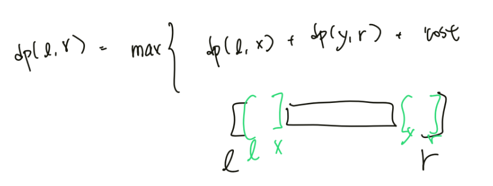
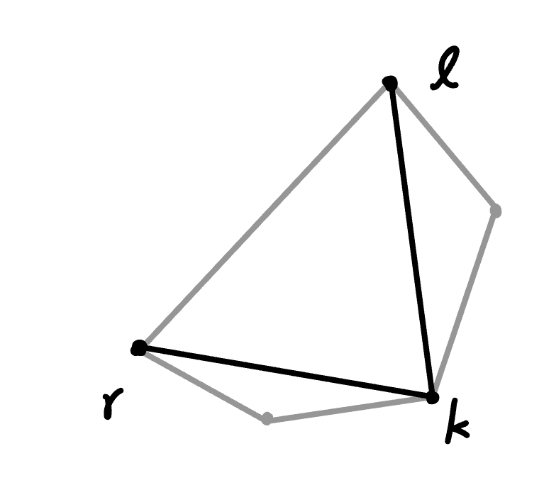
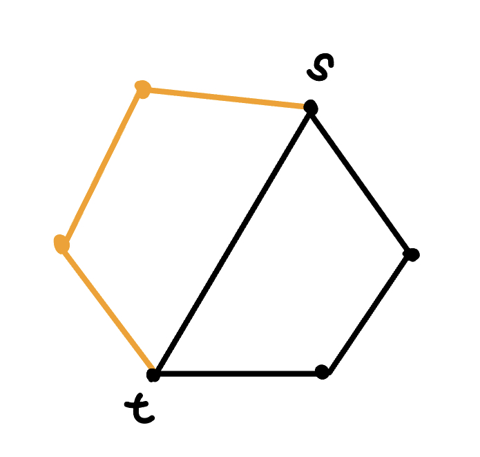
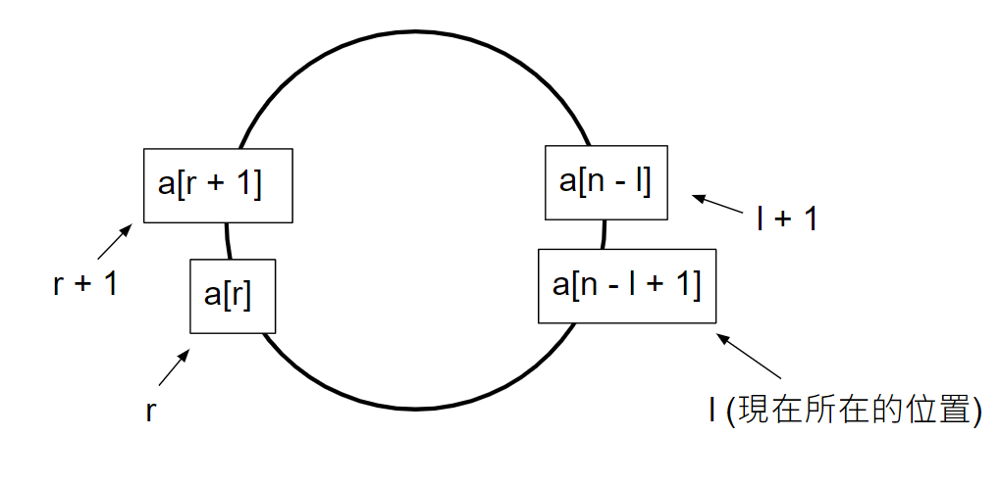

## 概念

區間類動態規劃是線性動態規劃的擴展，它在分階段地劃分問題時，與階段中元素出現的順序和前一階段的哪些元素合併而來有很大的關係。 設狀態 $dp(l, r)$ 表示將 $a_l,\ldots ,a_r$ 的所有元素合併所能得到的最大價值，則 $dp(l, r)=\max\{dp(l, k) + dp(k+1, r)+\text{cost}(l, r)\}$，$cost(l, r)$ 為將這兩組元素合併起來的代價。

## 題目

???+note "[CF 1025 D. Recovering BST](https://codeforces.com/problemset/problem/1025/D)"
	給一個長度為 $n$ 的中序陣列 $a_1,\ldots ,a_n$，問是否能組出一顆 BST 滿足相鄰兩點的 $\gcd (a_i, a_j)=1$
	
	$2\le n\le 700, 2\le a_i \le 10^9$
	
	??? note "思路"
		令 L(i, j) 為以 j 為根，[i, j - 1] 當左子樹是否能組出一顆合法 BST
		
		令 R(i, j) 為以 i 為根，[i + 1, j] 當右子樹是否能組出一顆合法 BST
		
		對於一個區間 [l, r]，枚舉 k 當 [l, r] 的根（用 L(l, k) && R(k, r) 判斷），看看是 k 否能接到 l - 1 的右子樹或 r + 1 的左子樹，可行則分別設 R(l - 1, k) = true，或 L(k, r + 1) = true
		
		可以先預處理 G(i, j) 代表 i 是否能與 j 連邊，在轉移時維護一個 ans(l, r) 代表 [l, r] 是否能組出一顆合法的 BST，最後輸出 ans(1, n) 即可

???+note "[2021 全國賽模擬賽 pF. 鬧鐘設置 (F_Alarm_Clock)](https://drive.google.com/file/d/1KAaPOYdzBuoC0hXdFwS5W0ZEItY61ktk/view)"
	給一個長度 $n$ 的陣列 $a_1, \ldots ,a_n$，你可以在每個位置 $k+1\le i\le n - k$ 都設置任意個鬧鐘，並決定每個鬧鐘什麼時候要響，每個鬧鐘的影響範圍是 $[i-k, i+k]$，某一個位置 $j$ 的起床時間是影響到他的所有鬧鐘中，最早響的時間，而這個時間必須 $\le a_j$。求最大的起床時間總和。
	
	$1\le n\le 500 , 2k+1\le n, 1\le a_i\le 10^6$
	
	??? note "思路"
		$dp(l,r)=[l,r]$ 範圍內的答案，轉移就是找到區間裡最小，那個後枚舉 $[i-k, i+k]$ 滿足有覆蓋到最小的（鬧鐘可以設置在 $[l, r]$ 之外），且沒有設置在最前面與最後面不合法的區段，然後 $[i-k, i+k]$ 以外的兩個區間就是子問題。
		
		<figure markdown>
	      { width="400" }
	    </figure>

???+note "[JOI 2015 Final 分蛋糕 2](https://loj.ac/p/2725)"
	有一個蛋糕，切成 $n$ 塊，第 $i$ 塊的大小是 $a_i$。首先，Alice 先拿一塊走，接著從 Bob 開始交替選，只能選擇左右至少有一塊已被選擇的蛋糕，當有多個選擇，Bob 會選比較大的，Alice 可以任意選。問 Alice 選的蛋糕大小總和最大是多少
	
	$1\le n\le 2000, 1\le a_i \le 10^9$
	
	??? note "思路"
		dp(l, r) = 取完 [l, r]，Alice 的分數 - Bob 的分數的 max
		
		然後從長度小到長度大轉移即可，注意是環，所以我們自然會把長度弄成 2n，但 $dp(1, *)$ 也是要考慮往左轉移的 case，我的處理方法是將 a[0] = a[n]，然後最後的答案不計入 $dp(0, *)$ 即可
		
	??? note "code"
		```cpp linenums="1"
		#include <bits/stdc++.h>
	    #define int long long
	    #define pii pair<int, int>
	    #define pb push_back
	    #define mk make_pair
	    #define F first
	    #define S second
	    #define ALL(x) x.begin(), x.end()
	
	    using namespace std;
	
	    const int INF = 4e18;
	    const int maxn = 4e3 + 10;
	
	    int n;
	    int sum;
	    int a[maxn], dp[maxn][maxn];
	
	    signed main() {
	        cin >> n;
	        for (int i = 1; i <= n; i++) {
	            cin >> a[i];
	            sum += a[i];
	        }
	        for (int i = n + 1; i <= 2 * n; i++) {
	            a[i] = a[i - n];
	        }
	        for (int l = 0; l < maxn; l++)  {
	            for (int r = 0; r < maxn; r++) {
	                dp[l][r] = -INF;
	            }
	        }
	        for (int i = 1; i <= 2 * n; i++) {
	            dp[i][i] = a[i];
	        }
	        a[0] = a[n];
	        for (int len = 1; len <= n - 1; len++) {
	            for (int l = 1; l + len - 1 < 2 * n; l++) {
	                int r = l + len - 1;
	                if (len & 1) {
	                    int mx = max(a[l - 1], a[r + 1]);
	                    if (mx == a[r + 1]) {
	                        dp[l][r + 1] = max(dp[l][r + 1], dp[l][r] - mx);
	                    } else {
	                        dp[l - 1][r] = max(dp[l - 1][r], dp[l][r] - mx);
	                    }
	                } else {
	                    dp[l - 1][r] = max(dp[l][r] + a[l - 1], dp[l - 1][r]);
	                    dp[l][r + 1] = max(dp[l][r] + a[r + 1], dp[l][r + 1]);
	                }
	            }
	        }
	        int ans = -INF;
	        // me: 9, u: 6
	        // dp: 3, sum = 15, val = (15 - 3) / 2 + 3
	        for (int i = 1; i <= n; i++) {
	            int val = (sum - dp[i][i + n - 1]) / 2 + dp[i][i + n - 1];
	            ans = max(val, ans);
	        }
	        cout << ans << "\n";
	    }
	    ```

???+note "[POI 2015 Car washes](https://loj.ac/p/2688)"
	有 $n$ 間商店，第 $i$ 間價格 $p_i$。有 $m$ 個消費者，第 $i$ 個會從 $p_{a_i},\ldots ,p_{b_i}$ 挑價格最小的，若價格 $\le c_i$ 就會買，反之不會。構造 $p$，使花錢總和最大

	$n\le 50, m\le 4000, 1\le c_i,p_i\le 5\times 10^5$
	
	??? note "思路"
		因為最佳解一定可以透過多個 $c_i$ 構成，所以我們可以先將 $c_i$ 離散化
	
	    $dp(l,r,k)=$ 所有區間 $[l,r]$ 內的消費者當區間最小值 $\ge k$ 時的總消費最小值
	    
	    $$
	    dp(i,j,k)=\min \limits_{i\le pos\le j} \{dp(i,pos-1,k)+dp(pos+1,j,k)+k\cdot g(pos,k) \}
	    $$
	
	    然後因為是 $\ge k$，所以也必須考慮從 $dp(i,j,k+1)$ 轉移過來的情況
	
	    其中 $g(pos,k)$ 表示: 在當前 $[l,r]$ 內的消費者中，經過了 $pos$ 且 $c_i\le k$ 的數量。這一部分消費者的貢獻就是 $k$
	
	    構造一組解的話，我們紀錄:
	
	    - $k$ 要往上跳到哪裡
	
	    - 斷點 $pos$ 的位置
	
	    最後用遞迴回溯答案
	    
	    > 參考自: <https://blog.csdn.net/qq_41996523/article/details/112477860>
	    
	??? note "code"
		```cpp linenums="1"
		#include <bits/stdc++.h>
	    #define int long long
	
	    using namespace std;
	
	    const int MAXN = 55, MAXM = 4005;
	    int n, m, a[MAXM], b[MAXM], c[MAXM], lsh[MAXM], tot;
	    int g[MAXN][MAXM], f[MAXN][MAXN][MAXM], pos[MAXN][MAXN][MAXM];
	    int lstk[MAXN][MAXN][MAXM], ans[MAXN];
	
	    void getans(int l, int r, int k) {
	        if (k > tot) {
	            return;
	        }
	        if (l > r) {
	            return;
	        }
	        k = lstk[l][r][k];
	        ans[pos[l][r][k]] = lsh[k];
	        getans(l, pos[l][r][k] - 1, k);
	        getans(pos[l][r][k] + 1, r, k);
	    }
	
	    signed main() {
	        cin >> n >> m;
	        for (int i = 1; i <= m; i++) {
	            cin >> a[i] >> b[i] >> c[i];
	            lsh[++tot] = c[i];
	        }
	
	        sort(lsh + 1, lsh + 1 + tot);
	        tot = unique(lsh + 1, lsh + 1 + tot) - lsh - 1;
	        for (int i = 1; i <= m; i++) {
	            c[i] = lower_bound(lsh + 1, lsh + 1 + tot, c[i]) - lsh;
	        }
	
	        for (int len = 1; len <= n; len++) {
	            for (int l = 1; l + len - 1 <= n; l++) {
	                int r = l + len - 1;
	                for (int i = 1; i <= n; i++) {
	                    for (int j = 1; j <= tot; j++) {
	                        g[i][j] = 0;
	                    }
	                }
	                for (int i = 1; i <= m; i++) {
	                    if (l <= a[i] && b[i] <= r) {
	                        g[a[i]][c[i]]++;
	                        g[b[i] + 1][c[i]]--;
	                    }
	                }
	                for (int i = 1; i <= n; i++) {
	                    for (int j = 1; j <= tot; j++) {
	                        g[i][j] += g[i - 1][j];
	                    }
	                }
	                for (int i = 1; i <= n; i++) {
	                    for (int j = tot; j >= 1; j--) {
	                        g[i][j] += g[i][j + 1];
	                    }
	                }
	                for (int k = tot; k >= 1; k--) {
	                    for (int p = l; p <= r; p++) {
	                        int val = (p > l ? f[l][p - 1][k] : 0) + (p < r ? f[p + 1][r][k] : 0) + lsh[k] * g[p][k];
	                        if (f[l][r][k] <= val) {
	                            f[l][r][k] = val;
	                            pos[l][r][k] = p;
	                        }
	                    }
	                    if (f[l][r][k] >= f[l][r][k + 1]) {
	                        lstk[l][r][k] = k;
	                    } else {
	                        f[l][r][k] = f[l][r][k + 1];
	                        lstk[l][r][k] = lstk[l][r][k + 1];
	                    }
	                }
	            }
	        }
	        cout << f[1][n][1] << '\n';
	        getans(1, n, 1);
	        for (int i = 1; i <= n; i++) {
	            cout << ans[i] << ' ';
	        }
	    }
		```

???+note "[CF 1312 E. Array Shrinking](https://codeforces.com/problemset/problem/1312/E) "
	給一個長度為 $n$ 的序列 $a_1, \ldots ,a_n$，相鄰的兩個 $a_i$ 若相等可以合併成一個元素 $a_i+1$，問最後最少可以剩下多少個元素。

	$n\le 500, 1\le a_i\le 1000$
	
	??? note "思路"
		這裡需要用到一個結論: 對於一個區間，如果它可以被合成一個數，那麼它被合成的數是唯一的。
	
	    > 證明:
	    >
	    > 若將一個數 $a_i$ 定義成 $2^{a_i}$，那麼不管怎麼合併總和都是一樣的
	
	    令 $dp(l,r)$ 為 $a_l,\ldots ,a_r$ 最後最多可以剩多少元素，$f(l,r)$ 為 $a_l,\ldots ,a_r$ 若可以最後會合併成什麼數字。轉移式
	    
	    $$
	    dp(l,r)=\min\{dp(l,k)+dp(k+1,r) \}
	    $$
	    
	    若 $dp(l,k)=1$ 且 $dp(k+1,r)=1$ 且 $a_{l,k}=a_{k+1,r}=1$，才可讓 $dp(l,r)=1,a_{l,r}=a_{l,k}+1$

???+note "[2023 TOI 二模 pB. 圓周拉弦（chord）](https://drive.google.com/file/d/15bXJ8w5d_W4iY9dGOi7gotmnUURG8Rm8/view)"
	有一個圓，上面有 $n$ 個等分點，連起兩個點 $i,j$ 所得到的 cost 是 $w_i + w_j \pmod k$，在連線只能交在端點的情況下，求最大分數。

	$3\le n\le 500,2\le k\le 500,0\le w_i\le k$
	
	??? note "思路"
		$dp(l,r)=$ 只能在 $l,\ldots ,r$ 之間連線的最大 cost
	
	    轉移式則枚舉中間的斷點，兩邊變成子問題，記得要加上 $l$ 與 $r$ 連接的 cost
	    
	    $$
	    dp(l,r)=\max \limits_{l<k<r}\{dp(l,k)+dp(k,r) \}+(w_l+w_r)\% k
	    $$
	    
	    <figure markdown>
	      { width="300" }
	    </figure>
	    
	    最後，答案就是枚舉起點與斷點 $s,t$，答案就是 $\max \{dp(s,t)+dp(t,s)-(w_s+w_t)\% k \}$
	    
	    <figure markdown>
	      { width="300" }
	    </figure>

???+note "[UVA 1626. Brackets Sequence](https://vjudge.net/problem/UVA-1626)"
	給一個長度 n 的括號序列 s，可任意增加括號，問最少增加幾次才能使 s 成為合法括號序列 ? 
	
	$n\le 100$
	
	??? note "思路"
		dp(l, r) = s[l..r] 最少要加入幾個括號可以變成合法的
		
		轉移的話我們分成看看能不能拆成前後兩段，不能的話代表一定是前後配對
		
		dp(l, r) = min{
		
		- dp(l, k) + dp(k + 1, r) // 可以分成前後兩段
	
		- dp(l + 1, r - 1) if ok(s[l], s[r]) // 前後兩個剛好可以配對
	
		- dp(l, r - 1) + 1 // 例如說 <font color="#00A2E8">[</font> ( [ ( ] 
	
		- dp(l + 1, r) + 1 // 例如說 ( [ ( ] <font color="#00A2E8">)</font>

???+note "[LeetCode 516. Longest Palindromic Subsequence](https://leetcode.com/problems/longest-palindromic-subsequence/)"
	給一個長度 n 的字串 s，問 s 的最長迴文子序列長度
	
	$n\le 1000$
	
	??? note "思路"
		令 dp(l, r) = s[l..r] 的最長迴文子序列長度
		
		考慮前後能不能配對在一起，若 s[l] == s[r] 就可以配對再一起，否則兩個不可能在同一組答案裡面，必須刪掉其中一個。注意到當 s[l] == s[r] 不用再考慮 dp(l+1, r), dp(l, r-1)，因為當 (l, r) 可以配對一定比 (l, r' < r) 來的更好
		
		dp(l, r) =
		
		- dp(l+1, r-1) + 2 if s[l] == s[r]
	
		- max(dp(l+1, r), dp(l, r-1)) else
	
	??? note "code"
		```cpp linenums="1"
		class Solution {
	       public:
	        int longestPalindromeSubseq(string str) {
	            int n = str.size();
	            vector<vector<int>> dp(n, vector<int>(n));
	            for (int i = 0; i < n; i++) dp[i][i] = 1;
	            for (int len = 2; len <= n; len++) {
	                for (int l = 0; l + len - 1 < n; l++) {
	                    int r = l + len - 1;
	                    if (str[l] == str[r]) {
	                        if (len == 2) {
	                            dp[l][r] = 2;
	                            continue;
	                        }
	                        dp[l][r] = dp[l + 1][r - 1] + 2;
	                    } else {
	                        dp[l][r] = max(dp[l + 1][r], dp[l][r - 1]);
	                    }
	                }
	            }
	            return dp[0][n - 1];
	        }
	    };
	    ```

???+note "Optimal Binary Search Tree [Atcoder DP Contest N - Slimes](https://atcoder.jp/contests/dp/tasks/dp_n)"
	有 $n$ 堆石子，分別有 $a_1, \ldots ,a_n$ 個，每次可以合併相鄰的石子，花費為兩堆石子數目之和，問最後剩下一堆的最少花費
	
	$2\le n\le 400, 1\le a_i \le 10^9$
	
	??? note "思路"
		dp(l, r) = 將 a[l..r] 合併成一堆石子的最小花費
		
		dp(l, r) = dp(l, k) + dp(k + 1, r) + cost(l, r)
		
		其中 cost(l, r) 就是將 a[l..k] 和 a[k+1..r] 合併的花費，也就是 a[l..r]
		
	??? note "code"
		```cpp linenums="1"
		#include <bits/stdc++.h>
	    #define int long long
	    using namespace std;
	
	    const int INF = (1LL << 60);
	    const int M = 1e9 + 7;
	    const int MAXN = 405;
	    int n;
	    int a[MAXN], psum[MAXN];
	
	    signed main() {
	        cin >> n;
	        vector<vector<int>> dp(n + 1, vector<int>(n + 1, INF));
	        for (int i = 1; i <= n; i++) {
	            cin >> a[i];
	            psum[i] =  psum[i - 1] + a[i];
	        }
	        for (int i = 1; i <= n; i++) {
	            dp[i][i] = 0;
	        }
	        for (int len = 2; len <= n; len++) {
	            for (int l = 1; l + len - 1 <= n; l++) { 
	                int r = l + len - 1;                  
	                for (int k = l; k < r; k++) {    
	                    dp[l][r] = min({dp[l][r], dp[l][k] + dp[k + 1][r]});
	                }
	                dp[l][r] += psum[r] - psum[l - 1];
	            }
	        }
	        cout << dp[1][n];
	    }
		```

???+note "[JOI 2020 集邮比赛 3](https://loj.ac/p/3254)"
	有一個周長為 $m$ 的園，有 $n$ 張郵票，第 $i$ 個張在 $a_i$，在 $t_i$ 內收集該郵票才算數。從起點開始，走順時針或逆時針最多可以收集到幾張郵票
	
	$1\le n\le 100, 2\le m \le 10^9, 0\le t_i\le 10^9$
	
	??? note "思路"
		n = 200，想到區間 dp，令 dp(l, r, k, 0 / 1) 為目前考慮的範圍為逆時針 l 個與順時針 r 個，當前在這個範圍內已經取得 k 張郵票，最後停在左端點/右端點的最小時間
		
		轉移的話我們考慮從 dp(l, r, k, 0) 往後轉移，我們先說往 l 延伸一個到 l + 1 的 case:
		
		<center>
		dp(l + 1, r, i + ok, 0) = min{dp(l, r, k, 0) + time(l, l + 1)}
		</center>
		
		其中 time(l, l + 1) = a[n - l + 1] - a[n - l]，ok = dp(l, r, k, 0) + time(l, l + 1) <= t[n - l]
		
		而若往 r 延伸一格到 r + 1 的話則是:
		
		<center>
		dp(l, r + 1, i + ok, 0) = min{dp(l, r, k, 0) + time(r, r + 1)}
		</center>
		
		其中 time(l, r + 1) = m - (a[n - l + 1] - a[r + 1])，ok = dp(l, r, k, 0) + time(r, r + 1) <= t[r + 1]
		
		<figure markdown>
	      { width="300" }
	    </figure>
	    
	    在實作上我們建立 a[0] = 0, a[n + 1] = m，讓我們有逆時針與順時針的起點
	    
	??? note "code"
		```cpp linenums="1"
		#include <bits/stdc++.h>
	    #define int long long
	
	    using namespace std;
	
	    inline int& min_to(int& a, int b) {
	        return a = min(a, b);
	    }
	
	    const int MAXN = 205;
	    int t[MAXN];
	    int a[MAXN];
	    int dp[MAXN][MAXN][MAXN][2];
	
	    signed main() {
	        int n, m;
	        scanf("%d%d", &n, &m);
	        for (int i = 1; i <= n; i++) scanf("%d", a + i);
	        for (int i = 1; i <= n; i++) scanf("%d", t + i);
	        memset(dp, 0x3f, sizeof(dp));
	        dp[0][0][0][0] = dp[0][0][0][1] = 0;
	        a[n + 1] = m;
	        for (int len = 0; len < n; len++) {
	            for (int l = 0; l <= n; l++) {
	                int r = len - l;
	                for (int k = 0; k <= n; k++) {
	                    if (dp[l][r][k][0] != 0x3f3f3f3f) {
	                        int tNow = dp[l][r][k][0];
	                        int time0 = tNow + a[n - l + 1] - a[n - l];
	                        int time1 = tNow + m - (a[n - l + 1] - a[r + 1]);
	                        bool canGet0 = time0 <= t[n - l];
	                        bool canGet1 = time1 <= t[r + 1];
	                        min_to(dp[l + 1][r][k + canGet0][0], time0);
	                        min_to(dp[l][r + 1][k + canGet1][1], time1);
	                    }
	                    if (dp[l][r][k][1] != 0x3f3f3f3f) {
	                        int tNow = dp[l][r][k][1];
	                        int time1 = tNow + a[r + 1] - a[r];
	                        int time0 = tNow + m - (a[n - l] - a[r]);
	                        bool canGet0 = time0 <= t[n - l];
	                        bool canGet1 = time1 <= t[r + 1];
	                        min_to(dp[l + 1][r][k + canGet0][0], time0);
	                        min_to(dp[l][r + 1][k + canGet1][1], time1);
	                    }
	                }
	            }
	        }
	        int ans = 0;
	        for (int l = 0; l <= n; l++) {
	            for (int r = 0; r <= n; r++) {
	                for (int i = 0; i <= n; i++) {
	                    if (dp[l][r][i][0] != 0x3f3f3f3f || dp[l][r][i][1] != 0x3f3f3f3f) {
	                        ans = max(ans, i);
	                    }
	                }
	            }
	        }
	
	        printf("%d\n", ans);
	    }
		```

???+note "[洛谷 P1220 关路灯](https://www.luogu.com.cn/problem/P1220)"
	有 n 個路燈，第 i 個路燈在 a[i]，功率為 w[i]，一開始在第 i 個燈，每走一單位需要花一秒，問最少耗多少電力可以關完全部的燈
	
	$n\le 50, 1\le w_i \le 100$
	
	??? note "思路"
		令 dp(l, r, 0 / 1) = 關完 l, ..., r 的燈，最後在 a[l] / a[r] 上的最小**全局**耗電量
		
		轉移的話就看能不能往左，往右擴展，cost 就是在 [l, r] 外的功率總和乘上轉移要走的時間，詳見代碼
		
	??? note "code"
		```cpp linenums="1"
		#include <bits/stdc++.h>
	    #define int long long
	    using namespace std;
	
	    const int N = 55;
	    int n, c;
	    int a[N], w[N], pre[N];
	    int dp[N][N][2];
	
	    int cal(int i, int j, int l, int r) {
	        return (a[j] - a[i]) * (pre[l] + pre[n] - pre[r - 1]);
	    }
	
	    signed main() {
	        cin >> n >> c;
	        memset(pre, 0, sizeof(pre));
	        memset(dp, 0x3f, sizeof(dp));
	        for (int i = 1; i <= n; i++) {
	            cin >> a[i] >> w[i];
	            pre[i] = pre[i - 1] + w[i];
	        }
	        dp[c][c][1] = dp[c][c][0] = 0;
	        for (int len = 2; len <= n; len++) {
	            for (int l = 1; l <= n; l++) {
	                int r = l + len - 1;
	                if (r > n) {
	                    break;
	                }
	                dp[l][r][0] = min(dp[l + 1][r][0] + cal(l, l + 1, l, r + 1), dp[l + 1][r][1] + cal(l, r, l, r + 1));
	                dp[l][r][1] = min(dp[l][r - 1][0] + cal(l, r, l - 1, r), dp[l][r - 1][1] + cal(r - 1, r, l - 1, r));
	            }
	        }
	        cout << min(dp[1][n][0], dp[1][n][1]) << '\n';
	    }
	    ```
	    
[CF 149 D. Coloring Brackets](https://codeforces.com/problemset/problem/149/D) 
給一個合法括號序列 s，問 s 有幾種染色方法。染色規則如下:

1. 一個括號可以染紅色、藍色或不染色
2. 一對匹配的括號需要且只能將其中一個染色
3. 相鄰兩個括號顏色不能相同（但可以都不染色）

$|s|\le 700$


先執行括號配對，令 r_match[i] 為第 i 個括號的配對括號。定義 dp(l, r, p, q) = s[l] 的顏色為 p，s[r] 的顏色為 q，區間 [l, r] 的塗色方法數，其中 p, q 的值為 0 時代表不染色，為 1 時代表藍色，為 2 時代表紅色。

首先是初始條件：如果 r = l + 1，那麼 [l,r] 一定是一對匹配的括號。所以我們設定 dp(l, r 0, 0) = dp(l, r, 1, 2) = dp(l, r, 2, 1) = dp(l, r, 2, 2) = 0

轉移的時候，需要分類討論：

1. 如果第 l 個括號剛好跟第 r 個括號配對

	以 dp(l, r, 0, 1) 為例：由於左端點不染色，右端點是 1，所以它不能 dp(l + 1, r - 1, *, 1) 轉移過來，否則相鄰兩個括號的顏色相同，就不符合條件了。那麼我們從 0 到 2 枚舉 i,j，然後看 i, j 的值來一個一個轉移即可。
	
```cpp
for (int i = 0; i <= 2; i++) {
    for (int j = 0; j <= 2; j++) {
        if (j != 1) dp[l][r][0][1] += dp[l + 1][r - 1][i][j], dp[l][r][0][1] %= mod;
        if (j != 2) dp[l][r][0][2] += dp[l + 1][r - 1][i][j], dp[l][r][0][2] %= mod;
        if (i != 1) dp[l][r][1][0] += dp[l + 1][r - 1][i][j], dp[l][r][1][0] %= mod;
        if (i != 2) dp[l][r][2][0] += dp[l + 1][r - 1][i][j], dp[l][r][2][0] %= mod;
    }
}
```

2. 如果第 l 個括號剛好跟第 r 個括號不配對

    例如說 ( ... ) (...)。我們找出與第 l 個括號配對的括號，分別處理出區間 [l, r_match[l]] 的方案數與 [r_match[l] + 1, r] 的方案數，然後相乘即可。需要注意的是 r_match[l] 與 r_match[l] + 1 處的括號顏色不能相同，這種情況需要特判。
    
```cpp
for (int i = 0; i <= 2; i++) {
    for (int j = 0; j <= 2; j++) {
        for (int p = 0; p <= 2; p++) {
            for (int q = 0; q <= 2; q++) {
                // r_match[l] 與 r_match[l] + 1 處的括號顏色相同
                if ((j == 1 && p == 1) || (j == 2 && p == 2)) continue;  
                dp[l][r][i][q] += (dp[l][r_match[l]][i][j] * dp[r_match[l] + 1][r][p][q] % mod);
                dp[l][r][i][q] %= mod;
            }
        }
    }
}
```

那麼，轉移方式就弄好！ 有一個需要注意的點就是：轉移順序最好是以記憶化搜尋（Top Down）的順序來，不然的話會很麻煩。

```cpp
#include <bits/stdc++.h>
#define int long long

using namespace std;

const int MAXN = 800;
string s;
int dp[MAXN][MAXN][5][5], r_match[MAXN];
stack<int> stk;

const int mod = 1000000007;

void dfs(int l, int r) {
    if (r == l + 1) {
        dp[l][r][0][1] = dp[l][r][0][2] = dp[l][r][1][0] = dp[l][r][2][0] = 1;
    } else if (r_match[l] == r) {
        dfs(l + 1, r - 1); 
        for (int i = 0; i <= 2; i++) {
            for (int j = 0; j <= 2; j++) {
                if (j != 1) dp[l][r][0][1] += dp[l + 1][r - 1][i][j], dp[l][r][0][1] %= mod;
                if (j != 2) dp[l][r][0][2] += dp[l + 1][r - 1][i][j], dp[l][r][0][2] %= mod;
                if (i != 1) dp[l][r][1][0] += dp[l + 1][r - 1][i][j], dp[l][r][1][0] %= mod;
                if (i != 2) dp[l][r][2][0] += dp[l + 1][r - 1][i][j], dp[l][r][2][0] %= mod;
            }
        }
    } else {
        dfs(l, r_match[l]);
        dfs(r_match[l] + 1, r);
        for (int i = 0; i <= 2; i++) {
            for (int j = 0; j <= 2; j++) {
                for (int p = 0; p <= 2; p++) {
                    for (int q = 0; q <= 2; q++) {
                        if ((j == 1 && p == 1) || (j == 2 && p == 2)) continue;
                        dp[l][r][i][q] += (dp[l][r_match[l]][i][j] * dp[r_match[l] + 1][r][p][q] % mod);
                        dp[l][r][i][q] %= mod;
                    }
                }
            }
        }
    }
}

signed main() {
    cin >> s;
    int n = s.size();
    s = "$" + s;
    for (int i = 1; i <= n; i++) {
        if (s[i] == '(') {
            stk.push(i);
        } else {
            r_match[stk.top()] = i;
            r_match[i] = stk.top();
            stk.pop();
        }
    }

    dfs(1, n);
    int ans = 0;
    for (int i = 0; i <= 2; i++) {
        for (int j = 0; j <= 2; j++) {
            ans += dp[1][n][i][j];
            ans %= mod;
        }
    }
    cout << ans << '\n';
}
```