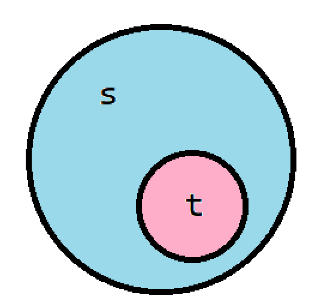
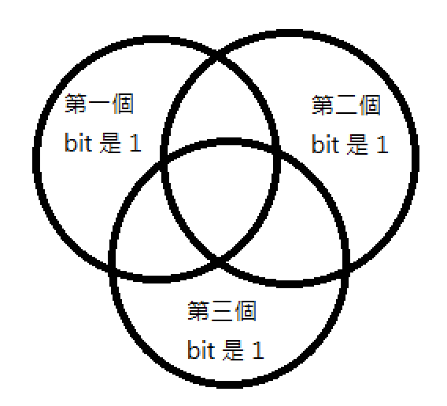

## 名詞解釋

T 是 S 的子集（subset），反過來，集合 S 就是 T 的一個超集（superset）

<figure markdown>
  { width="200" }
</figure>

## 引入

???+note "Subset of Subset"
	對於每個 mask $S$ 求 
	

	$$
	f[S]=\sum \limits_{S\space \subseteq \space T} w[T]
	$$

### 法 1: 枚舉子集的子集

內層 popcount 為 $x$ 的 mask 需要花 $O(2^x)$，共有 $C^n_x$ 個，總計 $O\left( \sum \limits_{x=0}^n C^n_x 2^x\right)$

又根據二項式定理，$(1+a)^n=\sum \limits_{x=0}^n C^n_x a^x$，則 $O\left ( \sum \limits_{x=0}^n C^n_x 2^x = (1+2)^n=3^n\right )$

???+note "code"
	```cpp linenums="1"
	for (int mask = 0; mask < (1 << n); mask++) {
		// 給一個 mask，枚舉他的所有子集合
		for (int S = mask; ; S = (S - 1) & mask) {
			// TODO
			if (S == 0) break;
        }
    }
    ```

### 法 2 : sos dp

又稱高維前綴和。

dp(mask, i) : 只枚舉 mask 的 [0, i] 而其餘不動的總和

dp(S, i) : 看第 i 位選不選

- if (S & (1<<i)) dp(S, i) = dp(S, i-1) + dp(S ^ (1<<i), i-1)

- else dp(S, i) = dp(S, i-1)

???+note "code"
	```cpp linenums="1"
	for (int i = 0; i < n; i++) {
		f[a[i]]++;
	}

    for (int i = 0; i < 21; i++) {
        for (int mask = 0; mask < (1 << 21); mask++) {
            if (mask & (1 << i)) {
            	f[mask] += f[mask ^ (1 << i)];
            }
        }
    }
    ```

### 技巧 : 枚舉超集

???+note "問題"
	給一個陣列 $a_1,\ldots ,a_n$，對於每個 $i$ 問有沒有 $a_i$ & $a_j=a_i$
	
舉例來說，若 
    
- x = 1101001
- y = 11<font style="color:#00A2E8">0</font>1<font style="color:#00A2E8">0</font><font style="color:#00A2E8">0</font>1

y 只能在藍色的部分從 0 變 1，代表若 0, 1 顛倒後 y 就要是 x 的 subset

- (~x) = 0010110
- (~y) = 00<font style="color:#00A2E8">1</font>0<font style="color:#00A2E8">1</font><font style="color:#00A2E8">1</font>0

所以答案就是 subset of (~$x$) in set(~$a_i$)

為了之後方便使用，以下的 code 令 f[i] 為 x & i = i 的 x 的數量

??? note "code"
	```cpp linenums="1"
	vector<int> build() {
        vector<int> f((1LL << 21) + 1);
        for (int i = 0; i < n; i++) {
            f[a[i]]++;
        }
        for (int i = 0; i < 21; i++) {
            for (int mask = (1LL << 21) - 1; mask >= 0; mask--) {
                if (!(mask & (1 << i))) {
                    f[mask] = f[mask] + f[mask ^ (1 << i)];
                }
            }
        }
        return f;
    }
	```

## 例題

### CSES Bit Problem

???+note "[CSES - Bit Problem](https://cses.fi/problemset/task/1654)"
    對於每筆 $\text{query}(x)$ 分別計算以下的 $y$ 的數量
    
    - $x \mid y = x$
    
    - $x\mathrel{\&} y=x$
    
    - $x \mathrel{\&} y \neq 0$ 
    
    ??? note "思路"
        > subtask : x | y = x
    
        裸 sos dp
        
        > subtask : x & y = x
    
        上面的超集 sos dp
    
        > subtask : x & y ≠ 0
    
        ans = n - subset of (~x) in set(~a[i])
        
    ??? note "code"
    	```cpp linenums="1"
    	#include <bits/stdc++.h>
        #define int long long
        #define pii pair<int, int>
        #define pb push_back
        #define mk make_pair
        #define F first
        #define S second
        #define ALL(x) x.begin(), x.end()
    
        using namespace std;
        using PQ = priority_queue<int, vector<int>, greater<int>>;
    
        const int INF = 2e18;
        const int maxn = 3e5 + 5;
        const int M = 1e9 + 7;
        const int C = (1LL << 21) - 1;
    
        int n;
        int F[(1LL << 21) + 2], R[(1LL << 21) + 2];
        int a[maxn];
    
        void build () {
            for (int i = 0; i < n; i++) F[a[i]]++;
    
            for (int i = 0; i < 21; i++) {
                for (int mask = 0; mask < (1 << 21); mask++) {
                    if (mask & (1 << i))
                        F[mask] += F[mask ^ (1 << i)];
                }
            }
    
            for (int i = 0; i < n; i++) R[C ^ a[i]]++;
    
            for (int i = 0; i < 21; i++) {
                for (int mask = 0; mask < (1 << 21); mask++) {
                    if (mask & (1 << i))
                        R[mask] += R[mask ^ (1 << i)];
                }
            }
        }
    
        void init () {
            cin >> n;
            for (int i = 0; i < n; i++) cin >> a[i];
        }
    
        void solve () {
            build ();
            for (int i = 0; i < n; i++) {
                int Q1 = F[a[i]];
                int Q2 = R[C ^ a[i]];
                int Q3 = n - F[C ^ a[i]];
                cout << Q1 << " " << Q2 << " " << Q3 << "\n";
            }
        } 
    
        signed main() {
            // ios::sync_with_stdio(0);
            // cin.tie(0);
            int t = 1;
            //cin >> t;
            while (t--) {
                init();
                solve();
            }
        } 
    	```

### CF Compatible Numbers

???+note "[CF 449 D. Jzzhu and Numbers](https://codeforces.com/contest/449/problem/D)"
	給一個長度為 $n$ 的陣列 $a_1,\ldots ,a_n$，問有幾個子序列滿足 $a_{i_1}$ & $a_{i_2}$ & $\ldots$ & $a_{i_k}=0$
	
	$1\le n\le 10^6,0\le a_i\le 10^6$
	
	??? note "思路"
		令 d[i] 為 x & i = i 的 x 的數量，共可湊出 2^d[i]-1 種子集。
	
		因為正著做不好做，我們考慮讓 「ans = 全部 - 至少 1 個 bit 是 1」
		
		但 SOS dp 是會重複算的，例如 11 會在 d[10], d[01] 都被算過一遍
		
		考慮排容 : ans = 全部 - 至少 1 個 bit 是 1 + 至少 2 個 bit 是 1 - 至少 3 個 bit 是 1
		
		<figure markdown>
	      { width="300" }
	    </figure>
	    
	    所以我們只要枚舉 i = [1, C]，看 popcount(i) 是奇數還偶數，將貢獻加或減 2^d[i]-1 即可
	    
	??? note "code"
		```cpp linenums="1"
		#include <bits/stdc++.h>
        #define int long long
        #define pii pair<int, int>
        #define pb push_back
        #define mk make_pair
        #define F first
        #define S second
        #define ALL(x) x.begin(), x.end()

        using namespace std;

        const int INF = 2e18;
        const int maxn = 1e6 + 5;
        const int M = 1e9 + 7;

        int n;
        int a[maxn];

        vector<int> build() {
            vector<int> f((1LL << 21) + 1);
            for (int i = 0; i < n; i++) {
                f[a[i]] = (f[a[i]] + 1) % M;
            }
            for (int i = 0; i < 21; i++) {
                for (int mask = (1LL << 21) - 1; mask >= 0; mask--) {
                    if (!(mask & (1 << i))) {
                        f[mask] = (f[mask] + f[mask ^ (1 << i)]) % M;
                    }
                }
            }
            return f;
        }

        int fpow(int a, int b) {
            int ret = 1;
            while (b != 0) {
                if (b & 1) ret = (ret * a) % M;
                a = (a * a) % M;
                b >>= 1;
            }
            return ret;
        }

        signed main() {
            cin >> n;
            for (int i = 0; i < n; i++) {
                cin >> a[i];
            }
            vector<int> f = build();

            int ans = 0;
            for (int i = 0; i < (1 << 21); i++) {
                if (__builtin_popcount(i) & 1) {
                    ans = ((ans - (fpow(2, f[i]) - 1)) % M + M) % M;
                } else {
                    ans = ((ans + (fpow(2, f[i]) - 1)) % M + M) % M;
                }
            }
            cout << ans << '\n';
        } 
	    ```

### CF Bits And Pieces

???+note "[CF 1208F Bits And Pieces](https://codeforces.com/problemset/problem/1208/F)"
	給一個長度為 $n$ 的陣列 $a_1,\ldots ,a_n$，輸出 $i<j<k$ 時最大的 $a_{i} \mid ( a_{j} \mathrel{\&} a_{k} )$ 
	
	$3\le n\le 10^6,0\le a_i\le 2\times 10^6$
	
	??? note "思路"
		d[i]: 維護最大的兩個 index
	
		對於每個 $a_i$，greedy 的從高位到低位看 d[x].S 是否大於 i
		
	??? note "code"
		```cpp linenums="1"
		#include <bits/stdc++.h>
	    #define int long long
	    #define pii pair<int, int>
	    #define pb push_back
	    #define mk make_pair
	    #define F first
	    #define S second
	    #define ALL(x) x.begin(), x.end()
	
	    using namespace std;
	
	    const int INF = 2e18;
	    const int maxn = 1e6 + 5;
	    const int M = 1e9 + 7;
	    const int C = (1LL << 21) - 1;
	
	    int n;
	    int a[maxn];
	
	    pii sec(pii p, int x) {
	        if (x > p.F) {
	            p.S = p.F;
	            p.F = x;
	        } else if (x > p.S) {
	            p.S = x;
	        }
	        return p;
	    }
	
	    vector<pii> build() {
	        vector<pii> f(C + 1, {-1, -1});
	        for (int i = 0; i < n; i++) {
	            f[C ^ a[i]] = sec(f[C ^ a[i]], i);
	        }
	        for (int i = 0; i < 21; i++) {
	            for (int mask = 0; mask < (1 << 21); mask++) {
	                if (mask & (1 << i)) {
	                    f[mask] = sec(f[mask], f[mask ^ (1 << i)].F);
	                    f[mask] = sec(f[mask], f[mask ^ (1 << i)].S);
	                }
	            }
	        }
	        vector<pii> d(C + 1);
	        for (int mask = 0; mask < (1 << 21); mask++) { 
	            d[mask] = f[C ^ mask];
	        }
	        return d;
	    }
	
	    signed main() {
	        cin >> n;
	        for (int i = 0; i < n; i++) {
	            cin >> a[i];
	        }
	        vector<pii> dp = build();
	
	        int ans = 0;
	        for (int i = 0; i < n - 2; i++) {
	            int res = 0, ret = 0;
	            for (int j = 20; j >= 0; j--) {
	                if (a[i] & (1 << j)) {
	                    res |= (1 << j);
	                    continue;
	                } else {
	                    if (dp[ret | (1 << j)].S > i) {
	                        ret |= (1 << j);
	                        res |= (1 << j);
	                    }
	                }
	            }
	            ans = max(ans, res);
	        }
	        cout << ans << '\n';
	    } 
	    ```

### JOI 2018 p5

???+note "[JOI 2018 Final p5. 毒蛇越狱](https://loj.ac/p/2351)"
	給你 $n$ 與陣列 $w$，從 $[0,2^n-1]$ 的每個數字 $i$ 都有對應的 $w[i]$。有 $q$ 筆查詢 : 
	
	

	- 給一個長度為 $n$，由 `0`, `1`, `?` 組成的二進制，`?` 可以是 `0` or `1`。問可以組出的數字的 $w$ 加總起來是多少
	
	$1\le n\le 20,1\le q\le 10^6$
	
	??? note "思路"
	    最主要的觀察是鴿籠原理，$n\le 20$ 代表 `0` `1` `?` 最少的最大出現次數是 6。所以看 `0` `1` `?` 哪個比較少就用哪個下手
	    
		calculate ?：枚舉 ? 選什麼，然後算答案。這樣子是 $O(2^{\text{cnt[?]}})$ 的。		
		calculate 1：考慮沒有 1 的話，我們只需要算 ? 的子集和。現在有了 1，我們只需要將其容斥掉即可。這樣子是 $O(2^{\text{cnt[1]}})$ 的。
		
		calculate 0：考慮沒有 0 的話，我們只需要算 ? 的超集和。現在有了 0，我們同樣只需要將其容斥掉即可。這樣子是 $O(2^{\text{cnt[0]}})$ 的。
		
	??? note "code"
		```cpp linenums="1"
		#include <bits/stdc++.h>
	    #define int long long
	    #define pii pair<int, int>
	    #define pb push_back
	    #define mk make_pair
	    #define F first
	    #define S second
	    #define ALL(x) x.begin(), x.end()
	
	    using namespace std;
	
	    const int INF = 2e18;
	    const int maxn = (1 << 20) + 1;
	    const int M = 1e9 + 7;
	
	    string s;
	    int n, q;
	    int f[maxn], g[maxn];
	
	    void build() {
	        for (int i = 0; i < (1 << n); i++) {
	            f[i] += s[i] - '0';
	            g[i] += s[i] - '0';
	        }
	
	        for (int i = 0; i < n; i++) {
	            for (int mask = 0; mask < (1 << n); mask++) {
	                if (mask & (1 << i)) {
	                    f[mask] += f[mask ^ (1 << i)];
	                }
	            }
	        }
	        for (int i = 0; i < n; i++) {
	            for (int mask = (1 << n) - 1; mask >= 0; mask--) {
	                if (!(mask & (1 << i))) {
	                    g[mask] += g[mask ^ (1 << i)];
	                }
	            }
	        }
	    }
	
	    int solver(string t) {
	        int cntq = 0, maskq = 0, cnt0 = 0, mask0 = 0, cnt1 = 0, mask1 = 0;
	        for (int i = 0; i < n; i++) {
	            if (t[i] == '?') {
	                maskq |= (1 << (n - i - 1));
	                cntq++;
	            } else if (t[i] == '0') {
	                mask0 |= (1 << (n - i - 1));
	                cnt0++;
	            } else if (t[i] == '1') {
	                mask1 |= (1 << (n - i - 1));
	                cnt1++;
	            }
	        }
	        int ans = 0;
	        if (cntq <= 6) {
	            int mask = 0;
	            for (int i = 0; i < n; i++) {
	                if (t[i] == '1') mask |= (1 << (n - i - 1));
	            }
	            ans = s[mask] - '0';
	            for (int S = maskq; S; S = (S - 1) & maskq) {
	                ans += s[S | mask] - '0';
	            }
	        } else if (cnt0 <= 6) {
	            int mask = 0;
	            for (int i = 0; i < n; i++) {
	                if (t[i] == '1') mask |= (1 << (n - i - 1));
	            }
	            ans = g[mask];
	            for (int S = mask0; S; S = (S - 1) & mask0) {
	                if (__builtin_popcountll(S) & 1) {
	                    ans -= g[S | mask];
	                } else {
	                    ans += g[S | mask];
	                }
	            }
	        } else if (cnt1 <= 6) {
	            int mask = 0;
	            for (int i = 0; i < n; i++) {
	                if (t[i] == '1' || t[i] == '?') mask |= (1 << (n - i - 1));
	            }
	            ans = f[mask];
	            for (int S = mask1; S; S = (S - 1) & mask1) {
	                if (__builtin_popcountll(S) & 1) {
	                    ans -= f[mask ^ S];
	                } else {
	                    ans += f[mask ^ S];
	                }
	            }
	        }
	        return ans;
	    }
	
	    signed main() {
	        cin >> n >> q;
	        cin >> s;
	
	        build();
	        while (q--) {
	            string t;
	            cin >> t;
	            cout << solver(t) << '\n';
	        }
	    } 
		```


---

## 資料

- [CF 詳細講解](https://codeforces.com/blog/entry/45223)

- [cnblog SOS DP 学习笔记](https://www.cnblogs.com/cyl06/p/SOSDP.html)