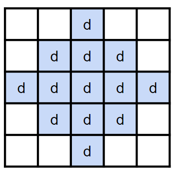
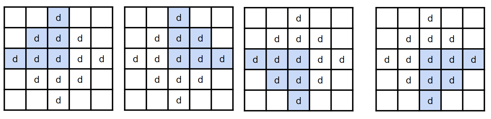
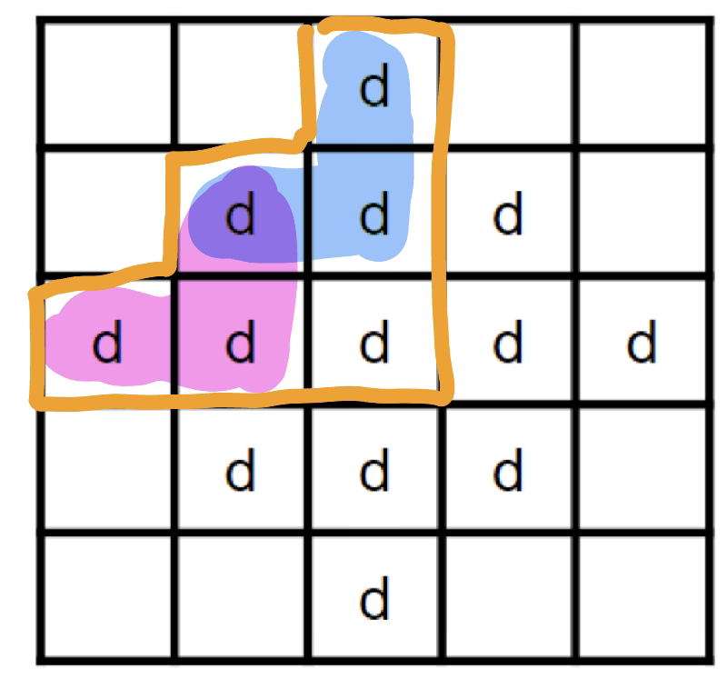

# 子矩形 DP

## 最大子正方形

???+note "[LeetCode 221. Maximal Square](https://leetcode.com/problems/maximal-square/)"
	給一個 n x m 的 01 方格圖，找出最大的正方形只包含 1
	
	n, m ≤ 300

## 最大子矩形

???+note "[Zerojudge b123. 最大矩形 (Area)](https://zerojudge.tw/ShowProblem?problemid=b123)"
	給一個 n x m 的 01方格圖，找出面積最大的**長方形**只包含 1。
	
	n, m ≤ 200

## 練習題

???+note "[CF 1393 D. Rarity and New Dress](https://codeforces.com/problemset/problem/1393/D)"
	給一個 n * m 的 grid，問可以選出幾個菱形，其中菱形內的字母都要一樣
	
	$n,m\le 2000$
	
	??? note "思路"
		<figure markdown>
          { width="200" }
        </figure>
        
        我們發現這個題目有點類似最大子正方形，但因為菱形不好計算 dp，我們換個角度想，把菱形拆成 4 個方向考慮
        
        <figure markdown>
          { width="600" }
        </figure>
        
        對於一個格子 (i, j) 來說，我們只要在 4 個方向各自用 dp 求出能產生的最大三角形，再取 min 就是能產生的最大菱形。以左上的 dp 來說，轉移式就是 dp(i, j) = min{dp(i - 1), dp(i, j - 1)} + 1
        
        <figure markdown>
          { width="200" }
        </figure>
        
    ??? note "code"
    	```cpp linenums="1"
    	#include <bits/stdc++.h>
        #define int long long

        using namespace std;

        const int MAXN = 2000 + 5;
        int a[MAXN][MAXN];
        int dp1[MAXN][MAXN], dp2[MAXN][MAXN], dp3[MAXN][MAXN], dp4[MAXN][MAXN];

        signed main() {
            int n, m;
            cin >> n >> m;
            for (int i = 1; i <= n; i++) {
                string s;
                cin >> s;
                for (int j = 1; j <= m; j++) {
                    a[i][j] = s[j - 1] - 'a' + 1;
                }
            }

            for (int i = 1; i <= n; i++) {
                for (int j = 1; j <= m; j++) {
                    if (a[i][j] == a[i - 1][j] && a[i][j] == a[i][j - 1]) {
                        dp1[i][j] = min(dp1[i - 1][j], dp1[i][j - 1]) + 1;
                    } else {
                        dp1[i][j] = 1;
                    }
                }
            }

            for (int i = 1; i <= n; i++) {
                for (int j = m; j >= 1; j--) {
                    if (a[i][j] == a[i - 1][j] && a[i][j] == a[i][j + 1]) {
                        dp2[i][j] = min(dp2[i - 1][j], dp2[i][j + 1]) + 1;
                    } else {
                        dp2[i][j] = 1;
                    }
                }
            }

            for (int i = n; i >= 1; i--) {
                for (int j = 1; j <= m; j++) {
                    if (a[i][j] == a[i + 1][j] && a[i][j] == a[i][j - 1]) {
                        dp3[i][j] = min(dp3[i + 1][j], dp3[i][j - 1]) + 1;
                    } else {
                        dp3[i][j] = 1;
                    }
                }
            }

            for (int i = n; i >= 1; i--) {
                for (int j = m; j >= 1; j--) {
                    if (a[i][j] == a[i + 1][j] && a[i][j] == a[i][j + 1]) {
                        dp4[i][j] = min(dp4[i + 1][j], dp4[i][j + 1]) + 1;
                    } else {
                        dp4[i][j] = 1;
                    }
                }
            }

            int ans = 0;
            for (int i = 1; i <= n; i++) {
                for (int j = 1; j <= m; j++) {
                    ans += min({dp1[i][j], dp2[i][j], dp3[i][j], dp4[i][j]});
                }
            }
            cout << ans << '\n';
        }
    	```


???+note "最大子正方形 變化 1"
	給一個 n x m 的 01 方格圖，可以將 row 兩兩 swap，可以做任意次，找出面積最大的正方形只包含 1
	
	??? note "hint"
		Hint: 對於每一個直行 (column)，若有超過 k 個以該 column 為結尾且長度超過  k 的橫列 (row)，則找到一個 k * k 的正方形
		
	??? note "思路"
		二分搜 k，對於每一個 column，檢查是否有超過 k 個以該 column 為結尾且長度超過 k 的橫列 row，複雜度 O(nm log n)
		
???+note "最大子正方形 變化 2"
	給一個 n x m 的 01 方格圖，可以將 row 兩兩 swap，也可以將 column 兩兩 swap，都可以做任意次，找出面積最大的正方形只包含 1
	
	??? note "思路"
		原題可轉為挑一些 row 子集和一些 col 子集，row 和 col 挑的數量相同，且這些 row col 交集處為全 1
	
		 dp(i, mask) = mask 這個 row 的集合中是 1 的位置在 column i 內是否都是 1 
		 
		預處理完上面的 dp 後，我們就只要去枚舉 row 的 mask，看 i = 1...n，滿足 dp(i, mask) 的數量是否大於等於 |mask| 即可，複雜度 O(2^n * m)，詳見代碼
		
    ??? note "code"
    	```cpp linenums="1"
    	for (int i = 0; i < m; i++) dp[i][0] = 1;
        int mx = 0;
        for (int mask = 1; mask < (1 << n); mask++) {
            int cnt = 0;
            int cur = __builtin_ctz(mask);
            int sz = __builtin_popcountll(mask);
            for (int i = 0; i < m; i++) {
                if (a[cur][i] == 1 && dp[i][mask ^ (1 << cur)]) {
                    dp[i][mask] = 1;
                    cnt++;
                }
            }
            if (cnt >= sz) {
                mx = max(mx, sz * sz);
            }
        }
        // mx is the final ans
        ```