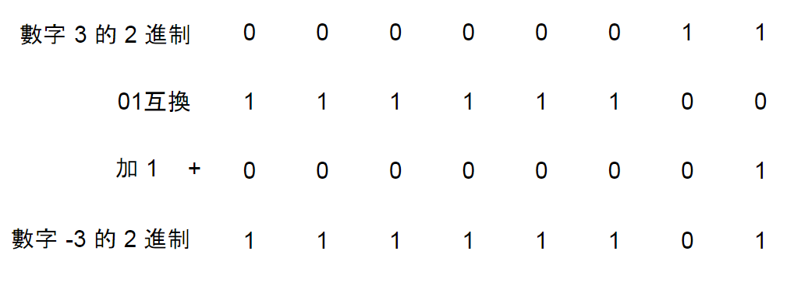
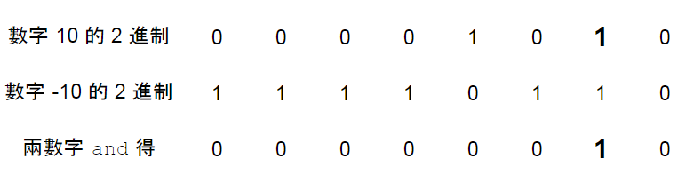

## 前置知識

### 負號的二進制

每位 01 互換再加 1, 可以轉換正負號，ex. 3 和 -3

<figure markdown>
  { width="500" }
</figure>

### lowbit 介紹

lowbit(x) :  二進制最靠右的 1

例如 6 = 01<font color="#00A2E8">1</font>0，lowbit(6) = 0010

### lowbit 運算

lowbit(x) = x & (-x)

<figure markdown>
  { width="500" }
</figure>

## 引入

!!! warning "BIT 一定要是 1-base"

### query

query(x) : 求 a[1, x] 區間的和

???+note "code"
	```cpp linenums="1"
    int query(int x) {
        int ret = 0;
        while (x > 0) {
            ret += bit[x];
            x -= lowbit(x);
        }
        return ret;
    }
    ```

### modify

modify(x, d) : a[x] 加上 d

???+note "code"
	```cpp linenums="1"
	void modify(int x, int d) {
        while (x <= n) {
            bit[x] += d;
            x += lowbit(x);
        }
    }
    ```

### 模板

???+note "code"
	```cpp linenums="1"
    struct BIT {
        #define lowbit(x) (x & (-x))
        int n;
        vector<int> bit;

        void build(int _n) {
            n = _n;
            bit.resize(n + 1);
        }
        int query(int x) {
            int ret = 0;
            while (x > 0) {
                ret += bit[x];
                x -= lowbit(x);
            }

            return ret;
        }
        void add(int x, int d) {
            while (x <= n) {
                bit[x] += d;
                x += lowbit(x);
            }
        }
    }; 
    ```

## BIT 支援操作

query 的區間只能是前綴, 僅能回答可由前綴組合出來的問題

1. 區間求和, 單點加值
2. 單點求和, 區間加值
3. 區間求和, 區間加值

### 區間求和, 單點加值

註 : 其實把加值變化一下可以支援單點改值

### 單點求和, 區間加值

把 bit 的看成是前綴和陣列，區間加值就用差分改兩個點，單點求和時就求 bit[1] + ... + bit[i]


