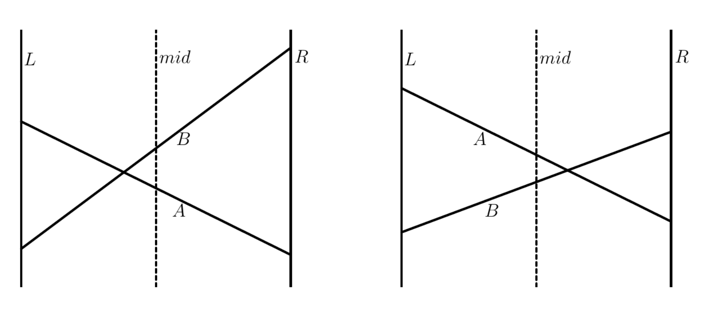

## 引入

李超線段樹主要解決平面座標系內有關直線的問題，李超線段樹是一種特殊的線段樹。

## 一、直線

???+note "[LOJ #2625. 「JSOI2008」Blue Mary 开公司](https://loj.ac/p/2625)"
	現在有 $q$ 個操作，每個操作會是以下兩種中的一種：
	
    - 插入一條直線 $y = mx + k$
    
    - 詢問一條直線 $x = t$ 與其它直線相交的點中，最大的 $y$ 座標
    
    $q\le 10^5$

我們發現，傳統的線段樹無法很好地維護這樣的資訊。這種情況下，李超線段樹便應運而生。我們對值域開線段樹，讓一個線段樹上的節點，都維護盡量好的直線，使得該節點維護的區間中點代入該直線後得到的值盡量大。具體來說，seg[i] 儲存的是，去除祖先節點儲存的直線後，在這個區段的 mid 位置數值最大的直線

<figure markdown>
  { width="500" }
</figure>

在左圖中，mid 代入 B 的值大於帶入 A 的值，根據李超線段樹的理念，我們得要留住 B 這條線，此時問題就來 : 那 A 應該去哪裡呢 ? 總不能拋棄掉吧 ?

想想為什麼 A 不能拋棄掉，原因就是因為有人還要用到它，而需要用到 A 的點肯定都在 mid 的左邊。此時，我們只須將 A 傳給左區間遞迴下去，就不用擔心想用 A 的點用不到他

同理，若發生右圖的情況，我們就把 B 傳給右區間，即可達成同樣效果。

??? note "code"
    ```cpp linenums="1"
    void insert(Line L, int i = 1) {
        int l = lo[i], r = hi[i];
        if (l == r) {
            if (L(l) > seg[i](l)) seg[i] = L;
            return;
        }

        int mid = (l + r) / 2;
        // 預設節點上存的直線斜率比較小
        if (seg[i].a > L.a) swap(seg[i], L);
        // 根據代入的值，看哪條要被往下傳
        if (seg[i](mid) < L(mid)) {
            swap(seg[i], L);
            insert(L, 2 * i);
        } else {
            insert(L, 2 * i + 1);
        }
    }
    ```

對於 query，我們去 query path 上面的節點取 min，因為對於一個節點，除了代入 mid 最大的那條線之外，其餘的都會被往下傳，而我們只需關心現在 query 的 x 在哪邊就考慮那邊的即可

???+note "code"
	```cpp linenums="1"
	int query(int x, int i = 1) {
            int l = lo[i], r = hi[i];
            if (l == r) return seg[i](x);

            int mid = (l + r) / 2;
            if (x <= mid) {
                return max(seg[i](x), query(x, 2 * i));
            } else {
                return max(seg[i](x), query(x, 2 * i + 1));
            }
        }
    ```

??? note "code"
	```cpp linenums="1"
	struct Line {
        int a, b;
        int operator()(int x) const {
            return a * x + b;
        }
    };

    struct LineContainer {
        static constexpr int LIMIT = 1e6;
        static constexpr int SIZE = LIMIT * 4;
        static const int INF = 1e18;
    
        vector<int> lo = vector<int>(SIZE);
        vector<int> hi = vector<int>(SIZE);
        vector<Line> seg = vector<Line>(SIZE, {0, -INF});
    
        void build(int i = 1, int l = 1, int r = LIMIT) {
            lo[i] = l;
            hi[i] = r;
            if (l == r) return;
            int mid = (l + r) / 2;
            build(2 * i, l, mid);
            build(2 * i + 1, mid + 1, r);
        }
        void insert(Line L, int i = 1) {
            int l = lo[i], r = hi[i];
            if (l == r) {
                if (L(l) > seg[i](l)) seg[i] = L;
                return;
            }
    
            int mid = (l + r) / 2;
            if (seg[i].a > L.a) swap(seg[i], L);
            if (seg[i](mid) < L(mid)) {
                swap(seg[i], L);
                insert(L, 2 * i);
            } else {
                insert(L, 2 * i + 1);
            }
        }
        int query(int x, int i = 1) {
            int l = lo[i], r = hi[i];
            if (l == r) return seg[i](x);
    
            int mid = (l + r) / 2;
            if (x <= mid) {
                return max(seg[i](x), query(x, 2 * i));
            } else {
                return max(seg[i](x), query(x, 2 * i + 1));
            }
        }
    };
    ```

## 二、線段

???+ note "[洛谷 4097 [HEOI2013]Segment](https://www.luogu.com.cn/problem/P4097)"
    在平面直角坐標系下維護兩個操作：

    1. 給定一條線段的左端點和右端點。
    2. 給定直線 x = k，求與此直線相交的線段的最大 y 值是多少。
    
    $1 \leq n \leq 10^5, 1 \leq k, x_0, x_1 \leq 39989, 1 \leq y_0, y_1 \leq 10^9$

因為這題給的是線段，所以我們沒有辦法像剛剛那樣直接做。因為是線段樹，我們考慮將線段拆分成 log n 個區間，單獨解決子問題。

---

## 參考資料

- IOIC 2023 進階資料結構
- <https://robert1003.github.io/2020/02/06/li-chao-segment-tree.html>