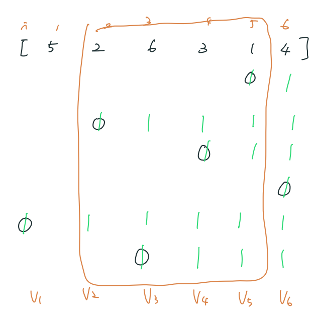
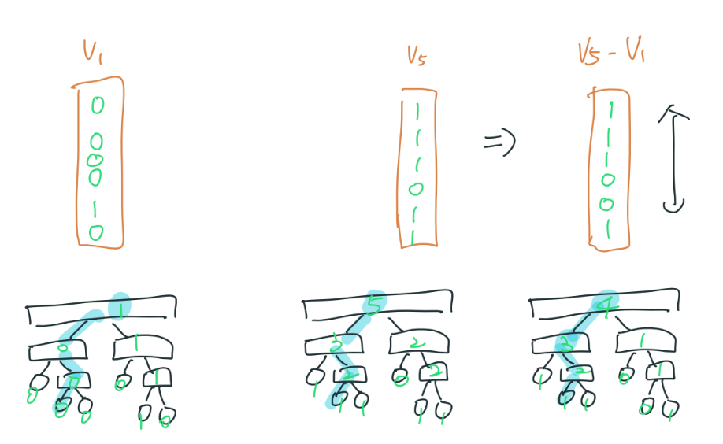

相關知識 : 

- [持久化 Treap](/wiki/ds/treap/#treap)

- [持久化 DSU](/wiki/graph/DSU/#_11)

???+note "[CSES - Range Queries and Copies](https://cses.fi/problemset/task/1737)"
	有一個長度 $n$ 陣列，$q$ 筆以下操作：
    
    - 對於第 $k$ 個陣列單點改值
    
    - 對於第 $k$ 個陣列區間求和
    
    - 複製第 $k$ 個陣列，並將其添加到列表的尾端
    
    $n,q\le 2\times 10^5,a_i\le 10^9$
    
    ??? note "code"
    	```cpp linenums="1"
    	#include <iostream>
        #include <vector>
    
        #define int long long
    
        using namespace std;
    
        struct Node {
            int val = 0;
            int l, r;  // range 左右界
            Node* lc = nullptr;
            Node* rc = nullptr;
    
            void pull() {
                val = lc->val + rc->val;
            }
        };
    
        Node* build(int l, int r) {
            Node* root = new Node;
            root->l = l;
            root->r = r;
            if (l == r) return root;
    
            int mid = (l + r) / 2;
            root->lc = build(l, mid);
            root->rc = build(mid + 1, r);
            return root;
        }
    
        // return 新的 segment tree 的 root
        Node* update(const Node* root, int pos, int val) {
            Node* now = new Node(*root);
    
            if (now->l == now->r) {
                now->val = val;
                return now;
            }
            if (pos <= now->lc->r) {
                now->lc = update(root->lc, pos, val);
            } else {
                now->rc = update(root->rc, pos, val);
            }
            now->pull();
            return now;
        }
    
        int query(const Node* root, int ql, int qr) {
            if (ql <= root->l && root->r <= qr) return root->val;
            if (root->r < ql || qr < root->l) return 0;
            return query(root->lc, ql, qr) + query(root->rc, ql, qr);
        }
    
        signed main() {
            cin.tie(0);
            cin.sync_with_stdio(0);
    
            int n, q;
            cin >> n >> q;
    
            vector<Node*> roots(2);
            roots[1] = build(1, n);
            for (int i = 1; i <= n; i++) {
                int x;
                cin >> x;
                roots[1] = update(roots[1], i, x);
            }
    
            for (int cmd; cin >> cmd && q > 0; q--) {
                if (cmd == 1) {
                    int k, pos, val;
                    cin >> k >> pos >> val;
                    roots[k] = update(roots[k], pos, val);
                } else if (cmd == 2) {
                    int k, ql, qr;
                    cin >> k >> ql >> qr;
                    int ans = query(roots[k], ql, qr);
                    cout << ans << '\n';
                } else {  // cmd == 3
                    int k;
                    cin >> k;
                    roots.push_back(roots[k]);
                }
            }
            return 0;
        }
        ```

???+note "[洛谷 P3834 - 【模板】可持久化线段树 2](https://www.luogu.com.cn/problem/P3834)"
	給長度為 $n$ 的序列，$q$ 筆詢問
	
	- $\text{query(}a_l\sim a_r,k):$ 回答 $a_l\sim a_r$ 中第 $k$ 小的數值是多少<br>
	
	$n,q\le 2\times 10^5,|a_i|\le 10^9$
	
	??? note "思路"
		對於每個 $i$ 維護陣列 $v_i$，對於每個 $v_i$ 先等於 $v_{i-1}$，然後再將 $v_i[a_i]$++
		
		<figure markdown>
	      { width="300" }
	    </figure>
		
		這樣問一個區間的時候可將 $v_r-v_{l-1}$ 得到一個陣列，在上面 walk
	
		<figure markdown>
	      { width="300" }
	    </figure>
	    
	    實作上因為 0-base 的時候 $l-1$ 會是負的，所以我們將 $v_i$ 的 index 向右平移（詳見代碼）
	
	??? note "code"
		```cpp linenums="1"
		#include <bits/stdc++.h>
	    #define int long long
	    #define ALL(x) x.begin(), x.end()
	
	    using namespace std;
	
	    struct Node {
	        Node* lc = nullptr;
	        Node* rc = nullptr;
	        int l, r, sum = 0;
	
	        Node(int l, int r) : l(l), r(r) {}
	
	        void pull() {
	            sum = lc->sum + rc->sum;
	        }
	    };
	
	    struct DS {
	        DS(const vector<int> &v) { 
	            // 0-base v
	            // 1-base roots
	            n = v.size();
	            roots = vector<Node*>(n + 1, nullptr);
	            int minv = *min_element(ALL(v));
	            int maxv = *max_element(ALL(v));
	            roots[0] = build(minv, maxv);
	            for (int i = 0; i < n; i++) {
	                roots[i + 1] = update(roots[i], v[i], 1);
	            }
	        }
	
	        int query(int l, int r, int k) { // 1-base l, r
	            Node* p = roots[l - 1];
	            Node* q = roots[r];
	            while(q->l != q->r) {
	                int cntL = q->lc->sum - p->lc->sum;
	
	                if (cntL < k) {
	                    p = p->rc;
	                    q = q->rc;
	                    k -= cntL;
	                } else {
	                    p = p->lc;
	                    q = q->lc;
	                }
	            }
	            return q->l;
	        }
	        private:
	        int n;
	        vector<Node*> roots;
	
	        Node* build(int l, int r) {
	            Node* root = new Node(l, r);
	            if (l == r) {
	                return root;
	            }
	            int mid = (l + r) / 2;
	            root->lc = build(l, mid);
	            root->rc = build(mid + 1, r);
	            return root;
	        }
	
	        Node* update(const Node* root, int pos, int val) {
	            Node* now = new Node(*root);
	            if (now->l == now->r) {
	                now->sum += val;
	                return now;
	            }
	
	            if (pos <= now->lc->r) {
	                now->lc = update(now->lc, pos, val);
	            } else {
	                now->rc = update(now->rc, pos, val);
	            }
	            now->pull();
	            return now;
	        }
	    };
	
	    signed main() {
	        ios::sync_with_stdio(0);
	        cin.tie(0);
	
	        int n, q;
	        cin >> n >> q;
	
	        vector<int> a(n);
	        for (int i = 0; i < n; i++) {
	            cin >> a[i];
	        }
	
	        vector<int> b = a;
	        sort(ALL(b));
	        for (int i = 0; i < n; i++) {
	            a[i] = lower_bound(ALL(b), a[i]) - b.begin();
	        }
	
	        DS ds(a);
	        while(q--) {
	            int l, r, k;
	            cin >> l >> r >> k;
	            int rk = ds.query(l, r, k);
	            cout << b[rk] << '\n';
	        }
	    } 
	    ```

???+note "[CSES - Distinct Values Queries](https://cses.fi/problemset/task/1734)"
    給你長度為 $n$ 的陣列 $a_1,...,a_n$，有 $q$ 個查詢
    
    - 輸出 $a_i,...,a_j$ 之間有幾種不同的數字
    
    $n,q\le 2\times 10^5$
    
    ??? note "思路"
    	跟離線算法的套路差不多。按照 $r_i$ 小到大枚舉，維護每個數字最後出現的位置放 $1$，其他放 $0$。這個可以對每個 $r_i$ 使用持久化線段樹單點改值做到，詢問的時候只要去對應的 $\texttt{roots}[r_i]$ 詢問區間和即可
    	
    ??? note "實作細節"
    	壓常
    	
    ??? note "normal code"
    	```cpp linenums="1"
    	#include <bits/stdc++.h>
        #define int long long
        #define pii pair<int, int>
        #define pb push_back
        #define mk make_pair
        #define F first
        #define S second
        #define ALL(x) x.begin(), x.end()
    
        using namespace std;
    
        struct Node {
            Node* lc = nullptr;
            Node* rc = nullptr;
            int l, r, sum = 0;
    
            Node(int l, int r) : l(l), r(r) {}
    
            void pull() {
                sum = lc->sum + rc->sum;
            }
        };
    
        struct DS {
            DS(const vector<int> &v) {
                n = v.size();
                roots = vector<Node*>(n + 1, nullptr);
                int maxv = *max_element(ALL(v));
                last = vector<int>(maxv + 1, -1);
                roots[0] = build(0, n - 1);
                for (int i = 0; i < n; i++) {
                    if (last[v[i]] != -1) {
                        roots[i + 1] = update(roots[i], last[v[i]], 0);
                        roots[i + 1] = update(roots[i + 1], i, 1);
                    } else {
                        roots[i + 1] = update(roots[i], i, 1);
                    }
                    last[v[i]] = i;
                }
            }
    
            int query(int l, int r) {
                return query_sum(roots[r], l - 1, r - 1);
            }
    
            private:
            int n;
            vector<Node*> roots;
            vector<int> last;
            // 單點改值 區間查詢
    
            Node* build(int l, int r) {
                Node* root = new Node(l, r);
                if (l == r) {
                    return root;
                }
                int mid = (l + r) / 2;
                root->lc = build(l, mid);
                root->rc = build(mid + 1, r);
                root->pull();
                return root;
            }
    
            Node* update(const Node* root, int pos, int val) {
                Node* now = new Node(*root);
                if (now->l == now->r) {
                    now->sum = val;
                    return now;
                }
    
                if (pos <= now->lc->r) {
                    now->lc = update(now->lc, pos, val);
                } else {
                    now->rc = update(now->rc, pos, val);
                }
                now->pull();
                return now;
            }
    
            int query_sum(const Node* root, int qL, int qR) {
                if (root->r < qL || qR < root->l) return 0;
                if (qL <= root->l && root->r <= qR) {
                    return root->sum;
                }
                return query_sum(root->lc, qL, qR) + query_sum(root->rc, qL, qR);
            }
        };
    
        signed main() {
            ios::sync_with_stdio(0);
            cin.tie(0);
    
            int n, q;
            cin >> n >> q;
    
            vector<int> a(n);
            for (int i = 0; i < n; i++) {
                cin >> a[i];
            }
    
            vector<int> b = a;
            sort(ALL(b));
            for (int i = 0; i < n; i++) {
                a[i] = lower_bound(ALL(b), a[i]) - b.begin();
            }
    
            DS ds(a);
            while(q--) {
                int l, r;
                cin >> l >> r;
                cout << ds.query(l, r) << '\n';
            }
        } 
        ```
    	
    ??? note "AC code"
    	```cpp linenums="1"
    	#include <algorithm>
        #include <iostream>
        #include <utility>
        #include <vector>
    
        #define int long long
        #define pii pair<int, int>
        #define pb push_back
        #define mk make_pair
        #define F first
        #define S second
        #define ALL(x) x.begin(), x.end()
    
        using namespace std;
    
        struct Node {
            Node* lc = nullptr;
            Node* rc = nullptr;
            int l, r, sum = 0;
    
            Node() {
            }
    
            Node(int l, int r) : l(l), r(r) {
            }
    
            void pull() {
                sum = lc->sum + rc->sum;
            }
        };
    
        Node pool[500000000 / sizeof(Node)];
        int cnt = 0;
    
        struct DS {
            DS(const vector<int>& v) {
                n = v.size();
                roots = vector<Node*>(n + 1, nullptr);
                int maxv = *max_element(ALL(v));
                last = vector<int>(maxv + 1, -1);
                roots[0] = build(0, n - 1);
                for (int i = 0; i < n; i++) {
                    if (last[v[i]] != -1) {
                        roots[i + 1] = update(roots[i], last[v[i]], 0);
                        roots[i + 1] = update(roots[i + 1], i, 1);
                    } else {
                        roots[i + 1] = update(roots[i], i, 1);
                    }
                    last[v[i]] = i;
                }
            }
    
            int query(int l, int r) {
                return query_sum(roots[r], l - 1, r - 1);
            }
    
           private:
            int n;
            vector<Node*> roots;
            vector<int> last;
            // 單點改值 區間查詢
    
            Node* build(int l, int r) {
                Node* root = new (&pool[cnt++]) Node(l, r);
                if (l == r) {
                    return root;
                }
                int mid = (l + r) / 2;
                root->lc = build(l, mid);
                root->rc = build(mid + 1, r);
                root->pull();
                return root;
            }
    
            Node* update(const Node* root, int pos, int val) {
                Node* now = new (&pool[cnt++]) Node(*root);
                if (now->l == now->r) {
                    now->sum = val;
                    return now;
                }
    
                if (pos <= now->lc->r) {
                    now->lc = update(now->lc, pos, val);
                } else {
                    now->rc = update(now->rc, pos, val);
                }
                now->pull();
                return now;
            }
    
            int query_sum(const Node* root, int qL, int qR) {
                if (root->r < qL || qR < root->l) return 0;
                if (qL <= root->l && root->r <= qR) {
                    return root->sum;
                }
                return query_sum(root->lc, qL, qR) + query_sum(root->rc, qL, qR);
            }
        };
    
        signed main() {
            ios::sync_with_stdio(0);
            cin.tie(0);
    
            int n, q;
            cin >> n >> q;
    
            vector<int> a(n);
            for (int i = 0; i < n; i++) {
                cin >> a[i];
            }
    
            vector<int> b = a;
            sort(ALL(b));
            for (int i = 0; i < n; i++) {
                a[i] = lower_bound(ALL(b), a[i]) - b.begin();
            }
    
            DS ds(a);
            while (q--) {
                int l, r;
                cin >> l >> r;
                cout << ds.query(l, r) << '\n';
            }
        }
    	```

???+note "[SPOJ COT](https://www.spoj.com/problems/COT/)"
	給定一顆 $n$ 個點的樹，每個點都有一個編號。現在要求在線回答 $q$ 筆詢問 :
	
	- $\text{query}(u, v, k):$ 輸出 $u$ 到 $v$ 之間的路徑上第 $k$ 小的點編號。
	
	$n,q\le 10^5$
	
	??? note "思路"
		我們為每個頂點維護一個值域線段樹，記錄從根到這個頂點的路徑上每個編號的出現次數。可以發現如果我們這裡借助持久化技術，可以保證時空複雜度為 $O(n \log n)$。
	
	    之後對於每個請求，記 $rt=\text{lca}(u,v)$ ，$par_{rt}$ 為 $rt$ 在樹上的父親。那麼二者路徑上的統計關係可以通過 $u+v−rt−par_{rt}$（這裡表示的線段樹的加減法）來獲得。我們不需要再新蓋一顆線段樹，只需讓他們加減然後在上面二分即可，這樣是 $O(\log n)$
	
		總的時間複雜度為 $O((n+q)\log n)$
		
		> 參考 : <https://taodaling.github.io/blog/2019/09/10/%E6%A0%91%E4%B8%8A%E7%AE%97%E6%B3%95/#heading-%E6%A0%91%E4%B8%8A%E8%B7%AF%E5%BE%84%E7%BB%9F%E8%AE%A1%E9%97%AE%E9%A2%98>

???+note "[NPSC 2020 高中組決賽 pE. 排列](https://contest.cc.ntu.edu.tw/npsc2020/teamclient/final-senior.pdf#page=11)"
	給一個 $1$ 到 $n$ 的排列 $p_0$，還有 $m-1$ 個排列，第 $i$ 個排列是把上一個排列的第 $x_i$ 和 $y_i$ 項交換，求字典序排序後的結果（輸出編號）。
	
	$2\le n\le 10^5, 1\le m\le 10^5$
	
	??? "思路"
		樣把每一個排列當成時間，交換當成兩個單點修改，然後弄一棵維護前綴 hash 的持久化線段樹，第 $i$ 個版本就是第 $i$ 個排列，比較字串時，在線段樹上二分搜兩個排列的最長共同前綴，這樣就可以用 $O(\log n)$ 的時間比較排列，總時間複雜度會是 $O(n\log^2 n)$。
		
		> 參考自 : <https://www.wiwiho.me/2020/12/08/npsc2020final/#pE>