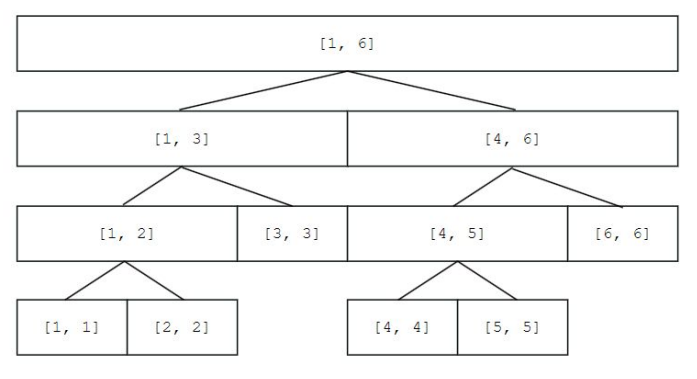
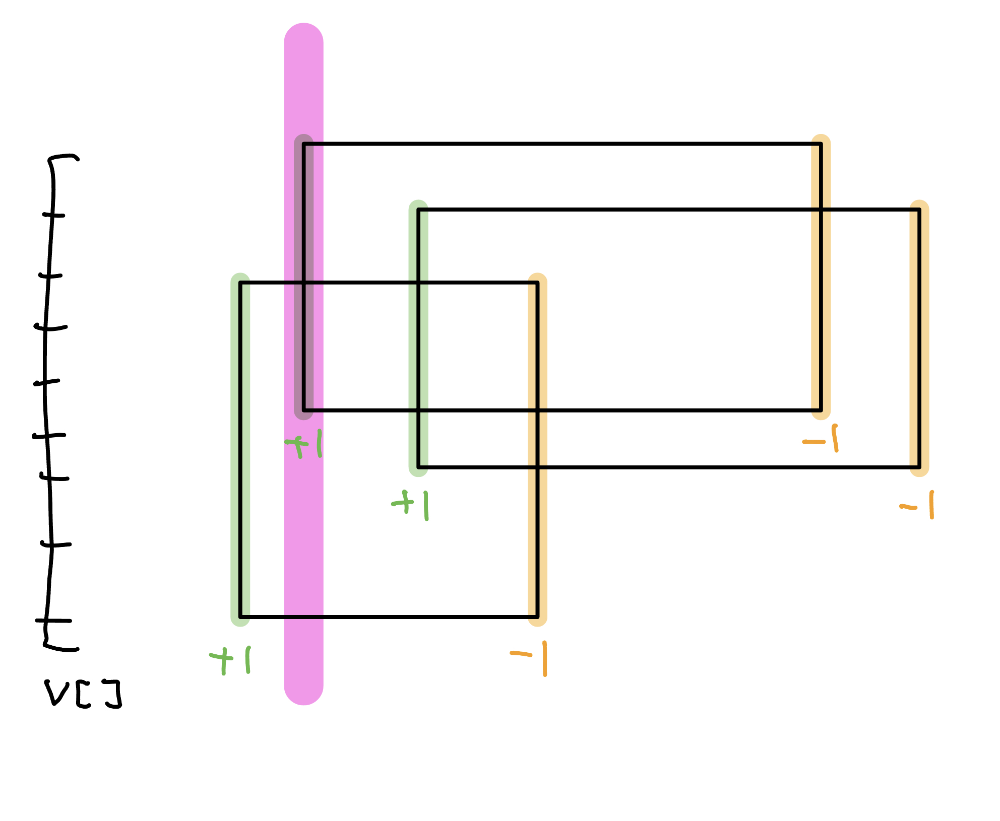
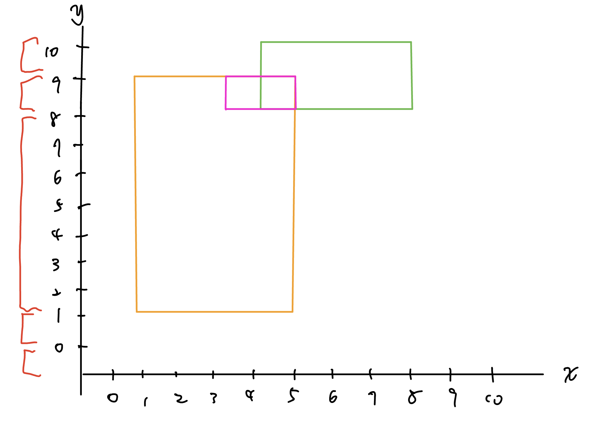
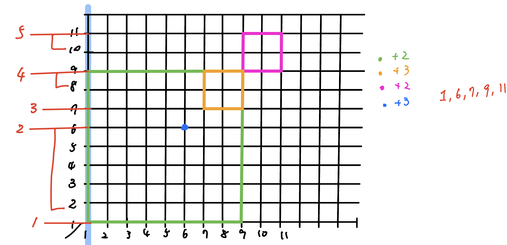
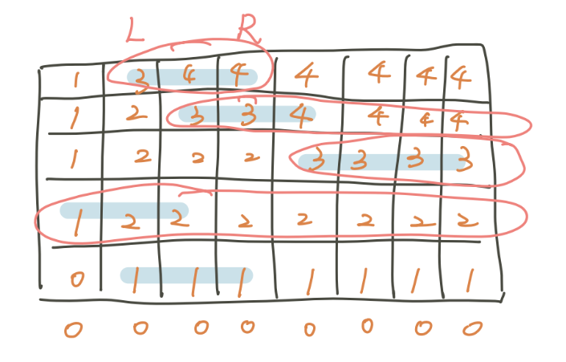

## 介紹

線段樹是演算法競賽中常用的用來維護 **區間資訊** 的資料結構。 線段樹可在 的時間複雜度內實現單點修改、區間修改、區間查詢（區間求和，求區間最大值，求區間最小值）等操作。

## 線段樹基本

??? info "記憶體空間: 4n"
	假設當前線段樹為 full binary tree，那麼節點數量就是 n + n/2 + n/4 + … + 1 = 2n - 1。可是當某些情況線段樹會往下多遞迴一層，例如下面這個 case
	
	<figure markdown>
	  { width="400" }
	</figure>
	
	這時就會是為多一層的 full binary tree，節點數量為 2n + n + n/2 + n/4 + … + 1 = 4n - 1。

## 矩形覆蓋相關問題

???+note "不用離散化版 [CSES - Area of Rectangles](https://cses.fi/problemset/task/1741)"
	給 $n$ 個矩形 $(x_1, x_2)$ 到 $(y_1, y_2)$，問他們的聯集面積
	
	$n\le 10^5, -10^6\le x_1, x_2, y_1, y_2 \le 10^6$

將問題轉換成在一維上的操作，也就是好幾個 events，變成好幾個區間 +1, -1。

<figure markdown>
  { width="400" }
</figure>

v[i]: 存當前掃描線的 y = i 被多少矩形 cover。對於每一個 x，答案就是 v[i] > 0 的數量，我們可以用線段樹維護區間最小值 minv，以及出現幾次 cntv。

- 若 minv = 0 ⇒ ans = total - cntv

- 若 minv > 0 ⇒ ans = total

需要離散化的話只要將 leaf 的 cntv 改成維護「離散化前的長度」即可

<figure markdown>
  { width="400" }
</figure>

??? note "[TIOJ 1224](https://tioj.ck.tp.edu.tw/problems/1224) 離散化的 code"
    ```cpp linenums="1"
    #include <bits/stdc++.h>
    #define int long long
    #define pii pair<int, int>
    #define pb push_back
    #define mk make_pair
    #define F first
    #define S second
    #define ALL(x) x.begin(), x.end()

    using namespace std;
    
    const int INF = 2e18;
    
    struct Node {
        int l, r;
        Node *lc = nullptr;
        Node *rc = nullptr;
        int cnt;
        int mn;
        int add = 0;
    
        Node(int l, int r) : l(l), r(r) {}
    
        void pull() {
            mn = min(lc->mn, rc->mn);
            cnt = 0;
            if (mn == lc->mn) {
                cnt += lc->cnt;
            } 
            if (mn == rc->mn) {
                cnt += rc->cnt;
            }
        }
    
        void push() {
            if (add) {
                lc->mn += add;
                lc->add += add;
                rc->mn += add;
                rc->add += add;
                add = 0;
            }
        }
    };
    
    struct OP {
        int x, y1, y2, val;
    
        bool operator<(const OP &rhs) const {
            return x < rhs.x;
        }
    };
    
    int n;
    vector<int> sortedY; 
    vector<OP> op;
    
    // {1, 8, 9, 10}
    // i 維護 i~i+1
    // lb(i), lb(i - 1)
    
    Node* build(int l, int r) {
        Node* root = new Node(l, r);
        if (l == r) {
            root->cnt = sortedY[l + 1] - sortedY[l]; 
            root->mn = 0; 
            return root;
        }
        int mid = (l + r) / 2;
        root->lc = build(l, mid);
        root->rc = build(mid + 1, r);
    
        root->pull();
        return root;
    }
    
    void modify(Node* root, int ml, int mr, int val) {
        if (ml <= root->l && root->r <= mr) {
            root->mn += val;
            root->add += val;
            return;
        }
        if (root->r < ml || mr < root->l) {
            return;
        }
        root->push();
        modify(root->lc, ml, mr, val);
    
        modify(root->rc, ml, mr, val);
        root->pull();
    }
    
    void init() {
        cin >> n;
        for (int i = 0; i < n; i++) {
            int x1, x2, y1, y2;
            cin >> x1 >> x2 >> y1 >> y2;
            op.pb({x1, y1, y2, +1});
            op.pb({x2, y1, y2, -1});
            sortedY.pb(y1);
            sortedY.pb(y2);
        }
        sort(ALL(sortedY));
        sortedY.resize(unique(ALL(sortedY)) - sortedY.begin());
        sort(ALL(op));
    }
    
    void solve() {
        int range = sortedY.back() - sortedY.front();
        Node* root = build(0, sortedY.size() - 2);
        int lastX = INF, ans = 0;
        for (auto [x, y1, y2, val] : op) {
            int yl = lower_bound(ALL(sortedY), y1) - sortedY.begin();
            int yr = lower_bound(ALL(sortedY), y2) - sortedY.begin() - 1;
    
            if (lastX != INF && x != lastX) {
                int dy = (root->mn == 0) ? (range - root->cnt) : range;
                ans += (x - lastX) * dy;
            }
    
            modify(root, yl, yr, val);
            lastX = x;
        }
        cout << ans << '\n';
    }
    
    signed main() {
        init();
        solve();
    } 
    ```

???+note "[2021 全國賽 pF. 歡樂外送點](https://tioj.ck.tp.edu.tw/problems/2228)" 
	給 $n$ 個菱形，中心點為 $(x_i, y_i)$，半徑為 $r_i$，權值為 $w_i$。問所有格子點的上被覆蓋到的權值總和最大值
	
	$n\le 3\times 10^5, 0\le x_i, y_i, r_i\le 10^8, 1\le w_i \le 100$
	
	??? note "思路"
		將菱形變成 $(x+y,x-y)$ 就可以變成一般的矩形覆蓋問題
	
		<figure markdown>
	      { width="400" }
	    </figure>

???+note "矩形周長 [POJ 1177](https://vjudge.net/problem/POJ-1177)"
	給 $n$ 個矩形 $(x_1, x_2)$ 到 $(y_1, y_2)$，問他們所形成的輪廓週長
	
	$n\le 5000, -10^4\le x_1, x_2, y_1, y_2 \le 10^4$	
	
	??? note "思路"
		用掃描線，線段樹一樣維護當前有幾個非 0 的點
	
		目前線段貢獻的周長是，目前的總長度減去上一次的總長度的絕對值
		
		> 參考自 : <https://blog.csdn.net/weixin_43236122/article/details/105306765>

???+note "[CSES - Intersection Points](https://cses.fi/problemset/task/1740)"
	給 n 個線段，只可能是水平線或鉛直線，問這些線段的交點有幾個
	
	$n\le 10^6, -10^6 \le x_1, x_2, y_1, y_2 \le 10^6$
	
	??? note "思路"
		把每個線段都想成一個矩形，用 sweep line 從左邊掃到右邊，過程中可能會有三種情況:
	
		1. 遇到一個平行線段的起始點
		2. 遇到一個平行線段的終點
		3. 遇到一個垂直線段
	
	    其中當遇到 3. 的時候，會需要詢問當前的一段區間有幾條線段經過，而遇到 1. 2. 的時候，會需要將一個點加值或減值

???+note "[LOJ #6276.果树](https://loj.ac/p/6276)"
	給出一棵 $n$ 個點的樹，每個點有一種顏色。問有多少條路徑滿足路徑上任意兩點的顏色都不同。 
	
	$n\le 10^5$，滿足每種顏色至多出現 $20$ 次。
	
	??? note "思路"
		將 path $(u,v)$ 的 $\texttt{dfn}[u],\texttt{dfn}[v]$ 打在二維平面上，同樣顏色的點會形成一些矩形，那些矩形就不能選的地方，答案就是沒被任何矩形覆蓋到的二維座標點。由於需要 $O(20^2)$ 枚舉同樣顏色的點，每次會生成 $4$ 個矩形，所以 worst case $O((C^{20}_2 \times 4 \times \frac{n}{C^{20}_2})\times \log n)\approx 7.6\times 10^7$

## 線段樹分治

考慮這樣一個問題： 

- 有一些操作，每個操作只在 $l\sim r$ 的時間內有效。 

- 有一些詢問，每個詢問某一個時間點所有操作的貢獻。

對於這樣的詢問，我們可以在離線後在**時間軸上建一棵線段樹**，這樣對於每個操作，相當於在線段樹上進行區間操作。遍歷整顆線段樹，到達每個節點時執行對應的操作，然後繼續向下遞歸，到達葉子節點時統計貢獻，回溯時撤銷操作即可。這樣的想法被稱為**線段樹分治**，可以在低時間複雜度內解決一類**在線演算法並不優秀**的問題。

???+note "[洛谷 P5787 二分图 /【模板】线段树分治](https://www.luogu.com.cn/problem/P5787)"
	給一張 $n$ 個點的圖，有 $m$ 條邊與 $k$ 個時間點，每條邊只存在於 $[l_i, r_i)$ 這些時間點，求每個時間點時這張圖是否為二分圖。
	
	$n\le 10^5, m,k\le 2\times 10^5$
	
	??? note "思路"
		首先，圖是二分圖的充要條件是不存在奇環，這個可以用帶權並查集維護。依照上述思想建一棵線段樹，對於每條邊，將它依照線段樹區間操作的方式分成 $O(\log k)$ 段，用 vector 掛在線上段樹的節點上。遍歷時，從根節點出發，每到一個節點，將掛在該節點上的所有邊合併，然後遞歸處理左兒子和右兒子。如果發現有某邊合併會出現奇環，那麼目前線段樹節點所對應的時間區間都不會形成二分圖。當到達葉子節點時，如果合併了所有掛在當前節點上的邊，依舊滿足二分圖的性質，那麼可以直接輸出 Yes。回溯時，由於並查集不支援刪邊，我們可以使用可rollback dsu。
		
		每條邊會跑 $O(\log k)$ 次，共 $m$ 條，在乘上 rollback dsu 的複雜度是 $O(m \log n \log k)$
		
	??? note "code"
		```cpp linenums="1"
		const int N = 1e5 + 7, M = 2e5 + 7;
	    int n, m, k, u[M], v[M], f[N<<1], d[N<<1];
	    struct T {
	        int l, r;
	        vi e;
	    } t[N<<2];
	    stack< pi > s;
	
	    void build(int p, int l, int r) {
	        t[p].l = l, t[p].r = r;
	        if (l == r) return;
	        build(ls, l, md), build(rs, md + 1, r);
	    }
	
	    void ins(int p, int l, int r, int x) {
	        if (t[p].l >= l && t[p].r <= r) return t[p].e.pb(x), void();
	        if (l <= md) ins(ls, l, r, x);
	        if (r > md) ins(rs, l, r, x);
	    }
	
	    inline int get(int x) {
	        while (x ^ f[x]) x = f[x];
	        return x;
	    }
	
	    inline void merge(int x, int y) {
	        if (x == y) return;
	        if (d[x] > d[y]) swap(x, y);
	        s.push(mp(x, d[x] == d[y])), f[x] = y, d[y] += d[x] == d[y];
	    }
	
	    void dfs(int p, int l, int r) {
	        bool ok = 1;
	        ui o = s.size();
	        for (ui i = 0; i < t[p].e.size(); i++) {
	            int x = t[p].e[i], u = get(::u[x]), v = get(::v[x]);
	            if (u == v) {
	                for (int j = l; j <= r; j++) prints("No");
	                ok = 0;
	                break;
	            }
	            merge(get(::u[x] + N), v), merge(get(::v[x] + N), u);
	        }
	        if (ok) {
	            if (l == r) prints("Yes");
	            else dfs(ls, l, md), dfs(rs, md + 1, r);
	        }
	        while (s.size() > o) d[f[s.top().fi]] -= s.top().se, f[s.top().fi] = s.top().fi, s.pop();
	    }
	
	    int main() {
	        rd(n), rd(m), rd(k), build(1, 1, k);
	        for (int i = 1, l, r; i <= m; i++) {
	            rd(u[i]), rd(v[i]), rd(l), rd(r);
	            if (l ^ r) ins(1, l + 1, r, i);
	        }
	        for (int i = 1; i <= n; i++) f[i] = i, f[i+N] = i + N;
	        dfs(1, 1, k);
	        return 0;
	    }
	    ```

???+note "[CF 1681 F. Unique Occurrences](https://codeforces.com/contest/1681/problem/F)"
	給一棵 $n$ 個點的樹，邊帶權。定義 $f(u,v)$ 為 $u$ 到 $v$ 的路徑上只出現一次的邊權數量，問對於所有 $u<v$，$f(u,v)$ 的加總
	
	$2\le n\le 5\times 10^5$
	
	??? note "思路"
		考慮權重 $w$，當將權重為 $w$ 的邊都移除後，會剩下好幾個連通塊，將權重為 $w$ 的邊都移除後，每條權重為 $w$ 的邊對答案的貢獻就是 $(u,v)$ 所在的連通塊的大小的乘積，也就是 $sz(u)\times sz(v)$。所以我們考慮分治，以權重小到大當時間軸，對於一條權重為 $w$ 的邊即貢獻 $[1, w-1]$ 和 $[w+1, n]$，也就是到了葉節點必須加入除了權重為 $w$ 以外的所有 edges，我們可以使用類似 CF 1442 D. sum 的實作方式來做這題，也就是在遞迴的過程將不屬於 $w$ 的邊依序加入。
		
		> 參考自 : <https://www.luogu.com.cn/blog/257146/solution-cf1681f>
		
	??? note "code"
		```cpp linenums="1"
		#include <bits/stdc++.h>
	    #define int long long
	    using namespace std;
	
	    const int N = 5e5 + 5;
	
	    int n, ans;
	    vector<pair<int, int>> G[N];
	
	    struct Graph {
	        int n, cnt;
	        vector<int> sz;
	        vector<int> par;
	        stack<pair<int, int>> stk;
	
	        int find(int x) {
	            if (par[x] == x)
	                return x;
	            else
	                return find(par[x]);
	        }
	        void init(int _n) {
	            n = _n;
	            sz = vector<int>(n, 1);
	            par = vector<int>(n);
	            for (int i = 0; i < n; i++) {
	                par[i] = i;
	            }
	        }
	        void merge(int u, int v) {
	            int x = find(u), y = find(v);
	            if (x == y) {
	                stk.push({x, x});
	                return;
	            }
	            if (sz[x] < sz[y]) swap(x, y);
	            sz[x] += sz[y];
	            par[y] = x;
	            stk.push({x, y});
	        }
	        void undo() {
	            auto [x, y] = stk.top();
	            stk.pop();
	            if (x == y) return;
	            sz[x] -= sz[y];
	            par[y] = y;
	        }
	    } dsu;
	
	    void divide(int l, int r) {
	        if (l == r) {
	            for (auto [a, b] : G[l]) {
	                a = dsu.find(a), b = dsu.find(b);
	                ans += dsu.sz[a] * dsu.sz[b];
	            }
	            return;
	        }
	        int mid = (l + r) / 2;
	        for (int i = l; i <= mid; i++) {
	            for (auto [u, v] : G[i]) {
	                dsu.merge(u, v);
	            }
	        }
	        divide(mid + 1, r);
	        for (int i = l; i <= mid; i++) {
	            for (auto [u, v] : G[i]) {
	                dsu.undo();
	            }
	        }
	        for (int i = mid + 1; i <= r; i++) {
	            for (auto [u, v] : G[i]) {
	                dsu.merge(u, v);
	            }
	        }
	        divide(l, mid);
	        for (int i = mid + 1; i <= r; i++) {
	            for (auto [u, v] : G[i]) {
	                dsu.undo();
	            }
	        }
	    }
	
	    signed main() {
	        cin >> n;
	        for (int i = 1; i < n; i++) {
	            int u, v, w;
	            cin >> u >> v >> w;
	            G[w].push_back({u, v});
	        }
	        dsu.init(n + 1);
	        divide(1, n);
	        cout << ans << '\n';
	    }
	    ```

???+note "[CF 601 E. A Museum Robbery](https://codeforces.com/contest/601/problem/E)"
	給 $n$ 個物品以及背包容量 $k$，有以下 $q$ 筆操作 :
    
    - $\text{add}(w, v):$ 加入一個重量為 $w$，價值為 $v$ 的物品
    
    - $\text{del}(x):$ 刪除編號 $x$ 的物品
    
    - $\text{query}:$ 令 $s(m)$ 表示容量為 $m$ 所能獲取的最大價值，求 $\sum \limits_{m=1}^k s(m) \times p^{m-1} \pmod{q}$
    
    $n\le 5000, k\le 1000, q\le 3\times 10^4$
    
    ??? note "思路"
    	我們處理出每個物品會出現在哪些區間中。其它都和線段樹分治一樣，唯一的不同就是dfs 的時候，我們不去回溯，而是選擇直接把 $dp$ 數組傳下去（其實也跟 CF 1442 D. sum 的做法差不多）。
    	
    	> 參考自 : <https://zhuanlan.zhihu.com/p/557382505>

## 二維 BIT

???+note "[CSES - Forest Queries II](https://cses.fi/problemset/task/1739)"
	$n\times n$ 的 grid 上，$q$ 個以下操作 :

    - 改變一格的狀態（0/1）
    
    - 詢問一個矩形區域的和
    
    $n\le 1000, q\le 2\times 10^5$
    
    ??? note "思路"
    	yuihuang code
    	
    ??? note "code"
    	```cpp linenums="1"
    	
    	```

## 打架線段樹

???+note "區間數字個數"
	給一個長度為 $n$ 陣列，$q$ 筆詢問 :
	
	- $\text{query}(l,r,x):a_l,\ldots ,a_r$，$x$ 出現的次數
	
	- $\text{update}(i,x):$ 將 $a_i=x$
	
	$n,q\le 2\times 10^5,x\le 10^9$
	
	??? note "思路"
		（靜態）沒 update : vec[x] 放 $a_i=x$ 的所有 $x$
		
		（動態）有 update : DS[x] 支援 
		
		- insert(i)
	
		- erase(i)
	
		- lower_bound(i)
	
		使用 Treap 或 `pb_ds::tree`
	
	??? note "code"
		```cpp linenums="1"
		// using pbds
		tree<pii,null_type,less<pii>,rb_tree_tag,tree_order_statistics_node_update> T;
		
		// update(i, x)
		T.erase({a[i], i});
		a[i] = x;
		T.insert({a[i], i});
		
		// query(l, r, x)
		cout << T.order_of_key(mk(id, r + 1)) - T.order_of_key(mk(id, l)); 
		```

???+note "[資芽 OJ 794 — 區間絕對眾數](https://neoj.sprout.tw/problem/794/)"

    輸入一個長度為 $N$ 的正整數序列 $a_1, \ldots, a_N$，接下來有 $Q$ 筆詢問。
    
    每筆詢問輸入 $l_i, r_i$，輸出區間 $[l_i, r_i]$ 的絕對眾數，若不存在請輸出 $0$。
    
    $N, Q \leq 5 \times 10^5, 1 \leq a_i \leq 5 \times 10^5$
    
    ??? note "思路"
    	<figure markdown>
          { width="300" }
        </figure>
        
    ??? note "code"
    	```cpp linenums="1"
    	#include <bits/stdc++.h>
        #include <bits/extc++.h>
        #define int long long
        #define pii pair<int, int>
        #define pb push_back
        #define mk make_pair
        #define F first
        #define S second
        #define ALL(x) x.begin(), x.end()
    
        using namespace std;
        using namespace __gnu_pbds;
    
        tree<pii,null_type,less<pii>,rb_tree_tag,tree_order_statistics_node_update> T;
    
        const int INF = 2e18;
        const int maxn = 5e5 + 5;
        const int M = 1e9 + 7;
    
        struct Node {
            Node* lc = nullptr;
            Node* rc = nullptr;
            int l, r;
            int id = -1, cnt = 0;
    
            Node(int l, int r) : l(l), r(r) {}
    
            void pull () {
                if (lc->cnt == 0) {
                    id = rc->id;
                    cnt = rc->cnt;
                    return;
                } 
                if (rc->cnt == 0) {
                    id = lc->id;
                    cnt = lc->cnt;
                    return;
                }
                if (lc->id == rc->id) {
                    id = lc->id;
                    cnt = lc->cnt + rc->cnt;
                } else {
                    if (lc->cnt > rc->cnt) {
                        id = lc->id;
                        cnt = lc->cnt - rc->cnt;
                    } else {
                        id = rc->id;
                        cnt = rc->cnt - lc->cnt;
                    }
                }
            }
        };
    
        int n, q;
        int a[maxn];
    
        Node* build (int l, int r) {
            Node* root = new Node(l, r);
            if (l == r) {
                root->id = a[l];
                root->cnt = 1;
                return root;
            }
    
            int mid = (l + r) / 2;
            root->lc = build(l, mid);
            root->rc = build(mid + 1, r);
            root->pull();
            return root;
        }
    
        pii query(const Node* root, int ql, int qr) {
            if (qr < root->l || root->r < ql) return {-1, 0};
            if (ql <= root->l && root->r <= qr) {
                return {root->id, root->cnt};
            } 
    
            pii tmp = {-1, 0};
            if (ql <= root->lc->r) {
                pii ret = query(root->lc, ql, qr);
                if (tmp.S == 0) {
                    tmp = ret;
                } else if (ret.S != 0) {
                    if (ret.F == tmp.F) {
                        tmp.S += ret.S;
                    } else {
                        if (ret.S > tmp.S) {
                            tmp.F = ret.F;
                            tmp.S = ret.S - tmp.S;
                        } else {
                            tmp.S = tmp.S - ret.S;
                        }
                    }
                }
            }
            if (root->rc->l <= qr) {
                pii ret = query(root->rc, ql, qr);
                if (tmp.S == 0) {
                    tmp = ret;
                } else if (ret.S != 0) {
                    if (ret.F == tmp.F) {
                        tmp.S += ret.S;
                    } else {
                        if (ret.S > tmp.S) {
                            tmp.F = ret.F;
                            tmp.S = ret.S - tmp.S;
                        } else {
                            tmp.S = tmp.S - ret.S;
                        }
                    }
                }
            }
            return tmp;
        }
    
        void init() {
            cin >> n >> q;
            for (int i = 0; i < n; i++) {
                cin >> a[i];
                T.insert ({a[i], i});
            }
        }
    
        void solve() {
            Node* root = build(0, n - 1);
            while (q--) {
                int l, r;
                cin >> l >> r;
                l--, r--;
    
                auto [id, c] = query(root, l, r);
                if (c == 0) {
                    cout << 0 << '\n';
                    continue;
                }
                int cnt = T.order_of_key(mk(id, r + 1)) - T.order_of_key(mk(id, l)); 
                if (cnt > (r - l + 1) / 2) {
                    cout << id << '\n';
                } else {
                    cout << 0 << '\n';
                }
            }
        }
    
        signed main() {
            int t = 1;
            while (t--) {
                init();
                solve();
            }
        } 
        ```

## 題目

???+note "[NPSC 2020 高中組初賽 pF. 兔田建設](https://contest.cc.ntu.edu.tw/npsc2020/teamclient/semi_senior.pdf#page=15)"
	給一個長度為 $n$ 的序列 $a_1, \ldots, a_n$，給 $k$，有 $q$ 筆詢問 : 
	
	- $\text{query}(v,l,r,c):$ 問 $a_l, \ldots, a_r$ 有沒有長度為 $k$ 的區間中，恰有 $c$ 個 $\le v$ 的數
	
	$n,q,k\le 10^6$
	
	??? note "思路"
		把詢問按 $v$ 排序，就可以先把 $<v$ 的位置都塗上顏色，可以用線段樹維護每個位置開頭的長度 $k$ 的區間中，有幾個位置塗顏色，最難的地方是找有沒有出現 $c$。
		
		開頭在 $i$ 的區間和開頭在 $i+1$ 的區間，塗色的位置數量最多只會差 1，所以可以用類似介值定理的想法，$c$ 在最小值和最大值之間就表示有出現 $c$。
		
		> 參考自 : <https://www.wiwiho.me/2020/11/21/npsc2020pre/>

???+note "[HDU 5726 GCD](https://vjudge.net/problem/HDU-5726)"
	給一個長度為 $n$ 的序列 $a_1, \ldots ,a_n$，$q$ 次詢問 :
	
	- $\text{query}(l,r):$ 問有幾個 $\gcd(a_{l'},\ldots ,a_{r'})=\gcd(a_l,\ldots ,a_r)$
	
	$n, q\le 10^5$
	
	??? note "思路"
		
		區間 gcd 的值利可以用 Sparse Table 或 Segment Tree 算出來，但要怎麼求有幾個子區間的 gcd = x 呢 ? 觀察到，對於一個左界，當右界遞增時 gcd 是單調遞減的，所以我們假設已用 map 存以 a[i - 1] 結尾的 distinct 區間 gcd，那我們就只要將這些 gcd 在去跟 a[i] 取 gcd 存入 map 即可
		
		詳見代碼，抄錄自以下博客
		
		> 參考 : <https://blog.nowcoder.net/n/27772b54fd3c4968b905303d83138dea?from=nowcoder_improve>
	
	??? note "code"
		```cpp linenums="1"
		#include <bits/stdc++.h>
	    using namespace std;
	    typedef long long ll;
	    const int mod = 1000000007;
	    const int maxn = 1e5 + 10;
	    int g[maxn * 4], a[maxn];
	    map<int, ll> ans;      // 存最终答案
	    map<int, ll> p[maxn];  // p[i]表示以i结尾的gcd的区间集合,前者为gcd，后者为对应的区间个数
	    int t, n, q, x, y;
	    int Gcd(int a, int b) {
	        return b == 0 ? a : Gcd(b, a % b);
	    }
	    void update(int id) {
	        g[id] = Gcd(g[id << 1], g[id << 1 | 1]);
	    }
	    void build(int l, int r, int id) {
	        if (l == r) {
	            g[id] = a[l];
	            return;
	        }
	        int mid = (l + r) >> 1;
	        build(l, mid, id << 1);
	        build(mid + 1, r, id << 1 | 1);
	        update(id);
	    }
	    int query(int l, int r, int x, int y, int id) {
	        if (x <= l && r <= y)
	            return g[id];
	        int mid = (l + r) >> 1;
	        int le = 0, ri = 0;
	        if (x <= mid)
	            le = query(l, mid, x, y, id << 1);
	        if (y > mid)
	            ri = query(mid + 1, r, x, y, id << 1 | 1);
	        if (!le) swap(le, ri);  // le为0， 不能求ri%0
	        return Gcd(le, ri);     // Gcd(x, 0) = x
	    }
	    int main() {
	        // freopen("/Users/zhangkanqi/Desktop/11.txt","r",stdin);
	        scanf("%d", &t);
	        int Case = 1;
	        while (t--) {
	            printf("Case #%d:\n", Case++);
	            scanf("%d", &n);
	            ans.clear();  // 清空!!
	            for (int i = 1; i <= n; i++)
	                p[i].clear();
	            for (int i = 1; i <= n; i++)
	                scanf("%d", &a[i]);
	
	            build(1, n, 1);
	            ans[a[1]] = 1, p[1][a[1]] = 1;
	            for (int i = 2; i <= n; i++) {
	                ans[a[i]]++, p[i][a[i]] += 1;
	                for (map<int, ll>::iterator it = p[i - 1].begin(); it != p[i - 1].end(); it++) {
	                    int tmp = Gcd(a[i], it->first);  // 求a[i]和之前的数的gcd
	                    p[i][tmp] += it->second;
	                    ans[tmp] += it->second;
	                }
	            }
	            scanf("%d", &q);
	            while (q--) {
	                scanf("%d %d", &x, &y);
	                int k = query(1, n, x, y, 1);
	                printf("%d %lld\n", k, ans[k]);
	            }
	        }
	        return 0;
	    }
		```

???+note "區間除法 [2023 YTP 國中組初賽 p6](/wiki/ds/images/YTP2023PreliminaryContest_J1.pdf)"
	給一個長度為 $N$ 的序列 $a_1,a_2,\ldots, a_N$，$Q$ 筆以下操作 :
	
	- $\texttt{f}\space l\space r\space x:$ 對於 $l\le i\le r$，$a_i$ 變成 $\displaystyle  \lfloor \frac{a_i}{x} \rfloor$
	
	- $\texttt{c}\space l\space r\space x:$ 對於 $l\le i\le r$，$a_i$ 變成 $\displaystyle \lceil \frac{a_i}{x} \rceil$
	
	- $\texttt{?}\space k:$ 輸出 $a_k$
	
	$N,Q\le 2\times 10^5,1\le a_i,x\le 10^9$
	
	??? note "思路"
		ceil 除法的話是把 floor 的除法改一下變區間最大值是 1 的時候不遞迴做下去

???+note "[2016 全國賽 直升機抓寶 (Helicopter)](https://tioj.ck.tp.edu.tw/problems/1941)"
	有一個 $n\times n$ 的 grid。你一開始在左下角，要走到右上角去，你只能往上或往右走。每一個 row 都有一個特殊的區間，範圍是 $l_i$ 到 $r_i$，求你最多能經過幾個特殊區間。
	
	$n\le 8\times 10^5$
	
	??? note "思路"
		考慮 dp(i, j) = 走到 (i, j) 最多經過幾個，轉移式 dp(i, j) = max(dp(i, j - 1), dp(i - 1, j) + 1 | if (i, j) is in interval)
		
		可以觀察到一個 row 的 dp(i, j) 會是單調遞增的，且會被改變的只有 interval 以及 interval 以後的一個前綴
		
		<figure markdown>
	      { width="400" }
	    </figure>
	    
	    這樣我們就只要維護一個 segment tree 代表當前 row 的 dp 值，看到 interval 的時候就在上面 walk 到最後一個小於等於的。

???+note "[TIOJ 2140. 殿壬愛序列](https://tioj.ck.tp.edu.tw/problems/2140)"
    給一個長度為 $n$ 的序列，請支援三種操作：

    1. 給定 $i,x$，將 $a_i$ 設成 $x$
    2. 給定 $l,r,k$，$\forall l\le i\le r,a_i=\lfloor \frac{a_i}{k} \rfloor$
    3. 給定 $l,r$，輸出 $a_l,a_{l+1},\ldots ,a_r$ 的絕對多數，若不存在輸出 $-1$
    
    $n,q\le 10^5$
    
    ??? note "思路"
    	> 參考 : <https://abc864197532.github.io/2021/02/07/tioj-2140/>
    	
        區間除法的部分，因為 $k = 1$ 不會影響陣列，所以可以視為 $k \geq 2$。當區間的最大值 $>0$ 的時候才繼續遞迴下去。這樣一來每個數最多只會被除 $\log C$ 次。實作上每次將一個點除到 $0$ 需要 $O(\log C\times \log n)$，又每次修改只是單點修改，所以複雜度會是 $O((n + q)\log C \log n)\approx 1.2\times 10^8$。
        
        ```cpp linenums="1"
        // 區間除法代碼
        void division(Node* root, int mL, int mR, int val) {
            if (root->r < mL || mR < root->l) return;
            if (root->l == root->r) {
                root->id /= val;
                root->mx = root->id;
                return;
            }
    
            if (mL <= root->lc->r && root->lc->mx) {
                division(root->lc, mL, mR, val);
            }
            if (root->rc->l <= mR && root->rc->mx) {
                division(root->rc, mL, mR, val);
            }
            root->pull();
        }
        ```
        
        單點修改，區間絕對眾數上面都有提到，略。
    
    ??? note "實作細節"
    	記得要特判 k = 1
    	
    ??? note "code"
    	```cpp linenums="1"
    	#include <bits/stdc++.h>
        #include <bits/extc++.h>
        #define int long long
        #define pii pair<int, int>
        #define pb push_back
        #define mk make_pair
        #define F first
        #define S second
        #define ALL(x) x.begin(), x.end()
    
        using namespace std;
        using namespace __gnu_pbds;
    
        tree<pii,null_type,less<pii>,rb_tree_tag,tree_order_statistics_node_update> T;
    
        const int INF = 2e18;
        const int maxn = 3e5 + 5;
        const int M = 1e9 + 7;
    
        struct Node{
            int l, r;
            Node *lc = nullptr;
            Node *rc = nullptr;
            int id = -1, cnt = 0;
            int mx;
    
            Node (int l, int r) : l(l), r(r) {}
    
            void pull () {
                if (lc->cnt == 0) {
                    id = rc->id;
                    cnt = rc->cnt;
                } else if (rc->cnt == 0) {
                    id = lc->id;
                    cnt = lc->cnt;
                } else {
                    if (lc->id == rc->id) {
                        id = lc->id;
                        cnt = lc->cnt + rc->cnt;
                    } else {
                        if (lc->cnt > rc->cnt) {
                            id = lc->id;
                            cnt = lc->cnt - rc->cnt;
                        } else {
                            id = rc->id;
                            cnt = rc->cnt - lc->cnt;
                        }
                    }
                }
                mx = max(lc->mx, rc->mx);
            }
        };
    
        int n, q;
        int a[maxn];
    
        Node* build (int l, int r) {
            Node* root = new Node(l, r);
            if (l == r) {
                root->id = a[l];
                root->cnt = 1;
                root->mx = a[l];
                return root;
            }
    
            int mid = (l + r) / 2;
            root->lc = build(l, mid);
            root->rc = build(mid + 1, r);
            root->pull();
            return root;
        }
    
        void update(Node* root, int pos, int val) {
            if (root->l == root->r) {
                T.erase({root->id, root->l});
                root->id = val;
                root->cnt = 1;
                root->mx = val;
                T.insert({root->id, root->l});
                return;
            }
    
            if (pos <= root->lc->r) {
                update(root->lc, pos, val);
            } else {
                update(root->rc, pos, val);
            }
            root->pull();
        }
    
        void division(Node* root, int mL, int mR, int val) {
            if (root->r < mL || mR < root->l) return;
            if (root->l == root->r) {
                T.erase({root->id, root->l});
                root->id /= val;
                root->mx = root->id;
                T.insert({root->id, root->l});
                return;
            }
    
            if (mL <= root->lc->r && root->lc->mx) {
                division(root->lc, mL, mR, val);
            }
            if (root->rc->l <= mR && root->rc->mx) {
                division(root->rc, mL, mR, val);
            }
            root->pull();
        }
    
        pii query(const Node* root, int ql, int qr) {
            if (qr < root->l || root->r < ql) return {-1, 0};
            if (ql <= root->l && root->r <= qr) {
                return {root->id, root->cnt};
            } 
    
            pii tmp = {-1, 0};
            if (ql <= root->lc->r) {
                pii ret = query(root->lc, ql, qr);
                if (tmp.S == 0) {
                    tmp = ret;
                } else if (ret.S != 0) {
                    if (ret.F == tmp.F) {
                        tmp.S += ret.S;
                    } else {
                        if (ret.S > tmp.S) {
                            tmp.F = ret.F;
                            tmp.S = ret.S - tmp.S;
                        } else {
                            tmp.S = tmp.S - ret.S;
                        }
                    }
                }
            }
            if (root->rc->l <= qr) {
                pii ret = query(root->rc, ql, qr);
                if (tmp.S == 0) {
                    tmp = ret;
                } else if (ret.S != 0) {
                    if (ret.F == tmp.F) {
                        tmp.S += ret.S;
                    } else {
                        if (ret.S > tmp.S) {
                            tmp.F = ret.F;
                            tmp.S = ret.S - tmp.S;
                        } else {
                            tmp.S = tmp.S - ret.S;
                        }
                    }
                }
            }
            return tmp;
        }
    
        void init() {
            cin >> n >> q;
            for (int i = 0; i < n; i++) {
                cin >> a[i];
                T.insert({a[i], i});
            }
        }
    
        void solve() {
            Node* root = build(0, n - 1);
    
            int op;
            while(q--) {
                cin >> op;
                if (op == 1) {
                    int i, x;
                    cin >> i >> x;
                    i--;
                    update(root, i, x);
                } else if (op == 2) {
                    int l, r, k;
                    cin >> l >> r >> k;
                    l--, r--;
                    if (k > 1) division(root, l, r, k);
                } else {
                    int l, r;
                    cin >> l >> r;
                    l--, r--;
                    auto [id, c] = query(root, l, r);
                    if (c == 0) {
                        cout << "-1" << '\n';
                        continue;
                    }
                    int cnt = T.order_of_key(mk(id, r + 1)) - T.order_of_key(mk(id, l)); 
                    if (cnt > (r - l + 1) / 2) {
                        cout << id << '\n';
                    } else {
                        cout << "-1" << '\n';
                    }
                }
            }
        }
    
        signed main() {
            ios::sync_with_stdio(0);
            cin.tie(0);
            int t = 1;
            //cin >> t;
            while (t--) {
                init();
                solve();
            }
        }
        ```

???+note "[CSES - Increasing Array Queries](https://cses.fi/problemset/task/2416)"
	給一個長度為 $n$ 的陣列 $a_1, \ldots ,a_n$，有 $q$ 筆查詢 :
	
	$\text{query}(l,r):$ 每次可以將某一項 +1，問需要做幾次 $a_l, \ldots ,a_r$ 才會非嚴格遞增
	
	$n,q\le 2\times 10^5, 1\le a_i\le 10^9$
	
	??? note "思路"
		將詢問按照 $l_i$ 大到小排序，用單調 stack 維護支配的項
		
	??? note "code"
		```cpp linenums="1"
		#include <bits/stdc++.h>
	    #define int long long
	    #define ALL(x) x.begin(), x.end()
	
	    using namespace std;
	
	    const int INF = 2e18;
	
	    struct Query{
	        int l, r, id;
	
	        bool operator<(const Query &rhs) const {
	            return l > rhs.l;
	        }
	    };
	
	    struct Node{
	        Node* lc = nullptr;
	        Node* rc = nullptr;
	        int l, r;
	        int chg, sum;
	        Node(int l, int r) : l(l), r(r) {
	            chg = 0;
	        }
	
	        void pull() {
	            sum = lc->sum + rc->sum;
	        }
	        void push() {
	            if (chg) {
	                lc->sum = chg * (lc->r - lc->l + 1);
	                rc->sum = chg * (lc->r - lc->l + 1);
	                lc->chg = chg;
	                rc->chg = chg;
	                chg = 0;
	            }
	        }
	    };
	
	    Node* build(int l, int r) {
	        Node* root = new Node(l, r);
	        if (l == r) {
	            root->sum = 0;
	            return root;
	        }
	        int mid = (l + r) / 2;
	        root->lc = build(l, mid);
	        root->rc = build(mid + 1, r);
	        root->pull();
	        return root;
	    }
	
	    void update(Node* root, int ml, int mr, int val) {
	        if (mr < root->l || root->r < ml) {
	            return;
	        }
	        if (ml <= root->l && root->r <= mr) {
	            root->sum = val * (root->r - root->l + 1);
	            root->chg = val;
	            return;
	        }
	        root->push();
	        update(root->lc, ml, mr, val);
	        update(root->rc, ml, mr, val);
	        root->pull();
	    }
	
	    int ask(Node* root, int ql, int qr) {
	        if (qr < root->l || root->r < ql) {
	            return 0;
	        }
	        if (ql <= root->l && root->r <= qr) {
	            return root->sum;
	        }
	        root->push();
	        return ask(root->lc, ql, qr) + ask(root->rc, ql, qr);
	    }
	
	    const int N = 2e5 + 5;
	    int n, q;
	    int a[N], pre[N], ans[N];
	
	    signed main() {
	        cin >> n >> q;
	        for (int i = 1; i <= n; i++) {
	            cin >> a[i];
	            pre[i] = pre[i - 1] + a[i];
	        }
	        vector<Query> query;
	        for (int i = 1; i <= q; i++) {
	            int l, r;
	            cin >> l >> r;
	            query.push_back({l, r, i});
	        }
	        sort(ALL(query));
	        Node* root = build(1, n);
	        stack<int> stk;
	        int l = n + 1;
	        for (auto &i : query) {
	            while (i.l < l) {
	                l--;
	                while (stk.size() && a[stk.top()] <= a[l]) {
	                    int ml = stk.top();
	                    stk.pop();
	                    int mr;
	                    if (stk.size()) {
	                        mr = stk.top() - 1;
	                    } else {
	                        mr = n;
	                    }
	                    update(root, ml, mr, a[l]);
	                }
	                update(root, l, l, a[l]);
	                stk.push(l);
	            }
	            ans[i.id] = ask(root, i.l, i.r) - (pre[i.r] - pre[i.l - 1]);
	        }
	        for (int i = 1; i <= q; i++) {
	            cout << ans[i] << '\n';
	        }
	    } 
	    ```

???+note "[CSES - Polynomial Queries](https://cses.fi/problemset/task/1736)"
	給一個長度為 $n$ 的序列 $a_1, \ldots ,a_n$，有 $q$ 次以下操作 :
	
	- $\text{update}(i):$ 將 $a_i$ += 1, $a_{i+1}$ += 2, ...
	
	- $\text{query}(l,r):$ 輸出 $a_l + \ldots ,a_r$
	
	$1\le n,q \le 2\times 10^5$
	
	??? note "思路"
		開兩顆 Segment Tree，Seg1 維護 $1\times i_1, 2\times i_2, 3\times i_3, \ldots$，Seg2 就是一般的線段樹
		
		- update
	
			- Seg1 : 區間每項都 +1
	
			- Seg2 : 區間每項都 -(l - 1)
	
		- query 
	
			- Seg1[l, r] + Seg2[l, r]

???+note "區間開根號 [LOJ #10128. 「一本通 4.3 练习 2」花神游历各国](https://loj.ac/p/10128)"
    給一個長度為 n 的陣列 $a_1,\ldots ,a_n$，跟 $q$ 個操作，操作有兩種：

    -  $\text{query}(l,r):$ 查詢序列 $a$ 在區間 $[l, r]$ 的和。
    -  $\text{sqrt}(l,r):$ 把 $a_l,\ldots ,a_r$ 的值個別開根號後取下高斯。
    
    $n\le 10^5,q\le 2\times 10^5,a_i\le 10^9$
    
    ??? note "思路"
    	跟區間除法一樣 mx > 0 再跟新，區間和就用線段樹的 pull 維護就好了

???+note "[IOI 2014 - Wall](https://www.luogu.com.cn/problem/P4560)"
	給定長度為 $n$ 的初始值都為 0 的序列，有 $q$ 次操作，問 $q$ 次操作過後的整個序列。操作有以下兩種：

    1. 對區間 $[l,r]$ 中的所有元素與 $h$ 取最大值。
    2. 對區間 $[l,r]$ 中的所有元素與 $h$ 取最小值。
    
    $n \leq 2\times 10^6, q \leq 5\times 10^5, 0\le h\le 10^5$
    
    ??? note "思路"
    	線段樹的每一個節點維護著兩個限制，即「已經對這個區間進行，但還沒有對這個區間的孩子應用 (apply) 的限制」。如果我們把我們的數想象成一排金屬球，那麼取最大值操作可以想象成用一塊鋼板從下往上推區間內的球，一直推到高度 $t$，使之不低於 $t$；取最小值操作可以想象成用一塊鋼板從上往下壓，一直壓到高度 $t$。於是“每個區間的限制”有兩種，一種是向下壓的板到達的最小高度，一種是向上推的板到達的最大高度。初始時長度大於 1 的區間都沒有限制——向下壓的板的最小高度（記為 $l_n$）為 $\infty$，向上推的板的最大高度（記為 $l_m$）為 0；可以認為初始時長度為 1 的區間的 $l_n$ 和 $l_m$ 都是 0。
    
    	現在考慮對一個區間進行取最大值操作。用一塊自下而上的上推鋼板推這個區間，會有什麼變化呢？如果原來的下界鋼板低於 $t$，當然會被推到 $t$ 位置，否則不變；上界同理。因此，這個操作對這個區間的變化是 $l=\max(l,t)$，$r=\max(r,t)$。
    
    	再考慮取最小值操作，類似地，$l=\min(l,t)$，$r=\min(r,t)$。加上 lazy tag 維護即可。
    	
???+note "[Atcoder abc342 G. Retroactive Range Chmax](https://atcoder.jp/contests/abc342/tasks/abc342_g)"
	給定長度為 $n$ 的序列 $a_1, \ldots ,a_n$，有 $q$ 次操作：

    - $\max(l,r,x):$ 對區間 $[l,r]$ 中的所有元素與 $x$ 取最大值。

    - $\text{rollback}(i):$ 撤銷第 $i$ 次 max 操作

	- $\text{query}(i):$ 輸出 $a_i$ 的值
    
    $n,q \leq 2\times 10^5, 1\le x,a_i\le 10^9$
    
    ??? note "思路"
		線段樹上每個節點維護一個 multiset，每次區間 max 時，就往 multiset 裡加數，每次撤銷就是刪除數。每次查詢操作則是尋找根到該點路徑上所有 multiset 中的最大值的最大值。

---

## 參考

- <https://drive.google.com/file/d/1-X36kSojmhmMofC6zMLmLAt88j87ZJsn/view>

- <https://hackmd.io/@ouE8-gp2T7WkFQPps-mglA/HJNs5ohmN?print-pdf>

- <https://www.xht37.com/线段树分治-学习笔记>

- <https://zhuanlan.zhihu.com/p/557382505?utm_id=0>

- <https://www.luogu.com.cn/blog/AlexWei/solution-p8097>