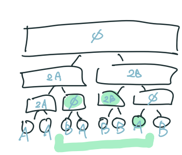

- <https://blog.nowcoder.net/n/27772b54fd3c4968b905303d83138dea?from=nowcoder_improve>

## 線段樹基本

???+note "區間開根號 [LOJ #10128. 「一本通 4.3 练习 2」花神游历各国](https://loj.ac/p/10128)"
    給一個長度為 n 的陣列 $a_1,\ldots ,a_n$，跟 $q$ 個操作，操作有兩種：

    -  $\text{query}(l,r):$ 查詢序列 $a$ 在區間 $[l, r]$ 的和。
    -  $\text{sqrt}(l,r):$ 把 $a_l,\ldots ,a_r$ 的值個別開根號後取下高斯。
    
    $n\le 10^5,q\le 2\times 10^5,a_i\le 10^9$
    
    ??? note "思路"
    	跟區間除法一樣 mx > 0 再跟新，區間和就用線段樹的 pull 維護就好了

## 括號

### 合法定義

- 左右括號數量要相同 

- 任意前綴中，右括號的數目不能大於左括號的數目

### 題目

???+note "最長合法括號序列 [CF 380 C. Sereja and Brackets](https://www.luogu.com.cn/problem/CF380C)"
	給定一個長度 $n$ 的括號序列 $s$，有 $q$ 個詢問 :
	
	- $\text{query}(l, r):$ 輸出 $s_l,\ldots ,s_r$ 的最長合法括號序列長度
	
	$1\le n\le 10^6, 1\le m\le 10^5$
	
	??? note "思路"
		我們考慮用線段樹去維護。考慮記錄每個區間
		
		- 未匹配的左括號數量
	
		- 未匹配的右括號數量
	
		- 當前區間已經產生的貢獻和
	
		在合併兩個區間時: 新區間的貢獻 = 左區間原先的貢獻 + 右區間原先的貢獻 + 合併後新產生的貢獻。其中，合併後新產生的貢獻 = 2 * min(左區間未匹配的左括號數, 右區間未匹配的右括號數)。
		
		```cpp linenums="1"
		struct Node {
			Node *lc = nullptr;
			Node *rc = nullptr;
			int l, r;
			int sum, vl, vr;
			
			void pull() {
				int macthes = min(l->vl, r->vr);
				sum = lc->sum + rc->sum + 2 * macthes;
				vl = l->vl + r->vl - matches;
				vr = l->vr + r->vr - matches;
			}
		};
		```
		
		> 參考 : <https://blog.csdn.net/weixin_45799835/article/details/120037468>

???+note "合法判斷/最大匹配深度 [CF 1263 E. Editor](https://codeforces.com/contest/1263/problem/E)"
	現在有一個打字機，有以下操作 :
	
	- `L` : 將 pointer 往左移 1 格
	
	- `R` : 將 pointer 往右移 1 格
	
	- 一個小寫字母或者 `(`, `)` : 將 pointer 上的字元替換為給定字元
	
	在每次操作後，判斷這一行是否是合法括號序列
	
	??? note "思路"
		對於一個區間而言，括號能否成功匹配有兩個判斷標準: 
		
		1. 左右括號數量要相同
		2. 任意前綴中，右括號的數目不能大於左括號的數目.
	
		如果我們把左括號看為 +1，右括號看為 -1，則上述標準等價於: 
		
		1. 區間和為 0
		2. 區間最小前綴和也應等於 0
	
		此時最大匹配深度應是區間最大連續子段和。假設區間可以正確匹配，則前綴和不會出現負數情況，因此最大連續子段和等價於最大前綴和，我們只需要維護最大前綴和即可。
		
		因此對於這類問題，我們只需要維護 :
		
		- 最大前綴和（最大深度）
	
		- 最小前綴和（判斷合法）
	
		- 區間和（判斷合法）
	
		> 參考 : <https://blog.csdn.net/weixin_45799835/article/details/120182104>

???+note "[CF 1149 C](https://www.luogu.com.cn/blog/368107/solution-cf1149c)"

## 掃描線

- 曼哈頓轉雪茄夫距離
- [class 10](https://drive.google.com/file/d/1-KGWKW8z2foucvcgeMJ0j2MABreT3sVF/view)

### 矩形覆蓋相關問題

???+note "不用離散化版 [CSES - Area of Rectangles](https://cses.fi/problemset/task/1741)"
	給 $n$ 個矩形 $(x_1, x_2)$ 到 $(y_1, y_2)$，問他們的聯集面積
	
	$n\le 10^5, -10^6\le x_1, x_2, y_1, y_2 \le 10^6$

將問題轉換成在一維上的操作，也就是好幾個 events，變成好幾個區間 +1, -1。

<figure markdown>
  { width="400" }
</figure>

v[i]: 存當前掃描線的 y = i 被多少矩形 cover。對於每一個 x，答案就是 v[i] > 0 的數量，我們可以用線段樹維護區間最小值 minv，以及出現幾次 cntv。

- 若 minv = 0 ⇒ ans = total - cntv

- 若 minv > 0 ⇒ ans = total

???+note "[2021 全國賽 pF. 歡樂外送點](https://tioj.ck.tp.edu.tw/problems/2228)" 
	給 $n$ 個菱形，中心點為 $(x_i, y_i)$，半徑為 $r_i$，權值為 $w_i$。問所有格子點的上被覆蓋到的權值總和最大值
	
	$n\le 3\times 10^5, 0\le x_i, y_i, r_i\le 10^8, 1\le w_i \le 100$
	
	??? note "思路"
		<figure markdown>
          { width="400" }
        </figure>
	
???+note "矩形周長 [POJ 1177](https://vjudge.net/problem/POJ-1177)"
	給 $n$ 個矩形 $(x_1, x_2)$ 到 $(y_1, y_2)$，問他們所形成的輪廓週長
	
	$n\le 10^5, -10^6\le x_1, x_2, y_1, y_2 \le 10^6$	
	
???+note "[LOJ #6276.果树](https://loj.ac/p/6276)"
	給出一棵 $n$ 個點的樹，每個點有一種顏色。問有多少條路徑滿足路徑上任意兩點的顏色都不同。 
	
	$n\le 10^5$，滿足每種顏色至多出現 $20$ 次。
	
	??? note "思路"
		將 path $(u,v)$ 的 $\texttt{dfn}[u],\texttt{dfn}[v]$ 打在二維平面上，同樣顏色的點會形成一些矩形，那些矩形就不能選的地方，答案就是沒被任何矩形覆蓋到的二維座標點。由於需要 $O(20^2)$ 枚舉同樣顏色的點，每次會生成 $4$ 個矩形，所以 worst case $O((C^{20}_2 \times 4 \times \frac{n}{C^{20}_2})\times \log n)\approx 7.6\times 10^7$

變化問題：至少被 2 個矩形覆蓋的區域面積總合
- min,sec

變化問題：至少被 K 個矩形覆蓋的區域面積總合

變化問題：輸入的矩形的的長或寬至少有一個是 1，求聯集


## 線段樹優化建圖

- https://tioj.ck.tp.edu.tw/problems/1169

## 線段樹分治

- https://zhuanlan.zhihu.com/p/557382505?utm_id=0

- https://www.luogu.com.cn/blog/AlexWei/solution-p8097

## 打架線段樹

???+note "區間數字個數"
	給一個長度為 $n$ 陣列，$q$ 筆詢問 :
	
	- $\text{query}(l,r,x):a_l,\ldots ,a_r$，$x$ 出現的次數
	
	- $\text{update}(i,x):$ 將 $a_i=x$
	
	$n,q\le 2\times 10^5,x\le 10^9$
	
	??? note "思路"
		（靜態）沒 update : vec[x] 放 $a_i=x$ 的所有 $x$
		
		（動態）有 update : DS[x] 支援 
		
		- insert(i)
	
		- erase(i)
	
		- lower_bound(i)
	
		使用 Treap 或 `pb_ds::tree`
	
	??? note "code"
		```cpp linenums="1"
		// using pbds
		tree<pii,null_type,less<pii>,rb_tree_tag,tree_order_statistics_node_update> T;
		
		// update(i, x)
		T.erase({a[i], i});
		a[i] = x;
		T.insert({a[i], i});
		
		// query(l, r, x)
		cout << T.order_of_key(mk(id, r + 1)) - T.order_of_key(mk(id, l)); 
		```

???+note "[資芽 OJ 794 — 區間絕對眾數](https://neoj.sprout.tw/problem/794/)"

    輸入一個長度為 $N$ 的正整數序列 $a_1, \ldots, a_N$，接下來有 $Q$ 筆詢問。
    
    每筆詢問輸入 $l_i, r_i$，輸出區間 $[l_i, r_i]$ 的絕對眾數，若不存在請輸出 $0$。
    
    $N, Q \leq 5 \times 10^5, 1 \leq a_i \leq 5 \times 10^5$
    
    ??? note "思路"
    	<figure markdown>
          { width="300" }
        </figure>
        
    ??? note "code"
    	```cpp linenums="1"
    	#include <bits/stdc++.h>
        #include <bits/extc++.h>
        #define int long long
        #define pii pair<int, int>
        #define pb push_back
        #define mk make_pair
        #define F first
        #define S second
        #define ALL(x) x.begin(), x.end()
    
        using namespace std;
        using namespace __gnu_pbds;
    
        tree<pii,null_type,less<pii>,rb_tree_tag,tree_order_statistics_node_update> T;
    
        const int INF = 2e18;
        const int maxn = 5e5 + 5;
        const int M = 1e9 + 7;
    
        struct Node {
            Node* lc = nullptr;
            Node* rc = nullptr;
            int l, r;
            int id = -1, cnt = 0;
    
            Node(int l, int r) : l(l), r(r) {}
    
            void pull () {
                if (lc->cnt == 0) {
                    id = rc->id;
                    cnt = rc->cnt;
                    return;
                } 
                if (rc->cnt == 0) {
                    id = lc->id;
                    cnt = lc->cnt;
                    return;
                }
                if (lc->id == rc->id) {
                    id = lc->id;
                    cnt = lc->cnt + rc->cnt;
                } else {
                    if (lc->cnt > rc->cnt) {
                        id = lc->id;
                        cnt = lc->cnt - rc->cnt;
                    } else {
                        id = rc->id;
                        cnt = rc->cnt - lc->cnt;
                    }
                }
            }
        };
    
        int n, q;
        int a[maxn];
    
        Node* build (int l, int r) {
            Node* root = new Node(l, r);
            if (l == r) {
                root->id = a[l];
                root->cnt = 1;
                return root;
            }
    
            int mid = (l + r) / 2;
            root->lc = build(l, mid);
            root->rc = build(mid + 1, r);
            root->pull();
            return root;
        }
    
        pii query(const Node* root, int ql, int qr) {
            if (qr < root->l || root->r < ql) return {-1, 0};
            if (ql <= root->l && root->r <= qr) {
                return {root->id, root->cnt};
            } 
    
            pii tmp = {-1, 0};
            if (ql <= root->lc->r) {
                pii ret = query(root->lc, ql, qr);
                if (tmp.S == 0) {
                    tmp = ret;
                } else if (ret.S != 0) {
                    if (ret.F == tmp.F) {
                        tmp.S += ret.S;
                    } else {
                        if (ret.S > tmp.S) {
                            tmp.F = ret.F;
                            tmp.S = ret.S - tmp.S;
                        } else {
                            tmp.S = tmp.S - ret.S;
                        }
                    }
                }
            }
            if (root->rc->l <= qr) {
                pii ret = query(root->rc, ql, qr);
                if (tmp.S == 0) {
                    tmp = ret;
                } else if (ret.S != 0) {
                    if (ret.F == tmp.F) {
                        tmp.S += ret.S;
                    } else {
                        if (ret.S > tmp.S) {
                            tmp.F = ret.F;
                            tmp.S = ret.S - tmp.S;
                        } else {
                            tmp.S = tmp.S - ret.S;
                        }
                    }
                }
            }
            return tmp;
        }
    
        void init() {
            cin >> n >> q;
            for (int i = 0; i < n; i++) {
                cin >> a[i];
                T.insert ({a[i], i});
            }
        }
    
        void solve() {
            Node* root = build(0, n - 1);
            while (q--) {
                int l, r;
                cin >> l >> r;
                l--, r--;
    
                auto [id, c] = query(root, l, r);
                if (c == 0) {
                    cout << 0 << '\n';
                    continue;
                }
                int cnt = T.order_of_key(mk(id, r + 1)) - T.order_of_key(mk(id, l)); 
                if (cnt > (r - l + 1) / 2) {
                    cout << id << '\n';
                } else {
                    cout << 0 << '\n';
                }
            }
        }
    
        signed main() {
            int t = 1;
            while (t--) {
                init();
                solve();
            }
        } 
        ```

???+note "[TIOJ 2140. 殿壬愛序列](https://tioj.ck.tp.edu.tw/problems/2140)"
    給一個長度為 $n$ 的序列，請支援三種操作：

    1. 給定 $i,x$，將 $a_i$ 設成 $x$
    2. 給定 $l,r,k$，$\forall l\le i\le r,a_i=\lfloor \frac{a_i}{k} \rfloor$
    3. 給定 $l,r$，輸出 $a_l,a_{l+1},\ldots ,a_r$ 的絕對多數，若不存在輸出 $-1$
    
    $n,q\le 10^5$
    
    ??? note "思路"
    	> 參考 : <https://abc864197532.github.io/2021/02/07/tioj-2140/>
    	
        區間除法的部分，因為 $k = 1$ 不會影響陣列，所以可以視為 $k \geq 2$。當區間的最大值 $>0$ 的時候才繼續遞迴下去。這樣一來每個數最多只會被除 $\log C$ 次。實作上每次將一個點除到 $0$ 需要 $O(\log C\times \log n)$，又每次修改只是單點修改，所以複雜度會是 $O((n + q)\log C \log n)\approx 1.2\times 10^8$。
        
        ```cpp linenums="1"
        // 區間除法代碼
        void division(Node* root, int mL, int mR, int val) {
            if (root->r < mL || mR < root->l) return;
            if (root->l == root->r) {
                root->id /= val;
                root->mx = root->id;
                return;
            }
    
            if (mL <= root->lc->r && root->lc->mx) {
                division(root->lc, mL, mR, val);
            }
            if (root->rc->l <= mR && root->rc->mx) {
                division(root->rc, mL, mR, val);
            }
            root->pull();
        }
        ```
        
        單點修改，區間絕對眾數上面都有提到，略。
    
    ??? note "實作細節"
    	記得要特判 k = 1
    	
    ??? note "code"
    	```cpp linenums="1"
    	#include <bits/stdc++.h>
        #include <bits/extc++.h>
        #define int long long
        #define pii pair<int, int>
        #define pb push_back
        #define mk make_pair
        #define F first
        #define S second
        #define ALL(x) x.begin(), x.end()
    
        using namespace std;
        using namespace __gnu_pbds;
    
        tree<pii,null_type,less<pii>,rb_tree_tag,tree_order_statistics_node_update> T;
    
        const int INF = 2e18;
        const int maxn = 3e5 + 5;
        const int M = 1e9 + 7;
    
        struct Node{
            int l, r;
            Node *lc = nullptr;
            Node *rc = nullptr;
            int id = -1, cnt = 0;
            int mx;
    
            Node (int l, int r) : l(l), r(r) {}
    
            void pull () {
                if (lc->cnt == 0) {
                    id = rc->id;
                    cnt = rc->cnt;
                } else if (rc->cnt == 0) {
                    id = lc->id;
                    cnt = lc->cnt;
                } else {
                    if (lc->id == rc->id) {
                        id = lc->id;
                        cnt = lc->cnt + rc->cnt;
                    } else {
                        if (lc->cnt > rc->cnt) {
                            id = lc->id;
                            cnt = lc->cnt - rc->cnt;
                        } else {
                            id = rc->id;
                            cnt = rc->cnt - lc->cnt;
                        }
                    }
                }
                mx = max(lc->mx, rc->mx);
            }
        };
    
        int n, q;
        int a[maxn];
    
        Node* build (int l, int r) {
            Node* root = new Node(l, r);
            if (l == r) {
                root->id = a[l];
                root->cnt = 1;
                root->mx = a[l];
                return root;
            }
    
            int mid = (l + r) / 2;
            root->lc = build(l, mid);
            root->rc = build(mid + 1, r);
            root->pull();
            return root;
        }
    
        void update(Node* root, int pos, int val) {
            if (root->l == root->r) {
                T.erase({root->id, root->l});
                root->id = val;
                root->cnt = 1;
                root->mx = val;
                T.insert({root->id, root->l});
                return;
            }
    
            if (pos <= root->lc->r) {
                update(root->lc, pos, val);
            } else {
                update(root->rc, pos, val);
            }
            root->pull();
        }
    
        void division(Node* root, int mL, int mR, int val) {
            if (root->r < mL || mR < root->l) return;
            if (root->l == root->r) {
                T.erase({root->id, root->l});
                root->id /= val;
                root->mx = root->id;
                T.insert({root->id, root->l});
                return;
            }
    
            if (mL <= root->lc->r && root->lc->mx) {
                division(root->lc, mL, mR, val);
            }
            if (root->rc->l <= mR && root->rc->mx) {
                division(root->rc, mL, mR, val);
            }
            root->pull();
        }
    
        pii query(const Node* root, int ql, int qr) {
            if (qr < root->l || root->r < ql) return {-1, 0};
            if (ql <= root->l && root->r <= qr) {
                return {root->id, root->cnt};
            } 
    
            pii tmp = {-1, 0};
            if (ql <= root->lc->r) {
                pii ret = query(root->lc, ql, qr);
                if (tmp.S == 0) {
                    tmp = ret;
                } else if (ret.S != 0) {
                    if (ret.F == tmp.F) {
                        tmp.S += ret.S;
                    } else {
                        if (ret.S > tmp.S) {
                            tmp.F = ret.F;
                            tmp.S = ret.S - tmp.S;
                        } else {
                            tmp.S = tmp.S - ret.S;
                        }
                    }
                }
            }
            if (root->rc->l <= qr) {
                pii ret = query(root->rc, ql, qr);
                if (tmp.S == 0) {
                    tmp = ret;
                } else if (ret.S != 0) {
                    if (ret.F == tmp.F) {
                        tmp.S += ret.S;
                    } else {
                        if (ret.S > tmp.S) {
                            tmp.F = ret.F;
                            tmp.S = ret.S - tmp.S;
                        } else {
                            tmp.S = tmp.S - ret.S;
                        }
                    }
                }
            }
            return tmp;
        }
    
        void init() {
            cin >> n >> q;
            for (int i = 0; i < n; i++) {
                cin >> a[i];
                T.insert ({a[i], i});
            }
        }
    
        void solve() {
            Node* root = build(0, n - 1);
    
            int op;
            while(q--) {
                cin >> op;
                if (op == 1) {
                    int i, x;
                    cin >> i >> x;
                    i--;
                    update(root, i, x);
                } else if (op == 2) {
                    int l, r, k;
                    cin >> l >> r >> k;
                    l--, r--;
                    if (k > 1) division(root, l, r, k);
                } else {
                    int l, r;
                    cin >> l >> r;
                    l--, r--;
                    auto [id, c] = query(root, l, r);
                    if (c == 0) {
                        cout << "-1" << '\n';
                        continue;
                    }
                    int cnt = T.order_of_key(mk(id, r + 1)) - T.order_of_key(mk(id, l)); 
                    if (cnt > (r - l + 1) / 2) {
                        cout << id << '\n';
                    } else {
                        cout << "-1" << '\n';
                    }
                }
            }
        }
    
        signed main() {
            ios::sync_with_stdio(0);
            cin.tie(0);
            int t = 1;
            //cin >> t;
            while (t--) {
                init();
                solve();
            }
        }
        ```

## 區間除法

???+note "[2023 YTP 國中組初賽 p6](/wiki/ds/images/YTP2023PreliminaryContest_J1.pdf)"
	給一個長度為 $N$ 的序列 $a_1,a_2,\ldots, a_N$，$Q$ 筆以下操作 :
	
	- $\texttt{f}\space l\space r\space x:$ 對於 $l\le i\le r$，$a_i$ 變成 $\displaystyle  \lfloor \frac{a_i}{x} \rfloor$
	
	- $\texttt{c}\space l\space r\space x:$ 對於 $l\le i\le r$，$a_i$ 變成 $\displaystyle \lceil \frac{a_i}{x} \rceil$
	
	- $\texttt{?}\space k:$ 輸出 $a_k$
	
	$N,Q\le 2\times 10^5,1\le a_i,x\le 10^9$
	
	???+note "思路"
		ceil 除法的話是把 floor 的除法改一下變區間最大值是 1 的時候不遞迴做下去

???+note "[2016 全國賽 直升機抓寶 (Helicopter)](https://tioj.ck.tp.edu.tw/problems/1941)"
	有一個 $n\times n$ 的 grid。你一開始在左下角，要走到右上角去，你只能往上或往右走。每一個 row 都有一個特殊的區間，範圍是 $l_i$ 到 $r_i$，求你最多能經過幾個特殊區間。
	
	$n\le 8\times 10^5$
	
	??? note "思路"
		考慮 dp(i, j) = 走到 (i, j) 最多經過幾個，轉移式 dp(i, j) = max(dp(i, j - 1), dp(i - 1, j) + 1 | if (i, j) is in interval)
		
		可以觀察到一個 row 的 dp(i, j) 會是單調遞增的，且會被改變的只有 interval 以及 interval 以後的一個前綴
		
		<figure markdown>
	      { width="400" }
	    </figure>
	    
	    這樣我們就只要維護一個 segment tree 代表當前 row 的 dp 值，看到 interval 的時候就在上面 walk 到最後一個小於等於的。

???+note "[CSES - Increasing Array Queries](https://cses.fi/problemset/task/2416)"
	給一個長度為 $n$ 的陣列 $a_1, \ldots ,a_n$，有 $q$ 筆查詢 :
	
	$\text{query}(l,r):$ 每次可以將某一項 +1，問需要做幾次 $a_l, \ldots ,a_r$ 才會非嚴格遞增
	
	$n,q\le 2\times 10^5, 1\le a_i\le 10^9$
	
	??? note "思路"
		將詢問按照 $l_i$ 大到小排序，用單調 stack 維護支配的項
		
	??? note "code"
		```cpp linenums="1"
		#include <bits/stdc++.h>
	    #define int long long
	    #define ALL(x) x.begin(), x.end()
	
	    using namespace std;
	
	    const int INF = 2e18;
	
	    struct Query{
	        int l, r, id;
	
	        bool operator<(const Query &rhs) const {
	            return l > rhs.l;
	        }
	    };
	
	    struct Node{
	        Node* lc = nullptr;
	        Node* rc = nullptr;
	        int l, r;
	        int chg, sum;
	        Node(int l, int r) : l(l), r(r) {
	            chg = 0;
	        }
	
	        void pull() {
	            sum = lc->sum + rc->sum;
	        }
	        void push() {
	            if (chg) {
	                lc->sum = chg * (lc->r - lc->l + 1);
	                rc->sum = chg * (lc->r - lc->l + 1);
	                lc->chg = chg;
	                rc->chg = chg;
	                chg = 0;
	            }
	        }
	    };
	
	    Node* build(int l, int r) {
	        Node* root = new Node(l, r);
	        if (l == r) {
	            root->sum = 0;
	            return root;
	        }
	        int mid = (l + r) / 2;
	        root->lc = build(l, mid);
	        root->rc = build(mid + 1, r);
	        root->pull();
	        return root;
	    }
	
	    void update(Node* root, int ml, int mr, int val) {
	        if (mr < root->l || root->r < ml) {
	            return;
	        }
	        if (ml <= root->l && root->r <= mr) {
	            root->sum = val * (root->r - root->l + 1);
	            root->chg = val;
	            return;
	        }
	        root->push();
	        update(root->lc, ml, mr, val);
	        update(root->rc, ml, mr, val);
	        root->pull();
	    }
	
	    int ask(Node* root, int ql, int qr) {
	        if (qr < root->l || root->r < ql) {
	            return 0;
	        }
	        if (ql <= root->l && root->r <= qr) {
	            return root->sum;
	        }
	        root->push();
	        return ask(root->lc, ql, qr) + ask(root->rc, ql, qr);
	    }
	
	    const int N = 2e5 + 5;
	    int n, q;
	    int a[N], pre[N], ans[N];
	
	    signed main() {
	        cin >> n >> q;
	        for (int i = 1; i <= n; i++) {
	            cin >> a[i];
	            pre[i] = pre[i - 1] + a[i];
	        }
	        vector<Query> query;
	        for (int i = 1; i <= q; i++) {
	            int l, r;
	            cin >> l >> r;
	            query.push_back({l, r, i});
	        }
	        sort(ALL(query));
	        Node* root = build(1, n);
	        stack<int> stk;
	        int l = n + 1;
	        for (auto &i : query) {
	            while (i.l < l) {
	                l--;
	                while (stk.size() && a[stk.top()] <= a[l]) {
	                    int ml = stk.top();
	                    stk.pop();
	                    int mr;
	                    if (stk.size()) {
	                        mr = stk.top() - 1;
	                    } else {
	                        mr = n;
	                    }
	                    update(root, ml, mr, a[l]);
	                }
	                update(root, l, l, a[l]);
	                stk.push(l);
	            }
	            ans[i.id] = ask(root, i.l, i.r) - (pre[i.r] - pre[i.l - 1]);
	        }
	        for (int i = 1; i <= q; i++) {
	            cout << ans[i] << '\n';
	        }
	    } 
	    ```

???+note "[CSES - Polynomial Queries](https://cses.fi/problemset/task/1736)"
	給一個長度為 $n$ 的序列 $a_1, \ldots ,a_n$，有 $q$ 次以下操作 :
	
	- $\text{update}(i):$ 將 $a_i$ += 1, $a_{i+1}$ += 2, ...
	
	- $\text{query}(l,r):$ 輸出 $a_l + \ldots ,a_r$
	
	$1\le n,q \le 2\times 10^5$
	
	??? note "思路"
		開兩顆 Segment Tree，Seg1 維護 $1\times i_1, 2\times i_2, 3\times i_3, \ldots$，Seg2 就是一般的線段樹
		
		- update
	
			- Seg1 : 區間每項都 +1
	
			- Seg2 : 區間每項都 -(l - 1)
	
		- query 
	
			- Seg1[l, r] + Seg2[l, r]

## 二維 BIT

???+note "[CSES - Forest Queries II](https://cses.fi/problemset/task/1739)"
	$n\times n$ 的 grid 上，$q$ 個以下操作 :

    - 改變一格的狀態（0/1）
    
    - 詢問一個矩形區域的和
    
    $n\le 1000, q\le 2\times 10^5$
    
    ??? note "思路"
    	yuihuang code
    	
    ??? note "code"
    	```cpp linenums="1"
    	
    	```

???+note "[NPSC 2020 高中組初賽 pF. 兔田建設](https://contest.cc.ntu.edu.tw/npsc2020/teamclient/semi_senior.pdf#page=15)"
	給一個長度為 $n$ 的序列 $a_1, \ldots, a_n$，給 $k$，有 $q$ 筆詢問 : 
	
	- $\text{query}(v,l,r,c):$ 問 $a_l, \ldots, a_r$ 有沒有長度為 $k$ 的區間中，恰有 $c$ 個 $\le v$ 的數
	
	$n,q,k\le 10^6$
	
	??? note "思路"
		把詢問按 $v$ 排序，就可以先把 $<v$ 的位置都塗上顏色，可以用線段樹維護每個位置開頭的長度 $k$ 的區間中，有幾個位置塗顏色，最難的地方是找有沒有出現 $c$。
		
		開頭在 $i$ 的區間和開頭在 $i+1$ 的區間，塗色的位置數量最多只會差 1，所以可以用類似介值定理的想法，$c$ 在最小值和最大值之間就表示有出現 $c$。
		
		> 參考自 : <https://www.wiwiho.me/2020/11/21/npsc2020pre/>

## 參考

- <https://drive.google.com/file/d/1-X36kSojmhmMofC6zMLmLAt88j87ZJsn/view>

- <https://hackmd.io/@ouE8-gp2T7WkFQPps-mglA/HJNs5ohmN?print-pdf>