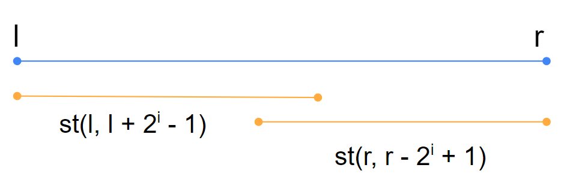

## 介紹

Sparse Tabel 是一種支援在**靜態**情況下 O(1) 查詢一段區間的最大或最小值的資料結構。

## 建立 Sparse Table

???+note "[CSES - Static Range Minimum Queries]()"
	給一個陣列，q 次詢問:
	
	- $\text{query}(l, r):$ 查詢 $a_l, ..., a_r$ 內的最小值
	
	$n, q \le 2 \times 10^5, 1 \le a_i \le 10^9$

我們使用倍增法，令 st(i, j) = 從 a[j] ~ a[j + 2<sup>i</sup> - 1] 的最小值。跟 lca 很像，我們可以列出轉移式

- st(0, j) = a[j]
- st(i, j) = min(st(i - 1, j), st(i - 1, j + 2<sup>i</sup>))

以下是 Sparse Table 的實作。

??? note "code"
	```cpp linenums="1"
	void build () {
	    int lg = std::__lg(n);
	    for (int i = 1; i <= n; i++) par[0][i] = a[i];
	    for (int i = 1; (1 << i) <= n; i++) {
	        for (int j = 1; j + (1 << i) - 1 <= n; j++) {
	            par[i][j] = min (par[i - 1][j], par[i - 1][j + (1 << (i - 1))]);
	        }
	    }
	}
	```
	
## 查詢最小值

令 i = log(r - l + 1)，從 l 開始到後面長度為 2<sup>i</sup> 的與從 r 開始往前長度為 2<sup>i</sup> 的這兩個 interval 聯集起來的最小即為所求。因為從左右兩端 log(r - l + 1) 的長度如果沒有 overlap，一定至少會覆蓋整個區間，所以是可行的。

<figure markdown>
  { width="400" }
</figure>

但若嫌每次計算 log 太花時間，我們也可以對 log 也進行的預處理：

??? note "code"
	```cpp linenums="1"
	for (int i = 2; i <= n; i++) {
		log_value[i] = log_value[i / 2] + 1;
	}
    ```

query 的程式碼如下：

??? note "code"
	```cpp linenums="1"
	int query (int l, int r) {
	    int lg = std::__lg(r - l + 1);
	    return min (par[lg][l], par[lg][r - (1 << lg) + 1]);
	}
	```

### 模板

???+note "code"

	```cpp linenums="1"
	int par[21][maxn];
	int a[maxn];
	
	void build () {
	    int lg = std::__lg(n);
	    for (int i = 1; i <= n; i++) par[0][i] = a[i];
	    for (int i = 1; (1 << i) <= n; i++) {
	        for (int j = 1; j + (1 << i) - 1 <= n; j++) {
	            par[i][j] = min (par[i - 1][j], par[i - 1][j + (1 << (i - 1))]);
	        }
	    }
	}
	
	int query (int l, int r) {
	    int lg = std::__lg(r - l + 1);
	    return min (par[lg][l], par[lg][r - (1 << lg) + 1]);
	}
	```

## 例題

???+note "模板測試 [CSES - Static Range Minimum Queries](https://cses.fi/problemset/task/1647)"
	給一個長度為 $n$ 的陣列 $a_1,\ldots ,a_n$，$q$ 次詢問 :
	
	- $\text{min}(l,r):$ $\{a_l,\ldots ,a_r\}$ 的最小值
	
	$n,q\le 2\times 10^5,1\le a_i\le 10^9$

???+note "[CF 1904 D2. Set To Max (Hard Version)](https://codeforces.com/problemset/problem/1904/D2)"
	給兩個序列 $a,b$，問要進行幾次以下操作才能讓 $a=b$:
	
	- $\text{update}(l,r):$ 讓所有 $a_l,\ldots ,a_r$ 都改成 $\max\{ a_l,\ldots ,a_r\}$
	
	$n\le 2\times 10^5, 1\le a_i, b_i\le n$ 	
	
	??? note "思路"
		考慮能變得 interval 要符合什麼條件，假設當前要改 $a_i$，則我們要找到最近的 $j$ 滿足 $b_i=a_j$，而且對於 $i\le k\le j$:
		
		-  不能將 interval 內的項改的比他的 threshold 還小，也就是 $b_i\le b_k$ 
	
		- $a_j$ 要是 interval $[i,j]$ 內的最大值，也就是 $a_k\le b_i$ 
	
		所以我們從 $i=1\ldots n$，若當前 $a_i\neq b_i$，則將依照上面改即可，優化用 Sparse Table

???+note "[2021 附中模競 II pD. 調色盤 (Palette)](https://drive.google.com/file/d/1Qw4eUf0uSrLDOsdrq11xZxrCAVubAW4P/view)"
	給一個長度為 $n$ 的陣列 $a_1 ,\ldots ,a_n$，有 $q$ 筆詢問如下 :
	
	- $\text{query}(l,r):$ 問 $a_l \sim a_r$ 裡有幾個 subarray 滿足最大最小差 $\le k$
	
	$n,k\le 10^6,c_i\le 10^6,q\le 10^6$
	
	??? note "思路"
		對於每個 i 定義 last[i] = 從 i 開始最大可以到哪個 index 滿足區間 max - min <= k
		
		這可以用 two pointer + sparse table 預處理
		
		然後對於 query(l, r) 就可以二分搜最大的分界點 t，滿足前面的 last[i] 都 <= r，後面的都 > r。前面的可以對於 last[ ] 維護 prefix sum，後面用數學解 O(1) 算即可

## Disjoint Sparse Table

<https://codeforces.com/blog/entry/87940>

query[l, r]

建立 log n 個 level

level[i] 處理 l 和 r 最高位相異 bit 是 i 的 query