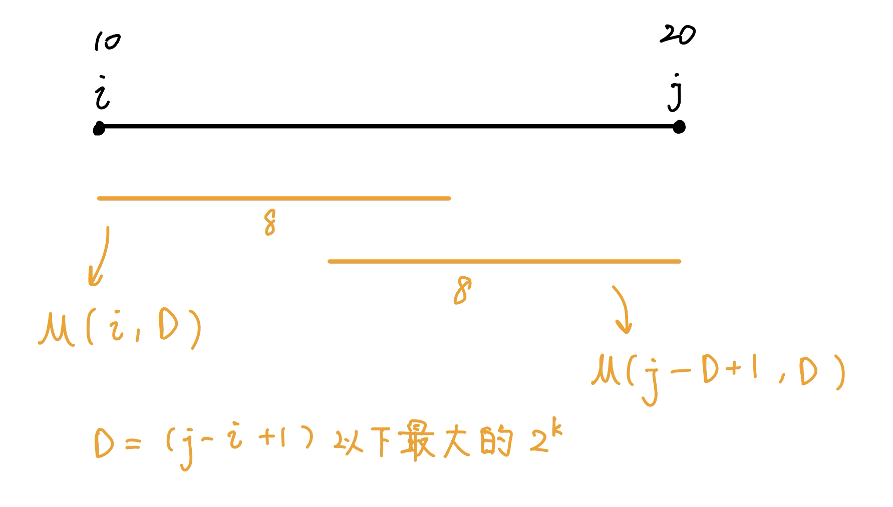

## 介紹

Sparse Tabel 支援 :

- 靜態 O(1) 查詢一段區間的 max/min

### build

$M(i, \ell) = \max(a_i, a_{i+1}, \ldots, a_{i+ \ell -1})$

$M(i, \ell)=\max \begin{cases} M(i, \ell / 2) \\ M(i + \ell / 2, \ell / 2) \end{cases}$

??? note "code"
	```cpp linenums="1"
	void build () {
	    int lg = std::__lg(n);
	    for (int i = 1; i <= n; i++) par[0][i] = a[i];
	    for (int i = 1; (1 << i) <= n; i++) {
	        for (int j = 1; j + (1 << i) - 1 <= n; j++) {
	            par[i][j] = min (par[i - 1][j], par[i - 1][j + (1 << (i - 1))]);
	        }
	    }
	}
	```
	
### query

從 l 開始到後面長度為 log n 的與從 r 開始往前長度為 log n 的

$\text{query}(i,j)=\max\begin{cases} M(i, D) \\ M(j - D + 1, D) \end{cases}$

<figure markdown>
  { width="400" }
</figure>

??? note "code"
	```cpp linenums="1"
	int query (int l, int r) {
	    int lg = std::__lg(r - l + 1);
	    return min (par[lg][l], par[lg][r - (1 << lg) + 1]);
	    
	}
	```

### 模板

???+note "code"

	```cpp linenums="1"
	int par[21][maxn];
	int a[maxn];
	
	void build () {
	    int lg = std::__lg(n);
	    for (int i = 1; i <= n; i++) par[0][i] = a[i];
	    for (int i = 1; (1 << i) <= n; i++) {
	        for (int j = 1; j + (1 << i) - 1 <= n; j++) {
	            par[i][j] = min (par[i - 1][j], par[i - 1][j + (1 << (i - 1))]);
	        }
	    }
	}
	
	int query (int l, int r) {
	    int lg = std::__lg(r - l + 1);
	    return min (par[lg][l], par[lg][r - (1 << lg) + 1]);
	}
	```

## 例題

???+note "模板測試 [CSES - Static Range Minimum Queries](https://cses.fi/problemset/task/1647)"
	給一個長度為 $n$ 的陣列 $a_1,\ldots ,a_n$，$q$ 次詢問 :
	
	- $\text{min}(l,r):$ $\{a_l,\ldots ,a_r\}$ 的最小值
	
	$n,q\le 2\times 10^5,1\le a_i\le 10^9$

???+note " [2021 附中模競 調色盤]()"
	class 5
	
## Disjoint Sparse Table

<https://codeforces.com/blog/entry/87940>

query[l, r]

建立 log n 個 level

level[i] 處理 l 和 r 最高位相異 bit 是 i 的 query