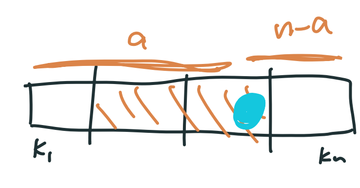
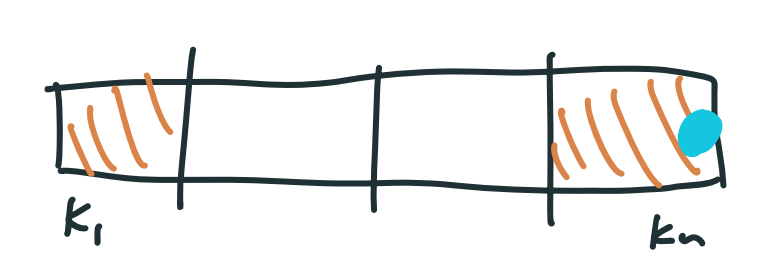
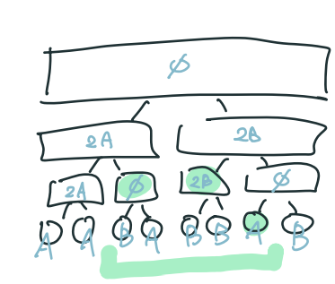

!!! info "題單 : <https://vjudge.net/contest/345697>"

## 性質

-  Key 具有樹性質
	-  左子樹 < 根
	-  右子樹 > 根
-  Priority 具有堆性質
	-  父節點 > 子節點

??? info "Treap 的高度在期望下是 $O(\log n)$"
	定義 $H(n)$ 為 $n$ 個 node 的平均樹高，目前 Treap 的 key 中序是 $k_1,\ldots,k_n$
	
	我們將 $k_1,\ldots,k_n$ 利用四分位距切成四塊
	
	<br>
	
	<div class="result" markdown>
	
	{ align=right width=300 }
	
	平均上有 $\displaystyle \frac{1}{2}$ 的機率，root 會切在中間兩塊，這時 worst case 會是切在最邊邊的地方（這樣其中一邊的點數會特別多），高度只須高度看比較高的子樹，所以 $\displaystyle H(n)=H(\frac{3}{4}n)+1$
	
	</div>
	
	<br>
	
	<div class="result" markdown>
	
	{ align=right width=300 }
	
	平均上有 $\displaystyle \frac{1}{2}$ 的機率，root 會切在最前面與最後面兩塊，這時 worst case 會是切在最邊邊的地方，高度只須高度看比較高的子樹，所以 $H(n)=H(n-1)+1$
	
	</div>
	
	<br>
	
	$$\begin{align} & H(n)=\frac{1}{2}\left(H(\frac{3}{4}n)+1\right)+\frac{1}{2}\left( H(n-1)+1 \right) \\ & H(n) \le \frac{1}{2} H(\frac{3}{4}n)+1 + \frac{1}{2}H(n) \\ & \frac{1}{2}H(n) \le \frac{1}{2} H(\frac{3}{4}n)+1 \\ & H(n)\le H(\frac{3}{4}n)+2 \end{align}$$
	
	> 換底公式 : $\log_a n=\log_a b \times \log_b n$
	
	根據換底公式 : $2\log_{\frac{3}{4}}n=2\times \log_{\frac{4}{3}}2\times \log_2 n$
	
	所以 $H(n)=O(2\times \log_{\frac{4}{3}}2\times \log_2 n)=O(\log n)$
	
	故有 $n$ 個點的 Treap 的高度高機率為 $O(\log n)$（失敗率 $\displaystyle <\frac{1}{n^c}$）


## 基本操作

### struct

- key：比較的依據，在中序要由小到大

- priority ：維持 treap 形狀的依據，最大值在 root

- val：要儲存的資料

- left, right：左右子樹的 pointer

???+note "code"
	```cpp linenums="1"
	struct Node {
        int pri;
        char val;
        Node *lc = nullptr;
        Node *rc = nullptr;
        int sz = 1;

        Node (char val) : val(val), pri(rand()) {}
    
        void pull() {
            sz = 1;
            if (lc) sz += lc->sz;
            if (rc) sz += rc->sz;
        }
    };
    ```
### Merge

merge(a, b)：把兩個 treap a, b 合併成一個 treap，用中序看 a 在左邊，b 在右邊

【前提】: 假設 a 的 key 都小於 b 的 key

???+note "code"
	```cpp linenums="1"
    Node* Merge(Node* a, Node* b) {
        if (!a) return b;
        if (!b) return a;

        if (a->pri > b->pri) {
            a->rc = Merge(a->rc, b);
            a->pull();
            return a;
        } else {
            b->lc = Merge(a, b->lc);
            b->pull();
            return b;
        }
    }
    ```

### Split

split(t, k)：把 treap 按照 key 分成兩顆，第一顆的 key 都要小於等於 k

【前提】: 左邊 treap 的 key < 右邊 treap 的key

???+note "code"
    ```cpp linenums="1"
	pair<Node*, Node*> Split(Node* root, int val) {
        if (!root) return {nullptr, nullptr};

        if (root->key <= val) {
            auto [A, B] = Split(root->rc, val);
            root->rc = A;
            root->pull();
            return {root, B};
        } else {
            auto [A, B] = Split(root->lc, val);
            root->lc = B;
            root->pull();
            return {A, root};
        }
    }
    ```

### Split by size

splitBySize(t, k)：把 treap 按照中序分成兩棵，第一棵的包含恰好 k 個 node，第二棵包含剩下的 n-k 個 node

【前提】: 左邊 treap 的 key < 右邊 treap 的key

???+note "code"
	```cpp linenums="1"
	// 把一個 treap split 成兩個 treap，滿足左邊的 treap 剛好有 k 個節點，
    // 這 k 個節點是本來 treap 中序輸出的前 k 個節點
    //
    // 左邊 treap 的 key < 右邊 treap 的key
    pair<Node*, Node*> SplitBySize(Node* root, int k) {
        if (!root) return {nullptr, nullptr};

        int cntL;  // 左子樹＋root 節點
        if (root->lc) {
            cntL = root->lc->sz + 1;
        } else {
            cntL = 1;
        }
    
        if (cntL <= k) {  // root 放左邊
            auto [A, B] = SplitBySize(root->rc, k - cntL);
            root->rc = A;
            root->pull();
            return {root, B};
        } else {
            auto [A, B] = SplitBySize(root->lc, k);
            root->lc = B;
            root->pull();
            return {A, root};
        }
    }
    ```

## 例題

???+note "[CSES - Cut and Paste](https://cses.fi/problemset/task/2072)"
	給你一個長度為 $n$ 的字母串，$q$ 次將 $(l, r)$ 剪下貼到字母串的尾端，問最後的字母串
	
	$n,q\le 2\times 10^5$
	
	??? note "code"
	    ```cpp linenums="1"
	    #include <algorithm>
	    #include <cstdlib>
	    #include <iostream>
	    #include <string>
	    #include <utility>
	
	    using namespace std;
	
	    struct Node {
	        // int key;
	        char val;
	        int pri;
	        int sz = 1;
	        int h = 0;
	        Node* lc = nullptr;
	        Node* rc = nullptr;
	
	        Node(char val) : val(val), pri(rand()) {
	        }
	        void pull() {
	            h = 0;
	            if (lc) h = max(h, lc->h + 1);
	            if (rc) h = max(h, rc->h + 1);
	            sz = 1;
	            if (lc) sz += lc->sz;
	            if (rc) sz += rc->sz;
	        }
	    };
	
	    // 假設 a 的 key 都小於 b 的 key
	    Node* Merge(Node* a, Node* b) {
	        if (!a) return b;
	        if (!b) return a;
	
	        if (a->pri > b->pri) {
	            a->rc = Merge(a->rc, b);
	            a->pull();
	            return a;
	        } else {
	            b->lc = Merge(a, b->lc);
	            b->pull();
	            return b;
	        }
	    }
	
	    // 把一個 treap split 成兩個 treap，滿足左邊的 treap 剛好有 k 個節點，
	    // 這 k 個節點是本來 treap 中序輸出的前 k 個節點
	    //
	    // 左邊 treap 的 key < 右邊 treap 的key
	    pair<Node*, Node*> SplitBySize(Node* root, int k) {
	        if (!root) return {nullptr, nullptr};
	
	        int cntL;  // 左子樹＋root 節點
	        if (root->lc) {
	            cntL = root->lc->sz + 1;
	        } else {
	            cntL = 1;
	        }
	
	        if (cntL <= k) {  // root 放左邊
	            auto [A, B] = SplitBySize(root->rc, k - cntL);
	            root->rc = A;
	            root->pull();
	            return {root, B};
	        } else {
	            auto [A, B] = SplitBySize(root->lc, k);
	            root->lc = B;
	            root->pull();
	            return {A, root};
	        }
	    }
	
	    /*
	    pair<Node*, Node*> Split(Node* root, int val) {
	        if (!root) return {nullptr, nullptr};
	
	        if (root->key <= val) {
	            auto [A, B] = Split(root->rc, val);
	            root->rc = A;
	            root->pull();
	            return {root, B};
	        } else {
	            auto [A, B] = Split(root->lc, val);
	            root->lc = B;
	            root->pull();
	            return {A, root};
	        }
	    }
	    */
	
	    int main() {
	        int n, q;
	        string str;
	
	        cin >> n >> q;
	        cin >> str;
	
	        Node* root = nullptr;
	        for (int i = 0; i < n; i++) {
	            Node* x = new Node(str[i]);
	            root = Merge(root, x);
	        }
	
	        while (q--) {
	            int l, r;
	            cin >> l >> r;
	            auto [tmp, C] = SplitBySize(root, r);
	            auto [A, B] = SplitBySize(tmp, l - 1);
	            root = Merge(A, Merge(C, B));
	        }
	
	        for (int i = 0; i < n; i++) {
	            auto [x, tmp] = SplitBySize(root, 1);
	            cout << x->val;
	            root = tmp;
	        }
	
	        return 0;
	    }
	    ```

???+note "[CSES - Substring Reversals](https://cses.fi/problemset/task/2073)"
	給你一個長度為 $n$ 的字母串，$q$ 次 reverse$(l, r)$，問最後的字母串
	
	$n,q\le 2\times 10^5$
	
	??? note "code"
	    ```cpp linenums="1"
	    #include <algorithm>
	    #include <cstdlib>
	    #include <iostream>
	    #include <string>
	    #include <utility>
	
	    using namespace std;
	
	    struct Node {
	        // int key;
	        char val;
	        int pri;
	        int sz = 1;
	        int h = 0;
	        bool rev = false;  // 是否要反轉
	        Node* lc = nullptr;
	        Node* rc = nullptr;
	
	        Node(char val) : val(val), pri(rand()) {
	        }
	        void pull() {
	            h = 0;
	            if (lc) h = max(h, lc->h + 1);
	            if (rc) h = max(h, rc->h + 1);
	            sz = 1;
	            if (lc) sz += lc->sz;
	            if (rc) sz += rc->sz;
	        }
	        void push() {
	            if (rev) {
	                swap(lc, rc);
	                if (lc) lc->rev ^= 1;
	                if (rc) rc->rev ^= 1;
	                rev = false;
	            }
	        }
	    };
	
	    // 假設 a 的 key 都小於 b 的 key
	    Node* Merge(Node* a, Node* b) {
	        if (!a) return b;
	        if (!b) return a;
	
	        if (a->pri > b->pri) {
	            a->push();
	            a->rc = Merge(a->rc, b);
	            a->pull();
	            return a;
	        } else {
	            b->push();
	            b->lc = Merge(a, b->lc);
	            b->pull();
	            return b;
	        }
	    }
	
	    // 把一個 treap split 成兩個 treap，滿足左邊的 treap 剛好有 k 個節點，
	    // 這 k 個節點是本來 treap 中序輸出的前 k 個節點
	    //
	    // 左邊 treap 的 key < 右邊 treap 的key
	    pair<Node*, Node*> SplitBySize(Node* root, int k) {
	        if (!root) return {nullptr, nullptr};
	
	        root->push();
	
	        int cntL;  // 左子樹＋root 節點
	        if (root->lc) {
	            cntL = root->lc->sz + 1;
	        } else {
	            cntL = 1;
	        }
	
	        if (cntL <= k) {  // root 放左邊
	            auto [A, B] = SplitBySize(root->rc, k - cntL);
	            root->rc = A;
	            root->pull();
	            return {root, B};
	        } else {
	            auto [A, B] = SplitBySize(root->lc, k);
	            root->lc = B;
	            root->pull();
	            return {A, root};
	        }
	    }
	
	    /*
	    pair<Node*, Node*> Split(Node* root, int val) {
	        if (!root) return {nullptr, nullptr};
	
	        if (root->key <= val) {
	            auto [A, B] = Split(root->rc, val);
	            root->rc = A;
	            root->pull();
	            return {root, B};
	        } else {
	            auto [A, B] = Split(root->lc, val);
	            root->lc = B;
	            root->pull();
	            return {A, root};
	        }
	    }
	    */
	
	    int main() {
	        int n, q;
	        string str;
	
	        cin >> n >> q;
	        cin >> str;
	
	        Node* root = nullptr;
	        for (int i = 0; i < n; i++) {
	            Node* x = new Node(str[i]);
	            root = Merge(root, x);
	        }
	
	        while (q--) {
	            int l, r;
	            cin >> l >> r;
	            auto [tmp, C] = SplitBySize(root, r);
	            auto [A, B] = SplitBySize(tmp, l - 1);
	            B->rev ^= 1;
	            root = Merge(A, Merge(B, C));
	        }
	
	        for (int i = 0; i < n; i++) {
	            auto [x, tmp] = SplitBySize(root, 1);
	            cout << x->val;
	            root = tmp;
	        }
	
	        return 0;
	    }
	    ```

???+note "Treap - rank tree [洛谷 P3369 【模板】普通平衡树](https://www.luogu.com.cn/problem/P3369)"
	實作 Treap，支援以下功能：

    1. 插入 $x$
    2. 刪除 $x$
    3. 查詢 $x$ 的是第幾小
    4. 查詢第 $k$ 小的數
    5. 求小於 $x$，最大的數
    6. 求大於 $x$，最小的數
    
    $1 \leq n \leq 10^5,|x|\le 10^7$

???+note "[TIOJ 2140. 殿壬愛序列](https://tioj.ck.tp.edu.tw/problems/2140)"
    給一個長度為 $n$ 的序列，請支援三種操作：

    1. 給定 $p,k$，將 $a_p$ 設成 $k$
    2. 給定 $l,r,k$，$\forall l\le i\le r,a_i=\lfloor \frac{a_i}{k} \rfloor$
    3. 給定 $l,r$，輸出 $a_l,a_{l+1},\ldots ,a_r$ 的絕對多數，若不存在輸出 $-1$
    
    $T$ 個數若存在絕對多數 $x$，代表 $x$ 出現的次數 $\ge \lfloor \frac{T+2}{2} \rfloor$
    
    $n,q\le 10^5$
    
    ??? note "思路"
    	<https://abc864197532.github.io/2021/02/07/tioj-2140/>

???+note "區間數字個數"
	給一個長度為 $n$ 陣列，$q$ 筆詢問 :
	
	- $\text{query}(l,r,x):a_l,\ldots ,a_r$，$x$ 出現的次數
	
	- $\text{update}(i,x):$ 將 $a_i=x$
	
	$n,q\le 2\times 10^5,x\le 10^9$
	
	??? note "思路"
		沒 update : vec[x] 放 $a_i=x$ 的所有 $x$
		
		有 update : DS[x] 支援 
		
		- insert(i)
	
		- erase(i)
	
		- lower_bound(i)
	
		使用 Treap 或 `pb_ds::tree`

???+note "[資芽 OJ 794 — 區間絕對眾數](https://neoj.sprout.tw/problem/794/)"

    輸入一個長度為 $N$ 的正整數序列 $a_1, \ldots, a_N$，接下來有 $Q$ 筆詢問。
    
    每筆詢問輸入 $l_i, r_i$，輸出區間 $[l_i, r_i]$ 的絕對眾數，若不存在請輸出 $0$。
    
    $N, Q \leq 5 \times 10^5, 1 \leq a_i \leq 5 \times 10^5$
    
    ??? note "思路"
    	<figure markdown>
          { width="300" }
        </figure>

???+note "[POJ-3580 SuperMemo](https://vjudge.net/problem/POJ-3580)"
	給定一個長度為 N 的序列 `A[]`，M 個以下操作:

    - `ADD x y k` : 將 `A[x, y]` 的每一項都加上 `k`
    
    - `REVERSE x y` : 將 `A[x, y]` 反轉
    
    - `REVOLVE x y k` : 將 `A[x, y]` 右旋 `k` 格
    
    - `INSERT x val` : 將 `val` 插入到 `A[x]` 這一項的後面
    
    - `DELETE x` : 刪除 `A[x]` 這一項
    
    - `MIN x y` : 輸出 `A[x, y]` 中的最小值
    
    $n,m\le 10^6$

???+note "[POJ 2761 - Feed the Dogs](https://vjudge.net/problem/POJ-2761)"
	給定一個長度為 $n$ 的序列 $a$，$q$ 個以下操作 : 
	
	- 給定求 $a_i,\ldots ,a_j$ 中的第 $k$ 小元素
	
	$n,m\le 10^6$
	
## 持久化 Treap

??? note "模板"
	```cpp linenums="1"
	#include <algorithm>
    #include <cstdlib>
    #include <iostream>
    #include <string>
    #include <utility>

    using namespace std;
    
    struct Node {
        // int key;
        char val;
        int pri;
        int sz = 1;
        int h = 0;
        bool rev = false;  // 是否要反轉
        Node* lc = nullptr;
        Node* rc = nullptr;
    
        Node(char val) : val(val), pri(rand()) {
        }
        void pull() {
            h = 0;
            if (lc) h = max(h, lc->h + 1);
            if (rc) h = max(h, rc->h + 1);
            sz = 1;
            if (lc) sz += lc->sz;
            if (rc) sz += rc->sz;
        }
        // x->push() 的前提是 x 已經是新的節點
        void push() {
            if (rev) {
                swap(lc, rc);
    
                if (lc) lc = new Node(*lc);
                if (rc) rc = new Node(*rc);
    
                if (lc) lc->rev ^= 1;
                if (rc) rc->rev ^= 1;
                rev = false;
            }
        }
    };
    
    // 假設 a 的 key 都小於 b 的 key
    Node* Merge(Node* a, Node* b) {
        if (!a) return b;
        if (!b) return a;
    
        if (rand() % (a->sz + b->sz) < a->sz) { // a 當 root 的機率是 sz(a) / ( sz(a) + sz(b) )
            a = new Node(*a);
            a->push();
            a->rc = Merge(a->rc, b);
            a->pull();
            return a;
        } else {
            b = new Node(*b);
            b->push();
            b->lc = Merge(a, b->lc);
            b->pull();
            return b;
        }
    }
    
    // 把一個 treap split 成兩個 treap，滿足左邊的 treap 剛好有 k 個節點，
    // 這 k 個節點是本來 treap 中序輸出的前 k 個節點
    //
    // 左邊 treap 的 key < 右邊 treap 的key
    pair<Node*, Node*> SplitBySize(Node* root, int k) {
        if (!root) return {nullptr, nullptr};
    
        root = new Node(*root);
        root->push();
    
        int cntL;  // 左子樹＋root 節點
        if (root->lc) {
            cntL = root->lc->sz + 1;
        } else {
            cntL = 1;
        }
    
        if (cntL <= k) {  // root 放左邊
            auto [A, B] = SplitBySize(root->rc, k - cntL);
            root->rc = A;
            root->pull();
            return {root, B};
        } else {
            auto [A, B] = SplitBySize(root->lc, k);
            root->lc = B;
            root->pull();
            return {A, root};
        }
    }
    
    /*
    pair<Node*, Node*> Split(Node* root, int val) {
        if (!root) return {nullptr, nullptr};
    
        if (root->key <= val) {
            auto [A, B] = Split(root->rc, val);
            root->rc = A;
            root->pull();
            return {root, B};
        } else {
            auto [A, B] = Split(root->lc, val);
            root->lc = B;
            root->pull();
            return {A, root};
        }
    }
    */
    
    int main() {
        int n, q;
        string str;
    
        cin >> n >> q;
        cin >> str;
    
        Node* root = nullptr;
        for (int i = 0; i < n; i++) {
            Node* x = new Node(str[i]);
            root = Merge(root, x);
        }
    
        while (q--) {
            int l, r;
            cin >> l >> r;
            auto [tmp, C] = SplitBySize(root, r);
            auto [A, B] = SplitBySize(tmp, l - 1);
            B->rev ^= 1;
            root = Merge(A, Merge(B, C));
        }
    
        for (int i = 0; i < n; i++) {
            auto [x, tmp] = SplitBySize(root, 1);
            cout << x->val;
            root = tmp;
        }
    
        return 0;
    }
    ```
    
???+note "持久化 Treap [NPSC 2014 pD](/wiki/ds/images/NPSC2014.pdf#page=11)"
	給一個長度為 $n$ 個子母串 $s_1,\ldots ,s_n$，以及 $m$ 筆操作 :
	
	- 輸出 $s_l,\ldots ,s_r$
	
	- 複製 $s_l,\ldots ,s_r$，貼到原本 $s_r$ 之後
	
	- reverse $s_l,\ldots ,s_r$
	
	$n,m\le 4\times 10^4$
	
???+note "持久化 Treap - rank tree [洛谷 P3835 【模板】可持久化平衡树](https://www.luogu.com.cn/problem/P3835)"
    實作持久化 Treap，支援以下功能：

    1. 插入 $x$
    2. 刪除 $x$
    3. 查詢 $x$ 的是第幾小
    4. 查詢第 $k$ 小的數
    5. 求小於 $x$，最大的數
    6. 求大於 $x$，最小的數
    
    每一次操作都是基於某一個歷史版本，同時生成一個新的版本
    
    $1 \leq n \leq 5 \times  10^5,|x_i| \leq {10}^9$

???+note "持久化 Treap [洛谷 P5055 【模板】可持久化文艺平衡树](https://www.luogu.com.cn/problem/P5055)"
	來維護一個序列，其中需要提供以下操作 :

    1. 在第 $i$ 個數後插入數字 $x$ 
    2. 刪除第 $i$ 個數
    3. reverse 區間 $a_l,\ldots ,a_r$
    4. 輸出 $a_l+\ldots +a_r$
    
    每一次操作都是基於某一個歷史版本，同時生成一個新的版本
    
    $1 \le n \le 2 \times {10}^5$，$|x_i| < {10}^6$。