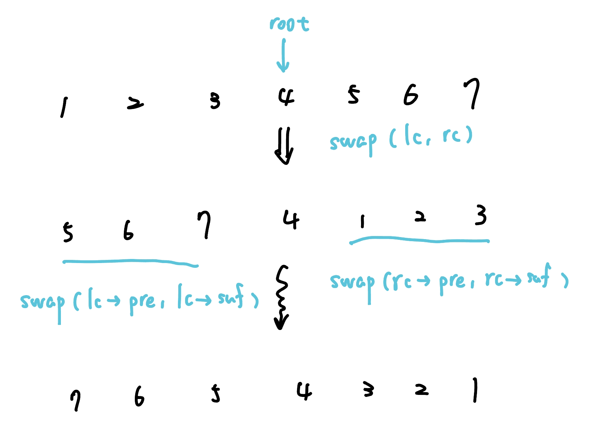
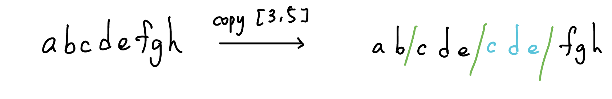

## 性質

-  Key 具有樹性質
	-  左子樹 < 根
	-  右子樹 > 根
-  Priority 具有堆性質
	-  父節點 > 子節點

??? info "Treap 的高度在期望下是 $O(\log n)$"
	定義 $H(n)$ 為 $n$ 個 node 的平均樹高，目前 Treap 的 key 中序是 $k_1,\ldots,k_n$
	
	我們將 $k_1,\ldots,k_n$ 利用四分位距切成四塊
	
	<div class="result" markdown>
	
	{ align=right width=300 }
	
	平均上有 $\displaystyle \frac{1}{2}$ 的機率，root 會切在中間兩塊，這時 worst case 會是切在最邊邊的地方（這樣其中一邊的點數會特別多），高度只須高度看比較高的子樹，所以 $\displaystyle H(n)=H(\frac{3}{4}n)+1$
	
	</div>
	
	<br>
	
	<div class="result" markdown>
	
	{ align=right width=300 }
	
	平均上有 $\displaystyle \frac{1}{2}$ 的機率，root 會切在最前面與最後面兩塊，這時 worst case 會是切在最邊邊的地方，高度只須高度看比較高的子樹，所以 $H(n)=H(n-1)+1$
	
	</div>
	
	$$
	\begin{align} & H(n)=\frac{1}{2}\left(H(\frac{3}{4}n)+1\right)+\frac{1}{2}\left( H(n-1)+1 \right) \\ & \Rightarrow H(n) \le \frac{1}{2} H(\frac{3}{4}n)+1 + \frac{1}{2}H(n) \\ & \Rightarrow \frac{1}{2}H(n) \le \frac{1}{2} H(\frac{3}{4}n)+1 \\ & \Rightarrow H(n)\le H(\frac{3}{4}n)+2 \\ & \Rightarrow H(n) = H(\frac{3}{4}n)+2 \\ & \Rightarrow H(n) = O(2\times \log_{\frac{4}{3}} n)\end{align}
	$$
	
	> 換底公式 : $\log_a n=\log_a b \times \log_b n$
	
	根據換底公式 : $2\log_{\frac{4}{3}}n=2\times \log_{\frac{4}{3}}2\times \log_2 n$
	
	所以 $H(n)=O(2\times \log_{\frac{4}{3}}2\times \log_2 n)=O(\log n)$
	
	故有 $n$ 個點的 Treap 的高度高機率為 $O(\log n)$（失敗率 $\displaystyle <\frac{1}{n^c}$）


## 基本操作

### struct

#### 變數

- key：比較的依據，在中序要由小到大

- priority ：維持 treap 形狀的依據，最大值在 root

- val：要儲存的資料

- lc, rc：左右子樹的 pointer

#### 函式

- push()：把 root 的資訊傳遞給子樹（呼叫時放在要用到 lc, rc 之前）

- pull()：把子樹的資訊更新到 root

??? note "code"
	```cpp linenums="1"
	struct Node {
        int pri;
        char val;
        Node *lc = nullptr;
        Node *rc = nullptr;
        int sz = 1;

        Node (char val) : val(val), pri(rand()) {}
    
        void pull() {
            sz = 1;
            if (lc) sz += lc->sz;
            if (rc) sz += rc->sz;
        }
    };
    ```

### Merge

merge(a, b)：把兩個 treap a, b 合併成一個 treap，用中序看 a 在左邊，b 在右邊

【前提】: 假設 a 的 key 都小於 b 的 key

??? note "code"
	```cpp linenums="1"
    Node* Merge(Node* a, Node* b) {
        if (!a) return b;
        if (!b) return a;

        if (a->pri > b->pri) {
            a->rc = Merge(a->rc, b);
            a->pull();
            return a;
        } else {
            b->lc = Merge(a, b->lc);
            b->pull();
            return b;
        }
    }
    ```

### Split

split(t, k)：把 treap 按照 key 分成兩顆，第一顆的 key 都要小於等於 k

【前提】: 左邊 treap 的 key < 右邊 treap 的key

??? note "code"
    ```cpp linenums="1"
	pair<Node*, Node*> Split(Node* root, int val) {
        if (!root) return {nullptr, nullptr};

        if (root->key <= val) {
            auto [A, B] = Split(root->rc, val);
            root->rc = A;
            root->pull();
            return {root, B};
        } else {
            auto [A, B] = Split(root->lc, val);
            root->lc = B;
            root->pull();
            return {A, root};
        }
    }
    ```

### Split by size

splitBySize(t, k)：把 treap 按照中序分成兩棵，第一棵的包含恰好 k 個 node，第二棵包含剩下的 n-k 個 node

【前提】: 左邊 treap 的 key < 右邊 treap 的 key

??? note "code"
	```cpp linenums="1"
	// 把一個 treap split 成兩個 treap，滿足左邊的 treap 剛好有 k 個節點，
    // 這 k 個節點是本來 treap 中序輸出的前 k 個節點
    //
    // 左邊 treap 的 key < 右邊 treap 的key
    pair<Node*, Node*> SplitBySize(Node* root, int k) {
        if (!root) return {nullptr, nullptr};

        int cntL;  // 左子樹＋root 節點
        if (root->lc) {
            cntL = root->lc->sz + 1;
        } else {
            cntL = 1;
        }
    
        if (cntL <= k) {  // root 放左邊
            auto [A, B] = SplitBySize(root->rc, k - cntL);
            root->rc = A;
            root->pull();
            return {root, B};
        } else {
            auto [A, B] = SplitBySize(root->lc, k);
            root->lc = B;
            root->pull();
            return {A, root};
        }
    }
    ```

## 例題

???+note "[CSES - Cut and Paste](https://cses.fi/problemset/task/2072)"
	給你一個長度為 $n$ 的字母串，$q$ 次將 $(l, r)$ 剪下貼到字母串的尾端，問最後的字母串
	
	$n,q\le 2\times 10^5$
	
	??? note "code"
	    ```cpp linenums="1"
	    #include <algorithm>
	    #include <cstdlib>
	    #include <iostream>
	    #include <string>
	    #include <utility>
	
	    using namespace std;
	
	    struct Node {
	        // int key;
	        char val;
	        int pri;
	        int sz = 1;
	        int h = 0;
	        Node* lc = nullptr;
	        Node* rc = nullptr;
	
	        Node(char val) : val(val), pri(rand()) {
	        }
	        void pull() {
	            h = 0;
	            if (lc) h = max(h, lc->h + 1);
	            if (rc) h = max(h, rc->h + 1);
	            sz = 1;
	            if (lc) sz += lc->sz;
	            if (rc) sz += rc->sz;
	        }
	    };
	
	    // 假設 a 的 key 都小於 b 的 key
	    Node* Merge(Node* a, Node* b) {
	        if (!a) return b;
	        if (!b) return a;
	
	        if (a->pri > b->pri) {
	            a->rc = Merge(a->rc, b);
	            a->pull();
	            return a;
	        } else {
	            b->lc = Merge(a, b->lc);
	            b->pull();
	            return b;
	        }
	    }
	
	    // 把一個 treap split 成兩個 treap，滿足左邊的 treap 剛好有 k 個節點，
	    // 這 k 個節點是本來 treap 中序輸出的前 k 個節點
	    //
	    // 左邊 treap 的 key < 右邊 treap 的key
	    pair<Node*, Node*> SplitBySize(Node* root, int k) {
	        if (!root) return {nullptr, nullptr};
	
	        int cntL;  // 左子樹＋root 節點
	        if (root->lc) {
	            cntL = root->lc->sz + 1;
	        } else {
	            cntL = 1;
	        }
	
	        if (cntL <= k) {  // root 放左邊
	            auto [A, B] = SplitBySize(root->rc, k - cntL);
	            root->rc = A;
	            root->pull();
	            return {root, B};
	        } else {
	            auto [A, B] = SplitBySize(root->lc, k);
	            root->lc = B;
	            root->pull();
	            return {A, root};
	        }
	    }
	
	    /*
	    pair<Node*, Node*> Split(Node* root, int val) {
	        if (!root) return {nullptr, nullptr};
	
	        if (root->key <= val) {
	            auto [A, B] = Split(root->rc, val);
	            root->rc = A;
	            root->pull();
	            return {root, B};
	        } else {
	            auto [A, B] = Split(root->lc, val);
	            root->lc = B;
	            root->pull();
	            return {A, root};
	        }
	    }
	    */
	
	    int main() {
	        int n, q;
	        string str;
	
	        cin >> n >> q;
	        cin >> str;
	
	        Node* root = nullptr;
	        for (int i = 0; i < n; i++) {
	            Node* x = new Node(str[i]);
	            root = Merge(root, x);
	        }
	
	        while (q--) {
	            int l, r;
	            cin >> l >> r;
	            auto [tmp, C] = SplitBySize(root, r);
	            auto [A, B] = SplitBySize(tmp, l - 1);
	            root = Merge(A, Merge(C, B));
	        }
	
	        for (int i = 0; i < n; i++) {
	            auto [x, tmp] = SplitBySize(root, 1);
	            cout << x->val;
	            root = tmp;
	        }
	
	        return 0;
	    }
	    ```

???+note "[CSES - Substring Reversals](https://cses.fi/problemset/task/2073)"
	給你一個長度為 $n$ 的字母串，$q$ 次 reverse$(l, r)$，問最後的字母串
	
	$n,q\le 2\times 10^5$
	
	??? note "實作細節"
		注意 reverse 懶標再更改時是 xor 
	
	??? note "code"
	    ```cpp linenums="1"
	    #include <algorithm>
	    #include <cstdlib>
	    #include <iostream>
	    #include <string>
	    #include <utility>
	
	    using namespace std;
	
	    struct Node {
	        // int key;
	        char val;
	        int pri;
	        int sz = 1;
	        int h = 0;
	        bool rev = false;  // 是否要反轉
	        Node* lc = nullptr;
	        Node* rc = nullptr;
	
	        Node(char val) : val(val), pri(rand()) {
	        }
	        void pull() {
	            h = 0;
	            if (lc) h = max(h, lc->h + 1);
	            if (rc) h = max(h, rc->h + 1);
	            sz = 1;
	            if (lc) sz += lc->sz;
	            if (rc) sz += rc->sz;
	        }
	        void push() {
	            if (rev) {
	                swap(lc, rc);
	                if (lc) lc->rev ^= 1;
	                if (rc) rc->rev ^= 1;
	                rev = false;
	            }
	        }
	    };
	
	    // 假設 a 的 key 都小於 b 的 key
	    Node* Merge(Node* a, Node* b) {
	        if (!a) return b;
	        if (!b) return a;
	
	        if (a->pri > b->pri) {
	            a->push();
	            a->rc = Merge(a->rc, b);
	            a->pull();
	            return a;
	        } else {
	            b->push();
	            b->lc = Merge(a, b->lc);
	            b->pull();
	            return b;
	        }
	    }
	
	    // 把一個 treap split 成兩個 treap，滿足左邊的 treap 剛好有 k 個節點，
	    // 這 k 個節點是本來 treap 中序輸出的前 k 個節點
	    //
	    // 左邊 treap 的 key < 右邊 treap 的key
	    pair<Node*, Node*> SplitBySize(Node* root, int k) {
	        if (!root) return {nullptr, nullptr};
	
	        root->push();
	
	        int cntL;  // 左子樹＋root 節點
	        if (root->lc) {
	            cntL = root->lc->sz + 1;
	        } else {
	            cntL = 1;
	        }
	
	        if (cntL <= k) {  // root 放左邊
	            auto [A, B] = SplitBySize(root->rc, k - cntL);
	            root->rc = A;
	            root->pull();
	            return {root, B};
	        } else {
	            auto [A, B] = SplitBySize(root->lc, k);
	            root->lc = B;
	            root->pull();
	            return {A, root};
	        }
	    }
	
	    /*
	    pair<Node*, Node*> Split(Node* root, int val) {
	        if (!root) return {nullptr, nullptr};
	
	        if (root->key <= val) {
	            auto [A, B] = Split(root->rc, val);
	            root->rc = A;
	            root->pull();
	            return {root, B};
	        } else {
	            auto [A, B] = Split(root->lc, val);
	            root->lc = B;
	            root->pull();
	            return {A, root};
	        }
	    }
	    */
	
	    int main() {
	        int n, q;
	        string str;
	
	        cin >> n >> q;
	        cin >> str;
	
	        Node* root = nullptr;
	        for (int i = 0; i < n; i++) {
	            Node* x = new Node(str[i]);
	            root = Merge(root, x);
	        }
	
	        while (q--) {
	            int l, r;
	            cin >> l >> r;
	            auto [tmp, C] = SplitBySize(root, r);
	            auto [A, B] = SplitBySize(tmp, l - 1);
	            B->rev ^= 1;
	            root = Merge(A, Merge(B, C));
	        }
	
	        for (int i = 0; i < n; i++) {
	            auto [x, tmp] = SplitBySize(root, 1);
	            cout << x->val;
	            root = tmp;
	        }
	
	        return 0;
	    }
	    ```

???+note "[CSES - Reversals and Sums](https://cses.fi/problemset/task/2074)"
	給長度為 $n$ 的陣列 $a_1,\ldots, a_n$，$q$ 次以下操作 :
	
	- $\text{reverse}(l,r)$
	
	- $\text{sum}(l,r):$ 輸出 $a_l+\ldots+a_r$ 
	
	$n,q\le 2\times 10^5$
	
	??? note "實作細節"
		在 `Node (int val) : val(val), pri(rand()), sum(val) {}` 裡面要記得加 `sum(val)` 
	
	??? note "code"	
		```cpp linenums="1"
		#include <bits/stdc++.h>
	    using namespace std;
	
	    struct Node {
	        int pri;
	        int val;
	        int sz = 1;
	        Node* lc = nullptr;
	        Node* rc = nullptr;
	        int rev = 0;
	        int sum;
	
	        Node (int val) : val(val), pri(rand()), sum(val) {}
	
	        void pull () {
	            sum = val;
	            sz = 1;
	            if (lc) {
	                sz += lc->sz;
	                sum += lc->sum;
	            }
	            if (rc) {
	                sz += rc->sz;
	                sum += rc->sum;
	            }
	        }
	
	        void push () {
	            if (rev) {
	                swap (lc, rc);
	                if (lc) lc->rev ^= 1;
	                if (rc) rc->rev ^= 1;
	                rev = false;
	            }
	        }
	    };
	
	    Node* Merge(Node* a, Node* b) {
	        if (!a) return b;
	        if (!b) return a;
	
	        if (a->pri > b->pri) {
	            a->push();
	            a->rc = Merge(a->rc, b);
	            a->pull();
	            return a;
	        } else {
	            b->push();
	            b->lc = Merge(a, b->lc);
	            b->pull();
	            return b;
	        }
	    }
	
	    pair<Node*, Node*> SplitBySize(Node* root, int k) {
	        if (!root) return {nullptr, nullptr};
	
	        root->push();
	
	        int cntL;
	        if (root->lc) cntL = root->lc->sz + 1;
	        else cntL = 1;
	
	        if (cntL <= k) {
	            auto [A, B] = SplitBySize(root->rc, k - cntL);
	            root->rc = A;
	            root->pull();
	            return {root, B};
	        } else {
	            auto [A, B] = SplitBySize(root->lc, k);
	            root->lc = B;
	            root->pull();
	            return {A, root};
	        }
	    }
	
	    signed main() {
	        int n, q;
	        cin >> n >> q;
	
	        Node* root = nullptr;
	        for (int i = 0; i < n; i++) {
	            int x;
	            cin >> x; 
	            Node* tmp = new Node(x);
	            root = Merge(root, tmp);
	        }
	
	        while(q--) {
	            int op, l, r;
	            cin >> op >> l >> r;
	            if (op == 1) {
	                auto [A, B] = SplitBySize(root, r);
	                auto [C, D] = SplitBySize(A, l - 1);
	                D->rev ^= 1;
	                root = Merge(Merge(C, D), B);
	            } else {
	                auto [A, B] = SplitBySize(root, r);
	                auto [C, D] = SplitBySize(A, l - 1);
	                cout << D->sum << '\n';
	                root = Merge(Merge(C, D), B);
	            }
	        }
	    } 
	    ```

???+note "帶旋轉區間連續最大和"
	給長度為 $n$ 的陣列 $a_1,\ldots, a_n$，$q$ 次以下操作 :
	
	- $\text{reverse}(l,r)$
	
	- $\text{query}(l,r):$ 輸出 $a_l,\ldots, a_r$ 的最大連續和
	
	$n,q\le 2\times 10^5$
	
	??? note "思路"
		在 pull 的時候就照線段樹那樣操作就好，只是在 push 的時候如下
		
		<figure markdown>
	      { width="400" }
	      <figcaption>lc, rc 的 pre, suf 要 swap，而 ans, sum 不用變</figcaption>
	    </figure>

???+note "Treap - rank tree [LOJ #104. 普通平衡树](https://loj.ac/p/104)"
	實作 Treap，維護支援以下功能：

    1. 插入 $x$
    2. 刪除 $x$
    3. 查詢 $x$ 的是第幾小
    4. 查詢第 $k$ 小的數
    5. 求小於 $x$，最大的數
    6. 求大於 $x$，最小的數
    
    $1 \leq n \leq 10^5,|x|\le 10^7$
    
    ??? note "思路"
    	可以寫一個 find_kth() 的 function，以方便查找（因為是 multiset 所以 SplitBySize 會壞掉，所以用 find_kth() 代替）
    
    ??? note "實作細節"
    	在更動 cnt 時記得 sz 也要一起改變
    
    ??? note "code"
    	```cpp linenums="1"
    	#include <cstdlib>
        #include <iostream>
        #include <utility>
    
        #define int long long
        #define pii pair<int, int>
        #define pb push_back
        #define mk make_pair
        #define F first
        #define S second
        #define ALL(x) x.begin(), x.end()
    
        using namespace std;
    
        const int INF = 2e18;
        const int maxn = 3e5 + 5;
        const int M = 1e9 + 7;
    
        struct Node {
            int key, pri;
            Node* lc = nullptr;
            Node* rc = nullptr;
            int sz = 1;
            int cnt = 1;
    
            Node(int key) : key(key), pri(rand()) {
            }
    
            void pull() {
                sz = cnt;
                if (lc) sz += lc->sz;
                if (rc) sz += rc->sz;
            }
        };
    
        Node* Merge(Node* a, Node* b) {
            if (!a) return b;
            if (!b) return a;
    
            if (a->pri > b->pri) {
                a->rc = Merge(a->rc, b);
                a->pull();
                return a;
            } else {
                b->lc = Merge(a, b->lc);
                b->pull();
                return b;
            }
        }
    
        // [A, B] : A <= val, B > val
        pair<Node*, Node*> Split(Node* root, int val) {
            if (!root) return {nullptr, nullptr};
    
            if (root->key <= val) {
                auto [A, B] = Split(root->rc, val);
                root->rc = A;
                root->pull();
                return {root, B};
            } else {
                auto [A, B] = Split(root->lc, val);
                root->lc = B;
                root->pull();
                return {A, root};
            }
        }
    
        Node* find_kth(Node* root, int k) {
            if (!root) return nullptr;
    
            int cntL;
            if (root->lc) {
                cntL = root->lc->sz;
            } else {
                cntL = 0;
            }
    
            if (cntL >= k) {  // in left
                return find_kth(root->lc, k);
            } else if (cntL + root->cnt >= k) {
                return root;
            } else {
                return find_kth(root->rc, k - cntL - root->cnt);
            }
        }
    
        void DFS(Node* root) { // debug
            if (root == nullptr) return;
            if (root->lc) DFS(root->lc);
            cerr << root->key << " ";
            if (root->rc) DFS(root->rc);
        }
        void print(Node* root) { // debug
            cerr << "DFS: ";
            DFS(root);
            cerr << '\n';
        }
    
        struct DS {
            Node* root = nullptr;
    
            void insert(int x) {
                auto [A, B] = Split(root, x - 1);
                auto [C, D] = Split(B, x);
                if (C == nullptr) {
                    Node* tmp = new Node(x);
                    root = Merge(A, Merge(tmp, D));
                    return;
                }
                C->cnt++;
                C->sz++;
                root = Merge(A, Merge(C, D));
            }
    
            int erase(int x) {
                auto [A, B] = Split(root, x - 1);
                auto [C, D] = Split(B, x);
                if (C == nullptr) {
                    root = Merge(A, D);
                    return -1;
                }
                C->cnt--;
                C->sz--;
                if (C->cnt == 0) {
                    delete C;
                    C = nullptr;
                }
                root = Merge(A, Merge(C, D));
                return 1;
            }
    
            int find_rank(int x) {
                auto [A, B] = Split(root, x - 1);
                // cerr << "A :";
                // ::print(A);
                // cerr << "B :";
                // ::print(B);
                if (A == nullptr) {
                    root = Merge(A, B);
                    return 1;
                }
                int ans = A->sz + 1;
                root = Merge(A, B);
                return ans;
            }
    
            int find_by_order(int k) {
                Node* x = find_kth(root, k);
                if (x == nullptr) return -1;
                return x->key;
            }
    
            int find_largest_less(int x) {
                auto [A, B] = Split(root, x - 1);
                if (A == nullptr) {
                    root = Merge(A, B);
                    return -1;
                }
                Node* tmp = find_kth(A, A->sz);
                root = Merge(A, B);
                if (tmp == nullptr) return -1;
                return tmp->key;
            }
    
            int find_smallest_greater(int x) {
                auto [A, B] = Split(root, x);
                if (B == nullptr) {
                    root = Merge(A, B);
                    return -1;
                }
                Node* tmp = find_kth(B, 1);
                root = Merge(A, B);
                if (tmp == nullptr) return -1;
                return tmp->key;
            }
    
            void print() { // debug
                cerr << "DFS: ";
                DFS(root);
                cerr << '\n';
            }
        };
    
        signed main() {
            cin.tie(0);
            cin.sync_with_stdio(0);
    
            int q;
            cin >> q;
    
            DS rank_tree;
    
            int op, x;
            while (q--) {
                cin >> op >> x;
                if (op == 1) {
                    rank_tree.insert(x);
                } else if (op == 2) {
                    rank_tree.erase(x);
                } else if (op == 3) {
                    cout << rank_tree.find_rank(x) << '\n';
                } else if (op == 4) {
                    cout << rank_tree.find_by_order(x) << '\n';
                } else if (op == 5) {
                    cout << rank_tree.find_largest_less(x) << '\n';
                } else if (op == 6) {
                    cout << rank_tree.find_smallest_greater(x) << '\n';
                }
            }
        }
        ```

???+note "Treap - rank tree 數據加強版 [LOJ #107. 维护全序集](https://loj.ac/p/107)"
	維護一個 multiset，支援以下功能：

    1. 插入 $x$
    2. 刪除 $x$
    3. 查詢第 $k$ 小的數
    4. 查詢有幾個數字小於 $x$ 
    5. 求小於 $x$，最大的數
    6. 求大於 $x$，最小的數
    
    $1\le n\le 3\times 10^5,0\le x\le 10^9$
    
    ??? note "code"
    	```cpp linenums="1"
    	#include <cstdlib>
        #include <iostream>
        #include <utility>
    
        #define int long long
        #define pii pair<int, int>
        #define pb push_back
        #define mk make_pair
        #define F first
        #define S second
        #define ALL(x) x.begin(), x.end()
    
        using namespace std;
    
        const int INF = 2e18;
        const int maxn = 3e5 + 5;
        const int M = 1e9 + 7;
    
        struct Node {
            int key, pri;
            Node *lc = nullptr;
            Node *rc = nullptr;
            int sz = 1;
            int cnt = 1;
    
            Node(int key) : key(key), pri(rand()) {
            }
    
            void pull() {
                sz = cnt;
    
                if (lc)
                    sz += lc->sz;
    
                if (rc)
                    sz += rc->sz;
            }
        };
    
        Node *Merge(Node *a, Node *b) {
            if (!a)
                return b;
    
            if (!b)
                return a;
    
            if (a->pri > b->pri) {
                a->rc = Merge(a->rc, b);
                a->pull();
                return a;
            } else {
                b->lc = Merge(a, b->lc);
                b->pull();
                return b;
            }
        }
    
        // [A, B] : A <= val, B > val
        pair<Node *, Node *> Split(Node *root, int val) {
            if (!root)
                return {nullptr, nullptr};
    
            if (root->key <= val) {
                auto [A, B] = Split(root->rc, val);
                root->rc = A;
                root->pull();
                return {root, B};
            } else {
                auto [A, B] = Split(root->lc, val);
                root->lc = B;
                root->pull();
                return {A, root};
            }
        }
    
        Node *find_kth(Node *root, int k) {
            if (!root)
                return nullptr;
    
            int cntL;
    
            if (root->lc) {
                cntL = root->lc->sz;
            } else {
                cntL = 0;
            }
    
            if (cntL >= k) {  // in left
                return find_kth(root->lc, k);
            } else if (cntL + root->cnt >= k) {
                return root;
            } else {
                return find_kth(root->rc, k - cntL - root->cnt);
            }
        }
    
        void DFS(Node *root) { // debug
            if (root == nullptr)
                return;
    
            if (root->lc)
                DFS(root->lc);
    
            cerr << root->key << " ";
    
            if (root->rc)
                DFS(root->rc);
        }
        void print(Node *root) { // debug
            cerr << "DFS: ";
            DFS(root);
            cerr << '\n';
        }
    
        struct DS {
            Node *root = nullptr;
    
            void insert(int x) {
                auto [A, B] = Split(root, x - 1);
                auto [C, D] = Split(B, x);
    
                if (C == nullptr) {
                    Node *tmp = new Node(x);
                    root = Merge(A, Merge(tmp, D));
                    return;
                }
    
                C->cnt++;
                C->sz++;
                root = Merge(A, Merge(C, D));
            }
    
            int erase(int x) {
                auto [A, B] = Split(root, x - 1);
                auto [C, D] = Split(B, x);
    
                if (C == nullptr) {
                    root = Merge(A, D);
                    return -1;
                }
    
                C->cnt--;
                C->sz--;
    
                if (C->cnt == 0) {
                    delete C;
                    C = nullptr;
                }
    
                root = Merge(A, Merge(C, D));
                return 1;
            }
    
            int find_rank(int x) {
                auto [A, B] = Split(root, x - 1);
    
                if (A == nullptr) {
                    root = Merge(A, B);
                    return 0;
                }
    
                int ans = A->sz;
                root = Merge(A, B);
                return ans;
            }
    
            int find_by_order(int k) {
                Node *x = find_kth(root, k);
    
                if (x == nullptr)
                    return -1;
    
                return x->key;
            }
    
            int find_largest_less(int x) {
                auto [A, B] = Split(root, x - 1);
    
                if (A == nullptr) {
                    root = Merge(A, B);
                    return -1;
                }
    
                Node *tmp = find_kth(A, A->sz);
                root = Merge(A, B);
    
                if (tmp == nullptr)
                    return -1;
    
                return tmp->key;
            }
    
            int find_smallest_greater(int x) {
                auto [A, B] = Split(root, x);
    
                if (B == nullptr) {
                    root = Merge(A, B);
                    return -1;
                }
    
                Node *tmp = find_kth(B, 1);
                root = Merge(A, B);
    
                if (tmp == nullptr)
                    return -1;
    
                return tmp->key;
            }
    
            void print() { // debug
                cerr << "DFS: ";
                DFS(root);
                cerr << '\n';
            }
        };
    
        signed main() {
            cin.tie(0);
            cin.sync_with_stdio(0);
    
            int q;
            cin >> q;
    
            DS rank_tree;
    
            int op, x;
    
            while (q--) {
                cin >> op >> x;
    
                if (op == 0) {
                    rank_tree.insert(x);
                } else if (op == 1) {
                    rank_tree.erase(x);
                } else if (op == 2) {
                    cout << rank_tree.find_by_order(x) << '\n';
                } else if (op == 3) {
                    cout << rank_tree.find_rank(x) << '\n';
                } else if (op == 4) {
                    cout << rank_tree.find_largest_less(x) << '\n';
                } else if (op == 5) {
                    cout << rank_tree.find_smallest_greater(x) << '\n';
                }
            }
        }
        ```

???+note "[POJ-3580 SuperMemo](https://vjudge.net/problem/POJ-3580)"
	給定一個長度為 $n$ 的序列 `A[]`，$m$ 個以下操作:

    - `ADD l r k` : 將 `A[l, r]` 的每一項都加上 `k`
    
    - `REVERSE l r` : 將 `A[l, r]` 反轉
    
    - `REVOLVE l r k` : 將 `A[l, r]` 右旋 `k` 格
    
    - `INSERT i x` : 將 `x` 插入到 `A[i]` 這一項的後面
    
    - `DELETE i` : 刪除 `A[i]` 這一項
    
    - `MIN l r` : 輸出 `A[l, r]` 中的最小值
    
    $n,m\le 10^6$
    
    ??? note "實作細節"
    	因為是 POJ 版本舊的關係要
    	
    	```cpp
    	#define nullptr NULL
    	```
    	
    	也不能使用 auto，所以改用 `pair<Node*, Node*>` 
    	
    	還有 struct 裡面不能直接 assign 變數的預設值
    	
    	還有 Node 不要維護多餘的資訊（例如 sum），不然會 TLE　
    
    ??? note "code"
    	```cpp linenums="1"
    	#include <algorithm>
        #include <cstdlib>
        #include <iostream>
        #include <string>
        #include <utility>
        #include <vector>
        #define int long long
        #define pii pair<int, int>
        #define pb push_back
        #define mk make_pair
        #define F first
        #define S second
        #define ALL(x) x.begin(), x.end()
        #define nullptr NULL
    
        using namespace std;
    
        struct Node {
            int pri;
            Node* lc;
            Node* rc;
            // lazy tag
            int rev;
            int add;
            // original data
            int sz;
            // extra data
            int val;
            int mn;
    
            Node (int val) : val(val), mn(val) , pri(rand()), 
                             lc(nullptr), rc(nullptr), sz(1), rev(0), add(0) {}
    
            void push() {
                if (rev) {
                    swap(lc, rc);
                    if (lc) lc->rev ^= 1;
                    if (rc) rc->rev ^= 1;
                    rev = 0;
                }
                if (add) {
                    if (lc) {
                        lc->add += add;
                        lc->val += add;
                        lc->mn += add;
                    }
                    if (rc) {
                        rc->add += add;
                        rc->val += add;
                        rc->mn += add;
                    }
                    add = 0;
                }
            }
    
            void pull() {
                mn = val;
                sz = 1;
                if (lc) {
                    mn = min(lc->mn, mn);
                    sz += lc->sz;
                }
                if (rc) {
                    mn = min(rc->mn, mn);
                    sz += rc->sz;
                }
            }
        };
    
        struct DS {
            void init(const vector<int> &a) {
                root = nullptr;
                for (int i = 0; i < (int)a.size(); i++) {
                    Node* tmp = new Node(a[i]);
                    root = Merge(root, tmp);
                }
            }
    
            void insert(int k, int x) {
                pair<Node*, Node*> p1 = SplitBySize(root, k);
                Node* tmp = new Node(x);
                root = Merge(p1.F, Merge(tmp, p1.S));
            }
    
            void erase(int k) {
                pair<Node*, Node*> p1 = SplitBySize(root, k - 1);
                pair<Node*, Node*> p2 = SplitBySize(p1.S, 1);
                if (p2.F == nullptr) {
                    root = Merge(p1.F, p2.S);
                    return;
                }
                root = Merge(p1.F, p2.S);
            }
    
            void add(int l, int r, int k) {
                pair<Node*, Node*> p1 = SplitBySize(root, r);
                pair<Node*, Node*> p2 = SplitBySize(p1.F, l - 1);
                if (p2.S == nullptr) {
                    root = Merge(p2.F, p1.S);
                    return;
                }
                p2.S->add += k;
                p2.S->mn += k;
                p2.S->val += k;
                root = Merge(Merge(p2.F, p2.S), p1.S);
            }
    
            void reverse(int l, int r) {
                pair<Node*, Node*> p1 = SplitBySize(root, r);
                pair<Node*, Node*> p2 = SplitBySize(p1.F, l - 1);
                if (p2.S == nullptr) {
                    root = Merge(p2.F, p1.S);
                    return;
                }
                p2.S->rev ^= 1;
                root = Merge(Merge(p2.F, p2.S), p1.S);
            }
    
            int min(int l, int r) {
                pair<Node*, Node*> p1 = SplitBySize(root, r);
                pair<Node*, Node*> p2 = SplitBySize(p1.F, l - 1);
                if (p2.S == nullptr) {
                    root = Merge(p2.F, p1.S);
                    return -1;
                }
                int ans = p2.S->mn;
                root = Merge(Merge(p2.F, p2.S), p1.S);
                return ans;
            }
    
            void revolve(int l, int r, int k) {
                k %= (r - l + 1);
                pair<Node*, Node*> p1 = SplitBySize(root, r);
                pair<Node*, Node*> p2 = SplitBySize(p1.F, l - 1);
                if (p2.S == nullptr) {
                    root = Merge(p2.F, p1.S);
                    return;
                }
                pair<Node*, Node*> p3 = SplitBySize(p2.S, (r - l + 1) - k);
                root = Merge(Merge(p2.F, Merge(p3.S, p3.F)), p1.S);
            }
    
            int get_val(int k) { // debug
                pair<Node*, Node*> p1 = SplitBySize(root, k - 1);
                pair<Node*, Node*> p2 = SplitBySize(p1.S, 1);
                if (p2.F == nullptr) {
                    root = Merge(p1.F, p2.S);
                    return -1;
                }
                int ans = p2.F->val;
                root = Merge(p1.F, Merge(p2.F, p2.S));
                return ans;
            }
    
            void print() { // debug
                if (root == nullptr) {
                    cout << "print failed\n";
                    return;
                }
                int n = root->sz;
                for (int i = 1; i <= n; i++) {
                    cout << "i:" << i << ",val:" << get_val(i) << "\n";
                }
            }
    
            private:
    
            Node* root;
    
            Node* Merge(Node* a, Node* b) {
                if (!a) return b;
                if (!b) return a;
    
                if (a->pri > b->pri) {
                    a->push();
                    a->rc = Merge(a->rc, b);
                    a->pull();
                    return a;
                } else {
                    b->push();
                    b->lc = Merge(a, b->lc);
                    b->pull();
                    return b;
                }
            }
    
            pair<Node*, Node*> SplitBySize(Node* root, int k) {
                if (!root) return {nullptr, nullptr};
    
                root->push();
                int cntL;
                if (root->lc) {
                    cntL = root->lc->sz + 1;
                } else {
                    cntL = 1;
                }
    
                if (cntL <= k) {
                    pair<Node*, Node*> p = SplitBySize(root->rc, k - cntL);
                    root->rc = p.F;
                    root->pull();
                    return make_pair(root, p.S);
                } else {
                    pair<Node*, Node*> p = SplitBySize(root->lc, k);
                    root->lc = p.S;
                    root->pull();
                    return make_pair(p.F, root);
                }
            }
    
            void DFS(Node* root) { // debug
                if (!root) return;
                DFS(root->lc);
                cout << root->val << '\n';
                DFS(root->rc);
            }
        };
    
        int n, q;
    
        signed main() {
            cin.tie(0);
            cin.sync_with_stdio(0);
    
            cin >> n;
            vector<int> a(n);
            for (int i = 0; i < n; i++) cin >> a[i];
    
            DS ds;
            ds.init(a);
    
            cin >> q;
            while (q--) {
                string s;
                cin >> s;
    
                if (s == "ADD") {
                    int l, r, k;
                    cin >> l >> r >> k;
                    ds.add(l, r, k);
                } else if (s == "REVERSE") {
                    int l, r;
                    cin >> l >> r;
                    ds.reverse(l, r);
                } else if (s == "REVOLVE") {
                    int l, r, k;
                    cin >> l >> r >> k;
                    ds.revolve(l, r, k);
                } else if (s == "INSERT") {
                    int i, x;
                    cin >> i >> x;
                    ds.insert(i, x);
                } else if (s == "DELETE") {
                    int i;
                    cin >> i;
                    ds.erase(i);
                } else if (s == "MIN") {
                    int l, r;
                    cin >> l >> r;
                    cout << ds.min(l, r) << '\n';
                } else if (s == "PRINT") { // debug
                    ds.print();
                }
            }
        } 
        ```

???+note "[洛谷 P3834 - 【模板】可持久化线段树 2](https://www.luogu.com.cn/problem/P3834)"
	給長度為 $n$ 的序列，$q$ 筆詢問
	
	- $\text{query(}a_l\sim a_r,k):$ 回答 $a_l\sim a_r$ 中第 $k$ 小的數值是多少<br>
	
	$n,q\le 2\times 10^5,|a_i|\le 10^9$
	
	??? note "思路"
		離線解決，把區間排序好，區間移動時，把不用的元素刪掉，還沒加進 Treap 的元素加進去

## 持久化 Treap

### 基本操作

!!! info "通則 : 在 push 之前 copy 一份"

#### struct

注意看 push() 函式裡面怎麼寫，尤其是更新順序

??? note "code"
	```cpp linenums="1"
	struct Node {
        // int key;
        char val;
        int pri;
        int sz = 1;
        int h = 0;
        bool rev = false;  // 是否要反轉
        Node* lc = nullptr;
        Node* rc = nullptr;
    
        Node(char val) : val(val), pri(rand()) {
        }
        void pull() {
            h = 0;
            if (lc) h = max(h, lc->h + 1);
            if (rc) h = max(h, rc->h + 1);
            sz = 1;
            if (lc) sz += lc->sz;
            if (rc) sz += rc->sz;
        }
        // x->push() 的前提是 x 已經是新的節點
        void push() {
            if (rev) {
                swap(lc, rc);
    
                if (lc) lc = new Node(*lc);
                if (rc) rc = new Node(*rc);
    
                if (lc) lc->rev ^= 1;
                if (rc) rc->rev ^= 1;
                rev = false;
            }
        }
    };
    ```

#### Merge

??? note "code"
	```cpp linenums="1"
    Node* Merge(Node* a, Node* b) {
        if (!a) return b;
        if (!b) return a;
    
        if (a->pri > b->pri) { 
            a = new Node(*a);
            a->push();
            a->rc = Merge(a->rc, b);
            a->pull();
            return a;
        } else {
            b = new Node(*b);
            b->push();
            b->lc = Merge(a, b->lc);
            b->pull();
            return b;
        }
    }
    ```

#### Split

??? note "code"
    ```cpp linenums="1"
	pair<Node*, Node*> Split(Node* root, int val) {
        if (!root) return {nullptr, nullptr};
		
		root = new Node(*root);
		root->push();
		
	    if (root->key <= val) {
	        auto [A, B] = Split(root->rc, val);
	        root->rc = A;
	        root->pull();
	        return {root, B};
	    } else {
	        auto [A, B] = Split(root->lc, val);
	        root->lc = B;
	        root->pull();
	        return {A, root};
	    }
	}
	```

#### Split by size

??? note "code"
	```cpp linenums="1"
	pair<Node*, Node*> SplitBySize(Node* root, int k) {
        if (!root) return {nullptr, nullptr};
    
        root = new Node(*root);
        root->push();
    
        int cntL;  // 左子樹＋root 節點
        if (root->lc) {
            cntL = root->lc->sz + 1;
        } else {
            cntL = 1;
        }
    
        if (cntL <= k) {  // root 放左邊
            auto [A, B] = SplitBySize(root->rc, k - cntL);
            root->rc = A;
            root->pull();
            return {root, B};
        } else {
            auto [A, B] = SplitBySize(root->lc, k);
            root->lc = B;
            root->pull();
            return {A, root};
        }
    }
    ```

### 例題

???+note "持久化 Treap [NPSC 2014 pD](/wiki/ds/images/NPSC2014.pdf#page=11)"
	給一個長度為 $n$ 個子母串 $s_1,\ldots ,s_n$，以及 $m$ 筆操作 :
	
	- 輸出 $s_l,\ldots ,s_r$
	
	- 複製 $s_l,\ldots ,s_r$，貼到原本 $s_r$ 之後
	
	- reverse $s_l,\ldots ,s_r$
	
	$n,m\le 4\times 10^4$
	
	??? note "思路"
		一般的 Treap 沒辦法做到「複製」。如下圖
		
		<figure markdown>
          { width="500" }
        </figure>
        
        兩個「cde」使用的記憶體是一樣的，所以當你要 Merge(cde, cde) 的時候，在改動其中一側時會直接改動到另一側節點的資訊，所以不可行。
		
		考慮使用持久化 Treap，我們先把 [l, r] 切出來後，直接 Merge 兩次。
		
		```cpp 
		[A, B, C] = Split();
		root = Merge(A, B, B, C)
		```
		
		因為在 Merge 的時候，如果要更改指針，他就會自動複製新的記憶體出來，這樣就不會動到原本記憶體的資訊，兩邊也就不會互相影響

???+note "持久化 Treap - rank tree [洛谷 P3835 【模板】可持久化平衡树](https://www.luogu.com.cn/problem/P3835)"
    實作持久化 Treap，支援以下功能：

    1. 插入 $x$
    2. 刪除 $x$
    3. 查詢 $x$ 的是第幾小
    4. 查詢第 $k$ 小的數
    5. 求小於 $x$，最大的數
    6. 求大於 $x$，最小的數
    
    **每一次操作**都是基於某一個歷史版本，同時生成一個新的版本
    
    $1 \leq n \leq 5 \times  10^5,|x_i| \leq {10}^9$
    
    ??? note "思路"
    	在 Merge 和 Split 的時候，都一定要用 COW，不能跟一般沒 COW 的 Merge 跟 Split 混的用，不然會直接改動到好幾個版本的資料。COW 可以讓你先把以前的資料 copy 一份再使用
    	
    ??? note "實作細節"
    	我的話需要壓常才可以過
    	
    ??? note "code"
    	```cpp linenums="1"
    	#include<bits/stdc++.h>
    
        #define pii pair<int, int>
        #define pb push_back
        #define mk make_pair
        #define F first
        #define S second
        #define ALL(x) x.begin(), x.end()
    
        using namespace std;
    
        const int INF = (1 << 31) - 1;
    
        struct Node {
            int key, pri;
            Node* lc = nullptr;
            Node* rc = nullptr;
            int sz = 1;
            int cnt = 1;
    
            Node(int key) : key(key), pri(rand()) {
            }
    
            void pull() {
                sz = cnt;
                if (lc) sz += lc->sz;
                if (rc) sz += rc->sz;
            }
        };
    
        Node* Merge(Node* a, Node* b) {
            if (!a) return b;
            if (!b) return a;
    
            if (a->pri > b->pri) {
                a = new Node(*a);
                a->rc = Merge(a->rc, b);
                a->pull();
                return a;
            } else {
                b = new Node(*b);
                b->lc = Merge(a, b->lc);
                b->pull();
                return b;
            }
        }
    
        // [A, B] : A <= val, B > val
        pair<Node*, Node*> Split(Node* root, int val) {
            if (!root) return {nullptr, nullptr};
    
            root = new Node(*root);
    
            if (root->key <= val) {
                auto [A, B] = Split(root->rc, val);
                root->rc = A;
                root->pull();
                return {root, B};
            } else {
                auto [A, B] = Split(root->lc, val);
                root->lc = B;
                root->pull();
                return {A, root};
            }
        }
    
        int find_kth(Node* root, int k) {
            if (!root) return INF;
    
            int cntL;
            if (root->lc) {
                cntL = root->lc->sz;
            } else {
                cntL = 0;
            }
    
            if (cntL >= k) {  // in left
                return find_kth(root->lc, k);
            } else if (cntL + root->cnt >= k) {
                return root->key;
            } else {
                return find_kth(root->rc, k - cntL - root->cnt);
            }
        }
    
        struct DS {
            vector<Node*> roots = {nullptr};
    
            void insert(int pre, int x) {
                auto [A, B] = Split(roots[pre], x - 1);
                auto [C, D] = Split(B, x);
                if (C == nullptr) {
                    Node* tmp = new Node(x);
                    roots.pb(Merge(A, Merge(tmp, D)));
                    return;
                }
                C->cnt++;
                C->sz++;
                roots.pb(Merge(A, Merge(C, D)));
            }
    
            void erase(int pre, int x) {
                auto [A, B] = Split(roots[pre], x - 1);
                auto [C, D] = Split(B, x);
                if (C == nullptr) {
                    roots.pb(Merge(A, D));
                    return;
                }
                C->cnt--;
                C->sz--;
                if (C->cnt == 0) {
                    delete C;
                    C = nullptr;
                }
                roots.pb(Merge(A, Merge(C, D)));
            }
    
            int find_rank(int pre, int x) {
                auto [A, B] = Split(roots[pre], x - 1);
                if (A == nullptr) {
                    roots.pb(Merge(A, B));
                    return 1;
                }
                int ans = A->sz + 1;
                roots.pb(Merge(A, B));
                return ans;
            }
    
            int find_by_order(int pre, int k) {
                int x = find_kth(roots[pre], k);
                roots.pb(new Node(*roots[pre]));
                return x;
            }
    
            int find_largest_less(int pre, int x) {
                auto [A, B] = Split(roots[pre], x - 1);
                if (A == nullptr) {
                    roots.pb(Merge(A, B));
                    return -1;
                }
                int tmp = find_kth(A, A->sz);
                roots.pb(Merge(A, B));
                if (tmp == INF) tmp = -tmp;
                return tmp;
            }
    
            int find_smallest_greater(int pre, int x) {
                auto [A, B] = Split(roots[pre], x);
                if (B == nullptr) {
                    roots.pb(Merge(A, B));
                    return -1;
                }
                int tmp = find_kth(B, 1);
                roots.pb(Merge(A, B));
                return tmp;
            }
        };
    
        signed main() {
            ios::sync_with_stdio(0);
            cin.tie(0);
            cout.tie(0);
    
            int q;
            cin >> q;
    
            DS rank_tree;
    
            int v, op, x;
            while (q--) {
                cin >> v >> op >> x;
                if (op == 1) {
                    rank_tree.insert(v, x);
                } else if (op == 2) {
                    rank_tree.erase(v, x);
                } else if (op == 3) {
                    cout << rank_tree.find_rank(v, x) << '\n';
                } else if (op == 4) {
                    cout << rank_tree.find_by_order(v, x) << '\n';
                } else if (op == 5) {
                    cout << rank_tree.find_largest_less(v, x) << '\n';
                } else if (op == 6) {
                    cout << rank_tree.find_smallest_greater(v, x) << '\n';
                }
            }
        }
        ```

???+note "持久化 Treap [洛谷 P5055 【模板】可持久化文艺平衡树](https://www.luogu.com.cn/problem/P5055)"
	來維護一個序列，其中需要提供以下操作 :

    1. 在第 $i$ 個數後插入數字 $x$ 
    2. 刪除第 $i$ 個數
    3. reverse 區間 $a_l,\ldots ,a_r$
    4. 輸出 $a_l+\ldots +a_r$
    
    每一次操作都是基於某一個歷史版本，同時生成一個新的版本
    
    $1 \le n \le 2 \times {10}^5$，$|x_i| < {10}^6$
    
    ??? note "code"
    	```cpp linenums="1"
    	#include <bits/stdc++.h>
        #define int long long
        #define pii pair<int, int>
        #define pb push_back
        #define mk make_pair
        #define F first
        #define S second
        #define ALL(x) x.begin(), x.end()
    
        using namespace std;
    
        const int INF = 2e18;
        const int maxn = 3e5 + 5;
        const int M = 1e9 + 7;
    
        struct Node {
            int pri;
            Node *lc = nullptr;
            Node *rc = nullptr;
            int sz = 1;
            int sum;
            int val;
            int rev = 0;
    
            Node (int val) : val(val), sum(val), pri(rand()) {}
    
            void push() {
                if (rev) {
                    swap(lc, rc);
    
                    if (lc) lc = new Node(*lc);
                    if (rc) rc = new Node(*rc);
    
                    if (lc) lc->rev ^= 1;
                    if (rc) rc->rev ^= 1;
                    rev = 0;
                }
            }
    
            void pull() {
                sz = 1;
                sum = val;
                if (lc) {
                    sz += lc->sz;
                    sum += lc->sum;
                }
                if (rc) {
                    sz += rc->sz;
                    sum += rc->sum;
                }
            }
        };
    
        Node* Merge(Node* a, Node *b) {
            if (!a) return b;
            if (!b) return a;
    
            if (a->pri > b->pri) {
                a = new Node(*a);
                a->push();
                a->rc = Merge(a->rc, b);
                a->pull();
                return a;
            } else {
                b = new Node(*b);
                b->push();
                b->lc = Merge(a, b->lc);
                b->pull();
                return b;
            }
        }
    
        pair<Node*, Node*> SplitBySize(Node* root, int k) {
            if (!root) return {nullptr, nullptr};
    
            root = new Node(*root);
    
            root->push();
            int cntL = 0;
            if (root->lc) cntL = root->lc->sz + 1;
            else cntL = 1;


            if (cntL <= k) {
                auto [A, B] = SplitBySize(root->rc, k - cntL);
                root->rc = A;
                root->pull();
                return {root, B};
            } else {
                auto [A, B] = SplitBySize(root->lc, k);
                root->lc = B;
                root->pull();
                return {A, root};
            }
        }
    
        struct DS {
            vector<Node*> roots = {nullptr};
    
            void insert(int pre, int k, int x) {
                //cout << "insert" << ",pre:" << pre << ",k:" << k << ",x:" << x << '\n';
                auto [A, B] = SplitBySize(roots[pre], k);
                Node* tmp = new Node(x);
                roots.pb(Merge(A, Merge(tmp, B)));
            }
    
            void erase(int pre, int k) {
                //cout << "erase" << ",pre:" << pre << ",k:" << k << '\n';
                auto [A, B] = SplitBySize(roots[pre], k - 1);
                auto [C, D] = SplitBySize(B, 1);
                roots.pb(Merge(A, D));
            }
    
            void reverse(int pre, int l, int r) {
                //cout << "reverse" << ",pre:" << pre << ",l:" << l << ",r:" << r << '\n';
                auto [A, B] = SplitBySize(roots[pre], r);
                auto [C, D] = SplitBySize(A, l - 1);
                if (D == nullptr) {
                    roots.pb(Merge(C, B));
                    return;
                }
                D->rev ^= 1;
                roots.pb(Merge(Merge(C, D), B));
            }
    
            int sum(int pre, int l, int r) {
                //cout << "sum" << ",pre:" << pre << ",l:" << l << ",r:" << r << '\n';
                auto [A, B] = SplitBySize(roots[pre], r);
                auto [C, D] = SplitBySize(A, l - 1);
                if (D == nullptr) {
                    roots.pb(Merge(C, B));
                    return -1;
                }
                int ans = D->sum;
                roots.pb(Merge(Merge(C, D), B));
                return ans;
            }
    
            int show(int pre, int k) { // debug
                auto [A, B] = SplitBySize(roots[pre], k - 1);
                auto [C, D] = SplitBySize(B, 1);
                if (C == nullptr) {
                    roots[pre] = Merge(A, D);
                    return -1;
                }
                int ans = C->val;
                roots[pre] = Merge(A, Merge(C, D));
                return ans;
            }
    
            void print(int pre) { // debug
                cout << "print:\n---------\n"; 
                if (roots.size() <= pre || roots[pre] == nullptr) {
                    cout << "failed print\n";
                    return;
                }
                int n = roots[pre]->sz;
                for (int i = 1; i <= n; i++) {
                    cout << show(pre, i) << '\n';
                }
                cout << "-------\n";
            }
        };
    
        signed main() {
            int q;
            cin >> q;
    
            DS ds;
    
            int last = 0;
            while (q--) {
                int v, op;
                cin >> v >> op;
    
                if (op == 1) {
                    int k, x;
                    cin >> k >> x;
                    k ^= last;
                    x ^= last;
                    ds.insert(v, k, x);
                } else if (op == 2) {
                    int k;
                    cin >> k;
                    k ^= last;
                    ds.erase(v, k);
                } else if (op == 3) {
                    int l, r;
                    cin >> l >> r;
                    l ^= last;
                    r ^= last;
                    ds.reverse(v, l, r);
                } else if (op == 4) {
                    int l, r;
                    cin >> l >> r;
                    l ^= last;
                    r ^= last;
                    last = ds.sum(v, l, r);
                    cout << last << '\n';
                }
            }
        } 
    	```