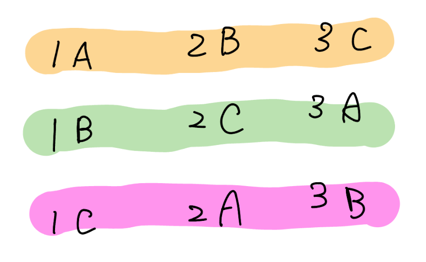
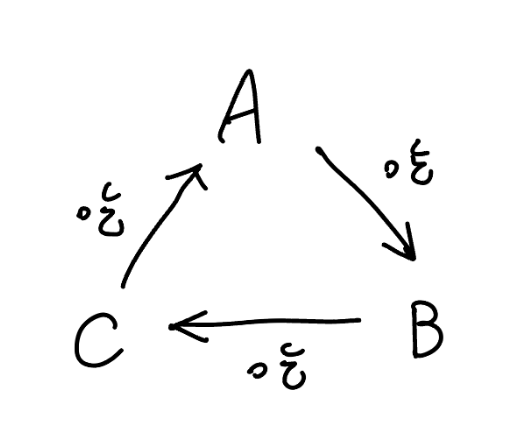

## 介紹

- 持久化並查集
- 帶權並查集 (CF imposter)
- 可撤銷並查集 (2023 成大賽 p4)
- 加點技巧 (海牛 class 11 hm)

## 連結

- 二分圖
- 啟發式合併
	- 海牛 class 11
	- DSU 啟發式合併複雜度證明 (知乎)
	- 啟發式合併複雜度 (oi wiki)
- 持久化線段樹

## 一般的並查集

???+note "模板 [CF EDU A. Disjoint Sets Union](https://codeforces.com/edu/course/2/lesson/7/1/practice/contest/289390/problem/A)"
	維護一個 DSU，支持： 
	
	- $\text{union}(u,v):$ 合併 $u$ 和 $v$ 所在的集合
	
	- $\text{get}(u,v):$ 查詢 $u$ 和 $v$ 是否在同一個集合
	
	$n,m\le 10^5$

### 模板

??? note "只做啟發式合併"
	```cpp linenums="1"
	struct DSU {
        vector<int> par, sz;

        DSU (int n = 0) : par(n), sz(n, 1) {
            for (int i = 0; i < n; i++) {
                par[i] = i;
            }
        }
        int find (int x) {
            if (par[x] == x) return x;
            return find(par[x]);
        }
        bool merge (int u, int v) {
            u = find(u), v = find(v);
            if (u == v) return false;
            if (sz[u] < sz[v]) swap(u, v);
            par[v] = u;
            sz[u] += sz[v];
            return true;
        }
    };
    ```

??? note "路徑壓縮 + 啟發式合併"
	```cpp linenums="1"
	struct DSU {
        vector<int> par, sz;

        DSU (int n = 0) : par(n), sz(n, 1) {
            for (int i = 0; i < n; i++) {
                par[i] = i;
            }
        }
        int find (int x) {
            if (par[x] == x) return x;
            return par[x] = find(par[x]);
        }
        bool merge (int u, int v) {
            u = find(u), v = find(v);
            if (u == v) return false;
            if (sz[u] < sz[v]) swap(u, v);
            par[v] = u;
            sz[u] += sz[v];
            return true;
        }
    };
    ```

### 複雜度

#### 啟發式合併

??? info "並查集中節點數為 $n$ 的樹，高度至多為 $\lfloor \log n \rfloor$"
	
	> 說明
	
	因為合併的時候是啟發式合併，子樹大小比較小的放在比較大的下面。這樣合併出來的樹，每次往上走一層，子樹大小都會變至少兩倍，所以高度最多 $O(\log n)$
	
	如果上面看不懂的話，假設目前的子樹的根為 $u$，要合併進來的子樹的根為 $v$。我們分兩種 case 討論。假設 $u,v$ 的子樹都符合 「高度至多為 $\log n$」這個條件
	
	1. $size_u\ge size_v$
	
	2. $size_u< size_v$
	
	對於第一種 case，因為 $size_u\ge size_v$，所以 $v$ 會接在 $u$ 上。顯然 $v$ 的高度一定 $\le u$ 的高度，所以 $v$ 接在 $u$ 上並不會增加 $u$ 的子樹的高度
	
	對於第二種 case，因為 $size_u< size_v$，所以 $u$ 會接在 $v$ 上。顯然 $v$ 的高度一定 $\ge u$ 的高度，所以 $u$ 接在 $v$ 上對於原本 $u$ 的子樹來說 $size$ 變成了兩倍之多，而 $u$ 上面多了一層
	
	所以每次往上走一層，$size$ 都至少變兩倍，因為點數只有 $n$ 個，所以最多只會有 $\log n$ 層，也就是高度至多為 $\log n$
	
	---
	
	> 嚴謹一點的證明
	
	【引理】：在並查集中高度為 $k$ 的樹，節點數至少為 $2^k$。
	
	使用歸納法證明這個引理
	
	basecase :  $k = 0$ 時，成立
	
	假設 $k \le L - 1$ 時成立。當 $k = L$ 時，存在一次使得樹從高度 $L - 1$ 變成高度 $L$ 的操作。在這次操作前，兩棵樹的高度必然為 $L - 1$，因此它們的節點數總數至少為 $2\times 2^{L-1}=2^L$。
	
	設一個並查集內的樹的節點有 $n$ 個，高度是 $h$。根據引理，$n \ge 2^h$，則 $\log  n \ge h$。故並查集中節點數為 $n$ 的樹，高度至多為 $\lfloor \log n \rfloor$

依照上面的性質，`find(x)` 的複雜度是 $O(\log n)$。`merge(u, v)` 的複雜度是兩個 `find` 也是 $O(\log n)$，所以整體的複雜度是 $O(\log n)$

#### 路徑壓縮 

若將「路徑壓縮」和「啟發式合併」都用上的話複雜度是 $\Theta(\alpha (n))$[^1]

若不使用「啟發式合併」，平均複雜度依然是 $O(\alpha (n))$，但 worst case $O(\log n)$
	
## rollback DSU

### 模板

???+note "模板 [CF EDU DSU A. DSU with rollback](https://codeforces.com/edu/course/2/lesson/7/3/practice/contest/289392/problem/A)"
	
	有 $n$ 個點與 $m$ 個以下操作 : 
	
	- $\text{union}(u,v):$ 將 $u,v$ 所在的連通塊合併成同一個連通塊
	
	- $\text{persist}:$ 新增一個 checkpoint
	
	- $\text{rollback:}$ 回到上一個還沒被 rollback 的 checkpoint
	
	$n,m\le 2\times 10^5$

??? note "模板"
	```cpp linenums="1"
	struct Graph {
        Graph (int n) : n(n) {
            sz = vector<int>(n, 1);
            par = vector<int>(n);
            cnt = n;
            for (int i = 0; i < n; i++) {
                par[i] = i;
            }
        }
        void add_edge (int u, int v) {
            int x = find (u), y = find (v);
            if (x == y) {
                stk.push ({x, x});
                return;
            }

            if (sz[x] < sz[y]) swap (x, y);
            sz[x] += sz[y]; par[y] = x;
            cnt--;
            stk.push ({x, y});
        }
        void undo () {
            auto [x, y] = stk.top ();
            stk.pop ();
            if (x == y) return;
            sz[x] -= sz[y]; par[y] = y;
            cnt++;
        }
        int size () {
            return cnt;
        }
    
        private :
            int n, cnt;
            vector<int> sz;
            vector<int> par;
            stack<pii> stk;
    
            int find (int x) {
                if (par[x] == x) return x;
                else return find (par[x]);
            }
    };
    ```

### 複雜度

不能使用路徑壓縮（但還是可以啟發式合併），故複雜度 $O(\log n)$

## 帶權並查集

???+note "[CF 1594 D. The Number of Imposters](https://codeforces.com/problemset/problem/1594/D)"
	給定 $n$ 個點，每個點有一個未知的 $w_i\in \{0,1\}$，再給 $m$ 個關係
	
	- $(x,y,0):$ $w_x = w_y$
	- $(x,y,1):$ $w_x \neq w_y$
	
	判斷最多有多少個點的 $w_i=1$


	??? note "思路 1"
		考慮二分圖染色法判斷，兩個點之間有邊代表兩點的顏色不同
		
		- $(x,y,0):$ 在 $x,y$ 之間建一條邊
		- $(x,y,1):$ 建立一個 $z$ 點分別連接 $x,y$
		
		這樣下去跑二分圖染色法即可，每個連通塊答案取兩種顏色的 $\max$，再加起來
		注意在跑二分圖染色法時不能將多餘的 $z$ 點算進去
	
		??? note "code(from [acwing](https://www.acwing.com/file_system/file/content/whole/index/content/3069744/))"
	        ```cpp linenums="1"
	        #include <bits/stdc++.h>
	        using namespace std;
	        typedef long long ll;
	        typedef pair<ll, ll> pii;
	        const int N = 7e5 + 10;
	        const int M = 2e6 + 8e5 + 10;
	        int c[2];
	        int n, z;
	        int e[M], ne[M], h[N], idx;
	        int st[N];
	
	        void add(int a, int b) {
	            e[idx] = b, ne[idx] = h[a], h[a] = idx++;
	        }
	
	        void init() {
	            idx = 0;
	            for (int i = 1; i <= z; i++)
	            {
	                h[i] = -1;
	                st[i] = 0;
	            }
	        }
	        bool dfs(int u, int color) {
	            st[u] = color;
	            if (u <= n) // 不算入 z 點
	                c[2 - color]++;
	
	            for (int i = h[u]; i != -1; i = ne[i]) {
	                int j = e[i];
	                if (!st[j]) {
	                    if (!dfs(j, 3 - color))
	                        return false;
	                }
	                else if (st[j] == color)
	                    return false;
	            }
	            return true;
	        }
	
	        void slove() {
	            int m;
	            cin >> n >> m;
	
	            z = n + 1;
	            for (int i = 1; i <= m; i++) {
	                int a, b;
	                char c[10];
	                scanf("%d %d %s", &a, &b, c);
	
	                if (c[0] == 'c') {
	                    add(a, z);
	                    add(z, a);
	                    add(b, z);
	                    add(z, b);
	                    z++;
	                }
	                else {
	                    add(a, b);
	                    add(b, a);
	                }
	            }
	            int ans = 0;
	            int ok = true;
	            for (int i = 1; i <= n; i++) {
	                if (!st[i]) {
	                    c[0] = 0;
	                    c[1] = 0;
	                    bool flag = dfs(i, 1);
	
	                    if (!flag) {
	                        ok = false;
	                        break;
	                    }
	
	                    ans += max(c[0], c[1]);
	                }
	            }
	            if (!ok)
	                ans = -1;
	
	            cout << ans << endl;
	            init ();
	        }
	
	        int main() {
	            int Q;
	            cin >> Q;
	            memset(h, -1, sizeof h);
	            while (Q--) {
	                slove();
	            }
	            return 0;
	        }
	        ```
	        
	??? note "思路 2"
		考慮帶權並查集
		
		對於每個並查集維護並查集內每個點與 root 的距離是 $0$ 或是 $1$
		
		最後每個並查集 $\max($與 root 的距離是 $0$ 的數量 $,$ 與 root 的距離是 $1$ 的數量$)$ 
		
		??? note "code"
	        ```cpp linenums="1"
	        #include <bits/stdc++.h>
	        #define int long long
	        #define pb push_back
	        #define mk make_pair
	        #define F first
	        #define S second
	        #define pii pair<int, int>
	        using namespace std;
	
	        const int INF = 9e18;
	        const int maxn = 2e5 + 5;
	        int n, m;
	        int dis[maxn], par[maxn], cnt[maxn][2];
	
	        int find (int x) {
	            if (par[x] == x) return x;
	            else {
	                int root = find (par[x]);
	                dis[x] ^= dis[par[x]];
	                par[x] = root;
	                return root;
	            }
	        }
	
	        void solve () {
	            cin >> n >> m;
	            for (int i = 1; i <= n; i++) dis[i] = 0, par[i] = i, cnt[i][0] = 1, cnt[i][1] = 0;
	
	            string s;
	            int fg = 0;
	
	            for (int i = 1, u, v; i <= m; i++) {
	                cin >> u >> v >> s;
	
	                int dif;
	                if (s[0] == 'i') dif = 1; 
	                else dif = 0; // same
	
	                int x = find (u), y = find (v);
	                if (x == y) {
	                    if ((dis[u] ^ dis[v]) != dif) fg = 1;
	                }
	                else {
	                    dis[y] = dis[u] ^ dis[v] ^ dif;
	                    par[y] = x;
	                    cnt[x][0] += cnt[y][dis[y]];
	                    cnt[x][1] += cnt[y][dis[y] ^ 1];
	                }
	            }
	
	            if (fg == 1) {
	                cout << -1 << "\n";
	                return;
	            }
	
	            int res = 0;
	            for (int i = 1; i <= n; i++) {
	                if (find(i) == i) {
	                    res += max (cnt[i][0], cnt[i][1]);
	                }
	            }
	            cout << res << "\n";
	        }
	
	        signed main () {
	            int t;
	            cin >> t;
	            while (t--) {
	                solve ();
	            }
	        }
	        ```

## 持久化並查集

先備知識 : <a href="/wiki/ds/persistent/" target="_blank">持久化資料結構</a>

???+note "[洛谷 P3402 可持久化并查集](https://www.luogu.com.cn/problem/P3402)"
	給定 $n$ 個集合，第 $i$ 個集合內初始狀態下只有一個數，為 $i$。

    有 $m$ 次操作。操作分為 $3$ 種：
    
    - $1\space a\space b:$ 合併 $a,b$ 所在集合
    
    - $2\space k:$ 回到第 $k$ 次操作之後的狀態
    
    - $3 \space a\space b:$ 詢問 $a,b$ 是否屬於同一集合
    
    註 : 執行三種操作中的任意一種都記為一次操作
    
    $n\le 10^5,m\le 2\times 10^5$
    
    ??? note "實作細節"
    	size 要維護好，不然可能會吃 TLE（啟發式合併壞掉）
    	
    	記得每次操作後要記得 clone，不然會吃 RE（戳到 roots[] 陣列外面）
    
    	不能在 Node 裡面存 l, r，避免 MLE :thinking:
    	
    ??? note "code"
    	```cpp linenums="1"
    	#include <bits/stdc++.h>
        #define pii pair<int, int>
        #define pb push_back
        #define mk make_pair
        #define F first
        #define S second
        #define ALL(x) x.begin(), x.end()
    
        using namespace std;
    
        struct Node {
            Node* lc = nullptr;
            Node* rc = nullptr;
            int val, sz;
    
            Node() {}
        };
    
        struct DSU {
            int n;
    
            DSU (int n) : n(n) {
                roots[0] = build(0, n - 1);
            }
    
            int check(int x, int y) {
                int ver = roots.size() - 1;
                int Fx = find(ver, x);
                int Fy = find(ver, y);
                roots.pb(new Node(*roots[ver]));
                if (Fx == Fy) {
                    return 1;
                } else {
                    return 0;
                }
            }
    
            void merge(int x, int y) {
                int ver = roots.size() - 1;
                int Fx = find(ver, x);
                int Fy = find(ver, y);
                int Sx = query_sz(roots[ver], 0, n - 1, Fx), Sy = query_sz(roots[ver], 0, n - 1, Fy);
                if (Fx == Fy) {
                    roots.pb(new Node(*roots[ver]));
                    return;
                }
                if (Sx < Sy) swap(x, y), swap(Sx, Sy), swap(Fx, Fy);
                // fx->sz > fy->sz
    
                // sz[Fx] += sz[Fy]
                Node* tmp = update_sz(roots[ver], 0, n - 1, Fx, Sy);
                // par[Fy] = Fx
                roots.pb(update_val(tmp, 0, n - 1, Fy, Fx));
            }
    
            void rollback(int ver) {
                //assert(ver < roots.size());
                roots.pb(new Node(*roots[ver]));
            }
    
            private:
            // 單點改值, 單點加值, 單點查詢
            vector<Node*> roots = {nullptr};
    
            int find(int ver, int x) {
                int Fx = query_val(roots[ver], 0, n - 1, x);
                if (Fx == x) return Fx;
                else return find(ver, Fx);
            }
    
            Node* build(int l, int r) {
                Node* root = new Node();
                if (l == r) {
                    root->val = l;
                    root->sz = 1;
                    return root;
                }
    
                int mid = (l + r) / 2;
                root->lc = build(l, mid);
                root->rc = build(mid + 1, r);
                return root;
            }
    
            Node* update_val(const Node* root, int l, int r, int pos, int val) {
                Node* now = new Node(*root);
                if (l == r) {
                    now->val = val;
                    return now;
                }
    
                int mid = (l + r) / 2;
                if (pos <= mid) {
                    now->lc = update_val(now->lc, l, mid, pos, val);
                } else {
                    now->rc = update_val(now->rc, mid + 1, r, pos, val);
                }
    
                return now;
            }
    
            Node* update_sz(const Node* root, int l, int r, int pos, int val) {
                Node* now = new Node(*root);
                if (l == r) {
                    now->sz += val;
                    return now;
                }
    
                int mid = (l + r) / 2;
                if (pos <= mid) {
                    now->lc = update_sz(now->lc, l, mid, pos, val);
                } else {
                    now->rc = update_sz(now->rc, mid + 1, r, pos, val);
                }
    
                return now;
            }
    
            int query_val(Node* root, int l, int r, int pos) {
                if (l == r) {
                    return root->val;
                } 
                int mid = (l + r) / 2;
                if (pos <= mid) {
                    return query_val(root->lc, l, mid, pos);
                } else {
                    return query_val(root->rc, mid + 1, r, pos);
                }
            }
    
            int query_sz(Node* root, int l, int r, int pos) {
                if (l == r) {
                    return root->sz;
                } 
                int mid = (l + r) / 2;
                if (pos <= mid) {
                    return query_sz(root->lc, l, mid, pos);
                } else {
                    return query_sz(root->rc, mid + 1, r, pos);
                }
            }
        };
    
        signed main() {
            ios::sync_with_stdio(0);
            cin.tie(0);
            int n, q;
            cin >> n >> q;
    
            DSU dsu(n);
    
            int op, a, b, k;
            while(q--) {
                cin >> op;
    
                if (op == 1) {
                    cin >> a >> b;
                    a--, b--;
                    dsu.merge(a, b);
                } else if (op == 2) {
                    cin >> k;
                    dsu.rollback(k);
                } else if (op == 3) {
                    cin >> a >> b;
                    a--, b--;
                    cout << dsu.check(a, b) << '\n';
                }
            }
        } 
        ```

想法上是利用 DSU 的 par, size 其實是陣列，將這兩個陣列都套上持久化線段樹的模板後，即可使用，功能是單點查詢（par, size），單點加值（size），單點改值（par）

??? note "模板"
	```cpp linenums="1"
	struct Node {
        Node* lc = nullptr;
        Node* rc = nullptr;
        int val, sz;

        Node() {}
    };
    
    struct DSU {
        int n;
    
        DSU (int n) : n(n) {
            roots[0] = build(0, n - 1);
        }
    
        int check(int x, int y) {
            int ver = roots.size() - 1;
            int Fx = find(ver, x);
            int Fy = find(ver, y);
            roots.pb(new Node(*roots[ver]));
            if (Fx == Fy) {
                return 1;
            } else {
                return 0;
            }
        }
    
        void merge(int x, int y) {
            int ver = roots.size() - 1;
            int Fx = find(ver, x);
            int Fy = find(ver, y);
            int Sx = query_sz(roots[ver], 0, n - 1, Fx), Sy = query_sz(roots[ver], 0, n - 1, Fy);
            if (Fx == Fy) {
                roots.pb(new Node(*roots[ver]));
                return;
            }
            if (Sx < Sy) swap(x, y), swap(Sx, Sy), swap(Fx, Fy);
            // fx->sz > fy->sz
    
            // sz[Fx] += sz[Fy]
            Node* tmp = update_sz(roots[ver], 0, n - 1, Fx, Sy);
            // par[Fy] = Fx
            roots.pb(update_val(tmp, 0, n - 1, Fy, Fx));
        }
    
        void rollback(int ver) {
            //assert(ver < roots.size());
            roots.pb(new Node(*roots[ver]));
        }
    
        private:
        // 單點改值, 單點加值, 單點查詢
        vector<Node*> roots = {nullptr};
    
        int find(int ver, int x) {
            int Fx = query_val(roots[ver], 0, n - 1, x);
            if (Fx == x) return Fx;
            else return find(ver, Fx);
        }
    
        Node* build(int l, int r) {
            Node* root = new Node();
            if (l == r) {
                root->val = l;
                root->sz = 1;
                return root;
            }
    
            int mid = (l + r) / 2;
            root->lc = build(l, mid);
            root->rc = build(mid + 1, r);
            return root;
        }
    
        Node* update_val(const Node* root, int l, int r, int pos, int val) {
            Node* now = new Node(*root);
            if (l == r) {
                now->val = val;
                return now;
            }
    
            int mid = (l + r) / 2;
            if (pos <= mid) {
                now->lc = update_val(now->lc, l, mid, pos, val);
            } else {
                now->rc = update_val(now->rc, mid + 1, r, pos, val);
            }
    
            return now;
        }
    
        Node* update_sz(const Node* root, int l, int r, int pos, int val) {
            Node* now = new Node(*root);
            if (l == r) {
                now->sz += val;
                return now;
            }
    
            int mid = (l + r) / 2;
            if (pos <= mid) {
                now->lc = update_sz(now->lc, l, mid, pos, val);
            } else {
                now->rc = update_sz(now->rc, mid + 1, r, pos, val);
            }
    
            return now;
        }
    
        int query_val(Node* root, int l, int r, int pos) {
            if (l == r) {
                return root->val;
            } 
            int mid = (l + r) / 2;
            if (pos <= mid) {
                return query_val(root->lc, l, mid, pos);
            } else {
                return query_val(root->rc, mid + 1, r, pos);
            }
        }
    
        int query_sz(Node* root, int l, int r, int pos) {
            if (l == r) {
                return root->sz;
            } 
            int mid = (l + r) / 2;
            if (pos <= mid) {
                return query_sz(root->lc, l, mid, pos);
            } else {
                return query_sz(root->rc, mid + 1, r, pos);
            }
        }
    };
    ```

### 複雜度

跟 rollback DSU 一樣，不做路徑壓縮，做啟發式合併

因為 `find(x)` 的時候至多需要做 $\log n$ 次單點查詢，故 `find(x)` 複雜度 $O(\log^2 n)$

## 用途

???+note "並查集做二分圖"
	有 $n$ 個點，給 $m$ 個 $(u,v)$ 代表 $u,v$ 不同組，問有沒有辦法將這些點成兩組 
	
	$n,m\le 10^5$
	
	??? note "code"
		```cpp linenums="1"
		#include <bits/stdc++.h>
	    #define int long long
	    #define pb push_back
	    #define pii pair<int, int>
	    using namespace std;
	
	    const int maxn = 3e5 + 5;
	    const int INF = 0x3f3f3f3f;
	    int M=1e9+7;
	    int n,m;
	    bool ans=false;
	    vector<pii> Edge;
	    int dsu[maxn];
	
	    void dsu_init () {
	        for (int i = 1; i <= 2 * n; i++) {
	            dsu[i] = i;
	        }
	    }
	
	    int find (int x) {
	        if (dsu[x] == x) return x;
	        else return dsu[x] = find(dsu[x]);
	    }
	
	    void merge (int a, int b) {
	        int x = find(a);
	        int y = find(b);
	        if (x == y) return;
	        dsu[x] = y;
	    }
	
	    signed main() {
	        ios::sync_with_stdio(0);
	        cin.tie(0);
	        cin>>n>>m;
	        dsu_init(); // important
	        for(int i=0,u,v;i<m;i++){
	            cin>>u>>v;
	            Edge.pb({u, v});
	        }
	        for (auto [u, v] : Edge) {
	            merge(u, v + n);
	            merge(v, u + n);
	            if (find(u) == find(u + n) || find(v) == find(v + n)) {
	                cout << "No";
	                exit(0);
	            }
	        }
	        cout<<"Yes";
	    }
	    ```

???+note "並查集判環"
	給一張圖，問是否存在環
	
	??? note "思路"
		若出現一條邊的鄰接點在同一個集合裡，則可證明有環存在
	
???+note "[洛谷 P2024 [NOI2001] 食物链](https://www.luogu.com.cn/problem/P2024)"
	有三類動物 $A,B,C$，這三類動物的⾷物鏈構成如下：$A$ 吃 $B$，
	$B$ 吃 $C$，$C$ 吃 $A$。
	
	現有 $N$ 個動物，編號 $1,2,...,N$。每個動物都是 $A,B,C$ 中的⼀種，但並不知道是哪⼀種。依序給 $K$ 條屬
	於以下兩種的敘述：
	
	- $1\space X\space Y$，表⽰ $X$ 和 $Y$ 是同類
	
	- $2\space X\space Y$，表⽰ $X$ 吃 $Y$
	
	然⽽，並不是每條描述都是正確的，有些是真話，有些是假話。
	如果當前的話與前⾯的某些真話衝突，就是假話請判斷哪些話是真話，哪些話是假話。
	
	??? note "思路"
		- 我們可以⽤並查集維護資訊間的因果關係
	
	    - ⼀個集合裡⾯的資訊代表「這些資訊必須同時發⽣」
	
	    - ⽐如說，假設 $(x,y)$ 符合第⼀種資訊
	
	    - 那就代表：如果 $x$ 是 $A$ 類，那 $y$ 必須是 $A$ 類，反之亦然
	    （$B,C$ 類同樣可以套⽤）
	    
	    - 翻譯⼀下：如果 $x_A$ 發⽣的話，那 $y_A$ 也⼀定要發⽣（$B,C$
	    類同樣可以套⽤）
	    
	    - $\text{merge}(x_A, y_A),\text{merge}(x_B, y_B), \text{merge}(x_C,y_C)$
	
		---
		
		- ⽐如說，假設 $(x, y)$ 符合第⼆種資訊
	
	    - 那就代表：
	    	- 如果 $x$ 是 $A$ 類，那 $y$ 必須是 $B$ 類，反之亦然
	    	- 如果 $x$ 是 $B$ 類，那 $y$ 必須是 $C$ 類，反之亦然
	    - 如果 $x$ 是 $C$ 類，那 $y$ 必須是 $A$ 類，反之亦然
	
	    - $\text{merge}(x_A, y_B),\text{merge}(x_B, y_C), \text{merge}(x_C,y_A)$ 
		
		---
		
		- 矛盾的情況呢 ?
		- 假如 $(x, y)$ 符合第⼆種資訊
		- 如果 $\text{find}(x_A)=\text{find}(y_C)$ 或 $\text{find}(x_A)=\text{find}(y_A)$ 則矛盾
		
		---
		
		他們每個 col 將會以 $A \rightarrow B \rightarrow C$ 的順序旋轉
		所以當你知道其中一個關係的時候其實就能推得其餘的關係
	
		例如今天 $1$ 吃 $2$，$2$ 吃 $3$ 關西如下圖
		
		<figure markdown>
	      { width="300" }
	      <figcaption>同一 row 屬於同一連通塊，必同時發生</figcaption>
	    </figure>
	    
	    <figure markdown>
	      { width="200" }
	      <figcaption>圖(一)</figcaption>
	    </figure>
		
		因為 $1$ 吃 $2$，那麼以圖(一)來看就是 $1$ 是 $A$ 時，$2$ 就是 $B$
		
		可以看做 $1,2$ 分別以 $A,B$ 為起點，繞著關係圖轉一圈
		
		- 當 $1$ 在 $A$ 時，$2$ 在 $B$
		
		- 當 $1$ 在 $B$ 時，$2$ 在 $C$
	
		- 當 $1$ 在 $C$ 時，$2$ 在 $A$
	
		可以看到 $2$ 也是繞著關係圖走一圈的，所以當你確定他其中一步時，就能確定其他步
	
		---
		
		```cpp linenums="1"
		if (flag == 1) {
			if (check (a, b + n) || check (a, b + 2*n)) {
				ans++;
			}
			else {
				merge (a, b), merge (a + n, b + n), merge (a + 2*n, b + 2*n);
			}
		}
		else {
			if (check (a, b) || check (a, b + 2*n)) {
				ans++;
			}
			else {
				merge (a, b + n), merge (a + n, b + 2*n), merge (a + 2*n, b);
			}
		}
		```

???+note "[zerojudge f292. 11987 - Almost Union-Find](https://zerojudge.tw/ShowProblem?problemid=f292)"
	有個 $n$ 物品，每個物品一開始都是自己一組
	
	有 $q$ 次操作，每次會是其中一種
	
	- $\text{Merge}(x,y):$ 將 $x,y$ 所在的兩個群體合併為同一個
	
	- $\text{MoveGroup}(x,y):$ 將 $x$ 從他所在的群體當中移除並且加入 $y$ 所在的群體
	
	- $\text{Sum}(x):$ 印出 $x$ 所在的群體包含的成員個數和成員編號總合
	
	??? note "思路"
		我們先來思考「將 $x$ 從他所在的群體當中移除」
		
		我們直接將 $x$ 的貢獻給扣掉，也不必真正在 DSU 裡將其刪除
		
		接下來思考 「並且加入 $y$ 所在的群體」
		
		我們可以對於 $i=1\sim n$ 維護 $t_i$ 代表目前 $i$ 真正的編號
		
		加入新的 group 的時候只需將 $t_i$ 變成當前沒用過的編號即可，並且可以當成是一個新的點，去執行 merge
		
		詳見代碼
		
		??? note "code"
			```cpp linenums="1"
	        void init () {
	            for (int i = 1; i <= n; i++) {
	                f[i] = i;
	                t[i] = i;
	                sum[i] = i;
	                num[i] = 1;
	            }
	            cnt = n;
	        }
	
	        void delete (int x) {
	            sum[find (t[x])] -= x;
	            num[find (t[x])] -= 1;
	
	            t[x] = ++cnt;
	            sum[t[x]] = x;
	            num[t[x]] = 1;
	            f[t[x]] = t[x];
	        }
	
	        void merge (int x, int y) {
	            int tx = find (t[x]);
	            int ty = find (t[y]);
	            if (tx != ty) f[ty] = tx;
	            num[tx] += num[ty];
	            sum[tx] += sum[ty];
	        }
	
	        void solve (int x, int y) {
	            delete (x);
	            merge (x, y);
	        }
	        ```
			> 參考自 : [CSDN](https://blog.csdn.net/weixin_52914088/article/details/120379127?ops_request_misc=&request_id=&biz_id=102&spm=1018.2226.3001.4187)

???+note "海牛 class11 P9"
	有個 $n$ 物品編號依序是 $1,2,3,...,n$，每個物品一開始都是自己一組
	
	有 $q$ 次操作，每次會是其中一種
	
	- $\text{Merge}(x,y):$ 將 $x,y$ 所在的兩個群體合併為同一個
	
	- $\text{MoveGroup}(x,y):$ 把包含物品 $x$ 與物品 $y$ 的兩個組別合併成一個
	
	- $\text{GroupMax}(x):$ 求跟物品 $x$ 同一組的物品中，編號最大的物品編號
	
	$n,q\le 2\times 10^5$
	
	??? note "思路"
		維護很多個 priority_queue
		
	    每個 pq 裡面存很多 $\texttt{pair}(x, t)$，$x$ 就是有的元素，$t$ 是時間戳記
	
	    每次 Move 不要真的把東西搬到別的 Group, 而是直接新增一個時間戳記比較大的 $(x, t')$
	
	    找最大值的時候，一直看這個 pq 的 $\max$
	    
	    如果時間戳記已經過期了就丟掉元素，一直到找到一個不是過期的元素


- DSU 判環
- <https://www.luogu.com.cn/problem/P3430>
- [TIOJ 只走一次](https://tioj.ck.tp.edu.tw/problems/2161)
	- [submission](https://tioj.ck.tp.edu.tw/submissions/311160)

---

## 參考資料

- <https://zhuanlan.zhihu.com/p/553192435>
- [Codeforces Edu DSU (需加入 group)](https://codeforces.com/edu/course/2/lesson/7)
- https://blog.csdn.net/boliu147258/article/details/92778897

[^1]: 詳見 [oiwiki](https://oi-wiki.org/ds/dsu-complexity/)