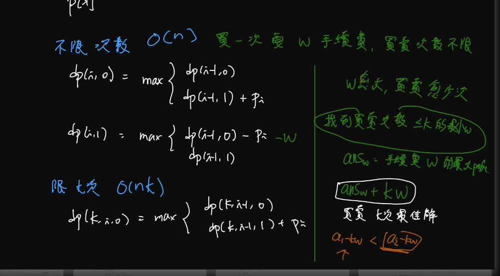
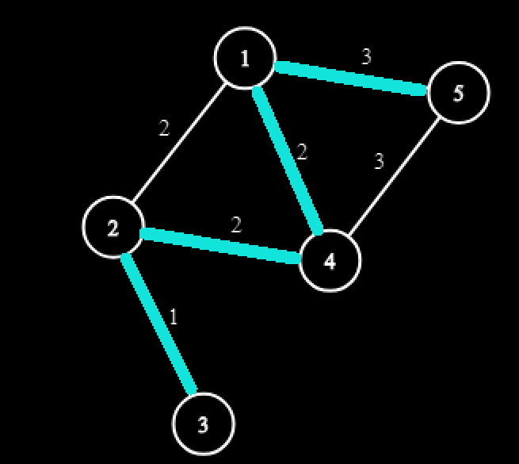

- <https://drive.google.com/file/d/1a1mgK8KFJWNoXATHwi3E6ceStn22QmZl/view>

## 算法概要

- 對於每個 node 周圍最小 edge 一定會再 MST 內
- Kruskal
	- 每次選 **整張圖** 最小權的邊
- Prim
	- 去選從**起點**擴張出來的集合**周圍的**最小邊
- Boruvka
	- 對於**目前選到**的每個集合，選他**周圍的**最小邊
	- 對於這種邊數很多，但是很多邊用不到的東西 
	- Boruvka 比較容易快速省略掉不需要的邊（只找需要的出來）

### 習題

| 題目                                                         | 備註                                                         |
| ------------------------------------------------------------ | ------------------------------------------------------------ |
| [TIOJ 1795](https://tioj.ck.tp.edu.tw/problems/1795)         | <li>kruskal<br><li>最大 MST & 最小 MST 應用                  |
| [CF 1468J](https://codeforces.com/problemset/problem/1468/J) | <li>kruskal<br><li>[題解](https://blog.csdn.net/weixin_51797626/article/details/124066368?spm=1001.2101.3001.6650.1&utm_medium=distribute.pc_relevant.none-task-blog-2%7Edefault%7ECTRLIST%7ERate-1-124066368-blog-113801758.topnsimilarv1&depth_1-utm_source=distribute.pc_relevant.none-task-blog-2%7Edefault%7ECTRLIST%7ERate-1-124066368-blog-113801758.topnsimilarv1&utm_relevant_index=2) |
| [CF 1095F](https://codeforces.com/problemset/problem/1095/F) | <li>kruskal<br><li>貪心<br><li>$\text{edge}_w=a_x+a_y \text{ or } w$ |
| [0x01 2020 花中一模 pE](https://codeforces.com/group/GG44hyrVLY/contest/297533/problem/E) | <li>Boruvka<br><li>$\text{edge}_w=a_x+a_y \text{ or } w$     |
| [CF 1513D](https://codeforces.com/contest/1513/problem/D)    | <li>kruskal 過程想法<br><li>[code](http://codepad.org/UTaMikoD) |
| [abc282 E](https://atcoder.jp/contests/abc282/tasks/abc282_e) | <li>kruskal<br><li>將題目轉換成 MST 問題                     |
| [TIOJ 2164](https://tioj.ck.tp.edu.tw/problems/2164)         | <li>prim<br><li>曼哈頓路徑                                   |

## 超級原點
- [CF 1245D](https://codeforces.com/problemset/problem/1245/D)

## K 度限制生成树
- [CF 125E](https://codeforces.com/problemset/problem/125/E)
- $\texttt{Aliens}$ 優化

<figure markdown>
  { width="600" }
</figure>


## 補圖技巧
- 一般題目都會上限 $m=\text{min}(2\times 10^5, \frac{n\times (n-1)}{2})$, 其中 $m$ 代表 $(u,v)$ 沒有邊的數量
- 維護一個還沒分到組的 `set` ,分到組時把他從 `set` 刪掉


```cpp linenums="1"
void dfs(int u){
    vis[u] = 1;
    st.erase(u);
    vector<int> ret;
    // v 還沒加進集合的
    for(int v : st) { // 沒出現 -> 有邊
        if(!G[u].count(v)) ret.vush_back(v);
    }
    for(int ele : ret){
        st.erase(ele);
    }
    for(int ele : ret){
        vis[ele]=1;
        dfs(ele);
    }
}
```

- [CF 920E](https://codeforces.com/problemset/problem/920/E)
- [CF 1242B](https://codeforces.com/problemset/problem/1242/B)


## 衝突邊技巧
- 判斷 MST 是否唯一
- 如果並非唯一, 代表它可以被相同權重的邊給替換
- $\Rightarrow$ 對於相同的邊一起去跑

<figure markdown>
  { width="300" }
  <figcaption>範例圖</figcaption>
</figure>


```cpp linenums="1"
void solve () {
    for (int i = 1; i <= n; i++) par[i] = i;
    sort(E.begin(), E.end(), [](Edge a, Edge b) { return a.w < b.w; });
    int cnt = 0;
    for (int i = 0; i < m;) {
        int r = i;
        while (E[i].w == E[r + 1].w) r++; //[i, r]
        // 判斷有多少合法邊
        for (int j = i; j <= r; j++) {
            int x = find(E[j].u), y = find(E[j].v);
            if (x == y) continue;
            // 是 MST 有可能選到的
            cnt++; 
        }
        // 判斷真正的唯一方案數有幾個
        for (int j = i; j <= r; j++) {
            int x = find(E[j].u), y = find(E[j].v);
            if (x == y) continue; // 已經被併過了, 屬於同一方案
            // 再不同的集合, 唯一的方案
            merge(x, y), cnt--;
        }
        // ans = (合法邊) - (唯一方案數) = 其實加了是重複的方案的邊 
        i = r + 1;
    }
    cout << cnt << "\n";
}
```

- [CF 1108F](https://codeforces.com/contest/1108/problem/F)
- [CF 160D](https://codeforces.com/contest/160/problem/D)
    - 因為對於每條邊都需要看他是哪種性質
    - 所以要判斷特定的邊是否是唯一的就不能只算唯一方案數了
    - 必須用 BCC 去看如下


- [網址](https://blog.csdn.net/m0_56280274/article/details/123765300?spm=1001.2101.3001.6650.1&utm_medium=distribute.pc_relevant.none-task-blog-2%7Edefault%7EOPENSEARCH%7ERate-1-123765300-blog-101834844.topnsimilarv1&depth_1-utm_source=distribute.pc_relevant.none-task-blog-2%7Edefault%7EOPENSEARCH%7ERate-1-123765300-blog-101834844.topnsimilarv1&utm_relevant_index=2)
  - 他只是想看他是不是"對於跟他邊權一樣"的這些 edge ，唯一的 edge 而已
  - 所以並不需考慮之前邊權比較小的時候留下來的邊，等同於新建一張圖

## 維護環技巧
- [CF 609E](https://codeforces.com/contest/609/problem/E)
- [TIOJ 1445](https://tioj.ck.tp.edu.tw/problems/1445)
- 維護環技巧, 加入沒辦選到的, 刪掉環上除了他以外最大
- 實作, LCA, kruskal, dp 配合倍增法建表
- 次小生成樹

## 最小化最大最小差
- 找一顆生成樹滿足 有選到的 (權重最大Edge) 減掉 (權重最小Edge) 要**最小**
  - $\texttt{min(maxW - minW)}$
- 有兩層最大或最小可以去枚舉內層
- 以這題來說去枚舉 $\texttt{minW}$ 對於每個 $\texttt{minW}$ 找最小的 $\texttt{maxW}$ 讓他剛好可以形成生成樹

### 範圍 1
$N = 10^3, M = 10^4, C = -10^9\sim10^9$

```cpp linenums="1"
sort (Edges)
    
for (int i = 1; i <= m; i++) {
    // mn 為 E[i].w, mx 用 Kruskal 找
    Dsu_init(); // O(n)
    for (int j = i; j <= m; j++) {
        // Kruskal O(m)
    }
    ans = min (ans, mx - mn);
}
// tot: O(nlgn + m^2)
```

### 範圍 2
$N = 2\times 10^5, M = 2\times 10^5, C = 100$

```cpp linenums="1"
sort (Edges) // {w, u, v}
    
for (int i = 1; i <= C; i++) {
    int idx = Edges.lower_bound({i, 0, 0}) - Edges.begin();
    Dsu_init(); // O(n)
    for (int j = idx; j <= m; j++) {
        // Kruskal O(m)
    }
    ans = min (ans, mx - mn);
}
// tot: O(nlgn + C(n + m))
```

### 結論
- 利用範圍來控制 Kruskal

### 例題

- [宜中校內賽 2022 pE](https://sorahisa-rank.github.io/sh-ylsh/2022/problems.pdf#page=12)
- DSU EDU 某題 (範圍1)

## 最大化最小邊
- [TIOJ 1340](https://tioj.ck.tp.edu.tw/problems/1340)
- [ZJ j125. 4. 蓋步道](https://zerojudge.tw/ShowProblem?problemid=j125)

### 法1
- 從小到大枚舉($\texttt{Greedy}$)
- $\texttt{Kruskal}$ 最大生成樹
- $O(m\log m)$

### 法2
- 二分搜
- $\texttt{DFS/BFS check}$ 只選邊權 $\le x$ 的是否能連通
- $O(m\log m)$

### 法 3

每次取 $x=$ 剩餘的 $\text{edge}$ 的中位數，檢查圖有沒有連通

- 如果連通 :  $>x$ 的 $\text{edge}$ 都用不到 (刪掉) $\rightarrow \begin{cases} \text{edge} \space少一半 \\ \text{vertex} \space不變 \end{cases}$
- 如果連通 :   $\le x$ 的連通塊縮點 $\rightarrow \begin{cases} \text{edge} \space少一半 \\ \text{vertex} \space變少 \end{cases}$

那麼時間複雜度 ?

$$
T(n,m)=T(n,\frac{m}{2})+O(n+m)
$$

若 $m < n$ 的話那一定是 $\texttt{IMPOSIIBLE}$

所以時間複雜度只需考慮 $m$ 

$$
\begin{align} T (m) &= T(\frac{m}{2}) + O(m) \\ &= O(m) \end{align}
$$


!!! question "為何是 $O(m)$"
	無窮等比級數 $\displaystyle a + ar + ar^2 + \dots = a\frac{1}{1-r}$ 

	$\displaystyle a=n,r=\frac{1}{2}$ 我們得到 $\displaystyle n + \frac{n}{2} + \frac{n}{4} + \dots = n\frac{1}{1-\frac{1}{2}} = 2n.$

## 乘積生成樹

???+note "[全國賽 2016 第二可靠路網](https://sorahisa-rank.github.io/nhspc-fin/2016/problems.pdf#page=9)"
	給一張 $n$ 點 $m$ 邊圖，每個邊上有邊權 $\displaystyle w=\frac{p}{q}$，有重邊
	

	$$cost=\prod w_i$$
	
	求嚴格次小生成樹的 $cost$，以最簡分數 $\displaystyle \frac{p}{q}$ 的形式輸出
	
	$n\le 3000,m\le 5\times 10^5$
	
	??? note "思路"
		將原本的 Kruskal 用加的改成用乘的
		
		因為我們考慮取 log，假如 log a, log b, log c 是最小的，那 a, b, c 也會是最小的，只不過是用乘的
		
		分數乘法可見此處<a href="/wiki/other/fraction/" target="_blank">此處</a>
		
		然後就套用次小生乘樹模板即可

## 額外練習

| 題目                                                         | 備註 |
| ------------------------------------------------------------ | ---- |
| [abc210E](https://atcoder.jp/contests/abc210/tasks/abc210_e) |      |
| [arc076B](https://atcoder.jp/contests/arc076/tasks/arc076_b) |      |
| [abc270F](https://atcoder.jp/contests/abc270/tasks/abc270_f) |      |
| [CF 1245D](https://codeforces.com/problemset/problem/1245/D) |      |
| [USACO Open 2021 Gold P2.Portals](http://www.usaco.org/index.php?page=viewproblem2&cpid=1138) |      |
| [IOIC day2 NewWorld Online](https://judge.ioicamp.org/contests/2/problems/207) |      |