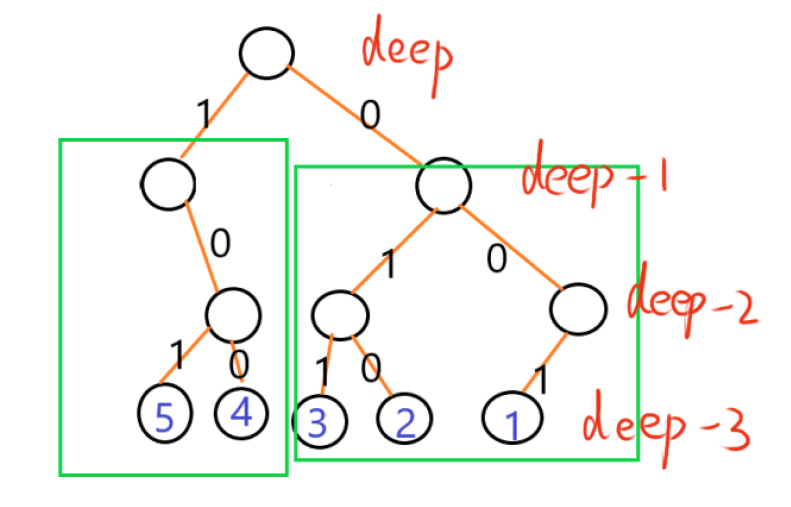
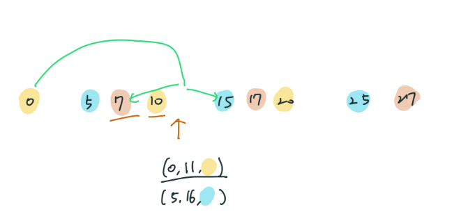
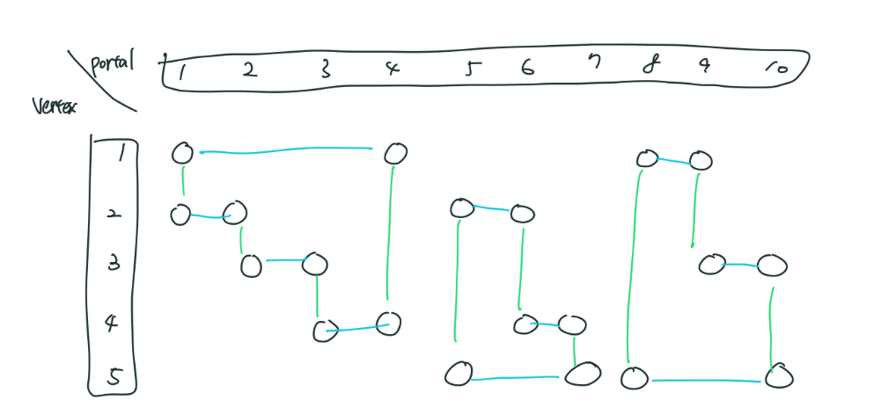
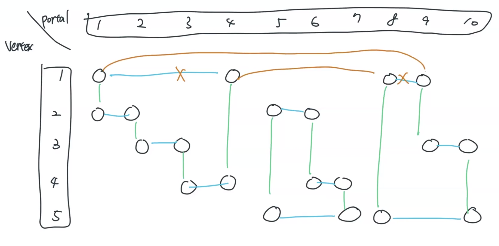
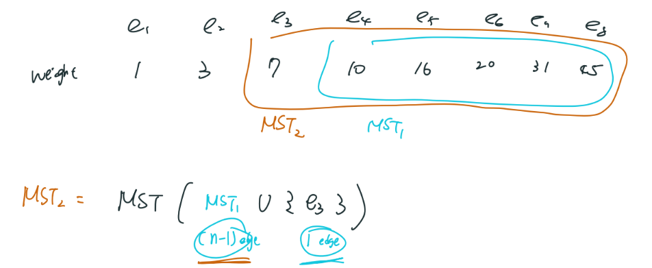
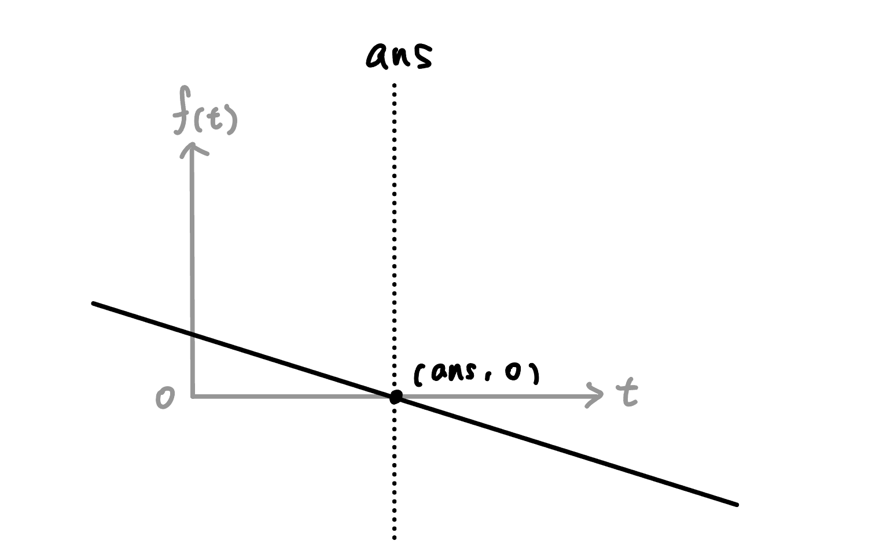
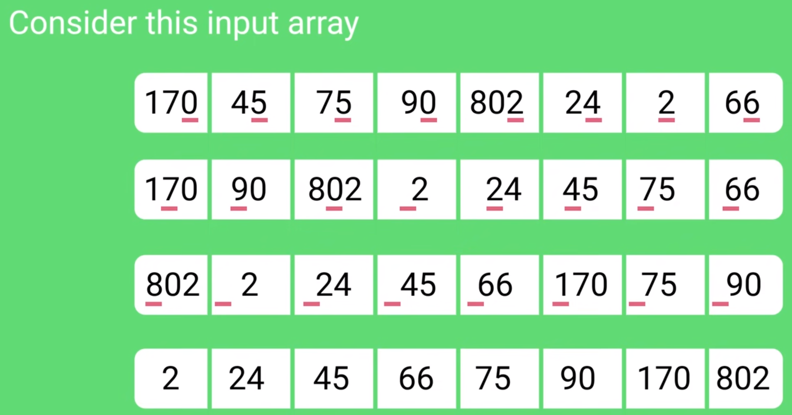
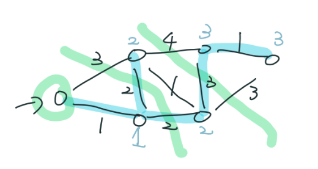

## 算法概要

???+note "模板 [LOJ #123. 最小生成树](https://loj.ac/p/123)"
	給 $n$ 點 $m$ 邊帶權無向連通圖，求最小生成樹的邊權和
	
	$n\le 2\times 10^5,m\le 5\times 10^5$

??? info "對於每個 node 周圍最小 edge 一定會再 MST 內"
	如果這個點旁邊最小邊 $e_{\text{min}}$ 沒選，把最小邊加到 MST 上面，會產生一個環
    
    把這個環上面最大的邊 $e_{\text{max}}$ 移除，可以得到一個新的生成樹，新的生成樹的權重比剛剛的 MST 小，這樣產生矛盾，故對於每個 node 周圍最小 edge 一定會再 MST 內

### Kruskal

每次選 **整張圖** 最小權的邊

??? note "code"
	```cpp linenums="1"
	bool cmp(Edge a, Edge b) {
        return a.w < b.w;
    }
    
    long long Kruskal() {
        sort(edges.begin(), edges.end(), cmp);
        long long ans = 0;
    
        for (int i = 0; i < m; i++) {
            Edge e = edges[i];
    
            if (find(e.u) != find(e.v)) {
                merge(e.u, e.v);
                ans += e.w;
            }
        }
    
        return ans;
    }
    ```

### Prim

去選從**起點**擴張出來的集合**周圍的**最小邊

??? note "code"
	```cpp linenums="1"
	void Prim (int start) {
        vector<int> dis(n, INF);
        priority_queue<pii, vector<pii>, greater<pii>> pq;
        pq.push({0, start});
        
        while (pq.size()) {
            auto [d, u] = pq.top();
            pq.pop();
            
            if (dis[u] != INF) continue;
            dis[u] = d;
            
            for (auto [v, w] : G[u]) {
                pq.push({w, v}); // 這行跟 dijkstra 不同
            }
        }
    }
    ```

### Boruvka

對於**目前選到**的每個集合，選他**周圍的**最小邊

對於這種邊數很多，但是很多邊用不到的東西，Boruvka 比較容易快速省略掉不需要的邊（只找需要的出來）

每次對於每個連通塊選延伸出去最小的邊，然後縮點

這樣每次點的數量都至少會少一半，所以只需要 $\log n$ 輪，每次 $O(m)$，複雜度 $O(m\log n)$

??? note "pseudocode"
	```linenums="1"
	while 連通塊個數>1
        for 每個連通塊 i
            mn[i] = 連接 i 與其他連通塊的最小邊
        for 每個連通塊 i
            if mn[i] 連接兩個不同的連通塊
                ans += mn[i]
                Merge( mn[i] 連接的連通塊 )
                連通塊個數 --
	```
	
??? note "code"
	```cpp linenums="1"
	#include<bits/stdc++.h>
    #define int long long

    using namespace std;
    
    using Graph = vector<vector<int>>;
    
    struct DSU {
        int cc;
        vector<int> par, sz;
        vector<set<int>> S;
    
        DSU (int n = 0) : cc(n), par(n), sz(n, 1), S(n) {
            for (int i = 0; i < n; i++) {
                par[i] = i;
            }
        }
        int find (int x) {
            if (par[x] == x) return x;
            return par[x] = find(par[x]);
        }
        bool merge (int u, int v) {
            u = find(u), v = find(v);
            if (u == v) return false;
            if (sz[u] < sz[v]) swap(u, v);
            par[v] = u;
            sz[u] += sz[v];
            for (int x : S[v]) {
                S[u].insert(x);
            }
            S[v].clear();
            cc--;
            return true;
        }
    };
    
    struct Edge {
        int u, v;
        int cost;
    };
    
    bool operator<(const Edge &a, const Edge &b) {
        return a.cost < b.cost;
    }
    
    const int INF = 2e18;
    
    int MST(int n, vector<Edge> edges) {
        int m = edges.size();
    
        DSU dsu(n);
        vector<Edge> nei(n);
    
        int mst_ans = 0;
    
        int conti = true;
        while (conti) {
            conti = false;
            fill(nei.begin(), nei.end(), Edge{-1, -1, INF});
    
            for (auto [u, v, cost] : edges) {
                int fu = dsu.find(u), fv = dsu.find(v);
                if (fu == fv) continue;
    			
                nei[fu] = min(nei[fu], {u, v, cost});
                nei[fv] = min(nei[fv], {v, u, cost});
            }
    
            for (int i = 0; i < n; i++) {
                auto e = nei[i];
                if (e.u == -1) continue;
                if (dsu.find(e.u) != dsu.find(e.v)) {
                    dsu.merge (e.u, e.v);
                    mst_ans += e.cost;
                    conti = true;
                }
            }
        }
    
        return mst_ans;
    }
    
    signed main() {
        int n, m;
        cin >> n >> m;
        vector<Edge> edges;
    
        int u, v, w;
        for (int i = 0; i < m; i++) {
            cin >> u >> v >> w;
            u--, v--;
            edges.push_back ({u, v, w});
        }
    
        cout << MST(n, edges) << "\n";
    }
    ```

???+note "[2020 花中一模 E. 道路建設 (Road)](https://codeforces.com/group/GG44hyrVLY/contest/297533/problem/E)"
	給 $n$ 個點，點有權值 $a_i$，$i,j$ 加邊的花費為 $a_i+a_j$
	
	另外給 $m$ 條特殊邊 : 表示對 $u,v$ 加邊，花費**只能**為 $w$，而非 $a_u+a_v$
	
	要求將這些點連起來形成樹的最小花費代價
	
	$n,m\le 10^5,a_i,w\le 10^{7}$
	
	??? note "思路"
		我們利用 borovka 的想法，每次對連通塊選「非特殊邊」之中的最小邊，放進去一個 `vector`，直到整張圖做完，或做不下去
		
		至於怎麼用 borovka 選邊，我們先看當前連通塊 $a_i$ 最小的點是否可以連項不同連通塊的 $a_j$，$a_j$ 滿足 $(i,j)$ 非特殊邊的 $j$ 之中最小的。若都沒辦法的話，那就要從小到大枚舉連通塊內的 $a_i$，和不在連通塊的 $a_j$，滿足 $(i,j)$ 非特殊邊的 $j$ 之中最小的，無法連接的情況最多只會有 $m$ 次（$m$ 條特殊邊），所以複雜度是合理的
		
		最後用 Kruskal 在特殊邊和剛剛用 borovka 選的邊上選 MST
		
		Borovka 每次執行會有二分搜 $O(n\log n)$，共有 $O(\log n)$ 輪，複雜度  $O(n\log^2 n)$，Kruskal 因為 Borovka 只會挑出 $n - 1$ 條邊，所以，複雜度還是 $O(n\log n)$，所以共 $O(n\log^2 n)$
		
		實作上詳見代碼
	    
	??? note "code"
		```cpp linenums="1"
		#include <algorithm>
	    #include <array>
	    #include <iostream>
	    #include <set>
	    #include <utility>
	    #include <vector>
	
	    using namespace std;
	
	    using Edge = array<int, 3>;
	    const int INF = 1e9 + 7;
	
	    struct DSU {
	        int cc;
	        vector<int> par, sz;
	        vector<set<int>> S;
	
	        DSU(int n = 0) : cc(n), par(n), sz(n, 1), S(n) {
	            for (int i = 0; i < n; i++) {
	                par[i] = i;
	            }
	        }
	        int find(int x) {
	            if (par[x] == x) return x;
	            return par[x] = find(par[x]);
	        }
	        bool join(int u, int v) {
	            u = find(u), v = find(v);
	            if (u == v) return false;
	            if (sz[u] < sz[v]) swap(u, v);
	            par[v] = u;
	            sz[u] += sz[v];
	            for (int x : S[v]) {
	                S[u].insert(x);
	            }
	            S[v].clear();
	            cc--;
	            return true;
	        }
	    };
	
	    int n, m;
	    vector<int> a, rk;
	    vector<vector<int>> G;
	    vector<Edge> edges;
	    DSU dsu;
	
	    void init() {
	        cin >> n >> m;
	        a = rk = vector<int>(n);
	        vector<pair<int, int>> tmp(n);
	        G = vector<vector<int>>(n);
	        dsu = DSU(n);
	        for (int i = 0; i < n; i++) dsu.S[i] = {i};
	        for (int i = 0; i < n; i++) {
	            cin >> a[i];
	            tmp[i] = {a[i], i};
	        }
	        sort(tmp.begin(), tmp.end());
	        for (int i = 0; i < n; i++) {
	            rk[tmp[i].second] = i;
	        }
	        sort(a.begin(), a.end());
	
	        for (int i = 0; i < m; i++) {
	            int u, v, w;
	            cin >> u >> v >> w;
	            u = rk[u - 1], v = rk[v - 1];
	            edges.push_back({w, u, v});
	            G[u].push_back(v);
	            G[v].push_back(u);
	        }
	        for (int i = 0; i < n; i++) {
	            sort(G[i].begin(), G[i].end());
	        }
	    }
	
	    inline bool contain(const vector<int> &vec, int x) {
	        return binary_search(vec.begin(), vec.end(), x);
	    }
	
	    void collect_edges() {
	        bool conti = true;
	        while (conti) {
	            conti = false;
	
	            for (int root = 0; root < n; root++) {
	                if (dsu.find(root) != root) continue;
	
	                const set<int> &S = dsu.S[root];
	
	                vector<int> C;  // 一些不在 S 東西
	                Edge best_edge = {INF, -1, -1};
	
	                int x = *S.begin();
	                for (int i = 0; i < n; i++) {
	                    if (dsu.find(i) == dsu.find(x)) continue;
	
	                    if (contain(G[x], i) == false) {
	                        best_edge = {a[x] + a[i], x, i};
	                        break;
	                    } else {
	                        C.push_back(i);
	                    }
	                }
	                for (int u : S) {
	                    for (int v : C) {
	                        if (contain(G[u], v) == false) {
	                            best_edge = min(best_edge, Edge{a[u] + a[v], u, v});
	                            break;
	                        }
	                    }
	                }
	                if (best_edge[0] != INF) {
	                    conti = true;
	                    int u = best_edge[1];
	                    int v = best_edge[2];
	                    dsu.join(u, v);
	                    edges.push_back(best_edge);
	                }
	            }
	        }
	    }
	
	    void mst() {
	        sort(edges.begin(), edges.end());
	        dsu = DSU(n);
	        long long ans = 0;
	        for (auto e : edges) {
	            int w = e[0];
	            int u = e[1];
	            int v = e[2];
	            if (dsu.find(u) != dsu.find(v)) {
	                dsu.join(u, v);
	                ans += w;
	            }
	        }
	        cout << ans << '\n';
	    }
	
	    int main() {
	        cin.tie(0);
	        cin.sync_with_stdio(0);
	
	        init();
	        collect_edges();
	        mst();
	
	        return 0;
	    }
	    ```

???+note "[CF 888 G. Xor-MST](https://codeforces.com/problemset/problem/888/G)"
	給 $n$ 點無向完全圖，每個點有權值 $a_i$，$(i,j)$ 連邊花費 $a_i\oplus a_j$ ，問最小生成樹邊權總和
	
	$n\le 2\times 10^5,a_i< 2^{30}$
	
	??? note "思路"
		考慮 borovka，要怎麼快速找到 $a_i \oplus a_j$ 呢 ? 0-1 字典樹
		
		<figure markdown>
	      { width="300" }
	    </figure>
	    
	    我們將 0-1 字典樹畫出來，會觀察到我們要對於每層的每個節點分治算答案
	    
	    如圖，也就是說要去兩個連通塊分別找最小的 $a_i,a_j$ 
	    
	    > 參考 : [CSDN](https://frozenguardian.blog.csdn.net/article/details/107603404?ydreferer=aHR0cHM6Ly9ibG9nLmNzZG4ubmV0Lw%3D%3D)

???+note "[CF 1550 F. Jumping Around](https://codeforces.com/problemset/problem/1550/f)"
	給數線上 $n$ 個點 $a_1,\ldots, a_n$，和 $d$，起點為 $a_s$，$q$ 筆詢問 ：

	- 給 $x, k$ ，每步可以從當前的位置跳到值域在 $[d-k, d+k]$ 內的 $a_i$，問能否從 $a_s$ 抵達 $a_x$
	
	$n,q \le 2\times 10^5,k,a_i \le 10^6$
	
	??? note "思路"
		問題可以轉換成 : 建立完全圖，每邊的邊權定為 $|w-d|$，對每個 query 回答 $s\to x$ 的邊上的最大值是否 $\le k$ 
		
		> 以下提到的「距離」為兩點之間的邊權
	
		> 「距離」越小代表在原圖上兩點之間的邊權越接近 $d$
		
		對於每個點要去找當前不同連通塊且距離最小的點，我們可以把這個看作是一個詢問，存成 tuple($a_i, a_i + d,$ 所屬的連通塊)
		
		我們現在來一起處理每個點丟出來的 tuple。我們可以從左到右掃過去，維護當前最後兩個不同連通塊的點（必免到時候找到在相同連通塊的點）。當我們碰到一個 tuple 的 $a_i+d$ 時，我們就可以從這兩個 tuple 挑一個出來，將答案 $\min$ 進去所屬的連通塊
		 
		<figure markdown>
	      { width="500" }
	      <figcaption>$d=11,$已經做好第一輪 Borovka</figcaption>
	    </figure>

### 習題

???+note "[CF 1468 J. Road Reform](https://codeforces.com/problemset/problem/1468/J)"
	給 $n$ 點 $m$ 邊無向圖，選出一棵生成樹，可以對樹上的邊權值 $+1$ 或 $-1$
	
	使樹上邊權最大值恰為 $k$，求最小操作次數
	
	$n,m\le 2\times 10^5,k\le 10^9$
	
	??? note "思路"
	    分情況討論： 
	    
	    (一) 只用小於 $k$ 的邊即可連通所有點
	    
	    - 額外選一條邊，替換樹中的邊，$\text{cost}=|k-w|$
	
	    - 選樹中的邊，將他的權重加到 $k$，$\text{cost}=|k-w|$
	
	    (二) 只用小於 $k$ 的邊不可連通所有點
	    
	    - 額外再選一些邊，$\text{cost}=\sum (w-k)$
	
		> 參考 : [CSDN](https://blog.csdn.net/weixin_51797626/article/details/124066368?spm=1001.2101.3001.6650.1&utm_medium=distribute.pc_relevant.none-task-blog-2%7Edefault%7ECTRLIST%7ERate-1-124066368-blog-113801758.topnsimilarv1&depth_1-utm_source=distribute.pc_relevant.none-task-blog-2%7Edefault%7ECTRLIST%7ERate-1-124066368-blog-113801758.topnsimilarv1&utm_relevant_index=2)

???+note "[CF 1095 F. Make It Connected](https://codeforces.com/problemset/problem/1095/F)"
	給定 $n$ 個點，點有權值 $a_i$，$i,j$ 加邊的花費為 $a_i+a_j$
	
	另外給 $m$ 條特殊邊 : 表示對 $u,v$ 加邊，花費也可以為 $w$
	
	要求將這些點連起來形成樹的最小花費代價
	
	$n,m\le 2\times 10^5,a_i,w\le 10^{12}$
	
	??? note "思路"
	
	    我們真的需要 $n^2$ 枚舉 $a_i+a_j$ 嗎 ?
	    
	    先將 $a_i$ 小到大 sort，依據 Prim 的想法，假設我們一開始在 $a_1$，我們會去找 $a_i$ 不在連通塊裡最小的那個，用連通塊裡 $a_i$ 最小的跟他連邊，也就是 $a_1\leftrightarrow a_2$，接下來會找到 $a_3$，$a_1\leftrightarrow a_3$，接著 $a_1\leftrightarrow a_4\ldots$
	    
	    也就是我們只需考慮 $a_1$，連接到所有點即可，然後在跟特殊邊一起丟進 Kruskal 跑 MST
	    
	??? note "code"
		```cpp linenums="1"
		#include <bits/stdc++.h>
	    #define int long long
	    using namespace std;
	    int n,m,arr[1000000],pal[1000000];
	    struct edge{
	        int u,v,w;
	    };
	    int find(int u){
	        if(pal[u]==u) return u;
	        pal[u]=find(pal[u]);
	        return pal[u];
	    }
	    int cmp(edge a,edge b){
	        return a.w<b.w;
	    }
	    signed main(){
	        ios::sync_with_stdio(0);
	        cin.tie(0);
	        cin>>n>>m;
	        int mi=1e13,idx;
	        for(int i=1;i<=n;i++){
	            cin>>arr[i];
	            if(arr[i]<mi){
	                mi=arr[i],idx=i;
	            } 
	        }
	        vector<edge> G;
	        for(int i=1,u,v,w;i<=m;i++){
	            cin>>u>>v>>w;
	            G.push_back({u,v,w});
	        }
	        for(int i=1;i<=n;i++){
	            G.push_back({idx,i,arr[idx]+arr[i]});
	        }
	        for(int i=1;i<=n;i++) pal[i]=i;
	        sort(G.begin(),G.end(),cmp);
	        int ans=0;
	        for(auto [u,v,w]:G){
	            int x=find(u);
	            int y=find(v);
	            if(x==y) continue;
	            else{
	                pal[x]=y;
	                ans+=w;
	            }
	        }
	        cout<<ans<<"\n";
	    }
	    ```

???+note "[Atcode abc282 E. Choose Two and Eat One](https://atcoder.jp/contests/abc282/tasks/abc282_e) "
	一個盒子中有 $N$ 個球，每個球上寫著一個介於 $1$ 和 $M-1$ 之間的數字。對於 $i=1,2,...,N$，第 $i$ 個球上寫著數字 $A_i$。

    當盒子中剩下兩個或更多球時，重複以下步驟：
    
    - 首先，任意選擇兩個球。
    
    - 然後，得分等於 $(x^y + y^x) \pmod{M}$，其中 $x$ 和 $y$ 是兩個球上的數字
    
    最後，任意選擇其中一個球吃掉，將另一個球放回盒子。
    
    輸出可能獲得的最大總得分。
    
    $N\le 500,M\le 10^9$
    
    ??? note "思路"
        題目轉換成 : 邊權為 $(x^y + y^x) \pmod{M}$，問 MST
        
        因為「選擇其中一個球吃掉」就有點像你確定了 MST 的 leaf，然後把這個 leaf 移除，然後把它移除，然後子問題
        
        使用 Prim 算法 n<sup>2</sup> 求解

???+note "歐幾里得最小生成樹 [TIOJ 2164. 運送蛋餅](https://tioj.ck.tp.edu.tw/problems/2164)"
	給 $n$ 個三維座標點，$i,j$ 連邊的花費為 $(x_i-x_j)^ 2 + (y_i-y_j)^ 2 + (z_i-z_j)^ 2$，求最小生成樹權值
	
	$n\le 5000,|x_i|, |y_i|, |z_i| \leq 10^ 5$
	
	??? note "思路"
		Prim n<sup>2</sup> 算法

???+note "[CF 1245 D. Shichikuji and Power Grid](https://codeforces.com/problemset/problem/1245/D)"
	
	在一個二維平面上面，有 $n$ 個城市，現在每個城市都沒有電
	
	有兩種方案 :
	
	- 建發電站，代價是 $c_i$
	
	- 拉電線，$(|x_i-x_j|+|y_i-y_j|)\times (k_i+k_j)$
	
	現在問你最少花費多少代價，能夠使得全部城市都有電，輸出方案
	
	$n\le 2000,x_i,y_i\le 10^6,c_i,k_i\le 10^9$
	
	??? note "思路"
	
		建立超級源點連接每個點，邊權為 $c_i$，共 $n+1$ 個點做 MST

???+note "[Atcoder abc270 F. Transportation](https://atcoder.jp/contests/abc270/tasks/abc270_f)"
	
	有 $n$ 個島嶼，序列 $X, Y$，和 $m$ 條建邊的方案 $(u, v, w)$，每次可以建立以下三種道路
	
	- 兩個島嶼直接連接一個橋，花費 $w$
	
	- 在某一個島上建立港口，花費 $X_i$，所有建立港口的島嶼之間可以互相抵達
	
	- 在某一個島上建立機場，花費 $Y_i$，所有建立機場的島嶼之間可以互相抵達
	
	求最小花費使得所有島嶼跟島嶼連通
	
	$n,m\le 2\times 10^5,X_i,Y_i,w_i\le 10^9$
	
	??? note "思路"
		建立兩個超級源點，連接每個點，代表蓋港口或機場
		
		只是我們不一定會蓋港口或機場，所以分 4 個 case
		
		- Kruskal(橋)
	
		- Kruskal(橋 + 港口)
	
		- Kruskal(橋 + 機場)
	
		- Kruskal(橋 + 港口 + 機場)
		
	??? note "code"
		```cpp linenums="1"
		??? note "code"
		```cpp linenums="1"
		#include<bits/stdc++.h>
	    #define int long long
	    #define x first
	    #define y second
	    #define PII pair <int, int>
	    #define endl '\n'
	    const int INF = 1e18;
	
	    using namespace std;
	    const int N = 200005;
	
	    struct Edge {
	        int u, v, w;
	    }e[N], g[N * 3];
	    int q[N], x[N], y[N];
	
	    bool cmp(Edge a, Edge b) {
	        return a.w < b.w;
	    }
	
	    int find(int x) {
	        if (x != q[x]) q[x] = find(q[x]);
	        return q[x];
	    }
	
	    int Kruskal(int n, int m) {
	        sort(g + 1, g + m + 1, cmp);
	        for (int i = 1; i <= n; i ++) q[i] = i;
	
	        int res = 0;
	        int cnt = 0;
	        for (int i = 1; i <= m; i ++) {
	            auto [u, v, w] = g[i];
	            int fu = find(u), fv = find(v);
	
	            if (fu != fv) {
	                q[fu] = fv;
	                res += w;
	                cnt ++;
	            }
	        }
	
	        if (cnt == n - 1) return res;
	        else return INF;
	    }


        void solve() {
            int n , m;
            cin >> n >> m;
    
            int res = 1e18;
    
            for (int i = 1; i <= n; i ++) {
                cin >> x[i];
            }
            for (int i = 1; i <= n; i ++) {
                cin >> y[i];
            }
    
            for (int i = 1; i <= m; i ++) {
                int u, v, w;
                cin >> u >> v >> w;
                e[i] = {u, v, w};
            }
    
            for (int i = 1; i <= m; i ++) {
                g[i] = e[i];
            }
            res = min(res, Kruskal(n, m));
    
            //飞机
            for (int i = 1; i <= m; i ++) {
                    g[i] = e[i];
            }
            for (int i = 1; i <= n; i ++) {
                g[i + m] = {i, n + 1, x[i]};
            }
            res = min(res, Kruskal(n + 1, m + n));
            //海
            for (int i = 1; i <= m; i ++) {
                g[i] = e[i];
            }
            for (int i = 1; i <= n; i ++) {
                g[i + m] = {i, n + 1, y[i]};
            }
            res = min(res, Kruskal(n + 1, m + n));
    
            //飞机和海
            for (int i = 1; i <= m; i ++) {
                g[i] = e[i];
            }
            for (int i = 1; i <= n; i ++) {
                g[i + m] = {i, n + 1, x[i]};
            }
            for (int i = 1; i <= n; i ++) {
                g[i + n + m] = {i, n + 2, y[i]};
            }
            res = min(res, Kruskal(n + 2, m + n + n));
    
            cout << res;
    
        }
        signed main(){
            ios::sync_with_stdio(false);
            cin.tie(nullptr);
    
            int t; t = 1;
            //cin >> t;
    
            while (t --) {
                solve();
            }
    
            return 0;
        }
        ```

???+note "K 度限制生成樹 [CF 125 E. MST Company](https://codeforces.com/problemset/problem/125/E)"
	給 $n$ 點 $m$ 邊連通圖，找最小生成樹滿足與點 $1$ 的度數要恰為 $k$，印出樹上的邊，或無解
	
	$n,k\le 5000,m\le 10^5,w_i\le 10^5$
	
	??? note "思路"
	    根據 Aliens 優化，我們將跟點 $1$ 連接的邊的邊權都加上一個權值 $t$，二分搜這個 $t$ 直到恰好選擇 $k$ 條度數，其中 $t$ 可以正或負且可為小數
	    
	??? note "code"
		```cpp linenums="1"
		#include <algorithm>
	    #include <cstdlib>
	    #include <iostream>
	    #include <vector>
	
	    #define int long long
	    #define double long double
	    #define pb push_back
	    #define mk make_pair
	    #define F first
	    #define S second
	    using namespace std;
	
	    struct Edge {
	        int u, v;
	        double w;
	        int id;
	    };
	
	    const int INF = 2e18;
	    const int maxn = 2e5 + 5;
	    int n, m, k, par[maxn];
	    double ans;
	    vector<int> ret;
	    vector<Edge> E;
	
	    int find(int x) {
	        if (par[x] == x)
	            return x;
	        else
	            return par[x] = find(par[x]);
	    }
	
	    void merge(int a, int b) {
	        int x = find(a), y = find(b);
	        par[x] = y;
	    }
	
	    void init() {
	        cin >> n >> m >> k;
	        int u, v, w;
	        for (int i = 0; i < m; i++) {
	            cin >> u >> v >> w;
	            E.pb({u, v, 1.0 * w, i + 1});
	        }
	    }
	
	    int check(double w, int isAns) {
	        for (int i = 1; i <= n; i++) par[i] = i;
	        vector<Edge> Eg;
	        for (int i = 0; i < m; i++) {
	            if (E[i].u == 1 || E[i].v == 1)
	                Eg.pb({E[i].u, E[i].v, E[i].w + w, E[i].id});
	            else
	                Eg.pb(E[i]);
	        }
	
	        sort(Eg.begin(), Eg.end(), [](Edge a, Edge b) { return a.w < b.w; });
	        double res = 0;
	        int cnt = 0;
	        for (int i = 0; i < m; i++) {
	            if (find(Eg[i].u) != find(Eg[i].v)) {
	                merge(Eg[i].u, Eg[i].v);
	                if (isAns) ret.pb(Eg[i].id);
	                if (Eg[i].u == 1 || Eg[i].v == 1) cnt++;
	                res += Eg[i].w;
	            }
	        }
	        ans = res - cnt * w;
	        if (isAns) return cnt == k;
	        return cnt >= k;
	    }
	
	    void solve() {
	        double l = -INF, r = INF;
	        for (int i = 0; i < 200; i++) {
	            double mid = (l + r) / 2;
	            if (check(mid, 0)) {  // 選太多邊 -> w 上升
	                l = mid;
	            } else {  // cnt < k
	                r = mid;
	            }
	        }
	        int tmp = check(l, 1);
	        if (!tmp) {
	            cout << -1 << '\n';
	            exit(0);
	        }
	        cout << ret.size() << "\n";
	        sort(ret.begin(), ret.end());
	        for (auto ele : ret) cout << ele << " ";
	    }
	
	    signed main() {
	        init();
	        solve();
	    }
	    ```

???+note "[LeetCode 1579. Remove Max Number of Edges to Keep Graph Fully Traversable](https://leetcode.com/problems/remove-max-number-of-edges-to-keep-graph-fully-traversable/)"
    給一張 $n$ 個點 $m$ 邊無向圖，邊有三種 type ：

    - Alice 的邊
    
    - Bob 的邊
    
    - Alice 跟 Bob 的邊
    
    最多可以移除多少條邊使得分別對於 Bob 跟 Alice 圖都還是連通的
    
    $n,m \le 10^5$
    
    ??? note "思路"
    	刪掉的邊其實就是 Kruskal 內發現兩邊已在同一個連通塊的情況
    	
    	因為沒有邊權，依 Kruskal 的正確性，邊的順序是不重要的。顯然我們共用邊要比只有一個人的邊還更不容易被刪掉，因為刪掉他的話會影響 Alice 跟 Bob 兩人的貢獻
    	
    	我們先跑 Kruskal(共用邊)，先把共用邊選起來這樣等等就不會被刪掉
    	
    	然後再接著跑 Alice，Bob，這時候若發現是在同一個連通塊時會刪掉的就是 only Alice 或 only Bob 的邊，不會是共用邊
        
    ??? note "code"
    	前往 [LeetCode solution](https://leetcode.com/problems/remove-max-number-of-edges-to-keep-graph-fully-traversable/solutions/3468042/clean-code-easy-to-understand-union-find/)

???+note "[USACO Open 2021 Gold P2.Portals](http://www.usaco.org/index.php?page=viewproblem2&cpid=1138)"
	有一個由 $N$ 個編號為 $1\dots N$ 的結點以及 $2N$ 個編號為 $1\cdots 2N$ 的結構。每個傳送門連接兩個不同的結點 $u$ 和 $v$（$u≠v$）。可能有多個傳送門連接同一對結點。

	每個點與四個不同的傳送門相連，與 $v$ 相連的傳送門是 $p_v=[p_{v,1},p_{v,2},p_{v,3},p_{v,4}]$ 
	
	當前的位置可用 pair$(v,p_{v,i})$ 表示，可用以下操作改變位置：
	
	1. 由穿過當前傳送門來改變當前結點
	2. $(v,p_{v,2})$ 跟 $(v,p_{v,1})$ 之間有雙向邊，$(v,p_{v,3})$ 跟 $(v,p_{v,4})$ 之間有雙向邊
	
	對於每個點，可以花費 $c_v$，重新排列 $v$ 的 $p_v=[p_{v,1},p_{v,2},p_{v,3},p_{v,4}]$，目標使這 $4N$ 個點連通，求最小花費
	
	$2\le N \le 10^5,\le c_v\le 10^3$
	
	??? note "思路"
		依照題目的二為座標點的意義，我們將圖畫出來
		
		<figure markdown>
	      { width="500" }
	    </figure>
	    
	    每個點的 degree 都只有 2，所以會形成很多 cycle
	    
	    再觀察花費 $c_v$ 重新排列的意義
	    
	    <figure markdown>
	      { width="500" }
	    </figure>
	
	    花費 $c_v$ 可以將兩個 cycle 接起來，而 $p_{v,1},p_{v,2}$ 再同一個 cycle， $p_{v,3},p_{v,4}$ 再同一個 cycle，所以我們可以建邊 $p_{v,1}\leftrightarrow p_{v,3}$ 權重為 $c_v$
	    
	    其他預設好的邊權重都為 $0$，下去跑 MST 即可
	    
	    每個點的 degree 只有 2，所以邊最多也就 $2n$ 個，複雜度 ok

???+note "[CF 196 E.Opening Portals](https://codeforces.com/contest/196/problem/E)"
	給一張 $n$ 點 $m$ 邊的連通圖，其中有 $k$ 個點是特殊點。一開始在編號 $1$ 的點，在一個特殊點上時，你可以傳送到任意一個走過的特殊點，問走過所有特殊點的最小的距離總和
	
	$n,m,k\le 10^5$
	
	??? note "思路"
		首先先利用多源點 dijkstra 跑出與每個點最近的特殊點 $p_i$，與跟這個特殊點的距離 $d_i$。再來枚舉重疊邊，代表特殊點兩兩之間的權重，最後跑 dijkstra，答案記得加起始點 $1$ 與最近的特殊點的距離	

???+note "[LOJ #3696. 「JOISC 2022 Day4」复兴计划](https://loj.ac/p/3696)"
	給一張 $n$ 點 $m$ 邊帶權無向圖，有 $q$ 個詢問 :
	
	- 給 $x$，此時圖上的邊權定為 $|x-w|$，求最小生成樹
	
	$n\le 500,m\le 10^5,q\le 10^6,x,w,\le 10^9$
	
	??? note "思路"
		
		引理 : $\texttt{MST}(\texttt{MST}(E_1) \cup \texttt{MST}(E_2))= \texttt{MST}(E_1 \cup E_2)$
		
		我們先將邊權 $w$ 從小到大排序
		
		將每個 prefix 跟 suffix 都建立 MST，建立的方法是
		
		pre[i - 1] 做完 MST 只有挑 n - 1 個邊，將 i 這條邊加進去重做一次 Kruskal，即得到 n - 1 條邊的 pre[i]，以此類推，suffix 也一樣
		
		<figure markdown>
	      { width="400" }
	    </figure>
	
		因為具有單調性，故 Kruskal 並不需要重新排序，是 $O(n\times \log^* n)$
		
		雖然 $q$ 到 $10^6$，但實際能差入的縫只有 $m$ 個，所以我們先將每個縫左邊的 prefix，右邊的 suffix 一起再 Kruskal 一次，兩邊都知道自己要出動哪一些邊，就可以 $O(1)$ 回答查詢
		
		複雜度為 $O(m\times n \log^* n)$，差不多 $10^5\times 500\times 4\times 2=4\times 10^8$

???+note "最優比率樹 [POJ 2728](https://vjudge.net/problem/POJ-2728)"
	給出一個 $n$ 個點 $m$ 條邊的無向圖，第 $i$ 條邊有兩個權值 $a_i$ 和 $b_i$ 。

    求該圖的一棵生成樹 $T$ ，使得以下的 $\text{cost}$ 最小
    
    $$\text{cost}=\cfrac{\sum \limits_{e\in T}a_e}{\sum \limits_{e\in T}b_e}$$
    
    $n\le 1000$
    
    ??? note "思路"
    	考慮 [0-1 分數規劃](https://oi-wiki.org/misc/frac-programming/)
    
    	令 $\cfrac{\sum a}{\sum b}=t$，那麼 $\sum a = t\times \sum b$，令 $f(t) = \sum(a - t\times b)$
    	
    	在最優解的時候 $f(t)$ 恰為 $0$
    	
    	<figure markdown>
          { width="300" }
        </figure>

???+note "[TIOJ 1795. 咕嚕咕嚕呱啦呱啦](https://tioj.ck.tp.edu.tw/problems/1795)"
	給一張 $n$ 點 $m$ 邊無向圖，邊權非 $0$ 即 $1$，問是否存在一個生成樹邊權總合為 $k$
	
	$n\le 10^5,m\le 3\times 10^5$
	
	??? note "思路"
	
		先算最大 MST 的花費，最小 MST 的花費，看 $k$ 是否介於兩者的花費之間

???+note "[洛谷 P3623 [APIO2008] 免费道路](https://www.luogu.com.cn/problem/P3623)"
	給一張 $n$ 點 $m$ 邊無向圖，邊權非 $0$ 即 $1$，問是否存在一個生成樹邊權總合為 $k$，輸出**任意組解**或是輸出無解

	$n\le 2\times 10^5,m\le 10^5$
	
	??? note "思路"
		跟上面 TIOJ 1795 一樣，我們要判斷有沒有解就看 $k$ 是否介於最小與最大 MST 之間，如果 MST 不連通也是無解
		
		最大 MST 的構造可以先加入所有最小 MST 有用到的邊權為 $1$ 的邊，然後再將剩下沒選到的邊權為 $1$ 的邊加入，這樣就不會發生有邊權為 $1$ 的邊最大 MST 沒選到但最小 MST 有選到的情況
		
		最後要構造權重和恰為 $k$ 的 MST，這時我們就將最小 MST 開始枚舉自己沒用到但最大 MST 有用到的權重為 $1$ 的邊加入，直到權重和為 $k$。這時，再將邊權為 $0$ 的邊加入直到形成 MST 為止，即完成構造
		
		正確性的話因為最小 MST 有用到權重為 $1$ 的邊，權重為 $k$ 的 MST 都有用到的，而最小 MST 在這之後加入了邊權為 $0$ 的邊可以形成 MST，權重為 $k$ 的 MST 可能還多一些權重為 $1$ 的邊，再加入 $0$ 的邊也一定會形成 MST

???+note "[Atcoder arc076 B.Built?](https://atcoder.jp/contests/arc076/tasks/arc076_b)"
	給 $n$ 個二維座標點 $(x_i, y_i)$，兩點要建邊的 $\text{cost} = \min(|x_i - x_j|, |y_i - y_j|)$，求最小生成樹權值

	$n\le 10^5, x_i, y_i \le 10^9$
	
	??? note "思路"
		每個點跟周圍（$x_i$ 排序後的左右兩個點，$_i$ 排序後的左右兩個點）連邊
		
		跑個 Kruskal

## 補圖技巧

給一張完全圖，給 $m$ 補邊，代表除了這 $m$ 條邊外，其他 $(u,v)$ 之間都有邊

實作上維護一個還沒分到組的 `set`，分到組時把他從 `set` 刪掉

??? note "code"
    ```cpp linenums="1"
    void dfs (int u) {
        vis[u] = 1;

        vector<int> ret;
        for (int v : all) { // 沒出現 -> 有邊
            if(!G[u].count(v) && !vis[v]) ret.push_back(v);
        }
        for (int ele : ret) { // 已分到組
            all.erase(ele);
        }
        for (int ele : ret) {
            dfs(ele);
        }
    }
    ```

???+note "[CF 920 E. Connected Components?](https://codeforces.com/problemset/problem/920/E)"
	給定 $n$ 個點的無向圖，$m$ 條補邊(除了這 $m$條邊，其餘都存在)，求每個連通塊的大小
	
	$n,m\le 2\times 10^5$
	
	??? note "思路"
		用一般的補圖 DFS 去看有幾個連通塊即可
	
	??? note "code"
		```cpp linenums="1"
		#include <bits/stdc++.h>
	    #define int long long
	    #define pb push_back
	    #define pii pair<int, int>
	    using namespace std;
	
	    const int maxn = 3e5 + 5;
	    const int INF = 0x3f3f3f3f;
	    const int M = 1e9 + 7;
	    set<int> G[maxn];
	    set<int> all;
	    int n, m, vis[maxn], cnt = 0;
	
	    int dfs (int u) {
	        vis[u] = 1;
	
	        vector<int> ret;
	        for (int v : all) { // 沒出現 -> 有邊
	            if(!G[u].count(v) && !vis[v]) ret.push_back(v);
	        }
	        for (int ele : ret) {
	            all.erase(ele);
	        }
	        int sum = 1;
	        for (int ele : ret) {
	            sum += dfs(ele);
	        }
	        return sum;
	    }
	
	    signed main() {
	        //ios::sync_with_stdio(0);
	        //cin.tie(0);
	        cin >> n >> m;
	
	        for (int i = 1; i <= n; i++)
	            all.insert(i);
	
	        for (int i = 0, u, v; i < m; i++) {
	            cin >> u >> v;
	            G[u].insert(v);
	            G[v].insert(u);
	        }
	
	        vector<int> sz;
	        for (int i = 1; i <= n; i++) {
	            if (vis[i] == 0) {
	                sz.pb (dfs(i));
	                cnt++;
	            }
	        }
	
	        sort (sz.begin(), sz.end());
	        cout << cnt << "\n";
	        for (auto ele : sz) cout << ele << " ";
	    }
	    ```
???+note "[CF 1242 B. 0-1 MST](https://codeforces.com/problemset/problem/1242/B)"
	給 $n$ 個點的完全圖，給 $m$ 條邊權為 $1$ 的邊，其餘邊權為 $0$，問最小生成樹權值
	
	$n,m\le 10^5$
	
	??? note "思路"
		將邊權是 $0$ 一定要先選，所以我們可以將 $0$ 的邊選起來，會構成一些連通塊，這個可以用上一題的方法做到
		
		然後再看還缺幾條邊
		
	??? note "code"
		```cpp linenums="1"
		#include <bits/stdc++.h>
	    #define int long long
	    #define pb push_back
	    #define pii pair<int, int>
	    using namespace std;
	
	    const int maxn = 3e5 + 5;
	    const int INF = 0x3f3f3f3f;
	    const int M = 1e9 + 7;
	    set<int> G[maxn];
	    set<int> all;
	    int n, m, vis[maxn], cnt = 0;
	
	    void dfs (int u) {
	        vis[u] = 1;
	
	        vector<int> ret;
	        for (int v : all) { // 沒出現 -> 有邊
	            if(!G[u].count(v) && !vis[v]) ret.push_back(v);
	        }
	        for (int ele : ret) {
	            all.erase(ele);
	        }
	        for (int ele : ret) {
	            dfs(ele);
	        }
	    }
	
	    signed main() {
	        //ios::sync_with_stdio(0);
	        //cin.tie(0);
	        cin >> n >> m;
	
	        for (int i = 1; i <= n; i++)
	            all.insert(i);
	
	        for (int i = 0, u, v; i < m; i++) {
	            cin >> u >> v;
	            G[u].insert(v);
	            G[v].insert(u);
	        }
	
	        for (int i = 1; i <= n; i++) {
	            if (vis[i] == 0) {
	                dfs(i);
	                cnt++;
	            }
	        }
	
	        cout << cnt - 1;
	    }
	    ```

## MST 的唯一性

判斷 MST 是否唯一，如果並非唯一，代表它可以被相同權重的邊給替換，$\Rightarrow$ 對於相同的邊一起去跑

在 $w$ 以下的邊都做好 Kruskal 後，會形成若干連通塊，而且這些來通塊各個都是樹，我們稱整張圖為最小生成森林

??? info "將 $w$ 以下的邊以哪種順序做好 Kruskal 後會形成的最小生成森林都是一樣的"
	不管同一個權重 w 的邊用甚麼順序去 merge，每個點最後會被分到的連通塊都是相同的，只有每個連通塊內「用甚麼邊去將這些點接起來」有差別而已，這些邊能接起來的點集都是相同的。整體來說，不管什麼順序，將每個連通塊縮點後圖都是一模一樣的

??? note "code"
    ```cpp linenums="1"
    void solve () {
        for (int i = 1; i <= n; i++) par[i] = i;
        sort(E.begin(), E.end(), [](Edge a, Edge b) { return a.w < b.w; });
        for (int i = 0; i < m;) {
            int r = i;
            while (E[i].w == E[r + 1].w) r++; //[i, r]
            
            // 這邊一般會寫題目要做的事情
            
            for (int j = i; j <= r; j++) {
                int x = find(E[j].u), y = find(E[j].v);
                if (x == y) continue; 
                merge(x, y);
            }
            i = r + 1;
        }
    }
    ```

???+note "[CF 1108 F. MST Unification](https://codeforces.com/contest/1108/problem/F)"
	給 $n$ 點 $m$ 邊無向連通圖，你可以做以下操作 :
    
    - 選一條邊，對其邊權 $+1$，使得圖的最小生成樹唯一
     
    求最小操作次數
    
    $n,m\le 2\times 10^5$
    
    ??? note "思路"
    	邊會衝突若且唯若環上至少有一個邊跟我相等，所以我只要將我權值 $+1$ 即可
    	
    	$+1$ 後不會變成更高權重的選項，因為能衝突就代表自己的邊權是環上最大的
    
    ??? note "code"
    	```cpp linenums="1"
    	#include <bits/stdc++.h>
        #define int long long
        #define double long double
        #define x first
        #define y second
        #define mk make_pair
        #define pb push_back
        #define pii pair<long long, long long>
        using namespace std;
    
        struct Edge {
            int u, v, w;
        };
    
        const int INF = 9e18;
        const int maxn = 2e5 + 5;
        const int maxm = 5e5 + 5;
        const int lg = 20;
        vector<Edge> E;
        vector<pii> G[maxn];
        int n, m;
        int dsu[maxn], par[maxn];
    
        int find (int x) {
            if (par[x] == x) return x;
            else return par[x] = find(par[x]);
        }
    
        void merge (int a, int b) {
            int x = find(a), y = find(b);
            if (x == y) return;
            par[x] = y;
        }
    
        void solve () {
            for (int i = 1; i <= n; i++) par[i] = i;
            sort(E.begin(), E.end(), [](Edge a, Edge b) { return a.w < b.w; });
            int cnt = 0;
            for (int i = 0; i < m;) {
                int r = i;
                while (E[i].w == E[r + 1].w) r++; //[i, r]
                // 判斷有多少合法邊
                for (int j = i; j <= r; j++) {
                    int x = find(E[j].u), y = find(E[j].v);
                    if (x == y) continue;
                    cnt++; 
                }
                // 判斷
                for (int j = i; j <= r; j++) {
                    int x = find(E[j].u), y = find(E[j].v);
                    if (x == y) continue; // 已經被併過了, 屬於同一方案
                    // 再不同的集合, 唯一的方案
                    merge(x, y), cnt--;
                }
                // ans = 重複相同權重的邊 = (合法邊) - (唯一方案數) = 其實加了是重複的方案的邊 
                i = r + 1;
            }
            cout << cnt << "\n";
        }
    
        void init () {
            cin >> n >> m;
            for (int i = 0, u, v, w; i < m; i++) {
                cin >> u >> v >> w;
                E.pb({u, v, w});
            }
        }
    
        signed main () {
            init();
            solve();
        }
        ```

???+note "[CF 160 D. Edges in MST](https://codeforces.com/contest/160/problem/D)"
    給 $n$ 點 $m$ 邊無向帶權連通圖，判斷每個邊的 type

    1. 出現在所有方案中
    2. 完全沒出現在任何方案
    3. 至少出現在一種方案
    
    $n,m\le 10^5$
    
    ??? note "思路"
    	
    	
        code 可以參考[這篇博客](https://blog.csdn.net/m0_56280274/article/details/123765300?spm=1001.2101.3001.6650.1&utm_medium=distribute.pc_relevant.none-task-blog-2%7Edefault%7EOPENSEARCH%7ERate-1-123765300-blog-101834844.topnsimilarv1&depth_1-utm_source=distribute.pc_relevant.none-task-blog-2%7Edefault%7EOPENSEARCH%7ERate-1-123765300-blog-101834844.topnsimilarv1&utm_relevant_index=2)

???+note "[CF 891 C.Envy](https://codeforces.com/contest/891/problem/C)"
	給一張 $n$ 點 $m$ 邊的連通圖，有 $q$ 筆詢問，每次給一個集合，包含 $k_i$ 條圖上的邊，求存不存在一棵最小生成樹包含集合內所有的邊
	
	$n,m,q\le 10^5,\sum k_i\le 10^5$
	
	??? note "思路"
		對於一個 $k_i$，不同邊權之間是**沒有影響的**。因為根據上面「將 $w$ 以下的邊以哪種順序做好 Kruskal 後會形成的最小生成森林都是一樣的」這個性質，若現在要加入邊權為 $w$ 的邊，只要加入後合法，最後能形成的森林是唯一的，所以我們不必擔心不同權重的邊會互相影響。
		
		要是權重為 $w$ 的邊加入後不合法，那後面也不能做下去了，ans[k[i]] = false
	
		現在要來看如何判斷合法，不合法。跟上面的模板一樣，每次同時考慮一堆權值均爲 $x$ 的邊，接著要枚舉 $k_i$，考慮 $k_i$ 內權值爲 $x$ 的邊聯集後是否會「形成環」，若出現了環則 ans[k[i]] = false，然後 undo $k_i$ 的這些權值為 $x$ 的邊，然後考慮 $k_{i+1}$ 內權值爲 $x$ 的邊聯集後是否形成環...。考慮完所有的涉及到的 $k_i$ 後，將題目給的原圖權值爲 $x$ merge 後，繼續考慮下一層權值的邊。這時根據上面講的，不管邊用哪些順序加入，連通塊都是一樣的，所以每層權值的邊是互相獨立的，故正確性足夠。
		
		> 參考 : [台部落](https://www.twblogs.net/a/5ee942b7da5a4e62b6f8bf1a)

## 維護環技巧

加入沒選到的，刪掉環上除了他以外最大

實作上使用 LCA, kruskal, dp 配合倍增法建表

以下是一道次小生成樹的模板題

???+note "[LOJ #10133. 「一本通 4.4 例 4」次小生成树](https://loj.ac/p/10133)"
	給一張 $N$ 點 $M$ 邊無向圖，求無向圖的嚴格次小生成樹
	
	$N\le 10^5,M\le 3\times 10^5$
	
	??? note "思路"
		先做好 MST，然後枚舉不在 MST 上的邊，看可以替代環上的哪個邊
		
	??? note "code"
		```cpp linenums="1"
		#include <algorithm>
	    #include <cstdlib>
	    #include <iostream>
	    #include <utility>
	    #include <vector>
	
	    #define int long long
	    #define double long double
	    #define x first
	    #define y second
	    #define mk make_pair
	    #define lowbit (x & (-x))
	    #define pb push_back
	    #define pii pair<long long, long long>
	    using namespace std;
	
	    struct Edge {
	        int u, v, w, id;
	    };
	
	    struct node {
	        int mx = -1, sec = -1;
	    };
	
	    const int INF = 9e18;
	    const int lg = 20;
	
	    int n, m, pre;
	    vector<Edge> E;
	    vector<vector<pii>> G;
	    vector<vector<node>> dp;
	    vector<int> par;
	    vector<vector<int>> p;
	    vector<int> dep;
	
	    int find(int x) {
	        if (par[x] == x)
	            return x;
	        else
	            return par[x] = find(par[x]);
	    }
	
	    void merge(int a, int b) {
	        int x = find(a), y = find(b);
	
	        if (x == y)
	            return;
	
	        par[x] = y;
	    }
	
	    void MST() {
	        for (int i = 1; i <= n; i++)
	            par[i] = i;
	
	        sort(E.begin(), E.end(), [](Edge a, Edge b) {
	            return a.w < b.w;
	        });
	
	        for (auto &[u, v, w, id] : E) {
	            if (find(u) != find(v)) {
	                pre += w;
	                G[u].pb({v, w});
	                G[v].pb({u, w});
	                merge(u, v);
	                id = 1;
	            }
	        }
	    }
	
	    void dfs(int u, int pa) {
	        for (auto [v, w] : G[u]) {
	            if (v == pa)
	                continue;
	
	            dep[v] = dep[u] + 1;
	            p[v][0] = u;
	            dp[v][0].mx = w;
	            dfs(v, u);
	        }
	    }
	
	    node cal(node a, node b) {
	        vector<int> vec;
	
	        if (a.mx != -1)
	            vec.pb(a.mx);
	
	        if (a.sec != -1)
	            vec.pb(a.sec);
	
	        if (b.mx != -1)
	            vec.pb(b.mx);
	
	        if (b.sec != -1)
	            vec.pb(b.sec);
	
	        sort(vec.begin(), vec.end(), greater<int>());
	        vec.resize(unique(vec.begin(), vec.end()) - vec.begin());
	        vec.push_back(-1);
	        vec.push_back(-1);
	        return {vec[0], vec[1]};
	    }
	
	    void build() {
	        dfs(1, -1);
	
	        for (int j = 1; j < lg; j++) {
	            for (int i = 1; i <= n; i++) {
	                p[i][j] = p[p[i][j - 1]][j - 1];
	                dp[i][j] = cal(dp[i][j - 1], dp[p[i][j - 1]][j - 1]);
	            }
	        }
	    }
	
	    node LCA(int a, int b) {
	        if (dep[a] < dep[b])
	            swap(a, b);  // dep[a] > dep[b]
	
	        int dif = dep[a] - dep[b];
	        node ret;
	
	        for (int i = lg - 1; i >= 0; i--) {
	            if (dif & (1 << i)) {
	                ret = cal(dp[a][i], ret);
	                a = p[a][i];
	            }
	        }
	
	        if (a == b)
	            return ret;
	
	        for (int i = lg - 1; i >= 0; i--) {
	            if (p[a][i] != p[b][i]) {
	                ret = cal(dp[b][i], cal(ret, dp[a][i]));
	                a = p[a][i];
	                b = p[b][i];
	            }
	        }
	
	        return cal(ret, cal(dp[a][0], dp[b][0]));
	    }
	
	    void solve() {
	        MST();
	        build();
	        int ans = INF;
	
	        for (int i = 0; i < m; i++) {
	            if (!E[i].id) {
	                if (E[i].u == E[i].v)
	                    continue;
	
	                node ret = LCA(E[i].u, E[i].v);
	                int cmp = ret.mx;
	
	                if (E[i].w == ret.mx)
	                    cmp = ret.sec;
	
	                if (cmp == -1)
	                    continue;
	
	                ans = min(pre + E[i].w - cmp, ans);
	            }
	        }
	
	        cout << (ans == INF ? -1 : ans);
	    }
	
	    void init() {
	        cin >> n >> m;
	
	        G = vector<vector<pii>>(n + 1);
	        dp = vector<vector<node>>(n + 1, vector<node>(lg));
	        par = vector<int>(n + 1);
	        p = vector<vector<int>>(n + 1, vector<int>(lg));
	        dep = vector<int>(n + 1);
	
	        for (int i = 0, u, v, w; i < m; i++) {
	            cin >> u >> v >> w;
	            E.pb({u, v, w, 0});
	        }
	    }
	
	    signed main() {
	        init();
	        solve();
	    }
	    ```

???+note "[全國賽 2016 第二可靠路網](https://sorahisa-rank.github.io/nhspc-fin/2016/problems.pdf#page=9)"
	給一張 $n$ 點 $m$ 邊圖，每個邊上有邊權 $\displaystyle w=\frac{p}{q}$，有重邊
	

	$$cost=\prod w_i$$
	
	求嚴格次小生成樹的 $cost$，以最簡分數 $\displaystyle \frac{p}{q}$ 的形式輸出
	
	$n\le 3000,m\le 5\times 10^5$
	
	??? note "思路"
		將原本的 Kruskal 用加的改成用乘的
		
		因為我們考慮取 log，假如 log a, log b, log c 是最小的，那 a, b, c 也會是最小的，只不過是用乘的
		
		分數乘法可見此處<a href="/wiki/other/fraction/" target="_blank">此處</a>
		
		然後就套用次小生乘樹模板即可

???+note "[CF 609 E. Minimum spanning tree for each edge](https://codeforces.com/contest/609/problem/E)"
    給 $n$ 點 $m$ 邊無向帶權連通圖，對每條邊輸出包含那條邊的最小生成樹權值
    
    $n, m \le 2\times 10^5$
    
    ??? note "思路"
    	若邊不在 MST 上，那就看環上最大邊是多少，把它拆掉把自己加上去

???+note "[CSES - New Roads Queries](https://cses.fi/problemset/task/2101)"
	給一張 $n$ 個點的圖，依序加入 $m$ 條邊，回答 $q$ 筆詢問 :
	
    - $a,b$ 在加入第幾條邊時連通，或沒有連通
    
    $n,q\le 2\times 10^5$
    
    ??? note "思路"
    	觀察會發現兩個點第一次相連的時候會恰好形成一條 path，所以我們可以以「時間戳記」當作邊權做最小生成樹，兩點第一次相連的答案就是他們 path 上的權重最大值
    	
    	要記得判斷「到最後都沒連通」的情況

## 最小差值生成樹

最小化最大最小差

???+note "[CF EDU F. Dense spanning tree](https://codeforces.com/edu/course/2/lesson/7/2/practice/contest/289391/problem/F)"
	給一顆 $n$ 點 $m$ 邊無向圖，第 $i$ 邊的邊權為 $w_i$，求最小差值生成樹
	
	$n\le 10^3,m\le 10^4,w_i\le -10^9\sim10^9$
	
	??? note "code"
	    ```cpp linenums="1"
	    sort (Edges)
	
	    for (int i = 1; i <= m; i++) {
	        // mn 為 E[i].w, mx 用 Kruskal 找
	        Dsu_init(); // O(n)
	        for (int j = i; j <= m; j++) {
	            // Kruskal O(m)
	        }
	        ans = min (ans, mx - mn);
	    }
	    // tot: O(nlgn + m^2)
	    ```

???+note "[宜中校內賽 2022 pE](https://sorahisa-rank.github.io/sh-ylsh/2022/problems.pdf#page=12)"
	給一顆 $n$ 點 $m$ 邊無向圖，第 $i$ 邊的邊權為 $w_i$，求最小差值生成樹
	
	$n\le  2\times 10^5, m\le 2\times 10^5, w_i\le 100$
	
	??? note "code"
	    ```cpp linenums="1"
	    sort (Edges) // {w, u, v}
	
	    for (int i = 1; i <= C; i++) {
	        int idx = Edges.lower_bound({i, 0, 0}) - Edges.begin();
	        Dsu_init(); // O(n)
	        for (int j = idx; j <= m; j++) {
	            // Kruskal O(m)
	        }
	        ans = min (ans, mx - mn);
	    }
	    // tot: O(nlgn + C(n + m))
	    ```

## 最大化最小邊

又稱最小瓶頸生成樹

???+note "[TIOJ 1340. 突變史萊姆 (Slime)](https://tioj.ck.tp.edu.tw/problems/1340)"
    給你 $q$ 個詢問，每筆 $a_i$ 要進行以下操作讓其變成 $b_i$（$1\le a_i,b_i\le n$） :

    - 將 $a_i$ 加或減一個 $a_i$ 的因數，但加完或減完後的數字也要在 $1\sim n$ 之間
    
    輸出最大化過程中加/減的倍數中的最小值
    
    $n, q\le 10^5$

### 法1 : Greedy

從小到大枚舉 => Kruskal 最大生成樹

複雜度 $O(m\log m)$

### 法2 : 二分搜

DFS/BFS check 只選邊權 $\le x$ 的是否能連通

複雜度 $O(m\log m)$

### 法 3

每次取 $x=$ 剩餘的 $\text{edge}$ 的中位數，檢查圖有沒有連通

- 如果連通 :  $>x$ 的 $\text{edge}$ 都用不到 (刪掉) $\rightarrow \begin{cases} \text{edge} \space少一半 \\ \text{vertex} \space不變 \end{cases}$
- 如果連通 :   $\le x$ 的連通塊縮點 $\rightarrow \begin{cases} \text{edge} \space少一半 \\ \text{vertex} \space變少 \end{cases}$

那麼時間複雜度 ?

$$
T(n,m)=T(n,\frac{m}{2})+O(n+m)
$$

若 $m < n$ 的話那一定是 $\texttt{IMPOSIIBLE}$

所以時間複雜度只需考慮 $m$ 

$$
\begin{align} T (m) &= T(\frac{m}{2}) + O(m) \\ &= O(m) \end{align}
$$


!!! question "為何是 $O(m)$"
	無窮等比級數 $\displaystyle a + ar + ar^2 + \dots = a\frac{1}{1-r}$ 

	$\displaystyle a=n,r=\frac{1}{2}$ 我們得到 $\displaystyle n + \frac{n}{2} + \frac{n}{4} + \dots = n\frac{1}{1-\frac{1}{2}} = 2n.$

## 最大邊最小化路徑

### Kruskal

???+note "[LOJ #136. 最小瓶颈路](https://loj.ac/p/136)"
	給定一個 $n$ 點 $m$ 邊的圖，邊有權值，回答 $k$ 個詢問 : 
	
	- 從 $s$ 到 $t$ 的一條路徑，使得路徑上權值最大的一條邊權值最小
	
	$n\le 1000,m\le 10^5,k\le 1000$

Kruskal 建最小生成樹，跑 LCA，這個適用在多筆詢問的時候

Kruskal 複雜度的瓶頸在於 sort，在某些題目我們可以使用 Radix sort，將 sorting 的過程壓到線性

具體應用可以參考下面這題

???+note "[Zerojudge j125. 4. 蓋步道](https://zerojudge.tw/ShowProblem?problemid=j125)"
	給一個 $n\times n$ 的 grid，每個點有高度 $h_{i,j}$，求從 $(1,1)$ 走到 $(n, n)$ 的最大高度差最小可以是多少，還有在這個前提下 $(1,1)$ 走到 $(n, n)$ 最少可以只經過幾個點
	
	$n \le 300, h_{i,j} \le 10^6$
	
	??? note "思路"
		用 Kruskal 長生成樹直到 $(1,1)$ 與 $(n,n)$ 連通
		
		這邊我們有線性時間的做法。Kruskal 的瓶頸在於 $n\log n$ sort，我們可以使用 Radix sort 做到 $O(n)$。具體來說，將數字以 $1024$ 區分，將所有 edges 以 $1024$ 以下的 bit 的大小加入 `vector`，這時候邊權為 $1024$ 以下的邊已排序完成。以這個前提下，再將大家以 1024 以上的 bit 的大小加入 `vector`，這時不會影響 $1024$ 以下的邊，$1024$ 以上的邊就會完成排序。
		
		為什麼是 $1024$ 呢 ? 因為 $\log_2 10^6\approx 19.\cdots$，切一半的話就 $10,10$，$2^{10}=1024$。說明講的不太清楚，詳見代碼
		
		<figure markdown>
	      { width="400" }
	      <figcaption>Radix sort 範例</figcaption>
	    </figure>
		
		「最少可以只經過幾個點」就直接在權重 <= threshold 的邊 BFS 找最短路即可 
		
	??? note "code"
		```cpp linenums="1"
		#include <array>
	    #include <cstdlib>
	    #include <iostream>
	    #include <queue>
	    #include <utility>
	    #include <vector>
	
	    using namespace std;
	
	    using Edge = pair<int, int>;  // <weight, to>
	    using Graph = vector<vector<Edge>>;
	
	    int n;
	    int answ, anslen;
	    Graph g;
	    vector<array<int, 3>> edges;  // <weight, from, to>
	    vector<int> dis;              // for bfs
	
	    // Disjoint Set
	    vector<int> par;
	
	    int find(int x) {
	        if (par[x] == x) return x;
	        return par[x] = find(par[x]);
	    }
	
	    inline int idx(int i, int j) {
	        return i * n + j;
	    }
	
	    void init() {
	        cin >> n;
	        g = Graph(n * n);
	
	        vector<vector<int>> A(n, vector<int>(n));
	        for (int i = 0; i < n; i++) {
	            for (int j = 0; j < n; j++) {
	                cin >> A[i][j];
	                if (i > 0) {
	                    int u = idx(i, j);
	                    int v = idx(i - 1, j);
	                    int w = abs(A[i][j] - A[i - 1][j]);
	                    g[u].push_back({w, v});
	                    g[v].push_back({w, u});
	                    edges.push_back({w, u, v});
	                }
	                if (j > 0) {
	                    int u = idx(i, j);
	                    int v = idx(i, j - 1);
	                    int w = abs(A[i][j] - A[i][j - 1]);
	                    g[u].push_back({w, v});
	                    g[v].push_back({w, u});
	                    edges.push_back({w, u, v});
	                }
	            }
	        }
	    }
	
	    const int M = 1024;
	    vector<array<int, 3>> bucket[M];
	    void sortEdges() {
	        // sort(edges.begin(), edges.end());
	        // Radix sort (1024 進位)
	
	        {
	        	// 先考慮 1024 以下的位元
	            for (auto e : edges) {
	                int w = e[0];
	                bucket[w & 1023].push_back(e);
	            }
	            // 讓 edges 裡面的 edge 以 1024 以下的位元排序
	            int pos = 0;
	            for (int i = 0; i < M; i++) {
	                for (auto e : bucket[i]) {
	                    edges[pos++] = e;
	                }
	            }
	            for (int i = 0; i < M; i++) bucket[i].clear();
	        }
	        {
	        	// 在 edge 以 1024 以下的位元排序後的前提下
	        	// 再考慮 1024 以上的位元
	            for (auto e : edges) {
	                int w = e[0];
	                bucket[w >> 10].push_back(e);
	            }
	            int pos = 0;
	            for (int i = 0; i < M; i++) {
	                for (auto e : bucket[i]) {
	                    edges[pos++] = e;
	                }
	            }
	        }
	    }
	
	    void kruskal() {
	        par = vector<int>(n * n);
	        for (int i = 0; i < n * n; i++) par[i] = i;
	
	        int src = idx(0, 0);
	        int dst = idx(n - 1, n - 1);
	
	        for (auto [w, u, v] : edges) {
	            if (find(u) != find(v)) {
	                par[find(u)] = find(v);
	            }
	            if (find(src) == find(dst)) {
	                answ = w;
	                break;
	            }
	        }
	    }
	
	    void bfs() {
	        dis = vector<int>(n * n, -1);
	
	        int src = idx(0, 0);
	        int dst = idx(n - 1, n - 1);
	
	        queue<int> que;
	        que.push(src);
	        dis[src] = 0;
	        while (dis[dst] == -1) {
	            int u = que.front();
	            que.pop();
	            for (auto [w, v] : g[u]) {
	                if (w > answ) continue;
	                if (dis[v] == -1) {
	                    dis[v] = dis[u] + 1;
	                    que.push(v);
	                }
	            }
	        }
	        anslen = dis[dst];
	    }
	
	    int main() {
	        cin.tie(0);
	        cin.sync_with_stdio(0);
	
	        init();
	        sortEdges();
	        kruskal();
	        bfs();
	
	        cout << answ << '\n';
	        cout << anslen << '\n';
	
	        return 0;
	    }
	    ```

### Prim 變化

???+note "經典題"
	給定一個 $n$ 點 $m$ 邊的帶權無向圖，從 $s\to t$ 最大邊權最小可以是多少

我們使用類似 Prim 的方法，每次選當前周圍權值最小的邊，更新 threshold

<figure markdown>
  { width="300" }
  <figcaption>點上的權值代表走到該點最大邊權最小可以是多少</figcaption>
</figure>

??? note "code"
	```cpp linenums="1"
	int Prim (int s, int t) {
        vector<int> vis(n);
        priority_queue<pii, vector<pii>, greater<pii>> pq;
        pq.push({0, s});
        
        int threshold = 0;
        while (pq.size()) {
            auto [d, u] = pq.top();
            pq.pop();
            
            threshold = max(threshold, d);
            if (u == t) break; 
            if (vis[u]) continue;
            vis[u] = true;
    
            for (auto [v, w] : G[u]) {
                pq.push({max(w, threshold), v});
            }
        }
        return threshold;
    }
    ```

Prim 複雜度的瓶頸在於使用著資料結構（`priority_queue`）。若題目的邊權在 $\approx 10^5$ 的時候，可以使用以下資料結構，可以壓到線性時間，適用於固定起點，固定終點

??? note "線性資料結構"
	```cpp linenums="1"
	struct DS {
        vector<vector<node>> pq;
        int max_val = 0, threshold = 0;

        void init (int _max_val) {
            max_val = _max_val;
            pq = vector<vector<node>> (max_val + 1);
        }
    
        void push (pii x) { // pair<dis, u>
            pq[max (threshold, x.first)].pb (x);
        }
    
        pii get_value () {
            while (threshold <= max_val && pq[threshold].size () == 0) threshold++;
    
            if (threshold <= max_val && pq[threshold].size () > 0) {
                pii ret = pq[threshold].back ();
                pq[threshold].pop_back ();
                return ret;
            }
            else return {-1, -1};
        }
    } pq;
    
    int Prim (int s, int t) {
        vector<int> vis(n);
        pq.init(max_edge);
        pq.push({0, s});
        
        while (pq.size()) {
            auto [d, u] = pq.get_value();
            
            if (u == t) break; 
            if (vis[u]) continue;
            vis[u] = true;
    
            for (auto [v, w] : G[u]) {
                pq.push({w, v});
            }
        }
        return pq.threshold;
    }
    ```

下面是有應用到上面線性資料結構的題目

???+note "[2023 TOI 一模 pD.安逸旅行路線 (jaunt)](https://drive.google.com/file/d/1_sx9DvDSjpn0RCR280MKsS_FNfrr-iqy/view)"
	見[此處](/wiki/graph/SP/#_2)

## 因數

???+note "[LOJ #6807. 「THUPC 2022 初赛」最小公倍树](https://loj.ac/p/6807)"
	給一張點從 $L,\ldots ,R$ 編號的無向完全圖，$(u,v)$ 之間的邊權為 $\text{lcm}(u,v)$，求最小生成樹權值
	
	$1\le L \le R \le 10^6,R-L\le 10^5$
	
	??? note "思路"
		用 Borovka 的角度下去思考，每個點先找最近的點連邊。可以觀察到對於一個點 $b$，除非有一個點 $a$ 跟 $b$ 存在公因數，否則 $b$ 直接去連 $L$ 是最好的。我們可以將 $\text{lcm}$ 寫成 :
		
		$$\text{lcm}(a,b)=\frac{a\times b}{\gcd (a,b)}=\frac{a}{\gcd(a,b)}\times b$$
		
		對於點 $b$，因為 $\gcd(a,b)$ 一定是 $b$ 的因數，所以我們可以枚舉 $b$ 的因數，對於每個因數選擇最小的 $a$ 建邊。由於 $b$ 的因數平均是 $\log b$ 個，所以我們可以得到新圖 $\text{edges}$ 數量為 $(R-L)\log R$ [^1]，以這張跑 Kruskal 即可求得答案
		
	??? note "code"
		```cpp linenums="1"
		#include <bits/stdc++.h>
        #define int long long
        #define pb push_back
        #define ALL(x) x.begin(), x.end()

        using namespace std;

        struct DSU {
            vector<int> par, sz;

            DSU (int n = 0) : par(n), sz(n, 1) {
                for (int i = 0; i < n; i++) {
                    par[i] = i;
                }
            }
            int find (int x) {
                if (par[x] == x) return x;
                return par[x] = find(par[x]);
            }
            bool merge (int u, int v) {
                u = find(u), v = find(v);
                if (u == v) return false;
                if (sz[u] < sz[v]) swap(u, v);
                par[v] = u;
                sz[u] += sz[v];
                return true;
            }
        };

        struct Edge {
            int u, v, w;

            bool operator<(const Edge &rhs) const {
                return w < rhs.w;
            }
        };

        int L, R;
        vector<Edge> edges;

        int Kruskal() {
            DSU dsu(R + 1);
            sort(ALL(edges));

            int ans = 0;
            for (auto [u, v, w] : edges) {
                if (dsu.find(u) != dsu.find(v)) {
                    dsu.merge(u, v);
                    ans += w;
                }
            }
            return ans;
        }

        void seive() {
            vector<int> mn(R + 1);
            for(int i = 1; i <= R; i++) {
                for (int j = i; j <= R; j += i) {
                    if (j >= L) {
                        mn[i] = j;
                        break;
                    }
                }
            }

            for(int i = 1; i <= R; i++) {
                for (int j = mn[i] + i; j <= R; j += i) {
                    edges.pb({mn[i], j, mn[i] * j / i});
                }
            }
        }

        signed main() {
            cin >> L >> R;
            seive();
            cout << Kruskal() << '\n';
        } 
        ```

???+note "<a href="/wiki/graph/images/207 . NewWorld Online.html" target="_blank">2023 IOIC 207. NewWorld Online</a>"
	給一張 $n$ 個點的圖，點有權重 $a_i$，兩點連邊的權重為 $\gcd(a_i, a_j)$，問最大 MST 

	$1 \le n \le 10^5, 1 \le a_i \le 10^6$
	
	??? note "思路"
		使用數論篩法技巧，每次將同一個因數的點 merge

???+note "[CF 1513 D. GCD and MST](https://codeforces.com/contest/1513/problem/D)"
	有 $n$ 個數，每個數代表一個點，點 $i$ 和點 $i+1$ 之間都有一條權值為 $p$ 的邊，若區間 $[i,j]$ 的最小值等於它們的 $\gcd$，$i$ 和 $j$ 之間連一條區間最小值的邊，求最小生成樹

	$n\le 2\times 10^5,p\le 10^9$
	
	??? note "思路"
		
		https://theriseofdavid.github.io/2020/04/27/Codeforces/Codeforces%201513D/
		
		kruskal 過程想法
	
	??? note "code"
		```cpp linenums="1"
		void solve () {
	        sort (A.begin(), A.end());
	        int sum = 0, cnt = 0;
	        for (int i = 0; i < n; i++) {
	            int x = A[i].first, y = A[i].second;
	            if (x >= m) break;
	            // 往左接, 盡量接, 一定要接起來
	            for (int j = y - 1; j >= 0 && a[j] % x == 0 && !vis[j]; j--) 
	                cnt++, sum+=x, vis[j] = true;
	            // 往右接, 但記得要留一格讓更右邊的集合有辦法來接我們
	            for (int j = y + 1; j < n && a[j] % x == 0 && !vis[j - 1]; j++) 
	                cnt++, sum+=x, vis[j - 1] = true;
	                // 連 j 但因 j 是最外層所以不能 vis[j] = 1 證明如下
	                // 讓他最旁邊那格剛好沒有 vis
	                // vis[u] 定義 u 是否已經固定沒辦法再連邊了 
	                // 若 v 再 u 左邊, 比較右邊的 w (如下圖)
	                // 
	                // v,u,..,w 
	                // 若 w 想要連邊, 那他找 v 去連一定比 u 困難
	                // v 因為還需要多判斷一個 v 是否 % min == gcd, u 連的話則不用
	                // 所以要連的話一定是找目前集合 [l, r] 最右邊的, 不失一般性
	        }
	        sum += m * (n - 1 - cnt);
	        cout << sum << "\n";
	    }
	
	    void init () {
	        memset(vis, 0, sizeof vis);
	        A.clear();
	        cin >> n >> m;
	        for (int i = 0; i < n; i++) {
	            cin >> a[i];
	            A.pb({a[i], i});
	        }
	    }
	    ```

???+note "[Atcoder abc210 E. Ring MST](https://atcoder.jp/contests/abc210/tasks/abc210_e)"
	
    給一張 $n$ 點無向圖，點編號 $0,\ldots ,n - 1$，一開始沒有任何邊，有 $m$ 種操作，每種操作都可做任意次 ：
    
    - 給 $a_i, c_i$，選任意一個點 $x$，連接 $x + a_i \pmod{n}$ 與 $x$，花費 $c_i$
    
    輸出最少讓圖連通的花費
    
    $n\le 10^9,m\le 10^5$
    
    ??? note "思路"
    	先將操作從 $c_i$ 小到大排序
    	
    	我們設加上前 $i$ 種邊後，最佳解有 $x_i$ 個連通塊。特別地，$x_0=n$，如此一來，答案就是 :
    
    	$$\sum ^m_{i=1}c_i\cdot (x_{i-1}-x_{i})$$
    	
    	$u$ 能跟 $v$ 能連通若且唯若存在整數 $k_1,k_2,\ldots k_t$ 滿足 
    	
    	$$\begin{align} &u\equiv v+k_1\times a_1 + k_2\times a_2 +\ldots +k_t\times a_t\pmod{n} \\ & u\equiv v+ k_0 \times n+k_1\times a_1 + k_2\times a_2 +\ldots +k_t\times a_t \\  & u\equiv v + kd_t \\  & u\equiv v\pmod{d_t}\end{align}$$
    	
    	其中 $d_t=\gcd (n, a_1,\ldots ,a_t)$
    	
    	這時 mod 出來的數字只會是 $0,1,\ldots, d_t - 1$，每個數字代表一個獨立的連通塊，故連通塊的數量為 $d_t$
    
    ??? note "code"
    	```cpp linenums="1"
    	#include <bits/stdc++.h>
        using namespace std;
        const int maxn = 1e5 + 5;
        int n, m;
    
        struct node {
            int a, c;
            friend bool operator < (const node &A, const node &B) {
                return A.c < B.c;
            }
        } arr[maxn];
    
        int main() {
            cin >> n >> m;
            for (int i = 1; i <= m; i++) cin >> arr[i].a >> arr[i].c;
    
            sort(arr + 1, arr + m + 1);
            long long ans = 0;
            int x_i = n;
    
            for (int i = 1; i <= m; i++) {
                int last = x_i;
                x_i = __gcd(x_i, arr[i].a);
                ans += 1ll * (last - x_i) * arr[i].c;
            }
    
            if (x_i != 1) cout << -1 << "\n";
            else cout << ans << "\n";
        }
        ```

[^1]: $1\sim n$ 每個因數的因數數量總和是 $n\log n$（篩法），所以平均一個數的因數數量是 $\displaystyle \frac{n\log n}{n}=\log n$