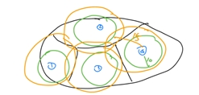
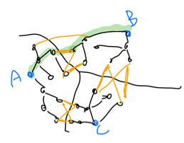
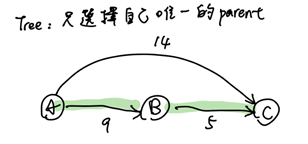
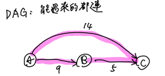

!!! danger "<https://slides.com/peter940324/deck-f0e69c#/3/18>" 

證明 : [sprout 2023](https://www.csie.ntu.edu.tw/~sprout/algo2023/ppt_pdf/week12/graph1_inclass_tp.pdf)

## dijkstra

單源點最短路徑

考慮不帶權的單點源最短路，我們用BFS維護一個 queue，每次處理一個點時最短路徑大小已知，因此只需要拿該點去**更新其他點一次**在**沒有負邊**的假設下，dijkstra 就像是有帶權的BFS。

???+note "模板 [CSES - Shortest Routes I](https://cses.fi/problemset/task/1671)"
	給一張帶正權無向圖,求從節點 $1$ 到其他所有節點的最短路徑。
	
	$1 \le n \le 10^5,1 \le m \le 2 \times 10^5$

??? note "算法實作"
    ```cpp linenums="1"
    vector<int> dijkstra (int start, vector<int>* G) {
        vector<int> dis(n + 1, INF);
        priority_queue<pii, vector<pii>, greater<pii>> pq;
        pq.push({0, start});
        while (pq.size()) {
            auto [x, u] = pq.top();
            pq.pop();
            if (dis[u] != INF) continue;
            dis[u] = x;
            for (auto [v, w] : G[u]) {
                pq.push({w + dis[u], v});
            }
        }
        return dis;
    }
    ```

### 練習

??? note "來回 [zerojudge g733. 110北二4.漫遊高譚市](https://zerojudge.tw/ShowProblem?problemid=g733)"
	給 $n$ 點 $m$ 邊有向圖，邊帶權
	
	另外額外有 $k$ 條無向帶權邊，至多只能走一條這種邊
	
	問 $s\to t$ 的最短路
	
	$n\le 10^4,m+k\le 10^5$
	
	??? note "思路"
		- 給定起點 $s$, 對於每個點 $u$ 找 $dis(s \rightarrow u) + dis(u \rightarrow v)$
		- 正反各做一次，也就是把正圖跟反圖都各做一次 $\texttt{dijkstra}$ 起點都是 $\texttt{s}$
		
??? note "n 平方"
	給定 $n$ 個點，第 $i$ 點在 $(x_i,y_i)$，從 $i\to j$ 花費 $(x_i - x_j)^2 + (y_i - y_j)^2$
	
	問從 $s\to t$ 的最小花費


### 多源點 dijkstra

???+note "[zerojudge b904. 10. 學園生活](https://zerojudge.tw/ShowProblem?problemid=b904)"
	給一張 $n$ 點 $m$ 邊的無向圖，與 $k$ 個源點，求這些點兩兩之間的距離最小值
	
	$n,k,m\le 3\times 10^5$

最暴力的想法就是枚舉源點，每次都重跑 dijkstra，複雜度 $O(k E \log⁡E )$

從上面暴力的方法我們可以觀察出，要交會的點或邊一定要是源點們之間的最短路。

每個源點能擴展出他能控制的最短路徑區域，如下圖

<figure markdown>
  { width="300" }
  <figcaption>每個源點擴出自己的範圍</figcaption>
</figure>

範圍重疊的地方代表他們同時是多個源點的最短路徑，這個就是我們可以取的答案，我們可以用一個數字 $x$ 來控制每個範圍最多能擴張多少權重，一旦目前的 $x$ 能使某些個範圍重疊的這個 $x$ 就可以是答案，我們二分搜 $x$ 找到最小的 $x$ 使得範圍有重疊

二分搜的複雜度為 $O(\log ⁡C)$ 其中 $C$ 是值域範圍，每次都需要重新擴張源點的範圍(因為擴張的權重上限被更新了)，為 $O(E \log ⁡E )$ 所以複雜度 $O(E \log⁡ E \log⁡ C )$

但我們真的有需要每次都重新算嗎?

這邊提一個結構叫 shortest path tree 又稱最短路徑樹，每個點 $v$ 都跟自己的最短路徑的上一個點 $u$ 連接，形成一顆樹

我們可以建立最短路徑樹，我們就只需要在樹上 BFS 即可應付每次 $x$ 改變之後的擴張範圍。複雜度 $O(E\log⁡E)$ 建樹，$O(V+E)$ BFS 二分搜 $O(\log ⁡C)$，總共 $O(E \log ⁡E+(V+E)  \log ⁡C)$

但其實到頭來我們只是要看重疊的部分，我們也就同樣的建立最短路徑樹，枚舉 edge 使得 $(u,v)$ 是來自不同的源點，$ans$ 去跟他取 min 即可，複雜度 $O(E \log⁡ E+E) = O(E \log⁡ E)$

<figure markdown>
  { width="300" }
  <figcaption>枚舉重疊邊</figcaption>
</figure>

另解:

對於每個非源點的點都去維護他與最近的兩個「不同的」源點的距離
	
令 $f[u]$ 為 $u$ 的與她最近源點的距離，$g[u]$ 為次近源點的距離，那麼答案就是 $ans =\min⁡(ans,f[u]+g[u])$，至於怎麼建構次短路下面會提到


### shortest path tree

<figure markdown>
  { width="250" }
  <figcaption>shortest path tree 結構</figcaption>
</figure>

??? note "實作"
	```cpp linenums="1"
    void build_Tree () {
        fill (par + 1, par + 1 + n, -1);
        for (int i = 1; i <= n; i++) {
            for (auto [v, w] : G[u]) {
                if (dis[v] == dis[u] + w) {
                    par[v] = u;
                }
            }
        }
        for (int i = 1; i < n; i++) {
            if (par[i] != -1) {
                D[par[i]].push_back(i);
            }
        }
    }
    ```

這邊帶一個相關的題目

???+note "[LOJ #3255. 「JOI 2020 Final」奥运公交](https://loj.ac/p/3255)"
    给 $n$ 點 $m$ 邊的有向圖
    
    每個邊 ($u_i,v_i,c_i,d_i$) 代表邊連接 $(u_i,v_i)$，邊權是 $c_i$
    
    你最多可以翻轉一條邊，翻轉代價是該條邊的 $d_i$
    
    求從 $1$ 走到 $n$ 再走回 $1$ 的最小 cost
    
    $n \leq 200,m \leq 5 \times 10^4$
    ??? note "思路"
    	- 若翻轉的邊在 shortest path tree 上
    		- 因為邊被刪掉了，整顆 tree 就要重算
    		- $1 \to u \to v \to n$
    		- 你可以從 $1 \to u$ 但這之後要走哪一條? (已經沒有 $u \to v$ 了)
    
    	- 若翻轉的邊不在 shortest path tree 上
    		- 不經過邊: 原來的答案
    		- 要經過邊 $1 \to v \to u \to n \to 1$ 或 $1 \to n \to v \to u \to 1$
    
    	- 我們只需要邊在 tree 上時再從新算一次 dijkstra
    		- $O(n^3)$
    		- $O(n)$ 樹上最多 $n - 1$ 條邊
    		- $O(n^2)$ 暴力 dijkstra


### shortest path DAG

<figure markdown>
  { width="300" }
  <figcaption>shortest path DAG結構</figcaption>
</figure>

有的都建邊，有重邊時也可以使用，時常配合 DAG DP 計算方法數

??? note "實作"
	```cpp linenums="1"
	void build_DAG() {
        for (int u = 1; u <= n; u++) {
            for (auto [v, w] : G[u]) {
                if (dis[v] == dis[u] + w) {
                    D[u].push_back(v);
                    in[v]++;
                }
            }
        }
    }
    ```
	
???+note "[LOJ #2350. 「JOI 2018 Final」月票购买](https://loj.ac/p/2350)"
	給一張雙向圖和 $s,t,u,v$，從 $s$ 到 $t$ 選一條**最短路徑**，將其邊權都設為 $0$
	
	問 $u$ 到 $v$ 的最短路徑最小可以是多少
	
	??? note "思路"
		- 若有重疊，設重疊為 $x\to \ldots \to y$
			- $ans=dis(u,x)+dis(y,v) \texttt{ or } dis(u,y)+dis(x,v)$
			- 記得跟 $dis(u,v)$ 取 min
	
		- 用 shortest path DAG 上枚舉 $x$ 用 dp 得到 $y$
			- DFS on DAG
			- $f[x]=$ topo sort 在 $x$ 之後的點的 $dis(v,y)$ 最小的 $y$
	
		- 同理用 shortest path DAG 找 $g[x]=$topo sort 在 $x$ 之後的點 $dis(u,y)$ 最小的 $y$
	
		- $ans=\min(dis(u,x)+f[x],dis(v,x)+g[x],dis(u,v))$  
	
	??? note "code"
		```cpp linenums="1"
		void dfs (int u) {
	        if (vis[u]) return;
	        vis[u] = 1;
	        f[u] = dV[u], g[u] = dU[u];
	        for (int i = head[u]; i; i = edge[i].next) {
	            int v = edge[i].to;
	            if (dS[u] + dT[v] + edge[i].len > dS[T]) continue;
	            dfs (v);
	            f[u] = min (f[u], f[v]), g[u] = min (g[u], g[v]);
	        }
	        ans = min ({ans, f[u] + dU[u], g[u] + dV[u]});
	    }
	    ```

???+note "[LOJ #2344. 「JOI 2016 Final」铁路票价](https://loj.ac/p/2344)"
    給你一個 $n$ 點 $m$ 邊的無向圖，一開始每個邊的邊權都是 $1$，有 $q$ 個操作
    
    - $\text{change}(i,2):$ 將第 $i$ 條邊邊權變成 $2$
    
    每次操作完問有那些點跟原點的最短路不同
    
    $n\le 10^5,q,m\le 2\times 10^5$
    
    ??? note "有用的測資"
    	=== "input"
    	
            ```
            4 4 2
            1 2 
            2 3
            1 4
            4 3
            2
            1
            ```
        
        === "output"
        
            ```
            0
            2
            ```
    
    ??? note "思路"
    	一樣先建立 shortest path DAG
    	
    	刪邊時類似 topo sort
    	
    	假如現在刪掉 $(u,v)$ 這條邊，若 $in_v=0$ 就可以將變大傳遞給 $v$ 後面的點
    
        由於每條邊邊權增加後就不可能出現在shortest path DAG，所以每條邊只需刪除一次故
        
        複雜度 $O(n+m)$
    
    ??? note "code"
    	```cpp linenums="1"
        #include <bits/stdc++.h>
        #define int long long
        #define pii pair<int, int>
        #define pb push_back
        #define mk make_pair
        #define F first
        #define S second
        #define ALL(x) x.begin(), x.end()
    
        using namespace std;
    
        const int INF = 2e18;
        const int maxn = 3e5 + 5;
        const int M = 1e9 + 7;
    
        int ans;
    
        struct Edge {
            int u, v, w, id;
        };
    
        struct Graph {
            int n, m, s;
            vector<vector<Edge>> G;
            vector<vector<Edge>> D;
            vector<Edge> edges;
            vector<int> dis;
            vector<int> on_DAG;
            vector<int> in;
    
            Graph (int _n, int _m) {
                n = _n, m = _m;
                dis = vector<int>(n, INF);
                on_DAG = vector<int>(m);
                in = vector<int>(n);
                G.resize (n);
                D.resize (n);
            }
    
            void add_edge (int u, int v, int id) {
                int w = 1;
                G[u].pb ({u, v, w, id});
                G[v].pb ({v, u, w, id});
                edges.pb ({u, v, w, id});
            }
    
            void dijkstra () {
                priority_queue<pii, vector<pii>, greater<pii>> pq;
                pq.push({0, s});
    
                while (pq.size()) {
                    auto [x, u] = pq.top();
                    pq.pop();
    
                    if (dis[u] != INF) continue;
                    dis[u] = x;
    
                    for (auto [u, v, w, id] : G[u]) {
                        pq.push({w + dis[u], v});
                    }
                }
            }
    
            void build_DAG () {
                for (int i = 0; i < n; i++) {
                    for (auto [u, v, w, id] : G[i]) {
                        if (dis[u] + w == dis[v]) {
                            D[u].pb ({u, v, w, id});
                            on_DAG[id] = true;
                            edges[id] = {u, v, w, id}; // 要更新 edges 的方向
                            in[v]++;
                        }
                    }
                }
            }
    
            void del_edge (int eid) {
                if (on_DAG[eid] == false) return;
    
                queue<int> q;
                in[edges[eid].v]--;
                on_DAG[eid] = false;
                if (in[edges[eid].v] == 0) q.push (edges[eid].v);
    
                while (q.size ()) {
                    int u = q.front (); q.pop ();
                    ans++;
    
                    for (auto [u, v, w, id] : D[u]) {
                        if (on_DAG[id] == false) continue;
                        in[v]--;
                        on_DAG[id] = false;
                        if (in[v] == 0) {
                            q.push (v);
                        }
                    }
                }
            }
        };
    
        void work () {
            int n, m, q, s;
            cin >> n >> m >> q;
            Graph g(n, m);
    
            int u, v;
            for (int i = 0; i < m; i++) {
                cin >> u >> v;
                u--, v--; 
                g.add_edge (u, v, i);
            } 
            g.s = 0;
    
            g.dijkstra ();
            g.build_DAG ();
    
            while (q--) {
                int eid;
                cin >> eid;
                eid--;
                g.del_edge (eid);
    
                cout << ans << "\n";
            }
        } 
    
        signed main() {
            ios::sync_with_stdio(0);
            cin.tie(0);
            int t = 1;
            //cin >> t;
            while (t--) {
                work();
            }
        } 
    
        /*
        4 4 2
        1 2 
        2 3
        1 4
        4 3
        2
        1
        */
        ```

???+note "[CSA Chromatic Number](https://csacademy.com/contest/archive/task/chromatic-number)"
	給一張 $N$ 點 $M$ 邊的圖，邊有邊權，請選擇 $K$ 個特殊點，使 $1\to N$ 的最短路徑中有最多的特殊點
	
	輸出最多能有幾條這樣的路徑以及最佳的選擇方式有幾種
	
	- $N\le 300$
	
	- $M\le \frac{N(N-1)}{2}$
	
	??? note "思路"
		> 建圖
	
	    - $O(n^3) \texttt{ floyd warshall}$ 
	    - $dis(u,v):$ $u$ 到 $v$ 的最短路
	    - $cnt(u,v):$ 從 $u$ 走最短路到 $v$ 有幾種走法
	
		> 狀態定義
	
	    - $f_{i,k}$ 以 $i$ 結尾選 $k$ 個節點最多能在幾個 shortest path 上
	    - $g_{i,k}$ 以 $i$ 結尾選 $k$ 個節點有幾種選法能滿足在 $f_{i,k}$ 個 shortest path 上
	
		> 轉移
	
	    - 找到 $u,v$ 滿足 $1 \rightarrow v \rightarrow u \rightarrow n$
	    - $f_{u,k}=\max \begin{cases} f_{v,k-1}\times cnt(v,u) \\ f_{u,k} \end{cases}$
	    - $g_{u,k}$
	    	- $\texttt{if }f_{v,k-1}\times cnt(v,u) \texttt{ == }f_{u,k}: g_{u,k}=g_{u,k}+g_{v,k-1}$
	    	- $\texttt{else if }f_{v,k-1}\times cnt(v,u) \texttt{ > }f_{u,k}: g_{u,k}=g_{v,k-1}$
	
	??? note "code"
		```cpp linenums="1"
		#include <bits/stdc++.h>
	    #define int long long
	    #define pii pair<int, int>
	    #define pb push_back
	    #define mk make_pair
	    #define F first
	    #define S second
	    #define ALL(x) x.begin(), x.end()
	
	    using namespace std;
	    using PQ = priority_queue<int, vector<int>, greater<int>>;
	
	    const int INF = 2e18;
	    const int maxn = 300 + 5;
	    const int M = 1e9 + 7;
	
	    int n, m, K;
	    int dis[maxn][maxn];
	    int cnt[maxn][maxn];
	    pii dp[maxn][maxn];
	
	    void floyd () {
	        for (int k = 1; k <= n; k++) {
	            for (int i = 1; i <= n; i++) {
	                for (int j = 1; j <= n; j++) {
	                    if (dis[i][j] == dis[i][k] + dis[k][j]) {
	                        cnt[i][j] += cnt[i][k] * cnt[k][j];
	                    }
	                    else if (dis[i][j] > dis[i][k] + dis[k][j]) {
	                        dis[i][j] = dis[i][k] + dis[k][j];
	                        cnt[i][j] = cnt[i][k] * cnt[k][j];
	                    }
	                }
	            }
	        }
	    }
	
	    void init () {
	        cin >> n >> m >> K;
	        int u, v, w;
	
	        for (int i = 1; i <= n; i++) {
	            for (int j = 1; j <= n; j++) {
	                dis[i][j] = INF;
	            }
	            dis[i][i] = 0;
	        }
	
	        for (int i = 1; i <= m; i++) {
	            cin >> u >> v >> w;
	            dis[u][v] = dis[v][u] = min (w, dis[u][v]);
	            cnt[u][v] = cnt[v][u] = 1;
	        }
	    }
	
	    void solve () {
	        floyd ();
	
	        vector<pii> ord;
	        for (int i = 1; i <= n; i++) {
	            ord.pb ({dis[1][i], i});
	            cnt[i][i] = 1;
	        }
	        sort (ALL(ord)); // sort by distance
	
	        // dp init
	        for (int i = 0; i < n; i++) {
	            int u = ord[i].S;
	            if (dis[1][u] + dis[u][n] != dis[1][n]) continue;
	            dp[u][1] = {cnt[1][u], 1};
	        }
	
	        // (v -> u) 一定是 v 先被走到再來才是 u，距離是一種可以判斷先後的好方法
	        for (int i = 0; i < ord.size (); i++) {
	            int u = ord[i].S;
	            if (dis[1][u] + dis[u][n] != dis[1][n]) continue; // check u
	
	            for (int j = 0; j < i; j++) {
	                int v = ord[j].S;
	                if (dis[1][v] + dis[v][u] + dis[u][n] != dis[1][n]) 
	                    continue; // check v
	
	                for (int k = 2; k <= K; k++) {
	                    pii tmp;
	                    tmp.F = dp[v][k - 1].F * cnt[v][u];
	                    tmp.S = dp[v][k - 1].S;
	
	                    if (tmp.F > dp[u][k].F)
	                        dp[u][k] = tmp;
	                    else if (tmp.F == dp[u][k].F) {
	                        dp[u][k].S += tmp.S;
	
	                        if (dp[u][k].S >= M)
	                            dp[u][k].S -= M;
	                    }
	                }
	            }
	        } 
	
	        pii res = {0, 0};
	        // 以 u 結尾，還缺少到 u -> n 這段，補起來
	        // 可是 n 結尾上面有算過了阿? 不一定會以 n 結尾 但最短路可延續至 n
	        for (int i = 1; i <= n; i++) {
	            if (dis[1][i] + dis[i][n] != dis[1][n])
	                continue;
	
	            dp[i][K].F *= cnt[i][n];
	
	            if (dp[i][K].F > res.F)
	                res = dp[i][K];
	            else if (dp[i][K].F == res.F) {
	                res.S += dp[i][K].S;
	
	                if (res.S >= M)
	                    res.S -= M;
	            }
	        }
	
	        cout << res.F << " " << res.S << "\n";
	    } 
	
	    signed main() {
	        // ios::sync_with_stdio(0);
	        // cin.tie(0);
	        int t = 1;
	        //cin >> t;
	        while (t--) {
	            init();
	            solve();
	        }
	    } 
	    ```

???+note "[CSES - Visiting Cities](https://cses.fi/problemset/task/1203)"

	給 $n$ 點 $m$ 邊正權有向圖，從 $1\to n$ 判斷每個邊
	
	- 是否在每個最短路徑上
	
	$n\le 10^5, m\le 2\times 10^5$
	
	??? note "思路"
	
		建立 shotest path DAG，進行 DAG DP
		
		$dp(1 \to u):$ $1\to u$ 是最短路的路徑方法數
		
		$dp(u \to n):$ $u\to n$ 是最短路的路徑方法數
		
		判斷 $dp(1 \to u)\times dp(v\to n)==dp(s\to t)$
		
	??? note "code"
		```cpp linenums="1"
		#include <bits/stdc++.h>
	    #define int long long
	    #define pii pair<int, int>
	    #define pb push_back
	    #define mk make_pair
	    #define F first
	    #define S second
	    #define ALL(x) x.begin(), x.end()
	
	    using namespace std;
	    using PQ = priority_queue<int, vector<int>, greater<int>>;
	
	    const int INF = 2e18;
	    const int maxn = 3e5 + 5;
	    const int M = 2147483647;
	
	    int n, m;
	    vector<pii> G[maxn];
	    vector<pii> R[maxn];
	    vector<int> D[maxn];
	    vector<int> P[maxn];
	    int in[maxn], rv[maxn];
	
	    vector<int> dijkstra (int source, vector<pii> *G) {
	        vector<int> dis(n + 1, INF);
	        priority_queue <pii, vector<pii>, greater<pii>> pq;
	
	        pq.push ({0, source});
	        while (pq.size()) {
	            auto [x, u] = pq.top();
	            pq.pop();
	
	            if (dis[u] != INF) continue;
	            dis[u] = x;
	
	            for (auto [v, w] : G[u]) {
	                pq.push ({x + w, v});
	            }
	        }
	        return dis;
	    }
	
	    void build (vector<int> &dis) {
	        for (int i = 1; i <= n; i++) {
	            for (auto [v, w] : G[i]) {
	                if (dis[v] == dis[i] + w) {
	                    D[i].push_back(v);
	                    P[v].pb(i);
	                    in[v]++;
	                    rv[i]++;
	                }
	            }
	        }
	    }
	
	    vector<int> topo (int source, int *in, vector<int> *D) {
	        queue<int> q;
	        vector<int> inn(n + 1);
	        vector<int> dp(n + 1);
	        dp[source] = 1;
	
	        for (int i = 1; i <= n; i++) {
	            if (in[i] == 0) q.push (i);
	            inn[i] = in[i];
	        }
	
	        while (q.size()) {
	            int u = q.front();
	            q.pop();
	
	            for (auto v : D[u]) {
	                dp[v] = (dp[v] + dp[u]) % M;
	                inn[v]--;
	                if (inn[v] == 0) q.push (v);
	            }
	        }
	
	        return dp;
	    }
	
	    void init () {
	        cin >> n >> m;
	        int u, v, w;
	        for (int i = 0; i < m; i++) {
	            cin >> u >> v >> w;
	            G[u].pb({v, w});
	            R[v].pb({u, w});
	        }
	    }
	
	    void solve() {
	        vector<int> dis = dijkstra (1, G);
	        vector<int> rev = dijkstra (n, R);
	        build (dis);
	
	        vector<int> dp1 = topo (1, in, D);
	        vector<int> dp2 = topo (n, rv, P);
	
	        int tot = dp1[n];
	        vector<int> res;
	        for (int i = 1; i <= n; i++) {
	            int cur = (dp1[i] * dp2[i]) % M;
	            if (cur == tot) {
	                res.pb(i);
	            }
	        }
	
	        cout << res.size() << "\n";
	        for (int i = 0; i < res.size(); i++) cout << res[i] << " ";
	    } 
	
	    signed main() {
	        // ios::sync_with_stdio(0);
	        // cin.tie(0);
	        int t = 1;
	        //cin >> t;
	        while (t--) {
	            init();
	            solve();
	        }
	    } 
	    ```

???+note "CSES - Visiting Cities 變化"

	給 $n$ 點 $m$ 邊正權有向圖，從 $1\to n$ 判斷每個邊是哪種 $\texttt{type}$
	
	- $\texttt{type 1: }$是否在每個最短路徑上 
	
	- $\texttt{type 2: }$至少有在一個最短路徑上
	
	- $\texttt{type 3: }$根本沒有在最短路徑上
	
	$n\le 10^5, m\le 2\times 10^5$
	
	??? note "思路"
	
		建立 shotest path DAG，進行 DAG DP
		
		- $\texttt{type 1: }$ 判斷 $dp(1 \to u)\times dp(v\to n)==dp(s\to t)$
	
	    - $\texttt{type 2: }$ 在 DAG 上的邊
	
	    - $\texttt{type 3: }$ 不在 DAG 上的邊

### 分層 dijkstra

洛谷分層圖題單 : <https://www.luogu.com.cn/training/5811#problems>

???+note "[LOJ #3964. 「APIO2023」赛博乐园](https://loj.ac/p/3964)"
	
	??? note "思路"
		<https://www.cnblogs.com/crab-in-the-northeast/p/luogu-p9370.html>

???+note "CSES - flight discount 變化"
	輸入一個 $n$ 點 $m$ 邊的有向圖，每條邊都有權重 $w(u,v)$
	
	若連續走兩條邊 $a\to b\to c$，本來需花 $w(a,b)+w(b,c)$，使用優惠券可以將花費改成 $w(b,c)\times 2$，優惠券只能用 $k$ 次
	
	問 $1\to n$ 的最小花費

???+note "[2021 附中模競 II 惡地之路](https://drive.google.com/file/d/1ISO-o4DrQmbuqVVAgxeVQEO3ifMvcy01/view)"
	給一張 $n$ 點 $m$ 邊無向圖，令 $s$ 到節點 $i$ 走 $k$ 步的最短距離是 $d(i,k)$
	
	對於每個 $i$ 求 $\min \{ d(i,k) \times k \}$
	
	$n\le 2000,m\le 3\times 10^4$
	
	??? note "思路"
	
		此方法並非滿分解，滿分解在<a href="/wiki/graph/Tree/#_1" target="_blank">這裡</a>
		
		---
		
		把每個節點都複製 $n$ 份
		
		如果本來有一條邊是 $(u,v)$，那就對所有 $1\le i < n$ 蓋
		
		- $u$ 的第 $i$ 個點到 $v$ 的第 $i+1$ 個點（有向）
		- $v$ 的第 $i$ 到 $u$ 的第 $i+1$ 個點（有向）
	
		這樣走到某個節點的第 $i$ 個點的路徑長度一定是 $i-1$
		
		$n^2$ 個點，$2nm$ 個邊做最短路徑，$O(nm\log⁡ nm)$
		
		枚舉 $k=1\ldots n$，對於第 $k$ 層拉出來求最小的 $dis_k$ 
		
		$$ans = \min\limits_{k=1\ldots n} \{dis_k\times k\}$$

???+note "[CSES - flight discount](https://cses.fi/problemset/task/1195)"
	給一張 $n$ 點 $m$ 邊的無向圖，邊有權重，可將其中 $k$ 條邊以半價計算，求 $1\to n$ 的最短路
	
	$n\le 10^5,m\le 2\times 10^5$
	
	??? note "思路"
		原本 graph 有 $n$ 的點，變成一個圖有 $kn$ 個點的新 graph
		
		$\texttt{node}(k, u)$ 到 $\texttt{node}(k, v)$ 的長度就是 $w(u, v)$
		
		$\texttt{node}(k-1, u)$ 到 $\texttt{node}(k, v)$ 的長度就是 $w(u, v)/2$
		
		直接跑 Dijkstra，起點 $\texttt{node}(0, 1)$ 終點 $\texttt{node}(2, n)$

???+note "[USACO Gold 2021 January - Telephone](http://www.usaco.org/index.php?page=viewproblem2&cpid=1090)" 
	給 $n,k$ 陣列跟 matrix $S$，每個點有一個權值 $b_i=1...k$
	
	$i$ 能走到 $j$ 當且僅當 $S_{b[i],b[j]}=1$，且 $\text{cost}=|i-j|$
	
	求從 $1\rightarrow n$ 最少要多少 $\text{cost}$
	
	$n\le 5\times 10^4,k\le 50$
	
	??? note "思路"
	    > key obeservation
	    
	    > $\text{cost}=|i-j|\rightarrow$ 想成每次都移動 $1$ 格
	    
	    > ex: $i\rightarrow i+1 \texttt{ or } i-1$
	    
	    - 建一個 $O(nk)$ 的圖
	
	    - node (u, b) 代表目前的位置(不是真正在 u，而是目前的 cost 增加或減到 u)，b 代表從上個真正點的 $b_i$
	
	    - node (u, b) = $\begin{cases} \texttt{node (u + 1, b)}+1 \\ \texttt{node (u - 1, b)}+1 \\ \texttt{node (u, b[u])}+0 \end{cases}$
	
	    - 其中 node (u, b) -> node (u, b[u]) 走到真正的點

???+note "[2023 TOI 一模 pD.安逸旅行路線 (jaunt)](https://drive.google.com/file/d/1_sx9DvDSjpn0RCR280MKsS_FNfrr-iqy/view)"
	有一張 $n$ 點 $m$ 邊有向圖，邊 $u \rightarrow v$ 的難度係數為 $d(u, v)$，代表如果 $u \rightarrow v$ 是路徑上的第 $k$ 條邊（1-based），則這條邊的辛苦程度是 $d(u, v)^k\mod P$，一條路徑的辛苦程度被定義為路徑上所有邊的最大辛苦程度

	輸出 $s$ 到 $t$ 的所有路徑中，最小辛苦程度的值，若不存在請輸出 $-1$
	
	- $n\le 1000$
	- $m\le 5000$
	- $P\le 10^5$ 且 $P$ 是質數

### 方案數

### 次短路

-  先做一次 dijkstra

-  令 $f(i)$ 為 $i$ 這個 $\texttt{node}$ 的最短路徑

-  令 $g(i)$ 為 $i$ 這個 $\texttt{node}$ 的次短路徑

-  dijkstra 的精神就是從最小的點開始擴散 (轉移)

-  這邊的想法也一樣
    -  一定有某一個 $\texttt{node}$ 的 $g(i)$ 是不從 $g(j)$ 轉移的，而是從周圍 $f(i)$ 的轉移
    -  確定這個點之後就可以開始類似 dijkstra 從該點開始轉移出去
    -  $g(u)= \sec \begin{cases} f(v) + w(u, v) \\ g(v) + w(u, v) \end{cases}$

- 步驟
    - 一般的 dijkstra 得到 $f(u)$
    - $g(u)= \sec \begin{cases} f(v) + w(u, v)\end{cases}$
    - 每次找最小的 $g(u)$ 來更新其他人的 $g(v)$ (如下)
    - $g(v)= \sec \begin{cases} f(u) + w(u, v) \\ g(u)+w(u,v) \end{cases}$

非沿革與嚴格的差別就只差在 `sec()` 函式的 $<$ 要改 $\le$

=== "嚴格"

	```cpp linenums="1"
	void sec (pii &org, int x) {
	    if (org.F < x && org.S == -1) org.S = x;
	    else if (org.F < x && x < org.S) org.S = x;
	}
	```

=== "非嚴格"

    ```cpp linenums="1"
    void sec (pii &org, int x) {
        if (org.F <= x && org.S == -1) org.S = x;
        else if (org.F <= x && x < org.S) org.S = x;
    }
    ```

??? note "次短路實作"
	```cpp linenums="1"
    struct Graph {
        struct Edge {
            int u, v, w;
        };

        Graph (int _n, int _m, int _s, int _t) {
            n = _n, m = _m;
            s = _s, t = _t;
            f = vector<int>(n, INF);
            g = vector<int>(n, INF);
            G.resize (n);
        }
    
        void add_edge (int u, int v, int w) {
            G[u].pb ({u, v, w});
        }
    
        int dijkstra () {
            priority_queue<pii, vector<pii>, greater<pii>> pq;
            pq.push({0, s});
    
            while (pq.size()) {
                auto [x, u] = pq.top();
                pq.pop();
    
                if (f[u] != INF) continue;
                f[u] = x;
    
                for (auto [u, v, w] : G[u]) {
                    pq.push({w + f[u], v});
                }
            }
            return f[t];
        }
    
        int find_second_best () {
            priority_queue<pii, vector<pii>, greater<pii>> pq;
            vector<int> vis (n);
            for (int i = 0; i < n; i++) {
                for (auto [u, v, w] : G[i]) {
                    sec (v, f[i] + w);
                }
            }
    
            for (int i = 0; i < n; i++) {
                pq.push ({g[i], i});
            }
    
            while (pq.size()) {
                auto [x, u] = pq.top ();
                pq.pop ();
    
                if (vis[u]) continue;
                vis[u] = 1;
    
                for (auto [u, v, w] : G[u]) {
                    sec (v, x + w);
                    pq.push ({g[v], v});
                }
            }
            return g[t];
        }
    
        private:
            int n, m, s, t;
            vector<vector<Edge>> G;
            vector<int> f, g;
    
            void sec (int u, int x) {
                if (f[u] < x && g[u] == INF) g[u] = x;
                else if (f[u] < x && x < g[u]) g[u] = x;
            }
    };
    ```

???+note "模板 [TIOJ 2058 死對頭問題](https://tioj.ck.tp.edu.tw/problems/2058)"
	給一張 $N$ 點 $M$ 邊有向帶權圖，求 $s\to t$ 最短路徑和嚴格次短路徑長的差
	
	有 $T$ 筆測資
	
	$T \le 20,N, M \le 10^5$

???+note "n平方 [POJ - 3255 Roadblocks](https://www.luogu.com.cn/problem/P2865)"
	給一張 $n$ 點 $m$ 邊無向帶權圖，求 $1\to n$ 的嚴格次短路
	
	$n\le 5000,m\le 10^5$
	
	註 : 此題使用 n<sup>2</sup> 或是 n log n 解都可
	
	??? note "code"
		```cpp linenums="1"
		#include <bits/stdc++.h>
	    #define int long long
	    #define pii pair<int, int>
	    #define pb push_back
	    #define mk make_pair
	    #define F first
	    #define S second
	    #define ALL(x) x.begin(), x.end()
	
	    using namespace std;
	
	    const int INF = 2e18;
	    const int maxn = 3e5 + 5;
	    const int M = 1e9 + 7;
	
	    int n, m;
	    int vis[maxn];
	    vector<pii> G[maxn];
	
	    void sec (pii &org, int x) {
	        if (org.F < x && org.S == -1) org.S = x;
	        else if (org.F < x && x < org.S) org.S = x;
	    }
	
	    int find1 (vector<int>& f) {
	        int mn = INF, idx = -1;
	        for (int i = 1; i <= n; i++) {
	            if (f[i] < mn && (!vis[i])) {
	                mn = f[i], idx = i;
	            }
	        }
	        if (idx != -1) vis[idx] = 1;
	        return idx;
	    }
	
	    int find2 (vector<pii>& g) {
	        int mn = INF, idx = -1;
	        for (int i = 1; i <= n; i++) {
	            if (g[i].S != -1 && g[i].S < mn && (!vis[i])) {
	                mn = g[i].S, idx = i;
	            }
	        }
	        if (idx != -1) vis[idx] = 1;
	        return idx;
	    }
	
	    void dijkstra (int start) {
	        vector<int> f (n + 1, INF);
	        f[start] = 0;
	
	        for (int i = 1; i <= n; i++) {
	            int u = find1 (f);
	
	            for (int j = 0; j < G[u].size(); j++) {
	                int v = G[u][j].F, w = G[u][j].S;
	                f[v] = min (f[v], f[u] + w);
	            }
	        }
	
	        vector<pii> g (n + 1);
	        for (int i = 1; i <= n; i++) {
	            g[i] = mk(f[i], -1);
	        }
	
	        for (int i = 1; i <= n; i++) {
	            for (int j = 0; j < G[i].size(); j++) {
	                int v = G[i][j].F, w = G[i][j].S;
	                sec (g[v], f[i] + w);
	            }
	        }
	
	        memset (vis, 0, sizeof (vis));
	        for (int i = 1; i <= n; i++) {
	            int u = find2 (g);
	            if (u == -1) break;
	
	            for (int j = 0; j < G[u].size(); j++) {
	                int v = G[u][j].F, w = G[u][j].S;
	                sec (g[v], g[u].S + w);
	            }
	        }
	
	        cout << g[n].S << "\n";
	    }
	
	    void init () {
	        cin >> n >> m;
	        int u, v, w;
	        for (int i = 0; i < m; i++) {
	            cin >> u >> v >> w;
	            G[u].pb (mk(v, w));
	            G[v].pb (mk(u, w));
	        }
	    }
	
	    void solve () {
	        dijkstra (1);
	    } 
	
	    signed main() {
	        // ios::sync_with_stdio(0);
	        // cin.tie(0);
	        int t = 1;
	        //cin >> t;
	        while (t--) {
	            init();
	            solve();
	        }
	    } 
	    ```

???+note "嚴格次短路方法數 [AcWing - 383.觀光](https://www.acwing.com/problem/content/385/)"
	給一張 $N$ 點 $M$ 邊有向帶權圖，求 $s\to t$ 的 :
	
	- 最短路方法數
	
	- 比最短路多一單位的方法數
	
	有 $T$ 筆測資
	
	$N\le 1000,M \le 10^4$
	
	??? note "思路"
		$dp_f(v)=\sum \limits_{f(v)+w(v, u)==f(u)}dp_f(u)$
		
		$dp_g(v)=\sum \begin{cases}dp_g(u) & \text{ if } g(v) + w(v, u) == g(u) \\ dp_f(u) & \text{ if } f(v) + w(v, u) == g(u) \end{cases}$
	
	??? note "code"
		```cpp linenums="1"
		#include <bits/stdc++.h>
	    #define int long long
	    #define pii pair<int, int>
	    #define pb push_back
	    #define mk make_pair
	    #define F first
	    #define S second
	    #define ALL(x) x.begin(), x.end()
	
	    using namespace std;
	
	    const int INF = 2e18;
	    const int maxn = 3e5 + 5;
	    const int M = 1e9 + 7;
	
	    struct Edge {
	        int u, v, w;
	    };
	
	    struct Graph {
	        int n, m, s, t;
	        vector<vector<Edge>> G;
	        vector<int> f, g;
	        vector<int> dp_f, dp_g;
	
	        Graph (int _n, int _m) {
	            n = _n, m = _m;
	            f = vector<int>(n, INF);
	            g = vector<int>(n, INF);
	            dp_f = vector<int>(n);
	            dp_g = vector<int>(n);
	            G.resize (n);
	        }
	
	        void add_edge (int u, int v, int w) {
	            G[u].pb ({u, v, w});
	        }
	
	        void sec (int u, int x) {
	            if (f[u] < x && g[u] == INF) g[u] = x;
	            else if (f[u] < x && x < g[u]) g[u] = x;
	        }
	
	        void dijkstra () {
	            priority_queue<pii, vector<pii>, greater<pii>> pq;
	            pq.push({0, s});
	
	            while (pq.size()) {
	                auto [x, u] = pq.top();
	                pq.pop();
	
	                if (f[u] != INF) continue;
	                f[u] = x;
	
	                for (auto [u, v, w] : G[u]) {
	                    pq.push({w + f[u], v});
	                }
	            }
	        }
	
	        int find_second_best () {
	            priority_queue<pii, vector<pii>, greater<pii>> pq;
	            vector<int> vis (n);
	            for (int i = 0; i < n; i++) {
	                for (auto [u, v, w] : G[i]) {
	                    sec (v, f[i] + w);
	                }
	            }
	
	            for (int i = 0; i < n; i++) {
	                pq.push ({g[i], i});
	            }
	
	            while (pq.size()) {
	                auto [x, u] = pq.top ();
	                pq.pop ();
	
	                if (vis[u]) continue;
	                vis[u] = 1;
	
	                for (auto [u, v, w] : G[u]) {
	                    sec (v, x + w);
	                    pq.push ({g[v], v});
	                }
	            }
	        }
	
	        void build_DAG (vector<int> &dis, vector<vector<Edge>> &D) {
	            for (int i = 0; i < n; i++) {
	                for (auto [u, v, w] : G[i]) {
	                    if (dis[u] + w == dis[v]) {
	                        D[u].pb ({u, v, w});
	                    }
	                }
	            }
	        }
	
	        void topo (vector<int> &dp, vector<vector<Edge>> &D) {
	            vector<int> in(n);
	            for (int i = 0; i < n; i++) {
	                for (auto [u, v, w] : D[i]) {
	                    in[v]++;
	                }
	            }
	
	            queue<int> q;
	            for (int i = 0; i < n; i++) {
	                if (in[i] == 0) q.push (i);
	            }
	
	            while (q.size ()) {
	                int u = q.front (); q.pop ();
	
	                for (auto [u, v, w] : D[u]) {
	                    in[v]--;
	                    dp[v] += dp[u];
	                    if (in[v] == 0) q.push (v);
	                }
	            }
	        }
	
	        int solve () {
	            int res = 0;
	
	            dijkstra ();
	            vector<vector<Edge>> Df (n);
	            build_DAG (f, Df);
	            dp_f[s] = 1;
	            topo (dp_f, Df);
	
	            res += dp_f[t];
	            find_second_best ();
	            if (g[t] == INF || g[t] != f[t] + 1) return res;
	
	            vector<vector<Edge>> Dg (n);
	            vector<vector<Edge>> Dfg (n);
	
	            build_DAG (g, Dg); 
	
	            // f[u] -> w -> g[v]
	            for (int i = 0; i < n; i++) {
	                for (auto [u, v, w] : G[i]) {
	                    if (f[u] + w == g[v]) {
	                        dp_g[v] += dp_f[u];
	                    }
	                }
	            }
	            topo (dp_g, Dg);
	
	            res += dp_g[t];
	            return res;
	        }
	    };
	
	    void work () {
	        int n, m, s, t;
	        cin >> n >> m;
	        Graph g(n, m);
	
	        int u, v, w;
	        for (int i = 0; i < m; i++) {
	            cin >> u >> v >> w;
	            u--, v--;
	            g.add_edge (u, v, w);
	        } 
	        cin >> s >> t;
	        s--, t--;
	        g.s = s, g.t = t;
	
	        cout << g.solve () << "\n";
	    } 
	
	    signed main() {
	        ios::sync_with_stdio(0);
	        cin.tie(0);
	        int t = 1;
	        cin >> t;
	        while (t--) {
	            work();
	        }
	    } 
	    ```

### K 短路

> dijkstra 正確性證明

> 你把狀態 $w$ 推出去的時候 狀態 $<w$ 都已經推出去了

> 所以當 $w$ 被推出去的時候 就保證是最佳解

延伸 : A*、 yen's algorithm

- 從上面的次短路延伸

- 假設 $v_1,..,v_r$ 都可以走到 $u$

$$
\small
dis(u,k)=k\texttt{-th} \begin{cases} dis(v_1,0)+w(u,v_1), dis(v_1,1)+w(u,v_1),..,dis(v_1,k)+w(u,v_1) \\ dis(v_2,0)+w(u,v_2), dis(v_2,1)+w(u,v_2),..,dis(v_2,k)+w(u,v_2) \\ 
\vdots \\
dis(v_r,0)+w(u,v_r), dis(v_r,1)+w(u,v_r),..,dis(v_r,k)+w(u,v_r)\end{cases}$$

- 但怎麼求 $k\texttt{-th}$ ?

- 只要把每種可能的狀態更新直到 $u$ 這個點足夠 $k$ 個狀態為止
    - 過程中 $\texttt{sort}$ 維護前幾大

??? note "K 短路 code"
	```cpp linenums="1"
	signed main() {
        ios::sync_with_stdio(0);
        cin.tie(0);
        cin >> n >> m >> k;

        for (int i = 0, u, v, w; i < m; i++) {
            cin >> u >> v >> w;
            G[u].push_back({w, v});
        }
    
        vector<vector<int>> dis(n + 1, vector<int>(k));
    
        for (int i = 1; i <= n; i++) {
            for (int j = 0; j < k; j++) dis[i][j] = INF;
        }
    
        priority_queue<pair<int, int>, vector<pair<int, int>>,
       				   greater<pair<int, int>>> pq;
        pq.push({0, 1});
    
        while (pq.size()) {
            int u = pq.top().second;
            int d = pq.top().first;
            pq.pop();
    
            if (dis[u][k - 1] < d) continue;
    
            for (auto [w, v] : G[u]) {
                if (d + w < dis[v][k - 1]) {
                    dis[v][k - 1] = d + w;
                    pq.push({dis[v][k - 1], v}); // 塞到 .back
                    sort(dis[v].begin(), dis[v].end());
                }
            }
        }
    
        for (int i = 0; i < k; i++)
            cout << dis[n][i] << " ";
    
    }
    ```

### 線段樹優化建圖

詳見此處

### 練習題

???+note "[CF 1051 F.The Shortest Statement](https://codeforces.com/problemset/problem/1051/F)"
	給一個 $n$ 點 $m$ 邊的無向圖，$q$ 筆詢問 :
	
	- $s_i\to t_i$ 的最短路徑
	
	$n,m,q\le 10^5,m-n\le 20$
	
	??? note "思路"
		觀察到 $m-n\le 20$
		
		若 $m=n-1$ 那就是一顆樹，我們可以將最短路分成全部都在樹上，跟有走到非樹邊的情況
		
		全部都在樹上 :
		
		樹上最短路，LCA
		
		有走到非樹邊 :
		
		因為這種邊最多只有 $21$ 條，也就是涵蓋 $42$ 個點，所以我們可以暴力以這 $42$ 個點為源點跑 dijkstra
		
		$s\to u \to t$，我們枚舉這 $42$ 個 $u$

???+note "[洛谷 P7407 [JOI 2021 Final] ロボット](https://www.luogu.com.cn/problem/P7407)"
    給你一個張無向圖，邊有顏色 $C_i$
    
    目標從 $1$ 走到 $n$，想走 $u\rightarrow v$ 若且唯若 $u$ 的出邊只有 $u\rightarrow v$ 有該種顏色
    
    每條邊可花 $P_i$ 變顏色(只限變一次)，問最小花費
    
    ??? note "思路"
    	> 一定可以找到一種顏色使得 $u\rightarrow v$ 的顏色唯一
    	
        > - 改自己 或 改別人
        
        > 否則就是 $\texttt{IMPOSSILBE}$
        
        - 要走 $u\rightarrow v$ 其實只有兩種 case
    
        - $\begin{cases} \texttt{case1: }w \\ \texttt{case2: }S_{u,c}-w \end{cases}$
    
        - 注意到選擇 case2 的話這些被改變的邊在之後的路徑上不會貢獻
            - 如果會貢獻就直接在 $u$ 的時候走那條(case1)不是花費更少?
    
        - 走 case1 會影響到 $v$ 為中心的 case2
            - 花費就成了 $S_{v,c}-w-w'$
            - 其中 $w'$ 是 $u\rightarrow v$ 用 case1 的花費
            - 這種情況只發生在 $u,v$ 往外走都走同一顏色的情況
    
        - 建立虛點 $u_c$ 轉移 $v_c$，邊權為 $0$
    
        - 再讓 $v_c$ 轉移到 $x$ 邊權為 $S_{v,c}-w-w'+w'=S_{v,c}-w$
    
    ??? note "code"
    	```cpp linenums="1"
    	struct Edge {
            int v,c,w;
        };
    
        void Upd(int u, int d){
            pq.push({u, d});
        }
    
        void AddEdge (int u, int v, int c, int w){
            if(!st[u].count(c)) {
                st[u][c] = ++k;
                G[u].pb((Edge){k, 0, 0});
            }
    
            int t = st[u][c];
            G[t].pb((Edge){v, c, w});
            S[t] += w;
        }
    
        void Dijkstra () {
            memset(dis, 0x3f, sizeof dis);
            dis[1] = 0;
            pq.push({1, 0});
    
            while(pq.size ()) {
                auto [u, d] = pq.top ();
                pq.pop();
    
                if(dis[u] != INF) continue;
                dis[u] = d;
    
                if(u <= n) {
                    for(Edge edge : G[u]) {
                        int t = edge.v; // u_c
                        for(Edge i : G[t]) {
                            Upd(i.v, d + min(i.w, S[t] - i.w));
                            Upd(st[i.v][i.c], d); // u_c -> v_c
                        }
                    }
                } 
                else for(Edge i : G[u]) Upd(i.v, d + S[u] - i.w);
            }
            cout << (dis[n] == INF ? -1 : dis[n]) << "\n";
        }
        ```

???+note "[LOJ #2335. 「JOI 2017 Final」足球](https://loj.ac/p/2335)"
    有 $n$ 個球員站在 Grid 上求球從 $a_1$ 踢到 $a_n$ 的最小 $cost$
    
    - 球員踢球(上下左右) $A\times p + B$
    
    - 球員移動(上下左右) $cost=C$
    
    - 放下球 $cost=0$
    
    - 拿起球 $cost = 0$
    
    ??? note "思路"
        - 最後兩點是沒用的
            - 你拿放下球然後跑走讓另一個過來拿球(???)
            - 你放下球然後再拿起來(???)
    
        - 觀察後會發現一個球員最多有一次的機會可以掌控球 (下面有證明)
    
        > - $0,1,2,3$ 上下左右 (自飛)
        
        > - $4$ 停止 (自飛)
        
        > - $5$ 帶飛 (往 random direction)
    
        - 自飛的球
          - 繼續移動 $0,1,2,3\rightarrow 0,1,2,3 :A$ 往自己的方向 
          - 被球員撿到 $4\rightarrow 5: dis_{i,j}\times C$ 
              - $dis_{i,j}$ 為最近的球員到 $(i,j)$ 的距離
          - 停下來  $0,1,2,3\rightarrow 4:0$  
    
        - 帶飛的球
          - 繼續跟著球員走 $5 \rightarrow 5:C$  四個方向
          - 被球員踢出去 $5 \rightarrow 0,1,2,3:B$ 
          - ~~停下來~~ 停下來，撿起來，浪費時間
    
        > 球員跟求只能相遇一次 proof
        
        > - 如果相遇在同一個位置 
        >   - cost = 球跑了大半天的 cost (完全沒必要)
      
        > - 如果相遇在不同位置 
        >   - cost = 我需要移動到那個位置的 cost + 求繞了大半天的 cost
        >   - 那其實直接報的球跑到那個位置為更好 相當於求不離身 沒有再相遇一次
        >   - 球員有移動 跟 球員跟著球移動的 cost 相等

## Bellman Ford

Bellman-Ford 就是把所有節點都 relax，做 $n − 1$ 次，會對的原因是最短路徑最多只經過 $n − 1$ 條邊

???+note "模板 [CSES - Cycle Finding](https://cses.fi/problemset/task/1197)"
	給一張 $n$ 點 $m$ 邊有向圖，求上面是否有負環
	
	$n \le 2500、m \le 5000$

??? note "算法實作"
	```cpp linenums="1"
    void solve () {
        vector<int> d(n, INF);
        d[v] = 0;
        for (int i = 0; i < n - 1; ++i)
            for (Edge e : edges)
                if (d[e.a] < INF)
                    d[e.b] = min(d[e.b], d[e.a] + e.cost);
    }
    ```

!!! question "正環性質"
	注意 : 這邊說的正環是指非負環

	若從 $u$ 出發沿著正環走一圈，任意前綴點權重和都 $\ge 0$，我們說 $u$ 是一個好起點
	
	<https://drive.google.com/file/d/1q2mP9uHYAauroE2mjtYKti9khs0H9qaJ/view>
	
	??? question "證明"
		設 $C$ 是一個點權重和 $≥ 0$ 的環。隨意找一個 $u_1 ∈ V(C)$，並設從 $u_1$ 沿著 $C$ 出發走一圈經過的點依序是 $u_2, u_3, …, u_{|V(C)|}$。 對於所有的 $i ∈ {0, 1, …, |V(C)|}$，考慮在每個節點的所持金數列 $s$（也就是環的點權前綴和）：
	
		$\begin{align}s(i) = \begin{cases}0,&\text{if }i=0,\\ c(u_1) + c(u_2) + \ldots + c(u_i),&\text{if }i\ge1.\end{cases}\end{align}$
	
		考慮路途任一所持金最小的時刻 $k ∈ {0, 1, …, |V(C)| - 1}$，也就是 $k$ 滿足
	
		$\begin{align}s(k) = \min_{0 \le i \le |V(C)| - 1} s(i).\end{align}$
	 
		注意我們有 $s(|V(C)|) ≥ 0 = s(0)$，因此
	 
		$\begin{align}s(k) = \min_{0 \le i \le |V(C)|} s(i).\end{align}$
	
		注意我們有 $s(|V(C)|) ≥ 0 = s(0)$，因此
	
		$\begin{align}s(k) = \min_{0 \le i \le |V(C)|} s(i).\end{align}$
	 
		接著證明 $u_{k + 1}$ 是一個好起點。
	
		對於所有的 $i ∈ { k + 1, k + 2, …, |V(C)| }$， 從 $u_{k + 1}$ 出發沿著 $C$ 走到 $u_i$ 的點權重和是 $s(i) - s(k)$， 但 $s(k) ≤ s(i)$， 故 $s(i) - s(k) ≥ 0$。
	
		對於 $i ∈ {1, 2, …, k}$， 從 $u_{k + 1}$ 出發沿著 $C$ 走到 $u_i$ 的點權重和是 $s(|V(C)|) + s(i) - s(k)$。 但 $s(|V(C)|) ≥ 0$，依然有 $s(|V(C)|) + s(i) - s(k) ≥ s(i) - s(k) ≥ 0$。

???+note "找非負環"
	Bellman Ford 可以找負環，只是有辦法找「零」環嗎

???+note "[全國賽 2021 pC](https://tioj.ck.tp.edu.tw/problems/2253)"
	給一張 $n$ 點（城市） $m$ 邊的有向圖 $G_0$。 我們對 $G_0$ 的每條邊都加上 $k$ 個點（村莊），得到一張 $n + mk$ 節點的有向圖 $G$，並賦予點權重 $c: V(G) \to Z$（每個節點的收支）。

	設 $C$ 是 $G$ 上的一個簡單環且 $u ∈ V(C)$。 若從 $u$ 出發沿著 $C$ 走一圈，任意前綴點權重和都 $\ge 0$，我們就說 $C$ 是 $G$ 的一個好環，而 $u$ 是 $C$ 的一個好起點。
	
	請找出 $G$ 的任一個好環 $C$ 與 $C$ 的任一個好起點 $u$，並求出 $C$ 上有幾個點可以當作好起點，這些好起點又有幾個在 $G_0$ 上。
	
	$k\le n\le 2000,m\le 8000$
	
	??? note "思路 (from twpca)"
		依照上面提到的正環性質，任意一個非負環必定存在一個好起點
		
		所以我們只需要對 $G_0$ 的邊 `*=-1` 然後去找負環即可，複雜度 $O(nm)$
		
		定義 $s$ 的前綴最小值 $α_i$ 為 $u_1$ 沿著 $C$ 走到 $u_i$ 時的最小所持金：
		
		$\begin{align}\alpha_i = \min_{0 \le k \le i} s(i).\end{align}$
	
	    類似地，我們也可以定義 $s$ 的後綴最小值 $β$：
	
		$\begin{align}\beta_i = \min_{i \le k \le |V(C)|} s(i).\end{align}$
	
	    若改變起點從 $u_x$ 開始沿著 $C$ 走一圈，可以推出所持金最小的時刻如下:
	
	    $u_x$ 至 $u_{|V(C)|}$ 間：$β_x - s(x - 1)$
	    
	    $u_1$ 至 $u_x-1$ 間：$α_{x - 1} + s(|V(C)|) - s(x - 1)$
	    
	    上面兩者取最小值即可求得以 $u_x$ 為起點繞 $C$ 走一圈的最小所持金
	    由於環展開頂多只有 $n + mk$ 個節點，故這邊複雜度為 $O(n + mk)$。

???+note "2022 北一區早上場 p3"
	給一張 $n$ 點 $m$ 邊無向圖，邊有權重
	
	使每個邊權都減 $x$，目標是讓沒有一個環的權重總和超過 $0$，求最小整數 $x$
	
	$n\times m \le 3\times 10^7,|w_i|\le 1000$
	
	??? note "思路"
		我們將邊權都 `*= -1`，這樣我們就只要找到 $x$ 使得邊權都 $+x$ 之後沒有負環，$x$ 具有單調性可以二分搜

## SPFA

- shortest path Finding algorithm，單源最短路

- Bellman Ford 的優化版本

- 每回合只更新「前一回合有被鬆弛」的點相鄰的邊，實作上類似 dijkstra

??? note "SPFA code"
	```cpp linenums="1"
	// 如果上一輪某一個點的距離沒有更新,那這一輪也沒必要 relax 他
	// 把距離有更新的節點丟進 queue 裡,然後一直拿 queue 裡的節點出來 relax
	void SPFA (int start, int G) {
        vector<int> dis(n + 1, INF);
        vector<int> inq(n + 1, INF);
        vector<int> cnt(n + 1);
        queue<int> q;
        while (q.size()) {
            int u = q.front();
            q.pop();
            cnt[u]++;
            if (cnt[u] == n) {
                // negative cycle
            }
            inq[u] = false;
            for (auto [v, w] : G[u]) {
                dis[u] = dis[v] + w;
                if (!inq[v]) {
                    inq[v] = true;
                    q.push(v);
                }
            }
        }
    }
    ```

- 大多數情況下 SPFA 跑得很快，平均 $O(V+E)$
- 但其最壞情況下的時間複雜度為 $O(VE)$

## Floyd warshall 

???+note "模板 [CSES - Shortest Routes II](https://cses.fi/problemset/task/1672)"
	給一張無向圖，$q$ 筆詢問求某兩點間的最短路徑
	
	$n \le 500,q \le 10^5$

??? note "算法實作"
	```cpp linenums="1"
	for (int k = 1; k <= n; k++) {
        for (int i = 1; i <= n; i++) {
            for (int j = 1; j <= n; j++) {
                dis[i][j] = min({dis[i][j], dis[i][k] + dis[k][j]});
            }
        }
    }
    ```

### 最小環

???+note "[TIOJ  1212.圖論之最小圈測試](https://tioj.ck.tp.edu.tw/problems/1212)"
	給一張 $n$ 點 $m$ 邊無向圖，找一个最小權值和的環
	
	$3\le n\le 500,m\le 10^5$

第一個想法是 Dijkstra，我們可以枚舉每條邊，移除該邊然後跑一次 dijkstra，更新此環的總和 $dis (u,v) + w$ 到答案，複雜度 $O(n^2\log n)$

第二個想法是 Floyd warshall，Floyd warshall 有個性質，在最外層迴圈 $k$ 開始時，$dis_{i,j}$ 僅考慮是 $[1,k)$ 的最短路，我們可以利用這性質讓環成為 $dis_{i,j}+w_{i,k}+w_{k,j}$，因為環上一定有一個節點編號最大的點，故正確性足夠。	

??? note "實作"
	```cpp linenums="1"
	int solve () {
        init : dis[i][j] = INF, dis[u][v] = w, dis[i][i] = INF
        
        int ans = INF;
        for (int k = 1; k <= n; k++) {
            for (int i = 1; i < k; i++) {
                for (int j = 1; j < i; j++) {
                    if (i != j) ans = min (ans, dis[i][j] + w[i][k] + w[k][j]);
                }
            }
    
            for (int i = 1; i <= n; i++) {
                for (int j = 1; j <= n; j++) {
                    dis[i][j] = min (dis[i][j], dis[i][k] + dis[k][j]);
                }
            }
        }
        return ans;
    }
    ```

???+note "[zerojudge b686. 6. 航線規劃](https://zerojudge.tw/ShowProblem?problemid=b686)"
	給一張 $n$ 點 $m$ 邊無向圖，邊帶權，每個點有一個權重 $a_i$
	
	有 $q$ 筆詢問，如下 :
	
	- $x,s,t:$ $A_i<x$ 的點都不能走，問 $s\to t$ 的最短路徑<br> 
	
	$n\le 500,m\le 10^5,q\le 2\times 10^5,1\le a_i,x,s,t\le n$
	
	??? note "思路"
		
	??? note "code"
		```cpp linenums="1"
		sort (A.rbegin(), A.rend()); // 防禦力大到小
	    sort (query.rbegin(), query.rend()); // 破壞力大到小
	
	    for (int q = 1; q <= query.size(); q++) {
	        int w = query[q];
	
	        // floyd 中繼點並非一次全部更新, 而是要得才更新
	        for (int k = 1; A[k] > w; k++) {
	           for (int i = 1; i <= n; i++) {
	               for (int j = 1; j <= n; j++) {
	                   d[i][j] = max (d[i][j], d[i][k] + d[k][j]);
	               }
	           } 
	        }
	    }
	    ```

???+note "[TIOJ 1034.搶救雷恩大兵 (Saving Ryan)](https://tioj.ck.tp.edu.tw/problems/1034)"
	給 $N\times N$ 的 grid，每個點都有權值
	
	$Q$ 筆詢問 :
	
	- 可以把一個點的權值改成 $0$ 的狀況下，$s_i\to t_i$ 的最短路最少是多少
	
	$N\le 20, Q\le N^4$
	
	??? note "思路"
		建表，對於每筆 query 枚舉中間點即可

???+note "[TIOJ 2049.龜兔賽跑](https://tioj.ck.tp.edu.tw/problems/2049)"
	給 $n$ 點 $m$ 邊無向圖，求若拔掉一個點後，$s\to t$ 的最短路徑最大會是多少
	
	$n,m\le 3\times 10^5$

???+note "[TIOJ 2204.交替路徑](https://tioj.ck.tp.edu.tw/contests/81/problems/2204)"
	給一張 $n$ 點 $m$ 邊的簡單無向圖，每一條邊有兩個權重長度 $w_i$，顏色 $c_i$

	定義「交替路徑」為沒有**相鄰**兩條邊有相同顏色的路徑(不一定是簡單路徑)
	
	求全點對最短「交替路徑」長
	
	$n \le 500, m \le \frac{n(n-1)}{2}$
	
	??? note "思路"
		因為只需考慮相鄰的邊，我們只要看結尾的顏色
		
    	考慮 $i \to j$ 是一條最短交替路徑，現在我想要從 $j$ relax 周圍的點，我一定是拿最短的嘛！
       
    	除非某條邊 $j \to k$ 的顏色和 $i \to j$ 的結尾顏色一樣
    	
    	這個時候一定是拿「結尾顏色不一樣的次短交替路徑」
    	
    	所以只需要維護最短的與次短的，並確保結尾顏色不相同
    	
    	使用 $n^2$ dijkstra 實作，最短的與次短當成兩個不同的點來看
    	
    	詳見代碼
		
	??? note "code"
		```cpp linenums="1"
		#pragma GCC optimize("O3,unroll-loops")
        #include <bits/stdc++.h>
        #define int long long
        #define pii pair<int, int>
        #define pb push_back
        #define mk make_pair
        #define F first
        #define S second
        #define ALL(x) x.begin(), x.end()

        using namespace std;

        const int INF = 2e18;
        const int maxn = 3e5 + 5;
        const int mod2 = 5e8 + 4;
        const int M = 1e9 + 7;

        int n, m;

        struct Edge {
            int u, v, w, c;
        };

        struct triple {
            int a, b, c;
        };

        struct Node {
            int c1 = -1, c2 = -1, dis1 = INF, dis2 = INF, vis1, vis2;
            // c1, dis1 : 當前最短交替路徑的顏色, 長度
            // c1, dis1 : 當前與最短顏色不同的交替路徑的顏色, 長度
            // vis1, vis2 : 是否已經固定 (被拿來 relax 起他人)
            // c != -1, vis = 0 已入堆, 尚未固定
        };

        struct Graph {
            vector<vector<Edge>> G;

            void init () {
                vector<vector<Edge>>().swap (G);
                G.resize (n);
            }

            void add_edge (int u, int v, int w, int c) {
                G[u].pb ({u, v, w, c});
                G[v].pb ({v, u, w, c});
            }

            vector<int> dijkstra (int s) {
                vector<Node> node (n);
                node[s].c1 = 0; node[s].dis1 = 0;

                auto sec = [&](int u, int dis, int c) {
                    if (node[u].vis1 == 0) {
                        if (dis < node[u].dis1) {
                            if (c != node[u].c1) {
                                node[u].dis2 = node[u].dis1;
                                node[u].c2 = node[u].c1;
                            }
                            node[u].dis1 = dis;
                            node[u].c1 = c;
                            return;
                        }
                    }

                    if (node[u].vis2 == 0) {
                        if (dis < node[u].dis2) {
                            if (c != node[u].c1) {
                                node[u].dis2 = dis;
                                node[u].c2 = c;
                            }
                        }
                    }
                };
                auto find = [&]() {
                    int u = -1, c, dis = INF, ord;
                    for (int i = 0; i < n; i++) {
                        if (node[i].vis1 == 0 && node[i].c1 != -1) {
                            if (node[i].dis1 < dis) {
                                u = i, c = node[i].c1, dis = node[i].dis1;
                                ord = 1;
                            }
                        }
                        if (node[i].vis2 == 0 && node[i].c2 != -1) {
                            if (node[i].dis2 < dis) {
                                u = i, c = node[i].c2, dis = node[i].dis2;
                                ord = 2;
                            } 
                        }
                    }
                    if (u == -1) return (triple){-1, -1, -1};

                    if (ord == 1) node[u].vis1 = 1;
                    else node[u].vis2 = 1;

                    return (triple){u, dis, c};
                };

                for (int i = 1; i <= 2 * n - 1; i++) {
                    auto [u, dis, c] = find ();
                    if (u == -1) break;

                    for (auto [u, v, ew, ec] : G[u]) {
                        if (c != ec) sec (v, dis + ew, ec);
                    }
                }

                vector<int> dis (n);
                for (int i = 0; i < n; i++) {
                    if (node[i].vis1 == 0) dis[i] = 0;
                    else dis[i] = node[i].dis1;
                }

                return dis;
            } 
        } G;

        void init () {
            cin >> n >> m;

            G.init ();
            int u, v, w, c;
            for (int i = 0; i < m; i++) {
                cin >> u >> v >> w >> c;
                u--, v--;
                G.add_edge (u, v, w, c);
            }
        }

        void work () {
            int ans = 0;
            for (int i = 0; i < n; i++) {
                vector<int> dis = G.dijkstra (i);
                for (int j = 0; j < n; j++) {
                    ans = (ans + ((i + j + 2) * dis[j]) % M) % M;
                }
            }

            cout << (ans * mod2) % M << "\n";
        } 

        signed main() {
            ios::sync_with_stdio(0);
            cin.tie(0);
            int t = 1;
            cin >> t;
            while (t--) {
                init();
                work();
            }
        } 
        ```
	
???+note "[2021 南一中校內複賽 pC 為美好的地牢獻上爆擊](https://toj.tfcis.org/oj/pro/636/)"
	給一個 $n × m$ 的棋盤，在某一個格子有一個 ADD 道具，其他每個格子都有一隻魔物攻擊力是 $w_{i,j}$
	
	你要從左上角走到右下角，如果經過的格子有魔物，那你會受到 $w_{i,j}$ 點的傷害，並把那隻魔物打倒，第二次經過這個格子就不會再遇到魔物了
	
	在經過 ADD 道具之後，每次你受到的傷害都會減少(但不會回血)
	
	求你最少要承受多少傷害
	
	$n,m\le 10^3$

- <https://drive.google.com/file/d/1a1mgK8KFJWNoXATHwi3E6ceStn22QmZl/view>

