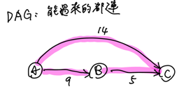

補: TOI 2023 一模 pD

## dijkstra

單源點最短路徑

考慮不帶權的單點源最短路，我們用BFS維護一個 queue，每次處理一個點時最短路徑大小已知，因此只需要拿該點去**更新其他點一次**在**沒有負邊**的假設下，dijkstra 就像是有帶權的BFS。

???+note "dijkstra 模板"
    ```cpp linenums="1"
    vector<int> dijkstra (int start, vector<int>* G) {
        vector<int> dis(n + 1, INF);
        priority_queue<pii, vector<pii>, greater<pii>> pq;
        pq.push({0, start});
        while (pq.size()) {
            auto [x, u] = pq.top();
            pq.pop();
            if (dis[u] != INF) continue;
            dis[u] = x;
            for (auto [v, w] : G[u]) {
                pq.push({w + dis[u], v});
            }
        }
        return dis;
    }
    ```

### 來回

??? note "[zerojudge g733. 110北二4.漫遊高譚市](https://zerojudge.tw/ShowProblem?problemid=g733)"
	給 $n$ 點 $m$ 邊有向圖，邊帶權
	
	另外額外有 $k$ 條無向帶權邊，至多只能走一條這種邊
	
	問 $s\to t$ 的最短路
	
	$n\le 10^4,m+k\le 10^5$
	
	??? note "思路"
		- 給定起點 $s$, 對於每個點 $u$ 找 $dis(s \rightarrow u) + dis(u \rightarrow v)$
		- 正反各做一次，也就是把正圖跟反圖都各做一次 $\texttt{dijkstra}$ 起點都是 $\texttt{s}$

### n 平方

???+note "例題"
	給定 $n$ 個點，第 $i$ 點在 $(x_i,y_i)$，從 $i\to j$ 花費 $(x_i - x_j)^2 + (y_i - y_j)^2$
	
	問從 $s\to t$ 的最小花費


### 多源點 dijkstra

???+note "[zerojudge b904. 10. 學園生活](https://zerojudge.tw/ShowProblem?problemid=b904)"
	給一張 $n$ 點 $m$ 邊的無向圖，與 $k$ 個源點，求這些點兩兩之間的距離最小值
	
	$n,k,m\le 3\times 10^5$

最暴力的想法就是枚舉源點，每次都重跑 dijkstra，複雜度 $O(k E \log⁡E )$

從上面暴力的方法我們可以觀察出，要交會的點或邊一定要是源點們之間的最短路。

每個源點能擴展出他能控制的最短路徑區域，如下圖

<figure markdown>
  { width="300" }
  <figcaption>每個源點擴出自己的範圍</figcaption>
</figure>

範圍重疊的地方代表他們同時是多個源點的最短路徑，這個就是我們可以取的答案，我們可以用一個數字 $x$ 來控制每個範圍最多能擴張多少權重，一旦目前的 $x$ 能使某些個範圍重疊的這個 $x$ 就可以是答案，我們二分搜 $x$ 找到最小的 $x$ 使得範圍有重疊

二分搜的複雜度為 $O(\log ⁡C)$ 其中 $C$ 是值域範圍，每次都需要重新擴張源點的範圍(因為擴張的權重上限被更新了)，為 $O(E \log ⁡E )$ 所以複雜度 $O(E \log⁡ E \log⁡ C )$

但我們真的有需要每次都重新算嗎?

這邊提一個結構叫 shortest path tree 又稱最短路徑樹，每個點 $v$ 都跟自己的最短路徑的上一個點 $u$ 連接，形成一顆樹

我們可以建立最短路徑樹，我們就只需要在樹上 BFS 即可應付每次 x 改變之後的擴張範圍。複雜度 $O(E\log⁡E)$ 建樹，$O(V+E)$ BFS 二分搜 $O(\log ⁡C)$，總共 $O(E \log ⁡E+(V+E)  \log ⁡C)$

但其實到頭來我們只是要看重疊的部分，我們也就同樣的建立最短路徑樹，枚舉 edge 使得 $(u,v)$ 是來自不同的源點，$ans$ 去跟他取 min 即可，複雜度 $O(E \log⁡ E+E) = O(E \log⁡ E) $

<figure markdown>
  { width="300" }
  <figcaption>枚舉重疊邊</figcaption>
</figure>

另解:

對於每個非源點的點都去維護他與最近的兩個「不同的」源點的距離
	
令 $f[u]$ 為 $u$ 的與她最近源點的距離，$g[u]$ 為次近源點的距離，那麼答案就是 $ans =\min⁡(ans,f[u]+g[u])$，至於怎麼建構次短路下面會提到


### shortest path tree

<figure markdown>
  { width="250" }
  <figcaption>shortest path tree 結構</figcaption>
</figure>

???+note "shortest path tree code"
	```cpp linenums="1"
    void build_Tree () {
        fill (par + 1, par + 1 + n, -1);
        for (int i = 1; i <= n; i++) {
            for (auto [v, w] : G[u]) {
                if (dis[v] == dis[u] + w) {
                    par[v] = u;
                }
            }
        }
        for (int i = 1; i < n; i++) {
            if (par[i] != -1) {
                D[par[i]].push_back(i);
            }
        }
    }
    ```

這邊帶一個相關的題目

???+note "[LOJ #3255. 「JOI 2020 Final」奥运公交](https://loj.ac/p/3255)"
    给 $n$ 點 $m$ 邊的有向圖
    
    每個邊 ($u_i,v_i,c_i,d_i$) 代表邊連接 $(u_i,v_i)$，邊權是 $c_i$
    
    你最多可以翻轉一條邊，翻轉代價是該條邊的 $d_i$
    
    求從 $1$ 走到 $n$ 再走回 $1$ 的最小 cost
    
    $n \leq 200,m \leq 5 \times 10^4$
    ??? note "思路"
    	- 若翻轉的邊在 shortest path tree 上
    		- 因為邊被刪掉了，整顆 tree 就要重算
    		- $1 \to u \to v \to n$
    		- 你可以從 $1 \to u$ 但這之後要走哪一條? (已經沒有 $u \to v$ 了)
    
    	- 若翻轉的邊不在 shortest path tree 上
    		- 不經過邊: 原來的答案
    		- 要經過邊 $1 \to v \to u \to n \to 1$ 或 $1 \to n \to v \to u \to 1$
    
    	- 我們只需要邊在 tree 上時再從新算一次 dijkstra
    		- $O(n^3)$
    		- $O(n)$ 樹上最多 $n - 1$ 條邊
    		- $O(n^2)$ 暴力 dijkstra


### shortest path DAG

<figure markdown>
  { width="300" }
  <figcaption>shortest path DAG結構</figcaption>
</figure>

???+note "shortest path DAG code"
	```cpp linenums="1"
	void build_DAG() {
        for (int u = 1; u <= n; u++) {
            for (auto [v, w] : G[u]) {
                if (dis[v] == dis[u] + w) {
                    D[u].push_back(v);
                    in[v]++;
                }
            }
        }
    }
    ```
	
???+note "[LOJ #2350. 「JOI 2018 Final」月票购买](https://loj.ac/p/2350)"
	給一張雙向圖和 $s,t,u,v$，從 $s$ 到 $t$ 選一條**最短路徑**，將其邊權都設為 $0$
	
	問 $u$ 到 $v$ 的最短路徑最小可以是多少
	
	??? note "思路"
		- 若有重疊，設重疊為 $x\to \ldots \to y$
			- $ans=dis(u,x)+dis(y,v) \texttt{ or } dis(u,y)+dis(x,v)$
			- 記得跟 $dis(u,v)$ 取 min
	
		- 用 shortest path DAG 上枚舉 $x$ 用 dp 得到 $y$
			- DFS on DAG
			- $f[x]=$ topo sort 在 $x$ 之後的點的 $dis(v,y)$ 最小的 $y$
	
		- 同理用 shortest path DAG 找 $g[x]=$topo sort 在 $x$ 之後的點 $dis(u,y)$ 最小的 $y$
	
		- $ans=\min(dis(u,x)+f[x],dis(v,x)+g[x],dis(u,v))$  
	
	??? note "code"
		```cpp linenums="1"
		void dfs (int u) {
	        if (vis[u]) return;
	        vis[u] = 1;
	        f[u] = dV[u], g[u] = dU[u];
	        for (int i = head[u]; i; i = edge[i].next) {
	            int v = edge[i].to;
	            if (dS[u] + dT[v] + edge[i].len > dS[T]) continue;
	            dfs (v);
	            f[u] = min (f[u], f[v]), g[u] = min (g[u], g[v]);
	        }
	        ans = min ({ans, f[u] + dU[u], g[u] + dV[u]});
	    }
	    ```

???+note "[LOJ #2344. 「JOI 2016 Final」铁路票价](https://loj.ac/p/2344)"
    給你一個 $n$ 點 $m$ 邊的無向圖，邊權都是 $1$，$q$ 個操作
    
    - $\text{change}(i,2):$ 將第 $i$ 條邊邊權變成 $2$
    
    每次操作完問有那些點跟原點的最短路不同
    
    $n\le 10^5,q,m\le 2\times 10^5$
    
    ??? note "思路"
    	- build shortest path DAG
    
        - DFS or BFS 刪邊
    
        - 類似 topo sort，記 $u$ 的 in degree 為 $in_u$，當 $in_u=0$ 時就可以將變大傳遞給 $(u,v)$ 的點 $v$。由於每條邊邊權增加後就不可能出現在shortest path DAG，所以每條邊只需刪除一次
    
        - 複雜度 $O(n+m)$
            - 每個邊最多跑到一次 跑到意即要被刪掉
            - 刪點最多刪 $n$ 個
            - 也就是 topo sort 的複雜度
    
    ??? note "code"
    	```cpp linenums="1"
        void del() {
            q.push(goal);
            while(! q.empty()) {
                int e = q.front(); q.pop();
                if(vis[e]) continue;
                vis[e] = 1;
                int p = v[e]; -- in[p];
                if(in[p] == 0) {
                    ++ ans;
                    for(int i = head[p]; i; i = nxt[i])
                        if(dis[p] + 1 == dis[dot[i]]) q.push(i + 1 >> 1);
                }
            }
        }
        ```

### 分層 dijkstra

???+note "APIO 2023 p1"

???+note "CSES - flight discount 變化"
	輸入一個 $n$ 點 $m$ 邊的有向圖，每條邊都有權重 $w(u,v)$
	
	若連續走兩條邊 $a\to b\to c$，本來需花 $w(a,b)+w(b,c)$，使用優惠券可以將花費改成 $w(b,c)\times 2$，優惠券只能用 $k$ 次
	
	問 $1\to n$ 的最小花費

???+note "[2021 附中模競 II 惡地之路](https://drive.google.com/file/d/1ISO-o4DrQmbuqVVAgxeVQEO3ifMvcy01/view)"
	給一張 $n$ 點 $m$ 邊無向圖，令 $s$ 到節點 $i$ 走 $k$ 步的最短距離是 $d(i,k)$
	
	對於每個 $i$ 求 $\min \{ d(i,k) \times k \}$
	
	$n\le 2000,m\le 3\times 10^4$
	
	??? note "思路"
	
		此方法並非滿分解，滿分解在<a href="/wiki/graph/Tree/#_1" target="_blank">這裡</a>
		
		---
		
		把每個節點都複製 $n$ 份
		
		如果本來有一條邊是 $(u,v)$，那就對所有 $1\le i < n$ 蓋
		
		- $u$ 的第 $i$ 個點到 $v$ 的第 $i+1$ 個點（有向）
		- $v$ 的第 $i$ 到 $u$ 的第 $i+1$ 個點（有向）
	
		這樣走到某個節點的第 $i$ 個點的路徑長度一定是 $i-1$
		
		$n^2$ 個點，$2nm$ 個邊做最短路徑，$O(nm\log⁡ nm)$
		
		枚舉 $k=1\ldots n$，對於第 $k$ 層拉出來求最小的 $dis_k$ 
		
		$$ans = \min\limits_{k=1\ldots n} \{dis_k\times k\}$$

???+note "[CSES - flight discount](https://cses.fi/problemset/task/1195)"
	給一張 $n$ 點 $m$ 邊的無向圖，邊有權重，可將其中 $k$ 條邊以半價計算，求 $1\to n$ 的最短路
	
	$n\le 10^5,m\le 2\times 10^5$
	
	??? note "思路"
		原本 graph 有 $n$ 的點，變成一個圖有 $kn$ 個點的新 graph
		
		$\texttt{node}(k, u)$ 到 $\texttt{node}(k, v)$ 的長度就是 $w(u, v)$
		
		$\texttt{node}(k-1, u)$ 到 $\texttt{node}(k, v)$ 的長度就是 $w(u, v)/2$
		
		直接跑 Dijkstra，起點 $\texttt{node}(0, 1)$ 終點 $\texttt{node}(2, n)$

### 次短路

-  先做一次 $\texttt{dijkstra}$

-  令 $f(i)$ 為 $i$ 這個 $\texttt{node}$ 的最短路徑

-  令 $g(i)$ 為 $i$ 這個 $\texttt{node}$ 的次短路徑

-  $\texttt{dijkstra}$ 的精神就是從最小的點開始擴散 (轉移)

-  這邊的想法也一樣
    -  一定有某一個 $\texttt{node}$ 的 $g(i)$ 是不從 $g(j)$ 轉移的，而是從周圍 $f(i)$ 的轉移
    -  確定這個點之後就可以開始類似 $\texttt{dijkstra}$ 從該點開始轉移出去
    -  $g(u)= \sec \begin{cases} f(v) + w(u, v) \\ g(v) + w(u, v) \end{cases}$

- 步驟
    - 一般的 $\texttt{dijkstra}$ 得到 $f(u)$
    - $g(u)= \sec \begin{cases} f(v) + w(u, v)\end{cases}$
    - 每次找最小的 $g(u)$ 來更新其他人的 $g(v)$ (如下)
    - $g(v)= \sec \begin{cases} f(u) + w(u, v) \\ g(u)+w(u,v) \end{cases}$

??? note "次短路 code"
	```cpp linenums="1"
    void dijkstra (int start) {
        vector<int> f (n + 1, INF);
        f[start] = 0;

        // 最短路徑
        for (int i = 1; i <= n; i++) {
            int u = find1 (f);
    
            for (int j = 0; j < G[u].size(); j++) {
                int v = G[u][j].F, w = G[u][j].S;
                f[v] = min (f[v], f[u] + w);
            }
        }
    
        vector<pii> g (n + 1);
        for (int i = 1; i <= n; i++) {
            g[i] = mk(f[i], -1);
        }
    
        for (int i = 1; i <= n; i++) {
            for (int j = 0; j < G[i].size(); j++) {
                int v = G[i][j].F, w = G[i][j].S;
                sec (g[v], f[i] + w);
            }
        }
    
        memset (vis, 0, sizeof (vis));
        for (int i = 1; i <= n; i++) {
            int u = find2 (g);
            if (u == -1) break;
    
            for (int j = 0; j < G[u].size(); j++) {
                int v = G[u][j].F, w = G[u][j].S;
                sec (g[v], g[u].S + w);
            }
        }
    
        cout << g[n].S << "\n";
    }
    ```

## K 短路

> $\texttt{dijkstra}$ 正確性證明

> 你把狀態 $w$ 推出去的時候 狀態 $<w$ 都已經推出去了

> 所以當 $w$ 被推出去的時候 就保證是最佳解

- 從上面的次短路延伸

- 假設 $v_1,..,v_r$ 都可以走到 $u$

$$
\small
dis(u,k)=k\texttt{-th} \begin{cases} dis(v_1,0)+w(u,v_1), dis(v_1,1)+w(u,v_1),..,dis(v_1,k)+w(u,v_1) \\ dis(v_2,0)+w(u,v_2), dis(v_2,1)+w(u,v_2),..,dis(v_2,k)+w(u,v_2) \\ 
\vdots \\
dis(v_r,0)+w(u,v_r), dis(v_r,1)+w(u,v_r),..,dis(v_r,k)+w(u,v_r)\end{cases}$$

- 但怎麼求 $k\texttt{-th}$ ?

- 只要把每種可能的狀態更新直到 $u$ 這個點足夠 $k$ 個狀態為止
    - 過程中 $\texttt{sort}$ 維護前幾大

??? note "K 短路 code"
	```cpp linenums="1"
	signed main() {
        ios::sync_with_stdio(0);
        cin.tie(0);
        cin >> n >> m >> k;

        for (int i = 0, u, v, w; i < m; i++) {
            cin >> u >> v >> w;
            G[u].push_back({w, v});
        }
    
        vector<vector<int>> dis(n + 1, vector<int>(k));
    
        for (int i = 1; i <= n; i++) {
            for (int j = 0; j < k; j++) dis[i][j] = INF;
        }
    
        priority_queue<pair<int, int>, vector<pair<int, int>>,
       				   greater<pair<int, int>>> pq;
        pq.push({0, 1});
    
        while (pq.size()) {
            int u = pq.top().second;
            int d = pq.top().first;
            pq.pop();
    
            if (dis[u][k - 1] < d) continue;
    
            for (auto [w, v] : G[u]) {
                if (d + w < dis[v][k - 1]) {
                    dis[v][k - 1] = d + w;
                    pq.push({dis[v][k - 1], v}); // 塞到 .back
                    sort(dis[v].begin(), dis[v].end());
                }
            }
        }
    
        for (int i = 0; i < k; i++)
            cout << dis[n][i] << " ";
    
    }
    ```

## Bellman Ford

???+note "Bellman Ford code"
	```cpp linenums="1"
    void solve () {
        vector<int> d(n, INF);
        d[v] = 0;
        for (int i = 0; i < n - 1; ++i)
            for (Edge e : edges)
                if (d[e.a] < INF)
                    d[e.b] = min(d[e.b], d[e.a] + e.cost);
    }
    ```

### Bellman Ford on DAG

- 將邊按照 topo sort

- 用這個順序去 relax

- 複雜度線性時間 $O(V+E)$

- DAG DP

???+note "2022 北一區早上場 p3"
	給一張 $n$ 點 $m$ 邊無向圖，邊有權重
	
	使每個邊權都減 $x$，目標是讓沒有一個環的權重總和超過 $0$，求最小整數 $x$
	
	$n\times m \le 3\times 10^7,|w_i|\le 1000$
	
	??? note "思路"
		我們將邊權都 `*= -1`，這樣我們就只要找到 $x$ 使得邊權都 $+x$ 之後沒有負環，$x$ 具有單調性可以二分搜

## SPFA

- shortest path Finding algorithm，單源最短路

- Bellman Ford 的優化版本

- 每回合只更新「前一回合有被鬆弛」的點相鄰的邊，實作上類似 dijkstra

??? note "SPFA code"
	```cpp linenums="1"
	// 如果上一輪某一個點的距離沒有更新,那這一輪也沒必要 relax 他
	// 把距離有更新的節點丟進 queue 裡,然後一直拿 queue 裡的節點出來 relax
	void SPFA (int start, int G) {
        vector<int> dis(n + 1, INF);
        vector<int> inq(n + 1, INF);
        vector<int> cnt(n + 1);
        queue<int> q;
        while (q.size()) {
            int u = q.front();
            q.pop();
            cnt[u]++;
            if (cnt[u] == n) {
                // negative cycle
            }
            inq[u] = false;
            for (auto [v, w] : G[u]) {
                dis[u] = dis[v] + w;
                if (!inq[v]) {
                    inq[v] = true;
                    q.push(v);
                }
            }
        }
    }
    ```

- 大多數情況下 SPFA 跑得很快，平均 $O(V+E)$
- 但其最壞情況下的時間複雜度為 $O(VE)$
	- 將其卡到這個複雜度也是不難的，實用性不高

## Floyd warshall 

???+note "[zerojudge b686. 6. 航線規劃](https://zerojudge.tw/ShowProblem?problemid=b686)"
	
	??? note "思路"
		
	??? note "code"
		```cpp linenums="1"
		sort (A.rbegin(), A.rend()); // 防禦力大到小
	    sort (query.rbegin(), query.rend()); // 破壞力大到小
	
	    for (int q = 1; q <= query.size(); q++) {
	        int w = query[q];
	
	        // floyd 中繼點並非一次全部更新, 而是要得才更新
	        for (int k = 1; A[k] > w; k++) {
	           for (int i = 1; i <= n; i++) {
	               for (int j = 1; j <= n; j++) {
	                   d[i][j] = max (d[i][j], d[i][k] + d[k][j]);
	               }
	           } 
	        }
	    }
	    ```

???+note "[CF 1051 F.The Shortest Statement](https://codeforces.com/problemset/problem/1051/F)"
	給一個 $n$ 點 $m$ 邊的無向圖，$q$ 筆詢問 :
	
	- $s_i\to t_i$ 的最短路徑
	
	$n,m,q\le 10^5,m-n\le 20$

???+note "[CSA Chromatic Number](https://csacademy.com/contest/archive/task/chromatic-number)"


	
