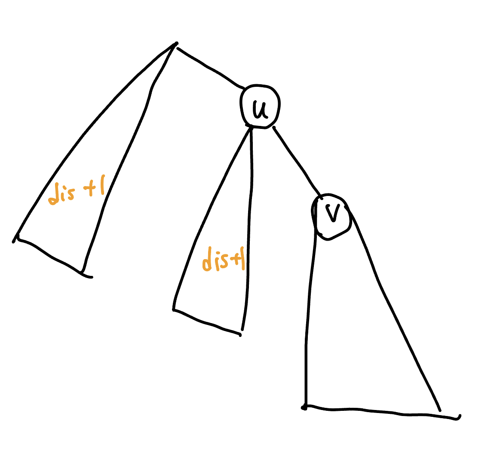

## 換根 DP
- 又稱全方位木 DP，solving for all roots

???+note "<a href="/wiki/graph/images/403 . 樹直徑.html" target="_blank">2023 IOIC 403 .樹直徑</a>"
	有一棵 $N$ 個點的樹
	
	進行如下操作**一次**：砍掉樹上的其中一條邊，再另外加上一條邊回去使其保持連通。
	
	可以透過這個操作讓樹直徑最小為何？
	
	$N\le 5\times 10^5$
	
	??? note "code"
		```cpp linenums="1"
		void diameter_fa(int u, int par) {
	        for (int v : adj[u]) {
	            if (v == par) continue;
	            // 斷邊 (u, v)，u 以上含 u 的連通塊的答案
	
	            // 清除 v 在 ans(u) 的貢獻
	            erase_one(ch_dp[u], dp_ch[v]);
	            erase_one(ch_hei[u], hei[v] + 1);
	
	            // 計算答案 max (樹直徑, 往上或往下的最大高度+往上或往下的次小高度)
	            dp_fa[v] = mav(*rbegin(ch_dp[u]), *rbegin(ch_hei[u]) + *nevt(rbegin(ch_hei[u])));
	
	            ch_dp[v].insert(dp_fa[v]);
	            // 由 v -> u -> ... 往上的最大高度
	            ch_hei[v].insert(*rbegin(ch_hei[u]) + 1);
	
	            // 加回 v 在 ans(u) 的貢獻
	            ch_dp[u].insert(dp_ch[v]);
	            ch_hei[u].insert(hei[v] + 1);
	
	            diameter_fa(v, u);
	        }
	    }
		```

???+note "[CF 1029F Tree with Maximum Cost](https://codeforces.com/contest/1092/problem/F)"
	求 $\max \limits_{v=1... n} \{\space \sum\limits_{i = 1}^{n} dist(i, v) \cdot a_i \space \}$
	
	$n,a_i\le 2\times 10^5$

???+note "[Balkan OI 2017 City Attractions ](https://www.acmicpc.net/problem/14875)"
	給一 $N$ 個點的顆樹，有一個人第一天在 $1$ 這個節點
	
	每天他會從昨天停下來的點 $x$ 走到點 $y$
	
	$y$ 滿足 $y\neq x$ 且 $a_y-\text{dis}(x,y)$ 是最小的，若這樣還是有多個 $y$ 就選 index 最小的
	
	問第 $K$ 天會在哪個點停下
	
	$N\le 3\times 10^5,K\le 10^{18},a_i\le 10^9$
	
	??? note "思路"
		我們只要預處理好對於每個 $x$ 他會走到的 $y$ 就可以用倍增法找第 $K$ 天的結果
		
		所以我們來看要如何預處理
		
		直接換根 dp
		
		<figure markdown>
	      { width="300" }
	    </figure>
	    
	    細節與實作可參考[這篇 USACO 博客](https://usaco.guide/problems/balkan-oi-2017city-attractions/solution)
	

???+note "[Atcoder Educational DP Contest V - Subtree](https://atcoder.jp/contests/dp/tasks/dp_v)"
	給你一個無向圖，問說在裡面的一些點圖黑色，其他點圖白色，且在圖黑色的點要連通
	
	這種圖法有幾種
	
	??? note "思路"
		- <https://hackmd.io/mcmDUAthQTqKmP3nLZDXXg>

## 樹 DP

???+note "[hackerrank kingdom division](https://www.hackerrank.com/challenges/kingdom-division/problem)"
	給一個 tree 每個點可以圖黑色或白色，但是同一個顏色要至少兩個以上相鄰，只要至少有兩個相鄰，要分成幾個區塊都 ok
	
	??? note "思路"
		- <https://hackmd.io/AUw7lai3S2WM7WLDvQwwtA>

???+note "[CF 461B Appleman and Tree](https://codeforces.com/problemset/problem/461/B)"
	給一棵 $n$ 個點的樹，每個點是白色或者黑色，問有多少種方案能夠通過去掉一些邊，使每個聯通塊中只有一個黑色的點
	
	$n\le 10^5$
	
	??? note "思路"
		$dp[u][0/1]:$ 當前 $u$ 所在的連通塊有 $0/1$ 個黑點的切邊方法數
		
		技巧 : 利用之前的狀態合併
		
		```cpp linenums="1"
		void dfs (int u, int par) {
	        if (a[u]) dp[u][1] = 1;
	        else dp[u][0] = 1;
	        for (auto v : G[u]) {
	            if (v == par) continue;
	            dfs (v, u);
	
	            dp[u][1] = ((dp[u][1] * (dp[v][0] + dp[v][1])) % M 
	            			+ (dp[u][0] * dp[v][1]) % M) % M;
	            dp[u][0] = (dp[u][0] * (dp[v][0] + dp[v][1])) % M;
	        }
	    }
	    ```

???+note "[2020 TOI pB.建設人工島](https://tioj.ck.tp.edu.tw/problems/2189)"
	給 $n$ 個點，邊有權重的樹，求嚴格次長樹直徑
	
	$n\le 10^5$
	
	??? note "code"
		```cpp linenums="1"
		#include <bits/stdc++.h>
	    #define int long long
	    #define pii pair<int, int>
	    #define pb push_back
	    #define mk make_pair
	    #define F first
	    #define S second
	    using namespace std;
	
	    const int INF = 2e18;
	    const int maxn = 1e5 + 5;
	    const int M = 1e9 + 7;
	
	    struct Eg {
	        int v, w;
	    };
	
	    struct node {
	        int mx, sec;
	    };
	
	    int n, m;
	    vector<Eg> G[maxn];
	    vector<node> dp(maxn);
	    int vis[maxn];
	    node ans;
	
	    void cal (int val, node &x) {
	        if (x.mx < val) x.sec = x.mx, x.mx = val;
	        else if (val != x.mx && x.sec < val) x.sec = val;
	    }
	
	    void dfs (int u) {
	        vis[u] = true;
	        for (auto [v, w] : G[u]) {  
	            if (vis[v] == 1) continue;
	
	            dfs (v);
	            // ans 的轉移式
	            cal (dp[v].mx + dp[u].mx + w, ans);
	            cal (dp[v].mx + dp[u].sec + w, ans);
	            cal (dp[u].mx + dp[v].sec + w, ans);
	            // 沒有 u.sec + v.sec 因為她一定會比其他的小(成為第三名)
	
	            // 把 v 的鏈更新 u.mx, u.sec
	            cal (dp[v].mx + w, dp[u]);
	            cal (dp[v].sec + w, dp[u]);
	        }
	    }
	
	    void init() {
	        cin >> n;
	        int u, v, w;
	        for (int i = 1; i <= n - 1; i++) {
	            cin >> u >> v >> w;
	            u++, v++;
	            G[u].pb({v, w});
	            G[v].pb({u, w});
	        }
	    }
	
	    void solve() {
	        dfs (1);
	        cout << ans.sec << "\n";
	    } 
	
	    signed main() {
	        // ios::sync_with_stdio(0);
	        // cin.tie(0);
	        int t = 1;
	        //cin >> t;
	        while (t--) {
	            init();
	            solve();
	        }
	    } 
	    ```

## 其他類型

???+note "[2021 附中模競 II 惡地之路](https://drive.google.com/file/d/1ISO-o4DrQmbuqVVAgxeVQEO3ifMvcy01/view)"
	給一張 $n$ 點 $m$ 邊無向圖，令 $s$ 到節點 $i$ 走 $k$ 步的最短距離是 $d(i,k)$
	
	對於每個 $i$ 求 $\min \{ d(i,k) \times k \}$
	
	$n\le 2000,m\le 3\times 10^4$
		

???+note "[LOJ #2780. 「BalticOI 2016 Day1」上司们](https://loj.ac/p/2780)"
	給一顆 $n$ 個點的樹
	
	每個點給定大小為 $k_i$ 的一些點表示第 $i$ 個點可選的父節點，每個點有一個權重 $a_i$ 
	
	對於 $u=1\sim n$，若 $u$ 的小孩是 $v$，則須滿足 : $\sum a_v < a_u$
	
	輸出 $\sum\limits_{i=1}^n a_i$ 最小可以是多少
	
	$n\le 5000, \sum\limits_{i=1}^n k_i \le 10^4$
	
	??? note "提示"
		cost 的計算有什麼性質 ? (每個點的貢獻會被哪些點重複計算 ?)
	
	??? note "思路"
		我們先觀察 cost 的計算方式
		
		每個點的貢獻都會被他的父親給計算到一次，父親的父親又會算到一次，...
		
		所以其實每個點會被重複算到的就是 $u\to\ldots \to rt$ 這條 path
		
		<figure markdown>
	      { width="200" }
	    </figure>
	    
	    而每個點須滿足 $\sum a_v < a_u$ 可以看做是 $a_u = \sum a_v + 1$
	    
	    又可以想成這個 $+1$ 是「自己」的貢獻
	    
	    所以事實上每個點的貢獻就是 
	    
	    $1\times$ 到 root 的距離 = root 的距離 = 該節點的深度
	    
	    所以 cost = 所有節點的深度總和
	    
	    ---
	    
	    在來我們考慮將題目的 $k_i$ 「反向建邊」，也就是若 $v$ 的父親可以是 $u$，則建邊 $u \to v$
	    
	    <figure markdown>
	      { width="200" }
	      <figcaption>依照題目範測反向建邊得出來的圖</figcaption>
	    </figure>
	    
	    這樣的好處就是我們可以直接枚舉起點，往下遞迴，計算答案
	    
	    至於要怎麼最小化答案呢，因為要使深度總和最小化，代表樹應該要越寬越好
	    
	    也就是 BFS 的順序
	    
	    ---
	    
	    所以實作整理上就是建立反向圖，枚舉起點，BFS 計算答案，在把每個起點算出來的答案取 min
	    
	??? note "code"
		```cpp linenums="1"
		#include <bits/stdc++.h>
	    #define int long long
	    #define pii pair<int, int>
	    #define pb push_back
	    #define mk make_pair
	    #define F first
	    #define S second
	    #define ALL(x) x.begin(), x.end()
	
	    using namespace std;
	    using PQ = priority_queue<int, vector<int>, greater<int>>;
	
	    const int INF = 2e18;
	    const int maxn = 5e6 + 5;
	    const int M = 1e9 + 7;
	
	    int n, m, ans;
	    int dis[maxn];
	    vector<int> G[maxn];
	
	    void init() {
	        cin >> n;
	        int u, v;
	
	        for (int i = 1; i <= n; i++) {
	            cin >> m;
	
	            while (m--) {
	                cin >> u;
	                G[u].pb(i);
	            }
	        }
	
	        ans = INF;
	    }
	
	    void bfs(int st) {
	        fill(dis, dis + n + 1, 0);
	        queue<int> q;
	        q.push(st);
	        dis[st] = 1;
	
	        while (q.size()) {
	            int u = q.front();
	            q.pop();
	
	            for (auto v : G[u]) {
	                if (dis[v])
	                    continue;
	
	                dis[v] = dis[u] + 1;
	                q.push(v);
	            }
	        }
	
	        int cost = 0;
	
	        for (int i = 1; i <= n; i++) {
	            if (dis[i] == 0)
	                return;
	
	            cost += dis[i];
	        }
	
	        ans = min(ans, cost);
	    }
	
	    void solve() {
	        for (int i = 1; i <= n; i++) {
	            bfs(i);
	        }
	
	        cout << ans << "\n";
	    }
	
	    signed main() {
	        // ios::sync_with_stdio(0);
	        // cin.tie(0);
	        int t = 1;
	
	        //cin >> t;
	        while (t--) {
	            init();
	            solve();
	        }
	    }
	    ```


???+note "[CSES - Network Renovation](https://cses.fi/problemset/task/1704)"
	給一顆樹，你要加一些邊使不管斷任何一條邊斷掉整張圖還是連通的
	
	問最少斷幾條邊，並且輸出任意一組解
	
	class 17 

???+note "[2023 TOI 模擬賽第三場 pE](http://127.0.0.1:8000/wiki/cp/contest/images/TOI-2023-3.pdf#page=11)"
	待補

???+note "[洛谷 P3441 [POI2006]MET-Subway](https://www.luogu.com.cn/problem/P3441)"
	在一棵 $n$ 個點的樹上選出 $k$ 條可相交的 path 使得被覆蓋的點數最多，求該最大值
	
	$k\le n\le 10^6$
	
	??? note "思路"
		假如選了 $u\to \ldots rt \to \ldots \to v$ 可以看做從 $u\to \ldots \to rt,rt\to \ldots \to v$ 的兩條 path
		
		所以問題就變成
		
		> 選 $2k$ 條 $u\to \ldots \to rt$ 的 path 使得被覆蓋的點數最多
		
		我們可以拆成一層一層來看，第 $i$ 層的節點數量一定 $\le$ 第 $i+1$ 層的節點數量
		
		- 若第 $i$ 層節點數量 $\le 2k$ 那一定可以都可以被覆蓋到
		- 若第 $i$ 層節點數量 $> 2k$ 那我們就只能選 $2k$ 個覆蓋
	
		所以答案就是 $\sum \limits_{i=1}^{\text{depth}}\min \{2k, \text{num}_i\}$ 其中 $\text{num}_i$ 是第 $i$ 層的節點數量

???+note "[洛谷 P8384 [POI2004] SZN](https://www.luogu.com.cn/problem/P8384)"
	給一顆 $n$ 個點的樹
	
	問至少要用幾條不重疊的 path 才能將圖覆蓋，並且這些 path 裡面長度最長的最少可以是多少
	
	$n\le 10^4$


- <https://usaco.guide/gold/all-roots?lang=cpp>

## 利用 dfs 序

- [CF 1065F](https://codeforces.com/problemset/problem/1065/F)

???+note "[2021 全國賽模擬賽 pF. 地洞遊戲](https://tioj.ck.tp.edu.tw/pmisc/pre-nhspc-2021-statements/Cave.pdf)"
	給定一棵 $N$ 點的有根樹，邊是由根往底下連的
	
	葉節點都有一條新的有向邊連接 $u\to a_u$，其中 $a_u$ 一定是 $1\to \ldots \to u$ 中的一點
	
	同一個葉節點不能 visit 超過一次
	
	從節點 $1$ 出發，問是否能 visit 所有葉節點，構造任意一組葉節點的 visit 順序
	
	$N \le 3\times 10^5$
	
	<figure markdown>
      { width="200" }
      <figcaption>例如此圖的順序就是 $5\to 4\to 2$</figcaption>
    </figure>

	
	??? note "思路"
		[重要性質] : 若存在至少一組合法解，則必存在一組合法解使的他是某個dfs序
		
		[引理] : 可以發現對於定根 $u$ 來說，最多只有一個子樹，他的所有葉子走完以後無法回到 $u$ 或他的祖先
		
        使用樹 DP。令 $depth_v$ 為 $v$ 的深度，且令 $dp_u$ 為繞完這棵子樹後可以回到的最淺深度。轉移如下：

        - 如果子樹中有至少兩個 $dp_{son}$ 都大於 $depth_u$，則其中一個繞完以後就回不了另一個了，必定無解。
        
        - 如果子樹中恰有一個 $dp_{son}$ 大於 $depth_u$，則這個子樹要放到最後才走，$dp_u = dp_{son}$
        
        - 如果子樹中沒有 $dp_{son}$ 大於 $depth_u$，則任意一個子樹都能當最後一個走到的，由於我們要深度最淺的，因此 $dp_u$ 就是所有 $dp_{son}$ 的最小值

		構造的話找出就直接去 dfs，在過程中先去 dfs 合法的子樹，再去 dfs 不合法的
		
		合法的子樹內的順序可以任意
		
		```cpp
		void dfs (int u) {
			if (u is leaf) print (u);
			
			int last = -1;
			for (auto v : G[u]) {
				if (v is legal) dfs (v);
				else last = v;
			}
			
			if (last == -1) continue;
			
			dfs (last);
		}
		```
		
## 樹上背包

???+note "[CF 440D Berland Federalization](https://codeforces.com/problemset/problem/440/D)"
	給你一棵 $n$ 個點的樹，現在要你刪除盡可能少的邊，使得剩餘一個節點數剛好為 $k$ 的子樹
	
	你需要輸出節點數和刪除的邊的編號
	
	$n,k\le 400$
	
	??? note "思路"
		樹上背包

## 樹上啟發式合併

???+note "[CSES Distinct Colors](https://cses.fi/problemset/task/1139/)"
	給出一棵 $n$ 個節點以 $1$ 為根的樹，節點 $u$ 的顏色為 $c_u$
	
	現在對於每個點 $u$ 問 $u$ 的子樹裡一共出現了多少種不同的顏色。
	
	$n\le 2\times 10^5$
	
	??? note "code"
		```cpp linenums="1"
		#include <bits/stdc++.h>
	    #define int long long
	    #define pii pair<int, int>
	    #define pb push_back
	    #define mk make_pair
	    #define F first
	    #define S second
	    #define ALL(x) x.begin(), x.end()
	
	    using namespace std;
	
	    const int INF = (1LL << 60);
	    const int maxn = 3e5 + 5;
	    const int M = 1e9 + 7;
	
	    int n;
	    int a[maxn];
	    vector<int> G[maxn];
	    set<int> S[maxn];
	    int ans[maxn];
	
	    void dfs (int u, int par) {
	        if (G[u].size() == 1 && u != 1) {
	            ans[u] = 1;
	            S[u].insert (a[u]);
	            return;
	        }
	
	        int mx = -1;
	        for (auto v : G[u]) {
	            if (v == par) continue;
	            dfs (v, u);
	            if (mx == -1) mx = v;
	            else if (S[mx].size() < S[v].size()) mx = v;
	        }
	        set<int> &t = S[mx];
	        for (auto v : G[u]) {
	            if (v == par || v == mx) continue;
	            for (auto ele : S[v]) t.insert (ele);
	            S[v].clear();
	        }
	        t.insert (a[u]);
	        ans[u] = t.size();
	        swap (t, S[u]);
	    }
	
	    void init () {
	        cin >> n;
	        for (int i = 1; i <= n; i++) cin >> a[i];
	        int u, v;
	        for (int i = 0; i < n - 1; i ++) {
	            cin >> u >> v;
	            G[u].pb(v);
	            G[v].pb(u);
	        }
	    }
	
	    void solve () {
	        dfs (1, 0);
	        for (int i = 1; i <= n; i++) cout << ans[i] << " ";
	    }
	
	    signed main() {
	        // ios::sync_with_stdio(0);
	        // cin.tie(0);
	        int t = 1;
	        // cin >> t;
	        while (t--) {
	            init();
	            solve();
	        }
	    } 
	    ```

???+note "[CF 600E Lomsat gelral](https://codeforces.com/problemset/problem/600/E)"
	給一顆大小為 $n$ 的有根樹，每個節點 $i$ 的顏色是 $c_i$
	
	對於每個子樹，求出其出現次數最多的顏色，如果有幾個出現次數一樣的顏色，把他們加起來
	
	$c_i\le n \le 10^5$

???+note "[USACO 2020 Open Gold p2. Favorite Colors](http://www.usaco.org/index.php?page=viewproblem2&cpid=1042)"
	給一張 $N$ 點 $M$ 邊有向圖，點編號為 $1\ldots N$，每種顏色也可以用 $1\ldots N$ 中的一個整數表示
	
	若 $u\to \{v_1,v_2,\ldots, v_k \}$ 的話 $\{v_1,v_2,\ldots, v_k \}$ 的顏色都要一樣
	
	求 $i=1\ldots N$ 的顏色分配，使得 distinct color 最大
	
	若有多組解，輸出字典序最小的
	
	$N,M\le 2\times 10^5$
	
	??? note "思路"
		我們先決定好每個點是哪一組 (也就是不管字典序)，最後再從 $1\ldots N$ 依序分配
		
		若 $a\to \{b,c\}$ 代表 $b,c$ 的顏色需相同
		
		假如 $b\to \{v_b \}, c \to \{v_c\}$，$v_b$ 與 $v_c$ 的顏色也要相同
		
		所以我們利用類似 topo sort 的作法，依序將顏色相同的點 merge 成一組
		
		在 merge 兩個集合的過程採用啟發式合併
		
		詳見代碼
		
	??? note "code (by USACO)"
		```cpp linenums="1"
		#include <bits/stdc++.h>
	    using namespace std;
	
	    void setIO(string s) {
	        ios_base::sync_with_stdio(0); cin.tie(0); 
	        freopen((s+".in").c_str(),"r",stdin);
	        freopen((s+".out").c_str(),"w",stdout);
	    }
	
	    const int MX = 2e5+5;
	
	    int N,M;
	
	    int par[MX],cnt[MX];
	    vector<int> adj[MX], rpar[MX];
	    queue<int> q; 
	
	    void merge(int a, int b) {
	        a = par[a], b = par[b]; 
	        if (rpar[a].size() < rpar[b].size()) swap(a,b);
	        for (int t: rpar[b]) { par[t] = a; rpar[a].push_back(t); }
	        adj[a].insert(end(adj[a]),begin(adj[b]),end(adj[b])); 
	        adj[b].clear();
	        if (adj[a].size() > 1) q.push(a);
	    }
	
	    int main() { 
	        setIO("fcolor");
	        cin >> N >> M;
	        for (int i = 0; i < M; ++i) {
	            int a,b; cin >> a >> b;
	            adj[a].push_back(b);
	        }
	        for (int i = 1; i <= N; ++i) {
	            par[i] = i; rpar[i].push_back(i);
	            if (adj[i].size() > 1) q.push(i);
	        }
	        while (q.size()) {
	            int x = q.front(); if (adj[x].size() <= 1) { q.pop(); continue; }
	            int a = adj[x].back(); adj[x].pop_back();
	            if (par[a] == par[adj[x].back()]) continue;
	            merge(a,adj[x].back());
	        }
	        int co = 0;
	        for (int i = 1; i <= N; ++i) {
	            if (!cnt[par[i]]) cnt[par[i]] = ++co;
	            cout << cnt[par[i]] << "\n";
	        }
	    }
	    ```

## 類 topo sort

???+note "[2014 全國賽 p4](https://cs.cysh.cy.edu.tw/competition_problem_set/%E5%85%A8%E5%9C%8B103.pdf#page=9)"
	給一顆邊有權重的樹，選一個連通塊，連通塊內所有的邊權總和不能超過 $L$
	
	問所有「沒被選到的點」到「有被選到的點」的最短距離最大的，最少可以是多少
	
	<figure markdown>
	  { width="300" }
	</figure>
	
	$n\le 10^6,L\le 2\times 10^8$


	??? note "思路"
		顯然我們沒辦法去直接維護要選那些邊作為連通塊會是 optimal 的
		
		那不如反著做 ?
		
		一開始我們把全部的邊都選起來
		
		慢慢從 leaf 開始移除，每次移除時要選擇對答案影響最小的，直到當前未移除的連通塊的邊權總和 $\le L$
		
		過程利用 pq 維護
		
???+note "[2015 全國賽 p5](https://tioj.ck.tp.edu.tw/problems/1915)"
	

## DP

???+note "[2014 全國賽 p3](https://cs.cysh.cy.edu.tw/competition_problem_set/%E5%85%A8%E5%9C%8B103.pdf#page=7)"
	給 $n$ 個關卡，跟一個集合點
	
	關卡 $i$ 有一條有向邊連接著關卡 $i+1$，邊權是 $c_i$
	
	集合點與每個關卡 $i$ 之間都有一條雙向邊，邊權是 $d_i$
	
	每個關卡上都有價值 $p_i$，拿過了就會消失
	
	<figure markdown>
	  { width="300" }
	</figure>
	
	給你 $R$ 個士兵，一個士兵只能從集合點出發繞過一些路徑回到集合點，且走過的邊權總和不能超過 $B$，問這些士兵最大可取得的價值總合為多少
	
	$R\le n\le 2000,B\le 10^6$
	
	??? note "思路"
		我們考慮 dp
		
		令 $dp(i,j)$ 關卡 $1\sim i$，派出 $j$ 個人可獲得的最大價值
		
		$$dp(i,j)=\max\limits_{k=1\sim i} \begin{cases}dp(i-1, j)+\text{cost}(i)\\ dp(k-1,j-1)+\text{cost}(k, i) \texttt{ if ok}(k, i) \end{cases}$$
		
		假設 $\texttt{ok}(k, i)$ 是 $O(1)$，dp 的時間就是 $O(n^2)\times O(n)=O(n^3)$
		
		如何改成 $O(1)$ 呢 ?
		
		可以觀察到 $k$ 越小越好，所以我們對於每個 $i$ 直接挑最小合法的 $k$ 即可
		
		所以我們必須先有 $\texttt{ok}(l, r)$ 來判斷說區段合不合法才能來找 $k$
		
		- $a_i:$ 集合點到關卡 $i$ 的 最短距離
			- $a_i=\min \{d_i,a_{i-1}+c_{i-1} \}$
		
		- $b_i:$ 關卡 $i$ 回到集合點的最短距離
			- $b_i=\min \{d_i, b_{i+1}+c_{i+1} \}$
		
		$\texttt{ok}(l, r):a_l+b_r+ \texttt{sum}(c_l,\ldots, c_r)$
		
		利用 $\texttt{ok}(l,r)$ 在 $O(n^2)$ 對於每個 $i$ 預處理最小合法的 $k$

## Greedy
- TOI 2022 pC
???+note "[BOI 2020 B1. Village (Minimum)](https://codeforces.com/contest/1387/problem/B1)"
	給一顆 $N$ 個點的樹
	
	請將每個點 $i$ 移動到 $v_i$ $(i\neq v_i)$，花費為 $\text{dis}(i,v_i)$
	
	構造 $v_1,v_2,\ldots,v_n$，使得花費**最少**
    
    ??? note "思路"
    	先考慮 leaf，leaf 一定至少需要跟他的父親交換，不然他沒其他方可交換了
    	
    	而交換完後在這個 leaf 的數值也就固定了
    	
    	也相當於我們可以直接把這個 leaf 刪掉，接下來就是子問題
    	
    	所以我們得到了一個 greedy 的作法
    	
    	每次找當前的 leaf
    	
    	- 如果沒有交換過，就和父節點交換，並將該 leaf 刪除，ans += 2
    	
    	- 如果 leaf 有交換過，只接就刪掉，ans 維持當前的數字
    	
    	這樣最後有可能還剩一個，隨便找一個相鄰結點再交換一次就好，一樣 ans += 2
    	
    	<figure markdown>
          { width="450" }
          <figcaption>最後還剩一個的例子<caption>
        </figure>
		
		> 參考自 : [hackmd](https://hackmd.io/@E-5gxTGiSByBOKpvsaKa_g/HJDNb1Aev)
		
		---
    	
    	實作方面不需要真的移除 leaf，利用 dfs 讓他從 leaf 開始往上處理即可
    	
    	詳見代碼
    	
    
    ??? note "code"
    	```cpp linenums="1"
    	#include <bits/stdc++.h>
        #define pb push_back
        using namespace std;
        int n;
        int node[100001];
        vector<int> G[100001];
        int ans = 0;

        void dfs (int u, int par) {
            for (auto v : G[u]) {
                if (v != par) dfs(v, u);
            }

            if (node[u] == u) {
                if (u == 1)
                    swap(node[1], node[G[1][0]]);
                else
                    swap(node[u], node[par]);
                ans += 2;
            }
        }

        int main () {
            cin >> n;
            for (int i = 1; i < n; i++) {
                int u, v;
                cin >> u >> v;
                G[u].pb(v);
                G[v].pb(u);
            }

            for (int i = 1; i <= n; i++)
                node[i] = i;

            dfs(1, 0);

            cout << ans << endl;
            for (int i = 1; i <= n; i++)
                cout << node[i] << ' ';
        }
        ```
	
???+note "[BOI 2020 B2. Village (Maximum)](https://codeforces.com/contest/1387/problem/B2)"
	給一顆 $N$ 個點的樹
	
	請將每個點 $i$ 移動到 $v_i$ $(i\neq v_i)$，花費為 $\text{dis}(i,v_i)$
	
	構造 $v_1,v_2,\ldots,v_n$，使得花費**最多**


## Prufer code
- https://oi-wiki.org/graph/prufer/#pr%C3%BCfer-%E5%BA%8F%E5%88%97%E7%9A%84%E6%80%A7%E8%B4%A8
- CSES prufer code
- [nhspc 2022 pG](https://sorahisa-rank.github.io/nhspc-fin/2022/problems.pdf)
## Tree Isomorphism
- CSES
## Euler Tour

- CSES path queries
- subtree queries
- [nhspc 2021 pG](https://tioj.ck.tp.edu.tw/problems/2257)


???+note "[LOJ #3943. 「JOI 2023 Final」训猫](https://loj.ac/p/3943)"
	給你一個 $n$ 個點的樹，每個節點有高度 $h_i$，節點的高度是一個 permutation
	
	有一隻貓現在在 $h_i=n$ 的那個節點上
	
	你可以一直刪點，若刪到貓所在的節點那貓就會移到當前連通塊內高度最高的點
	
	求貓每次移動的距離總和最大可以是多少
	
	??? note "思路"
		假設我們目前的圖長這樣
		
		<figure markdown>
	      { width="400" }
	      <figcaption>$n=14$，藍色的字為每個節點的 $h_i$</figcaption>
	    </figure>
		
		當我們刪掉 $h_i=14$ 的點後，貓可以選擇往三個連通塊的最高點跑，然後執行子問題
		
		假如 $h_i=14$ 的子問題算出來的答案是這樣
		
		<figure markdown>
	      { width="400" }
	    </figure>
	    
	    那麼答案就是 
	    
	    $$ans_u=\max \{ ans_x+\text{dis}(u,x) \}$$ 
	    
	    其中 $x$ 是 $v$ 的連通塊內高度最高的節點
	    
		可是若以此分治，考慮樹是一條 chain，那最糟可達 $O(n^2)$
		
		---
		
		我們依照上面子問題執行的步驟，建一個新的樹
		
		<figure markdown>
	      { width="300" }
	      <figcaption>邊權為兩點間的 distance</figcaption>
	    </figure>
	    
	    那麼整題的答案就是樹高度
	    
	    重點是要怎麼建立這個樹呢 ?
	    
	    我們發現我們每次在做的事情就是一直斷邊，$h_i$ 越小的越晚斷
	    
	    所以我們可以倒著想，我們從 $h_i=1$ 開始，每次 merge 周圍最小的節點
	    
	    再來看看 $h_i=2$ 是否已備 merge 過，若還沒再繼續 merge，以此類推
	    
	    以新圖來看我們在做的事情就是從 leaf 慢慢把樹蓋上去
	    
	    至於要怎麼 merge，我們每個點用 pq(min heap) 維護周圍節點的 $\texttt{pair}(h_i,i)$ 
	    
	    兩個點 merge 起來用啟發式合併，但要注意可能會算到已算過的節點，所以在 pop 的時候檢查此編號是否已經在同一個 DSU 內

