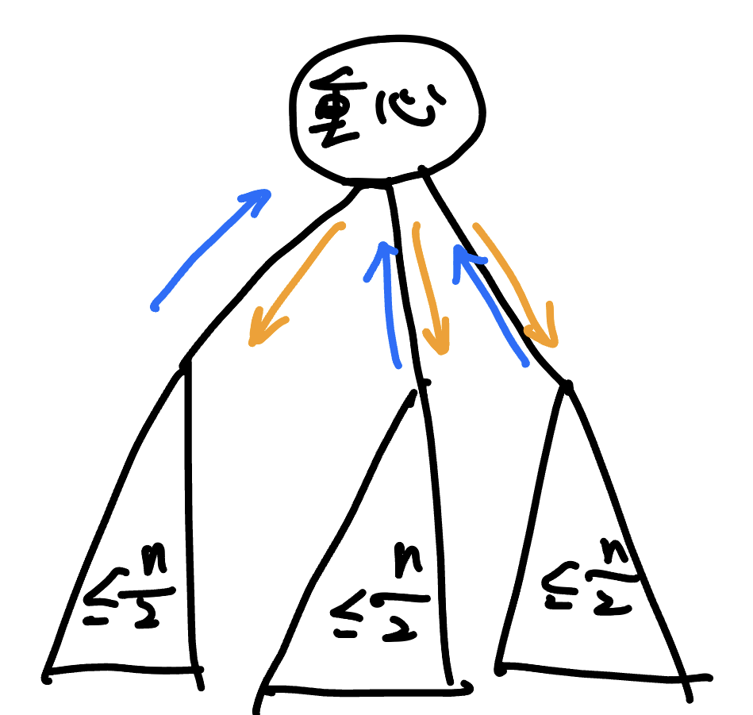

## 換根 DP

又稱全方位木 DP，solving for all roots

???+note "[CSES Tree Distances I](https://cses.fi/problemset/task/1132/)"
	給一顆有 $n$ 個點的樹，對於每個點求該點到其他點的最遠距離
	
	$n\le 2\times 10^5$
	
	??? note "思路"
		> 法 1 : 換根 dp
		
		因為在給 $v$ 計算的時候有可能 $u$ 的最遠距離就在 $v$ 子樹
		
		所以必須維護次遠距離的子樹
		
		??? code "實作"
			```cpp linenums="1"
			#include <bits/stdc++.h>
	        #define int long long
	        using namespace std;
	
	        const int maxn = 2e5 + 5;
	        const int INF = 0x3f3f3f3f;
	        int n;
	        int dp_ch[maxn], dp_fa[maxn], sec[maxn], ans[maxn];
	        vector<int> G[maxn];
	
	        void dfs_ch (int u, int par) {
	            for (auto v : G[u]) {
	                if (v == par) continue;
	
	                dfs_ch (v, u);
	
	                if (dp_ch[v] + 1 > dp_ch[u]) {
	                    sec[u] = dp_ch[u];
	                    dp_ch[u] = dp_ch[v] + 1;
	                }
	                else if (dp_ch[v] + 1 > sec[u]) {
	                    sec[u] = dp_ch[v] + 1;
	                }
	            }
	        }
	
	        void dfs_fa (int u, int par) {
	            for (auto v : G[u]) {
	                if (v == par) continue;
	
	                if (dp_ch[v] + 1 == dp_ch[u]) {
	                    dp_fa[v] = max(sec[u], dp_fa[u]) + 1;
	
	                    dfs_fa (v, u);
	                }
	                else {
	                    dp_fa[v] = max(dp_ch[u], dp_fa[u]) + 1;
	                    dfs_fa (v, u);
	                }
	            }
	        }
	
	        signed main() {
	            ios::sync_with_stdio(0);
	            cin.tie(0);
	            cin >> n;
	
	            for (int i = 0, u, v; i < n - 1; i++) {
	                cin >> u >> v;
	                G[u].push_back(v);
	                G[v].push_back(u);
	            }
	
	            dfs_ch (1, 0);
	            dfs_fa (1, 0);
	
	            for (int i = 1; i <= n; i++) {
	                cout << max (dp_ch[i], dp_fa[i]) << " ";
	            }
	        }
	        ```
	        
		> 法 2 : 樹直徑
		
		根據樹直徑的性質，最遠點一定會在樹直徑的頭尾
		
		證明請參見樹直徑的 section

???+note "<a href="/wiki/graph/images/403 . 樹直徑.html" target="_blank">2023 IOIC 403 .樹直徑</a>"
	有一棵 $N$ 個點的樹
	
	進行如下操作**一次**：砍掉樹上的其中一條邊，再另外加上一條邊回去使其保持連通。
	
	可以透過這個操作讓樹直徑最小為何？
	
	$N\le 5\times 10^5$
	
	??? note "code"
		```cpp linenums="1"
		void diameter_fa(int u, int par) {
	        for (int v : adj[u]) {
	            if (v == par) continue;
	            // 斷邊 (u, v)，u 以上含 u 的連通塊的答案
	
	            // 清除 v 在 ans(u) 的貢獻
	            erase_one(ch_dp[u], dp_ch[v]);
	            erase_one(ch_hei[u], hei[v] + 1);
	
	            // 計算答案 max (樹直徑, 往上或往下的最大高度+往上或往下的次小高度)
	            dp_fa[v] = mav(*rbegin(ch_dp[u]), *rbegin(ch_hei[u]) + *nevt(rbegin(ch_hei[u])));
	
	            ch_dp[v].insert(dp_fa[v]);
	            // 由 v -> u -> ... 往上的最大高度
	            ch_hei[v].insert(*rbegin(ch_hei[u]) + 1);
	
	            // 加回 v 在 ans(u) 的貢獻
	            ch_dp[u].insert(dp_ch[v]);
	            ch_hei[u].insert(hei[v] + 1);
	
	            diameter_fa(v, u);
	        }
	    }
		```

???+note "[CF 1029F Tree with Maximum Cost](https://codeforces.com/contest/1092/problem/F)"
	求 $\max \limits_{v=1... n} \{\space \sum\limits_{i = 1}^{n} dist(i, v) \cdot a_i \space \}$
	
	$n,a_i\le 2\times 10^5$
	
	??? note "思路"
		一樣換根 dp
	
		不過這邊在算 $fa$ 的時候我們採用直接算答案的方式比較方便
		
		也就是 $dp_{fa}[u]$ 直接紀錄 $u$ 的答案
		
		$$\small dp_{fa}[v] = (dp_{fa}[u] - \underbrace{(dp_{ch}[v] + sum[v] + a[v])}_{扣除v的貢獻} + \underbrace{(tot - sum[v] - a[v])}_{加上v子樹以外的貢獻}) + dp_{ch}[v]$$
		
	    不然還要再多紀錄 $u$ 上面的連通塊的 sum
	    
	??? note "code"
	    ```cpp linenums="1"
	    #include <bits/stdc++.h>
	    #define int long long
	    #define pii pair<int, int>
	    #define pb push_back
	    #define mk make_pair
	    #define F first
	    #define S second
	    #define ALL(x) x.begin(), x.end()
	
	    using namespace std;
	    using PQ = priority_queue<int, vector<int>, greater<int>>;
	
	    const int INF = 2e18;
	    const int maxn = 3e5 + 5;
	    const int M = 1e9 + 7;
	
	    int n, tot;
	    int a[maxn];
	    int dp1[maxn], dp2[maxn], sum[maxn];
	    vector<int> G[maxn];
	
	    void dfs1 (int u, int par) {
	        for (auto v : G[u]) {
	            if (v == par) continue;
	            dfs1 (v, u);
	
	            sum[u] += sum[v] + a[v];
	            dp1[u] += dp1[v] + sum[v] + a[v];
	        } 
	    }
	
	    void dfs2 (int u, int par) {
	        for (auto v : G[u]) {
	            if (v == par) continue;
	
	            dp2[v] = (dp2[u] - (dp1[v] + sum[v]) - a[v] + tot - sum[v] - a[v]) + dp1[v];
	            dfs2 (v, u);
	        }
	    }
	
	    void init () {
	        cin >> n;
	        for (int i = 1; i <= n; i++) cin >> a[i], tot += a[i];
	        int u, v;
	
	        for (int i = 1; i <= n - 1; i++) {
	            cin >> u >> v;
	            G[u].pb (v);
	            G[v].pb (u);
	        }
	    }
	
	    void solve () {
	        dfs1 (1, 0);
	        dp2[1] = dp1[1];
	
	        dfs2 (1, 0);
	
	        int ans = -INF;
	        for (int i = 1; i <= n; i++) {
	            ans = max (ans, dp2[i]);
	        }
	
	        cout << ans << "\n";
	    } 
	
	    signed main() {
	        // ios::sync_with_stdio(0);
	        // cin.tie(0);
	        int t = 1;
	        //cin >> t;
	        while (t--) {
	            init();
	            solve();
	        }
	    } 
	    ```


???+note "[Balkan OI 2017 City Attractions ](https://www.acmicpc.net/problem/14875)"
	給一 $N$ 個點的顆樹，有一個人第一天在 $1$ 這個節點
	
	每天他會從昨天停下來的點 $x$ 走到點 $y$
	
	$y$ 滿足 $y\neq x$ 且 $a_y-\text{dis}(x,y)$ 是最小的，若這樣還是有多個 $y$ 就選 index 最小的
	
	問第 $K$ 天會在哪個點停下
	
	$N\le 3\times 10^5,K\le 10^{18},a_i\le 10^9$
	
	??? note "思路"
		我們只要預處理好對於每個 $x$ 他會走到的 $y$ 就可以用倍增法找第 $K$ 天的結果
		
		所以我們來看要如何預處理
		
		直接換根 dp
		
		<figure markdown>
	      { width="300" }
	    </figure>
	    
	    細節與實作可參考[這篇 USACO 博客](https://usaco.guide/problems/balkan-oi-2017city-attractions/solution)


???+note "[Atcoder Educational DP Contest V - Subtree](https://atcoder.jp/contests/dp/tasks/dp_v)"
	給你一個 $n$ 點的樹，問說在裡面的一些點圖黑色，其他點圖白色，且在圖黑色的點要連通，輸出有幾種圖法
	
	$n\le 10^5$
	
	??? note "思路"
		$dp(u,0/1):$ $u$ 是白/黑，黑色要能連通的能塗色的方法數
		
		對於所有的點， $dp_{ch}(u,0)=1,dp_{fa}(u,0)=1$
	
		$dp_{ch}(u,1)=\prod (dp_{ch}(v,0)+dp_{ch}(v,1))$
		
		$dp_{fa}(v_1,1)=dp_{fa}(u,1)\times \prod \limits_{v\neq v_1} (dp_{ch}(v,0)+dp_{ch}(v,1))+dp_{fa}(u,0)$
		
		$ans_u=dp_{ch}(u,1)\times dp_{fa}(u,1)$
		
	??? note "code"
		```cpp linenums="1"
		#include <bits/stdc++.h>
	    #define int long long
	    #define pii pair<int, int>
	    #define pb push_back
	    #define mk make_pair
	    #define F first
	    #define S second
	    #define ALL(x) x.begin(), x.end()
	
	    using namespace std;
	    using PQ = priority_queue<int, vector<int>, greater<int>>;
	
	    const int INF = 2e18;
	    const int maxn = 3e5 + 5;
	
	    int n, M;
	    vector<int> G[maxn];
	    int dp_ch[maxn][2],dp_fa[maxn][2];
	
	    void dfs_ch (int u, int par) {
	        dp_ch[u][1] = dp_ch[u][0] = 1;
	        for (auto v : G[u]) {
	            if (v == par) continue;
	            dfs_ch (v, u);
	
	            dp_ch[u][1] = dp_ch[u][1] * (dp_ch[v][0] + dp_ch[v][1]);
	            dp_ch[u][1] %= M;
	        }
	    }
	
	    void dfs_fa (int u, int par) {
	        dp_fa[u][0] = 1;
	        int sz = G[u].size ();
	
	        vector<int> pre (sz + 1, 1);
	        vector<int> suf (sz + 2, 1);
	
	        for (int i = 1; i <= sz; i++) {
	            int v = G[u][i - 1];
	            if (v == par) {
	                pre[i] = pre[i - 1];
	                continue;
	            }
	
	            pre[i] = (pre[i - 1] * (dp_ch[v][0] + dp_ch[v][1])) % M;
	        }
	        for (int i = sz; i >= 1; i--) {
	            int v = G[u][i - 1];
	            if (v == par) {
	                suf[i] = suf[i + 1];
	                continue;
	            }
	            suf[i] = (suf[i + 1] * (dp_ch[v][0] + dp_ch[v][1])) % M;
	        }
	
	        for (int i = 1; i <= sz; i++) {
	            int v = G[u][i - 1];
	            if (v == par) {
	                continue;
	            }
	
	            dp_fa[v][1] = (dp_fa[u][1] * ((pre[i - 1] * suf[i + 1]) % M)) % M + dp_fa[u][0];
	            dp_fa[v][1] %= M;
	        }
	
	        for (auto v : G[u]) {
	            if (v == par) continue;
	            dfs_fa (v, u);
	        }
	    }
	
	    void init () {
	        cin >> n >> M;
	
	        int u, v;
	        for (int i = 1; i <= n - 1; i++) {
	            cin >> u >> v;
	            G[u].pb (v);
	            G[v].pb (u);
	        }
	    }
	
	    void solve () {
	        dfs_ch (1, -1);
	
	        dp_fa[1][1] = 1;
	        dfs_fa (1, -1);
	
	        for (int i = 1; i <= n; i++) {
	            cout << (dp_ch[i][1] * dp_fa[i][1]) % M << "\n";
	        }
	    } 
	
	    signed main() {
	        // ios::sync_with_stdio(0);
	        // cin.tie(0);
	        int t = 1;
	        //cin >> t;
	        while (t--) {
	            init();
	            solve();
	        }
	    } 
	    ```

## 樹 DP

???+note "[hackerrank kingdom division](https://www.hackerrank.com/challenges/kingdom-division/problem)"
	給一個 $n$ 個點的樹，每個點可以圖黑色或白色
	
	同一種顏色不一定要擠在同一個連通塊，但是每個同色的連通塊至少要有 $2$ 個點
	
	問有幾種圖法
	
	$n\le 10^5$
	
	??? note "思路"
		$f(u,0/1):$ $u$ 是白色/黑色的塗色方法數
		
		$g(u,0/1):$ $u$ 是白色/黑色，$v$ 都是跟 $u$ 相反的顏色的方法數
		
		$f(u,0)=g(u,0)\times(g(v,0)+f(v,0))+f(u,0)\times(f(v,0)+g(v,0)+f(v,1))$
	    $f(u,1)=g(u,1)\times(g(v,1)+f(v,1))+f(u,1)\times(f(v,1)+g(v,1)+f(v,0))$
	    
	    $g(u,0)=g(u,0)\times f(v,1)$
	    
	    $g(u,1)=g(u,1)\times f(v,0)$		
	
	??? note "code"
		```cpp linenums="1"
		#include <bits/stdc++.h>
	    #define int long long
	    using namespace std;
	
	    const int INF = 0x3f3f3f3f;
	    const int M = 1e9 + 7;
	    const int maxn = 1e5 + 5;
	    int n, d;
	    vector<int> G[maxn];
	    int f[maxn][2], g[maxn][2];
	
	    void dfs (int u = 1, int par = 0) {
	        g[u][0] = g[u][1] = 1;
	        f[u][0] = 0, f[u][1] = 0;
	
	        for (auto v : G[u]) {
	            if (par == v) continue;
	
	            dfs(v, u);
	            f[u][0] = (g[u][0] * (g[v][0] + f[v][0])) % M + 
	                      (f[u][0] * (f[v][0] + g[v][0] + f[v][1])) % M;
	            f[u][0] %= M;
	
	            f[u][1] = (g[u][1] * (g[v][1] + f[v][1])) % M + 
	                      (f[u][1] * (f[v][1] + g[v][1] + f[v][0])) % M;
	            f[u][1] %= M;
	
	            g[u][0] *= f[v][1];
	            g[u][0] %= M;
	
	            g[u][1] *= f[v][0];
	            g[u][1] %= M;
	        }
	    }
	
	    signed main() {
	        cin >> n;
	
	        for (int i = 0; i < n - 1; i++) {
	            int u, v;
	            cin >> u >> v;
	            G[u].push_back(v);
	            G[v].push_back(u);
	        }
	
	        dfs ();
	        cout << (f[1][0] + f[1][1]) % M << "\n";
	    }
	    ```
???+note "[CF 461B Appleman and Tree](https://codeforces.com/problemset/problem/461/B)"
	給一棵 $n$ 個點的樹，每個點是白色或者黑色，問有多少種方案能夠通過去掉一些邊，使每個聯通塊中只有一個黑色的點
	
	$n\le 10^5$
	
	??? note "思路"
		$dp[u][0/1]:$ 當前 $u$ 所在的連通塊有 $0/1$ 個黑點的切邊方法數
		
		技巧 : 利用之前的狀態合併
		
		```cpp linenums="1"
		void dfs (int u, int par) {
	        if (a[u]) dp[u][1] = 1;
	        else dp[u][0] = 1;
	        for (auto v : G[u]) {
	            if (v == par) continue;
	            dfs (v, u);
	
	            dp[u][1] = ((dp[u][1] * (dp[v][0] + dp[v][1])) % M 
	            			+ (dp[u][0] * dp[v][1]) % M) % M;
	            dp[u][0] = (dp[u][0] * (dp[v][0] + dp[v][1])) % M;
	        }
	    }
	    ```


## 其他類型

???+note "[2021 附中模競 II 惡地之路](https://drive.google.com/file/d/1ISO-o4DrQmbuqVVAgxeVQEO3ifMvcy01/view)"
	給一張 $n$ 點 $m$ 邊無向圖，令 $s$ 到節點 $i$ 走 $k$ 步的最短距離是 $d(i,k)$
	
	對於每個 $i$ 求 $\min \{ d(i,k) \times k \}$
	
	$n\le 2000,m\le 3\times 10^4$
	
	??? note "思路"
		$dp[i][j]=$ 從任何地方走 $i$ 步能走到 $j$ 的最小值
		
		$dp[i][j]=\min \limits_{(k,j) \in E} \{ dp[i-1][k] + dis(k,j) \}$
		
		$O(n(n+m))$ DP
		
		??? code "虛擬碼"
			```cpp linenums="1"
	        for k = 1 ~ n :
	        	for u = 1 ~ n :
	            	for v in G[u] :
	                	dp[v][k] = min(dp[u][k-1] + dis(u, v))
	                    ans = min (dp[v][k] * k)
	        ```
		
	??? note "code (by wiwiho)"
		```cpp linenums="1"
		#include <bits/stdc++.h>
	    #define StarBurstStream ios_base::sync_with_stdio(false); cin.tie(0); cout.tie(0);
	    #define eb(a) emplace_back(a)
	    #define mp(a, b) make_pair(a, b)
	    #define F first
	    #define S second
	
	    using namespace std;
	
	    typedef long long ll;
	
	    using pll = pair<ll, ll>;
	
	    int main(){
	        StarBurstStream
	
	        int n, m, s;
	        cin >> n >> m >> s;
	        vector<vector<pll>> g(n + 1);
	        for(int i = 0; i < m; i++){
	            int u, v, p;
	            cin >> u >> v >> p;
	            g[u].eb(mp(v, p));
	            g[v].eb(mp(u, p));
	        }
	
	        vector<ll> dp(n + 1, 1LL << 60);
	        dp[s] = 0;
	        vector<ll> ans(n + 1, 1LL << 60);
	        ans[s] = 0;
	        for(int i = 1; i <= n; i++){
	            vector<ll> dp2(n + 1, 1LL << 60);
	            for(int j = 1; j <= n; j++){
	                for(auto e : g[j]){
	                    dp2[e.F] = min(dp2[e.F], dp[j] + e.S);
	                }
	            }
	            dp = dp2;
	            for(int j = 1; j <= n; j++){
	                if(dp[j] < (1LL << 60)) ans[j] = min(ans[j], dp[j] * i);
	            }
	        }
	        for(int i = 1; i <= n; i++) cout << ans[i] << " ";
	        cout << "\n";
	
	        return 0;
	    }
	    ```


???+note "[LOJ #2780. 「BalticOI 2016 Day1」上司们](https://loj.ac/p/2780)"
	給一顆 $n$ 個點的樹
	
	每個點給定大小為 $k_i$ 的一些點表示第 $i$ 個點可選的父節點，每個點有一個權重 $a_i$ 
	
	對於 $u=1\sim n$，若 $u$ 的小孩是 $v$，則須滿足 : $\sum a_v < a_u$
	
	輸出 $\sum\limits_{i=1}^n a_i$ 最小可以是多少
	
	$n\le 5000, \sum\limits_{i=1}^n k_i \le 10^4$
	
	??? note "提示"
		cost 的計算有什麼性質 ? (每個點的貢獻會被哪些點重複計算 ?)
	
	??? note "思路"
		我們先觀察 cost 的計算方式
		
		每個點的貢獻都會被他的父親給計算到一次，父親的父親又會算到一次，...
		
		所以其實每個點會被重複算到的就是 $u\to\ldots \to rt$ 這條 path
		
		<figure markdown>
	      { width="200" }
	    </figure>
	    
	    而每個點須滿足 $\sum a_v < a_u$ 可以看做是 $a_u = \sum a_v + 1$
	    
	    又可以想成這個 $+1$ 是「自己」的貢獻
	    
	    所以事實上每個點的貢獻就是 
	    
	    $1\times$ 到 root 的距離 = root 的距離 = 該節點的深度
	    
	    所以 cost = 所有節點的深度總和
	    
	    ---
	    
	    在來我們考慮將題目的 $k_i$ 「反向建邊」，也就是若 $v$ 的父親可以是 $u$，則建邊 $u \to v$
	    
	    <figure markdown>
	      { width="200" }
	      <figcaption>依照題目範測反向建邊得出來的圖</figcaption>
	    </figure>
	    
	    這樣的好處就是我們可以直接枚舉起點，往下遞迴，計算答案
	    
	    至於要怎麼最小化答案呢，因為要使深度總和最小化，代表樹應該要越寬越好
	    
	    也就是 BFS 的順序
	    
	    ---
	    
	    所以實作整理上就是建立反向圖，枚舉起點，BFS 計算答案，在把每個起點算出來的答案取 min
	    
	??? note "code"
		```cpp linenums="1"
		#include <bits/stdc++.h>
	    #define int long long
	    #define pii pair<int, int>
	    #define pb push_back
	    #define mk make_pair
	    #define F first
	    #define S second
	    #define ALL(x) x.begin(), x.end()
	
	    using namespace std;
	    using PQ = priority_queue<int, vector<int>, greater<int>>;
	
	    const int INF = 2e18;
	    const int maxn = 5e6 + 5;
	    const int M = 1e9 + 7;
	
	    int n, m, ans;
	    int dis[maxn];
	    vector<int> G[maxn];
	
	    void init() {
	        cin >> n;
	        int u, v;
	
	        for (int i = 1; i <= n; i++) {
	            cin >> m;
	
	            while (m--) {
	                cin >> u;
	                G[u].pb(i);
	            }
	        }
	
	        ans = INF;
	    }
	
	    void bfs(int st) {
	        fill(dis, dis + n + 1, 0);
	        queue<int> q;
	        q.push(st);
	        dis[st] = 1;
	
	        while (q.size()) {
	            int u = q.front();
	            q.pop();
	
	            for (auto v : G[u]) {
	                if (dis[v])
	                    continue;
	
	                dis[v] = dis[u] + 1;
	                q.push(v);
	            }
	        }
	
	        int cost = 0;
	
	        for (int i = 1; i <= n; i++) {
	            if (dis[i] == 0)
	                return;
	
	            cost += dis[i];
	        }
	
	        ans = min(ans, cost);
	    }
	
	    void solve() {
	        for (int i = 1; i <= n; i++) {
	            bfs(i);
	        }
	
	        cout << ans << "\n";
	    }
	
	    signed main() {
	        // ios::sync_with_stdio(0);
	        // cin.tie(0);
	        int t = 1;
	
	        //cin >> t;
	        while (t--) {
	            init();
	            solve();
	        }
	    }
	    ```

???+note "[2023 TOI 模擬賽第三場 pE](http://127.0.0.1:8000/wiki/cp/contest/images/TOI-2023-3.pdf#page=11)"
	$2n$ 個人參加一個聚餐，所有人編號為 $1\sim 2n$，對於所有 $1\le i \le n$，編號 $2i-1$ 的人和編號 $2i$ 的人是情侶
	
	聚餐是圍著一個圓桌吃飯，位置按照順時鐘編號為 $1\sim 2n$。每個位置都放有一副餐具，每副餐具都不一樣，每個人都恰好喜歡其中一副餐具，喜歡第 $i$ 副餐具的人編號是 $a_i$
	
	請安排所有人入座並滿足以下兩個條件：
	
	1. 所有情侶要坐在相鄰的兩個位置<br>
	2. 在滿足 1. 的情況下，要盡量多的人坐在有自己喜歡的餐具的位置上。
	
	請輸出滿足以上兩個條件的入座方式。若有多組解，請輸出字典序最小的解
	
	??? note "思路"
		令 $b_i$ 為想做第 $i$ 個位置的人的編號
		
		將 $b_{2i}$ 與 $b_{2i-1}$ 連邊
		
		將 $2i$ 與 $2i-1$ 連邊
		
		連邊代表每條邊左右只能 2 選 1(2 個之中只能有 1 個坐在有自己喜歡的餐具的位置上)
		
		你會得到若干個偶環，長度為 $2$ 的環可以直接配對
		
		其他就挑字典序最小的即可
		
		<figure markdown>
	      { width="600" }
	    </figure>


???+note "[洛谷 P3441 [POI2006]MET-Subway](https://www.luogu.com.cn/problem/P3441)"
	在一棵 $n$ 個點的樹上選出 $k$ 條可相交的 path 使得被覆蓋的點數最多，求該最大值
	
	$k\le n\le 10^6$
	
	??? note "思路"
		假如選了 $u\to \ldots rt \to \ldots \to v$ 可以看做從 $u\to \ldots \to rt,rt\to \ldots \to v$ 的兩條 path
		
		所以問題就變成
		
		> 選 $2k$ 條 $u\to \ldots \to rt$ 的 path 使得被覆蓋的點數最多
		
		我們可以拆成一層一層來看，第 $i$ 層的節點數量一定 $\le$ 第 $i+1$ 層的節點數量
		
		- 若第 $i$ 層節點數量 $\le 2k$ 那一定可以都可以被覆蓋到
		- 若第 $i$ 層節點數量 $> 2k$ 那我們就只能選 $2k$ 個覆蓋
	
		所以答案就是 $\sum \limits_{i=1}^{\text{depth}}\min \{2k, \text{num}_i\}$ 其中 $\text{num}_i$ 是第 $i$ 層的節點數量

???+note "[洛谷 P8384 [POI2004] SZN](https://www.luogu.com.cn/problem/P8384)"
	給一顆 $n$ 個點的樹
	
	問至少要用幾條不重疊的 path 才能將圖覆蓋，並且這些 path 裡面長度最長的最少可以是多少
	
	$n\le 10^4$
	
	??? note "思路"
		第一個答案顯然是 $\displaystyle \frac{\deg[i]-1}{2}$
		
		其中 $\deg[i]$ 代表點 $i$ 的度數，$\deg[rt]$ 要記得特判因為沒有父親
		
		因為其中一條可以往父親方向上傳
		
		---
		
		再來是第二個答案，因為能用的 path 的數量已經固定，所以我們就在 path 的數量固定下討論能連的可能性
		
		我們先來討論非 root 的情況
	
	    若為偶數
	    
	    - 上傳 : 兩兩配對，剩下的兩個一個單獨成線 (max)，另一個上傳 (二分)
	
	    - 不上傳 : 兩兩配對
	
	    若為奇數
	
	    - 上傳 : 兩兩配對，剩下一個 (二分)
	
	    - 不上傳 : 不可能
	
		再來討論非 root 的情況
		
		若為偶數 : 兩兩配對
	
	    若為奇數 : 檢查最大的是否合法，剩下兩兩配對
	
		??? question "為什麼可以二分 ?"
			no 1
			
	        $[2,9],[3,8],[4,7],[5,6]$
	
	        no 2
	
	        $[1,9],[3,8],[4,7],[5,6]$
	
	        no 3
	
	        $[1,9],[2,8],[4,7],[5,6]$
	
	        no 4
	
	        $[1,9],[2,8],[3,7],[5,6]$
	
	        no 5
	
	        $[1,9],[2,8],[3,7],[4,6]$
	
	        你可以發現到從 1~5 慢慢的從左到右每個 pair 的總和都少了 1


        > ref : <https://blog.csdn.net/C20181220_xiang_m_y/article/details/102564783>
        
    ??? note "code"
    	```cpp linenums="1"
    	#include <bits/stdc++.h>
        #define int long long
        #define pii pair<int, int>
        #define pb push_back
        #define mk make_pair
        #define F first
        #define S second
        #define ALL(x) x.begin(), x.end()
    
        using namespace std;
        using PQ = priority_queue<int, vector<int>, greater<int>>;
    
        const int INF = 2e18;
        const int maxn = 3e5 + 5;
        const int M = 1e9 + 7;
    
        int n, cnt, lim;
        vector<int> G[maxn];
        int deg[maxn], f[maxn], g[maxn];
    
        int check (int x) {
            for (int l = 1, r = cnt; l < r; l++, r--) {
                if (l == x) l++;
                if (r == x) r--;
                if (l < r && g[l] + g[r] > lim) return false;
            }
            return true;
        }
    
        int dfs (int u, int par) {
            for (auto v : G[u]) {
                if (v == par) continue;
                if (dfs (v, u) == 0) return 0;
            }
            cnt = 0;
            for (auto v : G[u]) {
                if (v == par) continue;
                g[++cnt] = f[v];
            }
            sort (g + 1, g + cnt + 1);
            if (u == 1) {
                if (cnt & 1) {
                    cnt--;
                    return check (0);
                }
                else {
                    return check (0);
                }
            }
            if (cnt % 2 == 0) {
                if (check (0)) {
                    f[u] = 1;
                    return 1;
                }
                cnt--;
            }
    
            int l = 1, r = cnt + 1;
            while (l < r) {
                int mid = (l + r) / 2;
                if (check (mid)) r = mid;
                else l = mid + 1;
            }
            if (l == cnt + 1) return 0;
            f[u] = g[l] + 1;


            return f[u] <= lim;
        }
    
        void init () {
            cin >> n;
    
            int u, v;
            for (int i = 1; i <= n - 1; i++) {
                cin >> u >> v;
                G[u].pb (v);
                G[v].pb (u);
                deg[u]++, deg[v]++;
            }
            int sum = 0;
    
            sum += (deg[1] + 1) / 2;
    
            for (int i = 2; i <= n; i++) sum += (deg[i] - 1) / 2;
            cout << sum << " ";
        }
    
        void solve () {
            int l = 1, r = n - 1;
    
            while (l < r) {
                int mid = (l + r) / 2;
                lim = mid;
    
                if (dfs (1, 0)) r = mid;
                else l = mid + 1;
            }
    
            cout << l << "\n";
        } 
    
        signed main() {
            // ios::sync_with_stdio(0);
            // cin.tie(0);
            int t = 1;
            //cin >> t;
            while (t--) {
                init();
                solve();
            }
        } 
        ```

???+note "[LOJ #3943. 「JOI 2023 Final」训猫](https://loj.ac/p/3943)"
	給你一個 $n$ 個點的樹，每個節點有高度 $h_i$，節點的高度是一個 permutation
	
	有一隻貓現在在 $h_i=n$ 的那個節點上
	
	你可以一直刪點，若刪到貓所在的節點那貓就會移到當前連通塊內高度最高的點
	
	求貓每次移動的距離總和最大可以是多少
	
	??? note "思路"
		假設我們目前的圖長這樣
		
		<figure markdown>
	      { width="400" }
	      <figcaption>$n=14$，藍色的字為每個節點的 $h_i$</figcaption>
	    </figure>
		
		當我們刪掉 $h_i=14$ 的點後，貓可以選擇往三個連通塊的最高點跑，然後執行子問題
		
		假如 $h_i=14$ 的子問題算出來的答案是這樣
		
		<figure markdown>
	      { width="400" }
	    </figure>
	    
	    那麼答案就是 
	    
	    $$ans_u=\max \{ ans_x+\text{dis}(u,x) \}$$ 
	    
	    其中 $x$ 是 $v$ 的連通塊內高度最高的節點
	    
		可是若以此分治，考慮樹是一條 chain，那最糟可達 $O(n^2)$
		
		---
		
		我們依照上面子問題執行的步驟，建一個新的樹
		
		<figure markdown>
	      { width="300" }
	      <figcaption>邊權為兩點間的 distance</figcaption>
	    </figure>
	    
	    那麼整題的答案就是樹高度
	    
	    重點是要怎麼建立這個樹呢 ?
	    
	    我們發現我們每次在做的事情就是一直斷邊，$h_i$ 越小的越晚斷
	    
	    所以我們可以倒著想，我們從 $h_i=1$ 開始，每次 merge 周圍最小的節點
	    
	    再來看看 $h_i=2$ 是否已備 merge 過，若還沒再繼續 merge，以此類推
	    
	    以新圖來看我們在做的事情就是從 leaf 慢慢把樹蓋上去
	    
	    至於要怎麼 merge，我們每個點用 pq(min heap) 維護周圍節點的 $\texttt{pair}(h_i,i)$ 
	    
	    兩個點 merge 起來用啟發式合併，但要注意可能會算到已算過的節點，所以在 pop 的時候檢查此編號是否已經在同一個 DSU 內

???+note "[CF 1586 E. Moment of Bloom](https://codeforces.com/contest/1586/problem/E)"
	給一張 $n$ 點 $m$ 邊的無向連通圖，$q$ 次操作，一開始邊權皆為 $0$
	
	- 對簡單路徑 $u\to \ldots \to v$ 經過的所有邊權 $+1$ 
	
	判斷能否使得所有邊權都為偶數，如果可以，請輸出所有操作的路徑上的點
	
	如果不行，輸出至少還需要多少操作才能使得上述結果
	
	$n,m,q\le 3\times 10^5,n\times q\le 3\times 10^5,L\le 10^9$
	
	??? note "思路"
		考慮「對 $u\to v$ 經過的所有邊權 $+1$」
		
		若我隨便選一條路徑，需要利用一些環來 XOR 才可以變成 OPT 的路徑
		
		<figure markdown>
	      { width="300" }
	    </figure>
	
		這代表有環我們就可以進行「反悔」操作
	
		考慮圖為 tree 的 case，兩點路徑唯一，若操作結束後還有剩，就代表無法繼續
		
		有這個想法後，我們也可以將原本的無向圖變成 tree，也就是 MST
		
		我們可以將操作全部都在樹上操作，然後我們在觀察可否反悔
		
		由於樹上不存在環，外面的邊也都沒有剩，因此無法反悔
		
		<figure markdown>
	      { width="300" }
	    </figure>
		
		所以我們只要在樹上進行樹上前綴和，加以判斷即可
		
		「至少還需要多少操作」的部分就看有幾個點周圍的邊至少有一個是有剩的
		
		這些點一定是偶數個，我們只需將這些邊隨便兩兩相連即可，故答案為這些點的數量除 2

- <https://usaco.guide/gold/all-roots?lang=cpp>

## 樹直徑

- 樹直徑性質 (APCSC)

- 兩次 dfs 找樹直徑 - 正確性證明
	- code in CF 1085D 

???+note "[CF 1085 D.A Wide, Wide Graph](https://codeforces.com/contest/1805/problem/D)"
	給一顆有 $n$ 個點的樹
	
	定義 $G_k$ 為 : 有幾個點 $u$ 至少存在一個點與他距離 $\ge k$ 
	
	依序求 $G_1,\ldots,G_n$
	
	$n\le 10^5$
	
	??? note "思路"
		我們只要求出對於每個點，與他距離最遠的點的距離即可
		
	??? note "code"
		```cpp linenums="1"
	    #include <bits/stdc++.h>
	    #define int long long
	    #define s second
	    #define f first
	    #define pii pair<int,int>
	    using namespace std;
	
	    const int INF = 0x3f3f3f3f, MAXN = 1e5 + 5, M = 1e9 + 7;
	    int t, n, m, dis[MAXN], mx[MAXN];
	    vector<vector<int>> G(MAXN);
	
	    int dfs(int u, int p, int d) {
	        int ans = u;
	        dis[u] = max (d, dis[u]);
	
	        for (auto v : G[u]) {
	            if (v != p) {
	                int tmp = dfs(v, u, d + 1);
	
	                if (dis[tmp] > dis[ans]) {
	                    ans = tmp;
	                }
	            }
	        }
	
	        return ans;
	    }
	
	    signed main() {
	        ios_base::sync_with_stdio(0);
	        cin.tie(0);
	        t = 1;
	
	        while (t--) {
	            cin >> n;
	
	            for (int i = 0, u, v; i < n - 1; i++) {
	                cin >> u >> v;
	                G[u].push_back(v);
	                G[v].push_back(u);
	            }
	
	            int s = dfs(1, 0, 0);
	            int t = dfs(s, 0, 0);
	            dfs(t, 0, 0);
	
	            sort(dis + 1, dis + 1 + n);
	            int x = 0;
	
	            for (int i = 1; i <= n; i++) {
	                while (x <= n && dis[x] < i) {
	                    x++;
	                }
	
	                if (x > n)
	                    cout << n << " ";
	                else
	                    cout << x << " ";
	            }
	        }
	    }
	    ```

???+note "[2020 TOI pB.建設人工島](https://tioj.ck.tp.edu.tw/problems/2189)"
	給 $n$ 個點，邊有權重的樹，求嚴格次長樹直徑
	
	$n\le 10^5$
	
	??? note "code"
		```cpp linenums="1"
		#include <bits/stdc++.h>
	    #define int long long
	    #define pii pair<int, int>
	    #define pb push_back
	    #define mk make_pair
	    #define F first
	    #define S second
	    using namespace std;
	
	    const int INF = 2e18;
	    const int maxn = 1e5 + 5;
	    const int M = 1e9 + 7;
	
	    struct Eg {
	        int v, w;
	    };
	
	    struct node {
	        int mx, sec;
	    };
	
	    int n, m;
	    vector<Eg> G[maxn];
	    vector<node> dp(maxn);
	    int vis[maxn];
	    node ans;
	
	    void cal (int val, node &x) {
	        if (x.mx < val) x.sec = x.mx, x.mx = val;
	        else if (val != x.mx && x.sec < val) x.sec = val;
	    }
	
	    void dfs (int u) {
	        vis[u] = true;
	        for (auto [v, w] : G[u]) {  
	            if (vis[v] == 1) continue;
	
	            dfs (v);
	            // ans 的轉移式
	            cal (dp[v].mx + dp[u].mx + w, ans);
	            cal (dp[v].mx + dp[u].sec + w, ans);
	            cal (dp[u].mx + dp[v].sec + w, ans);
	            // 沒有 u.sec + v.sec 因為她一定會比其他的小(成為第三名)
	
	            // 把 v 的鏈更新 u.mx, u.sec
	            cal (dp[v].mx + w, dp[u]);
	            cal (dp[v].sec + w, dp[u]);
	        }
	    }
	
	    void init() {
	        cin >> n;
	        int u, v, w;
	        for (int i = 1; i <= n - 1; i++) {
	            cin >> u >> v >> w;
	            u++, v++;
	            G[u].pb({v, w});
	            G[v].pb({u, w});
	        }
	    }
	
	    void solve() {
	        dfs (1);
	        cout << ans.sec << "\n";
	    } 
	
	    signed main() {
	        // ios::sync_with_stdio(0);
	        // cin.tie(0);
	        int t = 1;
	        //cin >> t;
	        while (t--) {
	            init();
	            solve();
	        }
	    } 
	    ```

## 利用 dfs 序

- [CF 1065F](https://codeforces.com/problemset/problem/1065/F)

???+note "[CSES - Network Renovation](https://cses.fi/problemset/task/1704)"
	給一顆 $n$ 個點的樹，你要加一些邊使不管斷任何一條邊斷掉整張圖還是連通的
	
	也就是使圖上沒有邊是 bridge (雙連通)
	
	問最少斷幾條邊，並且輸出任意一組解
	
	$n\le 10^5$
	
	??? note "思路"
		觀察到要連接的是 leaf 跟 leaf
		
		若不是的話往 leaf 的方向那段會斷掉
		
		<figure markdown>
	      { width="300" }
	    </figure>
		
		leaf 跟 leaf 連接會形成一個類似 cycle 的結構
		
		<figure markdown>
	      { width="300" }
	    </figure>
	    
	    在這個 cycle 有覆蓋到的地方，就不會有 bridge
	    
	    代表因為 cycle 要形成至少需要 $2$ 個 leaf
	     
	    所以答案一定至少要是 $k/2$，其中 $k$ 是 leaf 的數量
	    
	    觀察到不能讓某些邊沒有被 cycle 給覆蓋到
	    
	    我們希望每個 leaf 到 root 的這個 path 都有被覆蓋到
	    
	    root 的 degree 要 >= 2
	    
	    ---
	    
	    > 參考 : <https://www.youtube.com/watch?v=tRTezLvPZ3k>
	    
	    觀察到要連接的是 leaf 跟 leaf
		
		若不是的話往 leaf 的方向那段會斷掉
		
		<figure markdown>
	      { width="300" }
	    </figure>
	    
	    所以我們**至少**需要 $P_T/2$ 個才能將圖給覆蓋
	    
	    因為如果 hooked 的地方不是 leaf，那下面的 edge 就不會被覆蓋到
	    
	    存在一個 pedant centriod，若將樹 rerooted as the pendant centriod
	    
	    每個 subtree 中的 leaf 的數量將會 <= $P_T /2$
	    
	    那你就用 i 跟 i + $P_T/2$ 配就一定可以配到「同一個子樹之外」
	    
	    那假如我們的 root 定在任意點，因為 euler 序列的順序不會因為 root 的改變而改變，所以依然可以照上面的方法將 i 跟 i + $P_T/2$ 配

???+note "[2021 全國賽模擬賽 pF. 地洞遊戲](https://tioj.ck.tp.edu.tw/pmisc/pre-nhspc-2021-statements/Cave.pdf)"
	給定一棵 $N$ 點的有根樹，邊是由根往底下連的
	
	葉節點都有一條新的有向邊連接 $u\to a_u$，其中 $a_u$ 一定是 $1\to \ldots \to u$ 中的一點
	
	同一個葉節點不能 visit 超過一次
	
	從節點 $1$ 出發，問是否能 visit 所有葉節點，構造任意一組葉節點的 visit 順序
	
	$N \le 3\times 10^5$
	
	<figure markdown>
	  { width="200" }
	  <figcaption>例如此圖的順序就是 $5\to 4\to 2$</figcaption>
	</figure>
	
	??? note "思路"
		[重要性質] : 若存在至少一組合法解，則必存在一組合法解使的他是某個dfs序
		
		[引理] : 可以發現對於定根 $u$ 來說，最多只有一個子樹，他的所有葉子走完以後無法回到 $u$ 或他的祖先
		
	    使用樹 DP。令 $depth_v$ 為 $v$ 的深度，且令 $dp_u$ 為繞完這棵子樹後可以回到的最淺深度。轉移如下：
	
	    - 如果子樹中有至少兩個 $dp_{son}$ 都大於 $depth_u$，則其中一個繞完以後就回不了另一個了，必定無解。
	    
	    - 如果子樹中恰有一個 $dp_{son}$ 大於 $depth_u$，則這個子樹要放到最後才走，$dp_u = dp_{son}$
	    
	    - 如果子樹中沒有 $dp_{son}$ 大於 $depth_u$，則任意一個子樹都能當最後一個走到的，由於我們要深度最淺的，因此 $dp_u$ 就是所有 $dp_{son}$ 的最小值
	
		構造的話找出就直接去 dfs，在過程中先去 dfs 合法的子樹，再去 dfs 不合法的
		
		合法的子樹內的順序可以任意
		
		```cpp
		void dfs (int u) {
			if (u is leaf) print (u);
			
			int last = -1;
			for (auto v : G[u]) {
				if (v is legal) dfs (v);
				else last = v;
			}
			
			if (last == -1) continue;
			
			dfs (last);
		}
		```

## 樹上背包

???+note "[CF 440D Berland Federalization](https://codeforces.com/problemset/problem/440/D)"
	給你一棵 $n$ 個點的樹，現在要你刪除盡可能少的邊，使得剩餘一個節點數剛好為 $k$ 的子樹
	
	你需要輸出節點數和刪除的邊的編號
	
	$n,k\le 400$
	
	??? note "思路"
		樹上背包

## 樹上啟發式合併

對於每個節點 $u$，找出最大 size 的 $v_\max$ 稱作重兒子， 剩下 $v$ 稱作輕兒子，將輕兒子維護的東西一個個併入 $v_\max$

??? info "證明 : 從 $\texttt{root}$ 到任意點的輕邊數量 $\le \log n$"

    對於每個輕邊，$size_v$ 必小於 $size_u/2$（不然就是重兒子了），因此排除 size 特別大的重邊，每次往上走一層，子數大小都會變至少 $2$ 倍，所以高度最多 $O(\log n)$，每個點被跑過的次數也為 $O(\log n)$，所以總複雜度也 $O(n\log n)$。
    
    （補充 : 如果從 $\texttt{root}$ 來看的話，子節點越多也代表深度會越淺，雖然 $\texttt{root}$ 會跑到較多輕兒子，但輕兒子被跑到的次數也相對會較少）

???+note "[CSES Distinct Colors](https://cses.fi/problemset/task/1139/)"
	給出一棵 $n$ 個節點以 $1$ 為根的樹，節點 $u$ 的顏色為 $c_u$
	
	現在對於每個點 $u$ 問 $u$ 的子樹裡一共出現了多少種不同的顏色。
	
	$n\le 2\times 10^5$
	
	??? note "code"
		```cpp linenums="1"
		#include <bits/stdc++.h>
	    #define int long long
	    #define pii pair<int, int>
	    #define pb push_back
	    #define mk make_pair
	    #define F first
	    #define S second
	    #define ALL(x) x.begin(), x.end()
	
	    using namespace std;
	
	    const int INF = (1LL << 60);
	    const int maxn = 3e5 + 5;
	    const int M = 1e9 + 7;
	
	    int n;
	    int a[maxn];
	    vector<int> G[maxn];
	    set<int> S[maxn];
	    int ans[maxn];
	
	    void dfs (int u, int par) {
	        if (G[u].size() == 1 && u != 1) {
	            ans[u] = 1;
	            S[u].insert (a[u]);
	            return;
	        }
	
	        int mx = -1;
	        for (auto v : G[u]) {
	            if (v == par) continue;
	            dfs (v, u);
	            if (mx == -1) mx = v;
	            else if (S[mx].size() < S[v].size()) mx = v;
	        }
	        set<int> &t = S[mx];
	        for (auto v : G[u]) {
	            if (v == par || v == mx) continue;
	            for (auto ele : S[v]) t.insert (ele);
	            S[v].clear();
	        }
	        t.insert (a[u]);
	        ans[u] = t.size();
	        swap (t, S[u]);
	    }
	
	    void init () {
	        cin >> n;
	        for (int i = 1; i <= n; i++) cin >> a[i];
	        int u, v;
	        for (int i = 0; i < n - 1; i ++) {
	            cin >> u >> v;
	            G[u].pb(v);
	            G[v].pb(u);
	        }
	    }
	
	    void solve () {
	        dfs (1, 0);
	        for (int i = 1; i <= n; i++) cout << ans[i] << " ";
	    }
	
	    signed main() {
	        // ios::sync_with_stdio(0);
	        // cin.tie(0);
	        int t = 1;
	        // cin >> t;
	        while (t--) {
	            init();
	            solve();
	        }
	    } 
	    ```

???+note "[CF 600E Lomsat gelral](https://codeforces.com/problemset/problem/600/E)"
	給一顆大小為 $n$ 的有根樹，每個節點 $i$ 的顏色是 $c_i$
	
	對於每個子樹，求出其出現次數最多的顏色，如果有幾個出現次數一樣的顏色，把他們加起來
	
	$c_i\le n \le 10^5$

???+note "[USACO 2020 Open Gold p2. Favorite Colors](http://www.usaco.org/index.php?page=viewproblem2&cpid=1042)"
	給一張 $N$ 點 $M$ 邊有向圖，點編號為 $1\ldots N$，每種顏色也可以用 $1\ldots N$ 中的一個整數表示
	
	若 $u\to \{v_1,v_2,\ldots, v_k \}$ 的話 $\{v_1,v_2,\ldots, v_k \}$ 的顏色都要一樣
	
	求 $i=1\ldots N$ 的顏色分配，使得 distinct color 最大
	
	若有多組解，輸出字典序最小的
	
	$N,M\le 2\times 10^5$
	
	??? note "思路"
		我們先決定好每個點是哪一組 (也就是不管字典序)，最後再從 $1\ldots N$ 依序分配
		
		若 $a\to \{b,c\}$ 代表 $b,c$ 的顏色需相同
		
		假如 $b\to \{v_b \}, c \to \{v_c\}$，$v_b$ 與 $v_c$ 的顏色也要相同
		
		所以我們利用類似 topo sort 的作法，依序將顏色相同的點 merge 成一組
		
		在 merge 兩個集合的過程採用啟發式合併
		
		詳見代碼
		
	??? note "code (by USACO)"
		```cpp linenums="1"
		#include <bits/stdc++.h>
	    using namespace std;
	
	    void setIO(string s) {
	        ios_base::sync_with_stdio(0); cin.tie(0); 
	        freopen((s+".in").c_str(),"r",stdin);
	        freopen((s+".out").c_str(),"w",stdout);
	    }
	
	    const int MX = 2e5+5;
	
	    int N,M;
	
	    int par[MX],cnt[MX];
	    vector<int> adj[MX], rpar[MX];
	    queue<int> q; 
	
	    void merge(int a, int b) {
	        a = par[a], b = par[b]; 
	        if (rpar[a].size() < rpar[b].size()) swap(a,b);
	        for (int t: rpar[b]) { par[t] = a; rpar[a].push_back(t); }
	        adj[a].insert(end(adj[a]),begin(adj[b]),end(adj[b])); 
	        adj[b].clear();
	        if (adj[a].size() > 1) q.push(a);
	    }
	
	    int main() { 
	        setIO("fcolor");
	        cin >> N >> M;
	        for (int i = 0; i < M; ++i) {
	            int a,b; cin >> a >> b;
	            adj[a].push_back(b);
	        }
	        for (int i = 1; i <= N; ++i) {
	            par[i] = i; rpar[i].push_back(i);
	            if (adj[i].size() > 1) q.push(i);
	        }
	        while (q.size()) {
	            int x = q.front(); if (adj[x].size() <= 1) { q.pop(); continue; }
	            int a = adj[x].back(); adj[x].pop_back();
	            if (par[a] == par[adj[x].back()]) continue;
	            merge(a,adj[x].back());
	        }
	        int co = 0;
	        for (int i = 1; i <= N; ++i) {
	            if (!cnt[par[i]]) cnt[par[i]] = ++co;
	            cout << cnt[par[i]] << "\n";
	        }
	    }
	    ```

## 類 topo sort

???+note "[2014 全國賽 p4](https://cs.cysh.cy.edu.tw/competition_problem_set/%E5%85%A8%E5%9C%8B103.pdf#page=9)"
	給一顆邊有權重的樹，選一個連通塊，連通塊內所有的邊權總和不能超過 $L$
	
	問所有「沒被選到的點」到「有被選到的點」的最短距離最大的，最少可以是多少
	
	<figure markdown>
	  { width="300" }
	</figure>
	
	$n\le 10^6,L\le 2\times 10^8$


	??? note "思路"
		顯然我們沒辦法去直接維護要選那些邊作為連通塊會是 optimal 的
		
		那不如反著做 ?
		
		一開始我們把全部的邊都選起來
		
		慢慢從 leaf 開始移除，每次移除時要選擇對答案影響最小的，直到當前未移除的連通塊的邊權總和 $\le L$
		
		過程利用 pq 維護

???+note "[2015 全國賽 p5](https://tioj.ck.tp.edu.tw/problems/1915)"
	給一張 $n$ 點 $m$ 邊無向圖，你要將點由 $1\sim n$ 編號，問 $ans$ 最小可以是多少
	
	計算方法如下 :
	
	$$cost_u = u \space 周圍的點 \space v \space 有幾個編號比他大 $$
	
	$$ans = \max \limits_{u=1\sim n}\{ cost_u \} $$
	
	也就是最小化最大值
	
	$n\le 5\times 10^5,m\le 8\times 10^5$
	
	??? note "思路"
		> 法 1 : 二分搜
	
		考慮二分搜答案，檢查答案是否合法
		
		??? code "check function 實作"
	        ```cpp linenums="1"
	        // 檢查只能用 degree <= x 的是否可以達成
	        bool topo (int x) {
	            queue<int> q;
	            vector<bool> vis(n + 1);
	
	            for (int i = 1; i <= n; i++) {
	                if (deg[i] <= x) q.push (i);
	            }
	            while (q.size ()) {
	                int u = q.top(); q.pop();
	                vis[u] = true;
	
	                for (auto v : G[u]) {
	                    if (vis[v]) continue;
	
	                    deg[v]--;
	                    if (deg[v] <= x) q.push (v);
	                }
	            }
	
	            for (int i = 1; i <= n; i++) {
	                if (vis[i] == false) return false;
	            }
	            return true;
	        }
	        ```
		
		複雜度 : $O((n+m)\log n)$
		
		---
		
		> 法 2 : greedy 想法
		
		依序枚舉 1 ~ n，放在 `deg[i]` 最小的，用 pq 維護當前 deg 最小的
		
		將某個點 u 周圍的 `deg[v]--` 的話要怎麼做 ?
		
		想想看 dijkstra 是怎麼做到這件事的
		
		就像 dijkstra 那樣直接 push 一個新的進去 pq 即可
		
		pq 再拿某個點出來時記得檢查是否過期
		
		複雜度 : $O((n+m)\log n)$
		
		---
		
		> 法 3 : 優化法 2
		
		此方法實測是不能通過的，只是一個想法
		
		開 $n$ 個 vector，`v[i]` 放所有 degree = i 的點
		
		每次更新 degree 就不管 `v[deg[i]]`，直接 push 一個到 `v[deg[i]--]`
		
		複雜度 : $O(n+m)$

???+note "[2017 全國賽 p5](https://tioj.ck.tp.edu.tw/problems/2038)"
	給你一張 $n$ 點 $m$ 邊無向圖，選一些點 ( 我們把這個點集合叫做 $S$ )，$S$ 內的點必須連通
	
	問 $F(S)$ 最大多少
	
	$$F(S) = \lvert S \rvert  \min\limits_{1\leq i \leq \lvert S \rvert} \{ D_i \}$$
	
	其中 $D_i$ 表示 $i$ 的鄰居裡面，有多少人在 $S$ 內
	
	$n\le 5000$
	
	??? note "思路"
		我們考慮從枚舉 $D_i$ 下手 
		
		- $D_i=1$ 這時其實就是整張圖
	    
	    - $D_i=2$ 因為 degree 是 $1$ 的點不能選，所以刪除 $\deg \le 1$ 的點，並將周圍的點的 degree -1
	    
	    - $D_i=3$ 刪除 $\deg \le 2$ 的點，並將周圍的點的 degree -1
	
		- $D_i=4$ 刪除 $\deg \le 3$ 的點，並將周圍的點的 degree -1
	
		- ...
	
		可以觀察到當 $D_i=k$ 的時候需要將 $\deg \le k-1$ 的點刪掉
		
		此時 $F(S)=$ 剩下的點的數量 $\times (k-1)$
		
		---
		
		實作方面沒辦法真的去刪邊，考慮時光倒流技巧，用加邊來看
		
		只是你並不能知道要依序加哪些點進去
		
		所以我們先預處理好 $D_i=k+1 \to D_i=k$ 的時候需要加入的點即可
		
		預處理就像 topo 排序那樣每輪找 $\deg = k$ 的點，將他們存在 vector `v[k]` 裡面
	
	??? note "code"
		```cpp linenums="1"
		#include <bits/stdc++.h>
	    #define int long long
	    #define pii pair<int, int>
	    #define pb push_back
	    #define mk make_pair
	    #define F first
	    #define S second
	    #define ALL(x) x.begin(), x.end()
	
	    using namespace std;
	    using PQ = priority_queue<int, vector<int>, greater<int>>;
	
	    const int INF = 2e18;
	    const int maxn = 5e3 + 5;
	    const int M = 1e9 + 7;
	
	    int n, m;
	    vector<int> G[maxn];
	    vector<int> V[maxn];
	    int in[maxn], vis[maxn], par[maxn], sz[maxn];
	
	    void dsu_init () {
	        for (int i = 1; i <= n; i++) {
	            par[i] = i;
	            sz[i] = 1;
	        }
	    }
	
	    int find (int x) {
	        if (par[x] == x) return x;
	        else return par[x] = find (par[x]);
	    }
	
	    void merge (int a, int b) {
	        int x = find (a), y = find (b);
	        if (x == y) return;
	        par[x] = y;
	        sz[y] += sz[x];
	        sz[x] = 0;
	    }
	
	    void init () {
	        cin >> n >> m;
	        int u, v;
	        for (int i = 0; i < m; i++) {
	            cin >> u >> v;
	            G[u].pb (v);
	            G[v].pb (u);
	            in[u]++, in[v]++;
	        }
	    }


        void topo () {
            for (int i = 1; i <= n; i++) {
                // 刪除 deg[u] <= i 的點
                queue<int> q;
                for (int j = 1; j <= n; j++) {
                    if (!vis[j] && in[j] == i) {
                        q.push (j);
                        vis[j] = 1;
                    }
                }
    
                while (q.size ()) {
                    int u = q.front ();
                    q.pop ();
                    V[i].pb (u);
    
                    for (auto v : G[u]) {
                        in[v]--;
                        if (vis[v]) continue;
    
                        if (in[v] <= i) {
                            q.push (v);
                            vis[v] = 1;
                        }
                    }
                }
            }
        }
    
        void solve () {
            topo ();
            dsu_init ();
            memset (vis, 0, sizeof vis);
            int ans = 0;
            for (int i = n; i >= 1; i--) {
                for (auto u : V[i]) {
                    vis[u] = 1; 
                    for (auto v : G[u]) {
                        if (!vis[v]) continue;
                        merge (u, v);
                    }
                }
                for (int u = 1; u <= n; u++) {
                    if (par[u] == u && vis[u]) {
                        ans = max (ans, sz[u] * i);
                    } 
                }
            }
    
            cout << ans << "\n";
        } 
    
        signed main() {
            // ios::sync_with_stdio(0);
            // cin.tie(0);
            int t = 1;
            //cin >> t;
            while (t--) {
                init();
                solve();
            }
        } 
        ```

## DP

???+note "[2014 全國賽 p3](https://cs.cysh.cy.edu.tw/competition_problem_set/%E5%85%A8%E5%9C%8B103.pdf#page=7)"
	給 $n$ 個關卡，跟一個集合點
	
	關卡 $i$ 有一條有向邊連接著關卡 $i+1$，邊權是 $c_i$
	
	集合點與每個關卡 $i$ 之間都有一條雙向邊，邊權是 $d_i$
	
	每個關卡上都有價值 $p_i$，拿過了就會消失
	
	<figure markdown>
	  { width="300" }
	</figure>
	
	給你 $R$ 個士兵，一個士兵只能從集合點出發繞過一些路徑回到集合點，且走過的邊權總和不能超過 $B$，問這些士兵最大可取得的價值總合為多少
	
	$R\le n\le 2000,B\le 10^6$
	
	??? note "思路"
		我們考慮 dp
		
		令 $dp(i,j)$ 關卡 $1\sim i$，派出 $j$ 個人可獲得的最大價值
		
		$$dp(i,j)=\max\limits_{k=1\sim i} \begin{cases}dp(i-1, j)+\text{cost}(i)\\ dp(k-1,j-1)+\text{cost}(k, i) \texttt{ if ok}(k, i) \end{cases}$$
		
		假設 $\texttt{ok}(k, i)$ 是 $O(1)$，dp 的時間就是 $O(n^2)\times O(n)=O(n^3)$
		
		如何改成 $O(1)$ 呢 ?
		
		可以觀察到 $k$ 越小越好，所以我們對於每個 $i$ 直接挑最小合法的 $k$ 即可
		
		所以我們必須先有 $\texttt{ok}(l, r)$ 來判斷說區段合不合法才能來找 $k$
		
		- $a_i:$ 集合點到關卡 $i$ 的 最短距離
			- $a_i=\min \{d_i,a_{i-1}+c_{i-1} \}$
		
		- $b_i:$ 關卡 $i$ 回到集合點的最短距離
			- $b_i=\min \{d_i, b_{i+1}+c_{i+1} \}$
		
		$\texttt{ok}(l, r):a_l+b_r+ \texttt{sum}(c_l,\ldots, c_r)$
		
		利用 $\texttt{ok}(l,r)$ 在 $O(n^2)$ 對於每個 $i$ 預處理最小合法的 $k$

## Greedy

???+note "[TOI 2022 pC](https://tioj.ck.tp.edu.tw/problems/2248)"
	給定一顆 $n$ 個點邊有權重的樹，$w_{i}$ 代表第 $i$ 個點一開始有幾台車
	
	每條邊有權重 $d_i$ 代表通過這條邊的距離為 $d_{i}$
	
	$$調度成本 = 調度數量 \times 調度距離$$
	
	如果要讓每個點車子數量最後皆為 $k$，最小總調度成本為多少？
	
	$1 \leq n \leq 10^{5},\sum w_i = n\times k$
	
	??? note "思路"
		一樣我們先考慮 leaf，leaf 只能從父親節點的方向將車送過來，或將多餘的送回去
		
		如果不夠，我們可以先跟父親節點借，將父親節點的 $w_i-=k$
		
		如果太多，我們可以送給父親節點，將父親節點的 $w_i+=k$
	
		一旦 leaf 調整好至 $k$ 台車，因為不會有車要送過來，或自己有車要送出去，所以可以將 leaf 刪除
		
	??? note "code"
		```cpp linenums="1"
		int dfs (int u, int par) {
	        int need = w[u] - k, child_need;
	        
	        for(auto v : G[u]) {
	        	if (v == par) continue;
	        	
	        	child_need = dfs(v, u);
	            ans += abs(child_need) * d[i];
	            need += child_need;
	        }
	        
	        return need;
	    }
	    ```


???+note "[BOI 2020 B1. Village (Minimum)](https://codeforces.com/contest/1387/problem/B1)"
	給一顆 $N$ 個點的樹
	
	請將每個點 $i$ 移動到 $v_i$ $(i\neq v_i)$，花費為 $\text{dis}(i,v_i)$
	
	構造 $v_1,v_2,\ldots,v_n$，使得花費**最少**
	
	??? note "提示"
		先考慮 leaf，leaf 一定至少需要跟他的父親交換
	
	??? note "思路"
	  
		我們其實可以把交換想成一個連接 $u\leftrightarrow v$ 的一個 path，cost 就是 $2\times \text{dis}(u,v)$，盡量讓 path 跟 path 之間的邊不要有交集
		
		問題就變成，我需要將點兩兩連 path，目標是讓大家都至少在一個 path 上的「兩端」
		
		性質 : 能在同一個子樹內配對就在同一個子樹內配對
		
		每個子樹最多只會剩下 1 個點沒配對到
		
		假設 $u$ 的 child 是 $v_1,v_2,v_3$ 他們都分別剩一個節點沒配對到
		
		那就 $v_1\leftrightarrow v_2$，$v_3\leftrightarrow u$ 
		
		<figure markdown>
		    { width="250" }
		</figure>
		  
		  ---
		  
		  上面的方法實作比較複雜，其實有一個另解
		  
		  把題目的移動看成是兩點在做多個「交換」
		
		先考慮 leaf，leaf 一定至少需要跟他的父親交換，不然他沒其他方可交換了
		
		而交換完後在這個 leaf 的數值也就固定了
		
		也相當於我們可以直接把這個 leaf 刪掉，接下來就是子問題
		
		所以我們得到了一個 greedy 的作法
		
		每次找當前的 leaf
		
		- 如果沒有交換過，就和父節點交換，並將該 leaf 刪除，ans += 2
		
		- 如果 leaf 有交換過，只接就刪掉，ans 維持當前的數字
		
		這樣最後有可能還剩一個，隨便找一個相鄰結點再交換一次就好，一樣 ans += 2
		
		<figure markdown>
		    { width="450" }
		    <figcaption>最後還剩一個的例子<caption>
		  </figure>
	  	
		實作方面不需要真的移除 leaf，利用 dfs 讓他從 leaf 開始往上處理即可
		
		詳見代碼
		
		> 參考自 : [hackmd](https://hackmd.io/@E-5gxTGiSByBOKpvsaKa_g/HJDNb1Aev)


    ??? note "code"
    	```cpp linenums="1"
    	#include <bits/stdc++.h>
        #define pb push_back
        using namespace std;
        int n;
        int node[100001];
        vector<int> G[100001];
          int ans = 0;
      
        void dfs (int u, int par) {
            for (auto v : G[u]) {
                if (v != par) dfs(v, u);
              }
      
            if (node[u] == u) {
                if (u == 1)
                    swap(node[1], node[G[1][0]]);
                else
                    swap(node[u], node[par]);
                ans += 2;
            }
          }
      
        int main () {
            cin >> n;
            for (int i = 1; i < n; i++) {
                int u, v;
                cin >> u >> v;
                G[u].pb(v);
                G[v].pb(u);
              }
      
            for (int i = 1; i <= n; i++)
                  node[i] = i;
      
              dfs(1, 0);
      
            cout << ans << endl;
            for (int i = 1; i <= n; i++)
                cout << node[i] << ' ';
        }
        ```


???+note "[BOI 2020 B2. Village (Maximum)](https://codeforces.com/contest/1387/problem/B2)"
	給一顆 $N$ 個點的樹
	
	請將每個點 $i$ 移動到 $v_i$ $(i\neq v_i)$，花費為 $\text{dis}(i,v_i)$
	
	構造 $v_1,v_2,\ldots,v_n$，使得花費**最多**
	
	??? note "提示"
		若考慮以樹重心為根 ? 
		
		能不能讓每條路徑都經過樹重心
		
		註 : 樹重心移除後每個子樹大小 $\le n/2$
	
	??? note "思路"
		我們先對於每條邊獨立思考，最多多少個點可以從 $(u,v)$ 移動 ?
		
		答案是 $2\times \min(sz_u, n - sz_u)$ 
		
		若有辦法將這些邊以某種方法接起來，答案則為 
		
		$$\sum\limits_{\text{edge}\in (u,v)} 2\times \min(sz_u, n - sz_u)$$
		
		<figure markdown>
	      { width="600" }
	      <figcaption>可以證明上界是可以達到的，上圖為一個例子<caption>
	    </figure>
		
		觀察到這個試子跟樹重心的試子蠻像的
		
		考慮樹重心為根，每個子樹的大小 $\le n/2$
		
		代表每個子樹以外的大小至少是 $n-n/2=n/2$，所以子樹內的點必定可以走到子樹以外，外面也一定有辦法全部都走進來
		
		也就每條邊會被走的次數就是 $2\times sz_u$ (這邊的 $sz$ 是以樹重心為根計算的)
		
		也就是符合上面的 $2\times \min(sz_u, n - sz_u)$
		
		<figure markdown>
	      { width="200" }
	      <figcaption>將每個點都先推到 root(重心)，在讓他分配該往哪個子樹去<caption>
	    </figure>
	    
		至於構造的話，使得每個節點都不落入同一子樹中就行了
		
		以重心為根，子樹的 size 不會超過 $n/2$，所以依照 dfs 序 shift $n/2$ 格之後對應到的點一定在不同子樹
	
	??? note "code"
		```cpp linenums="1"
		#include <bits/stdc++.h>
	    using namespace std;
	
	    const int N = 1e5;
	    int n, C, s[N], dt, ds[N], ord[N];
	    vector<int> G[N];
	    long long ans;
		
		// 找樹重心
	    void find (int u = 0, int par = -1) {
	        s[u] = 1;
	        int w = 0;
	        for (auto v : G[u]) {
	            if (v == par)
	                continue;
	
	            find (v, u);
	            s[u] += s[v];
	            w = max(w, s[v]);
	        }
	
	        w = max(n - s[u], w);
	
	        if (w <= n / 2) {
	            C = u;
	        }
	    }
	
	    void dfs (int u = 0, int p = -1) {
	        ord[u] = dt;
	        ds[dt++] = u; // dfs 序
	        s[u] = 1;
	        for (int v : G[u]) {
	            if (v == p)
	                continue;
	            dfs(v, u);
	            ans += min(s[v], n - s[v]);
	            s[u] += s[v];
	        }
	    }
	
	    int main() {
	        ios::sync_with_stdio(0);
	        cin.tie(0);
	
	        cin >> n;
	        for (int i = 1, u, v; i < n; i++) {
	            cin >> u >> v, --u, --v;
	            G[u].push_back(v);
	            G[v].push_back(u);
	        }
	
	        find (); 
	        dfs (C);
	
	        cout << 2 * ans << "\n";
	        for (int i = 0; i < n; i++)
	            cout << ds[(ord[i] + n / 2) % n] + 1 << " ";
	    }
	    ```


## Prufer code
- [Oi wiki Prüfer code](https://oi-wiki.org/graph/prufer/#pr%C3%BCfer-%E5%BA%8F%E5%88%97%E7%9A%84%E6%80%A7%E8%B4%A8)

Prüfer 是這樣建立的：每次選擇一個編號最小的葉結點並刪掉它，然後在序列中記錄下它連接到的那個結點，重複 $n-2$ 次後就只剩下兩個結點，算法結束

??? note "範例圖"
    <figure markdown>
      { width="700" }
    </figure>

### 性質

1. 在構造完 Prüfer 序列後原樹中會剩下兩個結點，其中一個一定是編號最大的點 n

2. 每個結點在序列中出現的次數是其度數減 1（沒有出現的就是葉結點）

下面是模板題

???+note "[CSES - Prüfer Code](https://cses.fi/problemset/task/1134)"
	給定長度為 $n-2$ 的 Prüfer 序列，求此 Prüfer 序列構成的樹
	
	$3 \le n \le 2 \cdot 10^5$
	
	??? note "思路"
		維護當前的 leaf 有哪些即可
		
	??? note "code"
		```cpp linenums="1"
		#include <bits/stdc++.h>
	    #define int long long
	    #define pii pair<int, int>
	    #define pb push_back
	    #define mk make_pair
	    #define F first
	    #define S second
	    #define ALL(x) x.begin(), x.end()
	
	    using namespace std;
	
	    const int INF = 2e18;
	    const int maxn = 3e5 + 5;
	    const int M = 1e9 + 7;
	    
	    set<int> st;
	    int n;
	    int a[maxn];
	    int cnt[maxn];
	
	    void init () {
	        cin >> n;
	        for (int i = 1; i <= n; i++) st.insert (i);
	
	        int x;
	        for (int i = 1; i <= n - 2; i++) {
	            cin >> a[i];
	            cnt[a[i]]++;
	            if (st.find(a[i]) != st.end()) st.erase (st.find(a[i]));
	        }
	    }
	
	    void solve () {
	        for (int i = 1; i <= n - 2; i++) {
	            int x = *st.begin();
	            st.erase (st.begin());
	            cout << x << " " << a[i] << "\n";
	            cnt[a[i]]--;
	            if (cnt[a[i]] == 0) st.insert (a[i]);
	        }
	        int x = *st.begin();
	        st.erase (st.begin());
	        int y = *st.begin();
	        cout << x << " " << y << "\n";
	    } 
	
	    signed main() {
	        // ios::sync_with_stdio(0);
	        // cin.tie(0);
	        int t = 1;
	        //cin >> t;
	        while (t--) {
	            init();
	            solve();
	        }
	    } 
	    ```

???+note "[全國賽 2022 pG](https://sorahisa-rank.github.io/nhspc-fin/2022/problems.pdf#page=21)"
	設 $T$ 為一棵有 $n$ 個節點的樹，節點編號 $1, 2, \ldots , n$
	
	已知 $T$ 每個節點的 degree 為 $d_1,d_2,\ldots ,d_n$，其中 $d_i$ 為點 $i$ 的 degree
	
	求出 $T$ 所有可能的 Prüfer 序列中，字典序第 $k$ 小的，如果沒有輸出 $-1$
	
	$3<n\le 10^3,1\le k\le 10^9$
	
	??? note "思路"
		根據上面 Prüfer 序列的性質 2，題目就變成 :
		
		有一個陣列，第 $i$ 個數字出現 $d_i-1$ 次，求字典序第 $k$ 小的
		
		至於要怎麼求字典序第 $k$ 小，要先會寫 [TIOJ 2052](https://tioj.ck.tp.edu.tw/problems/2052)
		
		我們填 $i$，填完剩 $d_i-1$ 個 $i$，還剩 $n$ 個空格可以填
		
		$$\frac{n!}{d_1!\times d_2!\times \ldots \times (d_i-1)! \times \ldots \times d_n!}$$
		
		在這邊要知道一個公式 
		
		$$\frac{(\sum a_i+\sum b_i)!}{\prod a_i!\prod b_i!}=\frac{(\sum a_i)!}{\prod a_i!}\times\frac{(\sum b_i)!}{\prod b_i!}\times C_{\sum a_i}^{\sum a_i+\sum b_i}$$
		
		令 $\sum a_i=\sum\limits_{1}^{i-1} d_i,\sum b_i=\sum\limits_{i+1}^n d_i$
		
		令 $\prod a_i!=\prod\limits_{1}^{i-1} d_i!,\prod b_i!=\prod\limits_{i+1}^n d_i!$
		
		先建好以 $d_1\sim d_{i-1}$ 排列的答案，也就是 $\frac{(\sum a_i)!}{\prod a_i!}$
		
		也算 $d_{i+1}\sim d_n$ 的答案，也就是 $\frac{(\sum b_i)!}{\prod b_i!}$
		
		這邊計算的方式就是單純的排列，可以採用 TIOJ 2052 的 $C^n_k$ 計算方式
		
		兩個合併起來的時候利用上面的公式
		
		要再乘上 $C_{(\sum a_i)!}^{(\sum a_i)!+(\sum b_i)!}$，其實就是 $\frac{(\sum a_i)!+(\sum b_i)!}{(\sum a_i)!\times (\sum b_i)!}$
		
		所以就是
		
		$$\frac{(\sum a_i)!}{\prod a_i!}\times\frac{(\sum b_i)!}{\prod b_i!}\times C_{\sum a_i}^{\sum a_i+\sum b_i}=\frac{(\sum a_i+\sum b_i)!}{\prod a_i!\prod b_i!}$$
		
		只是我們還要再加入 $d_i-1$ 的貢獻
		
		所以利用上面的公式，還要再乘上 $C_{(\sum a_i+\sum b_i)!}^{n!}$，其實就是 $\frac{n!}{(\sum a_i+\sum b_i)!\times (d_i-1)!}$
		
		所以就是
		
		$$\frac{(\sum a_i+\sum b_i)!}{\prod a_i!\prod b_i!}\times C_{(\sum a_i+\sum b_i)!}^{n!}=\frac{n!}{d_1!\times d_2!\times \ldots \times (d_i-1)! \times \ldots \times d_n!}$$
		
		這邊做這些事情都是為了避免 overflow
		
		用 $C^n_k$ 的好處是可以預先建表，還可以將過大的設為 `INF`
		
		而若直接乘的話可能 $n!$ 是 $1000!$ 的時候就直接爆掉了  
		
		---
	
	??? note "code (by [becaido](https://caidocode.blogspot.com/2022/12/nhspc2022.html))"
		```cpp linenums="1"
		#include <bits/stdc++.h>
	    #define int long long
	    #define pii pair<int, int>
	    #define pb push_back
	    #define mk make_pair
	    #define F first
	    #define S second
	    #define ALL(x) x.begin(), x.end()
	
	    using namespace std;
	
	    const double mxLog = 9;
	    const int INF = 1e18;
	    const int maxn = 3e5 + 5;
	    const int M = 1e9 + 7;
	    const long double EPS = 1e-8;
	
	    int n, k;
	    int d[maxn];
	    double preLog[maxn];  // preLog[i] = log(i!)
	    int prei[maxn], pinv[maxn], pref[maxn];
	
	    void build() {
	        preLog[0] = 0;
	        for (int i = 1; i <= n; i++) {
	            preLog[i] = preLog[i - 1] + log10(i);
	        }
	
	        prei[0] = prei[1] = pinv[0] = pinv[1] = pref[0] = pref[1] = 1;
	        for (int i = 2; i < maxn; i++) {
	            pref[i] = pref[i - 1] * i % M;
	            pinv[i] = (M - (M / i) * pinv[M % i] % M) % M;
	            prei[i] = prei[i - 1] * pinv[i] % M;
	        }
	    }
	
	    vector<int> work(int _n, int _k, const int _d[]) {
	        n = _n;
	        k = _k;
	        k--;
	        for (int i = 1; i <= n; i++) {
	            d[i] = _d[i];
	            d[i]--;
	        }
	
	        build();
	        vector<int> ans;
	        for (int t = n - 2; t >= 1; t--) {
	            int f, flag = false;
	            for (int i = 1; i <= n; i++) {
	                if (d[i]) {
	                    f = i;
	                    break;
	                }
	            }
	            double big = preLog[t - 1];
	            int small = pref[t - 1];
	
	            for (int i = 1; i <= n; i++) {
	                if (i == f) {
	                    big = big - preLog[d[i] - 1];
	                    small = (small * prei[d[i] - 1]) % M;
	                } else if (d[i]) {
	                    big = big - preLog[d[i]];
	                    small = (small * prei[d[i]]) % M;
	                }
	            }
	            int val;
	            if (big - mxLog > EPS) {
	                val = INF;
	            } else {
	                val = small;
	            }
	            for (int i = 1; i <= n; i++) {
	                if (d[i]) {
	                    if (i != f) {
	                        big += preLog[d[f] - 1] + preLog[d[i]];
	                        big -= preLog[d[f]] + preLog[d[i] - 1];
	                        small = (((small * pinv[d[f]]) % M) * d[i]) % M;
	                        if (big - mxLog > EPS) {
	                            val = INF;
	                        } else {
	                            val = small;
	                        }
	                        f = i;
	                    }
	                    if (k >= val) {
	                        k -= val;
	                    } else {
	                        ans.pb(i);
	                        d[i]--;
	                        flag = true;
	                        break;
	                    }
	                }
	            }
	            if (flag == false) {
	                return {-1};
	            }
	        }
	        return ans;
	    }
	
	    signed main () {
	        int n, k;
	        cin >> n >> k;
	        int d[1005];
	
	        for (int i = 1; i <= n; i++) {
	            cin >> d[i];
	        }
	
	        vector<int> ans = work (n, k, d);
	        for (auto it : ans) {
	            cout << it << "\n";
	        }
	    }
	    ```

## Tree Isomorphism
- [題解](https://github.com/yozen0405/c-projects/blob/main/markdown/1700.md)

???+note "[CSES - Tree Isomorphism I](https://cses.fi/problemset/task/1700)"
	給兩顆 $n$ 個點的有根樹
	
	問他們有沒有可能可以以某種畫法把他們畫出來使他們兩個長得一模一樣
	
	$n\le 10^5$
	
	??? note "思路"
		- 我們令 $\texttt{leaf}$ 的 $\texttt{hash}$ 是 $1$ 
	    - 繼續往上，如果目前的子樹是我們沒看過的就把這個子樹存入 $\texttt{map}$
	
	    <figure markdown>
	      { width="500" }
	    </figure>


        - 記得把子樹的 $\texttt{hash vector}$ 照小到大 $\texttt{sort}$ 才不會明明是相同只是順序對調就被判 $\texttt{NO}$ 
    
        ```cpp linenums="1"
        int hash (int u, int par) {
            int sum = 0;
    
            vector<int> res;
            for (auto v : G[u]) {
                if (v == par) continue;
    
                res.pb(hash(v, u));
            }
            sort (ALL(res));
    
            if (!mp[res]) mp[res] = idx++;
            return mp[res];
        }
        ```


???+note "[CSES - Tree Isomorphism II](https://cses.fi/problemset/task/1701)"
	給兩顆 $n$ 個點的無根樹
	
	問他們有沒有可能可以以某種畫法把他們畫出來使他們兩個長得一模一樣
	
	$n\le 10^5$
	
	??? note "思路"
	    
	    - 我們發現它的 $\texttt{root}$ 是不確定的
	
	    > 樹重心 $\texttt{:}$
	    >
	    > 重心分割的連通塊大小皆 $\le \frac{n}{2}$
	
	    - 我們想到樹跟樹之間最小的差異就是在 **樹重心**
	      - 樹重心每個樹最多只有兩個
	      - 兩顆樹總共也只有 $4$ 種情況非常少
	
	    ```cpp title="Find Tree centroid code" linenums="1"
	     void find (int u, int par) {
	         sz[u] = 1;
	         int w = 0;
	         for (auto v : G[u]) {
	             if (v == par) continue;
	
	             find (v, u);
	             sz[u] += sz[v];
	             w = max (w, sz[v]); // u 以下
	             // 只需要考慮最大的那個連通塊
	         }
	         w = max (n - sz[u], w); // u 以上
	
	         if (w <= n / 2) {
	             C.pb(u); // 是重心
	         }
	     }
	    ```
	
	    - 用樹重心下去檢查
	
		??? note "code (map)"
	        ```cpp linenums="1"
	        #include <bits/stdc++.h>
	        #define int long long
	        #define pii pair<int, int>
	        #define pb push_back
	        #define mk make_pair
	        #define F first
	        #define S second
	        #define ALL(x) x.begin(), x.end()
	
	        using namespace std;
	        using PQ = priority_queue<int, vector<int>, greater<int>>;
	
	        const int INF = 2e18;
	
	        map<vector<int>, int> mp;
	        int idx = 1;
	
	        struct Tree {
	            static const int M = 1000696969;
	            static const int X = 131;
	
	            vector<vector<int>> G;
	            vector<int> C;
	            vector<int> sz;
	
	            int n;
	
	            void init (int _n) {
	                n = _n;
	                sz.resize (n + 1);
	                G.resize (n + 1);
	
	                for (int i = 1; i <= n; i++) {
	                    sz[i] = 0;
	                }
	            }
	
	            void add_edge (int u, int v) {
	                G[u].pb(v);
	                G[v].pb(u);
	            }
	
	            void find (int u, int par) {
	                sz[u] = 1;
	                int w = 0;
	                for (auto v : G[u]) {
	                    if (v == par) continue;
	
	                    find (v, u);
	                    sz[u] += sz[v];
	                    w = max (w, sz[v]);
	                }
	                w = max (n - sz[u], w);
	
	                if (w <= n / 2) {
	                    C.pb(u);
	                }
	            }
	
	            int hash (int u, int par) {
	                int sum = 0;
	
	                vector<int> res;
	                for (auto v : G[u]) {
	                    if (v == par) continue;
	
	                    res.pb(hash(v, u));
	                }
	                sort (ALL(res));
	
	                if (!mp[res]) mp[res] = idx++;
	                return mp[res];
	            }
	        };


            void solve () {
                int n;
                cin >> n;
                Tree A;
                Tree B;
                int u, v;
    
                A.init (n);
                B.init (n);
    
                for (int i = 0; i < n - 1; i++) {
                    cin >> u >> v;
                    A.add_edge (u, v);
                }
    
                for (int i = 0; i < n - 1; i++) {
                    cin >> u >> v;
                    B.add_edge (u, v);
                }
    
                A.find (1, 0);
                B.find (1, 0);
    
                int res = 0;
                for (auto a : A.C) {
                    for (auto b : B.C) {
                        if (A.hash (a, 0) == B.hash (b, 0)) {
                            res = 1;
                        }
                    }
                }
    
                if (res) cout << "YES\n";
                else cout << "NO\n";
            } 
    
            signed main() {
                // ios::sync_with_stdio(0);
                // cin.tie(0);
                int t = 1;
                cin >> t;
                while (t--) {
                    solve();
                }
            } 
            ```
    
    	---
    	
    	- 其實到這邊就結束了，但這題的 hash 其實有另外一種寫法
        - 例如有棵樹如下
    
        <figure markdown>
          { width="200" }
        </figure>


        - $H[u]=H[v_1]\times X^1+H[v_2]\times X^2+H[v_3]\times X^3$
    
        ```cpp linenums="1"
        int hash (int u, int par) {
            int sum = 0;
    
            vector<int> res;
            for (auto v : G[u]) {
                if (v == par) continue;
    
                res.pb(hash(v, u));
            }
            sort (ALL(res));
            int cnt = 1; 
            // 注意 hash 從 X^1 開始而非 X^0 因為若從 X^0 chain 的 hash value 會跟 leaf 的一樣
            for (auto h : res) {
                sum = (sum + (H[cnt] * h) % M) % M;
                cnt++;
            }
    
            if (G[u].size() == 1) sum = 1; // leaf 的 hash value 是 1
    
            return sum;
        }
        ```
    
        ??? note "code (hash)"
            ```cpp linenums="1"
            #include <bits/stdc++.h>
            #define int long long
            #define pii pair<int, int>
            #define pb push_back
            #define mk make_pair
            #define F first
            #define S second
            #define ALL(x) x.begin(), x.end()
    
            using namespace std;
            using PQ = priority_queue<int, vector<int>, greater<int>>;
    
            const int INF = 2e18;
    
            struct Tree {
                static const int M = 1000696969;
                static const int X = 131;
    
                vector<vector<int>> G;
                vector<int> C;
                vector<int> sz;
                vector<int> H;
                int n;
    
                void init (int _n) {
                    n = _n;
                    sz.resize (n + 1);
                    H.resize (n + 1);
                    G.resize (n + 1);
    
                    for (int i = 1; i <= n; i++) {
                        sz[i] = 0;
                        H[i] = 0;
                    }
    
                    H[0] = 1;
                    for (int i = 1; i <= n; i++) {
                        H[i] = (H[i - 1] * X) % M;
                    }
                }
    
                void add_edge (int u, int v) {
                    G[u].pb(v);
                    G[v].pb(u);
                }
    
                void find (int u, int par) {
                    sz[u] = 1;
                    int w = 0;
                    for (auto v : G[u]) {
                        if (v == par) continue;
    
                        find (v, u);
                        sz[u] += sz[v];
                        w = max (w, sz[v]);
                    }
                    w = max (n - sz[u], w);
    
                    if (w <= n / 2) {
                        C.pb(u);
                    }
                }
    
                int hash (int u, int par) {
                    int sum = 0;
    
                    vector<int> res;
                    for (auto v : G[u]) {
                        if (v == par) continue;
    
                        res.pb(hash(v, u));
                    }
                    sort (ALL(res));
                    int cnt = 1;
                    for (auto h : res) {
                        sum = (sum + (H[cnt] * h) % M) % M;
                        cnt++;
                    }
    
                    sum = (sum + (H[cnt] * (sum)) % M) % M;
                    if (G[u].size() == 1) sum = 1;
    
                    return sum;
                }
            };


            void solve () {
                int n;
                cin >> n;
                Tree A;
                Tree B;
                int u, v;
    
                A.init (n);
                B.init (n);
    
                for (int i = 0; i < n - 1; i++) {
                    cin >> u >> v;
                    A.add_edge (u, v);
                }
    
                for (int i = 0; i < n - 1; i++) {
                    cin >> u >> v;
                    B.add_edge (u, v);
                }
    
                A.find (1, 0);
                B.find (1, 0);
    
                int res = 0;
                for (auto a : A.C) {
                    for (auto b : B.C) {
                        if (A.hash (a, 0) == B.hash (b, 0)) {
                            res = 1;
                        }
                    }
                }
    
                if (res) cout << "YES\n";
                else cout << "NO\n";
            } 
    
            signed main() {
                // ios::sync_with_stdio(0);
                // cin.tie(0);
                int t = 1;
                cin >> t;
                while (t--) {
                    solve();
                }
            }  
            ```

## Euler Tour Technique

### DFS 序

<figure markdown>
  { width="200" }
</figure>

上圖的 DFS 序列為 

$$[1,2,3,3,2,5,6,6,5,4,4,1]$$

#### DFS 序判定祖孫關係

下面，我們以模板題祖孫詢問來說明歐拉序如何判斷位置關係。

對於每個點，我們開兩個數組 in 與 out 來記錄每個點的入棧和出棧時在歐拉序中是第幾個。
還是以上圖為例，那麼

$$\begin{array}{|c|c|c|c|c|c|c|}
\hline
i & 1 & 2 & 3 & 4 & 5 & 6 \\\\ \hline
\texttt{in} & 1 & 2 & 3 & 10 & 6 & 7 \\\\ \hline
\texttt{out} & 12 & 5 & 4 & 11 & 9 & 8 \\\\ \hline
\end{array}$$

不難發現，一個點 $x$ 是 $y$ 的祖先，當且僅當 $x$ 比 $y$ 早入棧且 $x$ 比 $y$ 晚出棧

即 $\texttt{in}[x] \le \texttt{in}[y] \texttt{ and } \texttt{out}[x] \ge \texttt{out}[y]$

這裡用了等於是如果 $x = y$ 了，那麼也算是祖先，避免了這種情況。

於是程序就很容易寫出來了：

???+note "code"
	```cpp linenums="1"
    void dfs (int u) {
        in[u] = ++stamp; 
        for(auto v : G[u]) {
            if (v == par) continue;
            if (!in[v]) dfs(v);
        }
        out[u] = ++stamp;  
    }

    bool check (int x,int y) {
        return (in[x] <= in[y] and out[x] >= out[y]);
    }
    ```

而且複雜度是 $O(n+m)$

#### 找 LCA

祖孫判定 + 倍增也可以用來找 LCA

??? note "code"
	```cpp linenums="1"
	#include <iostream>
    #include <cmath>

    using namespace std;
    const int N = 2e5 + 5;
    
    int n, m, h;
    int head[N], to[N], nxt[N], cnt;
    int ein[N], eout[N], tot;
    int d[N], f[N][21];
    
    void add(int x, int y) {
        to[++cnt] = y;
        nxt[cnt] = head[x];
        head[x] = cnt;
    }
    
    void dfs(int x, int fa) {
        f[x][0] = fa;
    
        for (int i = 1; i <= h; i++)
            f[x][i] = f[f[x][i - 1]][i - 1];
    
        d[x] = d[fa] + 1; //树上前缀和
        ein[x] = ++tot;
    
        for (int i = head[x]; i; i = nxt[i]) {
            int y = to[i];
    
            if (y != fa)
                dfs(y, x);
        }
    
        eout[x] = ++tot;
    }
    
    bool up(int x, int y) {
        return (ein[x] <= ein[y] and eout[x] >= eout[y]);
    }
    
    int lca(int x, int y) {
        if (up(x, y))
            return x;
    
        if (up(y, x))
            return y;
    
        for (int i = h; i >= 0; i--)
            if (!up(f[x][i], y) and f[x][i] != 0)
                x = f[x][i];
    
        return f[x][0];
    }
    
    int main() {
        cin >> n;
        h = log(n) / log(2) + 1; //深度
    
        for (int i = 1; i < n; i++) {
            int x, y;
            cin >> x >> y;
            add(x, y);
            add(y, x);
        }
    
        dfs(1, 0);  //处理欧拉序
        cin >> m;
    
        while (m--) {
            int x, y;
            cin >> x >> y;
            cout << d[x] + d[y] - 2 * d[lca(x, y)] << endl;
        }
    
        return 0;
    }
    ```

### 歐拉序

又稱 euler tour

<figure markdown>
  { width="200" }
</figure>

上圖的歐拉序列為 

$$[1,2,3,2,1,5,6,5,1,4,1]$$

> 參考 :<br><https://www.cnblogs.com/fusiwei/p/13684547.html><br><https://usaco.guide/gold/tree-euler?lang=cpp>

歐拉序中出現的次數等於這個點的度數，所以歐拉序的長度是 $2n-1$

??? question "換根後 euler tour 序列 order 不變"
    <figure markdown>
      { width="200" }
    </figure>

    上圖的歐拉序列為 
    
    $$[1,2,3,2,1,5,6,5,1,4,1]$$
    
    我們將歐拉序列延伸一倍，相當於表示成一個環 
    
    $$[1,2,3,2,1,5,6,5,1,4,1,1,2,3,2,1,5,6,5,1,4,1]$$
    
    那換以 $5$ 為根呢 ?
    
    $$[1,2,3,2,1,5,6,\underbrace{5,1,4,1,1,2,3,2,1,5,6,5},1,4,1]$$

#### 找 LCA

歐拉序 + Sparse Table 可以在 $O(1)$ query 找到 LCA

### 例題

???+note "[CSES - path queries](https://cses.fi/problemset/task/1138)"
	給定一個有根樹，點編號 $1,2,\ldots, n$，$1$ 是 root
	
	每個節點一開始都有一個 value
	
	$q$ 個操作，每次會是以下一種 :
	
	- $\text{modify}(x,v):$ 把節點 $x$ 的 value 變成 $v$ 
	- $\text{sum}(rt,x):$ 求 $\texttt{root} \to \ldots \to x$ 的 value 總和
	
	$n,m\le 2\times 10^5$
	
	??? note "思路"
		建立 DFS 序
		
		每次要 query 時計算 $1\sim \texttt{in}[x]$
		
		要修改某個點值就將 $\texttt{in}[x],\texttt{out}[x]$ 都修改成該值

???+note "[CSES - Subtree Queries](https://cses.fi/problemset/task/1137)"
	給定一個有根樹，點編號 $1,2,\ldots, n$，$1$ 是 root
	
	每個節點一開始都有一個 value
	
	$q$ 個操作，每次會是以下一種 :
	
	- $\text{modify}(x,v):$ 把節點 $x$ 的 value 變成 $v$ 
	- $\text{SubtreeSum}(x):$ 求 $x$ 的子樹的 value 總和
	
	$n,m\le 2\times 10^5$
	
	??? note "思路"
		建立 DFS 序
		
		每次要 query 時計算 $\texttt{in}[x]\sim \texttt{out}[x]-1$
		
		要修改某個點值就將 $\texttt{in}[x]$ 修改成該值

???+note "[全國賽 2021 pG](https://tioj.ck.tp.edu.tw/problems/2257)"
	給定一棵 $n$ 點有根樹，一開始每條邊權重都是 $1$
	
	$q$ 個操作，每次會是以下一種 :
	
	- 把某條邊的權重變 $0$
	
	- 詢問根節點到某一節點的權重和
	
	$n,q\le 10^5$
	
	??? note "思路"
		建立 DFS 序
		
	    每次要 query 時計算 $1\sim \texttt{in}[x]$
	    
		修改 $\texttt{edge}(u,v):$ 將 $\texttt{in}[v]+x,\texttt{out}[u]-x$

## 樹上前綴和

???+note "[CSES - Counting Paths](https://cses.fi/problemset/task/1136)"
	給定 $n$ 個點的樹，再另外給你 $m$ 條 path
	
	對於每個節點 $i$，問這 $m$ 條 path 有幾條有覆蓋到 $i$
	
	$n,m\le 2\times 10^5$
	
	??? note "思路"
		對於每個 path，假設他加值 $u\to \ldots \to \text{LCA}\to \ldots \to v$，假設 LCA 上面的點較 Fa
		
		將 `f[u]++`，`f[v]++`，`f[LCA]--`，`f[Fa]--`
		
		$$f[u]=f[u]+\sum f[v]$$

