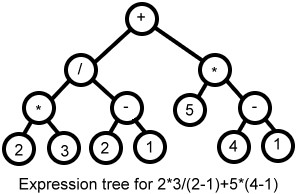
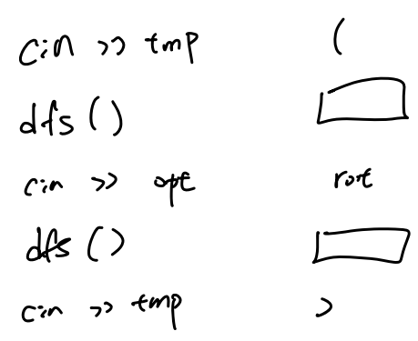
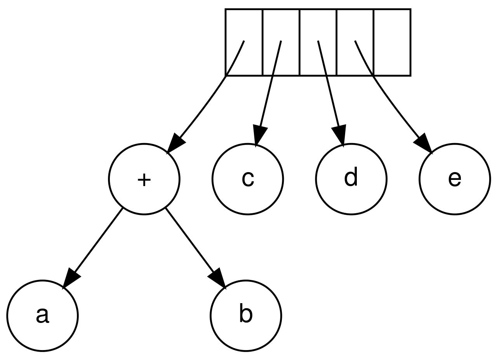

## Binary Expression Tree

???+note "問題"
	給一個運算式，如何轉乘 Binary expression tree
	
	<figure markdown>
      { width="300" }
    </figure>
    
有完整括號的版本，我們就用遞迴的方式來輸入，如下，複雜度 O(n)。

<figure markdown>
  { width="300" }
</figure>

若沒有完整的括號，作法如下。開兩個 stack，一個是 number，一個是 opt。先對運算式外圍加上一層括號，讓他最後會把 stack 中的東西運算完，接著我們從左到右掃描運算式

- 若遇到數字，就將他加入 number 中

- 若遇到左括號，則將其推入 opt 中

- 若遇到右括號，則 pop 掉 opt 中的運算符然後對 number 中的數字做運算，直到 pop 到左括號為止

- 若遇到運算符，則先將 opt 中優先級**大於等於**他的 pop 掉（若發現左括號則立刻停止 pop），對 number 中的數字做運算，再將自己推入 opt 中

至於怎麼對 number 做運算，我們每次挑 number 中的最後兩個依照運算符合併，再將運算結果推入 number 中。

<figure markdown>
  { width="300" }
  <figcaption>number 的 stack 類似的樣子</figcaption>
</figure>

??? note "舉例"
	例如 `(5 + 2) * 3 * (4 + 6) - 2 * 3`，先加上一層括號 `((5 + 2) * 3 * (4 + 6) - 2 * 3)`

    - 目前遇到: `(`，`number = [], opt = [(]`

    - 目前遇到: `(`，`number = [], opt = [(, (]`

    - 目前遇到: `5`，`number = [5], opt = [(, (]`

    - 目前遇到: `+`，`number = [5], opt = [(, (, +]`

    - 目前遇到: `2`，`number = [5, 2], opt = [(, (, +]`

    - 目前遇到: `)`，`number = [7], opt = [(, ]`

    - 目前遇到: `*`，`number = [7], opt = [(, *]`

    - 目前遇到: `3`，`number = [7, 3], opt = [(, *]`

    - 目前遇到: `*`，`number = [21], opt = [(, *]`

    - 目前遇到: `(`，`number = [21], opt = [(, *, (]`

    - 目前遇到: `4`，`number = [21, 4], opt = [(, *, (]`

    - 目前遇到: `+`，`number = [21, 4], opt = [(, *, (, +]`

    - 目前遇到: `6`，`number = [21, 4, 6], opt = [(, *, (, +]`

    - 目前遇到: `)`，`number = [21, 10], opt = [(, *]`

    - 目前遇到: `-`，`number = [210], opt = [(, -]`

    - 目前遇到: `2`，`number = [210, 2], opt = [(, -]`

    - 目前遇到: `*`，`number = [210, 2], opt = [(, -, *]`

    - 目前遇到: `3`，`number = [210, 2, 3], opt = [(, -, *]`

    - 目前遇到: `)`，`number = [204], opt = []`