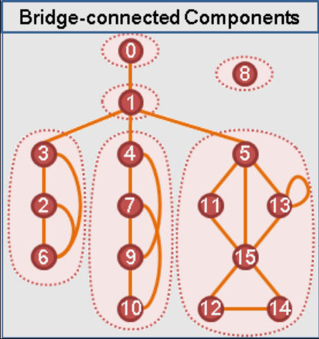
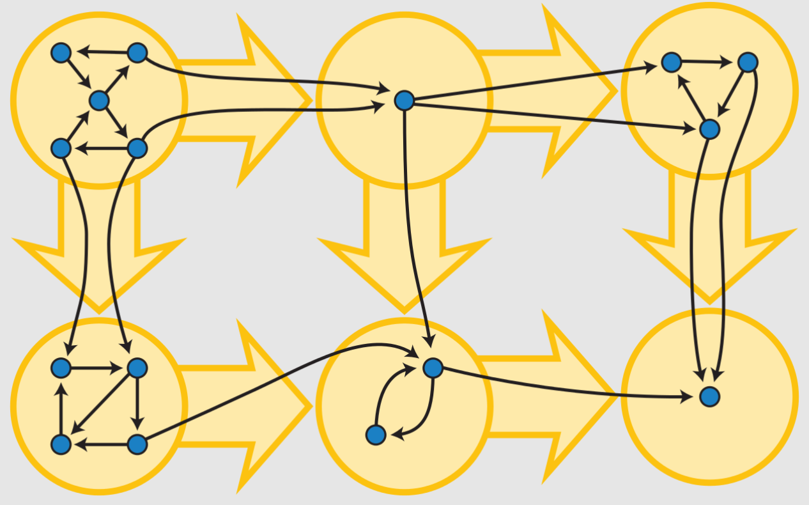

## DFS Tree

在無向圖上，只會出現 Tree Edge 與 Back Edge。而在有向圖上，有以下四種 :

- Tree Edge：真正在 DFS Tree 上的邊，從父親連往小孩

- Back Edge：從子孫連回祖先的邊

- Forward Edge：連向沒有直接親子關係的子孫的邊

- Cross Edge：連向非直系血親的邊

<figure markdown>
  { width="450" }
</figure>

## low 函數

low(u) : u 的子樹內的 back edge 可以到達到最小時間

- case 1:  他的 Tree Edge 連到的點 

	- low(u) = min(low(u), low(v))

- case2: 他的 Back Edge 連到的點

	- low(u) = min(low(u), t(v))

???+note "code"
	```cpp linenums="1"
    int dfs(int u, int par) {
        low[u] = dfn[u] = stamp++;
        for (auto v : G[u]) {
            if (v == par) continue;
            if (dfn[v] == 0) {
                dfs(v, u);
                low[u] = min(low[u], low[v]);
            } else {
                low[u] = min(low[u], dfn[v]);
            }
        }
    }
    ```

## 橋

一張無向圖上，把某些邊移除會導致連通塊數量變多，這種邊稱為 bridge。

(u, v) 是 bridge 的條件是 :

- dfn[v] <= low[v] 
	- v的子樹中沒有 back edge 能跨越 (u, v) 這條邊

???+note "code"
    ```cpp linenums="1"
    int dfs(int u, int par) {
        low[u] = dfn[u] = stamp++;
        for (auto v : G[u]) {
            if (v == par) continue;
            if (dfn[v] == 0) {
                dfs(v, u);
                low[u] = min(low[u], low[v]);
                if (low[v] >= dfn[v]) {
                    // is bridge
                }
            } else {
                low[u] = min(low[u], dfn[v]);
            }
        }
    }
    ```
    
???+note "[洛谷 T103481 【模板】割边](https://www.luogu.com.cn/problem/T103481)"
	給一張 $n$ 個點的無向圖，輸出 bridge 的數量
	
	$n\le 5\times 10^4, m\le 3\times 10^5$

## Tarjan 邊 BCC

如果把所有的 bridge 移除，那每一個連通塊在原圖上就稱為「邊雙連通分量」（bridge-connected component，簡稱 BCC）。

<figure markdown>
  { width="200" }
</figure>

在尋找 bridge 的過程中順便找 BCC。如果 u 的父邊是橋，則 u 往下形成一個BCC，我們利用 stack 紀錄。拜訪一個新的點時，將該點塞入 stack 若發現 u 父邊是橋，將 stack 裡的東西取出直到 u 也被取出這些被取出的點即形成 BCC。

???+note "code"
	```cpp linenums="1"
    //BCC 注意: 以下 code "沒有" 考慮重邊的情況
    int dfs(int u, int par) {
        low[u] = dfn[u] = stamp++;
        stk.push(u);
        for (auto v : G[u]) {
            if (v == par) continue;
            if (dfn[v] == 0) {
                dfs(v, u);
                low[u] = min(low[u], low[v]);
            } else {
                low[u] = min(low[u], dfn[v]);
            }
        }
        if (low[u] == dfn[u]) {
            int tmp;
            bccID++;
            do {
                tmp = stk.top();
                bcc[tmp] = bccID;
                stk.pop();
            } while (tmp != u);
        }
    }
    ```

???+note "[TIOJ 1879 . 我傳了一份code結果妳就來了](https://tioj.ck.tp.edu.tw/problems/1879)"
	給一張 $n$ 點 $m$ 邊無向圖，有重邊，輸出所有雙連通分量
	
	$n\le 10^4, m\le 4\times 10^4$

???+note "[洛谷 【模板】边双连通分量](https://www.luogu.com.cn/problem/P8436)"
	給一張 $n$ 點 $m$ 邊無向圖，輸出邊雙連通分量的個數，並且輸出每個點邊連通分量。
	
	$1\le n,m\le 10^5$

### 縮點

若將每個 BCC 視為一個點，新的圖將形成一棵樹

<figure markdown>
  { width="300" }
</figure>

## 割點

若一張無向圖移除某點會使連通塊變多，該點就稱為「割點」。

u是割點的條件是：

- dfn[u] <= low[v] 
	-  v 的子樹中沒有 back edge 能跨越 u 點

- 有多個兒子的 root

??? note "code"
	```cpp linenums="1"
    int dfs(int u, int par) {
        low[u] = dfn[u] = stamp++;
        int cnt = 0;
        for (auto v : G[u]) {
            if (v == par) continue;
            if (dfn[v] == 0) {
                dfs(v, u);
                low[u] = min(low[u], low[v]);
                if (low[v] >= dfn[u]) {
                    if (par != 0 || cnt >= 2) {
                        // is AP
                    }
                }
            } else {
                low[u] = min(low[u], dfn[v]);
            }
        }
    }
    ```

???+note "[Neoj 737. 平衡的技能樹](https://neoj.sprout.tw/problem/737/)"
	給一張 $n$ 點 $m$ 邊帶權無向圖，問至少要修改幾條邊的邊權才能使得圖上的最大生成樹與最小生成樹的權值總和一樣
	
	$n\le 2\times 10^5, m\le 2\times 10^5$
	
	??? note "思路"
		對於 Bridge，我們一定是不用修改的
		
		不是 Bridge，就代表是在一個邊雙連通分量內，邊雙連通分量是由多個環組成，所以我們可以先想環的 case。若環上有兩種不同的權重，那最大一定會選 total - max，最小賄選 total - min，所以可以發現 iff 環上權重都一樣最大與最小 MST 權重才會相等。
		
		所以我們對於每個 BCC 用 unorder map 紀錄每種權重出現的次數，我們就挑出現最多次的，將 BCC 內剩下其他的邊都替換成這個權重即可

???+note "[CF 555 E. Case of Computer Network](https://codeforces.com/problemset/problem/555/E)"
	給一張 $n$ 點 $m$ 邊無向圖，給 $q$ 組限制 $(u,v)$，問能否給每條邊標上方向，使中每一組限制中的 $u$ 都能到達 $v$。
	 
	$n,m,q \le 2\times 10^5$
	
	??? note "思路"
		首先考慮在同一個邊雙連通分量中，必然可以建構出一個方案使得其中所有點兩兩之間可以互相到達。 而剩餘的割邊會構造出一個森林結構。 問題可簡化成考慮在一棵樹中，怎麼給樹邊標方向使得各項不衝突，不同樹中的兩個點顯然是不可達的。 那麼在一顆樹中，兩點之間的路徑一定有一部分是確定的，即 u → lca(u,v) → v。 那麼題目就變成了，如果維護每條邊的方向。 可以考慮維護每條親子關係的樹鏈的差分關係，具體來說，用 dp[i][0] 表示 i 號邊（i 節點表示的邊是連向它父親的那一邊）向下的差分關係 dp[i][1] 表示 i 節點向上的差關係，對於每一個條件(u,v)，將 dp[lca(u,v)][0] + 1，dp[u][0] - 1，dp[lca(u,v)][1] +1，dp[v][1] - 1，然後把親子關係的值累加上去，就可以得到每個點的 dp[i][0], dp[i][1]。 dp[i][0] 如果不為 0 表示這條邊需要有向下的方向，dp[i][1] 不為 0 表示它需要有向上的方向，兩者不能同時存在。 
		
		> 參考自 : <https://www.cnblogs.com/badcw/p/13142026.html>

## 動態維護 BCC

???+note "動態維護 BCC"
	給一顆 $n$ 個點的樹，有 $q$ 次以下操作 :
	
	- $\text{add}(u,v):$ 在 $u,v$ 之間加一條邊
	
	- $\text{query}(u,v):$ 問 $u,v$ 之間是否有至少兩條邊不相交的路徑

每次我們都是加一條邊進去樹上後，將樹上與其形成環的路徑全部縮成一個 BCC。我們採用暴力跳並查集的方式來進行縮點。對於每個縮點後的 BCC，記錄在 BCC 內深度最淺的點，我們也會記錄每個點在縮點過後的父親。加一條邊 $(u,v)$ 時（令 dfn[v] > dfn[u]），我們從 $v$ 慢慢往上爬，並將路上的點與 $v$ 在並查集內合併。由於爬過的點都是縮點過後的，每條邊爬過後就會消失，所以最多合併 $n-1$ 次，複雜度 $O(n \alpha (n))$

???+note "[POJ - 3694 Network](https://vjudge.net/problem/POJ-3694)"
	給一張 $n$ 點 $m$ 邊的無向圖，有 $q$ 次以下操作 :
	
	- $\text{add}(u,v):$ 在 $u,v$ 之間加一條邊，並輸出 bridge 的個數
	
	$n\le 10^5, n-1\le m\le 2\times 10^5, q\le 1000$
	
	??? note "思路"
		先用 tarjan 將圖上的 bridge 數量算出來，過程中用並查集將非 bridge 邊的兩端 union 起來。之後每次加一條邊時就像上面暴力跳並查集即可。
	
	??? note "code"
		```cpp linenums="1"
		#include <iostream>
        #include <cstdio>
        #include <cstring>
        #include <cmath>
        #include <queue>
        #include <algorithm>
        #include <vector>
        
        using namespace std;

        const int maxn = 1e5 + 5;
        int dfn[maxn], dep[maxn], low[maxn];
        int f[maxn], pa[maxn], sz[maxn], light[maxn];
        int n, m, ret, cnt;
        int stamp;
        vector<int> G[maxn];

        int find(int x) {
            if (f[x] == x) {
                return x;
            } else {
                return f[x] = find(f[x]);
            }
        }

        bool merge(int u, int v) {
            u = find(u), v = find(v);
            if (u == v) return 0;
            if (sz[v] > sz[u]) swap(u, v);
            sz[u] += sz[v];
            if (dep[light[v]] < dep[light[u]]) {
                light[u] = light[v];
            }
            f[v] = u;
            return 1;
        }

        void dfs(int u, int fa) {
            pa[u] = fa;
            low[u] = dfn[u] = ++stamp;
            for (int i = 0; i < G[u].size(); i++) {
                int v = G[u][i];
                if (v == fa) continue;
                if (!dfn[v]) {
                    dep[v] = dep[u] + 1;
                    dfs(v, u);
                    low[u] = min(low[u], low[v]);
                    if (low[v] > dfn[u]) {
                        ret++;
                    } else {
                        merge(u, v); 
                    }
                } else if (dfn[v] < dfn[u]) {
                    low[u] = min(low[u], dfn[v]);
                }
            }
        }

        int lca(int u, int v) {
            u = find(u);
            v = find(v);
            while (u != v) {
                if (dep[light[u]] > dep[light[v]]) {
                    swap(u, v);
                }
                if (merge(v, pa[light[v]])) ret--;
                u = find(u);
                v = find(v);
            }
            return ret;
        }

        void init() {
            memset(dfn, 0, sizeof(dfn));
            memset(pa, 0, sizeof(pa));
            memset(dep, 0, sizeof(dep));
            memset(low, 0, sizeof(low));
            for (int i = 1; i <= n; i++) {
                f[i] = i;
                sz[i] = 1;
                light[i] = i;
                G[i].clear();
            }
            stamp = 0;
            ret = 0;
        }

        int main() {
            ios::sync_with_stdio(0);
            cin.tie(0);
            int kase = 0;
            while (cin >> n >> m) {
                if (n == 0 && m == 0) break;
                init();
                for (int i = 0; i < m; i++) {
                    int u, v;
                    cin >> u >> v; 
                    G[u].push_back(v);
                    G[v].push_back(u);
                }
                dfs(1, 0);
                int q;
                cin >> q;
                cout << "Case " << ++kase << ":\n";
                for (int i = 0; i < q; i++) {
                    int u, v;
                    cin >> u >> v;
                    cout << lca(u, v) << '\n';
                }
                cout << '\n';
            }
            return 0;
        }
        ```
	
???+note "[TOI 2023 pE. 公路 (road)](https://zerojudge.tw/ShowProblem?problemid=k188)"
	給一張 $n$ 點 $m$ 邊的帶權無向圖，有 $q$ 筆查詢 :
	
	- $\text{query}(u,v):$ 問 $u$ 到 $v$ 之間兩條「不相交的路徑」各自權重和的最大值，最小可以是多少，或不存在
	
	$2\le n\le 1000,n-1\le m\le \frac{n × (n − 1)}{2},1\le w_i\le 10^9,q\le 10^5$
	
	??? note "思路"
		先想無解的 case，iff u 跟 v 不在相同的 BCC 內無解。
		
		考慮要最小化答案，我們採用離線作法，將 $m$ 條邊依照邊權小到大加入，若連接的點已在同一 BCC 內則 continue，否則就重跑一次 tarjan，這樣最多跑 $n-1$ 次。對於 query，我們只要二分哪時候 $u,v$ 在同一個 BCC 內即可。
		
		---
		
		> 另法: From [twpca](https://toip2023.twpca.org/editorial/editorial)
		
		我們發現「讓兩個連通塊合併的邊」會形成一顆最小生成樹，然後就可以用上面動態維護 BCC 的方法來繼續加邊了。考慮維護 query 的答案，建完最小生成樹後，從原本權重由小到大加入還沒加入的邊，$(u,v,w)$，若使不同 BCC 合併，就在新圖上建立一條權重為 $w$ 的邊，這個圖會形成並查集生成樹。最後讀取 query 我們就可以直接看 path 上權重最大是多少即可，這個可以直接暴力在並查集上一格一格跑，因為並查集高度只有 $O(\log n)$
		
	??? note "code"
		```cpp linenums="1"
		#include <iostream>
	    #include <numeric>
	    #include <vector>
	    #include <algorithm>
	    using namespace std;
	
	    const int MAXN = 1005;
	    const int MAXM = 500005;
	
	    struct Edge {
	        int a, b, l;
	        bool operator<(const Edge &e) const {
	            return l < e.l;
	        }
	    } edge[MAXM];
	
	    vector<int> G[MAXN];
	    bool used[MAXM];
	    int djs_father[MAXN], sz[MAXN], light[MAXN], up[MAXN];
	    int father[MAXN], deep[MAXN];
	
	    int djs_find_root(int x) {
	        while (x != djs_father[x]) {
	            x = djs_father[x];
	        }
	        return x;
	    }
	
	    bool djs_union(int a, int b, int l) {
	        a = djs_find_root(a), b = djs_find_root(b);
	        if (a == b) {
	            return false;
	        }
	        if (sz[a] < sz[b]) {
	            swap(a, b);
	        }
	        djs_father[b] = a;
	        up[b] = l;
	        sz[a] += sz[b];
	        if (deep[light[a]] > deep[light[b]])
	            light[a] = light[b];
	        return true;
	    }
	
	    void dfs(int u, int f, int d) {
	        father[u] = f, deep[u] = d;
	        for (int v : G[u]) {
	            if (v != f) {
	                dfs(v, u, d + 1);
	            }
	        }
	    }
	
	    int main() {
	        ios::sync_with_stdio(0), cin.tie(0);
	        int n, m;
	        cin >> n >> m;
	        for (int i = 1; i <= m; i++) {
	            cin >> edge[i].a >> edge[i].b >> edge[i].l;
	        }
	        sort(edge + 1, edge + m + 1);
	        iota(djs_father + 1, djs_father + n + 1, 1);
	        fill(sz + 1, sz + n + 1, 1);
	        for (int i = 1; i <= m; i++) {
	            used[i] = djs_union(edge[i].a, edge[i].b, edge[i].l);
	            if (used[i]) {
	                G[edge[i].a].push_back(edge[i].b);
	                G[edge[i].b].push_back(edge[i].a);
	            }
	        }
	        dfs(1, 1, 0);
	        iota(djs_father + 1, djs_father + n + 1, 1);
	        iota(light + 1, light + n + 1, 1);
	        fill(sz + 1, sz + n + 1, 1);
	        for (int i = 1; i <= m; i++) {
	            if (!used[i]) {
	                int a = djs_find_root(edge[i].a);
	                int b = djs_find_root(edge[i].b);
	                while (a != b) {
	                    if (deep[light[a]] > deep[light[b]]) {
	                        swap(a, b);
	                    }
	                    djs_union(b, father[light[b]], edge[i].l);
	                    a = djs_find_root(a), b = djs_find_root(b);
	                }
	            }
	        }
	        int q;
	        cin >> q;
	        while (q--) {
	            int u, v, ans = 0;
	            cin >> u >> v;
	            if (djs_find_root(u) != djs_find_root(v)) { 
	                cout << "-1\n";
	            } else {
	                while (u != v) {
	                    if (sz[u] < sz[v]) {
	                        swap(u, v);
	                    }
	                    ans = max(ans, up[v]);
	                    v = djs_father[v];
	                }
	                cout << ans << "\n";
	            }
	        }
	    }
	    ```

???+note "[2022 YTP 初賽 p6 早上好YTP](https://www.tw-ytp.org/wp-content/uploads/2022/12/YTP2022PreliminaryContest_S1.pdf#page=32)"
    給⼀張 $n$ 點無向圖，⼀開始沒有任何邊。依序加入 $m$ 條邊，每加完⼀條邊請輸出當前圖中的橋的數量
    
    $n,m\le 2\times 10^5$
    
    ??? note "思路"
    	開兩個 dsu，一個維護連通性，一個維護同一個 CC 中縮點的動作
    	
    	在維護連通性的部分不要進行路徑壓縮

## Tarjan 點 BCC

如果一個連通分量沒有割點 (表示也沒有橋)，則該分量為雙連通分量

<figure markdown>
  { width="300" }
</figure>

對於求解具體的點雙連通分量，我們可以直接在判斷割點的時候求解點雙連通分量。具體來講，我們只需要額外加一個 stack，記錄子樹中訪問的點，之後遇到判斷割點的條件成立的時候說明有點雙連通分量，直接像下面代碼一樣放入即可。要注意的是，如果這個點是一個孤立點的話，那麼它自己就是一個點雙連通分量了，需要再特判一下。

實作上每次找到一個 BCC 時會留下一個點在 stack 裡面，若有多筆輸入時要小心

??? note "code"
	```cpp linenums="1"
	void dfs (int u, int par) {
        dfn[u] = low[u] = ++stamp; 
        stk.push(u);
        int cnt = 0; // 兒子個數
        for (auto v : G[u]) {
            if (v == par) continue; 
            if (!dfn[v]) {
                dfs(v, u);
                low[u] = min(low[u], low[v]);
                cnt++;
                if (low[v] >= dfn[u]) { // 若 u 為割點
                    int now = 0;
                    bcc.push_back({});
                    do {
                        now = stk.top();
                        stk.pop();
                        bcc.back().push_back(now);
                    } while (now != v);
                    bcc.back().push_back(u);
                }
            } else {
                low[u] = min(low[u], dfn[v]); 
            }
        }
        // 特判孤立點
        if (par == 0 && cnt == 0) {
            bcc.push_back({u});
            return;
        }
    }
    ```

???+note "[洛谷 P8435 【模板】点双连通分量](https://www.luogu.com.cn/problem/P8435)"
	給一張 $n$ 點 $m$ 邊無向圖，輸出點雙連通分量的個數，並且輸出每個點雙連通分量。
	
	$n\le 5\times 10^5, m\le 2\times 10^6,$ 可能有孤立點 or 自環
	
	??? note "code"
		```cpp linenums="1"
		#include <bits/stdc++.h>
	    #define int long long
	    #define pb push_back
	    #define mk make_pair
	    #define F first
	    #define S second
	    #define ALL(x) x.begin(), x.end()
	
	    using namespace std;
	    using pii = pair<int, int>;
	
	    const int N = 5e5 + 5;
	    int n, m, stamp;
	    vector<int> G[N];
	    int dfn[N], low[N]; 
	    vector<vector<int>> bcc;
	    stack<int> stk;
	
	    void dfs (int u, int par) {
	        dfn[u] = low[u] = ++stamp; 
	        stk.push(u);
	        int cnt = 0; // 兒子個數
	        for (auto v : G[u]) {
	            if (v == par) continue; 
	            if (!dfn[v]) {
	                dfs(v, u);
	                low[u] = min(low[u], low[v]);
	                cnt++;
	                if (low[v] >= dfn[u]) { // 若 u 為割點
	                    int now = 0;
	                    bcc.push_back({});
	                    do {
	                        now = stk.top();
	                        stk.pop();
	                        bcc.back().push_back(now);
	                    } while (now != v);
	                    bcc.back().push_back(u);
	                }
	            } else {
	                low[u] = min(low[u], dfn[v]); 
	            }
	        }
	        // 特判孤立點
	        if (par == 0 && cnt == 0) {
	            bcc.push_back({u});
	            return;
	        }
	    }
	
	    signed main() {
	        cin >> n >> m;
	        for (int i = 0; i < m; i++) {
	            int u, v;
	            cin >> u >> v;
	            G[u].push_back(v);
	            G[v].push_back(u);
	        }
	        for (int i = 1; i <= n; i++) {
	            if (!dfn[i]) {
	                dfs(i, 0);
	            }
	        }
	        cout << bcc.size() << '\n';
	        for (auto v : bcc) {
	            cout << v.size() << ' ';
	            for (auto it : v) {
	                cout << it << ' ';
	            }
	            cout << '\n';
	        }
	    } 
		```

### 縮點

可以縮成園方樹，詳見此 [Blog](https://www.cnblogs.com/Oier-GGG/p/16049166.html)

<figure markdown>
  { width="400" }
</figure>

## SCC

給一個有向圖，若一個連通分量內的任兩點均可以互相到達，則稱為強連通分量。

<figure markdown>
  { width="250" }
</figure>

### Tarjan

我們維護一個 stack，紀錄子樹中訪問的點每當發現某一點恰是最高祖先，即 low(u) = dfn(u)，即表示 u 與子孫已經形成 SCC，而且走不上去了，我們就將這些點從 stack 中拿出來。

要注意在有向圖計算 Low 函數的時候，會出現無向圖不存在的 Cross Edge 與 Forward Edge，可能連往之前做好的 SCC，不得計算，這個可以用判斷點是否在當前 SCC 內（也就是 stack）。

<figure markdown>
  { width="400" }
  <figcaption>cross edge 會導致 low(u) 壞掉</figcaption>
</figure>

??? note "code"
    ```cpp linenums="1"
    void dfs(int u) {
        low[u] = dfn[u] = ++stamp;
        instk[u] = true;
        stk.push(u);
        for (auto v : G[u]) {
            if (dfn[v] == 0) {
                dfs(v);
                low[u] = min(low[u], low[v]);
            } else if (instk[v]) {
                low[u] = min(low[u], dfn[v]);
            }
        }
        if (low[u] == dfn[u]) {
            int x;
            sccID++;
            do {
                x = stk.top();
                stk.pop();
                scc[x] = sccID;
                instk[x] = false;
            } while (x != u);
        }
    }
    ```

### Kosaraju

在反圖上按照離開順序由大到小 dfs[^1]，若 u 還沒被走訪，則在反圖上從 u 去 dfs，走到的所有點即是同一個 SCC。

??? note "code"
    ```cpp linenums="1"
    //SCC
    const int maxn = 1e6 + 5;
    int n;
    stack<int> stk;
    vector<int> G[maxn];
    vector<int> R[maxn];
    int vis[maxn];
    int scc[maxn];
    int sccID;

    int dfs1(int u, int par) {
        vis[u] = true;
        for (auto v : G[u]) {
            if (v == par) continue;
            dfs1(v, u);
        }
        stk.push(u);
    }
    
    int dfs2(int u, int par) {
        vis[u] = true;
        scc[u] = sccID;
        for (auto v : R[u]) {
            if (v == par) continue;
            dfs2(v, u);
        }
    }
    
    void solve() {
        memset(vis, 0, sizeof(vis));
        for (int i = 1; i <= n; i++) {
            if (!vis[i]) dfs1(i, 0);
        }
        memset(vis, 0, sizeof(vis));
        while(stk.size()) {
            if (!vis[stk.top()]) {
                sccID++;
                dfs2(stk.top(), 0);
            }
            stk.pop();
        }
    }
    ```

### 縮點

將同一個強連通分量縮成一個點，可以得到 DAG。

<figure markdown>
  { width="300" }
</figure>

實作上在新圖將每個 SCC 視為一個點，跑過原圖的每一條邊，若兩端在不同的 SCC 上，就在新圖建邊。

???+note "[CSES - Planets and Kingdoms](https://cses.fi/problemset/task/1683)"
	給一張 $n$ 點 $m$ 邊有向圖，輸出所有強連通分量
	
	$n\le 10^5, m\le 2\times 10^5$

???+note "[CSES - Coin Collector](https://cses.fi/problemset/task/1686)"
	給 $n$ 點 $m$ 邊的有向圖，每個點上有 $w_i$ 個金幣，可以自由決定起點、終點，問最多可以拿到多少金幣
	
	$n\le 10^5, m\le 2\times 10^5, 1\le w_i\le 10^9$
	
	??? note "code"
	
	    ```cpp linenums="1"
	    #include <bits/stdc++.h>
	    #define int long long
	    #define pb push_back
	    #include <bits/stdc++.h>
	    #define int long long
	    #define pb push_back
	    #define mk make_pair
	    #define F first
	    #define S second
	    using namespace std;
	
	    const int INF = 2e18;
	    const int maxn = 1e5 + 5;
	    int n, m;
	    int low[maxn], t[maxn], instk[maxn], stamp, sccID, scc[maxn], in[maxn], cost[maxn], dp[maxn], w[maxn];
	    vector<int> G[maxn], W[maxn];
	    vector<int> sc[maxn];
	    stack<int> stk;
	
	    void dfs(int u) {
	        low[u] = t[u] = ++stamp;
	        instk[u] = true;
	        stk.push(u);
	        for (auto v : G[u]) {
	            if (t[v] == 0) {
	                dfs(v);
	                low[u] = min(low[u], low[v]);
	            } else if (instk[v]) {
	                low[u] = min(low[u], t[v]);
	            }
	        }
	        if (low[u] == t[u]) {
	            int x;
	            sccID++;
	            do {
	                x = stk.top();
	                stk.pop();
	                scc[x] = sccID;
	                instk[x] = false;
	                sc[sccID].pb(x);
	                w[sccID] += cost[x];
	            } while (x != u);
	        }
	    }
	
	    void init() {
	        cin >> n >> m;
	        int u, v;
	        for (int i = 1; i <= n; i++) cin >> cost[i];
	        for (int i = 0; i < m; i++) {
	            cin >> u >> v;
	            G[u].pb(v);
	        }
	    }
	
	    void topo() {
	        queue<int> q;
	        for (int i = 1; i <= sccID; i++) {
	            if (in[i] == 0) q.push(i), dp[i] = w[i];
	        }
	
	        int res = 0;
	        while (q.size()) {
	            int u = q.front();
	            q.pop();
	            for (auto v : W[u]) {
	                dp[v] = max(dp[v], dp[u] + w[v]);
	                res = max(res, dp[v]);
	                in[v]--;
	                if (in[v] == 0) {
	                    q.push(v);
	                }
	            }
	        }
	        cout << res << "\n";
	    }
	
	    void solve () {
	        for (int i = 1; i <= n; i++) {
	            if (t[i] == 0) {
	                dfs(i);
	            }
	        }
	        for (int i = 1; i <= sccID; i++) {
	            for (auto u : sc[i]) {
	                for (auto v : G[u]) {
	                    if (scc[u] != scc[v]) {
	                        W[scc[u]].pb(scc[v]);
	                        in[scc[v]]++;
	                    }
	                }
	            }
	        }
	        topo();
	    }
	
	    signed main() {
	        // ios::sync_with_stdio(0);
	        // cin.tie(0);
	        int t = 1;
	        //cin >> t;
	        while (t--) {
	            init();
	            solve();
	        }
	    }
	    ```

???+note "[TIOJ  1451 . 八卦傳播系統](https://tioj.ck.tp.edu.tw/problems/1451)"
	給一張 $n$ 點 $m$ 邊有向圖，求最少需要從幾個點開始 DFS 才能經過所有點至少一次。
	
	$n,m\le 10^5$

???+note "[POJ 1515 - Street Directions](https://vjudge.net/problem/POJ-1515)"
	給一張 $n$ 點 $m$ 邊無向圖，保證圖連通。選一些無向邊定向，使得最終圖保持強連通的特性。選的邊要盡量多，輸出每個邊的方向（無向邊及輸出兩次，方向不同）
	
	$n\le 1000, m\le 10^6$
	
	??? note "思路"
		首先，bridge 只能是無向。其他邊就按照 dfs tree 的方向將其定向即可
		
	??? note "code(from [cnblog](https://www.cnblogs.com/00isok/p/10629693.html))"
		```cpp linenums="1"
		#include <cstdio>
	    #include <cstring>
	    #include <iostream>
	    using namespace std;
	
	    const int N = 1005 , M = N * N;
	
	    struct Edge {
	        int from, to, nxt,cut;
	    } edge[M];
	
	    int dfn[N],low[N],head[N]; 
	    int n, m,tot,cnt;
	    inline void init(){
	        tot = cnt = 0;
	        memset(dfn, 0, sizeof dfn);
	        memset(head, -1, sizeof head);
	    }
	    inline void add(int u,int v){
	        edge[cnt]=(Edge){u,v,head[u],0};
	        head[u]=cnt++;
	    }
	    void Tarjan(int u, int pre){
	        dfn[u] = low[u] = ++tot;
	        for (int i=head[u];~i;i=edge[i].nxt){
	            int v=edge[i].to;
	            if (edge[i].cut) continue;    //如果这个边已经被标记了(标记为-1也是被标记过)，则无需改变之前的标记，因为只需要找到一种可行的标记方案即可
	            edge[i].cut=1;edge[i^1].cut=-1;     //贪心的将一个方向的边标记
	            if (v == pre) continue;
	            if (!dfn[v]){
	                Tarjan(v, u);
	                low[u] = min(low[u], low[v]);
	                if (dfn[u] < low[v])edge[i].cut=edge[i^1].cut=1;
	            } else low[u] = min(low[u], dfn[v]);
	        }
	    } 
	    inline void Solve(){
	        for (int i = 0; i < cnt; ++i) {
	            if (edge[i].cut==1) {
	                printf("%d %d\n", edge[i].from, edge[i].to);
	            }
	        }
	        printf("#\n");
	    }
	    int main(){
	        int ncase=0;
	        while(~scanf("%d%d",&n,&m),n||m){
	            printf("%d\n\n",++ncase);
	            init();
	            for(int i=1;i<=m;i++){
	                int u,v;scanf("%d%d", &u, &v);
	                add(u,v);add(v,u);
	            }
	            Tarjan(1, -1);
	            Solve(); 
	        }
	    }
	    ```

## 2-SAT

### 判斷是否有解

???+note "問題"
	給一個 boolean formula，例如 
	
	$$(x_1 \vee x_2) \wedge (\neg x_1 \vee x_3) \wedge (\neg x_2 \vee \neg x_5) \wedge \dots$$
	
	能否賦予 $x_1, \ldots ,x_n$ True 或是 False，使 formula 為 True

將每個點代表狀態，每個邊 (u, v) 代表若 u 則 v。對於每一個變數 $x$，有狀態 $x$ 與 $\neg x$，代表 $x$ 選 True 或 $x$ 選 False。假設有一個 $x \vee y$，則代表[^2]

- 若 $x$ 為 false，$y$ 一定要為 true

- 若 $y$ 為 false，$x$ 一定要為 true

接著我們要來判斷是否有解。觀察到 :

- $x \rightarrow \neg x$：若 $x$ 為 true，則 $x$ 必定為 false $\Rightarrow$ $x$ 不能為真 true

- $\neg x \rightarrow x$：若 $x$ 為 false，則 $x$ 必定為 true $\Rightarrow$ $x$ 不能為 false

這些都是有解的情況。可以發現，當 $x \rightarrow \neg x$ 和 $\neg x \rightarrow x$ 同時存在，代表問題無解。這也就代表 $x$ 與 $\neg x$ 在同一個 SCC 內。

實作上對於變數個數建點，對於每個條件建立有向邊，在圖上做 SCC，檢查每個變數是否矛盾。

??? note "code"
	```cpp linenums="1"
    struct TwoSAT {
        static const int MAXv = 2 * MAXN;
        vector<int> GO[MAXv], BK[MAXv], stk;
        int vis[MAXv];
        int SC[MAXv];
        void imply(int u, int v) { // u imply v
            GO[u].push_back(v);
            BK[v].push_back(u);
        }
        void dfs(int u, vector<int> *G, int sc) {
            vis[u] = 1, SC[u] = sc;
            for (int v : G[u]) {
                if (!vis[v]) dfs(v, G, sc);
            }
            if (G == GO) stk.push_back(u);
        }
        void scc(int n) {
            memset(vis, 0, sizeof(vis));
            for (int i = 0; i < n; i++) {
                if (!vis[i]) dfs(i, GO, -1);
            }
            memset(vis, 0, sizeof(vis));
            int sc = 0;
            while (!stk.empty()) {
                if (!vis[stk.back()]) {
                    dfs(stk.back(), BK, sc++);
                }
                stk.pop_back();
            }
        }
    };

    signed main() {
        TwoSAT SAT;
        SAT.scc(2 * n);
    
        // todo
        for (int i = 0; i < n; i++) {
            if (SAT.SC[2 * i] == SAT.SC[2 * i + 1])
                flg = 1;
    
            // 2*i (+), 2*i + 1 (-)
        }
    
        if (flg) cout << "BAD\n";
        else cout << "GOOD\n";
    }
    ```

### 印出一組解

先觀察，當 $x \rightarrow \neg x$ 時，如果我選 $x=$true 結果會推倒到 $x=$false
，但如果我選 $x=$false 那不會發生任何事情，代表選後面的為正解。

同一個 SCC 內的點必定全選或全不選，所以我們可以先將圖縮成 DAG，跑反向的 topo sort，將 SCC 內的點設定解即可。

??? note "code"

    ```cpp linenums="1"
    #include <iostream>
    #include <vector>
    #include <stack>
    #include <queue>
    using namespace std;
    
    int n, m, a, b, dfn[200005], stk[200005], low[200005], pa[200005], opp[200005], in[200005], pick[200005], scc, idx;
    char c[2];
    vector <int> v[200005];
    vector <int> v2[200005];
    stack <int> st;
    
    void tarjan(int x){
        idx++;
        dfn[x] = low[x] = idx;
        st.push(x);
        stk[x] = 1;
        for (auto i:v[x]){
            if (!dfn[i]){
                tarjan(i);
                low[x] = min(low[x], low[i]);
            }
            else if (stk[i]){
                low[x] = min(low[x], dfn[i]);
            }
        }
        if (dfn[x] == low[x]){
            scc++;
            pa[x] = scc;
            int nxt = -1;
            while (nxt != x){
                nxt = st.top();
                st.pop();
                pa[nxt] = scc;
                stk[nxt] = 0;
            }
        }
    }
    int tr(int x){ // 正變負, 負變正
        if (x <= m) return x+m;
        else return x-m;
    }
    bool check(){
        for (int i = 1; i <= m; i++){
            if (pa[i] == pa[i+m]) return 0; // pa[i] 紀錄 i 的 scc
            else{
                opp[pa[i]] = pa[i+m];
                opp[pa[i+m]] = pa[i]; // opp 紀錄 x 跟 ~x 對方各自的 scc
                /*
                如果 opp[scc] 有被改到的話, 那就代表說
                前一個改的數(x)跟後一個改的數(y) 他們是互相連通的 (例如 ~x -> y 之類的)
                那麼因為如果有 (~x -> y) 的邊那也就代表有 (~y -> x) 的邊 
                (也不一定是邊但這兩個會互相成立，因為在加入2SAT的時候都是兩個成對的邊一起加入)
                所以一旦 opp[scc] 一被改過後就是那個答案了, 有其他人想再改他的話也只是做 opp[scc] = opp[scc]
                */
            }
        }
        return 1;
    }
    void build(){
        for (int i = 1; i <= m * 2; i++){
            for (int j:v[i]){
                if (pa[i] != pa[j]){
                    v2[pa[j]].push_back(pa[i]); // 加入的邊是topo排序的"反向"
                    in[pa[i]]++;
                }
            }
        }
    }
    void topo(){
        queue <int> q;
        for (int i = 1; i <= scc; i++){
            if (in[i] == 0) q.push(i);
        }
        while (!q.empty()){
            int now = q.front();
            q.pop();
            if (!pick[now]){
                pick[now] = 1;
                pick[opp[now]] = 2;
            }
            for (auto i:v2[now]){
                in[i]--;
                if (!in[i]) q.push(i);
            }
        }
        for (int i = 1; i <= m; i++){
            if (pick[pa[i]] == 1) cout << "+ ";
            else cout << "- ";
        }
    }
    
    int main() {
        cin >> n >> m; // n 個式子, m 個變數
        for (int i = 0; i < n; i++){
            cin >> c[0] >> a >> c[1] >> b;
            /*
            x + m (-)
            x (+)
            */
            if (c[0] == '-') a += m;
            if (c[1] == '-') b += m;
            v[tr(a)].push_back(b);
            v[tr(b)].push_back(a);
        }
        for (int i = 1; i <= m*2; i++){
            if (!dfn[i]) tarjan(i);
        }
        if (check()){
            build();
            topo();
        }
        else cout << "IMPOSSIBLE\n";
    }
    ```

### 題目

???+note "[CSES - Giant Pizza](https://cses.fi/problemset/task/1684)"
	共有 $n$ 個 boolean，給 $m$ 組限制，構造出一組 2-SAT 的解
	
	$n,m\le 10^5$

---

## 資料

- <https://cp-algorithms.com/graph/bridge-searching-online.html>

- <https://oi-wiki.org/topic/dsu-app>

- <https://sprout.tw/algo2023/ppt_pdf/week14/tp-Graph2-2023.pdf>

- <https://zhuanlan.zhihu.com/p/562961398?utm_id=0>

- <https://web.ntnu.edu.tw/~algo/ConnectedComponent.html#2>

- <https://hackmd.io/@Ccucumber12/HylySg2xF#>

- <https://slides.com/sylveon/graph-7>

- <https://slides.com/fhvirus/advanced_graph_theory>

[^1]: 見此處<a href="/wiki/graph/images/Kosaraju Algorithm.html" target="_blank">此處</a>

[^2]: $x$ 為 true 的狀態就不用考慮了，因為 $y$ 不管選什麼都可以，記得我們邊代表的是「若 u 則 v」