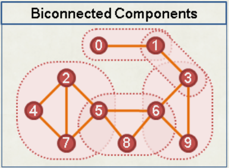

## DFS Tree

在無向圖上，只會出現 Tree Edge 與 Back Edge。而在有向圖上，有以下四種 :

- Tree Edge：真正在 DFS Tree 上的邊，從父親連往小孩

- Back Edge：從子孫連回祖先的邊

- Forward Edge：連向沒有直接親子關係的子孫的邊

- Cross Edge：連向非直系血親的邊

<figure markdown>
  { width="450" }
</figure>

## 割點

當拔掉點 u 使得圖不連通，則 u 為割點

## low 函數

low(u) : u 的子樹內的 back edge 可以到達到最小時間

<div class="result" markdown>

{ align=right width=200 }

- case 1:  他的 Tree Edge 連到的點 

	- low(u) = min(low(u), low(v))

</div>

<br><br><br><br><br><br><br><br>

<div class="result" markdown>

{ align=right width=200 }

- case2: 他的 Back Edge 連到的點

	- low(u) = min(low(u), t(v))

</div>

<br><br><br><br><br><br><br><br>

???+note "code"
	```cpp linenums="1"
    int dfs(int u, int par) {
        low[u] = t[u] = stamp++;
        for (auto v : G[u]) {
            if (v == par) continue;
            if (t[v] == 0) {
                dfs(v, u);
                low[u] = min(low[u], low[v]);
            } else {
                low[u] = min(low[u], t[v]);
            }
        }
    }
    ```

## Tarjan

### 橋

一張無向圖上，把某些邊移除會導致連通塊數量變多，這種邊稱為 bridge。

(u, v) 是 bridge 的條件是 :

- t[v] <= low[v] 
	- v的子樹中沒有 back edge 能跨越 (u, v) 這條邊

???+note "code"
    ```cpp linenums="1"
    int dfs(int u, int par) {
        low[u] = t[u] = stamp++;
        for (auto v : G[u]) {
            if (v == par) continue;
            if (t[v] == 0) {
                dfs(v, u);
                low[u] = min(low[u], low[v]);
                if (low[v] >= t[v]) {
                    // is bridge
                }
            } else {
                low[u] = min(low[u], t[v]);
            }
        }
    }
    ```


### 邊 BCC 實作

如果把所有的 bridge 移除，那每一個連通塊在原圖上就稱為「邊雙連通分量」（bridge-connected component，簡稱 BCC）。

<figure markdown>
  { width="200" }
</figure>

在尋找 bridge 的過程中順便找 BCC。如果 u 的父邊是橋，則 u 往下形成一個BCC，我們利用 stack 紀錄。拜訪一個新的點時，將該點塞入 stack 若發現 u 父邊是橋，將 stack 裡的東西取出直到 u 也被取出這些被取出的點即形成 BCC。

???+note "code"
	```cpp linenums="1"
    //BCC 注意: 以下 code "沒有" 考慮重邊的情況
    int dfs(int u, int par) {
        low[u] = t[u] = stamp++;
        stk.push(u);
        for (auto v : G[u]) {
            if (v == par) continue;
            if (t[v] == 0) {
                dfs(v, u);
                low[u] = min(low[u], low[v]);
            } else {
                low[u] = min(low[u], t[v]);
            }
        }
        if (low[u] == t[u]) {
            int tmp;
            bccID++;
            do {
                tmp = stk.top();
                bcc[tmp] = bccID;
                stk.pop();
            } while (tmp != u);
        }
    }
    ```

### 割點

若一張無向圖移除某點會使連通塊變多，該點就稱為「割點」。

u是割點的條件是：

- t[u] <= low[v] 
	-  v 的子樹中沒有 back edge 能跨越u點

- 有多個兒子的 root

??? note "code"
	```cpp linenums="1"
    int dfs(int u, int par) {
        low[u] = t[u] = stamp++;
        int cnt = 0;
        for (auto v : G[u]) {
            if (v == par) continue;
            if (t[v] == 0) {
                dfs(v, u);
                low[u] = min(low[u], low[v]);
                if (low[v] >= t[u]) {
                    if (par != 0 || cnt >= 2) {
                        // is AP
                    }
                }
            } else {
                low[u] = min(low[u], t[v]);
            }
        }
    }
    ```

### 點 BCC

如果一個連通分量沒有割點 (表示也沒有橋)，則該分量為雙連通分量

<figure markdown>
  { width="300" }
</figure>

對於求解具體的點雙連通分量，我們可以直接在判斷割點的時候求解點雙連通分量。具體來講，我們只需要額外加一個 stack，記錄子樹中訪問的點，之後遇到判斷割點的條件成立的時候說明有點雙連通分量，直接像下面代碼一樣放入即可。要注意的是，如果這個點是一個孤立點的話，那麼它自己就是一個點雙連通分量了，需要再特判一下。

實作上每次找到一個 BCC 時會留下一個點在 stack 裡面，若有多筆輸入時要小心

??? note "code"
	```cpp linenums="1"
	void dfs (int u, int par) {
        dfn[u] = low[u] = ++stamp; 
        stk.push(u);
        int cnt = 0; // 兒子個數
        for (auto v : G[u]) {
            if (v == par) continue; 
            if (!dfn[v]) {
                dfs(v, u);
                low[u] = min(low[u], low[v]);
                cnt++;
                if (low[v] >= dfn[u]) { // 若 u 為割點
                    int now = 0;
                    bcc.push_back({});
                    do {
                        now = stk.top();
                        stk.pop();
                        bcc.back().push_back(now);
                    } while (now != v);
                    bcc.back().push_back(u);
                }
            } else {
                low[u] = min(low[u], dfn[v]); 
            }
        }
        // 特判孤立點
        if (par == 0 && cnt == 0) {
            bcc.push_back({u});
            return;
        }
    }
    ```

???+note "[洛谷 P8435 【模板】点双连通分量](https://www.luogu.com.cn/problem/P8435)"
	給一張 $n$ 點 $m$ 邊無向圖，輸出點雙連通分量的個數，並且輸出每個點雙連通分量。
	
	$n\le 5\times 10^5, m\le 2\times 10^6,$ 可能有孤立點 or 自環
	
	??? note "code"
		```cpp linenums="1"
		#include <bits/stdc++.h>
        #define int long long
        #define pb push_back
        #define mk make_pair
        #define F first
        #define S second
        #define ALL(x) x.begin(), x.end()

        using namespace std;
        using pii = pair<int, int>;

        const int N = 5e5 + 5;
        int n, m, stamp;
        vector<int> G[N];
        int dfn[N], low[N]; 
        vector<vector<int>> bcc;
        stack<int> stk;

        void dfs (int u, int par) {
            dfn[u] = low[u] = ++stamp; 
            stk.push(u);
            int cnt = 0; // 兒子個數
            for (auto v : G[u]) {
                if (v == par) continue; 
                if (!dfn[v]) {
                    dfs(v, u);
                    low[u] = min(low[u], low[v]);
                    cnt++;
                    if (low[v] >= dfn[u]) { // 若 u 為割點
                        int now = 0;
                        bcc.push_back({});
                        do {
                            now = stk.top();
                            stk.pop();
                            bcc.back().push_back(now);
                        } while (now != v);
                        bcc.back().push_back(u);
                    }
                } else {
                    low[u] = min(low[u], dfn[v]); 
                }
            }
            // 特判孤立點
            if (par == 0 && cnt == 0) {
                bcc.push_back({u});
                return;
            }
        }

        signed main() {
            cin >> n >> m;
            for (int i = 0; i < m; i++) {
                int u, v;
                cin >> u >> v;
                G[u].push_back(v);
                G[v].push_back(u);
            }
            for (int i = 1; i <= n; i++) {
                if (!dfn[i]) {
                    dfs(i, 0);
                }
            }
            cout << bcc.size() << '\n';
            for (auto v : bcc) {
                cout << v.size() << ' ';
                for (auto it : v) {
                    cout << it << ' ';
                }
                cout << '\n';
            }
        } 
		```

### SCC

給一個有向圖，若一個連通分量內的任兩點均可以互相到達，則稱為強連通分量。

<figure markdown>
  { width="250" }
</figure>

每當發現某一點恰是最高祖先，即 low(u) = dfn(u)，即表示此點與子孫已經形成 SCC。

要注意在有向圖計算 Low 函數的時候，會出現無向圖不存在的 Cross Edge 與 Forward Edge，可能連往之前做好的 SCC，不得計算。

<figure markdown>
  { width="400" }
  <figcaption>cross edge 會導致 low(u) 壞掉</figcaption>
</figure>

??? note "code"
    ```cpp linenums="1"
    void dfs(int u) {
        low[u] = dfn[u] = ++stamp;
        instk[u] = true;
        stk.push(u);
        for (auto v : G[u]) {
            if (dfn[v] == 0) {
                dfs(v);
                low[u] = min(low[u], low[v]);
            } else if (instk[v]) {
                low[u] = min(low[u], dfn[v]);
            }
        }
        if (low[u] == dfn[u]) {
            int x;
            sccID++;
            do {
                x = stk.top();
                stk.pop();
                scc[x] = sccID;
                instk[x] = false;
            } while (x != u);
        }
    }
    ```

## SCC - kosaraju

在反圖上按照離開順序由大到小 dfs，若 u 還沒被走訪，則在反圖上從 u 去 dfs，走到的所有點即是同一個 SCC。

???+info "過程"
	<figure markdown>
      { width="300" }
    </figure>
    
    <figure markdown>
      { width="300" }
    </figure>
    
    <figure markdown>
      { width="300" }
    </figure>

??? note "code"
    ```cpp linenums="1"
    //SCC
    const int maxn = 1e6 + 5;
    int n;
    stack<int> stk;
    vector<int> G[maxn];
    vector<int> R[maxn];
    int vis[maxn];
    int scc[maxn];
    int sccID;

    int dfs1(int u, int par) {
        vis[u] = true;
        for (auto v : G[u]) {
            if (v == par) continue;
            dfs1(v, u);
        }
        stk.push(u);
    }

    int dfs2(int u, int par) {
        vis[u] = true;
        scc[u] = sccID;
        for (auto v : R[u]) {
            if (v == par) continue;
            dfs2(v, u);
        }
    }

    void solve() {
        memset(vis, 0, sizeof(vis));
        for (int i = 1; i <= n; i++) {
            if (!vis[i]) dfs1(i, 0);
        }
        memset(vis, 0, sizeof(vis));
        while(stk.size()) {
            if (!vis[stk.top()]) {
                sccID++;
                dfs2(stk.top(), 0);
            }
            stk.pop();
        }
    }
    ```

## 縮點

### 點 BCC

<figure markdown>
  { width="300" }
</figure>

### 邊 BCC


### SCC

```cpp linenums="1"
#include <bits/stdc++.h>
#define pii pair<int, int>
#define mk make_pair
#define pb push_back
using namespace std;

const int maxn = 1e4 + 5;
vector<int> G[maxn];
vector<int> R[maxn];
vector<int> W[maxn];
int n, m;
int sccID;
int ans = 0;
int vis[maxn];
int sc[maxn];
int in[maxn];
int dp[maxn];
vector<int> scc[maxn];
stack<int> stk;

void dfs1(int u = 1) {
    vis[u] = true;
    for (auto v : G[u]) {
        if(!vis[v]) dfs1(v);
    }
    stk.push(u);
}

void dfs2(int u = 1) {
    vis[u] = true;
    scc[sccID].push_back(u);
    sc[u] = sccID;
    for (auto v : R[u]) {
        if (!vis[v]) dfs2(v);
    }
}

void topo() {
    queue<int> q;
    for (int i = 1; i <= sccID; i++) {
        if(!in[i]){
            q.push(i);
            dp[i] = scc[i].size();
            ans = max(ans, dp[i]);
        } 
    }
    while(q.size()) {
        int u = q.front();
        q.pop();
        for (auto v : W[u]) {
            int sz = scc[v].size();
            dp[v] = max(dp[v], dp[u] + sz);
            ans = max(ans, dp[v]);
            in[v]--;
            if(!in[v]) q.push(v);
        }
    }
}

void init() {
    cin >> n >> m;
    for (int i = 1; i <= n; i++) {
        G[i].clear();
        R[i].clear();
        W[i].clear();
        scc[i].clear();
    }
    for (int i = 0, u, v; i < m; i++) {
        cin >> u >> v;
        G[u].pb(v);
        R[v].pb(u);
    }
    sccID = 0;
    ans = 0;
    memset(in, 0, sizeof(in));
    memset(dp, 0, sizeof(dp));
    memset(sc, 0, sizeof(sc));
    memset(vis, 0, sizeof(vis));
    for (int i = 1; i <= n; i++) {
        if(!vis[i]) {
            dfs1(i);
        }
    }
    memset(vis, 0, sizeof(vis));
    while(stk.size()) {
        if(!vis[stk.top()]) {
            sccID++;
            dfs2(stk.top());
        }
        stk.pop();
    }
}

void solve() {
    for (int i = 1; i <= sccID; i++) {
        for (int u : scc[i]) {
            for (int v : G[u]) {
                // 重新建圖
                if (sc[u] != sc[v]) {
                    W[sc[u]].pb(sc[v]);
                    in[sc[v]]++;
                }
            }
        }
    }
    topo();
    cout << ans << "\n"; 
}

signed main() {
    int t;
    cin >> t;
    while(t--) {
        init();
        solve();
    }
}
```

```cpp linenums="1"
#include <bits/stdc++.h>
#define int long long
#define pb push_back
#define mk make_pair
#define F first
#define S second
using namespace std;
 
const int INF = 2e18;
const int maxn = 1e5 + 5;
int n, m;
int low[maxn], t[maxn], instk[maxn], stamp, sccID, scc[maxn], in[maxn], cost[maxn], dp[maxn], w[maxn];
vector<int> G[maxn], W[maxn];
vector<int> sc[maxn];
stack<int> stk;
 
void dfs (int u) {
    low[u] = t[u] = ++stamp;
    instk[u] = true;
    stk.push(u);
    for (auto v : G[u]) {
        if (t[v] == 0) {
            dfs(v);
            low[u] = min (low[u], low[v]);
        }
        else if (instk[v]) {
            low[u] = min (low[u], t[v]);
        }
    }
    if (low[u] == t[u]) {
        int x;
        sccID++;
        do {
            x = stk.top();
            stk.pop();
            scc[x] = sccID;
            instk[x] = false;
            sc[sccID].pb(x);
            w[sccID] += cost[x];
        } while (x != u);
    }
}
 
void init () {
    cin >> n >> m;
    int u, v;
    for (int i = 1; i <= n; i++) cin >> cost[i];
    for (int i = 0; i < m; i++) {
        cin >> u >> v;
        G[u].pb(v);
    }
}
 
void topo () {
    queue<int> q;
    for (int i = 1; i <= sccID; i++) {
        if (in[i] == 0) q.push(i), dp[i] = w[i];
    }
 
    int res = 0;
    while (q.size()) {
        int u = q.front();
        q.pop();
        for (auto v : W[u]) {
            dp[v] = max (dp[v], dp[u] + w[v]);
            res = max (res, dp[v]);
            in[v]--;
            if (in[v] == 0) {
                q.push(v);
            }
        }
    }
    cout << res << "\n";
}
 
void solve () {
    for (int i = 1; i <= n; i++) {
        if (t[i] == 0) {
            dfs (i);
        }
    }
    for (int i = 1; i <= sccID; i++) {
        for (auto u : sc[i]) {
            for (auto v : G[u]) {
                if (scc[u] != scc[v]) {
                    W[scc[u]].pb(scc[v]);
                    in[scc[v]]++;
                }
            }
        }
    }
    topo();
}
 
signed main () {
    // ios::sync_with_stdio(0);
    // cin.tie(0);
    int t = 1;
    //cin >> t;
    while (t--) {
        init ();
        solve ();
    }
}
 
 
/*
10 10
1 1 1 1 1 1 1 1 1 1
2 7
 
*/
```

## 2-SAT

```cpp linenums="1"
struct TwoSAT {
    static const int MAXv = 2 * MAXN;
    vector<int> GO[MAXv], BK[MAXv], stk;
    int vis[MAXv];
    int SC[MAXv];
    void imply(int u, int v) { // u imply v
        GO[u].push_back(v);
        BK[v].push_back(u);
    }
    void dfs(int u, vector<int> *G, int sc) {
        vis[u] = 1, SC[u] = sc;
        for (int v : G[u]) {
        	if (!vis[v]) dfs(v, G, sc);
        }
        if (G == GO) stk.push_back(u);
    }
    void scc(int n) {
        memset(vis, 0, sizeof(vis));
        for (int i = 0; i < n; i++) {
        	if (!vis[i]) dfs(i, GO, -1);
        }
        memset(vis, 0, sizeof(vis));
        int sc = 0;
        while (!stk.empty()) {
            if (!vis[stk.back()]) {
            	dfs(stk.back(), BK, sc++);
            }
            stk.pop_back();
        }
    }
};

signed main() {
    TwoSAT SAT;
    SAT.scc(2 * n);

    // todo
    for (int i = 0; i < n; i++) {
        if (SAT.SC[2 * i] == SAT.SC[2 * i + 1])
            flg = 1;

        // 2*i (+), 2*i + 1 (-)
    }

    if (flg) cout << "BAD\n";
    else cout << "GOOD\n";
}
```

### 印出一組解

- 選 topo sort 反向

- $x \rightarrow \neg x$ 
    - 如果我選 $x=\texttt{true}$ 結果會推倒到 $x=\texttt{false}$
    - 但如果我選 $x=\texttt{false}$ 那不會發生任何事情
    - 選箭頭後面的為正確的解

```cpp linenums="1"
#include <iostream>
#include <vector>
#include <stack>
#include <queue>
using namespace std;
  
int n, m, a, b, dfn[200005], stk[200005], low[200005], pa[200005], opp[200005], in[200005], pick[200005], scc, idx;
char c[2];
vector <int> v[200005];
vector <int> v2[200005];
stack <int> st;
  
void tarjan(int x){
    idx++;
    dfn[x] = low[x] = idx;
    st.push(x);
    stk[x] = 1;
    for (auto i:v[x]){
        if (!dfn[i]){
            tarjan(i);
            low[x] = min(low[x], low[i]);
        }
        else if (stk[i]){
            low[x] = min(low[x], dfn[i]);
        }
    }
    if (dfn[x] == low[x]){
        scc++;
        pa[x] = scc;
        int nxt = -1;
        while (nxt != x){
            nxt = st.top();
            st.pop();
            pa[nxt] = scc;
            stk[nxt] = 0;
        }
    }
}
int tr(int x){ // 正變負, 負變正
    if (x <= m) return x+m;
    else return x-m;
}
bool check(){
    for (int i = 1; i <= m; i++){
        if (pa[i] == pa[i+m]) return 0; // pa[i] 紀錄 i 的 scc
        else{
            opp[pa[i]] = pa[i+m];
            opp[pa[i+m]] = pa[i]; // opp 紀錄 x 跟 ~x 對方各自的 scc
            /*
            如果 opp[scc] 有被改到的話, 那就代表說
            前一個改的數(x)跟後一個改的數(y) 他們是互相連通的 (例如 ~x -> y 之類的)
            那麼因為如果有 (~x -> y) 的邊那也就代表有 (~y -> x) 的邊 
            (也不一定是邊但這兩個會互相成立，因為在加入2SAT的時候都是兩個成對的邊一起加入)
            所以一旦 opp[scc] 一被改過後就是那個答案了, 有其他人想再改他的話也只是做 opp[scc] = opp[scc]
            */
        }
    }
    return 1;
}
void build(){
    for (int i = 1; i <= m * 2; i++){
        for (int j:v[i]){
            if (pa[i] != pa[j]){
                v2[pa[j]].push_back(pa[i]); // 加入的邊是topo排序的"反向"
                in[pa[i]]++;
            }
        }
    }
}
void topo(){
    queue <int> q;
    for (int i = 1; i <= scc; i++){
        if (in[i] == 0) q.push(i);
    }
    while (!q.empty()){
        int now = q.front();
        q.pop();
        if (!pick[now]){
            pick[now] = 1;
            pick[opp[now]] = 2;
        }
        for (auto i:v2[now]){
            in[i]--;
            if (!in[i]) q.push(i);
        }
    }
    for (int i = 1; i <= m; i++){
        if (pick[pa[i]] == 1) cout << "+ ";
        else cout << "- ";
    }
}
  
int main() {
    cin >> n >> m; // n 個式子, m 個變數
    for (int i = 0; i < n; i++){
        cin >> c[0] >> a >> c[1] >> b;
        /*
        x + m (-)
        x (+)
        */
        if (c[0] == '-') a += m;
        if (c[1] == '-') b += m;
        v[tr(a)].push_back(b);
        v[tr(b)].push_back(a);
    }
    for (int i = 1; i <= m*2; i++){
        if (!dfn[i]) tarjan(i);
    }
    if (check()){
        build();
        topo();
    }
    else cout << "IMPOSSIBLE\n";
}
```

---

## 資料

- <https://cp-algorithms.com/graph/bridge-searching-online.html>

- <https://oi-wiki.org/topic/dsu-app>

- <https://sprout.tw/algo2023/ppt_pdf/week14/tp-Graph2-2023.pdf>

- <https://zhuanlan.zhihu.com/p/562961398?utm_id=0>

- <https://web.ntnu.edu.tw/~algo/ConnectedComponent.html#2>

- <https://hackmd.io/@Ccucumber12/HylySg2xF#>

- <https://slides.com/sylveon/graph-7>