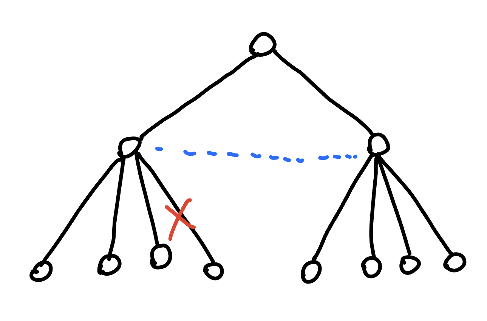

## 利用 dfs 序

- [CF 1065F](https://codeforces.com/problemset/problem/1065/F)

???+note "[CSES - Network Renovation](https://cses.fi/problemset/task/1704)"
	給一顆 $n$ 個點的樹，你要加一些邊使不管斷任何一條邊斷掉整張圖還是連通的
	
	也就是使圖上沒有邊是 bridge (雙連通)
	
	問最少斷幾條邊，並且輸出任意一組解
	
	$n\le 10^5$
	
	??? note "思路"
	    
	    > 參考 : <https://www.youtube.com/watch?v=tRTezLvPZ3k>
	    
	    觀察到要連接的是 leaf 跟 leaf
		
		若不是的話往 leaf 的方向那段會斷掉
		
		<figure markdown>
	      { width="300" }
	    </figure>
	    
	    所以我們**至少**需要 $P_T/2$ 個才能將圖給覆蓋，其中 $P_T$ 為 leaf 的數量
	    
	    因為如果 hooked 的地方不是 leaf，那下面的 edge 就不會被覆蓋到
	    
	    存在一個 pedant centriod，若將樹 rerooted as the pendant centriod
	    
	    每個 subtree 中的 leaf 的數量將會 <= $P_T /2$，所以我們可以 greedy 的每次配當前最大的兩個 subtree，用 prioiryt_queue 可以做到，這個是 $O(n\log P)$ 的解法。
	    
	    其實可以用 i 跟 i + $P_T/2$ 配就一定可以配到「同一個子樹之外」。那假如我們的 root 定在任意點，因為 euler 序列的順序不會因為 root 的改變而改變，所以依然可以照上面的方法將 i 跟 i + $P_T/2$ 配，這個解法是線性時間。

???+note "[2021 全國賽模擬賽 pF. 地洞遊戲](https://tioj.ck.tp.edu.tw/pmisc/pre-nhspc-2021-statements/Cave.pdf)"
	給定一棵 $N$ 點的有根樹，邊是由根往底下連的
	
	葉節點都有一條新的有向邊連接 $u\to a_u$，其中 $a_u$ 一定是 $1\to \ldots \to u$ 中的一點
	
	同一個葉節點不能 visit 超過一次
	
	從節點 $1$ 出發，問是否能 visit 所有葉節點，構造任意一組葉節點的 visit 順序
	
	$N \le 3\times 10^5$
	
	<figure markdown>
	  { width="200" }
	  <figcaption>例如此圖的順序就是 $5\to 4\to 2$</figcaption>
	</figure>
	
	??? note "思路"
		[重要性質] : 若存在至少一組合法解，則必存在一組合法解使的他是某個dfs序
		
		[引理] : 可以發現對於定根 $u$ 來說，最多只有一個子樹，他的所有葉子走完以後無法回到 $u$ 或他的祖先
		
	    使用樹 DP。令 $depth_v$ 為 $v$ 的深度，且令 $dp_u$ 為繞完這棵子樹後可以回到的最淺深度。轉移如下：
	
	    - 如果子樹中有至少兩個 $dp_{son}$ 都大於 $depth_u$，則其中一個繞完以後就回不了另一個了，必定無解。
	    
	    - 如果子樹中恰有一個 $dp_{son}$ 大於 $depth_u$，則這個子樹要放到最後才走，$dp_u = dp_{son}$
	    
	    - 如果子樹中沒有 $dp_{son}$ 大於 $depth_u$，則任意一個子樹都能當最後一個走到的，由於我們要深度最淺的，因此 $dp_u$ 就是所有 $dp_{son}$ 的最小值
	
		構造的話找出就直接去 dfs，在過程中先去 dfs 合法的子樹，再去 dfs 不合法的
		
		合法的子樹內的順序可以任意
		
		```cpp
		void dfs (int u) {
			if (u is leaf) print (u);
			
			int last = -1;
			for (auto v : G[u]) {
				if (v is legal) dfs (v);
				else last = v;
			}
			
			if (last == -1) continue;
			
			dfs (last);
		}
		```