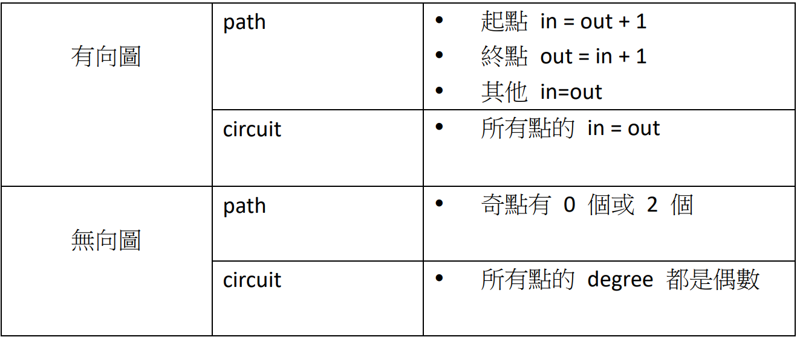
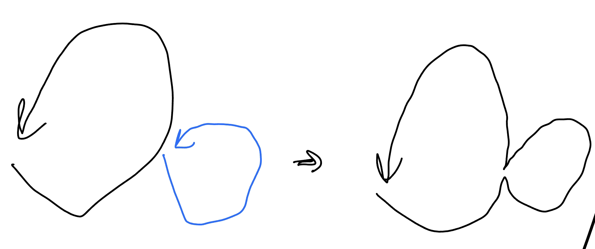
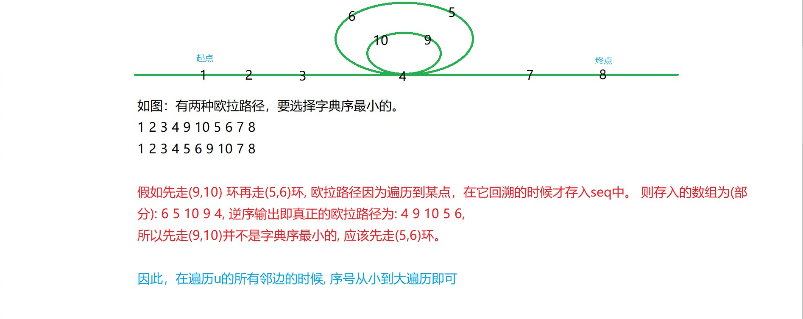
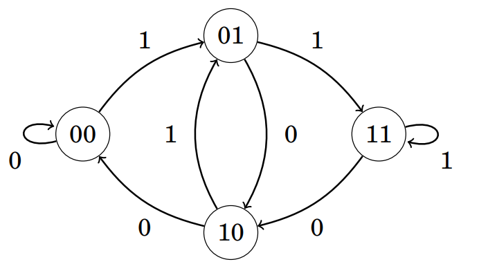

## 歐拉迴路

### 問題

???+note "一筆畫問題"
	給一張無向圖，問是否存在一條路徑「經過每條邊恰好一次」

### 有解條件

<figure markdown>
  { width="600" }
</figure>

### Hierholzer’s Algorithm

???+note "問題"
	給一張無向圖，輸出歐拉迴路序列
	
我們可以先找一個環，再找令一個環，將其合併，一直做下去。這邊有一個性質，令第一個環的歐拉迴路序列為 c1，另一個為 c2，合併後會變成 「c1 的某個前綴 + c2 + c1 剩下的後綴」，可以想成會在 c1 上從後往前一直插入新的歐拉迴路序列 ci[^1]。

<figure markdown>
  { width="400" }
</figure>

但上面合併 cycle 的方式在實作會相對複雜。Hierholzer’s Algorithm 的想法是一直 dfs 下去直到 get stucked（stucked 的點一定是開始的點，也就是會形成一個環，因為 for all degree = even），然後 backtracking 到上一個還可以走的點繼續 dfs。backtracking 的這些點就代表已經沒有 degree 可以走了，可以 push back 到答案裡面

至於我們要怎麼實作呢，我們可以去進行「後序 dfs」，因為後序的性質是將所有小孩都走完後，才將自己 push back 到答案裡面，最後若要輸出答案記得要倒著輸出。以下是 pseudocode

```cpp linenums="1" title="Euler CirCuit Finding - Pseudo Code"
void dfs(int u) {
	for (v in 還沒 visit 過的 G[u]) {
		dfs(v);
		ans.pb({u, v});
	}
}
```

這是無向圖迴路的做法，若為有向圖或歐拉路徑的話也是可以這樣做的

??? note "code"
	```cpp linenums="1"
	void dfs(int u) {
        while(G[u].size()) {
            auto [v, eid] = G[u].back();
            G[u].pop_back();

            if (vis[eid]) continue;
    
            vis[eid] = 1;
            dfs(v);
            ans.pb(id);
        }
    }
    ```

### 例題

#### 模板題

???+note "模板 [LOJ #10105. 「一本通 3.7 例 1」欧拉回路](https://loj.ac/p/10105)"
	給一張圖，找出歐拉迴路，即在圖中找一個環使得每條邊都在環上出現恰好一次，有兩個子任務
	
	- 這張圖是無向圖
	
	- 這張圖是有向圖
	
	$n\le 10^5,m\le 2\times 10^5$
	
	??? note "code"
		```cpp linenums="1"
		#include <bits/stdc++.h>
	    #define int long long
	    #define pii pair<int, int>
	    #define pb push_back
	    #define mk make_pair
	    #define F first
	    #define S second
	    #define ALL(x) x.begin(), x.end()
	
	    using namespace std;
	
	    const int N = 1e6, M = 1e6;
	    int t, n, m, in[N], out[N], ans[M], vis[M], top;
	    vector<pii> G[N];
	
	    void dfs(int u) {
	        while(G[u].size()) {
	            auto [v, id] = G[u].back();
	            G[u].pop_back();
	
	            if (vis[abs(id)]) continue;
	
	            vis[abs(id)] = 1;
	            dfs(v);
	            ans[++top] = id;
	        }
	    }
	
	    signed main() {
	        cin >> t >> n >> m;
	
	        for (int i = 1; i <= m; i++) {
	            int u, v;
	            cin >> u >> v;
	            G[u].pb({v, i});
	
	            if (t == 1) {
	                G[v].pb({u, -i});
	            }
	
	            out[u]++, in[v]++;
	        }
	
	        if (t == 1) {
	            for (int i = 1; i <= n; i++) {
	                if ((in[i] + out[i]) % 2) {
	                    cout << "NO\n";
	                    return 0;
	                }
	            }
	        }
	
	        if (t == 2) {
	            for (int i = 1; i <= n; i++) {
	                if (in[i] != out[i]) {
	                    cout << "NO\n";
	                    return 0;
	                }
	            }
	        }
	
	        for (int i = 1; i <= n; i++) {
	            if (G[i].size()) {
	                dfs(i);
	                break;
	            }
	        }
	
	        if (top != m) {
	            cout << "NO\n";
	            return 0;
	        }
	
	        cout << "YES\n";
	
	        for (int i = top; i >= 1; i--) {
	            cout << ans[i] << '\n';
	        }
	        return 0;
	    }
	    ```

???+note "[TIOJ 1084 . 一筆畫問題](https://tioj.ck.tp.edu.tw/problems/1084)"
	給 n 點 m 邊無向圖，輸出字典序最小的歐拉路徑
	
	??? note "思路"
		一樣用 circuit 的 code 下去做即可，只是用 set 去維護 adjacency list
		
		按照「先往編號小的節點走」的策略 DFS
		
		<figure markdown>
          { width="400" }
        </figure>

#### 有解條件分析

???+note "<a href="/wiki/graph/images/ioic_511.html" target="_blank">2023 IOIC  511 . 找錢包</a>"
	給 n 點 m 邊的圖，有 k 條特殊邊，問是否能在每條邊走不超過一次下，走過所有特殊邊，且要從 1 走到 n
	
	$2\le n\le 2\times 10^5,1\le m\le 4\times 10^4$
	
	??? note "思路"
		先將 1 → n 建一條邊，這樣就變迴路的 case，更單純（for all degree = even）
	
	    k = m: 歐拉迴路
	
	    k < m: 歐拉迴路，只是可以利用選非特殊邊，來將點的 degree 改變。考慮只有非特殊邊的圖，同一個連通塊內的才能兩兩配，互相抵消，所以一個連通塊內的奇點數量一定要是偶數才合法。
	
	??? note "code"
	    ```cpp linenums="1"
	    #include <bits/stdc++.h>
	    #define int long long
	    #define pii pair<int, int>
	    #define pb push_back
	    #define mk make_pair
	    #define F first
	    #define S second
	    #define ALL(x) x.begin(), x.end()
	
	    using namespace std;
	
	    const int N = 4e5 + 5;
	
	    int n, m, k, cnt;
	    int deg[N];
	    bool vis[N];
	    vector<int> G[N];
	
	    void dfs(int u) {
	        vis[u] = 1;
	        cnt += deg[u];
	        for (int v : G[u]) {
	            if (vis[v]) continue;
	            dfs(v);
	        }
	    }
	
	    signed main() {
	        cin >> n >> m >> k;
	        m -= k;
	        for (int i = 1; i <= k; i++) {
	            int u, v;
	            cin >> u >> v;
	            deg[u] ^= 1, deg[v] ^= 1;
	        }
	        deg[1] ^= 1, deg[n] ^= 1;
	        for (int i = 1; i <= m; i++) {
	            int u, v;
	            cin >> u >> v;
	            G[u].pb(v);
	            G[v].pb(u);
	        }
	
	        for (int i = 1; i <= n; i++) {
	            if (!vis[i]) {
	                cnt = 0;
	                dfs(i);
	                if (cnt & 1) {
	                    cout << "No\n";
	                    exit(0);
	                }
	            }
	        }
	        cout << "Yes\n";
	    }
	    ```

???+note "[CF 788 B. Weird journey](https://codeforces.com/problemset/problem/788/B)"
	給一張 n 點 m 邊的無向圖，問有多少對邊的 pair$(e_i, e_j)$ 滿足存在一條路徑經過這兩條邊恰好一次且經過剩餘的每條邊恰兩次
	
	$n,m\le 10^6$
	
	??? note "思路"
		可以想成將每條邊都複製一條，由於複製後每個點的 degree 均為偶數，只要**所有的邊**都連通，歐拉路徑就一定存在。我們只需考慮刪去兩條邊後歐拉路徑是否還存在
	
	    1. 如果刪的是兩條不相交的非自環邊，那麼會產生四個度為奇數的點 ⇒ 不存在歐拉路徑
	    2. 如果刪的是兩條相交的非自環邊，那麼會產生兩個度為奇數的點 ⇒ 存在歐拉路徑
	    3. 如果刪的是兩個自環邊，那麼所有點度依舊為偶數 ⇒ 存在歐拉路徑
	    4. 如果刪的是一條非自環邊和一個自環邊，那麼會產生兩個度為奇數的點 ⇒ 存在歐拉路徑
	
	    綜上，對於一條邊 (u, v) ，如果是自環，那麼該自環配上任意一條其他邊均可，方案數 m - 1。如果是非自環，那麼該非自環邊配上任意一個自環或者配上一條與自己相交的邊均可，方案數 (deg[u] - 1) + (deg[v] - 1) + (自環數量) ，注意這樣以來每個方案會被算兩次，故求出答案後除 2
	    
	    > 參考自 : <https://blog.csdn.net/V5ZSQ/article/details/79055623>
		
	??? note "code"
		```cpp linenums="1"
		#include <bits/stdc++.h>
	    #define int long long
	    #define pb push_back
	    #define mk make_pair
	    #define F first
	    #define S second
	    #define ALL(x) x.begin(), x.end()
	
	    using namespace std;
	    using pii = pair<int, int>;
	
	    const int INF = 2e18;
	    const int maxn = 1e6 + 5;
	    const int M = 1e9 + 7;
	
	    struct DSU {
	        vector<int> par, sz;
	
	        DSU (int n = 0) : par(n), sz(n, 1) {
	            for (int i = 0; i < n; i++) {
	                par[i] = i;
	            }
	        }
	        int find(int x) {
	            if (par[x] == x) return x;
	            return par[x] = find(par[x]);
	        }
	        bool merge(int u, int v) {
	            u = find(u), v = find(v);
	            if (u == v) return false;
	            if (sz[u] < sz[v]) swap(u, v);
	            par[v] = u;
	            sz[u] += sz[v];
	            return true;
	        }
	    };
	
	    int n, m;
	    vector<pii> edges;
	    int deg[maxn];
	    bool vis[maxn];
	
	    signed main() {
	        ios::sync_with_stdio(0);
	        cin.tie(0);
	        cin >> n >> m;
	        DSU dsu(n);
	        int cnt = 0;
	        for (int i = 0; i < m; i++) {
	            int u, v;
	            cin >> u >> v;
	            u--, v--;
	            edges.pb({u, v});
	            vis[u] = vis[v] = true;
	            if (u != v) {
	                deg[u]++;
	                deg[v]++;
	                dsu.merge(u, v);
	            } else {
	                cnt++;
	            }
	        }
	        int num = 0;
	        for (int i = 0; i < n; i++) {
	            if (vis[i] && dsu.find(i) == i) {
	                num++;
	            }
	        }
	        if (num != 1) {
	            cout << '0' << '\n';
	            exit(0);
	        }
	        int ans = 0;
	        for (auto [u, v] : edges) {
	            if (u == v) ans += m - 1;
	            else ans += (deg[u] - 1) + (deg[v] - 1) + cnt;
	        }
	        cout << ans / 2 << '\n';
	    } 
	    ```

#### 建圖

???+note "[CF 1634 E. Fair Share](https://codeforces.com/problemset/problem/1634/E)"
	給 m 個長度為偶數的陣列，將每個陣列中一半的元素丟到 multiset L 裡面，另一半丟到 multiset R 裡面，最後 L 和 R 裡面每一種數值出現的次數要一樣。輸出每個元素是屬於 L 或 R
	
	總元素個數 $\le 2\times 10^5$
	
	??? note "思路"
		如果有一種數字出現奇數次，那就無解。否則，我們試著把元素放到圖上面，每個元素都有兩個屬性 : 數值和所在的陣列，所以就幫每個陣列和每種數值各開一個節點，對於每個元素，在它的數值和陣列對應的節點間加一條邊。
	
		可以發現到所有節點的度數都是偶數，符合有歐拉迴路的條件。找出歐拉迴路，然後讓第奇數條邊在 L、第偶數條在 R，因為相鄰兩條邊是共點的，因此每個點相鄰的邊中，在 L 的數量和在 R 的數量是一樣的，符合題目要的條件。
	    
	    實作上先判有沒有數字出現奇數次。對於每個連通塊去找歐拉迴路，讓第奇數條邊在 L、第偶數條在 R 即可。
	    
		> 參考自 : [師大附中延平中學競技程式讀書會證明與綜合練習](https://drive.google.com/file/d/1q2mP9uHYAauroE2mjtYKti9khs0H9qaJ/view)

???+note "[TOI 2022 二模 pC. 燈光設計（Lantern）](https://drive.google.com/file/d/12lrTQkrL1-W0Ce_f7OBPfR5AoL8pfhw-/view)"
	給你 $4n$ 個數字，編號 $1, 2,..., 4n$。第 $i$ 個燈的顏色是 $c_i$，顏色在 $0, 1, ..., n-1$ 之間，每種顏色恰出現 $4$ 次。選 $2n$ 個數字，使每個顏色恰出現兩次，且總和與沒選的數字總和一樣。接著把這些數字兩兩配對並加總，目標是讓總和最大的一對和總和最小的一對相差盡量小。無解輸出 -1，或輸出配對的結果
	
	$n\le 10^5$
	
	??? note "思路"
		令 $N = 4n + 1$，觀察範例可以發現每個有選的 pair$(i, j)$ 都是 $i + j = N$，可以寫成 pair$(i, N - i)$，所以我們的目標是要選一些 pair$(i, N - i)$ 使每種顏色恰出現兩次。我們可以以顏色為點，將 $c_i$ 與 $c_{N - i}$ 連邊，跑歐拉迴路，奇數邊選，偶數邊不選。可以發現，每個點的 degree 都是偶數，所以是不會有無解的 case 的。
		
		> 參考自 : [師大附中延平中學競技程式讀書會證明與綜合練習](https://drive.google.com/file/d/1q2mP9uHYAauroE2mjtYKti9khs0H9qaJ/view)

## K-筆畫問題

【定理】 : 如果連通無向圖 G 有 2k 個奇頂點，至少要用 k 筆畫成

??? info "任意一張無向圖的奇點數量只會有偶數個"
	total degree = sum(even degree) + sum(odd degree)

    ⇒ total degree - sum(even degree) = sum(odd degree)
    
    因為 total degree 和 sum(even degree) 一定都是 even
    
    ⇒ even = sum(odd degree)

## 中國郵差問題

???+note "[HIT 2739 The Chinese Postman Problem](https://vjudge.net/problem/HIT-2739)"
	給一張 n 點 m 邊無向圖，要經過每條邊至少一次，最後回到起點，問最小總權值是多少。
	
	$2 \le n \le 100, 1 \le m \le 2000,0<w_i\le 1000$

若 degree 都是 even ⇒ 每條 edge 都經過一次。

考慮只有兩個奇點的 case，需要多走一趟把頭尾的 degree 變成偶數，所以答案會是 sum(w) + dis(u → v) 

若有 2k 個奇點，那就是找二分圖最小權重完美匹配

### 習題

???+note "[CF 21 D. Traveling Graph](https://codeforces.com/problemset/problem/21/D)"
	給一張 n 點 m 邊的帶權無向圖，找一個包含 node 1 的最短迴路，使每條邊都被用至少一次
	
	$n\le 15,m\le 2000,1\le w_i\le 10^4$
	
	??? note "思路"
		因為點只有 15 個，我們可以使用 bitmask dp

## De Bruijn sequences

De Bruijn sequence 是由 k 種不同符號組成，且其所有長度為 n 之連續子序列恰為 k 種符號組成長度為 n 的所有排列。

我們可以將其建圖，將每個長度為 n - 1 的頭刪掉後，將尾接上，連到其他點去，這張圖會有恰 $k^n$ 條邊，每個點的 in degree 與 out degree 皆為 k - 1，符合歐拉迴路的條件。例如 n = 3, k = 2 時，000 將頭刪除，後面接上 1 後變 001，故 00 會連接到 01，邊上的數字為 1 :

<figure markdown>
  { width="300" }
</figure>

可以看到恰可形成一個歐拉迴路

> 詳細可以參考 : [CSES Hand Book](https://cses.fi/book/book.pdf#page=178)

???+note "[CSES - De Bruijn Sequence](https://cses.fi/problemset/task/1692)"
	給 n，輸出 k = 2 時的 De Bruijn Sequence
	
	$1\le n\le 15$
	
	??? note "code"
		```cpp linenums="1"
		#include <bits/stdc++.h>
	    #define int long long
	    #define pb push_back
	    #define mk make_pair
	    #define F first
	    #define S second
	    #define ALL(x) x.begin(), x.end()
	
	    using namespace std;
	    using pii = pair<int, int>;
	
	    const int maxn = 3e5 + 5;
	
	    struct Edge {
	        int v, w, eid;
	    };
	
	    int m;
	    vector<Edge> G[maxn];
	    vector<int> ans;
	
	    void dfs(int u) {
	        while (G[u].size()) {
	            auto [v, w, eid] = G[u].back();
	            G[u].pop_back();
	            dfs(v);
	            ans.pb(w);
	        }
	    }
	
	    void add_edge(int u, int v, int w) {
	        G[u].pb({v, w, m++});
	    }
	
	    signed main() {
	        int n;
	        cin >> n;
	        if (n == 1) {
	            cout << "01\n";
	            exit(0);
	        }
	
	        for (int i = 0; i < (1 << n); i++) {
	            int tmp = i - (i & (1 << (n - 2)));
	            tmp <<= 1;
	            add_edge(i, tmp + 1, 1);
	            add_edge(i, tmp, 0);
	        }
	        dfs(0);
	        for (int i = 0; i < n - 1; i++) {
	            cout << "0";
	        }
	        reverse(ALL(ans));
	        for (int it : ans) cout << it;
	    } 
	    ```

### 習題

???+note "[CF 508 D. Tanya and Password](https://codeforces.com/problemset/problem/508/D)"
	有一個長度 n + 2 的字串 s，給你它每個長度為 3 的子字串，請輸出任意一種 s。
	
	$1\le n\le 2\times 10^5,s\in \{\texttt{a}\ldots \texttt{z}, \texttt{A}\ldots \texttt{Z}, \texttt{1}\ldots \texttt{9}\}$
	
	??? note "思路"
		跟上面的一樣，例如有兩個 substring aba, bac，那就建立 ba → ac，邊上的數字為 c
		
		最後的答案就是 (開頭的 substring) + (歐拉迴路邊上字元所組成的序列)
		
		令 a…z, A…z, 1…9 共是 m 種數字。每個點的 degree 最多是 m，所以 edge 最多 n * m 條。點是由兩個數字接起來，所以最多 m * m 個。總複雜度 O(n * m) = O(61 * n)

---

## 參考資料

- <https://liuzhenglaichn.gitbook.io/algorithm/graph/eulerian-path>

- <http://pisces.ck.tp.edu.tw/~peng/index.php?action=showfile&file=f0b00e42978035a90f533cc2421cff2c19e41bb55>

- <https://blog.csdn.net/kdazhe/article/details/122160401>

- <https://drive.google.com/file/d/1q2mP9uHYAauroE2mjtYKti9khs0H9qaJ/view>


[^1]: 見<a href="/wiki/graph/images/56.png" target="_blank">此圖</a>，(畫底線的字代表還有 degree 可以走，藍色代表新插入的歐拉迴路序列)