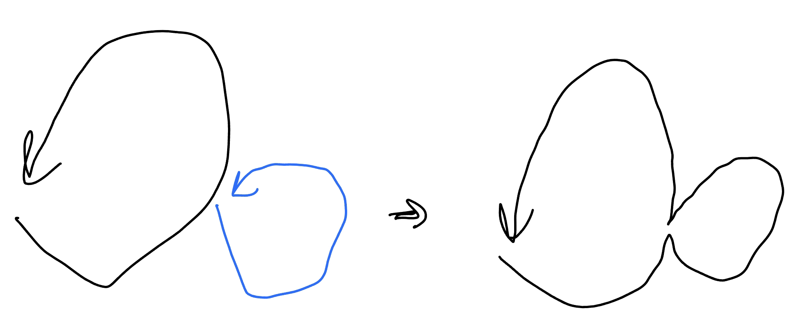

## 問題

???+note "歐拉迴路"
	找一條經過圖中每一條邊皆恰好一次的路徑，從起點開始，起點結束

## 有解條件

### 有向圖

#### trail

- 起點 in = out + 1

- 終點 out = in + 1

- 其他 in=out

#### circuit

- for all in = out

### 無向圖

#### trail

- 起點, 終點 degree = odd 

- 或 起點, 終點 degree = even

#### circuit

- for all degree = even

## Hierholzer’s Algorithm

???+note "問題"
	給一張無向圖，輸出歐拉迴路序列
	
我們可以先找一個環，再找令一個環，將其合併，一直做下去。這邊有一個性質，令第一個環的歐拉迴路序列為 c1，另一個為 c2，合併後會變成 「c1 的某個前綴 + c2 + c1 剩下的後綴」，可以想成會在 c1 上從後往前一直插入新的歐拉迴路序列 ci[^1]。

<figure markdown>
  { width="400" }
</figure>

但上面合併 cycle 的方式在實作會相對複雜。Hierholzer’s Algorithm 的想法是一直 dfs 下去直到 get stucked（stucked 的點一定是開始的點，也就是會形成一個環，因為 for all degree = even），然後 backtracking 到上一個還可以走的點繼續 dfs。backtracking 的這些點就代表已經沒有 degree 可以走了，可以 push back 到答案裡面

至於我們要怎麼實作呢，我們可以去進行「後序 dfs」，因為後序的性質是將所有小孩都走完後，才將自己 push back 到答案裡面，最後若要輸出答案記得要倒著輸出。以下是 pseudocode

```cpp linenums="1" title="Euler CirCuit Finding - Pseudo Code"
void dfs(int u) {
	for (v in 還沒 visit 過的 G[u]) {
		dfs(v);
		ans.pb({u, v});
	}
}
```

??? note "code"
	```cpp linenums="1"
	void dfs(int u) {
        while(G[u].size()) {
            auto [v, eid] = G[u].back();
            G[u].pop_back();

            if (vis[eid]) continue;

            vis[eid] = 1;
            dfs(v);
            ans.pb(id);
        }
    }
	```

## 例題

???+note "模板 [LOJ #10105. 「一本通 3.7 例 1」欧拉回路](https://loj.ac/p/10105)"
	給一張圖，找出歐拉迴路，即在圖中找一個環使得每條邊都在環上出現恰好一次，有兩個子任務
	
	- 這張圖是無向圖
	
	- 這張圖是有向圖
	
	$n\le 10^5,m\le 2\times 10^5$
	
	??? note "code"
		```cpp linenums="1"
		#include <bits/stdc++.h>
	    #define int long long
	    #define pii pair<int, int>
	    #define pb push_back
	    #define mk make_pair
	    #define F first
	    #define S second
	    #define ALL(x) x.begin(), x.end()
	
	    using namespace std;
	
	    const int N = 1e6, M = 1e6;
	    int t, n, m, in[N], out[N], ans[M], vis[M], top;
	    vector<pii> G[N];
	
	    void dfs(int u) {
	        while(G[u].size()) {
	            auto [v, id] = G[u].back();
	            G[u].pop_back();
	
	            if (vis[abs(id)]) continue;
	
	            vis[abs(id)] = 1;
	            dfs(v);
	            ans[++top] = id;
	        }
	    }
	
	    signed main() {
	        cin >> t >> n >> m;
	
	        for (int i = 1; i <= m; i++) {
	            int u, v;
	            cin >> u >> v;
	            G[u].pb({v, i});
	
	            if (t == 1) {
	                G[v].pb({u, -i});
	            }
	
	            out[u]++, in[v]++;
	        }
	
	        if (t == 1) {
	            for (int i = 1; i <= n; i++) {
	                if ((in[i] + out[i]) % 2) {
	                    cout << "NO\n";
	                    return 0;
	                }
	            }
	        }
	
	        if (t == 2) {
	            for (int i = 1; i <= n; i++) {
	                if (in[i] != out[i]) {
	                    cout << "NO\n";
	                    return 0;
	                }
	            }
	        }
	
	        for (int i = 1; i <= n; i++) {
	            if (G[i].size()) {
	                dfs(i);
	                break;
	            }
	        }
	
	        if (top != m) {
	            cout << "NO\n";
	            return 0;
	        }
	
	        cout << "YES\n";
	
	        for (int i = top; i >= 1; i--) {
	            cout << ans[i] << '\n';
	        }
	        return 0;
	    }
	    ```
	    
???+note "[TIOJ 1084 . 一筆畫問題](https://tioj.ck.tp.edu.tw/problems/1084)"
	給 n 點 m 邊無向圖，輸出字典序最小的歐拉路徑
	
	??? note "思路"
		一樣用 circuit 的 code 下去做即可，只是用 set 去維護 adjacency list
	
???+note "<a href="/wiki/graph/images/ioic_501.html" target="_blank">2023 IOIC  511 . 找錢包</a>"
	給 n 點 m 邊的圖，有 k 條特殊邊，問是否能在每條邊走不超過一次下，走過所有特殊邊，且要從 1 走到 n
	
	$2\le n\le 2\times 10^5,1\le m\le 4\times 10^4$
	
	??? note "思路"
		先將 1 → n 建一條邊，這樣就變迴路的 case，更單純（for all degree = even）

        k = m: 歐拉迴路

        k < m: 歐拉迴路，只是可以利用選非特殊邊，來將點的 degree 改變。考慮只有非特殊邊的圖，同一個連通塊內的才能兩兩配，互相抵消，所以一個連通塊內的奇點數量一定要是偶數才合法。
	
    ??? note "code"
        ```cpp linenums="1"
        #include <bits/stdc++.h>
        #define int long long
        #define pii pair<int, int>
        #define pb push_back
        #define mk make_pair
        #define F first
        #define S second
        #define ALL(x) x.begin(), x.end()

        using namespace std;

        const int N = 4e5 + 5;

        int n, m, k, cnt;
        int deg[N];
        bool vis[N];
        vector<int> G[N];

        void dfs(int u) {
            vis[u] = 1;
            cnt += deg[u];
            for (int v : G[u]) {
                if (vis[v]) continue;
                dfs(v);
            }
        }

        signed main() {
            cin >> n >> m >> k;
            m -= k;
            for (int i = 1; i <= k; i++) {
                int u, v;
                cin >> u >> v;
                deg[u] ^= 1, deg[v] ^= 1;
            }
            deg[1] ^= 1, deg[n] ^= 1;
            for (int i = 1; i <= m; i++) {
                int u, v;
                cin >> u >> v;
                G[u].pb(v);
                G[v].pb(u);
            }

            for (int i = 1; i <= n; i++) {
                if (!vis[i]) {
                    cnt = 0;
                    dfs(i);
                    if (cnt & 1) {
                        cout << "No\n";
                        exit(0);
                    }
                }
            }
            cout << "Yes\n";
        }
        ```

---

## 參考資料

- <https://liuzhenglaichn.gitbook.io/algorithm/graph/eulerian-path>

- <http://pisces.ck.tp.edu.tw/~peng/index.php?action=showfile&file=f0b00e42978035a90f533cc2421cff2c19e41bb55>

- [山姆的競程日記 - 2019 北市賽](https://sam571128.codes/2020/09/30/TIOJ-2019-Taipei-Contest/#%E7%AC%AC%E4%B8%89%E9%A1%8C%EF%BC%9A%E6%89%93%E5%8D%A1%E9%81%8A%E6%88%B2-Checkin)

- 中國郵差
	- https://drive.google.com/file/d/1k5vChKRoRRVM7KBxMl4vxdKg_qG1nCCP/view

- <https://blog.csdn.net/kdazhe/article/details/122160401>

- <https://drive.google.com/file/d/1q2mP9uHYAauroE2mjtYKti9khs0H9qaJ/view>


[^1]: 見<a href="/wiki/graph/images/56.png" target="_blank">此圖</a>，(畫底線的字代表還有 degree 可以走，藍色代表新插入的歐拉迴路序列)