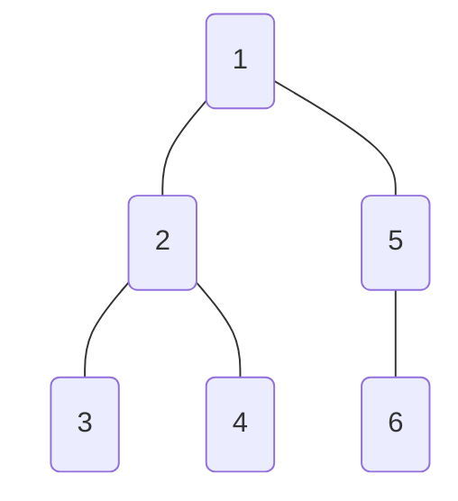
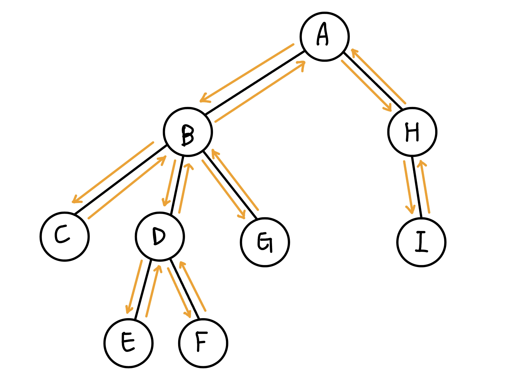

## DFS 序

首先是 DFS 序（Depth-First Search Order）。DFS 序是在深度優先搜索過程中，記錄節點訪問的順序。具體來說，DFS 序是在進入 dfs 的時候與出去 dfs 的時候會將點分別加入 stack 中。

讓我們通過一個示例來理解 DFS 序。考慮下面的樹結構：

dfs 序 = [1, 2, 3, 3, 4, 4, 2, 5, 6, 6, 5, 1]

	
## 歐拉序

歐拉序是通過從樹的根節點開始，按照 DFS 遍歷的順序訪問每個節點的方式得到的序列。具體來說，當我們遇到一個節點時，將其加入到序列中；當我們返回右再次遇到這個節點時，也將其加入到序列中，而 dfs order 是只有在要離開一個點時才加入。

<figure markdown>
  { width="300" }
  <figcaption> euler tour = [A, B, C, B, D, E, D, F, D, B, G, B, A, H, I, H, A]</figcaption>
</figure>

歐拉序又稱 euler tour，將 dfs 依序碰到的點都列出來。每條邊走過一次會恰貢獻一個點，而每條邊會走過兩次，所以相當於 $2n-2$ 個點，但還要加上起點，所以歐拉序的長度是 $2n-1$

??? question "換根後 euler tour 序列 order 不變"
    <figure markdown>
      { width="200" }
    </figure>

    上圖的歐拉序列為 
    
    $$[1,2,3,2,1,5,6,5,1,4,1]$$
    
    我們將歐拉序列延伸一倍，相當於表示成一個環 
    
    $$[1,2,3,2,1,5,6,5,1,4,1,1,2,3,2,1,5,6,5,1,4,1]$$
    
    那換以 $5$ 為根呢 ?
    
    $$[1,2,3,2,1,5,6,\underbrace{5,1,4,1,1,2,3,2,1,5,6,5},1,4,1]$$

## 例題

???+note "[CSES - path queries](https://cses.fi/problemset/task/1138)"
	給定一個有根樹，點編號 $1,2,\ldots, n$，$1$ 是 root
	
	每個節點一開始都有一個 value
	
	$q$ 個操作，每次會是以下一種 :
	
	- $\text{modify}(x,v):$ 把節點 $x$ 的 value 變成 $v$ 
	- $\text{sum}(rt,x):$ 求 $\texttt{root} \to \ldots \to x$ 的 value 總和
	
	$n,m\le 2\times 10^5$
	
	??? note "思路"
		建立 DFS 序
		
		每次要 query 時計算 $1\sim \texttt{in}[x]$
		
		要修改某個點值就將 $\texttt{in}[x],\texttt{out}[x]$ 都修改成該值

???+note "[CSES - Subtree Queries](https://cses.fi/problemset/task/1137)"
	給定一個有根樹，點編號 $1,2,\ldots, n$，$1$ 是 root
	
	每個節點一開始都有一個 value
	
	$q$ 個操作，每次會是以下一種 :
	
	- $\text{modify}(x,v):$ 把節點 $x$ 的 value 變成 $v$ 
	- $\text{SubtreeSum}(x):$ 求 $x$ 的子樹的 value 總和
	
	$n,m\le 2\times 10^5$
	
	??? note "思路"
		建立 DFS 序
		
		每次要 query 時計算 $\texttt{in}[x]\sim \texttt{out}[x]-1$
		
		要修改某個點值就將 $\texttt{in}[x]$ 修改成該值

???+note "[全國賽 2021 pG](https://tioj.ck.tp.edu.tw/problems/2257)"
	給定一棵 $n$ 點有根樹，一開始每條邊權重都是 $1$
	
	$q$ 個操作，每次會是以下一種 :
	
	- 把某條邊的權重變 $0$
	
	- 詢問根節點到某一節點的權重和
	
	$n,q\le 10^5$
	
	??? note "思路"
		建立 DFS 序
		
	    每次要 query 時計算 $1\sim \texttt{in}[x]$
	    
		修改 $\texttt{edge}(u,v):$ 將 $\texttt{in}[v]+x,\texttt{out}[u]-x$