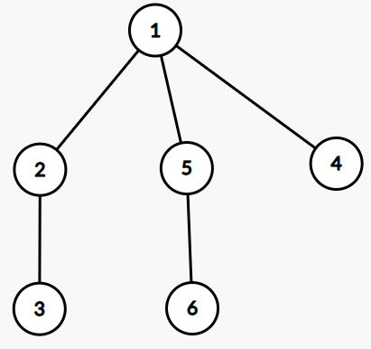

## Euler Tour Technique

### DFS 序

<figure markdown>
  { width="200" }
</figure>

上圖的 DFS 序列為 

$$[1,2,3,3,2,5,6,6,5,4,4,1]$$

#### DFS 序判定祖孫關係

下面，我們以模板題祖孫詢問來說明歐拉序如何判斷位置關係。

對於每個點，我們開兩個數組 in 與 out 來記錄每個點的入棧和出棧時在歐拉序中是第幾個。
還是以上圖為例，那麼

$$\begin{array}{|c|c|c|c|c|c|c|}
\hline
i & 1 & 2 & 3 & 4 & 5 & 6 \\\\ \hline
\texttt{in} & 1 & 2 & 3 & 10 & 6 & 7 \\\\ \hline
\texttt{out} & 12 & 5 & 4 & 11 & 9 & 8 \\\\ \hline
\end{array}$$

不難發現，一個點 $x$ 是 $y$ 的祖先，當且僅當 $x$ 比 $y$ 早入棧且 $x$ 比 $y$ 晚出棧

即 $\texttt{in}[x] \le \texttt{in}[y] \texttt{ and } \texttt{out}[x] \ge \texttt{out}[y]$

這裡用了等於是如果 $x = y$ 了，那麼也算是祖先，避免了這種情況。

於是程序就很容易寫出來了：

???+note "code"
	```cpp linenums="1"
    void dfs (int u) {
        in[u] = ++stamp; 
        for(auto v : G[u]) {
            if (v == par) continue;
            if (!in[v]) dfs(v);
        }
        out[u] = ++stamp;  
    }

    bool check (int x,int y) {
        return (in[x] <= in[y] and out[x] >= out[y]);
    }
    ```

而且複雜度是 $O(n+m)$

#### 找 LCA

祖孫判定 + 倍增也可以用來找 LCA

??? note "code"
	```cpp linenums="1"
	#include <iostream>
    #include <cmath>

    using namespace std;
    const int N = 2e5 + 5;
    
    int n, m, h;
    int head[N], to[N], nxt[N], cnt;
    int ein[N], eout[N], tot;
    int d[N], f[N][21];
    
    void add(int x, int y) {
        to[++cnt] = y;
        nxt[cnt] = head[x];
        head[x] = cnt;
    }
    
    void dfs(int x, int fa) {
        f[x][0] = fa;
    
        for (int i = 1; i <= h; i++)
            f[x][i] = f[f[x][i - 1]][i - 1];
    
        d[x] = d[fa] + 1; //树上前缀和
        ein[x] = ++tot;
    
        for (int i = head[x]; i; i = nxt[i]) {
            int y = to[i];
    
            if (y != fa)
                dfs(y, x);
        }
    
        eout[x] = ++tot;
    }
    
    bool up(int x, int y) {
        return (ein[x] <= ein[y] and eout[x] >= eout[y]);
    }
    
    int lca(int x, int y) {
        if (up(x, y))
            return x;
    
        if (up(y, x))
            return y;
    
        for (int i = h; i >= 0; i--)
            if (!up(f[x][i], y) and f[x][i] != 0)
                x = f[x][i];
    
        return f[x][0];
    }
    
    int main() {
        cin >> n;
        h = log(n) / log(2) + 1; //深度
    
        for (int i = 1; i < n; i++) {
            int x, y;
            cin >> x >> y;
            add(x, y);
            add(y, x);
        }
    
        dfs(1, 0);  //处理欧拉序
        cin >> m;
    
        while (m--) {
            int x, y;
            cin >> x >> y;
            cout << d[x] + d[y] - 2 * d[lca(x, y)] << endl;
        }
    
        return 0;
    }
    ```

### 歐拉序

又稱 euler tour

<figure markdown>
  { width="200" }
</figure>

上圖的歐拉序列為 

$$[1,2,3,2,1,5,6,5,1,4,1]$$

> 參考 :<br><https://www.cnblogs.com/fusiwei/p/13684547.html><br><https://usaco.guide/gold/tree-euler?lang=cpp>

歐拉序中出現的次數等於這個點的度數，所以歐拉序的長度是 $2n-1$

??? question "換根後 euler tour 序列 order 不變"
    <figure markdown>
      { width="200" }
    </figure>

    上圖的歐拉序列為 
    
    $$[1,2,3,2,1,5,6,5,1,4,1]$$
    
    我們將歐拉序列延伸一倍，相當於表示成一個環 
    
    $$[1,2,3,2,1,5,6,5,1,4,1,1,2,3,2,1,5,6,5,1,4,1]$$
    
    那換以 $5$ 為根呢 ?
    
    $$[1,2,3,2,1,5,6,\underbrace{5,1,4,1,1,2,3,2,1,5,6,5},1,4,1]$$

#### 找 LCA

歐拉序 + Sparse Table 可以在 $O(1)$ query 找到 LCA

### 例題

???+note "[CSES - path queries](https://cses.fi/problemset/task/1138)"
	給定一個有根樹，點編號 $1,2,\ldots, n$，$1$ 是 root
	
	每個節點一開始都有一個 value
	
	$q$ 個操作，每次會是以下一種 :
	
	- $\text{modify}(x,v):$ 把節點 $x$ 的 value 變成 $v$ 
	- $\text{sum}(rt,x):$ 求 $\texttt{root} \to \ldots \to x$ 的 value 總和
	
	$n,m\le 2\times 10^5$
	
	??? note "思路"
		建立 DFS 序
		
		每次要 query 時計算 $1\sim \texttt{in}[x]$
		
		要修改某個點值就將 $\texttt{in}[x],\texttt{out}[x]$ 都修改成該值

???+note "[CSES - Subtree Queries](https://cses.fi/problemset/task/1137)"
	給定一個有根樹，點編號 $1,2,\ldots, n$，$1$ 是 root
	
	每個節點一開始都有一個 value
	
	$q$ 個操作，每次會是以下一種 :
	
	- $\text{modify}(x,v):$ 把節點 $x$ 的 value 變成 $v$ 
	- $\text{SubtreeSum}(x):$ 求 $x$ 的子樹的 value 總和
	
	$n,m\le 2\times 10^5$
	
	??? note "思路"
		建立 DFS 序
		
		每次要 query 時計算 $\texttt{in}[x]\sim \texttt{out}[x]-1$
		
		要修改某個點值就將 $\texttt{in}[x]$ 修改成該值

???+note "[全國賽 2021 pG](https://tioj.ck.tp.edu.tw/problems/2257)"
	給定一棵 $n$ 點有根樹，一開始每條邊權重都是 $1$
	
	$q$ 個操作，每次會是以下一種 :
	
	- 把某條邊的權重變 $0$
	
	- 詢問根節點到某一節點的權重和
	
	$n,q\le 10^5$
	
	??? note "思路"
		建立 DFS 序
		
	    每次要 query 時計算 $1\sim \texttt{in}[x]$
	    
		修改 $\texttt{edge}(u,v):$ 將 $\texttt{in}[v]+x,\texttt{out}[u]-x$

https://cdn.discordapp.com/attachments/972879937180692551/1126008765678891088/Screenshot_20230705_115935_Samsung_Internet.jpg