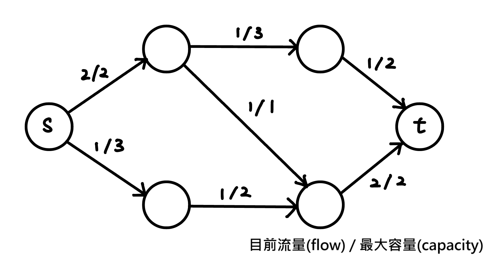
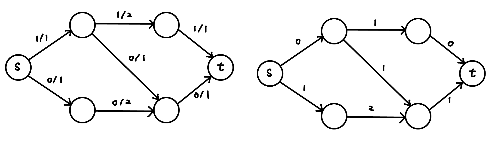
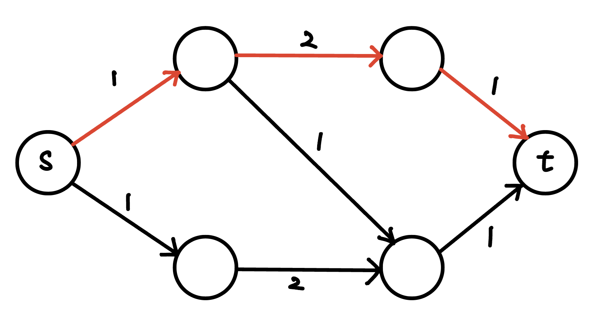
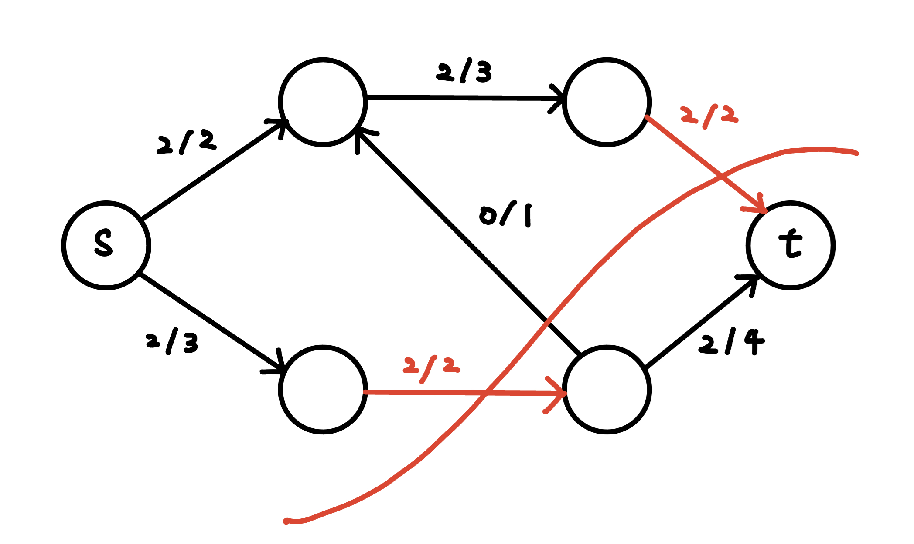
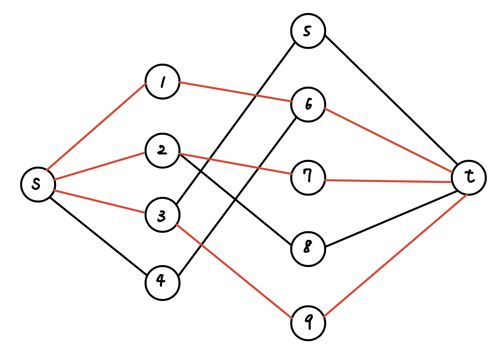
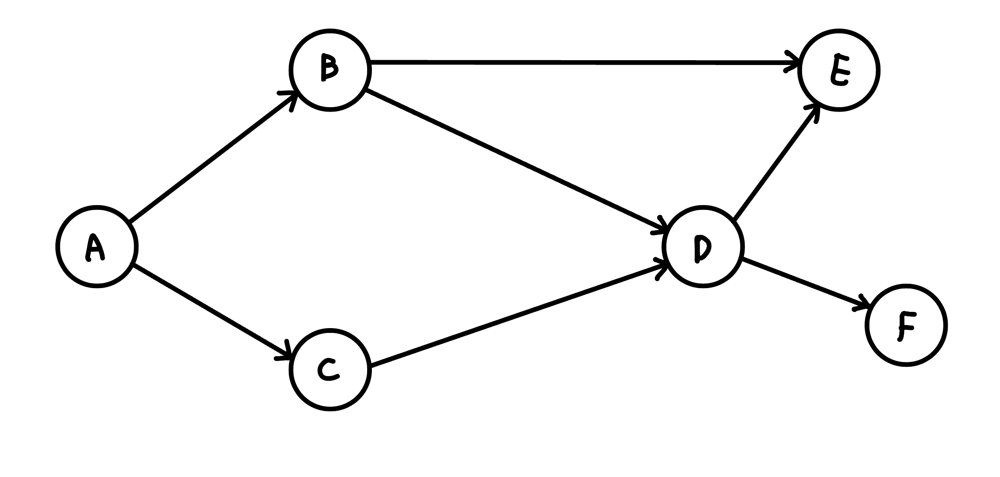
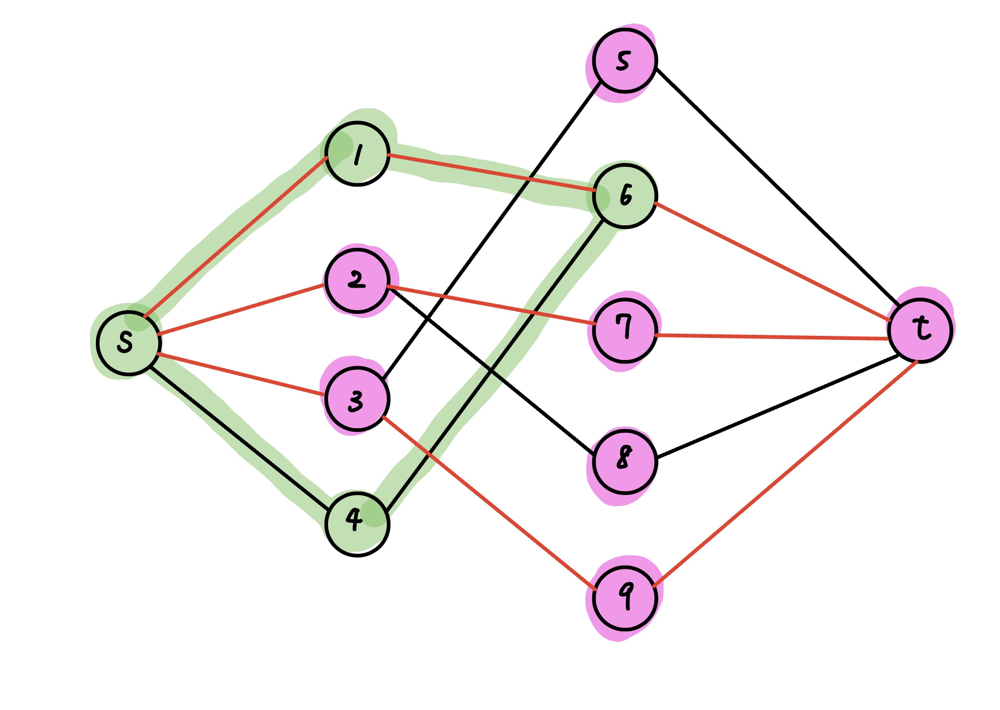
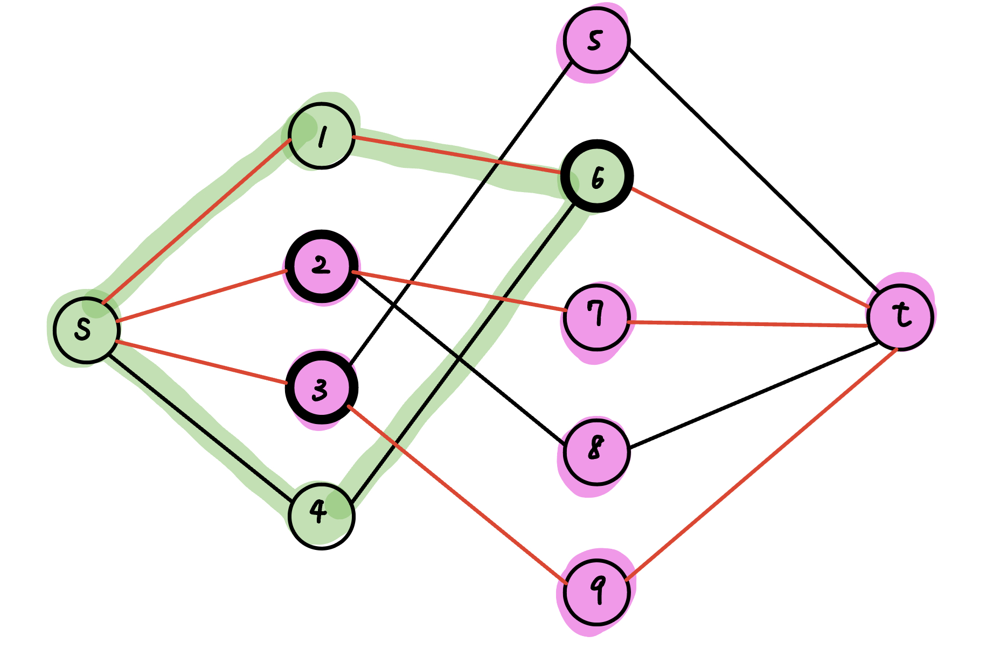
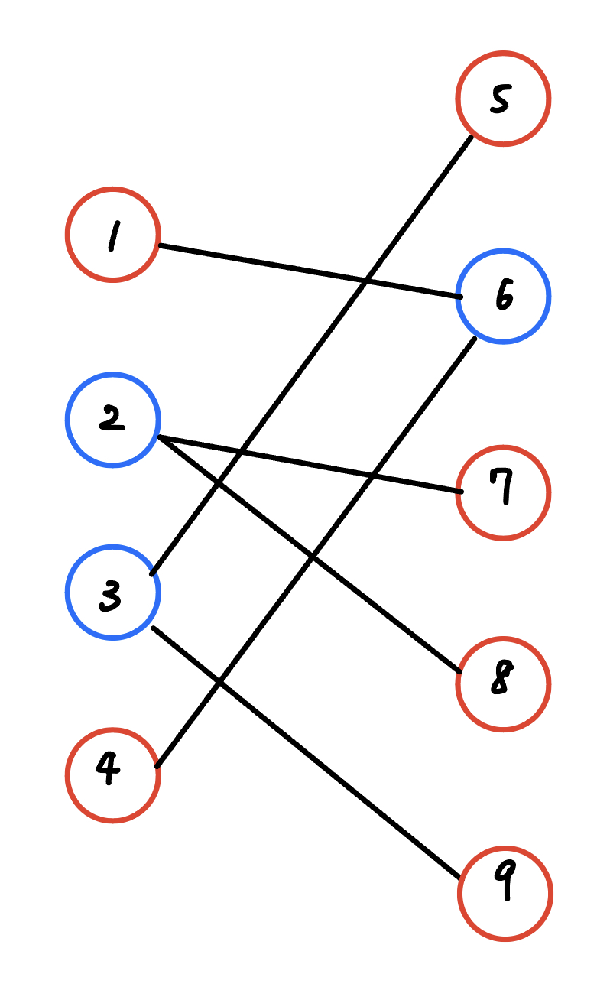

## Flow 問題介紹

???+note "s-t Flow Network"
	給一個有向圖，每條邊 (u, v) 都有一個邊權 c(u, v) 代表容量上限。有兩個特殊的點，源點和匯點，在所有種流量中最大的稱為最大流

- 網路(Network)：圖 G = (V, A) 為一有向圖，稱為網路。

- 源點與匯點(Source and Sink)：令一點 s 為源點、一點 t 為匯點，其餘點則為中間點。

- 容量(Capacity)：每條邊上定義一個非負數 c(u, v) 為該邊的容量

- 流量(Flow)：每條邊上定義一個非負數 f(u, v) 為流量

- 網路的流量(Flow of Network)：由源點發出，匯點匯集的總流量 ，匯點匯集的總流量，若其為該網路能產生的最大流量，則稱其為最大流(Maximum Flow)。

<figure markdown>
  { width="400" }
</figure>

## Flow 性質

- 容量限制(Capacity Constraints): 每條邊 (u, v) 所經過的流量 f(u, v) <= c(u, v)
- 流量守恆(Flow Conservation): 除了源點和匯點，每個點 u 所流入的流量 = 流出的流量

- 斜對稱(Skew Symmetry): 對於所有的 f(u, v) + f(v, u) = 0，由 u 到 v 淨流量加上由 v 到 u 的淨流量必須為零

- 可行流(Positive Flow)：若一個流符合上述三點限制，則稱其為可行流

## 一些定義

### 剩餘網路 (Residual Network)

將每條邊的最大容量扣掉已經流過的流量，即得到剩餘網路。也就是剩餘容量 $c_f(u, v)=c(u, v)-f(u, v)$ 

<figure markdown>
  { width="400" }
</figure>

### 增廣路徑(Augmenting Path)

一條從起點，到終點的路徑，其中每條邊的剩餘容量都 > 0

<figure markdown>
  { width="400" }
  <figcaption>紅色的路徑即為一條增廣路徑</figcaption>
</figure>

### 割(Cut)

定義一個 s-t cut $C = (S \text{-component}, T\text{-component})$ 是將點分成與 s 同一塊或與 t 同一塊。定義 $C$ 的 cut-set 為 $\{(u, v) \in E \mid u \in S\text{-component}, v \in T\text{-component}\}$，使得在 cut-set 的邊都被刪掉後，s 到 t 的 Max Flow 是 0（i.e. s 和 t 不連通）

## Maximum s-t flow 演算法

### Ford–Fulkerson


### 複雜度比較

|                   | Flow                       | Matching       |
| ----------------- | -------------------------- | -------------- |
| Ford-Fulkerson    |         O(EF)                   | O(VE)          |
| Edmond-Karp       | O(min(VE<sup>2</sup>, FE)) |                |
| Dinic（常數級小） | O(min(V<sup>2</sup>E, FE)) | O(E * sqrt(V)) |


## 最小割(Min Cut)

定義 s-t cut 的 cost 為 cut-set 內的邊的 capacity 總和，min cut 就是要最小化這個 cost。簡單來說就 Min Cut 是選一些邊，使 s, t 不連通，並且 capacity 最小

<figure markdown>
  { width="300" }
</figure>

??? info "【Min Flow Max Cut Theorm】: max flow = min cut"
	max flow <= cut

	Max Flow 可以想成很多個 disjoint path，任何的 cut 一定都會切到這些 path，所以任何 cut 不會比任何 flow 小。
	
	---
	
	感性的理解，s-t 若想要流出最大流量，必定會有瓶頸處形成 s-t 最小割

### 如何輸出一個 mincut

min-cut 就是做 max-flow 後，從 s 半邊指到 t 半邊的那些邊。做完 max-flow 後做一次 bfs / dfs，並只走還沒流滿的邊，可以走到的點即為 s 半邊，不能走到的點即為 t 半邊的點，掃過所有的邊檢查兩端點的狀況，輸出符合條件的即為所求。

感性的理解，為什麼可以這樣做，其實可以把 s 開始走還沒流滿的邊視為無關緊要的邊，若碰到一個會流滿的地方就會是瓶頸處

???+note "code"
	```cpp linenums="1"
	bool side[MAXN];
    void cut(int u) {
        side[u] = 1;
        for (int i : G[u]) {
            if (!side[edges[i].v] && edges[i].cap) {
                cut(edges[i].v);
            }
        }
    }
    ```

## 二分圖系列

### 二分圖最大匹配

???+note "問題"
	給一個二分圖，選一些邊使任意兩條邊都沒有公共的頂點，且數量越大越好，也就是最大匹配，並輸出一組答案

創兩個超級源點和超級匯點，所有邊權都是 1，求 max flow 就是答案。輸出答案即看位於兩排中央流滿的邊，極為所求。

<figure markdown>
  { width="300" }
</figure>

### DAG 最小路徑覆蓋

???+note "問題"
	給一張 n 點 m 邊的 DAG，最少要選幾條路徑可以蓋住所有的點，且任意兩條路徑不能有共同的點
	
	<figure markdown>
      { width="300" }
    </figure>

### 二分圖最小點覆蓋

???+note "問題"
	給一個二分圖，選擇最少的點來覆蓋所有的邊，且數量越小越好，也就是最小點覆蓋，並輸出一組答案
	
??? info "【Kőnig's theorem】: 在二分圖中，|最小點覆蓋| = |最大匹配|"
	- 最大匹配 <= 最小點覆蓋
		- k 條匹配邊，至少 k 個點覆蓋
	
    - 最小點覆蓋 <= 最大匹配
		- 最小點覆蓋 k 個點，每個點旁邊都有一個沒選到的點

		- 最大匹配至少為 k

	---
	
	這邊給出 Kőnig's theorem 的構造法證明，也就是「為何一定找的到一組最小點覆蓋，其數量恰為 max flow」。
	
	最小點覆蓋顧名思義就是要找到一些重要的點，並且這些點要越少越好，考慮 min cut，min cut 可以找到重要的邊，使 s 跟 t 的 max flow = 0，而且數量最小化，我們使用找一組 min cut 的方法，從 s 開始走還沒流滿的邊，找出 S-component, T-component

    <figure markdown>
      { width="400" }
      <figcaption>綠色即為 S-component, 紫色即為 T-component</figcaption>
    </figure>

    因為依照 min cut 的定義，將這些邊刪除後 s 到 t 的 max flow = 0，代表這些邊在中間的點足以支配中間的每一條邊，而又 min cut = max flow，所以最小點覆蓋數量 = min cut = max flow。具體要選哪些中間的點，如下:

    - 左邊且在 T-component 中

    - 右邊且在 S-component 中

    <figure markdown>
      { width="400" }
      <figcaption>粗框的點就是最小點覆蓋</figcaption>
    </figure>
    
根據 Kőnig's theorem，我們得知最小點覆蓋數量跟最大匹配的數量是一樣的，也就是 max flow。若要輸出答案，那我們就選以下這些點即可

- 左邊跟 mincut 同 t 側的的點

- 右邊跟 mincut 同 s 側的的點

具體為什麼可以這樣做在上面 Kőnig's theorem 的構造法證明中有提到

???+note "[CSES - Coin Grid](https://cses.fi/problemset/task/1709)"
    給一個 $n\times n$ 的 Grid，有些格子上有錢幣。每次可以移除一個 row 或一個 col 的所有錢幣，問最少要幾次操作
	

### 二分圖最大獨立集

???+note "問題"
	給一個二分圖，選一些點使選的點兩兩不相鄰，且數量越大越好，也就是最大獨立集，並輸出一組答案
	
!!! info "定理: 在一般圖上，|最小點覆蓋| + |最大獨集| = n"
	
所以答案就是 n - max flow。輸出答案的話，就把最小點覆蓋沒選到的點都選起來

<figure markdown>
  { width="300" }
  <figcaption>藍色為最小點覆蓋, 紅色為最大獨集</figcaption>
</figure>

### 比較

- 在二分圖下
	- 最大匹配 (MM) = 最小點覆蓋 (MVC)
	- 最大獨立集 (MIS) + 最小點覆蓋 (MVC) = n
	- 都可以用 max flow 在多項式時間解出

- 在一般圖下
	- 最大獨立集 (MIS) + 最小點覆蓋 (MVC) = n
	- 最大獨立集,最小點覆蓋 : NP-hard 問題 (目前已知的演算法只能指數時間解出)
	- 最大匹配 : P 問題

## 模板
### dinic
```cpp linenums="1"
#include <bits/stdc++.h>
#define int long long
#define pii pair<int, int>
#define pb push_back
#define mk make_pair
#define F first
#define S second
#define ALL(x) x.begin(), x.end()

using namespace std;

const int INF = (1LL << 60);
const int M = 1e9 + 7;

int n;

struct dinic {
    struct Edge {
        int u, v;
        int cap;
    };

    int n, m, s, t;
    vector<vector<int>> G;
    vector<Edge> edges;
    vector<int> lv;
    vector<int> cur;
    vector<int> side;
    vector<int> ans;

    void init () {
        n = m = 0;
        G.clear ();
        edges.clear ();
    }

    int add_node () {
        n++;
        G.pb({});
        return n - 1;
    }

    void add_edge (int u, int v, int cap) {
        edges.pb({u, v, cap});
        G[u].pb(m++); // 0
        edges.pb({v, u, 0LL});
        G[v].pb(m++); // 1
    }

    void cut (int u) {
        side[u] = 1;
        ans.pb(u);
        for (auto i : G[u]) {
            if (!side[edges[i].v] && edges[i].cap > 0) {
                cut (edges[i].v);
            }
        }
    }

    bool bfs () {
        lv = vector<int> (n, -1);
        queue<int> q;
        lv[s] = 0;
        q.push (s);
        while (q.size()) {
            int u = q.front ();
            q.pop ();

            for (int i = 0; i < G[u].size(); i++) {
                Edge &e = edges[G[u][i]];
                if (e.cap > 0 && lv[e.v] < 0) {
                    lv[e.v] = lv[u] + 1;
                    q.push (e.v);
                }
            }
        }
        return lv[t] >= 0;
    }

    int dfs (int u, int f) {
        if (u == t || f == 0) return f;
        int res = 0;
        for (auto &i = cur[u]; i < G[u].size(); i++) {
            Edge &e = edges[G[u][i]];
            Edge &rev = edges[G[u][i] ^ 1];
            if (e.cap > 0 && lv[u] + 1 == lv[e.v]) {
                int x = dfs (e.v, min (f, e.cap));
                if (x > 0) {
                    e.cap -= x;
                    rev.cap += x;
                    f -= x;
                    res += x;
                    if (f == 0) break;
                }
            }
        }
        return res;
    }

    int max_flow (int _s, int _t) {
        s = _s, t = _t;
        int res = 0;
        while (bfs()) {
            cur = vector<int> (n, 0);
            while (true) {
                int f = dfs (s, INF);
                if (f == 0) break;
                res += f;
            }
        }
        return res;
    }

    void min_cut () {
        side = vector<int>(n, 0);
        cut (s);
        cout << ans.size() << "\n";
        for (auto ele : ans) cout << ele << "\n";
    }

    void print (int flow) {
        vector<Edge> ans;
        for (int i = 1; i < edges.size(); i += 2) {
            auto [u, v, cap] = edges[i];
            if (cap == 0) continue;
            ans.pb({u, v, cap});
            //cout << "u:" << v << ",v:" << u << ",cap:" << cap << "\n";
        }
        cout << n << " " << flow << " " << ans.size() << "\n";
        for (auto [u, v, cap] : ans) cout << v << " " << u << " " << cap << "\n";
    }
}flow;

void solve () {
    int n, m, s, t;
    cin >> n >> m >> s >> t;
    flow.init ();
    for (int i = 1; i <= n; i++) flow.add_node();
    for (int i = 0; i < m; i++) {
        int u, v, cap;
        cin >> u >> v >> cap;
        flow.add_edge(u, v, cap);
    }
    int f = flow.max_flow(s, t);
    flow.min_cut();

}
 
signed main() {
    // ios::sync_with_stdio(0);
    // cin.tie(0);
    int t = 1;
    // cin >> t;
    while (t--) {
        //init(); 
        solve();
    }
} 

```
### min cost max flow
```cpp linenums="1"
#include <bits/stdc++.h>
#define int long long
#define pii pair<int, int>
#define pb push_back
#define mk make_pair
#define F first
#define S second
#define ALL(x) x.begin(), x.end()

using namespace std;

const int INF = (1LL << 60);
const int M = 1e9 + 7;

int n;

struct dinic {
    struct Edge {
        int u, v, cap, c;
    };

    int n, m, s, t;
    vector<vector<int>> G;
    vector<Edge> edges;
    vector<int> lv;
    vector<int> cur;

    void init () {
        n = m = 0;
        G.clear ();
        edges.clear ();
    }

    int add_node () {
        n++;
        G.pb({});
        return n - 1;
    }

    void add_edge (int u, int v, int cap, int w) {
        edges.pb({u, v, cap, w});
        G[u].pb(m++); // 0
        edges.pb({v, u, 0LL, -w});
        G[v].pb(m++); // 1
    }

    pii flow (int _s, int _t) {
        s = _s, t = _t;
        int fl, cost;
        fl = cost = 0;
        int cnt = 0;
        while (true) {
            vector<int> dis = vector<int>(n, INF);
            vector<int> inq = vector<int>(n, 0);
            vector<int> pre = vector<int>(n, -1);
            vector<int> preL = vector<int>(n, -1);
            dis[s] = 0;
            queue<int> q;
            q.push(s);
            while (q.size()) {
                int u = q.front(); q.pop();
                inq[u] = 0;
                for ( int i = 0 ; i < (int)G[u].size() ; i++) {
                    int v = edges[G[u][i]].v;
                    int w = edges[G[u][i]].c;
                    int fw = edges[G[u][i]].cap;
                    
                    if (fw > 0 && dis[v] > dis[u] + w) {
                        pre[v] = u; preL[v] = G[u][i]; // bug: preL[v] = i;
                        dis[v] = dis[u] + w;
                        if (!inq[v]) {
                            inq[v] = 1;
                            q.push(v);
                        }
                    }
                }
            }

            if (dis[t] == INF) break;
            int tf = INF;
            int u, l;
            for (int v = t; v != s ; v = u ) {
                u = pre[v]; l = preL[v];
                tf = min(tf, edges[l].cap);
            }

            for (int v = t, u, l ; v != s ; v = u ) {
                u = pre[v]; l = preL[v];
                edges[l].cap -= tf;
                edges[l ^ 1].cap += tf;
            }

            cost += tf * dis[t];
            fl += tf;
        }
        return {fl, cost};
    }

}flow;

void solve () {
    int n, m, s, t;
    cin >> n >> m >> s >> t;
    flow.init ();
    for (int i = 1; i <= n; i++) flow.add_node();
    for (int i = 0; i < m; i++) {
        int u, v, cap, w;
        cin >> u >> v >> cap >> w;
        flow.add_edge(u, v, cap, w);
    }
    auto [f, cost] = flow.flow (s, t);
    cout << f << " " << cost << "\n";
}
 
signed main() {
    ios::sync_with_stdio(0);
    cin.tie(0);
    int t = 1;
    // cin >> t;
    while (t--) {
        //init(); 
        solve();
    }
} 
```

## algo


## min cut
### 理論
- 切下去的邊有從 $\texttt{s}$ 流向 $\texttt{t}$ 的 $\texttt{cap}$ 和
- $\texttt{max flow = min cut}$


### 輸出一組 min cut
- 跑完 $\texttt{dinic}$ ， 跑下面這份 $\texttt{code}$ ，走 $s$ 往外走未流滿的 $\texttt{edge}$ 
- 枚舉邊，檢查每條邊 $u,v$  的狀況，若 $u$ 屬於 $s$ 而 $v$ 屬於 $t$ 即為所求


```cpp linenums="1"
bool side[MAXN];
void cut(int u) {
    side[u] = 1;
    for (int i : G[u]) {
        if (!side[edges[i].v] && edges[i].cap) {
            cut(edges[i].v);
        }
    }
}
```

## 二分圖
- capacity 都是 1
### 最小點覆蓋
#### 輸出答案
- 左邊跟 $\texttt{min cut}$ 同 $\texttt{t}$ 側的點
- 右邊跟 $\texttt{min cut}$ 同 $\texttt{s}$ 側的點


```cpp linenums="1"
#include <bits/stdc++.h>
#define int long long
#define pii pair<int, int>
#define pb push_back
#define mk make_pair
#define F first
#define S second
#define ALL(x) x.begin(), x.end()

using namespace std;

const int INF = (1LL << 60);
const int M = 1e9 + 7;

int n;

struct dinic {
    struct Edge {
        int u, v;
        int cap;
    };

    int n, m, s, t;
    vector<vector<int>> G;
    vector<Edge> edges;
    vector<int> lv;
    vector<int> cur;
    vector<int> side;
    vector<int> ans;
    vector<int> tag;

    void init () {
        n = m = 0;
        G.clear ();
        edges.clear ();
    }

    int add_node () {
        n++;
        G.pb({});
        return n - 1;
    }

    void add_edge (int u, int v, int cap) {
        edges.pb({u, v, cap});
        G[u].pb(m++); // 0
        edges.pb({v, u, 0LL});
        G[v].pb(m++); // 1
    }

    void cut (int u) {
        side[u] = 1;
        tag[u] = 1;
        for (auto i : G[u]) {
            if (!side[edges[i].v] && edges[i].cap > 0) {
                cut (edges[i].v);
            }
        }
    }

    bool bfs () {
        lv = vector<int> (n, -1);
        queue<int> q;
        lv[s] = 0;
        q.push (s);
        while (q.size()) {
            int u = q.front ();
            q.pop ();

            for (int i = 0; i < G[u].size(); i++) {
                Edge &e = edges[G[u][i]];
                if (e.cap > 0 && lv[e.v] < 0) {
                    lv[e.v] = lv[u] + 1;
                    q.push (e.v);
                }
            }
        }
        return lv[t] >= 0;
    }

    int dfs (int u, int f) {
        if (u == t || f == 0) return f;
        int res = 0;
        for (auto &i = cur[u]; i < G[u].size(); i++) {
            Edge &e = edges[G[u][i]];
            Edge &rev = edges[G[u][i] ^ 1];
            if (e.cap > 0 && lv[u] + 1 == lv[e.v]) {
                int x = dfs (e.v, min (f, e.cap));
                if (x > 0) {
                    e.cap -= x;
                    rev.cap += x;
                    f -= x;
                    res += x;
                    if (f == 0) break;
                }
            }
        }
        return res;
    }

    int max_flow (int _s, int _t) {
        s = _s, t = _t;
        int res = 0;
        while (bfs()) {
            cur = vector<int> (n, 0);
            while (true) {
                int f = dfs (s, INF);
                if (f == 0) break;
                res += f;
            }
        }
        return res;
    }

    void min_cut () {
        side = vector<int>(n, 0);
        tag = vector<int> (n, 0);
        ans.clear ();
        cut (s);
        int N = n / 2 - 1;
        vector<pii> res;
        for (int i = 1; i <= N; i++) {
            if (tag[i] == 0) {
                res.pb({1, i});
            }
        }

        for (int i = N + 1; i <= 2 * N; i++) {
            if (tag[i] == 1) {
                res.pb({2, i - N});
            }
        }

        cout << res.size() << "\n";
        for (auto [F, S] : res) cout << F << " " << S << "\n";
    }
}flow;

void solve () {
    int n, m, s, t;
    // s = 0, t = 2n + 1
    // L = 1 ~ n
    // R = n + 1 ~ 2n
    cin >> n;

    flow.init ();

    s = 0, t = 2 * n + 1;
    for (int i = s; i <= t; i++) flow.add_node();
    // 加 s -> L 
    for (int i = 1; i <= n; i++) {
        flow.add_edge (s, i, 1);
    }   
    // 加 t -> R
    for (int i = n + 1; i <= 2 * n; i++) {
        flow.add_edge (i, t, 1);
    }

    // 記得 flow 是 0-base
    for (int i = 1; i <= n; i++) { // L
        for (int j = n + 1; j <= 2 * n; j++) { // R
            char x;
            cin >> x;
            if (x == 'o') flow.add_edge (i, j, 1);
        }
    }

    // L & t
    // R & s
    int f = flow.max_flow(s, t);
    flow.min_cut();

}
 
signed main() {
    // ios::sync_with_stdio(0);
    // cin.tie(0);
    int t = 1;
    // cin >> t;
    while (t--) {
        solve();
    }
} 
```
- https://cses.fi/problemset/task/1709/

### 最大獨立集
- 最大獨立集 $+$ 最小點覆蓋 $=n$
- $\begin{cases} 最大獨立集: 一個邊最多選一個 \\ 最小點覆蓋: 一個邊至少選一個 \end{cases}$
- $\texttt{proof}$
    - 一個邊上最多只有一個最大獨立集
    - 代表沒選的至少一個
    - 符合最小覆蓋定義

### 帶權最大獨立集
- 跑 $\texttt{min cost max flow}$ 即可

## DAG 最小點覆蓋
- 最少需要多少條路徑才可以蓋住所有的點，且任兩條路徑不能有共通的點
- 不重疊路徑數 $+$ 路徑長總和 $=n$
- 我想讓不重疊路徑數最小，就是想讓路徑常總和最小
- 路徑選好後每個點的 $\texttt{in degree}$ 跟 $\texttt{out degree}$ 最多就是 $\texttt{1}$
- 一個匹配就是一個路徑長 $+1$ ，我想讓路徑長越多越好，相當於要讓匹配最大
- $\Rightarrow$ 二分圖最大匹配


## 有向無向
- 不管什麼題型，無向從 $u \rightarrow v$ 和從 $v \rightarrow u$ 都是獨立的也就是你總共會看到 2 + 2 = 4 條
- 對於 $\texttt{min cut max flow}$ 輸出那些邊有用到
    - 有向: 對於 $m$ 條邊檢查
    - 無向: 他只會用其中一條邊，所以就看那兩條邊比較小的(流比較多出去)的反向邊
    - 

- 無向圖，對於一般 $\texttt{flow}$ 正反互相底消
    - 

- [LOJ 網路流 24 題](https://loj.ac/problems/tag/30)

## 參考資料

- <https://www.cnblogs.com/dijkstra2003/p/7598931.html>

- <https://www.mropengate.com/2015/01/algorithm-ch4-network-flow.html?m=1>

- <http://pisces.ck.tp.edu.tw/~peng/index.php?action=showfile&file=f3cec71910d4a0106624e839f2891b17198ef58be>

- <https://github.com/NCTU-PCCA/NCTU_Fox/tree/master/codebook/Graph/Flow>

- <https://web.ntnu.edu.tw/~algo/Matching.html>