## Flow 問題介紹

???+note "s-t Flow Network"
	給一個有向圖，每條邊 (u, v) 都有一個邊權 c(u, v) 代表容量上限。有兩個特殊的點，源點和匯點，在所有種流量中最大的稱為最大流

- 網路(Network)：圖 G = (V, A) 為一有向圖，稱為網路。

- 源點與匯點(Source and Sink)：令一點 s 為源點、一點 t 為匯點，其餘點則為中間點。

- 容量(Capacity)：每條邊上定義一個非負數 c(u, v) 為該邊的容量

- 流量(Flow)：每條邊上定義一個非負數 f(u, v) 為流量

- 網路的流量(Flow of Network)：由源點發出，匯點匯集的總流量 ，匯點匯集的總流量，若其為該網路能產生的最大流量，則稱其為最大流(Maximum Flow)。

<figure markdown>
  { width="400" }
</figure>

## Flow 性質

- 容量限制(Capacity Constraints): 每條邊 (u, v) 所經過的流量 f(u, v) <= c(u, v)

- 流量守恆(Flow Conservation): 除了源點和匯點，每個點 u 所流入的流量 = 流出的流量

- 斜對稱(Skew Symmetry): 對於所有的 f(u, v) + f(v, u) = 0，由 u 到 v 淨流量加上由 v 到 u 的淨流量必須為零

- 可行流(Positive Flow)：若一個流符合上述三點限制，則稱其為可行流

## 一些定義

### 剩餘網路 (Residual Network)

將每條邊的最大容量扣掉已經流過的流量，即得到剩餘網路。也就是剩餘容量 $c_f(u, v)=c(u, v)-f(u, v)$ 

<figure markdown>
  { width="400" }
</figure>

### 增廣路徑(Augmenting Path)

一條從起點，到終點的路徑，其中每條邊的剩餘容量都 > 0

<figure markdown>
  { width="400" }
  <figcaption>紅色的路徑即為一條增廣路徑</figcaption>
</figure>

## Maximum s-t flow 演算法

???+note "模板測試 [LOJ #101. 最大流](https://loj.ac/p/101)"
	給一張 $n$ 點 $m$ 邊有向圖，每條邊給定容量 c(u, v)，問 $s$ 到 $t$ 的最大流
	
	$n\le 100, m\le 5000, 0\le c(u, v) \le 2^{31}-1$

### Ford–Fulkerson

???+note "算法概要"
	1. 每次從 s 開始 dfs 找到一條增廣路徑
	2. 找到路徑中流量最小的邊，並更新剩餘網路（亦對逆向邊做更新）
	3. 做 1. 2. 直到找不到增廣路徑為止

Ford–Fulkerson 雖然複雜度不佳，但他的精神在後續提到的演算法中都會用到。

每次從 s 開始 dfs 找到一條增廣路徑，找到路徑中流量最小的邊，並將整條路徑填滿，直到找不到 s 到 t 的增廣路徑即結束。

但這樣是否就找到了最大流 ? 我們觀察以下的剩餘網路：

<figure markdown>
  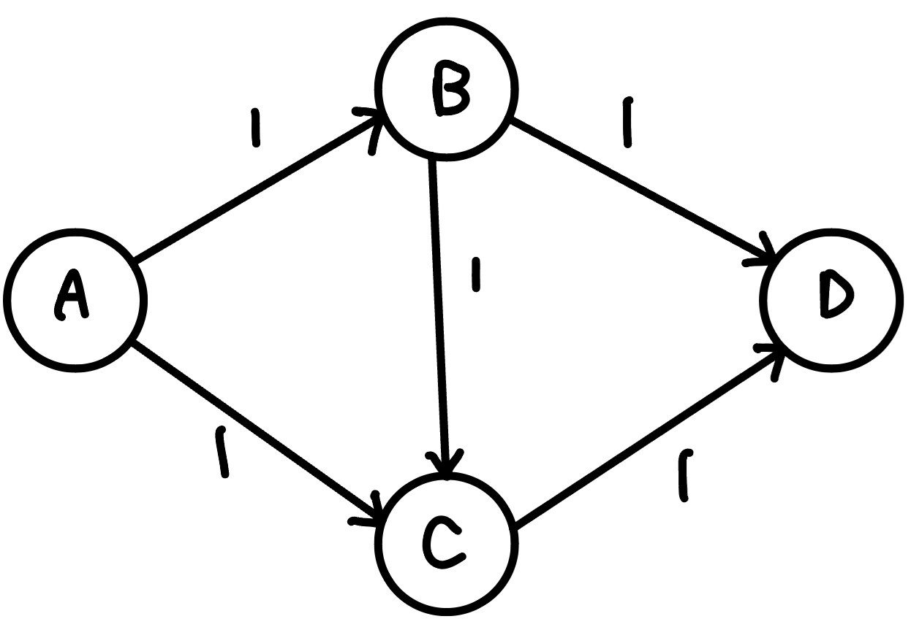{ width="250" }
</figure>

若我們第一次選擇流 A → B → C → D 後，就會再也找不到任何增廣路徑

<figure markdown>
  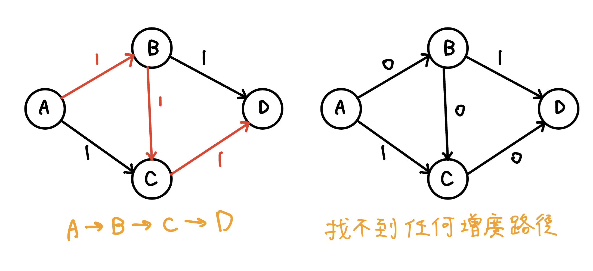{ width="400" }
</figure>

但最大流明顯是 A → B → D,  A → C → D 這兩條。

因為我們沒有給予返回的機會，也就是相當於第一次找到的不是最優解，那怎麼辦 ?

所以，我們要有一個反向邊，來給程式反悔的機會，每條邊都創造一條反向邊，反向邊的初始容量是 0。

<figure markdown>
  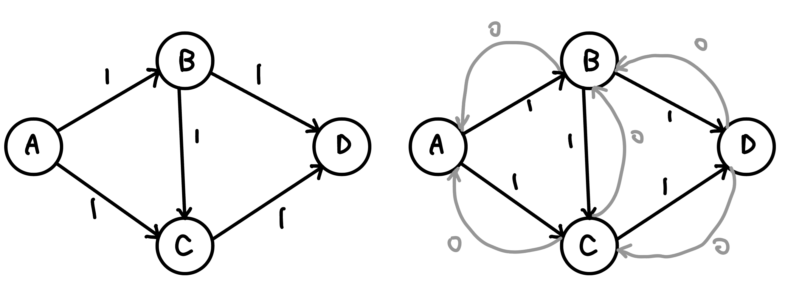{ width="450" }
</figure>

當有 f 的流量從 (u, v) 流過時，反向邊 (v, u) 的剩餘流量就加 f

<figure markdown>
  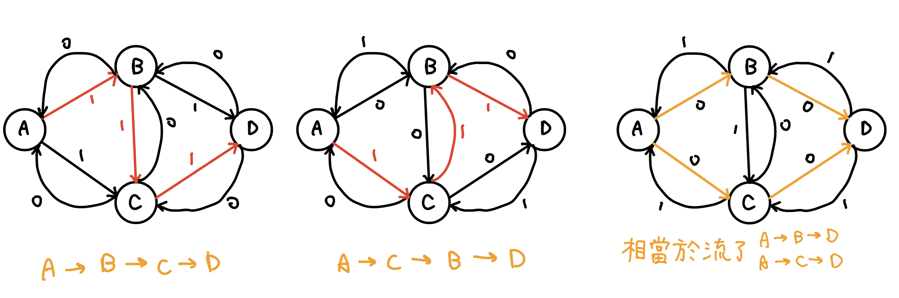{ width="500" }
</figure>

可以發現我們就會流過 A → B → C → D 後，還能再流 A → C → B → D，中間被流過去一次，又流回來一次，剛好抵銷掉。第一次我們流了 1 的流量，第二次我們也是流了 1 的流量，所以求出最大流就是 1 + 1 = 2

最差會需要跑 O(F) 回合，每回合做一次 DFS O(E)。

??? note "複雜度 worst case 說明"
	<figure markdown>
      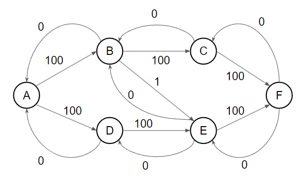{ width="400" }
    </figure>
    
    考慮上面這張圖跑 Ford–Fulkerson，A 為源點，F 為匯點
    
    <figure markdown>
      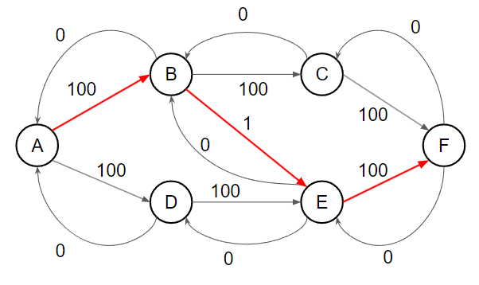{ width="400" }
    </figure>
    
    <figure markdown>
      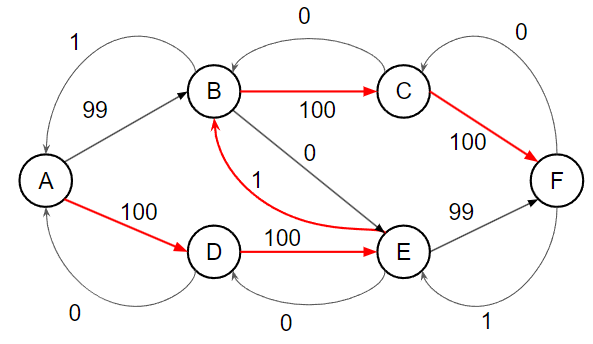{ width="400" }
    </figure>
    
    <figure markdown>
      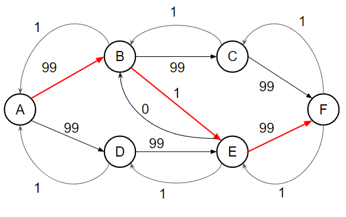{ width="400" }
    </figure>
    
    <figure markdown>
      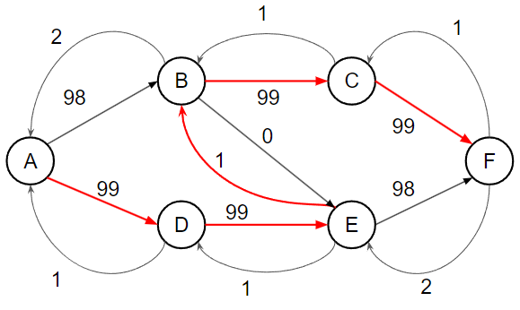{ width="400" }
    </figure>
    
    <figure markdown>
      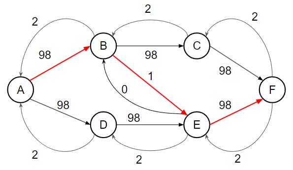{ width="400" }
    </figure>
    
    會發現如果我們這樣找增廣路徑 worst case 每次都只會將剩餘流量最大的邊流掉一單位的流量，所以最差會找 O(F) 次增廣路徑

??? note "code"
	```cpp linenums="1"
	struct FordFulkson {
        struct Edge {
            int u, v;
            long long cap;
        };

        int n, m, s, t;
        vector<vector<int>> G;
        vector<Edge> edges;
        vector<bool> vis;
        void init() {
            n = 0;
            m = 0;
            G.clear();
            edges.clear();
        }
        int add_node() {
            n++;
            G.push_back({});
            return n - 1;
        }
        void add_edge(int u, int v, long long cap) {
            edges.push_back({u, v, cap});
            G[u].push_back(m++);
            edges.push_back({v, u, 0ll});
            G[v].push_back(m++);
        }
        long long dfs(int u, long long f) {
            if (vis[u] || f == 0) return 0;
            vis[u] = true;
            if (u == t) return f;
            for (int ei : G[u]) {
                Edge& e = edges[ei];
                Edge& rev = edges[ei ^ 1];
                long long a = dfs(e.v, min(f, e.cap));
                if (a > 0) {
                    e.cap -= a;
                    rev.cap += a;
                    return a;
                }
            }
            return 0;
        }
        long long max_flow(int _s, int _t) {
            s = _s, t = _t;
            long long res = 0;
            while (true) {
                vis = vector<bool>(n, false);
                long long f = dfs(s, LLONG_MAX);
                if (f == 0) break;
                res += f;
            }
            return res;
        }
    } flow;
    ```

??? question "如果是無向圖怎麼處理 ?"
	跟 dijkstra 一樣，將無向邊看成兩條獨立的有向邊。因為最後只會使用來、回其中一側（若兩側都使用可以互相消掉），如圖
	
	<figure markdown>
	  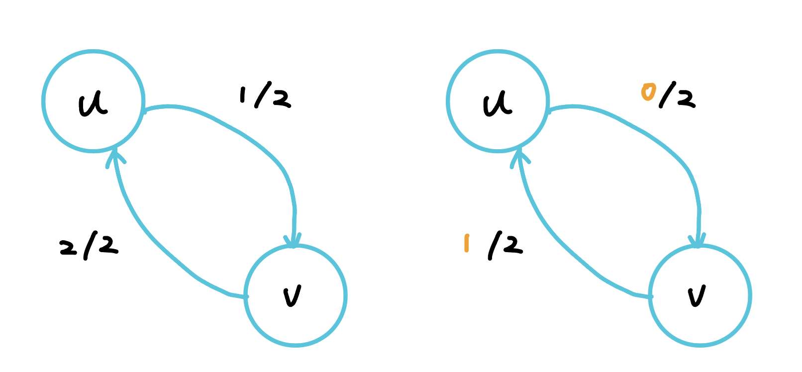{ width="400" }
	</figure>
	
	那要怎麼實作 ? 我們對於來、回這兩個有向邊，依照 Ford–Fulkerson，除了原本的方向外，都各自建立一條逆向邊，逆向邊的流量都會是 0，也就是 u 與 v 之間就會產生 4 條邊。輸出答案就看哪一側流過去的比較多，就輸出那個方向，也就是看來、回分別的「逆向邊」的剩餘流量。如下圖
	
	<figure markdown>
	  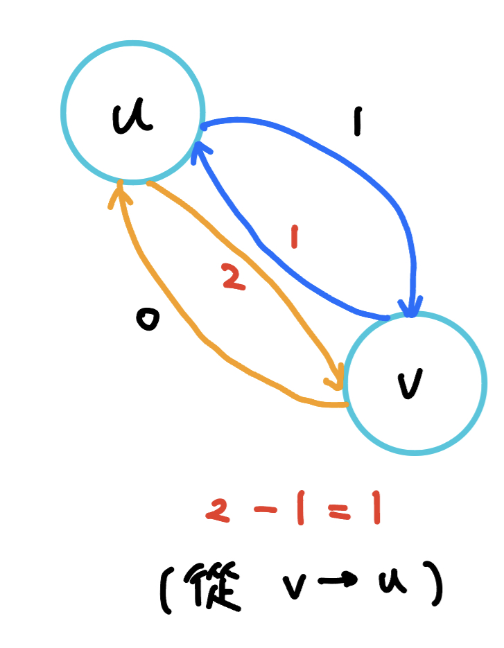{ width="200" }
	</figure>
	
	(v, u) 的逆向邊剩餘流量為 2，(u, v) 的逆向邊剩餘流量為 1，因為 2 - 1 = 1，所以最後就是輸出從 (v, u) 流過去 1 單位

### Edmond-Karp

???+note "算法概要"
	1. 每次從 s 開始 bfs 找到一條最短的增廣路徑
	2. 找到路徑中流量最小的邊，並更新剩餘網路（亦對逆向邊做更新）
	3. 做 1. 2. 直到找不到增廣路徑為止
	
Edmonds-Karp 跟 Ford–Fulkerson 只差在每次找的是**最短的一條**增廣路徑。

一個網路最多只有 O(VE) 條增廣路徑，而找一條增廣路徑需要 O(E) bfs，所以總複雜度為 O(min(VE<sup>2</sup>, FE))

??? info "證明: 最短增廣路的距離非遞減"
	先假設一些變數

    - 設 $\delta_f(s,x)$ 為增廣前的剩餘網路中，源點到 $x$ 的最短距離。
    
    - 令 $v$ 是在某次增廣後 $\delta_f(s,v)$ 變小的點中距離源點最近的點
    
    - 設 $\delta_{f'}(s,x)$ 為增廣後的剩餘網路中，源點到 $x$ 的最短距離。 則可以得到 $\delta_{f'}(s,v)<\delta_f(s,v)$
    
    - 令 $u$ 是在增廣後的剩餘網路中，從源點到 $v$ 之最短路徑的前一個節點，則 $\delta_{f'}(s,v)=\delta_{f'}(s,u)+1$
    
    又因為我們選擇 $v$ 的方式，因此
    
    $\delta_{f}(s,u) \le\delta_{f'}(s,u)$
    
    $\Rightarrow \delta_{f}(s,u) +1\le\delta_{f'}(s,u)+1$
    
    又 $\delta_{f'}(s,v)=\delta_{f'}(s,u)+1$，所以 $\delta_f(s,u)+1<\delta_{f'}(s,v)$
    
    而 $\delta_{f'}(s,v)<\delta_f(s,v)$，得 $\delta_f(s,u)+1<\delta_{f}(s,v)$
    
    也就是說 $(u,v)$ 邊沒有剩餘流量，因為如果 $(u,v)$ 邊還有剩餘流量的話代表 $\delta_f(s,v)\le \delta_{f}(s,u)+1$
    
    $(u,v)$ 邊在增廣前沒有剩餘流量，但增廣後有剩餘流量， 代表在這次增廣時有通過 $(v,u)$ 邊，所以 $\delta_f(s,v)+1=\delta_f(s,u)$ ，但是這與 $\delta_f(s,u)+1<\delta_{f}(s,v)$ 矛盾，因此不存在這樣的 $v$ 點 ⇒ 最短增廣路的距離非遞減
    
    ---
    
    感性證明 待補

??? note "Edmonds-Karp 過程 - 範例"
	<figure markdown>
      { width="400" }
    </figure>
    
    考慮上面這張圖跑 Edmonds-Karp，A 為源點，F 為匯點
    
    <figure markdown>
      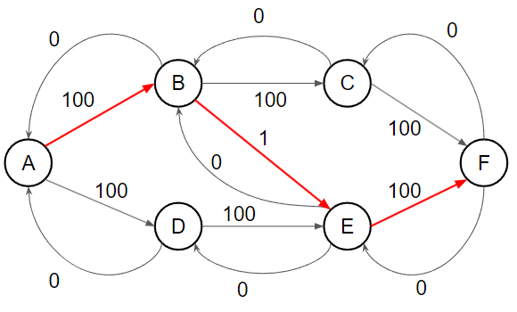{ width="400" }
    </figure>
    
    找到 A → B → E → F，流量為 1
    
    <figure markdown>
      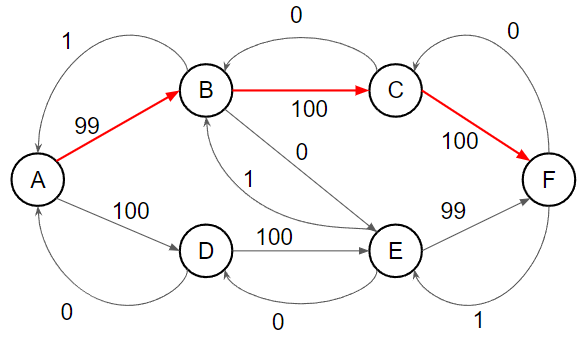{ width="400" }
    </figure>
    
    找到 A → B → C → F，流量為 99
    
    <figure markdown>
      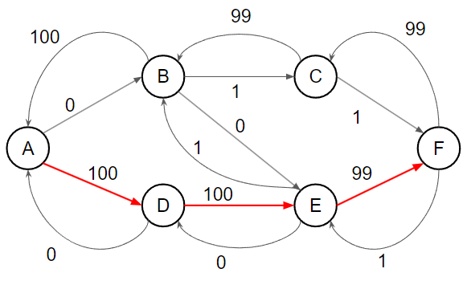{ width="400" }
    </figure>
    
    找到 A → D → E → F，流量為 99
    
    <figure markdown>
      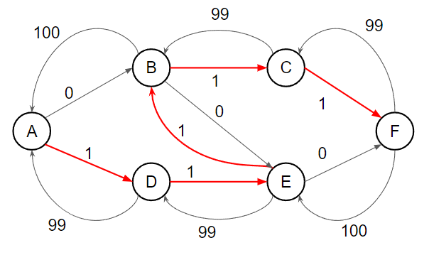{ width="400" }
    </figure>
    
    找到 A → D → E → B → C → F，流量為 1
    
    <figure markdown>
      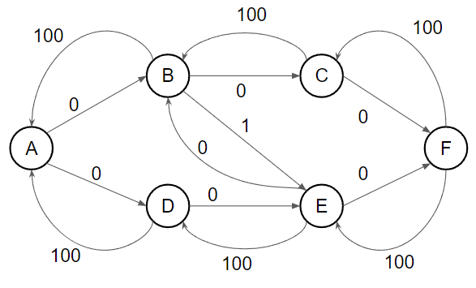{ width="400" }
    </figure>
    
    A 無法走到 F，總流量為 200，可以發現因為我們每次都挑最短的走，比上面 Ford–Fulkerson 要少跑了好幾輪

??? note "code"
	```cpp linenums="1"
	struct EdmondsKarp {
        struct Edge {
            int u, v;
            long long cap;
        };

        int n, m, s, t;
        vector<vector<int>> G;
        vector<Edge> edges;
        void init() {
            n = 0;
            m = 0;
            G.clear();
            edges.clear();
        }
        int add_node() {
            n++;
            G.push_back({});
            return n - 1;
        }
        void add_edge(int u, int v, long long cap) {
            edges.push_back({u, v, cap});
            G[u].push_back(m++);
            edges.push_back({v, u, 0ll});
            G[v].push_back(m++);
        }
        long long bfs() {
            vector<pair<int, long long>> pre(n, {-1, 0});
            queue<int> que;
            que.push(s);
            pre[s] = {0, LLONG_MAX};
            while (que.size()) {
                int u = que.front();
                que.pop();
                for (int ei : G[u]) {
                    Edge& e = edges[ei];
                    if (e.cap > 0 && pre[e.v].first == -1) {
                        pre[e.v] = {ei, min(pre[u].second, e.cap)};
                        que.push(e.v);
                    }
                }
            }
            if (pre[t].first == -1) return 0;
            long long f = pre[t].second;
            int w = t;
            while (w != s) {
                int ei = pre[w].first;
                edges[ei].cap -= f;
                edges[ei ^ 1].cap += f;
                w = edges[ei].u;
            }
            return f;
        }
        long long max_flow(int _s, int _t) {
            s = _s, t = _t;
            long long res = 0;
            while (true) {
                long long f = bfs();
                if (f == 0) break;
                res += f;
            }
            return res;
        }
    } flow;
    ```

### Dinic

???+note "算法概要"
	1. 每次從 s 開始 bfs 建立最短路徑圖
	2. 在這個「最短路徑圖」上 dfs 找增廣路徑，直到找不到為止
	3. 重複 1. 2. 直到找不到增廣路徑

Dinic 演算法跟 Edmond-Karp 不同的是，每次把所有長度為 k 的增廣路找出來後，一直進行增廣。從 s 到 t 距離為 k 的點會形成最短路徑 DAG，網路上也有人稱這個叫層次圖(level graph)。Dinic 算法每次會先用 bfs 建立最短路徑 DAG，再用 dfs 在 DAG 上不斷的找增廣路，直到找不到，然後再用 bfs 再建立一張最短路徑 DAG，然後再用 dfs 在 DAG 上面不斷的找增廣路，一直做下去。

在最短路徑 DAG 上的增廣路長度最多 O(V)，每次做完一條邊就會從最短路徑 DAG 消失，最多消失 m 條邊，所以找到 blocking flow 會花費 O(VE)。每次 BFS s-t 距離至少增加 1，至多做 V 次 BFS，總時間為 O(min(V<sup>2</sup>E, FE))

dinic Matching 複雜度 待補

??? note "code"
	```cpp linenums="1"
	struct Dinic {
        struct Edge {
            int u, v;
            long long cap;
        };
        int n, m, s, t;
        vector<vector<int>> G;
        vector<Edge> edges;
        vector<int> lv;
        vector<int> cur;
        void init() {
            n = 0;
            m = 0;
            G.clear();
            edges.clear();
        }
        int add_node() {
            n++;
            G.push_back({});
            return n - 1;
        }
        void add_edge(int u, int v, long long cap) {
            edges.push_back({u, v, cap});
            G[u].push_back(m++);
            edges.push_back({v, u, 0});
            G[v].push_back(m++);
        }
        bool bfs() {
            lv = vector<int>(n, -1);
            queue<int> que;
            que.push(s);
            lv[s] = 0;
            while (!que.empty()) {
                int u = que.front();
                que.pop();
                for (int ei : G[u]) {
                    Edge &e = edges[ei];
                    if (lv[e.v] < 0 && e.cap > 0) {
                        lv[e.v] = lv[u] + 1;
                        que.push(e.v);
                    }
                }
            }
            return lv[t] >= 0;
        }
        long long dfs(int u, long long f) {
            if (u == t || f == 0) return f;
            long long res = 0;
            for (int &i = cur[u]; i < (int)G[u].size(); i++) {
                int ei = G[u][i];
                Edge &e = edges[ei];
                Edge &rev = edges[ei ^ 1];
                if (e.cap > 0 && lv[e.v] == lv[u] + 1) {
                    long long a = dfs(e.v, min(f, e.cap));
                    if (a > 0) {
                        e.cap -= a;
                        rev.cap += a;
                        res += a;
                        f -= a;
                        if (f == 0) break;
                    }
                }
            }
            return res;
        }
        long long max_flow(int _s, int _t) {
            s = _s, t = _t;
            long long res = 0;
            while (bfs()) {
                cur = vector<int>(n, 0);
                while (true) {
                    long long f = dfs(s, LLONG_MAX);
                    if (f == 0) break;
                    res += f;
                }
            }
            return res;
        }
    } flow;
	```

### 複雜度比較

|                   | Flow                       | Matching       |
| ----------------- | -------------------------- | -------------- |
| Ford-Fulkerson    |         O(EF)                   | O(VE)          |
| Edmond-Karp       | O(min(VE<sup>2</sup>, FE)) |                |
| Dinic（常數級小） | O(min(V<sup>2</sup>E, FE)) | O(E * sqrt(V)) |


## 最小割(Min Cut)

定義一個 s-t cut $C = (S \text{-component}, T\text{-component})$ 是將點分成與 s 同一塊或與 t 同一塊。定義 $C$ 的 cut-set 為 $\{(u, v) \in E \mid u \in S\text{-component}, v \in T\text{-component}\}$，使得在 cut-set 的邊都被刪掉後，s 到 t 的 Max Flow 是 0（i.e. s 和 t 不連通）。

s-t cut 的 cost 為 cut-set 內的邊的 capacity 總和，min cut 就是要最小化這個 cost。簡單來說就 Min Cut 是選一些邊，使得刪掉後 s, t 不連通，並且 capacity 最小

<figure markdown>
  { width="300" }
</figure>

以這個例子來說，min cut 就是 2 + 2 = 4（從 t 到 s 的邊雖有被切到，但不計算在 s-t 割，因為對 s 能不能走到 t 的連通性沒有影響）

??? info "【Max Flow Min Cut Theorm】: max flow = min cut"
	max flow <= cut

	Max Flow 可以想成很多個 disjoint path，任何的 cut 一定都會切到這些 path，所以任何 cut 不會比任何 flow 小。
	
	---
	
	感性的理解，s-t 若想要流出最大流量，必定會有瓶頸處形成 s-t 最小割
	
	---
	
	> 對偶性 Duality(from IOIC 2016)
	
	問題常常是一體兩面，某個求最大值的問題常常等價於另一個求最小值的問題，例如說:
	
	- 「你會的問題裡最難的一個」差不多就是 「你不會的問題裡最簡單的一個」
	
	- 「給你 1000 元你最多可以活多久」跟 「你要活一個月至少需要多少錢？」差不多
	
	那最大流的對偶是什麼呢 ? 一個網路的最大流，就是那些被「堵住」的水管的淨流量，這些堵住的水管會把點分成兩群。

### 如何輸出一個 mincut

min-cut 就是做 max-flow 後，從 s 半邊指到 t 半邊的那些邊。做完 max-flow 後做一次 bfs / dfs，並只走還沒流滿的邊，可以走到的點即為 s 半邊，不能走到的點即為 t 半邊的點，掃過所有的邊檢查兩端點的狀況，輸出符合條件的即為所求。

感性的理解，為什麼可以這樣做，其實可以把 s 開始走還沒流滿的邊視為無關緊要的邊，若碰到一個會流滿的地方就會是瓶頸處

???+note "code"
	```cpp linenums="1"
	bool side[MAXN];
    void cut(int u) {
        side[u] = 1;
        for (int i : G[u]) {
            if (!side[edges[i].v] && edges[i].cap) {
                cut(edges[i].v);
            }
        }
    }
    ```
    
??? question "求 S-component 點數最少/最多的 mincut"
	最少: 從 s 開始走沒有流滿的 edges，走到的點就是答案

	最多: 從 t 開始走沒有流滿的 edges，沒走到的點就是答案

### min cut 應用

???+note "生產產品問題"
	有 $n$ 種 tools 和 $m$ 種 jobs，每種 job 需要若干種 tools。第 $i$ 種 tool 需要花 $c_i$ 元買下來，第 $i$ 種 job 的報酬為 $p_i$，求最大利潤
	
	<figure markdown>
	  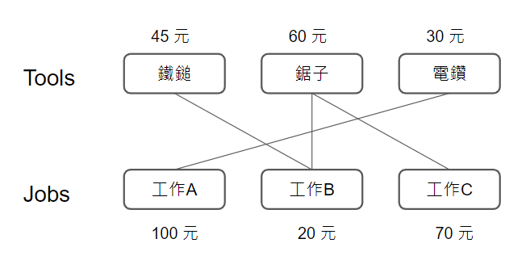{ width="300" }
	</figure>
	
	$1 \le n, m \le 500,$ 物品需求關係數量 $\le 2\times 10^4$
	
	??? note "思路"
		先建圖，左半排擺 tools，右半排擺 jobs，成本和報酬為邊權，若方案 i 需要工具 j，則連邊 (j, i)
		
		<figure markdown>
	      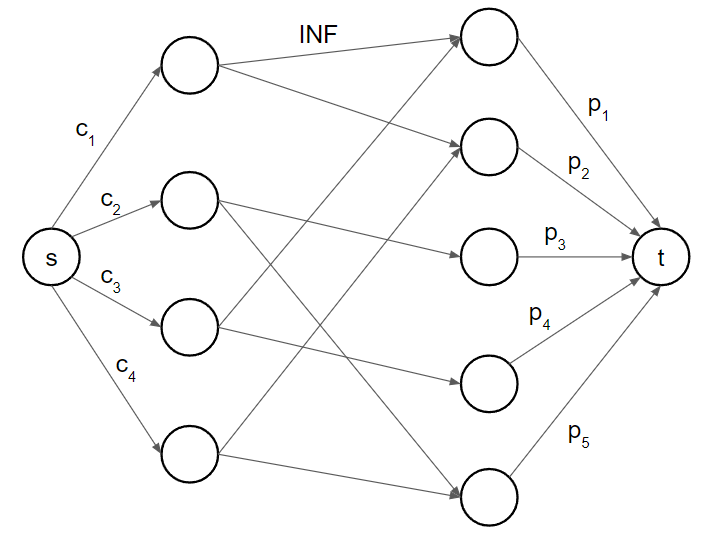{ width="400" }
	    </figure>
	    
	    我們要選一個連通塊，使得裡面包含要選的 tools 與 jobs，而這個連通塊其實就是我們的 T-component
	    
	    <figure markdown>
	      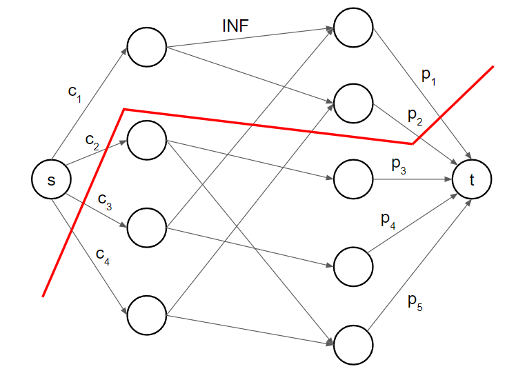{ width="400" }
	    </figure>
	    
	    這時候得到的 min cut 就會是**要買的 tools C** 和**不賺的 jobs P'**。若選完 maximum flow > 0，代表還有一個 tool 你沒有決定要不要選
	    
	    - 選: 切在 s -> tools
	
		- 不選: 切在 jobs -> t
	
		最後答案就是 $\sum P$ - (C + P')

???+note "最大權閉包問題"
	給 n 個人的受歡迎程度和每個人的好友列表 (好友並非雙向關係)，若第 i 個人要參加聚會的話則他的所有好友都要參加聚會，要邀請若干個人使得受歡迎程度總和最大
	
	1 ≤ n ≤ 100, 1 ≤ m ≤ 1000
	
	??? note "思路"
		將受歡迎程度為負的當成要付出成本的工具，將受歡迎程度為正的當成可以賺錢的方案，A 要來的話 B 就要來，就很像要用 A 方案賺錢，就要買 B 工具，因此若有關係 A 來的話 B 一定要來，則要連結邊 (B, A)
		
		得到的最小割為要來的負受歡程度的人和不來的正受歡迎程度的人，如同成本利潤問題，用正受歡迎程度的人的總和扣掉最小割即為答案

## 二分圖系列

### 二分圖最大匹配

???+note "問題"
	給一個二分圖，選一些邊使任意兩條邊都沒有公共的頂點，且數量越大越好，也就是最大匹配，並輸出一組答案

創兩個超級源點和超級匯點，所有邊權都是 1，求 max flow 就是答案。輸出答案即看位於兩排中央流滿的邊，極為所求。

<figure markdown>
  { width="300" }
</figure>

### DAG 最小路徑覆蓋

???+note "問題"
	給一張 n 點 m 邊的 DAG，最少選幾條路徑才可以蓋住所有的點，且任兩條路徑不能有共通的點，也就是問 disjoint path 數量
	
	<figure markdown>
	  { width="300" }
	</figure>

??? info "不重疊路徑數  + 路徑長總和 = n"
	對於每個點，有被覆蓋到 iff 
	
	- 前面有一條邊連接
	
	- 為 disjoint path 的開頭
	
	因此每個點都貢獻都可以分成上述兩種 case，而點的數量為 n，不重疊路徑數 + 路徑長總和自然就是 n
	
	<figure markdown>
	  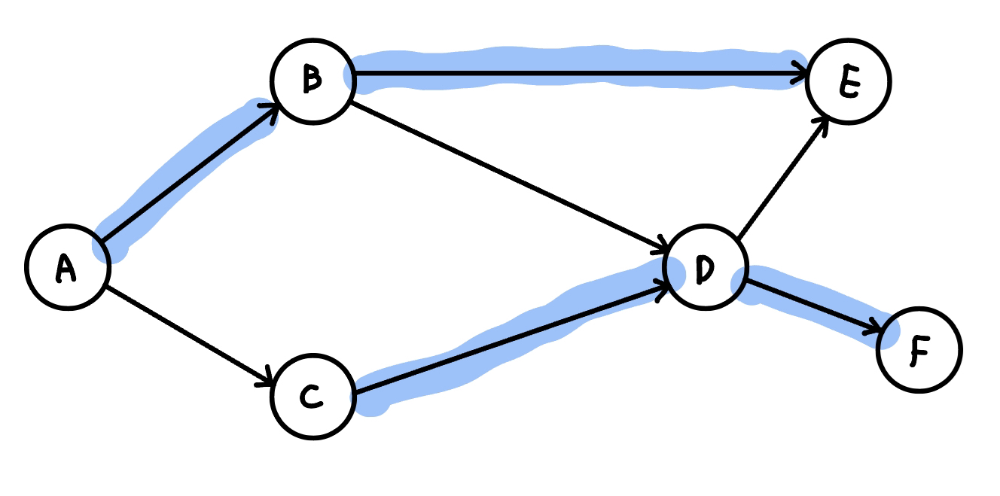{ width="300" }
	</figure>

路徑上會滿足每個點的 in-degree 和 out-degree 至多都是 1，所以我們可以將每個點拆成入點跟出點，進行二分圖最大匹配

<figure markdown>
  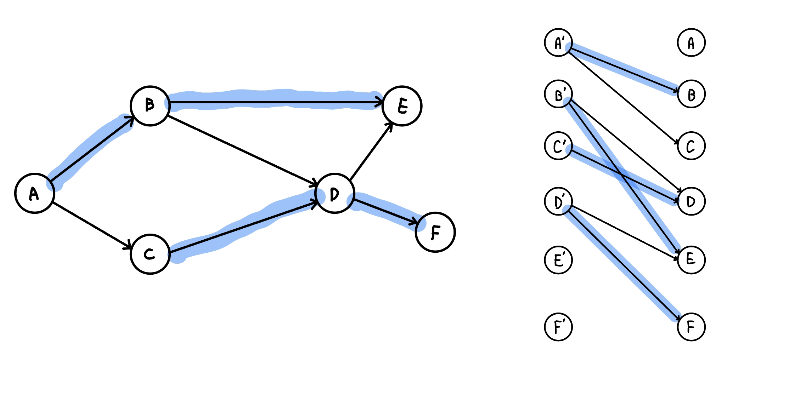{ width="300" }
</figure>

### 二分圖最小點覆蓋

???+note "問題"
	給一個二分圖，選擇最少的點來覆蓋所有的邊，且數量越小越好，也就是最小點覆蓋，並輸出一組答案
	
??? info "【Kőnig's theorem】: 在二分圖中，|最小點覆蓋| = |最大匹配|"
    
    這邊給出 Kőnig's theorem 的構造法證明，也就是「為何一定找的到一組最小點覆蓋，其數量恰為 max flow」。
    
    最小點覆蓋顧名思義就是要找到一些重要的點，並且這些點要越少越好，考慮 min cut，min cut 可以找到重要的邊，使 s 跟 t 的 max flow = 0，而且數量最小化，我們使用找一組 min cut 的方法，從 s 開始走還沒流滿的邊，找出 S-component, T-component
    
    <figure markdown>
      { width="400" }
      <figcaption>綠色即為 S-component, 紫色即為 T-component</figcaption>
    </figure>
    
    以上圖來說，我們用 dfs 從 s → 4 → 6 → 1 找出 S-component，其餘的則是 T-component
    
    <figure markdown>
      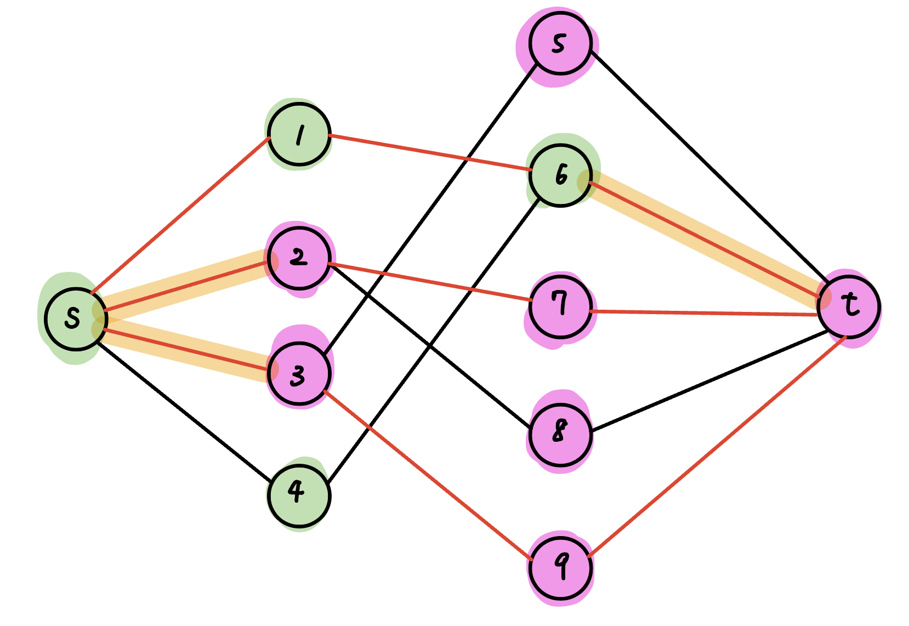{ width="400" }
    </figure>
    
    將 (u ∈ S, v ∈ T) 的用橘色標記出來，即為 min cut
    
    因為依照 min cut 的定義，將橘色這些邊刪除後 s 到 t 的 max flow = 0，代表橘色這些邊相鄰且在中間的點足以支配中間的每一條邊，而又 min cut = max flow，所以最小點覆蓋數量 = min cut = max flow。具體要選哪些中間的點，如下:
    
    - 左邊且在 T-component 中
    
    - 右邊且在 S-component 中
    
    <figure markdown>
      { width="400" }
      <figcaption>粗框的點就是最小點覆蓋</figcaption>
    </figure>

根據 Kőnig's theorem，我們得知最小點覆蓋數量跟最大匹配的數量是一樣的，也就是 max flow。若要輸出答案，那我們就選以下這些點即可

- 左邊跟 mincut 同 t 側的的點

- 右邊跟 mincut 同 s 側的的點

具體為什麼可以這樣做在上面 Kőnig's theorem 的構造法證明中有提到

???+note "[CSES - Coin Grid](https://cses.fi/problemset/task/1709)"
    給一個 $n\times n$ 的 Grid，有些格子上有錢幣。每次可以移除一個 row 或一個 col 的所有錢幣，問最少要幾次操作
	

### 二分圖最大獨立集

???+note "問題"
	給一個二分圖，選一些點使選的點兩兩不相鄰，且數量越大越好，也就是最大獨立集，並輸出一組答案
	
??? info "定理: 在一般圖上，|最小點覆蓋| + |最大獨集| = n"
	【證明】: 最小點覆蓋以外都是最大獨立集

	每條邊都會被最小覆蓋支配（每條邊至少會有一個點被最小點覆蓋選到），所以剩餘的點跟點之間不可能會有一條邊（有的話代表沒被支配），符合最大獨立集定義

所以答案就是 n - max flow。輸出答案的話，就把最小點覆蓋沒選到的點都選起來

<figure markdown>
  { width="250" }
  <figcaption>藍色為最小點覆蓋, 紅色為最大獨集</figcaption>
</figure>

### 比較

- 在二分圖下
	- 最大匹配 (MM) = 最小點覆蓋 (MVC)
	- 最大獨立集 (MIS) + 最小點覆蓋 (MVC) = n
	- 都可以用 max flow 在多項式時間解出

- 在一般圖下
	- 最大獨立集 (MIS) + 最小點覆蓋 (MVC) = n
	- 最大獨立集,最小點覆蓋 : NP-hard 問題 (目前已知的演算法只能指數時間解出)
	- 最大匹配 : P 問題


## min cost max flow

???+note "題目"
	給一個有向圖，每條邊 (u, v) 都有一個邊權 c(u, v) 代表容量上限，有 cost(u, v)代表在這條邊流過一單位的流所需要的成本，找一個 flow 使 $\sum f(u,v)\times cost(u,v)$ 最小
	
概念和 Ford-Fulkson 一樣找增廣路徑，但是每次要找最便宜的。每條邊我們會多紀錄一個成本  cost(u, v)，對於反向邊的成本為負的正向邊成本，退流的時候等價於抵銷成本。因為圖上有負邊，所以必須用 Bellman-Ford 或是 SPFA 來找最短路徑

複雜度跟 Fulk-Fulkerson 就差在一個是 dfs，一個是 Bellman-Ford，而 Bellman-Ford 是 O(VE)，所以複雜度就是 O(F * VE)

??? note "code"
	```cpp linenums="1"
	#include <bits/stdc++.h>
    #define int long long

    using namespace std;
    
    const int INF = (1LL << 60);
    const int M = 1e9 + 7;
    
    int n;
    
    struct dinic {
        struct Edge {
            int u, v, cap, c;
        };
    
        int n, m, s, t;
        vector<vector<int>> G;
        vector<Edge> edges;
        vector<int> lv;
        vector<int> cur;
    
        void init() {
            n = m = 0;
            G.clear();
            edges.clear();
        }
    
        int add_node() {
            n++;
            G.push_back({});
            return n - 1;
        }
    
        void add_edge(int u, int v, int cap, int w) {
            edges.push_back({u, v, cap, w});
            G[u].push_back(m++);  // 0
            edges.push_back({v, u, 0LL, -w});
            G[v].push_back(m++);  // 1
        }
    
        pair<int, int> flow(int _s, int _t) {
            s = _s, t = _t;
            int fl, cost;
            fl = cost = 0;
            int cnt = 0;
            while (true) {
                vector<int> dis = vector<int>(n, INF);
                vector<int> inq = vector<int>(n, 0);
                vector<int> pre = vector<int>(n, -1);
                vector<int> preL = vector<int>(n, -1);
                dis[s] = 0;
                queue<int> q;
                q.push(s);
                while (q.size()) {
                    int u = q.front();
                    q.pop();
                    inq[u] = 0;
                    for (int i = 0; i < (int)G[u].size(); i++) {
                        int v = edges[G[u][i]].v;
                        int w = edges[G[u][i]].c;
                        int fw = edges[G[u][i]].cap;
    
                        if (fw > 0 && dis[v] > dis[u] + w) {
                            pre[v] = u;
                            preL[v] = G[u][i];  // bug: preL[v] = i;
                            dis[v] = dis[u] + w;
                            if (!inq[v]) {
                                inq[v] = 1;
                                q.push(v);
                            }
                        }
                    }
                }
    
                if (dis[t] == INF) break;
                int tf = INF;
                int u, l;
                for (int v = t; v != s; v = u) {
                    u = pre[v];
                    l = preL[v];
                    tf = min(tf, edges[l].cap);
                }
    
                for (int v = t, u, l; v != s; v = u) {
                    u = pre[v];
                    l = preL[v];
                    edges[l].cap -= tf;
                    edges[l ^ 1].cap += tf;
                }
    
                cost += tf * dis[t];
                fl += tf;
            }
            return {fl, cost};
        }
    
    } flow;
    
    signed main() {
        ios::sync_with_stdio(0);
        cin.tie(0);
    
        int n, m, s, t;
        cin >> n >> m >> s >> t;
        flow.init();
        for (int i = 1; i <= n; i++) flow.add_node();
        for (int i = 0; i < m; i++) {
            int u, v, cap, w;
            cin >> u >> v >> cap >> w;
            flow.add_edge(u, v, cap, w);
        }
        auto [f, cost] = flow.flow(s, t);
        cout << f << " " << cost << "\n";
    }
    ```

???+note "[CSES - Distinct Routes II](https://cses.fi/problemset/task/2130)"
	給一張 n 點 m 邊有向圖，有源點 1 走到匯點 n，每條邊 (u, v) 最多只能走 c(u, v) 次，且經過的 cost 都是 1，最少需要花多少 cost 才能走出 k 條 disjoint path
	
	$n\le 10^5, m\le 10^5, 1\le k\le n - 1$
	
	??? note "思路"
		若邊的費用都是 0，只需要判斷 s-t maximum flow 是否大於等於 k
		
		邊有費用，權重都是 1 or -1，可以每次用 Bellman-Ford O(nm) 找到起點終點最便宜增廣路徑，共會跑 k 次，所以是 O(n * m * k)

???+note "[LOJ #6011. 「网络流 24 题」运输问题](https://loj.ac/p/6011)"
	有 $m$ 個倉庫和 $n$ 個零售店，第 $i$ 個倉庫有 $a_i$ 的貨物，第 $j$ 個零售店需要 $b_j$ 的貨物，供需平衡。從第 $i$ 個倉庫運送一單位貨物到第 $j$ 個零售店需要 $c_{i,j}$ 的費用，求滿足供需的最少費用。
	
	$n, m\le 100$
	
	??? note "思路"
		使用 MCMF
		
		- 將 s 向 m 個倉庫連邊，capacity = a[i], cost = 0
	
		- 將第 i 個倉庫與第 j 個零售店連邊，capacity = INF, cost = c[i][j]
	
		- n 個零售店向 t 連邊，capacity = c[i], cost = 0

???+note "二分圖帶權最大匹配 [CSES - Task Assignment](https://cses.fi/problemset/task/2129)"
	有 n 個人和 n 個工作，編號 i 的人做工作 j 要 cost(i, j) 的費用，每個工作分配給一個人做，每個人只能做一個工作，最小化總共的費用
	
	$n\le 200, 1\le c_{i, j}\le 1000$
	
	??? note "思路"
		用 MCMF，將人與工作個擺兩邊，中間用 capactity = 1, cost = cost(i, j) 的邊連接，s 連接所有人，capacity = 1, cost = 0，所有工作連接 t，capacity = 1, cost = 0
		
		複雜度為 O(n) 次 SPFA，SPFA 複雜度 O(V * E) = O(n * n^2)，所以是 O(n^4)

## 建模技巧(Flow Graph Modeling)

### 多源點多匯點

建立一個超級源點和超級匯點，和原本的源點與匯點連接，capacity 設為無限大

<figure markdown>
  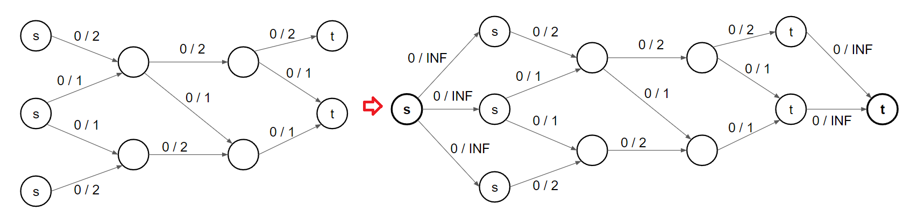{ width="700" }
</figure>

### 點有流量限制

將每個點拆成兩個點，中間用對應的流量限制當邊的 capacity

<figure markdown>
  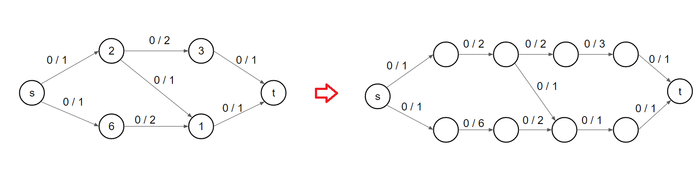{ width="700" }
</figure>

## 題目

???+note "[CSES - Distinct Routes](https://cses.fi/problemset/task/1711)"
	給一張 n 點 m 邊的圖，最多找到幾條 disjoint path 

	$2\le n\le 500, 1\le m\le 1000$
	
	??? note "思路"
		edges capacity 設為 1，跑 max flow

- [LOJ 網路流 24 題](https://loj.ac/problems/tag/30)

## 參考資料

- <https://www.cnblogs.com/dijkstra2003/p/7598931.html>

- <https://www.mropengate.com/2015/01/algorithm-ch4-network-flow.html?m=1>

- <http://pisces.ck.tp.edu.tw/~peng/index.php?action=showfile&file=f3cec71910d4a0106624e839f2891b17198ef58be>

- <https://github.com/NCTU-PCCA/NCTU_Fox/tree/master/codebook/Graph/Flow>

- <https://web.ntnu.edu.tw/~algo/Matching.html>

- <https://nckuacm.github.io/2020/slides/week13_1.pdf>

- <https://chmnchiang.github.io/ioi-camp-2016-flow-slides/#/>