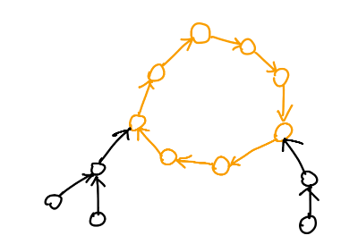
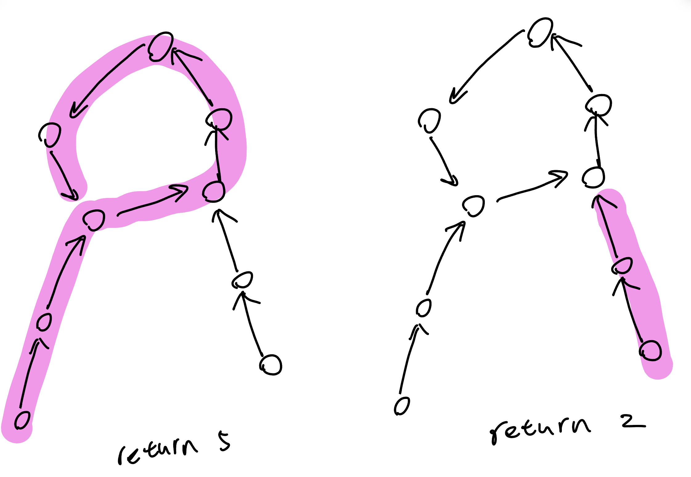

又稱頂環樹，水母圖。中國稱基環樹。英文叫做 functional graph。

## 性質

內向基環樹符合以下性質

1. 每個點的 out degree 都是 1
2. 恰有 $n$ 條邊

<figure markdown>
  { width="300" }
</figure>

## 找環寫法

??? question "為什麼不能用一般的 dfs ?"
	一般的 dfs 在找還得後可能發生以下問題

    <figure markdown>
      { width="300" }
    </figure>
    
    例如要輸出每個基環樹上的 cycle size，那你有可能第二次在走的時候，碰到已 visited 的點就以為找到環了，實則不是
    
找到環就是在目前這次的 dfs 中，我碰到了我之前（還是這一輪）走過的點。

### 有向圖

??? note "code"
	```cpp linenums="1"
	void dfs(int u) {
        instk[u] = vis[u] = true;
        for (auto v : G[u]) {
            if (vis[v] == false) {
                dfs(v);
            } else if (instk[v]) {
                // cycle: v → … → u
            }
        }
        instk[u] = false;
    }
    ```

### 無向圖

??? note "無重邊"
	```cpp linenums="1"
	void dfs(int u, int par) {
        instk[u] = vis[u] = true;
        for (auto v : G[u]) {
        	if (v == par) continue;
            if (vis[v] == false) {
                dfs(v, u);
            } else if (instk[v]) {
                // cycle: v → … → u
            }
        }
        instk[u] = false;
    }
    ```

??? note "有重邊"
	```cpp linenums="1"
	void dfs(int u, int pre_eid) {
        vis[u] = instk[u] = true;
        for (auto eid : G[u]) {
            if ((eid ^ 1) == pre_eid) continue;
            auto [u, v] = edges[eid];

            if (!vis[v]) {
                from[v] = eid;
                dfs(v, eid);
            } else if (instk[v]) {
                // cycle: v → … → u
            }
        }
        instk[u] = false;
    }
    ```
	
???+note "[CSES - Round Trip II](https://cses.fi/problemset/task/1678)"
	給一張 $n$ 點 $m$ 邊無向圖，輸出環上的點
	
	$n\le 10^5,m\le 2\times 10^5$
	
	??? note "思路"
		
		使用上面提到的 dfs 方式來做即可
	
		---
		
		> 另法 :
	
		我們想法是先把這張圖變成一張基環樹。找 cycle 只需要用 topo sort 把  in degree = 0 的點刪掉讓圖上只剩環即可
		
		所有 outdegree 是 0 的點一直移除，做完之後，所有人的 outdegree 都至少 1。對於每個剩下的點，把指出去的邊 （out-going edge） 只保留一條，就會變成基環樹了
		
	??? note "code"
		```cpp linenums="1"
	    #include <bits/stdc++.h>
        #define int long long
        #define pb push_back
        #define mk make_pair
        #define F first
        #define S second
        #define ALL(x) x.begin(), x.end()

        using namespace std;
        using pii = pair<int, int>;

        const int INF = 2e18;
        const int maxn = 1e5 + 5;

        int n, m;
        vector<int> G[maxn];
        int from[maxn];
        bool vis[maxn], instk[maxn];
        stack<int> cycle;

        void get_cycle(int s, int t) {
            int x = t;
            cycle.push(s);
            while (x != s) {
                cycle.push(x);
                x = from[x];
            }
            cycle.push(s);
        }

        bool dfs(int u) {
            instk[u] = vis[u] = true;
            for (auto v : G[u]) {
                if (vis[v] == false) {
                    from[v] = u;
                    if (dfs(v)) return true;
                } else if (instk[v]) {
                    get_cycle(v, u);
                    return true;
                }
            }
            instk[u] = false;
            return false;
        }

        signed main() {
            cin >> n >> m;
            for (int i = 0; i < m; i++) {
                int u, v;
                cin >> u >> v;
                G[u].push_back(v);
            }
            for (int i = 1; i <= n; i++) {
                if (vis[i] == false) {
                    if (dfs(i)) {
                        cout << cycle.size() << '\n';
                        while (cycle.size()) {
                            cout << cycle.top() << ' ';
                            cycle.pop();
                        }
                        exit(0);
                    }
                }
            }
            cout << "IMPOSSIBLE\n";
        } 
	    ```

???+note "基環樹環大小 [CF 1867 D. Cyclic Operations](https://codeforces.com/contest/1867/problem/D)"
	有一個長度為 $n$ 的陣列 $a$，一開始裡面都是 $0$。給 $k$，給陣列 $b$，你可對 $a$ 做好幾次以下操作，問你是否能將 $a$ 變成 $b$。
	
	- $\text{change}(l):$ 將 $a_{l_i}$ 變成 $l_{(i \% k) + 1}$

	$1\le k\le n\le 10^5, 1\le b_i\le n, 1\le l_i\le n, l$ 的長度為 $k$ 且裡面的元素 distinct
    
    ??? note "思路"
    	
    	i → b[i] 建圖，看每個連通塊（基環樹）的環大小是否恰為 k 
    	
        k = 1 特判
        
    ??? note "code"
 		```cpp linenums="1"
 		#include <bits/stdc++.h>
        #define int long long
        #define pb push_back
        #define mk make_pair
        #define F first
        #define S second
        #define ALL(x) x.begin(), x.end()

        using namespace std;
        using pii = pair<int, int>;

        const int INF = 2e18;
        const int maxn = 3e5 + 5;
        const int M = 1e9 + 7;

        int n, k, fg;
        vector<int> G[maxn];
        int a[maxn], dis[maxn], instk[maxn];

        void dfs(int u) {
            instk[u] = true;
            for (auto v : G[u]) {
                if (dis[v] == 0) {
                    dis[v] = dis[u] + 1;
                    dfs(v);
                } else if (instk[v]) {
                    if (dis[u] - dis[v] + 1 != k) {
                        fg = false;
                    }
                }
            }
            instk[u] = false;
        }

        void solve() {
            cin >> n >> k;
            fg = true;
            for (int i = 1; i <= n; i++) {
                dis[i] = 0;
                instk[i] = 0;
                G[i].clear();
            }
            for (int i = 1; i <= n; i++) {
                cin >> a[i];
                G[i].pb(a[i]);
            }
            if (k == 1) {
                for (int i = 1; i <= n; i++) {
                    if (a[i] != i) {
                        cout << "NO\n";
                        return;
                    }
                }
                cout << "YES\n";
                return;
            }
            for (int i = 1; i <= n; i++) {
                if (dis[i] == 0) {
                    dis[i] = 1;
                    dfs(i);
                    if (fg == false) {
                        cout << "NO\n";
                        return;
                    }
                }
            }
            cout << "YES\n";
        } 

        signed main() {
            // ios::sync_with_stdio(0);
            // cin.tie(0);
            int t = 1;
            cin >> t;
            while (t--) {
                solve();
            }
        } 
 		```
 		
## 例題

### 基環樹 dp

???+note "水母圖最長路 [Zerojudge k186. pC. 關卡地圖 (game)](https://zerojudge.tw/ShowProblem?problemid=k186) "
	給一張 $n$ 點 $m$ 邊無向圖，問最長權重和的 path 權重和是多少
	
	$n\le 10^5,m=n-1$ 或 $n$
	
	??? note "思路"
		將環上的點編號，令 sum[i] 為環上前 i 個點的 a[i] 的總和，d[i] 為 i 往下 連最長的 path，若從第 i 和第 j 個點連下去，那答案就是 
		
		sum[i] - sum[j - 1] + d[cycle[i]] + d[cycle[j]] - a[cycle[i]] - a[cycle[j]]
		
		所以我們要用單調對列維護 - sum[j - 1] + d[cycle[j]] - a[cycle[j]] 越大越好的
		
	??? note "code"
		```cpp linenums="1"
		#include <bits/stdc++.h>
	    #define int long long
	    #define pii pair<int, int>
	    #define pb push_back
	    #define mk make_pair
	    #define F first
	    #define S second
	    #define ALL(x) x.begin(), x.end()
	
	    using namespace std;
	
	    const int INF = 2e18;
	    const int maxn = 2e6 + 10;
	    const int M = 1e9 + 7;
	
	    int n, m, ans, sz;
	    int instk[maxn], dfn[maxn], vis[maxn], q[maxn], from[maxn], d[maxn];
	    int cycle[maxn],sum[maxn], a[maxn];
	    vector<int> G[maxn];
	
	    void get_cycle(int x, int y) {
	        while (y != x) {
	            cycle[++sz] = y;
	            sum[sz] = a[y];
	            y = from[y];
	        }
	        cycle[++sz] = x;
	        sum[sz] = a[x];
	        for (int i = 1; i <= sz; i++) {
	            vis[cycle[i]] = true;
	            cycle[sz + i] = cycle[i];
	            sum[sz + i] = sum[i];
	        }
	        for (int i = 1; i <= 2 * sz; i++) sum[i] += sum[i - 1];
	    }
	
	    void find_cycle(int u, int par) {
	        dfn[u] = instk[u] = true;
	        for (auto v : G[u]) {
	            if (v == par) continue;
	            if (!dfn[v]) {
	                from[v] = u;
	                find_cycle(v, u);
	            } else if (instk[v]) {
	                get_cycle(v, u);
	            }
	        }
	        instk[u] = false;
	    }
	
	    void cal_tree(int u) {
	        vis[u] = true;
	        d[u] = a[u];
	        for (auto v : G[u]) {
	            if (vis[v]) continue;
	
	            cal_tree(v);
	            ans = max({ans, d[u] + d[v], d[v] + a[u], a[u]});
	            d[u] = max(d[u], d[v] + a[u]);
	        }
	    }
	
	    void init() {
	        cin >> n >> m;
	        int u, v;
	        for(int i = 1; i <= m; i++) {
	            cin >> u >> v;
	            G[u].pb(v);
	            G[v].pb(u);
	        }
	        for (int i = 1; i <= n; i++) cin >> a[i];
	    }
	
	    void work() {
	        ans = -INF;
	        if (m == n) {
	            find_cycle(1, -1);
	            for (int i = 1; i <= sz; i++) cal_tree(cycle[i]);
	            int l = 1, r = 0;
	            for (int i = 1; i <= 2 * sz; i++) {
	                while (l <= r && q[l] <= i - sz) l++;
	                if (l <= r) ans = max(ans, d[cycle[i]] + d[cycle[q[l]]] + sum[i] - sum[q[l] - 1] - a[cycle[i]] - a[cycle[q[l]]]);
	                while (l <= r && d[cycle[q[r]]] - sum[q[r] - 1] - a[cycle[q[r]]] <= d[cycle[i]] - sum[i - 1] - a[cycle[i] - 1]) r--;
	                q[++r] = i;
	            }
	        } else {
	            cal_tree(1);
	        }
	        cout << ans << '\n';
	    }
	
	    signed main() {
	        ios::sync_with_stdio(0);
	        cin.tie(0);
	        init();
	        work();
	    } 
	    ```

???+note "水母圖最長路 [洛谷 P4381 [IOI2008] Island](https://www.luogu.com.cn/problem/P4381)"
	給 $n$ 個點，形成水母圖森林，邊有邊權。問每個水母圖最長路的總和（可以不選）
	
	$n\le 10^6,-10^9 \le w_i \le 10^9$
	
	??? note "思路"
		因為有重邊，所以要改一下存 Graph 的方式，環上第 i, j 個點連接並連下去的最長路是 sum[i] - sum[j] + d[cycle[i]] + d[cycle[j]]，所以我們用單調隊列為戶 -sum[j] + d[cycle[j]] 越大越好的
	
	??? note "code"
		```cpp linenums="1"
		#include <bits/stdc++.h>
	    #define int long long
	    #define pii pair<int, int>
	    #define pb push_back
	    #define mk make_pair
	    #define F first
	    #define S second
	    #define ALL(x) x.begin(), x.end()
	
	    using namespace std;
	
	    const int INF = 2e18;
	    const int maxn = 2e6 + 10;
	    const int M = 1e9 + 7;
	
	    struct Edge {
	        int u, to, w;
	    };
	
	    int n, m, ans, sz;
	    int instk[maxn], dfn[maxn], vis[maxn], q[maxn], from[maxn], d[maxn];
	    Edge edges[maxn];
	    int cycle[maxn],sum[maxn];
	    vector<int> G[maxn];
	
	    void get_cycle(int x, int y, int weight) {
	        sum[1] = weight;
	        while (y != x) {
	            cycle[++sz] = y;
	            sum[sz + 1] = edges[from[y]].w;
	            y = edges[from[y] ^ 1].to;
	        }
	        cycle[++sz] = x;
	        for (int i = 1; i <= sz; i++) {
	            vis[cycle[i]] = true;
	            cycle[sz + i] = cycle[i];
	            sum[sz + i] = sum[i];
	        }
	        for (int i = 1; i <= 2 * sz; i++) sum[i] += sum[i - 1];
	    }
	
	    void find_cycle(int u, int pre_eid) {
	        dfn[u] = instk[u] = true;
	        for (auto eid : G[u]) {
	            if ((eid ^ 1) == pre_eid) continue;
	            auto [u, v, w] = edges[eid];
	            from[v] = eid;
	            if (!dfn[v]) {
	                find_cycle(v, eid);
	            } else if (instk[v]) {
	                get_cycle(v, u, w);
	            }
	        }
	        instk[u] = false;
	    }
	
	    void cal_tree(int u) {
	        vis[u] = true;
	        for (auto eid : G[u]) {
	            auto [u, v, w] = edges[eid];
	            if (vis[v]) continue;
	
	            cal_tree(v);
	            ans = max(ans, d[u] + d[v] + w);
	            d[u] = max(d[u], d[v] + w);
	        }
	    }
	
	    void init() {
	        cin >> n;
	        int u, v, w;
	        m = 1;
	        for(int i = 1; i <= n; i++) {
	            u = i;
	            cin >> v >> w;
	            edges[++m] = {u, v, w};
	            G[u].pb(m);
	            edges[++m] = {v, u, w};
	            G[v].pb(m);
	        }
	    }
	
	    void work() {
	        int res = 0;
	        for (int i = 1; i <= n; i++) {
	            if (dfn[i]) continue;
	            sz = ans = 0;
	
	            find_cycle(i, -1);
	            for (int i = 1; i <= sz; i++) cal_tree(cycle[i]);
	            int l = 1, r = 0;
	            for (int i = 1; i <= 2 * sz; i++) {
	                while (l <= r && q[l] <= i - sz) l++;
	                if (l <= r) ans = max(ans, d[cycle[i]] + d[cycle[q[l]]] + sum[i] - sum[q[l]]);
	                while (l <= r && d[cycle[q[r]]] - d[cycle[i]] <= sum[q[r]] - sum[i]) r--;
	                q[++r] = i;
	            }
	            res += ans;
	        }
	        cout << res << '\n';
	    }
	
	    signed main() {
	        ios::sync_with_stdio(0);
	        cin.tie(0);
	        init();
	        work();
	    } 
	    ```

???+note "水母圖最大獨立集 [洛谷P2607 [ZJOI2008] 骑士](https://www.luogu.com.cn/problem/P2607)"
	給 $n$ 個點，會構成基環樹森林，問最大獨立集權值總和
	
	$n\le 10^5$
	
	??? note "思路"
		我們考慮環上的任意一條邊 $(s,t)$，這條邊上的兩點只會是
		
		- **不選**, 選
	
		- 選, **不選**
	
		- **不選**, **不選**
		
		我們可以將這條邊拔掉，分兩種成 $s$ 不選與 $t$ 不選的情況做樹上最大獨立集
		
	??? note "code"
		```cpp linenums="1"
		#include <bits/stdc++.h>
	    #define pii pair<int, int>
	    #define pb push_back
	    #define mk make_pair
	    #define F first
	    #define S second
	    #define ALL(x) x.begin(), x.end()
	
	    using namespace std;
	
	    const int INF = 2e18;
	    const int maxn = 1e6 + 5;
	    const int M = 1e9 + 7;
	
	    struct Edge {
	        int u, to;
	    };
	
	    int n, m, cycle_eid;
	    int instk[maxn], dfn[maxn], a[maxn];
	    long long dp[maxn][2];
	    vector<int> G[maxn];
	    Edge edges[2 * maxn];
	
	    void find_cycle(int u, int pre_eid) {
	        dfn[u] = instk[u] = 1;
	        for (auto eid : G[u]) {
	            auto [u, v] = edges[eid];
	            if ((eid ^ 1) == pre_eid) continue;
	
	            if (!dfn[v]) {
	                find_cycle(v, eid);
	            } else if (instk[v]) {
	                cycle_eid = eid;
	            }
	        }
	    } 
	
	    void tree_dp(int u, int pre_eid) {
	        dp[u][1] = a[u], dp[u][0] = 0;
	        for (auto eid : G[u]) {
	            auto [u, v] = edges[eid];
	            if ((eid ^ 1) == pre_eid) continue;
	            if (eid == cycle_eid || (eid ^ 1) == cycle_eid) continue;
	
	            tree_dp(v, eid);
	            dp[u][0] += (long long)max(dp[v][0], dp[v][1]);
	            dp[u][1] += (long long)dp[v][0];
	        }
	    }
	
	    void init() {
	        cin >> n;
	        m = 1;
	        int x;
	        for(int i = 1; i <= n; i++) {
	            cin >> a[i] >> x;
	            edges[++m] = {i, x};
	            G[i].pb(m);
	            edges[++m] = {x, i};
	            G[x].pb(m);
	        }
	    }
	
	    void solve() {
	        long long res = 0;
	        for (int i = 1; i <= n; i++) {
	            if (dfn[i]) continue;
	            long long ans = 0;
	            find_cycle(i, 0);
	
	            int s = edges[cycle_eid].u, t = edges[cycle_eid].to;
	            tree_dp(s, 0);
	            ans = dp[s][0];
	            tree_dp(t, 0); // 要再做一次不然 dp[t][0] 是以 s 為根 t 的 subtree 的答案
	            ans = (long long)max(ans, dp[t][0]);
	
	            res += ans;
	        }
	
	        cout << res << '\n';
	    }
	
	    signed main() {
	        ios::sync_with_stdio(0);
	        cin.tie(0);
	        init();
	        solve();
	    } 
	    ```

???+note "[AcWing 359. 创世纪](https://www.acwing.com/problem/content/361/)"
	給 $n$ 點內向基環樹，選一些點使得每個有選的點至少有 $1$ 個 in degree 沒被選到，問最多可以選幾個點
	
	$n\le 10^6$
	
	??? note "思路"
		一樣拔環上的邊進行處理，若環上的邊強制要限制，那 dp[t][1] 就可以直接是 dp[t][0] + 1，若強制不限制那就當成 Tree 來處理即可
		
		若全部都選 dp[v][1]，我們需要將一個 dp[v][1] 代替成 dp[v][0]，且 dp[v][1] - dp[v][0] 要最小，若最好的情況有選到 dp[v][0]，那就沒事，有一個巧妙的寫法是 `del = min(del, max(dp[v][0], dp[v][1]) - dp[v][0])` 
	
	??? note "code"
		```cpp linenums="1"
		#include <bits/stdc++.h>
	    #define pii pair<int, int>
	    #define pb push_back
	    #define mk make_pair
	    #define F first
	    #define S second
	    #define ALL(x) x.begin(), x.end()
	
	    using namespace std;
	    using ll = long long;
	
	    const ll INF = 2e18;
	    const int maxn = 1e6 + 5;
	
	    int n, m, s, t, fg;
	    int instk[maxn], dfn[maxn], G[maxn];
	    ll dp[maxn][2];
	    vector<int> R[maxn];
	
	    void find_cycle(int u) {
	        dfn[u] = instk[u] = 1;
	        int v = G[u];
	        if (!dfn[v]) {
	            find_cycle(v);
	        } else if (instk[v]) {
	            s = u, t = v;
	        }
	        instk[u] = 0;
	    } 
	
	    void tree_dp(int u) {
	        dp[u][1] = 0, dp[u][0] = 0;
	        ll del = INF;
	        for (auto v : R[u]) {
	            if (t == u && s == v) continue;
	
	            tree_dp(v);
	            dp[u][0] += max(dp[v][0], dp[v][1]);
	            del = min(del, max(dp[v][0], dp[v][1]) - dp[v][0]);
	        }
	        dp[u][1] = dp[u][0] - del + 1;
	        if (fg && u == t) {
	            dp[u][1] = dp[u][0] + 1;
	        }
	    }
	
	    void init() {
	        cin >> n;
	        int x;
	        for(int i = 1; i <= n; i++) {
	            cin >> x;
	            G[i] = x;
	            R[x].pb(i);
	        }
	    }
	
	    void solve() {
	       ll res = 0;
	        for (int i = 1; i <= n; i++) {
	            if (dfn[i]) continue;
	            ll ans = 0;
	            s = 0, t = 0;
	            find_cycle(i);
	            if (s == 0) continue; 
	
	            fg = 0;
	            tree_dp(s);
	            ans = max(dp[s][0], dp[s][1]);
	            fg = 1;
	            tree_dp(s);
	            ans = max(ans, dp[s][0]);
	            res += ans;
	        }
	
	        cout << res << '\n';
	    }
	
	    signed main() {
	        ios::sync_with_stdio(0);
	        cin.tie(0);
	        init();
	        solve();
	    } 
	    ```

### 其他

???+note "[Atcoder abc256 E. Takahashi's Anguish](https://atcoder.jp/contests/abc256/tasks/abc256_e)"
	你要給 $n$ 個人分糖果，第 $i$ 個人都有一個嫉妒的人 $X_i$，若 $X_i$ 比 $i$ 先拿到糖果那會產生嫉妒值 $C_i$。在所有可能的順序裡面，輸出嫉妒值之和最小可以是多少
	
	$n\le 2\times 10^5$
	
	??? note "思路"
		類似 [CSES - Course Schedule](https://cses.fi/problemset/task/1679)，我們建邊 $i\to X_i$，可以發現每個點的 out degree 都是 1，會形成內向基環樹。用 CSES 那題的想法一樣，用 topo sort 拔點，最後會剩環，代表我們需要捨棄掉環上的一條邊，讓 topo sort 得以進行，那我們當然是拔邊權最小的邊即可。所以答案就是每個內向基環樹上的環上的最小值總和

???+note "[CF 1270 G. Subset with Zero Sum](https://codeforces.com/contest/1270/problem/G)"
	給一個長度為 $n$ 的陣列 $a_1,\ldots ,a_n$，選一些數使得總合為 $0$，印出這些數的 index，保證有解
	
	$n\le 10^6,i-n\le a_i\le n-1$
	
	??? note "思路"
		通靈解。
		
		轉變一下式子得到：$1\le i-a_i \le n$，對每個 $a_i$ ，建一條從 $i$ 到 $i-a_i$ 的邊，由於每個點都有出度，整個圖必定有環。對於環可以得到：
	    
	    $$\begin{align}& i_1 - a_1=i_2 \\ & i_2 - a_2=i_3 \\ & i_3 - a_3 = i_4 \\ &\cdots \\ & i_n - a_n = i_1\end{align}$$
	    
	    求和得到 $a_1+a_2+\ldots +a_n=0$，因此環上所有點即是解，在這個限制條件下必定有解
	
	??? note "code (by rahlin)"
		```cpp linenums="1"
		#include <bits/stdc++.h>
	    #define int long long
	    #define pii pair<int,int>
	    #define pb push_back
	    #define f first
	    #define s second
	    using namespace std;
	
	    const int INF=1e18, MAXN=1e6+100;
	    int t,n;
	    vector<int> a(MAXN),in(MAXN),vis(MAXN);
	
	    signed main(){
	        ios_base::sync_with_stdio(0);
	        cin.tie(0);
	        cin>>t;
	        while(t--){
	            cin>>n;
	            for(int i=1;i<=n;i++){
	                in[i]=0,vis[i]=0;
	            }
	            for(int i=1;i<=n;i++){
	                cin>>a[i];
	                a[i]=i-a[i];
	                in[a[i]]++;
	            }
	            queue<int> q;
	            for(int i=1;i<=n;i++) {
	                if(in[i]==0) q.push(i);
	            }
	            while(q.size()){
	                int u=q.front();
	                q.pop();
	                vis[u]=1;
	                int v=a[u];
	                if(!vis[v]){
	                    in[v]--;
	                    if(in[v]==0) q.push(v);
	                }  
	            }
	            int sum=0;
	            for(int i=1;i<=n;i++){
	                if(!vis[i]) sum++;
	            }
	            cout<<sum<<"\n";
	            for(int i=1;i<=n;i++){
	                if(!vis[i]) cout<<i<<" ";
	            }
	            cout<<"\n";
	        }
	    }
	    ```

???+note "[2022 TOI  模擬賽第一場 pA. Functional Graph](/wiki/cp/contest/images/TOI-2022-1.pdf#page=1)"
	給一張 $n$ 點 $m$ 邊的基環樹，將邊定向，使圖成為內向基環樹，並輸出最小字典序的方向序列（見原題）
	
	$n\le 10^5$
	
	??? note "思路"
		基環樹連接的 subtree 方向已定，就差環上可以是順時針或逆時針。我們從編號小到編號大枚舉邊，看他是否已被 visited，如果沒有的話我們就用 ''<'' 固定這條邊，然後去 dfs 環上的其他邊將他們也固定
		
	??? note "code"
		```cpp linenums="1"
		#include<iostream>
	    #include<algorithm>
	    #include<string>
	    #include<set>
	    #define SZ(X) ((int)(X).size())
	    using namespace std;
	    const int SIZE = 100'000;
	    multiset<pair<int, int>> e[SIZE + 1];
	    int x[SIZE], y[SIZE];
	    void del(int eid) {
	        int me = x[eid];
	        int you = y[eid];
	        e[me].erase(e[me].find({you, eid}));
	        e[you].erase(e[you].find({me, eid}));
	    }
	    string an;
	    bool go(int eid) {
	        an[eid] = '<';
	        int me = x[eid];
	        if(SZ(e[me]) != 2) return 0;
	        del(eid);
	        while(SZ(e[me])) {
	            if(SZ(e[me]) != 1) return 0;
	            int you = e[me].begin()->first;
	            int eid = e[me].begin()->second;
	            if(x[eid] == me) an[eid] = '>';
	            else an[eid] = '<';
	            del(eid);
	            me = you;
	        }
	        return 1;
	    }
	    void solve() {
	        int n;
	        cin >> n;
	        an.assign(n, 0);
	        for(int i = 1; i <= n; i++) {
	            e[i].clear();
	        }
	        for(int i = 0; i < n; i++) {
	            cin >> x[i] >> y[i];
	            e[x[i]].insert({y[i], i});
	            e[y[i]].insert({x[i], i});
	        }
	        set<int> qq;
	        for(int i = 1; i <= n; i++) {
	            if(SZ(e[i]) == 1) {
	                qq.insert(i);
	            }
	        }
	        while(!qq.empty()) {
	            int me = *qq.begin();
	            if(SZ(e[me]) == 0) {
	                cout << "Impossible\n";
	                return;
	            }
	            qq.erase(qq.begin());
	            int you = e[me].begin()->first;
	            int eid = e[me].begin()->second;
	            if(x[eid] == me) an[eid] = '>';
	            else an[eid] = '<';
	            del(eid);
	            if(SZ(e[you]) == 1) qq.insert(you);
	        }
	        for(int i = 0; i < n; i++) {
	            if(!an[i]) {
	                if(!go(i)) {
	                    cout << "Impossible\n";
	                    return;
	                }
	            }
	        }
	        cout << an << '\n';
	    }
	    int main() {
	        cin.tie(0);
	        ios_base::sync_with_stdio(false);
	        int T;
	        cin >> T;
	        while(T--) solve();
	        return 0;
	    }
	    ```

???+note "[BOI 2015 Tug of War](https://loj.ac/p/2707)"
	有 $2n$ 個選手，要將他們分成左右兩組玩拔河，第 $i$ 個選手要站左邊的第 $l_i$ 個位置或右邊的第 $r_i$ 個位置，站的那一側的力量值將會 +$s_i$。問是否能分成兩組使左右力量值差 $\le k$
	
	$n\le 3\times 10^4,k\le 20n,s_i\le 20$
	
	??? note "思路"
		這題的重點是，如何把它轉化成一個恰當的圖論模型。我們把選手轉化成邊，連通塊的邊數剛好等於點數，就是一個基環內向森林。我們此時要做的是「邊 $\rightarrow$ 點」匹配。如果出現有連通塊的點數不等於邊數時，要判不合法。對於樹的部分，直接讓每個點和連向父親的邊匹配，對於每個環，有兩種情況，先默認一個方向，預處理換方案的貢獻。這樣問題就變成 : 
		
		有 cnt 個物品，第 i 個物品的價值為 $-2a_i$，當前有的價值為 ans，你需要選擇一些物品，使得最後的總價值 $\le k$
		
		使用 0/1 背包，複雜度為 $O(n\times \sum s_i)$，使用 bitset 優化到 $O(\frac{n\times \sum s_i}{w})$，而 $\sum s_i$ 最大是 $40n$，所以這樣是 $\frac{3\times 10^4\times 40\times 3\times 10^4}{64}\approx 562500000$，可以通過

???+note "[USACO 2022 Silver JAN Cereal 2](https://www.luogu.com.cn/problem/P8095)"
    有 $M$ 種不同種類的麥片，每種麥片只有一箱，$N$ 頭牛中的每頭都有她最愛的麥片 $f_i$ 和次愛的麥片 $s_i$。牛會執行如下的過程：

    - 如果她最愛的麥片還在，取走並離開
    
    - 否則，如果她第次愛的麥片還在，取走並離開
    
    - 否則，她只能飢餓
    
    求出一個 $N$ 頭牛的 permutation，使飢餓的牛的數量最小。輸出最小飢餓數量與 permutation
    
    $1\le N\le 10^5, 2\le M\le 10^5$
    
    ??? note "思路"
    	建圖將邊當作牛，麥片當作點，建邊 $f_i\to s_i$。對於一個連通塊，我們分兩種情形討論
    	
    	當 $E=V - 1$ :
    	
    	必可隨便選一個點當 root，從 root 一層一層選下去，這樣對於一條邊至少下面那個點還可以選到
    	
    	當 $E\ge V$ :
    	
    	可在裡面找到一個基環樹的子圖。隨便選基環樹上一條邊，那條邊選 $f_i$，將這條邊拔掉後以 $f_i$ 當 root 變成 Tree 的 case。不管 $E$ 是多少，只能讓 $V$ 條邊 match 到 $V$ 個點
    	
    	> 詳細見 : <https://www.luogu.com.cn/blog/ShaoJia/solution-p8095>
    
    ??? note "code(by usaco)"
    	```cpp linenums="1"
    	#include <bits/stdc++.h>
     
        using namespace std;
    
        struct edge {
            int cow; // which cow's choice 
            int to;
            bool is_first;
    
            edge() {};
            edge(int cow, int to, bool is_first) : cow(cow), to(to), is_first(is_first) {};
        };
    
        int N, M;
    
        vector<edge> adj[100001];
        bool visited_cycle[100001]; // array for cycle finding
        bool visited[100001]; // visited array for finding which order of cows we should use
        bool gets_cereal[100001]; 
    
        int hungry_cows = 0;
        queue<int> order;
        int ignore_edge = -1;
        int first_cereal = -1; // the cereal we start the search from, if the CC is not a tree then this must be on a cycle
    
        void find_cycle(int cur, int prev = -1) {
            visited_cycle[cur] = true; 
    
            for (edge next : adj[cur]) {
                if (visited_cycle[next.to]) {
                    if (first_cereal == -1 && next.to != prev) {
                        if (next.is_first) {
                            first_cereal = next.to; 
                        } else {
                            first_cereal = cur;
                        }
    
                        ignore_edge = next.cow; 
                        order.push(next.cow);
                        gets_cereal[next.cow] = true;
                    }
                } else {
                    find_cycle(next.to, cur);
                }
            }
        }


        void dfs(int cur) {
            visited[cur] = true;
            for (edge next : adj[cur]) {
                if (!visited[next.to] && next.cow != ignore_edge) { 
                    gets_cereal[next.cow] = true;
                    order.push(next.cow);
                    dfs(next.to);
                }
            }
        }


        int main() {
            cin >> N >> M;
            for (int i = 0; i < N; ++i) {
                int a, b;
                cin >> a >> b;
                adj[a].push_back(edge(i+1, b, false));
                adj[b].push_back(edge(i+1, a, true));
            }
    
            for (int i = 1; i <= M; ++i) {
                first_cereal = -1;
                ignore_edge = -1;
                if (!visited[i]) {
                    find_cycle(i);
    
                    if (first_cereal > 0) {
                        dfs(first_cereal);
                    } else {
                        dfs(i);
                    }
                }
            }
    
            for (int i = 1; i <= N; ++i) {
                if (!gets_cereal[i]) {
                    ++hungry_cows;
                    order.push(i);
                } 
            }
    
            cout << hungry_cows << endl;
            while (!order.empty()) {
                cout << order.front() << endl; 
                order.pop();
            }
    
            return 0;
        }
        ```

### CSES 

???+note "[CSES - Planets Queries I](https://cses.fi/problemset/task/1750)"
	給一張 $n$ 點內向基環樹，$q$ 筆詢問 :
	
	- 從 $x$ 點走 $k$ 步，到達哪個點
	
	$n,q\le 2\times 10^5,k\le 10^9$
	
	??? note "code"
		```cpp linenums="1"
		#include <bits/stdc++.h>
        #define int long long
        #define pb push_back
        #define mk make_pair
        #define F first
        #define S second
        using namespace std;

        const int INF = 2e18;
        const int maxn = 2e5 + 5;
        int n, q;
        int par[maxn][32], vis[maxn];
        vector<int> G[maxn];

        void init () {
            cin >> n >> q;
            for (int i = 1; i <= n; i++) {
                cin >> par[i][0];
            }
        }

        // void dfs (int u) {
        //     if (vis[u]) return;
        //     vis[u] = true;
        //     dfs (par[u][0]);
        // }

        int jump (int x, int d) {
            int i = 0;
            while (d != 0) {
                if (d & 1) x = par[x][i];
                d >>= 1;
                i++;
            }
            return x;
        }

        void solve () {
            // for (int i = 1; i <= n; i++) {
            //     if (!vis[i]) dfs (i);
            // }
            for (int j = 1; j < 32; j++) {
                for (int i = 1; i <= n; i++) {
                    par[i][j] = par[par[i][j - 1]][j - 1];
                }
            }
            while (q--) {
                int u, k;
                cin >> u >> k;
                cout << jump (u, k) << "\n";
            }
        }

        signed main () {
            ios::sync_with_stdio(0);
            cin.tie(0);
            init ();
            solve ();
        }
        ```

???+note "[CSES - Planets Queries II](https://cses.fi/problemset/task/1160)"
	給一張 $n$ 點內向基環樹，$q$ 筆詢問 :
	
	- 從 $a$ 走到 $b$ 的最少步數，或走不到
	
	$n,q\le 2\times 10^5$

???+note "[CSES - Planets Cycles](https://cses.fi/problemset/task/1751)"
	給一張 $n$ 點內向基環樹，輸出每個點出發需要走幾步才能碰到已經 visited 過的點

	$n,q\le 2\times 10^5$

---

## 資料

- <https://en.m.wikipedia.org/wiki/Pseudoforest>

- <https://usaco.guide/silver/func-graphs?lang=cpp#example---badge>

- <https://zhuanlan.zhihu.com/p/559456187>

- <https://www.cnblogs.com/cly-none/p/9314812.html>

- <https://www.cnblogs.com/A-sc/p/13554630.html>

- <https://www.luogu.com.cn/blog/ShadderLeave/ji-huan-shu-bi-ji>