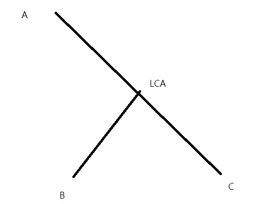
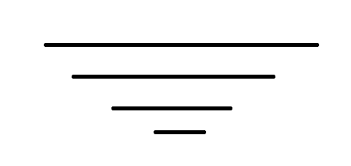

## 時間戳記
- 2021 附中模競 I -pE
- CSES... 樹上 prefix sum
- toi 乘車時間
- https://atcoder.jp/contests/abc267/tasks/abc267_f
- CSES movie festival II
- https://codeforces.com/gym/375522/problem/F
- CSES cyclic array
- 2021 附中模競 III pF
- https://zerojudge.tw/ShowProblem?problemid=c313
- CF Lynyrd Skynyrd

## 模板

???+note "code"
	```cpp linenums="1"
	vector<pii> G[maxn];
    int p[maxn][21], dp[maxn][21], dep[maxn];

    void dfs (int u, int par) {
        for (auto [v, w] : G[u]) {
            if (v == par) continue;
            p[v][0] = u;
            dp[v][0] = w;
            dep[v] = dep[u] + 1;
            dfs (v, u);
        }
    }
    
    void build () {
        for (int i = 1; i < 21; i++) {
            for (int j = 1; j <= n; j++) {
                p[j][i] = p[p[j][i - 1]][i - 1];
                dp[j][i] = max (dp[j][i - 1], dp[p[j][i - 1]][i - 1]);
            }
        }
    }
    
    int LCA (int a, int b) {
        if (dep[a] < dep[b]) swap (a, b);
        int dif = dep[a] - dep[b];
        for (int i = 20; i >= 0; i--) {
            if (dif & (1 << i)) {
                a = p[a][i];
            }
        }
    
        if (a == b) return a;
    
        for (int i = 20; i >= 0; i--) {
            if (p[a][i] != p[b][i]) {
                a = p[a][i];
                b = p[b][i];
            }
        }
    
        return p[a][0];
    }
    ```

## 性質

1. 兩點集 union 起來的 LCA 為兩點集分別的 LCA 的 LCA，舉例來說 $\text{lca}(a, b, c)$ 等於 $\text{lca}(\text{lca}(a, b), c)$
2. $dis(u,v)=\text{depth}(u)+\text{depth}(v)-2\times \text{depth}(\text{lca}(u,v))$


## 例題
### TIOJ 1687

???+note "[TIOJ 1687 . 樹上詢問 Query on a Tree II](https://tioj.ck.tp.edu.tw/problems/1687)"
    給 $u,v,k$ 問 $u$ 往 $v$ 走 $k$ 步走到的點
    
    $\texttt{IMPOSSIBLE}$ 輸出 $-1$
    
    ??? note "code"
    	```cpp linenums="1"
    	#include <bits/stdc++.h>
        #define int long long
        #define pb push_back
        #define pii pair<int, int>
        #define mk make_pair 
        using namespace std;
    
        const int maxn = 1e5 + 5;
        int n, q;
        vector<int> G[maxn];
        int p[maxn][19];
        int dep[maxn];
    
        void dfs(int u = 1, int par = 0) {
            p[u][0] = par;
            dep[u] = dep[par] + 1;
            for (auto v : G[u]) {
                if (v == par) continue;
                dfs(v, u);
            }
        }
    
        pii fnd(int a, int b) {
            pii ret = mk(0, 0); //dep(a) > dep(b)
            int dif = dep[a] - dep[b];
            ret.first = dif; // 紀錄 a 到 LCA 的距離
            ret.second = dif; //紀錄 b 到 a 的距離
            for (int i = 0; i < 19; i++) {
                if (dif & (1 << i)) {
                    a = p[a][i];
                }
            }
            if (a == b) return ret;
            for (int i = 18; i >= 0; i--) {
                if (p[a][i] != p[b][i]) {
                    a = p[a][i];
                    b = p[b][i];
                    ret.second += 2 * (1 << i); 
                    ret.first += (1 << i); 
                }
            }
            ret.second += 2;
            ret.first += 1;
            return ret;
        }
    
        int solve(int a, int b, pii dis, int k) {
            int cur = k;
            if (k > dis.first) {
                cur = dis.second - k; // 太大的話先走到 LCA
                for (int i = 0; i < 19; i++) {
                    if (cur & (1 << i)) {
                        b = p[b][i];
                    }
                }
                return b;
            } 
            else {
                cur = k; // 太大的話先走到 LCA
                for (int i = 0; i < 19; i++) {
                    if (cur & (1 << i)) {
                        a = p[a][i];
                    }
                }
                return a;
            }
        }
    
        signed main () { 
            cin >> n >> q;
            for (int i = 0; i < n - 1; i++) {
                int u, v;
                cin >> u >> v;
                G[u].pb(v);
                G[v].pb(u);
            }
            dfs();
            for (int j = 1; j < 19; j++) {
                for (int i = 1; i <= n; i++) {
                    p[i][j] = p[p[i][j - 1]][j - 1];
                }
            }
            while (q--) {
                int a, b, k, flg = 0;
                cin >> a >> b >> k;
                if (dep[b] > dep[a]) { // 維持出發點一定要深度比較低的原則
                    swap(a, b);
                    flg = 1;
                }
                pii ret = fnd(a,b); // 找 a 到 LCA 的距離與 b 到 a 的距離
                if (k > ret.second){ // 超過 b 到 a 的距離直接輸出 -1
                    cout << -1 << '\n';
                    continue;
                }
                if (flg) {
                    k = ret.second - k; // 因為剛剛把 a, b 對調，出發點改變，所以走的部數會改變
                }
                cout << solve(a, b, ret, k) << "\n"; //計算答案
            }
    
        }
        ```

???+note "[Atcoder abc267 F. Exactly K Steps](https://atcoder.jp/contests/abc267/tasks/abc267_f)"
	給一棵 $n$ 個點的樹，邊權為 $1$，進行 $q$ 次詢問，每次輸出任意一個離結點 $u$ 距離為 $k$ 的節點 
	
	$n,q\le 2\times 10^5$
	
	??? note "思路"
		最遠的點一定是樹直徑的端點
		
		令距離 $u$ 比較遠的那個端點為 $R$，先看 $u\to\texttt{LCA}(u, R)$ 是否比 $k$ 步多，如果還沒有就從較遠的端點往上爬
	    
		https://www.cnblogs.com/DM11/p/16701069.html
		
	??? note "code (by [cnblog](https://www.cnblogs.com/DM11/p/16701069.html))"
		```cpp linenums="1"
		#include <bits/stdc++.h>
	
	    using namespace std;
	
	    const int N = 200005;
	    vector<int> g[N];
	    int dep[N];
	    int anc[N][35];
	
	    void dfs(int u, int fa)
	    {
	        anc[u][0] = fa;
	
	        for(int j = 1; j <= 30; j ++)
	            if((1 << j) <= dep[u])
	                anc[u][j] = anc[anc[u][j - 1]][j - 1];
	
	        for(int v : g[u])
	        {
	            if(v == fa) continue;
	            dep[v] = dep[u] + 1;
	            dfs(v, u);
	        }
	    }
	
	    int LCA(int x, int y)
	    {
	        if(dep[x] < dep[y]) swap(x, y);
	
	        for(int j = 30; j >= 0; j --)
	            if(dep[x] - (1 << j) >= dep[y])
	                x = anc[x][j];
	        if(x == y)  return x;
	
	        for(int j = 30; j >= 0; j --)
	            if(anc[x][j] != anc[y][j] && (1 << j) <= dep[x])
	                x = anc[x][j], y = anc[y][j];
	        return anc[x][0];
	    }
	
	    int dis(int a, int b)
	    {
	        int c = LCA(a, b);
	        return abs(dep[a] - dep[c]) + abs(dep[b] - dep[c]);
	    }
	
	    int find_(int u, int k) //向上跳k次
	    {
	        int depth = dep[u] - k;
	        for(int i = 30; i >= 0; i --)
	            if(depth <= dep[u] - (1 << i))
	                u = anc[u][i];
	        return u;
	    }
	
	    int main()
	    {
	        int n;
	        scanf("%d", &n);
	        for(int i = 1; i < n; i ++)
	        {
	            int u, v;
	            scanf("%d%d", &u, &v);
	            g[u].push_back(v); g[v].push_back(u);
	        }
	        dfs(1, -1);
	        int L = 1, R = 1;
	        for(int i = 1; i <= n; i ++)    if(dis(1, i) > dis(1, L))   L = i;
	        for(int i = 1; i <= n; i ++)    if(dis(L, i) > dis(L, R))   R = i;
	
	        int m;
	        scanf("%d", &m);
	        while(m --)
	        {
	            int u, k;
	            scanf("%d%d", &u, &k);
	            if(dis(u, R) < dis(u, L))   swap(L, R);
	            int dist = dis(u, R);
	            if(k > dist)
	                printf("-1\n");
	            else
	            {
	                if(k <= dis(u, LCA(u, R))) //查看目标点在LCA的左端还是右端
	                    printf("%d\n", find_(u, k));
	                else
	                    printf("%d\n", find_(R, dist - k));
	            }
	        }
	    }
	    ```

???+note "[全國賽 2018 p7. 不回家的銷售員](https://zerojudge.tw/ShowProblem?problemid=e032)"
	給一個 $n$ 個點的無根樹，邊帶權，有 $q$ 筆查詢 :
	
	- 給 $k$，給個指定的點 $v_1,\ldots ,v_k$，輸出經過這些指定的點至少一次的最短路徑長度
	
	$n\le 10^5, \sum k \le 2n$
	
	??? note "思路"
		考慮所有點都選，答案 = 除了某一條 path 之外所有邊都走過兩次 = 樹上邊權總和 $\times 2$ - 最遠點對距離（樹直徑）
		
		考慮一些點所形成的子圖的答案，樹上邊權總和 $\times 2$ - 最遠點對距離（樹直徑）。對於邊權總和，會形成一條迴路
		
		考慮 dfs 序是一進一出，剛好每條邊都走過兩次。我們將有選的點 $v_1,\ldots v_k$ 按照 dfs 序小到大排序，$ans=dis(v_1,v_2)+dis(v_2, v_3) + \ldots + dis(v_k, v_1)$。對於樹直徑，我們用兩次貪心的方法做，先隨便挑一個指定的點，枚舉其他指定點，用 LCA 算與他們之中的誰距離最大，然後再從那個點做一次，總複雜度 $O(\sum k \log n)$
	
		> 參考 : <https://sorahisa-rank.github.io/nhspc-fin/2018/editorial.pdf#page=23>

???+note "[全國賽模擬賽 2022 pF. LCA 遊戲 (LCA)](https://www.csie.ntu.edu.tw/~b11902109/PreNHSPC2022/IqwxCSqc_Pre_NHSPC_zh_TW.pdf#page=17)"
	給一顆 $n$ 個點的樹，給點 $A$，Alice 會想著一個點 $B$，Bob 的目標是找出 $B$。每次 Bob 可以詢問 :
	
	- 把 root 定為 $C$，$\text{lca}(A, B)$ 是多少
	
	兩者皆 play optimal 的情況下，問 Bob 至少需要詢問幾次
	
	??? note "思路"
		等價於將根都定為 A，LCA(B, C) 是多少
	
		<figure markdown>
	      { width="400" }
	    </figure>
	    
	    每次詢問完都會確定答案是不是在這子樹，如果要確定在哪個子樹，最差要用「子樹數量 -1 次」，所以要花費最多次的子樹必定最先詢問，所以可以列出 :
	     
	    假設 $v_1, v_2, \ldots$ 是以 $dp[v_1] \ge dp[v_2] \ge \ldots$ 排序過的
	    
	    $$dp[u]=\max\{ dp[v_1]+0, dp[v_2] + 1, dp[v_3] + 2, \ldots \}$$
	    
???+note "[JOI 2022 Final 铁路旅行 2](https://www.luogu.com.cn/problem/P8163)"
	給 $n$ 個點，$m$ 條線路，第 $i$ 條線起點為 $a_i$，終點為 $b_i$，上車的位置不能離起點超過 $k$ 個點，可在任何一站下車。有 $q$ 筆詢問:

    - $\text{query}(s,t):$ 從 $s$ 開始到 $t$，最少搭乘幾條不同的線路，若無論如何都沒辦法則輸出 -1

    $n\le 10^5,m\le 2\times 10^5,q\le 5\times 10^4$
    
    ??? note "思路"
    	目前的經驗來看，凡是需要多次無序詢問或重複多次處理一張圖時，大機率是需要用到倍增的。

        令 $le(i,j),ri(i,j)$ 以 $i$ 為起點，搭乘 $2^j$ 條不同的線路，最左/右能到哪裡
        $$
        le(i,j)=\min\limits_{k\in[le(i-1,j),ri(i-1,j)]}le(i-1,k) \\ri(i,j)=\max\limits_{k\in[le(i-1,j),ri(i-1,j)]} ri(i-1,k)
        $$

        初始值 $le(i,0),re(i,0)$ 可以利用單調隊列來維護，例如 $re(i,0)$，我們一開始先將 interval 用左界小到大 sort，然後 queue 中保留的會是 $l_i$ 遞增，$r_i$ 遞減

        <figure markdown>
	      { width="300" }
	    </figure>

        那麼轉移的部分我可以對於每個 $le(*,j),re(*,j)$ 都開一顆線段樹，直接去區間查詢極值即可

        最後 $\text{query}(s,t)$ 我們用類似 LCA 查詢的方式，從 $s$ 開始擴展，直到區間恰好差一點涵蓋 $[s,t]$
        
        > 參考自: <https://www.luogu.com.cn/blog/jjsnam/solution-P8163>
        
    ??? note "code"
    	```cpp linenums="1"
    	/* code by jjsnam 2022.4.29 */
        /* Using Segment Tree */
        #include <algorithm>
        #include <cstring>
        #include <iostream>

        #define ls (id << 1)
        #define rs (id << 1 | 1)
        #define mid ((l + r) >> 1)
        #define u first
        #define v second

        using namespace std;
        typedef pair<int, int> pii;
        const int maxn = 1e5 + 5;
        const int maxm = 2e5 + 5;

        int le[maxn][17], ri[maxn][17];
        pii up[maxm], down[maxm];
        int cnt_up, cnt_down;
        int n, m, K, Q;
        struct Segment_Tree {
            struct Node {
                int left, right;
            } tr[maxn << 2];

            void pushup(int id) {
                tr[id].left = min(tr[ls].left, tr[rs].left);
                tr[id].right = max(tr[ls].right, tr[rs].right);
            }

            void build(int id, int l, int r, int k) {
                if (l == r) {
                    tr[id].left = le[l][k];
                    tr[id].right = ri[r][k];
                    return;
                }
                build(ls, l, mid, k);
                build(rs, mid + 1, r, k);
                pushup(id);
            }

            int query_left(int id, int l, int r, int a, int b) {
                if (a <= l && r <= b) {
                    return tr[id].left;
                }
                int res = 1e9;
                if (a <= mid) res = min(res, query_left(ls, l, mid, a, b));
                if (b > mid) res = min(res, query_left(rs, mid + 1, r, a, b));
                return res;
            }

            int query_right(int id, int l, int r, int a, int b) {
                if (a <= l && r <= b) {
                    return tr[id].right;
                }
                int res = -1e9;
                if (a <= mid) res = max(res, query_right(ls, l, mid, a, b));
                if (b > mid) res = max(res, query_right(rs, mid + 1, r, a, b));
                return res;
            }
        } root[17];

        void Get_start() {
            for (int i = 1; i <= n; i++) le[i][0] = ri[i][0] = i;
            sort(up + 1, up + cnt_up + 1);
            sort(down + 1, down + cnt_down + 1, greater<pii>());
            /* 单调队列 O(m) */
            int q[maxm], hh = 1, tt = 0;

            /* 处理右 */
            for (int i = 1, j = 1; i <= n; i++) {
                while (j <= cnt_up && up[j].u <= i) {
                    int r = up[j].v;
                    while (hh <= tt && up[q[tt]].v <= r) tt--;
                    q[++tt] = j;
                    j++;
                }
                while (hh <= tt && up[q[hh]].u <= i - K) hh++;
                if (hh <= tt) ri[i][0] = max(ri[i][0], up[q[hh]].v);
            }

            /* init */
            hh = 1, tt = 0;

            /* 处理左 */
            for (int i = n, j = 1; i > 0; i--) {
                while (j <= cnt_down && down[j].u >= i) {
                    int l = down[j].v;
                    while (hh <= tt && down[q[tt]].v >= l) tt--;
                    q[++tt] = j;
                    j++;
                }
                while (hh <= tt && down[q[hh]].u >= i + K) hh++;
                if (hh <= tt) le[i][0] = min(le[i][0], down[q[hh]].v);
            }
        }

        void init() {
            Get_start();
            root[0].build(1, 1, n, 0);
            for (int k = 1; k <= 16; k++) {
                for (int i = 1; i <= n; i++) {
                    le[i][k] = root[k - 1].query_left(1, 1, n, le[i][k - 1], ri[i][k - 1]);
                    ri[i][k] = root[k - 1].query_right(1, 1, n, le[i][k - 1], ri[i][k - 1]);
                }
                root[k].build(1, 1, n, k);
            }
        }

        int query(int S, int E) {
            int res = 0;
            int l = S, r = S;
            for (int k = 16; k >= 0; k--) {
                int L = root[k].query_left(1, 1, n, l, r);
                int R = root[k].query_right(1, 1, n, l, r);
                if (L <= E && E <= R) continue;
                l = L, r = R;
                res += (1 << k);
            }
            int L = root[0].query_left(1, 1, n, l, r);
            int R = root[0].query_right(1, 1, n, l, r);
            if (L <= E && E <= R)
                return res + 1;
            else
                return -1;
        }

        int main() {
            ios::sync_with_stdio(false);
            cin.tie(0), cout.tie(0);

            cin >> n >> K >> m;
            for (int i = 1, a, b; i <= m; i++) {
                cin >> a >> b;
                if (a < b)
                    up[++cnt_up] = make_pair(a, b);
                else
                    down[++cnt_down] = make_pair(a, b);
            }
            init();
            cin >> Q;
            int s, e;
            while (Q--) {
                cin >> s >> e;
                cout << query(s, e) << endl;
            }
            return 0;
        }
    	```
    	
