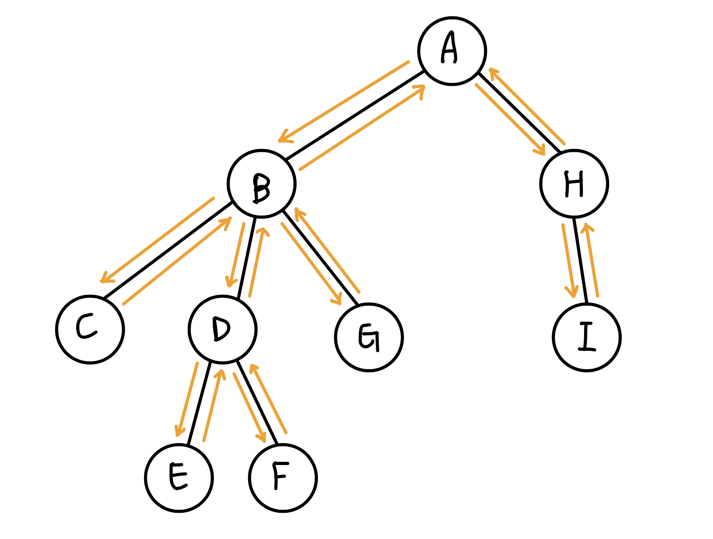

## 倍增法

跳到一個位置 t，使 check(t) = true，check(t + 1) = false。利用二進制枚舉高位到低位，若跳了之後是合法的就跳

??? note "code"
	```cpp linenums="1"
	int jump(int now) {
        int ans = 0;
        for (int i = 20; i >= 1; i--) {
            if (check(now, i)) {
                now = dp[now][i];
                ans += (1 << i);
            }
        }
        return ans;
    }
	```

??? warning "在某些題目, 最好還是將越界的倍增數組定義好無效狀態, 例如說 -1, INF 等等"
	例如說 dp(i, 0) = nxt[i]，但如果沒有設好狀態可能會使 nxt[i] = 0, 導致 dp(i, 0) = 0，然後 dp(i, j) = dp(dp(i, j - 1), j - 1) = dp(0, j - 1) = 0。這樣在 query 時，看能不能 jump 的時候會發現 0 < r，不會超過所以可以 jump，導致最後答案壞掉
	
???+note "[2021 附中模競 pE. 時空旅人之爭 (Time)](https://codeforces.com/gym/344833/problem/E)"
	給一棵 $n$ 個點的樹，複製人大軍會從 root 開始擴散，每 2 秒擴散一個節點。有 $q$ 筆詢問:
	
	- $\text{query}(s,t):$ 從入侵的時間點開始，從 $s$ 到 $t$ 至少要經過幾個有複製人大軍的節點
	
	$n,q\le 2\times 10^5$
	
	??? note "思路"
		分別在 path(s, lca(s, t)) 跟 path(lca(s, t), t) 上面二分搜，看到哪個點會被追到
		
		要看從 s 開始到點 x 是否會被追到就看「s 走到 x 的時間是否小於 root 走到 x 的時間」，若滿足的話就代表不會被追到。可以寫成 dis(s, x) < dep(x) * 2
		
		> 詳見: <https://hackmd.io/@joylintp/HJ6TfnVWY#/5/1>
	
	??? note "code"
		```cpp linenums="1"
		#include <bits/stdc++.h>
	
	    #define StarBurstStream               \
	        ios_base::sync_with_stdio(false); \
	        cin.tie(0);                       \
	        cout.tie(0);
	    #define eb(a) emplace_back(a)
	
	    using namespace std;
	
	    vector<vector<int>> g;
	    vector<int> in, out, dpt;
	    int ts = 0;
	    vector<vector<int>> anc;
	
	    void dfs(int now, int p, int d) {
	        in[now] = ts++;
	        dpt[now] = d;
	        anc[0][now] = p;
	        for (int i : g[now]) {
	            if (i == p) continue;
	            dfs(i, now, d + 1);
	        }
	        out[now] = ts++;
	    }
	
	    bool isAnc(int a, int b) {
	        return in[a] <= in[b] && out[a] >= out[b];
	    }
	
	    int getLCA(int a, int b) {
	        if (isAnc(a, b)) return a;
	        if (isAnc(b, a)) return b;
	        for (int i = 19; i >= 0; i--) {
	            if (!isAnc(anc[i][a], b)) a = anc[i][a];
	        }
	        return anc[0][a];
	    }
	
	    int getDis(int a, int b) {
	        int lca = getLCA(a, b);
	        return dpt[a] + dpt[b] - 2 * dpt[lca];
	    }
	
	    bool check(int s, int now) {
	        return getDis(s, now) < dpt[now] * 2;
	    }
	
	    void solve() {
	        int s, t;
	        cin >> s >> t;
	        int lca = getLCA(s, t);
	
	        if (check(s, lca)) {
	            cout << "0\n";
	            return;
	        }
	
	        int ans = 0;
	        int now = s;
	        for (int i = 19; i >= 0; i--) {
	            if (check(s, anc[i][now])) now = anc[i][now];
	        }
	        ans += dpt[now] - dpt[lca] + !check(s, s);
	        now = t;
	        for (int i = 19; i >= 0; i--) {
	            if (check(s, anc[i][now])) now = anc[i][now];
	        }
	        ans += dpt[now] - dpt[lca] + !check(s, t);
	        ans--;
	        cout << ans << "\n";
	    }
	
	    int main() {
	        StarBurstStream
	
	            int n;
	        cin >> n;
	
	        g.resize(n + 1);
	        in.resize(n + 1);
	        out.resize(n + 1);
	        dpt.resize(n + 1);
	        anc.resize(20, vector<int>(n + 1));
	
	        for (int i = 0; i < n - 1; i++) {
	            int u, v;
	            cin >> u >> v;
	            g[u].eb(v);
	            g[v].eb(u);
	        }
	
	        int q;
	        cin >> q;
	
	        dfs(1, 1, 0);
	
	        for (int i = 1; i < 20; i++) {
	            for (int j = 1; j <= n; j++) {
	                anc[i][j] = anc[i - 1][anc[i - 1][j]];
	            }
	        }
	
	        for (int i = 0; i < q; i++) {
	            solve();
	        }
	
	        return 0;
	    }
		```

???+note "[CSES - Movie Queries](https://cses.fi/problemset/task/1664)"
	給 n 個 interval，有 q 筆詢問:
	
	- query(s, t): 在 [s, t] 最多能選幾個 interval 使兩兩不 overlap
	
	$n,q\le 2\times 10^5$
	
	??? note "思路"
		我們想要看最多能跳幾格滿足最大的右界不超過 t，所以我們定義 dp(i, j) = 從 i 之後開始選 2^j 個 interval，結尾最小是多少
		
		- base case:
		
			- 每個 interval[l, r] 將 dp(l, 0) = r
	
			- dp(i, 0) = min(dp(i + 1), 0)
	
		- 轉移式:
	
			- dp(i, j) = dp(dp(i, j - 1), j - 1)
	
	??? note "code"
		```cpp linenums="1"
		#include <bits/stdc++.h>
	    #define int long long
	    #define pii pair<int, int>
	    #define pb push_back
	    #define mk make_pair
	    #define l first
	    #define r second
	    #define ALL(x) x.begin(), x.end()
	
	    using namespace std;
	
	    const int INF = 2e18;
	    const int MAXN = 1e6 + 5;
	    const int M = 1e9 + 7;
	
	    int n, q;
	    int p[MAXN][25];
	
	    void build() {
	        for (int i = MAXN - 2; i >= 1; i--) {
	            p[i][0] = min(p[i + 1][0], p[i][0]);
	            int j = 0;
	        }
	
	        for (int j = 1; j < 25; j++) {
	            for (int i = 1; i < MAXN - 1; i++) {
	                if (p[i][j - 1] > INF) continue;
	                p[i][j] = p[p[i][j - 1]][j - 1];
	            }
	        }
	    }
	
	    int query(int l, int r) {
	        int res = 0;
	        for (int i = 24; i >= 0; i--) {
	            if (p[l][i] <= r) {
	                res += (1 << i);
	                l = p[l][i];
	            }
	        }
	
	        return res;
	    }
	
	    signed main() {
	        cin >> n >> q;
	        memset(p, 0x3f, sizeof(p));
	        for (int i = 0; i < n; i++) {
	            int l, r;
	            cin >> l >> r;
	            p[l][0] = min(p[l][0], r);
	        }
	
	        build();
	
	        while (q--) {
	            int s, t;
	            cin >> s >> t;
	            cout << query(s, t) << "\n";
	        }
	    }
		```

???+note "[CF 1143 E. Lynyrd Skynyrd](https://codeforces.com/problemset/problem/1143/E)"
	給你一個長度為 $n$ 陣列 $p$，再給你長度為 $m$ 一個陣列 $a$，有 $q$ 筆查詢:
	
	- $\text{query}(l, r):$ $a_l, \ldots ,a_r$ 有沒有子序列是屬於 $p$ 的 cycle shift
	
	$n, m, q\le 2\times 10^5$
	
	??? note "思路"
		定義 nxt[i] = i 最少要哪裡才能找到 a[i] 在 cycle 的下一項
		
		我們會需要快速的求出，對於所有 1 <= i <= n，nxt[nxt[nxt[i]]]（共 n - 1 次），考慮倍增，dp(i, j) 為從 i 開頭要找到長度為 2^j cycle shift 至少要選到哪裡
		
		- base case: dp(i, 0) = nxt[i]
		
		- 轉移式: dp(i, j) = dp(dp(i, j - 1), j - 1)
	
		最後我們令 ans[i] = i 開頭要找到長度為 n - 1 的 cycle shift 至少要選到哪裡，這可以用倍增法查表得到，之後，我們可以將 ans[ ] 做一個後綴最小值，也就是 ans[i] = min(ans[i + 1], ans[i])，答案就會是看 ans[l] 是否 <= r 即可。

???+note "[CF 1175 E. Minimal Segment Cover](https://codeforces.com/problemset/problem/1175/E)"
	給 n 個 interval，有 q 筆詢問:
	
	- query(s, t): 問要將 point[s, t] 都覆蓋至少要挑幾個 interval
	
	$n,q\le 2\times 10^5, 0\le l_i<r_i\le 5\times 10^5$
	
	??? note "思路"
		令 dp(i, j) = i 開始選 2^j 個 interval 最多能完整覆蓋到哪裡
		
		- base case:
			- 對於輸入的所有 interval [l, r]，將 dp(l, 0) = r
	
			- dp(i, 0) = max{dp(i, 0), dp(i - 1, 0)}
	
		- 轉移: dp(i, j) = dp(dp(i, j - 1), j - 1)
		
	??? note "code"
		```cpp linenums="1"
		#include <bits/stdc++.h>
	    using namespace std;
	
	    const int MAXN = 5e5 + 10;
	    int n, q, dp[MAXN][25];
	
	    int main() {
	        cin >> n >> q;
	        for (int i = 1; i <= n; i++) {
	            int l, r;
	            cin >> l >> r;
	            dp[l][0] = max(dp[l][0], r);
	        }
	        for (int i = 1; i < MAXN; i++) {
	            dp[i][0] = max(dp[i][0], dp[i - 1][0]);
	        }
	        for (int i = 1; i <= 20; i++) {
	            for (int j = 0; j < MAXN; j++) {
	                dp[j][i] = dp[dp[j][i - 1]][i - 1];
	            }
	        }
	
	        while (q--) {
	            int l, r, ans = 0;
	            cin >> l >> r;
	            for (int i = 20; i >= 0; i--) {
	                if (dp[l][i] < r) {
	                    ans += 1 << i;
	                    l = dp[l][i];
	                }
	            }
	            cout << (dp[l][0] >= r ? ans + 1 : -1) << '\n';
	        }
	        return 0;
	    }
		```

## 時間標記

對於每個點，我們開兩個陣列 in 與 out 來記錄每個點進入 dfs 時和結束 dfs 時的時間點。當 u 是 v 的祖先，代表我們會先進入 u，進入 v，再從 v 出去，再從 u 出去，即 in[u] ≤ in[v] ≤ out[v] ≤ out[u]

<figure markdown>
  { width="300" }
</figure>

例如說 (A, F) 因為 1 ≤ 7 ≤ 8 ≤ 14，所以是祖先關係，而 (B, E) 因為 2 ≤ 5 ≤ 6 ≤ 3，所以不是祖先關係

???+note "判斷是否為祖先"
	```cpp linenums="1"
	void dfs(int u) {
        in[u] = ++stamp; 
        for(auto v : G[u]) {
            if (v == par) continue;
            if (!in[v]) dfs(v);
        }
        out[u] = ++stamp;  
    }

    bool is_ancestor(int x,int y) {
        return (in[x] <= in[y] && out[x] >= out[y]);
    }
    ```

## LCA 介紹

<figure markdown>
  { width="300" }
</figure>

在有根樹中，給兩個點 u, v，高度最低的共同祖先即為 LCA

- LCA(E, F) = C

- LCA(E, G) = A

- LCA(F, C) = C

## LCA 性質

1. 兩點集 union 起來的 LCA 為兩點集分別的 LCA 的 LCA，舉例來說 $\text{lca}(a, b, c)$ 等於 $\text{lca}(\text{lca}(a, b), c)$
2. $dis(u,v)=\text{depth}(u)+\text{depth}(v)-2\times \text{depth}(\text{lca}(u,v))$

## 使用倍增法查詢 LCA

???+note "[CSES - Companies II](https://cses.fi/problemset/task/1688)"
	給一顆 $n$ 個點的樹，$q$ 次詢問兩個點的 LCA
	
	$n,q\le 2\times 10^4$

先看 u, v 哪個點比較深，從深的那個點看 dep(u) - dep(v) 的二進制，利用倍增法往上跳，跳到直到 dep(u) = dep(v) 時，若原本 u, v 就是祖孫關係，那麼就結束了，否則，我們就可以用倍增法枚舉高位到低位:

- 若 pa(u, k) = pa(v, k) 代表跳太多了，不能跳

- 否則就跳 k 格

最後，u, v 恰好會跳到 lca 的下面一格(也就是 lca 的 children 上) 

??? note "code"
	```cpp linenums="1"
	vector<int> G[MAXN];
    int n;
    int p[MAXN][21], dp[MAXN][21], dep[MAXN];

    void dfs(int u, int par) {
        for (auto v : G[u]) {
            if (v == par) continue;
            p[v][0] = u;
            dep[v] = dep[u] + 1;
            dfs(v, u);
        }
    }
    
    void build() {
        for (int j = 1; j < 21; j++) {
            for (int i = 1; i <= n; i++) {
                p[i][j] = p[p[i][j - 1]][j - 1];
            }
        }
    }
    
    int lca(int a, int b) {
        if (dep[a] < dep[b]) swap(a, b);
        int dif = dep[a] - dep[b];
        for (int i = 20; i >= 0; i--) {
            if (dif & (1 << i)) {
                a = p[a][i];
            }
        }
    
        if (a == b) return a;
    
        for (int i = 20; i >= 0; i--) {
            if (p[a][i] != p[b][i]) {
                a = p[a][i];
                b = p[b][i];
            }
        }
    
        return p[a][0];
    }
    ```

## 樹壓平找 LCA

<figure markdown>
  { width="300" }
</figure>

當我們把樹的 euler tour 列出來後，兩點 $(u,v)$ 之間的 LCA 就是區間 $[u,v]$ 內深度最小的那個

<figure markdown>
  { width="300" }
</figure>

## 例題

???+note "[Zerojudge c313. PF:終末之塔](https://zerojudge.tw/ShowProblem?problemid=c313)"
	給一顆 $n$ 個點的樹，邊有權重，$q$ 次詢問兩點之間所有邊權的最大值
	
	$n, q\le 10^4$
	
	??? note "思路"
		可以用倍增法 + dp 來做到，令 dp(i, j) = 從 i 開始到往 2^j 格間的最大邊權，在 find lca 的過程中，就可以順便去查表 dp(i, j) 

???+note "[TIOJ 1687 . 樹上詢問 Query on a Tree II](https://tioj.ck.tp.edu.tw/problems/1687)"
    給一顆 $n$ 個點的樹，有 $q$ 筆以下查詢: 
    
    - $\text{query}(u,v,k):$ 問 $u$ 往 $v$ 走 $k$ 步走到的點
    
    $n\le 10^5, q\le 2\times 10^5$
    
    ??? note "code"
    	```cpp linenums="1"
    	#include <bits/stdc++.h>
        #define int long long
        #define pb push_back
        #define pii pair<int, int>
        #define mk make_pair 
        using namespace std;
    
        const int maxn = 1e5 + 5;
        int n, q;
        vector<int> G[maxn];
        int p[maxn][19];
        int dep[maxn];
    
        void dfs(int u = 1, int par = 0) {
            p[u][0] = par;
            dep[u] = dep[par] + 1;
            for (auto v : G[u]) {
                if (v == par) continue;
                dfs(v, u);
            }
        }
    
        pii fnd(int a, int b) {
            pii ret = mk(0, 0); //dep(a) > dep(b)
            int dif = dep[a] - dep[b];
            ret.first = dif; // 紀錄 a 到 LCA 的距離
            ret.second = dif; //紀錄 b 到 a 的距離
            for (int i = 0; i < 19; i++) {
                if (dif & (1 << i)) {
                    a = p[a][i];
                }
            }
            if (a == b) return ret;
            for (int i = 18; i >= 0; i--) {
                if (p[a][i] != p[b][i]) {
                    a = p[a][i];
                    b = p[b][i];
                    ret.second += 2 * (1 << i); 
                    ret.first += (1 << i); 
                }
            }
            ret.second += 2;
            ret.first += 1;
            return ret;
        }
    
        int solve(int a, int b, pii dis, int k) {
            int cur = k;
            if (k > dis.first) {
                cur = dis.second - k; // 太大的話先走到 LCA
                for (int i = 0; i < 19; i++) {
                    if (cur & (1 << i)) {
                        b = p[b][i];
                    }
                }
                return b;
            } 
            else {
                cur = k; // 太大的話先走到 LCA
                for (int i = 0; i < 19; i++) {
                    if (cur & (1 << i)) {
                        a = p[a][i];
                    }
                }
                return a;
            }
        }
    
        signed main () { 
            cin >> n >> q;
            for (int i = 0; i < n - 1; i++) {
                int u, v;
                cin >> u >> v;
                G[u].pb(v);
                G[v].pb(u);
            }
            dfs();
            for (int j = 1; j < 19; j++) {
                for (int i = 1; i <= n; i++) {
                    p[i][j] = p[p[i][j - 1]][j - 1];
                }
            }
            while (q--) {
                int a, b, k, flg = 0;
                cin >> a >> b >> k;
                if (dep[b] > dep[a]) { // 維持出發點一定要深度比較低的原則
                    swap(a, b);
                    flg = 1;
                }
                pii ret = fnd(a,b); // 找 a 到 LCA 的距離與 b 到 a 的距離
                if (k > ret.second){ // 超過 b 到 a 的距離直接輸出 -1
                    cout << -1 << '\n';
                    continue;
                }
                if (flg) {
                    k = ret.second - k; // 因為剛剛把 a, b 對調，出發點改變，所以走的部數會改變
                }
                cout << solve(a, b, ret, k) << "\n"; //計算答案
            }
    
        }
        ```

???+note "[Atcoder abc267 F. Exactly K Steps](https://atcoder.jp/contests/abc267/tasks/abc267_f)"
	給一棵 $n$ 個點的樹，邊權為 $1$，進行 $q$ 次詢問，每次輸出任意一個離結點 $u$ 距離為 $k$ 的節點 
	
	$n,q\le 2\times 10^5$
	
	??? note "思路"
		最遠的點一定是樹直徑的端點
		
		令距離 $u$ 比較遠的那個端點為 $R$，先看 $u\to\texttt{LCA}(u, R)$ 是否比 $k$ 步多，如果還沒有就從較遠的端點往上爬
	    
		https://www.cnblogs.com/DM11/p/16701069.html
		
	??? note "code (by [cnblog](https://www.cnblogs.com/DM11/p/16701069.html))"
		```cpp linenums="1"
		#include <bits/stdc++.h>
	
	    using namespace std;
	
	    const int N = 200005;
	    vector<int> g[N];
	    int dep[N];
	    int anc[N][35];
	
	    void dfs(int u, int fa)
	    {
	        anc[u][0] = fa;
	
	        for(int j = 1; j <= 30; j ++)
	            if((1 << j) <= dep[u])
	                anc[u][j] = anc[anc[u][j - 1]][j - 1];
	
	        for(int v : g[u])
	        {
	            if(v == fa) continue;
	            dep[v] = dep[u] + 1;
	            dfs(v, u);
	        }
	    }
	
	    int LCA(int x, int y)
	    {
	        if(dep[x] < dep[y]) swap(x, y);
	
	        for(int j = 30; j >= 0; j --)
	            if(dep[x] - (1 << j) >= dep[y])
	                x = anc[x][j];
	        if(x == y)  return x;
	
	        for(int j = 30; j >= 0; j --)
	            if(anc[x][j] != anc[y][j] && (1 << j) <= dep[x])
	                x = anc[x][j], y = anc[y][j];
	        return anc[x][0];
	    }
	
	    int dis(int a, int b)
	    {
	        int c = LCA(a, b);
	        return abs(dep[a] - dep[c]) + abs(dep[b] - dep[c]);
	    }
	
	    int find_(int u, int k) //向上跳k次
	    {
	        int depth = dep[u] - k;
	        for(int i = 30; i >= 0; i --)
	            if(depth <= dep[u] - (1 << i))
	                u = anc[u][i];
	        return u;
	    }
	
	    int main()
	    {
	        int n;
	        scanf("%d", &n);
	        for(int i = 1; i < n; i ++)
	        {
	            int u, v;
	            scanf("%d%d", &u, &v);
	            g[u].push_back(v); g[v].push_back(u);
	        }
	        dfs(1, -1);
	        int L = 1, R = 1;
	        for(int i = 1; i <= n; i ++)    if(dis(1, i) > dis(1, L))   L = i;
	        for(int i = 1; i <= n; i ++)    if(dis(L, i) > dis(L, R))   R = i;
	
	        int m;
	        scanf("%d", &m);
	        while(m --)
	        {
	            int u, k;
	            scanf("%d%d", &u, &k);
	            if(dis(u, R) < dis(u, L))   swap(L, R);
	            int dist = dis(u, R);
	            if(k > dist)
	                printf("-1\n");
	            else
	            {
	                if(k <= dis(u, LCA(u, R))) //查看目标点在LCA的左端还是右端
	                    printf("%d\n", find_(u, k));
	                else
	                    printf("%d\n", find_(R, dist - k));
	            }
	        }
	    }
	    ```

???+note "[全國賽 2018 p7. 不回家的銷售員](https://zerojudge.tw/ShowProblem?problemid=e032)"
	給一個 $n$ 個點的無根樹，邊帶權，有 $q$ 筆查詢 :
	
	- 給 $k$，給個指定的點 $v_1,\ldots ,v_k$，輸出經過這些指定的點至少一次的最短路徑長度
	
	$n\le 10^5, \sum k \le 2n$
	
	??? note "思路"
		考慮所有點都選，答案 = 除了某一條 path 之外所有邊都走過兩次 = 樹上邊權總和 $\times 2$ - 最遠點對距離（樹直徑）
		
		考慮一些點所形成的子圖的答案，樹上邊權總和 $\times 2$ - 最遠點對距離（樹直徑）。對於邊權總和，會形成一條迴路
		
		考慮 dfs 序是一進一出，剛好每條邊都走過兩次。我們將有選的點 $v_1,\ldots v_k$ 按照 dfs 序小到大排序，$ans=dis(v_1,v_2)+dis(v_2, v_3) + \ldots + dis(v_k, v_1)$。對於樹直徑，我們用兩次貪心的方法做，先隨便挑一個指定的點，枚舉其他指定點，用 LCA 算與他們之中的誰距離最大，然後再從那個點做一次，總複雜度 $O(\sum k \log n)$
	
		> 參考 : <https://sorahisa-rank.github.io/nhspc-fin/2018/editorial.pdf#page=23>

???+note "[全國賽模擬賽 2022 pF. LCA 遊戲 (LCA)](https://www.csie.ntu.edu.tw/~b11902109/PreNHSPC2022/IqwxCSqc_Pre_NHSPC_zh_TW.pdf#page=17)"
	給一顆 $n$ 個點的樹，給點 $A$，Alice 會想著一個點 $B$，Bob 的目標是找出 $B$。每次 Bob 可以詢問 :
	
	- 把 root 定為 $C$，$\text{lca}(A, B)$ 是多少
	
	兩者皆 play optimal 的情況下，問 Bob 至少需要詢問幾次
	
	??? note "思路"
		等價於將根都定為 A，LCA(B, C) 是多少
	
		<figure markdown>
	      { width="400" }
	    </figure>
	    
	    每次詢問完都會確定答案是不是在這子樹，如果要確定在哪個子樹，最差要用「子樹數量 -1 次」，所以要花費最多次的子樹必定最先詢問，所以可以列出 :
	     
	    假設 $v_1, v_2, \ldots$ 是以 $dp[v_1] \ge dp[v_2] \ge \ldots$ 排序過的
	    
	    $$dp[u]=\max\{ dp[v_1]+0, dp[v_2] + 1, dp[v_3] + 2, \ldots \}$$

???+note "[JOI 2022 Final 铁路旅行 2](https://www.luogu.com.cn/problem/P8163)"
	給 $n$ 個點，$m$ 條線路，第 $i$ 條線起點為 $a_i$，終點為 $b_i$，上車的位置不能離起點超過 $k$ 個點，可在任何一站下車。有 $q$ 筆詢問:

    - $\text{query}(s,t):$ 從 $s$ 開始到 $t$，最少搭乘幾條不同的線路，若無論如何都沒辦法則輸出 -1
    
    $n\le 10^5,m\le 2\times 10^5,q\le 5\times 10^4$
    
    ??? note "思路"
    	目前的經驗來看，凡是需要多次無序詢問或重複多次處理一張圖時，大機率是需要用到倍增的。
    
        令 $le(i,j),ri(i,j)$ 以 $i$ 為起點，搭乘 $2^j$ 條不同的線路，最左/右能到哪裡
        
        $$
        le(i,j)=\min\limits_{k\in[le(i-1,j),ri(i-1,j)]}le(i-1,k) \\ri(i,j)=\max\limits_{k\in[le(i-1,j),ri(i-1,j)]} ri(i-1,k)
        $$
    
        初始值 $le(i,0),re(i,0)$ 可以利用單調隊列來維護，例如 $re(i,0)$，我們一開始先將 interval 用左界小到大 sort，然後 queue 中保留的會是 $l_i$ 遞增，$r_i$ 遞減
    
        <figure markdown>
          { width="300" }
        </figure>
    
        那麼轉移的部分我可以對於每個 $le(*,j),re(*,j)$ 都開一顆線段樹，直接去區間查詢極值即可
    
        最後 $\text{query}(s,t)$ 我們用類似 LCA 查詢的方式，從 $s$ 開始擴展，直到區間恰好差一點涵蓋 $[s,t]$
        
        > 參考自: <https://www.luogu.com.cn/blog/jjsnam/solution-P8163>
        
    ??? note "code"
    	```cpp linenums="1"
    	/* code by jjsnam 2022.4.29 */
        /* Using Segment Tree */
        #include <algorithm>
        #include <cstring>
        #include <iostream>
    
        #define ls (id << 1)
        #define rs (id << 1 | 1)
        #define mid ((l + r) >> 1)
        #define u first
        #define v second
    
        using namespace std;
        typedef pair<int, int> pii;
        const int maxn = 1e5 + 5;
        const int maxm = 2e5 + 5;
    
        int le[maxn][17], ri[maxn][17];
        pii up[maxm], down[maxm];
        int cnt_up, cnt_down;
        int n, m, K, Q;
        struct Segment_Tree {
            struct Node {
                int left, right;
            } tr[maxn << 2];
    
            void pushup(int id) {
                tr[id].left = min(tr[ls].left, tr[rs].left);
                tr[id].right = max(tr[ls].right, tr[rs].right);
            }
    
            void build(int id, int l, int r, int k) {
                if (l == r) {
                    tr[id].left = le[l][k];
                    tr[id].right = ri[r][k];
                    return;
                }
                build(ls, l, mid, k);
                build(rs, mid + 1, r, k);
                pushup(id);
            }
    
            int query_left(int id, int l, int r, int a, int b) {
                if (a <= l && r <= b) {
                    return tr[id].left;
                }
                int res = 1e9;
                if (a <= mid) res = min(res, query_left(ls, l, mid, a, b));
                if (b > mid) res = min(res, query_left(rs, mid + 1, r, a, b));
                return res;
            }
    
            int query_right(int id, int l, int r, int a, int b) {
                if (a <= l && r <= b) {
                    return tr[id].right;
                }
                int res = -1e9;
                if (a <= mid) res = max(res, query_right(ls, l, mid, a, b));
                if (b > mid) res = max(res, query_right(rs, mid + 1, r, a, b));
                return res;
            }
        } root[17];
    
        void Get_start() {
            for (int i = 1; i <= n; i++) le[i][0] = ri[i][0] = i;
            sort(up + 1, up + cnt_up + 1);
            sort(down + 1, down + cnt_down + 1, greater<pii>());
            /* 单调队列 O(m) */
            int q[maxm], hh = 1, tt = 0;
    
            /* 处理右 */
            for (int i = 1, j = 1; i <= n; i++) {
                while (j <= cnt_up && up[j].u <= i) {
                    int r = up[j].v;
                    while (hh <= tt && up[q[tt]].v <= r) tt--;
                    q[++tt] = j;
                    j++;
                }
                while (hh <= tt && up[q[hh]].u <= i - K) hh++;
                if (hh <= tt) ri[i][0] = max(ri[i][0], up[q[hh]].v);
            }
    
            /* init */
            hh = 1, tt = 0;
    
            /* 处理左 */
            for (int i = n, j = 1; i > 0; i--) {
                while (j <= cnt_down && down[j].u >= i) {
                    int l = down[j].v;
                    while (hh <= tt && down[q[tt]].v >= l) tt--;
                    q[++tt] = j;
                    j++;
                }
                while (hh <= tt && down[q[hh]].u >= i + K) hh++;
                if (hh <= tt) le[i][0] = min(le[i][0], down[q[hh]].v);
            }
        }
    
        void init() {
            Get_start();
            root[0].build(1, 1, n, 0);
            for (int k = 1; k <= 16; k++) {
                for (int i = 1; i <= n; i++) {
                    le[i][k] = root[k - 1].query_left(1, 1, n, le[i][k - 1], ri[i][k - 1]);
                    ri[i][k] = root[k - 1].query_right(1, 1, n, le[i][k - 1], ri[i][k - 1]);
                }
                root[k].build(1, 1, n, k);
            }
        }
    
        int query(int S, int E) {
            int res = 0;
            int l = S, r = S;
            for (int k = 16; k >= 0; k--) {
                int L = root[k].query_left(1, 1, n, l, r);
                int R = root[k].query_right(1, 1, n, l, r);
                if (L <= E && E <= R) continue;
                l = L, r = R;
                res += (1 << k);
            }
            int L = root[0].query_left(1, 1, n, l, r);
            int R = root[0].query_right(1, 1, n, l, r);
            if (L <= E && E <= R)
                return res + 1;
            else
                return -1;
        }
    
        int main() {
            ios::sync_with_stdio(false);
            cin.tie(0), cout.tie(0);
    
            cin >> n >> K >> m;
            for (int i = 1, a, b; i <= m; i++) {
                cin >> a >> b;
                if (a < b)
                    up[++cnt_up] = make_pair(a, b);
                else
                    down[++cnt_down] = make_pair(a, b);
            }
            init();
            cin >> Q;
            int s, e;
            while (Q--) {
                cin >> s >> e;
                cout << query(s, e) << endl;
            }
            return 0;
        }
    	```

???+note "[CSES - Cyclic Array](https://cses.fi/problemset/task/1191)"
	給一個長度為 $n$ 的環狀陣列 $a_1,\ldots ,a_n$，問至少分成幾段可使每段的總和都 $\le k$

	$n\le 2\times 10^5, 1\le a_i\le 10^9,1\le k\le 10^{18}$
	
	??? note "思路"
		倍增法，$dp(i,j)$ 為從 $i$ 開始，跳了 $2^j$ 段 subarray，最遠可跳到哪裡，轉移如下
		
	    $$
	    dp(i,j)=\max \{dp(dp(i,j-1),j-1) \}
	    $$
	    
	    初始化的話 $dp(i,0)$ 就是從 $i$ 開始最遠走到哪裡總和還是 $\le k$
	
	    所以我們就可以枚舉起點，利用二分搜 Jumping 寫法看至少需要幾段 subarray，也就是從高 bit 開始往下枚舉，若跳 $2^j$ 段不會超過終點的話就跳，然後最後再把所有起點的答案取 min 即可。複雜度 $O(n\log n)$
	    
	??? note "code"
		```cpp linenums="1"
		#include <bits/stdc++.h> 
	    #define int long long
	    using namespace std;
	
	    const int MAXN = 2e5 + 5;
	    int n, k;
	    int a[MAXN + MAXN];
	    int dp[19][MAXN + MAXN];
	
	    void build() {
	        long long sum = 0;
	        int r = n + n;
	        for (int i = n + n; i >= 1; i--) {
	            sum += a[i];
	            while (sum > k) {
	                sum -= a[r--];
	            }
	            dp[0][i] = r;
	        }
	        for (int j = 1; (1 << j) <= n + n; j++) {
	            for (int i = 1; i <= n + n; ++i) {
	                if (dp[j - 1][i]) {
	                    dp[j][i] = dp[j - 1][dp[j - 1][i] + 1];
	                }
	            }
	        }
	    }
	
	    int query(int i) {
	        int l = i;
	        int cnt = 0;
	        for (int j = 18; j >= 0; j--) {
	            if (dp[j][l] && dp[j][l] <= i + n - 1) {
	                l = dp[j][l] + 1;
	                cnt += (1 << j);
	            }
	        }
	        if (l <= i + n - 1) {
	            cnt++;
	        }
	        return cnt;
	    }
	
	    signed main() {
	        cin >> n >> k;
	        for (int i = 1; i <= n; ++i) {
	            cin >> a[i];
	            a[i + n] = a[i];
	        }
	        build();
	        int res = n;
	        for (int i = 1; i <= n; ++i) {
	            res = min(res, query(i));
	        }
	        cout << res;
	        return 0;
	    }
	    ```

???+note "[洛谷 P4281 [AHOI2008] 紧急集合 / 聚会](https://www.luogu.com.cn/problem/P4281) / [CS Academy - Triplet Min Sum](https://csacademy.com/contest/archive/task/triplet-min-sum/statement/)"
	給一個 $n$ 個點的樹，有 $q$ 筆查詢:
	
	- $\text{query}(a,b,c):$ 輸出與 $a,b,c$ 三點距離和最小的點 $x$，並輸出 $x$ 與三點的距離和
	
	$3\le n\le 10^5, 1\le q\le 10^5$
	
	??? note "思路"
		【觀察、結論題】
	
		<figure markdown>
	      { width="300" }
	    </figure>
	    
	    我們先將他們兩兩之間的 path 畫出來看看，我們先猜答案是 a, b, c 深度最低的兩個點的 lca
	    
	    <figure markdown>
	      { width="300" }
	    </figure>
	    
	    但如上圖，答案就會是錯的。那我們再猜答案是 lca(a, b), lca(b, c), lca(c, a) 之中深度最小的那個
	    
	    來驗證一下正確性，假設是 lca(a, b) 深度最小，那麼我們可將 a, b 視為在同一個子樹裡面，root 為 lca(a, b)，若選的點在 lca(a, b) 更下面則離 3 個點的距離都更遠，若選的點在 lca(a, b) 更上面則會對 a, b 兩個點各產生 +1 的貢獻，也就是 + (往上移的距離) * 2，而對 c 產生 -1 的貢獻，也就是 - (往上移的距離) * 1，顯然離 a, b 越近越好才能使 * 2 的貢獻盡量小
	    
	    對於 $x$ 與三點的距離和，我們可以採用 dep(u) + dep(v) - 2 * dep(lca(u, v)) 的公式來計算