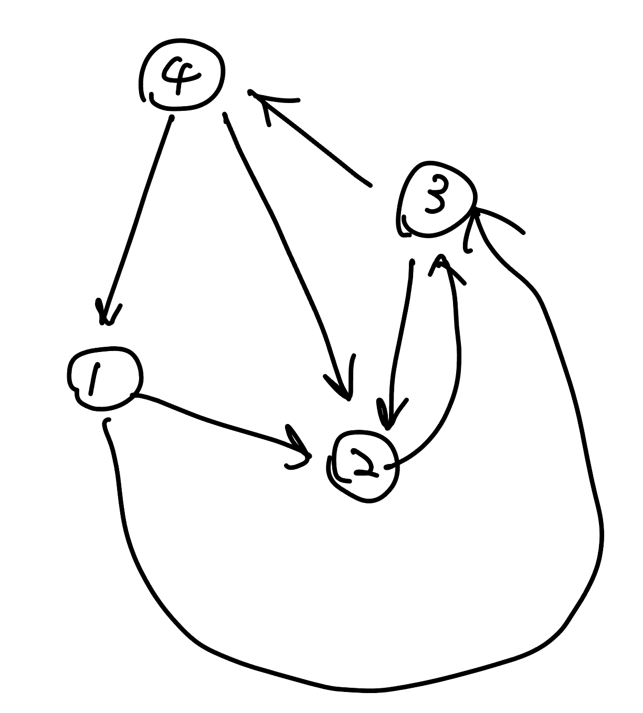

## 雜項主題紀錄 

### 一、縮點

縮點有以下兩種方法：

1. 自己還是自己的編號，但用 disjoint set 模擬縮點
2. 接續 1.，但把縮完的點都用新的編號

第一種方法其實也沒有真正寫一個函式去進行縮點，他的概念就是每次要去看一個點時，直接去他的 disjoint set 裡面 find 他的組別是什麼，那個組別的 leader 就是他縮點後的點的編號。平常要將兩個點合併一樣用 disjoint set 的 union 就好了。例題有 [CF 160 D. Edges in MST](https://codeforces.com/contest/160/problem/D)（在 MST 主題內）。

第二種方法接續第一種作法，但每次我們要縮點的時候就會特別跑進去一個函式，對於每個縮點之後的點我們都會賦予他一個新的編號，然後將目前每個 disjoint set 內同一個集合點的都重新編號成新的編號，然後我們就完全放棄以前的編號，都用新的編號去做事情。例如 [Atcoder AGC002 D - Stamp Rally](https://atcoder.jp/contests/agc002/tasks/agc002_d)（在整體二分主題內），大概念的想法就是縮點後，將不重要的點都刪掉。具體來說，平常的時候我們就會用 disjoint set 的 union 先把需要在同一組的點都給維護好，我們會把之後會需要用到的 edges 還有 queries 都考慮進去，用一個 need 數組，存這些需要用到的點，他們的當前的集合，之後就是把 need 裡面有用到的都賦予新的編號，然後再去 edges 和 queries 幫他們每一項都改成現在新的編號。

<figure markdown>
  { width="300" }
  <figcaption>綠色的是之後會用到的邊，黑色是已經用過的邊</figcaption>
</figure>

### 二、樹上前綴和

???+note "[CSES - Counting Paths](https://cses.fi/problemset/task/1136)"
	給一顆 $n$ 個點的樹，指定 $m$ 條 path，對於每個節點 $1\le i\le n$，問這 $m$ 條 path 有幾條有覆蓋到 $i$。
	
	$n,m\le 2\times 10^5$
	
	??? note "思路"
		對於每個 path，假設他加值 $u\to \ldots \to \text{lca(u,v)}\to \ldots \to v$，假設 lca(u, v) 上面的點是 fa。那麼我們要做的事情就是將 f[u]++，f[v]++，f[lca(u, v)]--，f[fa]--。最後要統計答案的時候，在做一個前綴和，也就是 f[u] = sum(f[v])。

## 題目

???+note "[2021 附中模競 II 惡地之路](https://drive.google.com/file/d/1ISO-o4DrQmbuqVVAgxeVQEO3ifMvcy01/view)"
	給一張 $n$ 點 $m$ 邊無向圖，令 $s$ 到節點 $i$ 走 $k$ 步的最短距離是 $d(i,k)$，對於每個 $i$ 求 $\min \{ d(i,k) \times k \}$
	
	$n\le 2000,m\le 3\times 10^4$
	
	??? note "思路"
		$dp[i][j]=$ 從任何地方走 $i$ 步能走到 $j$ 的最小值
		
		$dp[i][j]=\min \limits_{(k,j) \in E} \{ dp[i-1][k] + dis(k,j) \}$
		
		$O(n(n+m))$ DP
		
		???+note "虛擬碼"
			```cpp linenums="1"
	        for k = 1 ~ n :
	        	for u = 1 ~ n :
	            	for v in G[u] :
	                	dp[v][k] = min(dp[u][k-1] + dis(u, v))
	                    ans = min (dp[v][k] * k)
	        ```
		
	??? note "code(wiwiho)"
		```cpp linenums="1"
		#include <bits/stdc++.h>
	    #define StarBurstStream ios_base::sync_with_stdio(false); cin.tie(0); cout.tie(0);
	    #define eb(a) emplace_back(a)
	    #define mp(a, b) make_pair(a, b)
	    #define F first
	    #define S second
	
	    using namespace std;
	
	    typedef long long ll;
	
	    using pll = pair<ll, ll>;
	
	    int main(){
	        StarBurstStream
	
	        int n, m, s;
	        cin >> n >> m >> s;
	        vector<vector<pll>> g(n + 1);
	        for(int i = 0; i < m; i++){
	            int u, v, p;
	            cin >> u >> v >> p;
	            g[u].eb(mp(v, p));
	            g[v].eb(mp(u, p));
	        }
	
	        vector<ll> dp(n + 1, 1LL << 60);
	        dp[s] = 0;
	        vector<ll> ans(n + 1, 1LL << 60);
	        ans[s] = 0;
	        for(int i = 1; i <= n; i++){
	            vector<ll> dp2(n + 1, 1LL << 60);
	            for(int j = 1; j <= n; j++){
	                for(auto e : g[j]){
	                    dp2[e.F] = min(dp2[e.F], dp[j] + e.S);
	                }
	            }
	            dp = dp2;
	            for(int j = 1; j <= n; j++){
	                if(dp[j] < (1LL << 60)) ans[j] = min(ans[j], dp[j] * i);
	            }
	        }
	        for(int i = 1; i <= n; i++) cout << ans[i] << " ";
	        cout << "\n";
	
	        return 0;
	    }
	    ```

???+note "經典題 - 樹上全點對距離總和"
	給一顆樹，邊權皆為 $1$。求每個點到所有點的距離總和，即 $\sum \limits_{i=1}^n \sum \limits_{j=i+1}^n dis(i, j)$
	
	??? note "思路"
		對於每條邊，他的貢獻是 $sz_v\times (n-sz_v)$

???+note "[CF 771 C. Bear and Tree Jumps](https://codeforces.com/contest/771/problem/C)"
	有一顆 $n$ 個點的樹，樹的邊權皆為 $1$。每步可以順移到距離自己 $\le k$ 的點。令 $f(s,t)$ 為 $s\to t$ 的最小步數，問對於所有 $s=1\ldots n, t = 1\ldots n$， $\sum \limits_{s<t} f(s,t)$ 是多少
	
	$n\le 2\times 10^5$
	
	??? note "思路"
		跟上面「樹上全點對距離總和」有點類似，只是對於一個長度為 $L$，他的貢獻會是 $\lceil\frac{L}{k}\rceil$，我們也可以寫成 $\frac{L+g(L, k)}{k}$，其中 $g(L, k)$ 是我們要幫 $L$ 加多少才能使其被 $k$ 整除。我們將 $\frac{L+g(L, k)}{k}$ 拆成 $L$ 與 $g(L,k)$ 來看，最後在除以 $k$ 即可。$L$ 的總和可以透過「樹上全點對距離總和」的方法計算，而 $g(L,k)$ 的話我們可以 $k^2$ 枚舉對經過定根 $u$ 的左邊跟右邊的長度，然後 ans += g(L, k) * left_cnt * right_cnt，例如說 $k=3$ ，有 $200$ 條 $g(L,k)=2$ 的 path 經過 $u$，那我們就將 ans += 2 * 200
		
	??? note "code"
		```cpp linenums="1"
		#include <bits/stdc++.h>
	    #define int long long
	    using namespace std;
	
	    const int maxn = 2e5 + 5;
	
	    vector<int> G[maxn];
	    int dp[maxn][5]; // dp[u][r] 從 u 往下 L % k == r 的 path 個數
	    int sz[maxn];
	    int n, k, ans;
	
	    int subtract(int a, int b) {
	        return ((a - b) % k + k) % k;
	    }
	
	    void dfs(int u, int par) {
	        dp[u][0] = sz[u] = 1;
	        for (auto v : G[u]) {
	            if (v == par) continue;
	            dfs(v, u);
	
	            for(int i = 0; i < k; i++) {
	                for(int j = 0; j < k; j++) {
	                    int remainder = (i + j + 1) % k;
	                    int needs = subtract(k, remainder);
	                    ans += needs * dp[u][i] * dp[v][j];
	                }
	            }
	
	            for(int i = 0; i < k; ++i) {
	                int ni = (i + 1) % k;
	                dp[u][ni] += dp[v][i];
	            }
	            sz[u] += sz[v];
	        }
	        ans += sz[u] * (n - sz[u]);
	    }
	
	    signed main() {
	        cin >> n >> k;
	        for(int i = 0; i < n - 1; i++) {
	            int u, v;
	            cin >> u >> v;
	            G[u].push_back(v);
	            G[v].push_back(u);
	        }
	        dfs(1, -1);
	        assert(ans % k == 0);
	        cout << (ans / k) << '\n';
	    }
	    ```

???+note "[LOJ #2780. 「BalticOI 2016 Day1」上司们](https://loj.ac/p/2780)"
	有 $n$ 個點，每個點給定一個大小為 $k_i$ 的集合，表示第 $i$ 個點可選的父節點。將這些點組成一棵樹，每個點幫他指定權重 $a_i$，滿足若 $\sum a_v < a_u$（$u$ 的小孩是 $v$）。問 $\sum\limits_{i=1}^n a_i$ 最小可以是多少
	
	$n\le 5000, \sum\limits_{i=1}^n k_i \le 10^4$
	
	??? note "提示"
		cost 的計算有什麼性質? (每個點的貢獻會被哪些點重複計算 ?)
	
	??? note "思路"
		在來我們考慮將題目的 $k_i$ 「反向建邊」，也就是若 $v$ 的父親可以是 $u$，則建邊 $u \to v$，這樣的好處就是我們可以選定起點（root）的話，往下遞迴所得到的 tree edge，就會是我們的樹，但我們目前不確定我們要選定什麼樣子的樹，所以我們繼續分析。
	    
	    <figure markdown>
	      { width="200" }
	      <figcaption>依照題目範測反向建邊得出來的圖</figcaption>
	    </figure>
	
		我們觀察 cost 的計算方式，發現每個點的貢獻都會被他的父親給計算到一次，父親的父親又會算到一次，...。所以對於一個點 u 來說，他的貢獻會被重複算到的地方就是 $u\to\ldots \to rt$ 這條 path 的所有點。 
		
		<figure markdown>
	      { width="200" }
	    </figure>
	    
	    而每個點的貢獻最小就是 1，所以事實上每個點的貢獻總和可以看成所有節點的深度總和。那我們就只要使深度總和最小化。也代表樹應該要越寬越好，其實就是 BFS 的順序。所以實作整理上就是建立反向圖，枚舉起點，BFS 計算答案，在把每個起點算出來的答案取 min 即可。
	    
	??? note "code"
		```cpp linenums="1"
		#include <bits/stdc++.h>
	    #define int long long
	    #define pii pair<int, int>
	    #define pb push_back
	    #define mk make_pair
	    #define F first
	    #define S second
	    #define ALL(x) x.begin(), x.end()
	
	    using namespace std;
	    using PQ = priority_queue<int, vector<int>, greater<int>>;
	
	    const int INF = 2e18;
	    const int maxn = 5e6 + 5;
	    const int M = 1e9 + 7;
	
	    int n, m, ans;
	    int dis[maxn];
	    vector<int> G[maxn];
	
	    void init() {
	        cin >> n;
	        int u, v;
	
	        for (int i = 1; i <= n; i++) {
	            cin >> m;
	
	            while (m--) {
	                cin >> u;
	                G[u].pb(i);
	            }
	        }
	
	        ans = INF;
	    }
	
	    void bfs(int st) {
	        fill(dis, dis + n + 1, 0);
	        queue<int> q;
	        q.push(st);
	        dis[st] = 1;
	
	        while (q.size()) {
	            int u = q.front();
	            q.pop();
	
	            for (auto v : G[u]) {
	                if (dis[v])
	                    continue;
	
	                dis[v] = dis[u] + 1;
	                q.push(v);
	            }
	        }
	
	        int cost = 0;
	
	        for (int i = 1; i <= n; i++) {
	            if (dis[i] == 0)
	                return;
	
	            cost += dis[i];
	        }
	
	        ans = min(ans, cost);
	    }
	
	    void solve() {
	        for (int i = 1; i <= n; i++) {
	            bfs(i);
	        }
	
	        cout << ans << "\n";
	    }
	
	    signed main() {
	        // ios::sync_with_stdio(0);
	        // cin.tie(0);
	        int t = 1;
	
	        //cin >> t;
	        while (t--) {
	            init();
	            solve();
	        }
	    }
	    ```

???+note "[2023 TOI 模擬賽第三場 pE](/wiki/cp/contest/images/TOI-2023-3.pdf#page=11)"
	$2n$ 個人參加一個聚餐，所有人編號為 $1\sim 2n$，對於所有 $1\le i \le n$，編號 $2i-1$ 的人和編號 $2i$ 的人是情侶
	
	聚餐是圍著一個圓桌吃飯，位置按照順時鐘編號為 $1\sim 2n$。每個位置都放有一副餐具，每副餐具都不一樣，每個人都恰好喜歡其中一副餐具，喜歡第 $i$ 副餐具的人編號是 $a_i$
	
	請安排所有人入座並滿足以下兩個條件：
	
	1. 所有情侶要坐在相鄰的兩個位置<br>
	2. 在滿足 1. 的情況下，要盡量多的人坐在有自己喜歡的餐具的位置上。
	
	請輸出滿足以上兩個條件的入座方式。若有多組解，請輸出字典序最小的解
	
	??? note "思路"
		令 $b_i$ 為想做第 $i$ 個位置的人的編號
		
		將 $b_{2i}$ 與 $b_{2i-1}$ 連邊
		
		將 $2i$ 與 $2i-1$ 連邊
		
		連邊代表每條邊左右只能 2 選 1(2 個之中只能有 1 個坐在有自己喜歡的餐具的位置上)
		
		你會得到若干個偶環，長度為 $2$ 的環可以直接配對
		
		其他就挑字典序最小的即可
		
		<figure markdown>
	      { width="600" }
	    </figure>


???+note "[洛谷 P3441 [POI2006]MET-Subway](https://www.luogu.com.cn/problem/P3441)"
	在一棵 $n$ 個點的樹上選出 $k$ 條可相交的 path 使得被覆蓋的點數最多，求該最大值
	
	$k\le n\le 10^6$
	
	??? note "思路"
		假如選了 $u\to \ldots rt \to \ldots \to v$ 可以看做從 $u\to \ldots \to rt,rt\to \ldots \to v$ 的兩條 path
		
		所以問題就變成
		
		> 選 $2k$ 條 $u\to \ldots \to rt$ 的 path 使得被覆蓋的點數最多
		
		我們可以拆成一層一層來看，第 $i$ 層的節點數量一定 $\le$ 第 $i+1$ 層的節點數量
		
		- 若第 $i$ 層節點數量 $\le 2k$ 那一定可以都可以被覆蓋到
		- 若第 $i$ 層節點數量 $> 2k$ 那我們就只能選 $2k$ 個覆蓋
	
		所以答案就是 $\sum \limits_{i=1}^{\text{depth}}\min \{2k, \text{num}_i\}$ 其中 $\text{num}_i$ 是第 $i$ 層的節點數量

???+note "[洛谷 P8384 [POI2004] SZN](https://www.luogu.com.cn/problem/P8384)"
	給一顆 $n$ 個點的樹，問至少要用幾條不重疊的 path 才能將圖覆蓋，並且這些 path 裡面長度最長的最少可以是多少
	
	$n\le 10^4$
	
	??? note "思路"
		第一個答案顯然是 $\displaystyle \frac{\deg[i]-1}{2}$
		
		其中 $\deg[i]$ 代表點 $i$ 的度數，$\deg[rt]$ 要記得特判因為沒有父親
		
		因為其中一條可以往父親方向上傳
		
		---
		
		再來是第二個答案，因為能用的 path 的數量已經固定，所以我們就在 path 的數量固定下討論能連的可能性，最小化最大值 ⇒ 二分搜
		
		我們先來討論非 root 的情況
	
	    若為偶數
	    
	    - 上傳 : 兩兩配對，剩下的兩個一個單獨成線 (max)，另一個上傳 (二分)
	
		<figure markdown>
	      { width="200" }
	    </figure>
			
	    - 不上傳 : 兩兩配對
	
	    若為奇數
	
	    - 上傳 : 兩兩配對，選一個傳上去，且傳上去的要越小越好，卻又不能使剩下的無法配對 ⇒ 二分搜。單調性的話例如移除長度為 10 的可以，那麼移除長度為 11 一定也可以。
	
	    - 不上傳 : 不可能
	
		再來討論 root 的情況
		
		若為偶數 : 兩兩配對
	
	    若為奇數 : 檢查最大的是否合法，剩下兩兩配對
	    
	    > ref : <https://blog.csdn.net/C20181220_xiang_m_y/article/details/102564783>
	    
	??? note "code"
		```cpp linenums="1"
		#include <bits/stdc++.h>
	    #define int long long
	    #define pii pair<int, int>
	    #define pb push_back
	    #define mk make_pair
	    #define F first
	    #define S second
	    #define ALL(x) x.begin(), x.end()
	
	    using namespace std;
	
	    const int INF = 2e18;
	    const int maxn = 3e5 + 5;
	    const int M = 1e9 + 7;
	
	    int n, cnt, lim;
	    vector<int> G[maxn];
	    int deg[maxn], f[maxn], g[maxn];
	
	    int check(int x) {
	        for (int l = 1, r = cnt; l < r; l++, r--) {
	            if (l == x) l++;
	            if (r == x) r--;
	            if (l < r && g[l] + g[r] > lim) return false;
	        }
	        return true;
	    }
	
	    int dfs(int u, int par) {
	        for (auto v : G[u]) {
	            if (v == par) continue;
	            if (dfs(v, u) == 0) return 0;
	        }
	        cnt = 0;
	        for (auto v : G[u]) {
	            if (v == par) continue;
	            g[++cnt] = f[v];
	        }
	        sort(g + 1, g + cnt + 1);
	        if (u == 1) {
	            if (cnt & 1) {
	                cnt--;
	                return check(0);
	            } else {
	                return check(0);
	            }
	        }
	        if (cnt % 2 == 0) {
	            if (check(0)) {
	                f[u] = 1;
	                return 1;
	            }
	            cnt--;
	        }
	
	        int l = 1, r = cnt + 1;
	        while (l < r) {
	            int mid = (l + r) / 2;
	            if (check(mid)) r = mid;
	            else l = mid + 1;
	        }
	        if (l == cnt + 1) return 0;
	        f[u] = g[l] + 1;

            return f[u] <= lim;
        }
    
        void init() {
            cin >> n;
    
            int u, v;
            for (int i = 1; i <= n - 1; i++) {
                cin >> u >> v;
                G[u].pb (v);
                G[v].pb (u);
                deg[u]++, deg[v]++;
            }
            int sum = 0;
            sum += (deg[1] + 1) / 2;
            for (int i = 2; i <= n; i++) {
            	sum += (deg[i] - 1) / 2;
            }
            cout << sum << " ";
        }
    
        void solve() {
            int l = 1, r = n - 1;
    
            while (l < r) {
                int mid = (l + r) / 2;
                lim = mid;
    
                if (dfs(1, 0)) r = mid;
                else l = mid + 1;
            }
    
            cout << l << "\n";
        } 
    
        signed main() {
            // ios::sync_with_stdio(0);
            // cin.tie(0);
            int t = 1;
            //cin >> t;
            while (t--) {
                init();
                solve();
            }
        } 
        ```

???+note "[LOJ #3943. 「JOI 2023 Final」训猫](https://loj.ac/p/3943)"
	給一個 $n$ 個點的樹，每個節點有高度 $h_i$，節點的高度是一個 permutation，有一隻貓現在在 $h_i=n$ 的那個節點上。可以一直刪點，若刪到貓所在的節點那貓就會移到當前連通塊內高度最高的點，求貓每次移動的距離總和最大可以是多少
	
	??? note "思路"
		假設我們目前的圖長這樣
		
		<figure markdown>
	      { width="400" }
	      <figcaption>$n=14$，藍色的字為每個節點的 $h_i$</figcaption>
	    </figure>
		
		當我們刪掉 $h_i=14$ 的點後，貓可以選擇往三個連通塊的最高點跑，然後執行子問題
		
		假如 $h_i=14$ 的子問題算出來的答案是這樣
		
		<figure markdown>
	      { width="400" }
	    </figure>
	    
	    那麼答案就是 
	    
	    $$ans_u=\max \{ ans_x+\text{dis}(u,x) \}$$ 
	    
	    其中 $x$ 是 $v$ 的連通塊內高度最高的節點
	    
		可是若以此分治，考慮樹是一條 chain，那最糟可達 $O(n^2)$
		
		---
		
		我們依照上面子問題執行的步驟，建一個新的樹
		
		<figure markdown>
	      { width="300" }
	      <figcaption>邊權為兩點間的 distance</figcaption>
	    </figure>
	    
	    那麼整題的答案就是樹高度
	    
	    重點是要怎麼建立這個樹呢 ?
	    
	    我們發現我們每次在做的事情就是一直斷邊，$h_i$ 越小的越晚斷
	    
	    所以我們可以倒著想，我們從 $h_i=1$ 開始，每次 merge 周圍最小的節點
	    
	    再來看看 $h_i=2$ 是否已備 merge 過，若還沒再繼續 merge，以此類推
	    
	    以新圖來看我們在做的事情就是從 leaf 慢慢把樹蓋上去
	    
	    至於要怎麼 merge，我們每個點用 pq(min heap) 維護周圍節點的 $\texttt{pair}(h_i,i)$ 
	    
	    兩個點 merge 起來用啟發式合併，但要注意可能會算到已算過的節點，所以在 pop 的時候檢查此編號是否已經在同一個 DSU 內

???+note "[CF 1586 E. Moment of Bloom](https://codeforces.com/contest/1586/problem/E)"
	給一張 $n$ 點 $m$ 邊的無向連通圖，一開始邊權皆為 $0$。有 $q$ 次操作:
	
	- 對簡單路徑 $u\to \ldots \to v$ 經過的所有邊權 $+1$ 
	
	判斷能否使得所有邊權都為偶數，如果可以，請輸出所有操作的路徑上的點，如果不行，輸出至少還需要多少操作才能使得上述結果。
	
	$n,m,q\le 3\times 10^5,n\times q\le 3\times 10^5,L\le 10^9$
	
	??? note "思路"
		考慮與每個點相鄰的所有邊被改變的次數之和的奇偶性，不難發現除了兩個端點，路徑其它節點的奇偶性都不會改變。
		
		對於每個點每個點記錄成為端點次數的奇偶性，如果都是偶數就代表有解，否則如果至少有一個點 u 是奇數，就會發生無解的情況（因為 u 的鄰邊被經過了奇數次，鄰邊就必然有一條邊被經過奇數次）。至於最後再補上去的邊的數量，就是奇數的端點數除以 2，因為一條路徑最多也一定可以消滅兩個成為端點次數是奇數的節點。
		
		<figure markdown>
	      { width="300" }
	    </figure>
	    
	    否則對原圖求任意生成樹，輸出方案就是端點之間的簡單路徑。	
	    
	    ---
	    
	    【正確性證明】
	    
	    考慮構造一張新圖，對於操作 (u, v) 在新圖上由點 u 向點 v 連一條邊。這樣新圖形成若干個連通分量，考慮每個連通分量的度數都是偶數這麼這個連通分量必定存在歐拉迴路，從起點出發必定回到終點。在新圖的歐拉迴路的路徑上由 u 走到 v，對應的就在生成樹上從 u 走到 v。最後返回起始點的時候，因為是在樹上走，所以相當於抵消了之前走的所有奇數邊。所以這麼構造是合法的。

???+note "[2014 全國賽 p3](https://cs.cysh.cy.edu.tw/competition_problem_set/%E5%85%A8%E5%9C%8B103.pdf#page=7)"
	給 $n$ 個關卡，跟一個集合點，關卡 $i$ 有一條有向邊連接著關卡 $i+1$，邊權是 $c_i$，集合點與每個關卡 $i$ 之間都有一條雙向邊，邊權是 $d_i$，每個關卡上都有價值 $p_i$，拿過了就會消失。
	
	<figure markdown>
	  { width="300" }
	</figure>
	
	給你 $R$ 個士兵，一個士兵只能從集合點出發繞過一些路徑回到集合點，且走過的邊權總和不能超過 $B$，問這些士兵最大可取得的價值總合為多少
	
	$R\le n\le 2000,B\le 10^6$
	
	??? note "思路"
		我們考慮 dp
		
		令 $dp(i,j)$ 關卡 $1\sim i$，派出 $j$ 個人可獲得的最大價值
		
		$$dp(i,j)=\max\limits_{k=1\sim i} \begin{cases}dp(i-1, j)+\text{cost}(i)\\ dp(k-1,j-1)+\text{cost}(k, i) \texttt{ if ok}(k, i) \end{cases}$$
		
		假設 $\texttt{ok}(k, i)$ 是 $O(1)$，dp 的時間就是 $O(n^2)\times O(n)=O(n^3)$
		
		如何改成 $O(1)$ 呢 ?
		
		可以觀察到 $k$ 越小越好，所以我們對於每個 $i$ 直接挑最小合法的 $k$ 即可
		
		所以我們必須先有 $\texttt{ok}(l, r)$ 來判斷說區段合不合法才能來找 $k$
		
		- $a_i:$ 集合點到關卡 $i$ 的 最短距離
			- $a_i=\min \{d_i,a_{i-1}+c_{i-1} \}$
		
		- $b_i:$ 關卡 $i$ 回到集合點的最短距離
			- $b_i=\min \{d_i, b_{i+1}+c_{i+1} \}$
		
		$\texttt{ok}(l, r):a_l+b_r+ \texttt{sum}(c_l,\ldots, c_r)$
		
		利用 $\texttt{ok}(l,r)$ 在 $O(n^2)$ 對於每個 $i$ 預處理最小合法的 $k$

???+note "[CSES - Even Outdegree Edges](https://cses.fi/problemset/task/2179)"
	給一張 $n$ 點 $m$ 邊無向圖，將邊定向，問是否能使所有的點的 out degree 是偶數
	
	$n\le 10^5, m\le 2\times 10^5$
	
	??? note "hint"
		先想 chain 的 case
	
	    然後想 tree 的（葉子旁邊的邊要指向哪裡？
	
	    然後就可以延伸到 graph 了
		
	??? note "思路"
		我們先考慮 Tree 的 case，對於一個 $u$，我們可以先做好所有的 $v$，再看 $v$ 的 out degree 是奇偶來決定 edge$(u,v)$ 的方向。同理放在圖上只是會多一些 back edge，因為最後 root 的奇偶我們是沒辦法決定的，所以將 out degree 的貢獻放在深度比較深的點才能越好處理掉
		
	??? note "code"
		```cpp linenums="1"
		#include <bits/stdc++.h>
	    #define int long long
	    #define pii pair<int, int>
	    #define pb push_back
	    #define mk make_pair
	    #define F first
	    #define S second
	    #define ALL(x) x.begin(), x.end()
	
	    using namespace std;
	
	    const int INF = 2e18;
	    const int maxn = 3e5 + 5;
	    const int M = 1e9 + 7;
	
	    int n, m, stamp = 1;
	    vector<int> G[maxn];
	    int t[maxn], odd[maxn];
	    vector<pii> ans;
	
	    void dfs (int u, int par) {
	        t[u] = stamp++;
	        for (auto v : G[u]) {
	            if (v == par) continue;
	            if (!t[v]) {
	                dfs (v, u);
	                if (odd[v]) {
	                    ans.pb({v, u});
	                    odd[v] = 0;
	                } else {
	                    ans.pb({u, v});
	                    odd[u] ^= 1;
	                }
	            } else if (t[v] < t[u]) {
	                ans.pb({u, v});
	                odd[u] ^= 1;
	            }
	        }
	    }
	
	    void init() {
	        cin >> n >> m;
	        int u, v;
	        for (int i = 0; i < m; i++) {
	            cin >> u >> v;
	            G[u].pb(v);
	            G[v].pb(u);
	        }
	    }
	
	    void solve() {
	        for (int i = 1; i <= n; i++) {
	            if (!t[i]) dfs (i, 0);
	        }
	
	        if (accumulate (odd + 1, odd + n + 1, 0)) cout << "IMPOSSIBLE\n", exit(0);
	        for (auto [u, v] : ans) cout << u << " " << v << "\n";
	    } 
	
	    signed main() {
	        // ios::sync_with_stdio(0);
	        // cin.tie(0);
	        int t = 1;
	        //cin >> t;
	        while (t--) {
	            init();
	            solve();
	        }
	    } 
	    ```

???+note "[CF 1527 D. MEX Tree](https://codeforces.com/problemset/problem/1527/D)"
	給一顆 $n$ 個點的樹，node 編號為 $0\ldots (n-1)$。對於每個 $k = 0\ldots n$，輸出有幾個 path 上 node 的集合的 mex 為 $k$
	
	$2\le n\le 2\times 10^5$
	
	??? note "思路"
		見 <https://www.acwing.com/file_system/file/content/whole/index/content/3177876/>

