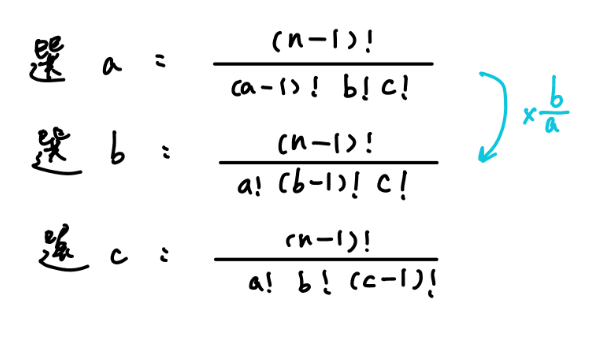

## Prufer code

- [Oi wiki Prüfer code](https://oi-wiki.org/graph/prufer/#pr%C3%BCfer-%E5%BA%8F%E5%88%97%E7%9A%84%E6%80%A7%E8%B4%A8)

Prüfer 是這樣建立的：每次選擇一個編號最小的葉結點並刪掉它，然後在序列中記錄下它連接到的那個結點，重複 $n-2$ 次後就只剩下兩個結點，算法結束

??? note "範例圖"
    <figure markdown>
      { width="700" }
    </figure>

### 性質

1. 在構造完 Prüfer 序列後原樹中會剩下兩個結點，其中一個一定是編號最大的點 n

2. 每個結點在序列中出現的次數是其度數減 1（沒有出現的就是葉結點）

下面是模板題

???+note "[CSES - Prüfer Code](https://cses.fi/problemset/task/1134)"
	給定長度為 $n-2$ 的 Prüfer 序列，求此 Prüfer 序列構成的樹
	
	$3 \le n \le 2 \cdot 10^5$
	
	??? note "思路"
		維護當前的 leaf 有哪些即可
		
	??? note "code"
		```cpp linenums="1"
		#include <bits/stdc++.h>
	    #define int long long
	    #define pii pair<int, int>
	    #define pb push_back
	    #define mk make_pair
	    #define F first
	    #define S second
	    #define ALL(x) x.begin(), x.end()
	
	    using namespace std;
	
	    const int INF = 2e18;
	    const int MAXN = 3e5 + 5;
	    const int M = 1e9 + 7;
	    
	    set<int> st;
	    int n;
	    int a[MAXN];
	    int cnt[MAXN];
	
	    void init() {
	        cin >> n;
	        for (int i = 1; i <= n; i++) st.insert(i);
	
	        int x;
	        for (int i = 1; i <= n - 2; i++) {
	            cin >> a[i];
	            cnt[a[i]]++;
	            if (st.find(a[i]) != st.end()) st.erase(st.find(a[i]));
	        }
	    }
	
	    void solve() {
	        for (int i = 1; i <= n - 2; i++) {
	            int x = *st.begin();
	            st.erase(st.begin());
	            cout << x << " " << a[i] << '\n';
	            cnt[a[i]]--;
	            if (cnt[a[i]] == 0) st.insert(a[i]);
	        }
	        int x = *st.begin();
	        st.erase(st.begin());
	        int y = *st.begin();
	        cout << x << " " << y << '\n';
	    } 
	
	    signed main() {
	        // ios::sync_with_stdio(0);
	        // cin.tie(0);
	        int t = 1;
	        //cin >> t;
	        while (t--) {
	            init();
	            solve();
	        }
	    } 
	    ```

???+note "[全國賽 2022 pG](https://sorahisa-rank.github.io/nhspc-fin/2022/problems.pdf#page=21)"
	設 $T$ 為一棵有 $n$ 個節點的樹，節點編號 $1, 2, \ldots , n$，已知 $T$ 每個節點的 degree 為 $d_1,d_2,\ldots ,d_n$，其中 $d_i$ 為點 $i$ 的 degree，求出 $T$ 所有可能的 Prüfer 序列中，字典序第 $k$ 小的，如果沒有輸出 $-1$
	
	$3<n\le 10^3,1\le k\le 10^9$
	
	??? note "思路"
		根據上面 Prüfer 序列的性質 2，題目就變成 :
		
		有一個陣列，第 $i$ 個數字出現 $d_i-1$ 次，求字典序第 $k$ 小的
		
		至於要怎麼求字典序第 $k$ 小，要先會寫 [TIOJ 2052](https://tioj.ck.tp.edu.tw/problems/2052)
		
		我們填 $i$，填完剩 $d_i-1$ 個 $i$，還剩 $n$ 個空格可以填
		
		$$\frac{n!}{a!\times b!\times c! \times d!}$$
		
		我們可以用取 $\log$ 的方法來估計「大概」的答案，同時也用 $C^n_k\pmod{10^9+7}$ 的方法算出「精確」的答案。
		
		$\log$ 的方法是因為 $\frac{n!}{a!\times b!\times c! \times d!}=\log n!-\log a!-\log b! - \log c! - \log d!$。可以先預處裡 $\log n!=\sum_{i=1}^n \log i$
		
		因為最後的答案 $\le 10^9$，依照**模逆元的正確性**，將 $\frac{n!}{a!\times b!\times c! \times d!}$ 直接算出來再 $\pmod{10^9+7}$ 跟 $\frac{n!}{a!\times b!\times c! \times d!}$ 利用組合數 + 模逆元的方法算出來是相同的
		
		那麼換選另一個數的時候 :
		
		<figure markdown>
	      { width="300" }
	    </figure>
		
		$\log$ 的計算 : $-\log(a-1)! + \log a! - \log b! + \log (a-1)!$
		
		$C^n_k\pmod{10^9+7}$ 的計算 : $\times b \times \text{inv}(a)$
	
	??? note "code"
		```cpp linenums="1"
		#include <bits/stdc++.h>
	    #define int long long
	    #define pii pair<int, int>
	    #define pb push_back
	    #define mk make_pair
	    #define F first
	    #define S second
	    #define ALL(x) x.begin(), x.end()
	
	    using namespace std;
	
	    const double mxLog = 9;
	    const int INF = 1e18;
	    const int maxn = 3e5 + 5;
	    const int M = 1e9 + 7;
	    const long double EPS = 1e-8;
	
	    int n, k;
	    int d[maxn];
	    double preLog[maxn];  // preLog[i] = log(i!)
	    int prei[maxn], pinv[maxn], pref[maxn];
	
	    void build() {
	        preLog[0] = 0;
	        for (int i = 1; i <= n; i++) {
	            preLog[i] = preLog[i - 1] + log10(i);
	        }
	
	        prei[0] = prei[1] = pinv[0] = pinv[1] = pref[0] = pref[1] = 1;
	        for (int i = 2; i < maxn; i++) {
	            pref[i] = pref[i - 1] * i % M;
	            pinv[i] = (M - (M / i) * pinv[M % i] % M) % M;
	            prei[i] = prei[i - 1] * pinv[i] % M;
	        }
	    }
	
	    vector<int> work(int _n, int _k, const int _d[]) {
	        n = _n;
	        k = _k;
	        k--;
	        for (int i = 1; i <= n; i++) {
	            d[i] = _d[i];
	            d[i]--;
	        }
	
	        build();
	        vector<int> ans;
	        for (int t = n - 2; t >= 1; t--) {
	            int f, flag = false;
	            for (int i = 1; i <= n; i++) {
	                if (d[i]) {
	                    f = i;
	                    break;
	                }
	            }
	            double big = preLog[t - 1];
	            int small = pref[t - 1];
	
	            for (int i = 1; i <= n; i++) {
	                if (i == f) {
	                    big = big - preLog[d[i] - 1];
	                    small = (small * prei[d[i] - 1]) % M;
	                } else if (d[i]) {
	                    big = big - preLog[d[i]];
	                    small = (small * prei[d[i]]) % M;
	                }
	            }
	            int val;
	            if (big - mxLog > EPS) {
	                val = INF;
	            } else {
	                val = small;
	            }
	            for (int i = 1; i <= n; i++) {
	                if (d[i]) {
	                    if (i != f) {
	                        big += preLog[d[f] - 1] + preLog[d[i]];
	                        big -= preLog[d[f]] + preLog[d[i] - 1];
	                        small = (((small * pinv[d[f]]) % M) * d[i]) % M;
	                        if (big - mxLog > EPS) {
	                            val = INF;
	                        } else {
	                            val = small;
	                        }
	                        f = i;
	                    }
	                    if (k >= val) {
	                        k -= val;
	                    } else {
	                        ans.pb(i);
	                        d[i]--;
	                        flag = true;
	                        break;
	                    }
	                }
	            }
	            if (flag == false) {
	                return {-1};
	            }
	        }
	        return ans;
	    }
	
	    signed main() {
	        int n, k;
	        cin >> n >> k;
	        int d[1005];
	        for (int i = 1; i <= n; i++) cin >> d[i];
	        vector<int> ans = work(n, k, d);
	        for (auto ele : ans) cout << ele << '\n';
	    }
	    ```