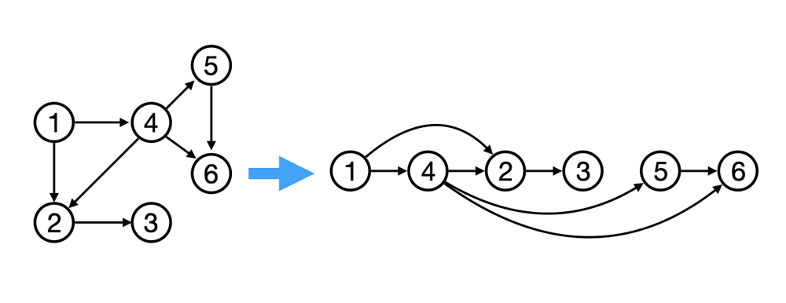
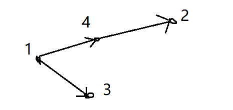
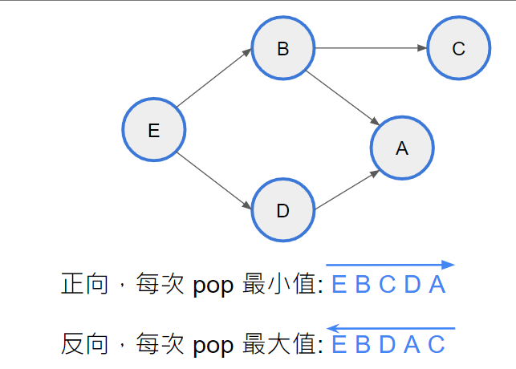

## 引入

拓撲排序是一種用於有向無環圖（DAG）的排序方法，它能夠將圖中的節點按照一定的順序排列，使得對於任意一條從節點 $u$ 到節點 $v$ 的有向邊，節點 $u$ 在排序結果中出現在節點 $v$ 的前面。換句話說，拓撲排序確保了圖中所有的依賴關係都得到了滿足。由於在一個 DAG 中可能存在多種拓撲排序，因此拓撲排序的結果不一定唯一。

拓撲排序的目標是找到一個節點的順序 $v_1, v_2, \ldots, v_n$，使得對於所有 $i > j$，圖上不存在從 $v_i$ 到 $v_j$ 的路徑。這樣的排序序列可以通過不斷將入度為 0 的節點加入排序序列中，並從圖中刪除這些節點及其相連的邊來實現。

<figure markdown>
  { width="450" }
</figure>

簡單來說，拓撲排序就是將 DAG 中的節點按照依賴關係的先後順序進行排序的一種算法。

!!! info "拓樸排序判環"
	執行拓樸排序，若迴圈結束時判斷已經造訪的結點數是否等於 n。等於 n 說明全部結點都被訪問過，無環；反之，則有環。

## 同一個 level 的放一起

某些題目會要求一個 level 一個 level 做事情，在這種情況，我們使用兩個 queue，一個存當前 level 的 node，一個存之前 level 的 node，當一層 level 跑完後，再將兩個 queue 的東西互換。

???+note "code"
	```cpp linenums="1"
	void topo() {
        queue<int> q;
        while (q.size()) {
            queue<int> nq;
            while(q.size()) {
                auto u = q.front(); 
                q.pop();

                for (auto v : G[u]) {
                    deg[v]--;
                    if (deg[v] == 0) {
                        nq.push(v);
                    }
                }
            }
            q = nq;
        }
    }
    ```

## 拓樸排序的字典序問題

以下兩個題看似都是字典序問題，但是有差別的。

???+note "問題一"
	給一張 n 點 m 邊 DAG，輸出**字典序最小的**拓樸排序
	
	$n\le 10^5, m\le 2\times 10^5$
	
	??? note "思路"
		同時用 priority queue（小頂堆），這樣就能保證，拓樸序列不唯一時，編號小的優先，即字典序最小。
	
???+note "問題二 [CSES - Course Schedule II](https://cses.fi/problemset/task/1757)"
	給一張 n 點 m 邊 DAG，輸出拓樸排序，滿足**編號小的盡量靠前**
	
	$n\le 10^5, m\le 2\times 10^5$
	
	??? note "題意解釋"
		<figure markdown>
	      { width="300" }
	    </figure>
	    
	    很明顯字典序最小的是 [1, 3, 4, 2]。但卻不是本題的答案，因為本題要求「編號小的盡量靠前」，編號 2 還可以提前的，所以 [1, 4, 2, 3] 才是正確的序列。
		
	??? note "思路"
		<figure markdown>
	      { width="300" }
	    </figure>
	
		看上圖，我們從 1 開始走，鄰接點 3 和 4，我們不知道後面還有個 2，所以不知道 3和 4 先選誰，故正向尋找是錯的。
		
		我們發現從正向考慮沒有辦法考慮到後面所造成的結果。所以我們嘗試反向走，從最後面往前走，優先走編號大的。最後把序列倒著輸出，如此，就滿足了本題。
		
		<figure markdown>
	      { width="300" }
	      <figcaption>另一個例子，助於理解</figcaption>
	    </figure>
	    
	    正確性說明:  走不到 u 的人我一定可以讓它放在 u 後面。某個點要被 pop 掉了，代表走不到他的且比他大的都走完了。所以剩下的只有可能是
	    
	    - 走的到 u 的
	    - 走不到 u 但比 u 小的，這時候我們將 u 放在越後面越好
		
		> 參考: <https://blog.csdn.net/winter2121/article/details/79437927>

## 例題

???+note "[CSES - Acyclic Graph Edges](https://cses.fi/problemset/task/1756)"
	給一張 n 點 m 邊無向圖，將邊定向使圖是無環的
	
	$n\le 10^5, m\le 2\times 10^5$
	
	??? note "思路"
		根據拓樸排序的性質，我們可以將每條邊都定為小的連到大的方向

???+note "[2023 全國賽 C. 與自動輔助駕駛暢遊世界 (Autocopilot)](https://sorahisa-rank.github.io/nhspc-fin/2023/problems.pdf#page=11)"
	給一張 n 點 m 邊的有向圖，有一個機器人要從起點 s 跟終點 t。當遇到叉路，他會隨機走其中一條，而我們可以花費一個硬幣，可以強制決定他要走的方向，問至少要帶多少錢，才可以保證不會走到死路
	
	$n\le 3000, m\le 3\times 10^4$
	
	??? note "思路"
		【Subtask: 圖是 DAG】
		
		先判斷: 
		
		- 哪些點是一定走不到 t，dead node
	
		- 哪些點是有機率走到 t
	
		- 哪些點是一定走得到 t
	
		這可以利用從 out degree = 0 的 node 去 dfs 出去來判斷。之後，我們就可以利用 DAG dp 來看每個點最少要付多少錢。令 dp(u) 從 u 走到終點 t，最少要付多少錢，我們可以列出轉移式:
		
		- 如果 u 不可能走到 t, dp(u) = INF
		
		- dp(u) = $\min_{u→v} \{$ 
			- 要花錢，$1 + \min\{ dp(v) \}$
			
			- 不花錢 $\max\{ dp(v) \}$

???+note "[USACO 2013 JAN Party Invitations S](https://www.luogu.com.cn/problem/P3068)"
    有 n 頭牛，每頭牛有它自己的朋友圈，沒有一個完全與之相同的。假設該牛朋友圈有 k 頭牛，若已經邀請了 k - 1 頭，那麼剩下的那頭牛也得邀請。問再邀請 1 號牛的情況下，最少需要邀請多少頭乳牛?

	$n\leq 10^6, \sum k \leq 2.5 \times 10^5$
	
	??? note "思路"
		我們可以把每頭牛想成是一個狀態，利用拓樸排序解決問題。我們利用 vector 存與 i 有關的朋友圈編號，用 set 存朋友圈的集合。
		
		第一次就是將 1 加入 queue，然後循環 vector，把循環到的集合中的 1 都刪去，判斷刪去後的集合大小是否為 1，如果大小是 1，就入隊，重複操作。坑點就是，出來的可能會被重複做，加一個陣列判斷一下是否已經選了這頭奶牛。
		
	??? note "code"
		```cpp linenums="1"
		#include <cstdio>
	    #include <iostream>
	    #include <queue>
	    #include <set>
	    #include <vector>
	    using namespace std;
	
	    int n, m, ans, vis[1000005];
	    set<int> s[250005];
	    vector<int> G[1000005];
	    queue<int> q;
	
	    int main() {
	        cin >> n >> m;
	        for (int i = 1; i <= m; i++) {
	            int t;
	            cin >> t;
	            for (int j = 1; j <= t; j++) {
	                int x;
	                cin >> x;
	                G[x].push_back(i);
	                s[i].insert(x);
	            }
	        }
	        q.push(1);
	        vis[1] = 1;
	        while (!q.empty()) {
	            int now = q.front();
	            q.pop();
	            ans++;
	            for (int i = 0; i < G[now].size(); i++) {
	                s[G[now][i]].erase(now);
	                if (s[G[now][i]].size() == 1 && !vis[*s[G[now][i]].begin()]) {
	                    int t = *s[G[now][i]].begin();
	                    q.push(t);
	                    vis[t] = 1;
	                }
	            }
	        }
	        cout << ans << '\n';
	        return 0;
	    }
		```

- JOI 2016 p3
- 2015 nhspc p5
- 2022 toi mock 1 pA
- 2021 nhspc pD