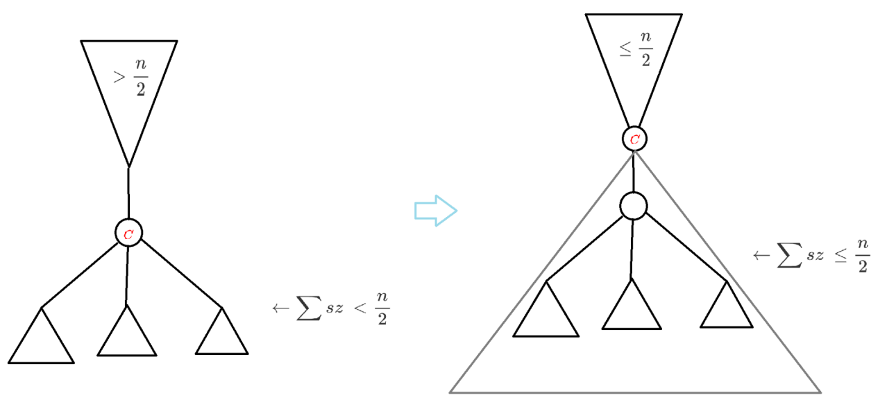
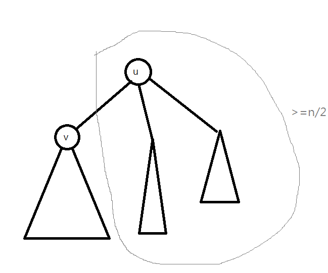

## 引入

???+note "[CSES - Finding a Centroid](https://cses.fi/problemset/task/2079)"
	給一顆 $n$ 個點的樹，輸出樹重心
	
	$1\le n\le 2\times 10^5$

以每個點當 root 時的最大子樹大小，這個值最小的點稱樹重心

## 證明

### 引理 1

【引理 1】 : 將樹重心拔掉後，每個連通塊的 size $\le \lfloor \frac{n}{2} \rfloor$

反證法，令 size 會 > n/2，往 size > n/2 的方向一直移動，最後會到一個 threshold，滿足子樹 size 都 <= n / 2，以這個點當樹重心顯然更好

<figure markdown>
  { width="600" }
</figure>

### 引理 2

【引理 2-1】 : 當某個點 u 拔掉後，每個連通塊的 size $\le \lfloor \frac{n}{2} \rfloor$，u 是樹重心

【引理 2-2】 : 這種 u 至多有兩個，且這兩個重心相鄰

假設樹重心當 v 會更好，因為最大子樹越小越好，所以 v 會想在 u 以下的最大子樹內，這樣重新定根時就可以把最大子樹變得更小。當我們重新定根後，會發現旁邊的子樹聯集起來的 size 是 n - (<= n/2) 會 >= n / 2，顯然 > n/2 的 case 都不合法，我們就只考慮 = n/2，此時 v 是一個合法的樹重心，當 v 想在做一樣的事情時，只能往 u 所在的子樹移動，又會變成以 u 為根的樹重心。所以我們可以得知，最多只會有兩個樹重心

<figure markdown>
  { width="400" }
</figure>

## 實作

???+note "code"
	```cpp linenums="1"
    vector<int> centriods;
    void dfs(int u, int par) {
        sz[u] = 1;
        int mx = 0;
        for (auto v : G[u]) {
            if (v == par) continue;
            dfs(v, u);
            sz[u] += sz[v];
            mx = max(w, sz[v]);
        }
        mx = max(n - sz[v], mx);
        if (mx <= n / 2) {
            centriods.push_back(u);
        }
    }
    ```

